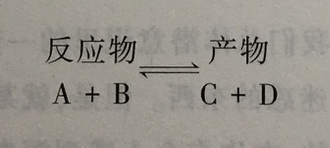

第七部 化学魔术

## 0701. 催化剂

在哈伯合成氨的成就当中，最重要的就是催化剂的发明。深具洞见的化学家扎尔（Richard Zare）说：「若要我选择一个最能捕捉化学特性的字眼，那么非「催化剂」莫属。没有任何领域有和「催化剂」相等的事物。

扎尔是对的。催化剂的确很接近化学的中心，只要少量添加到反应中，就能使反应变快，而且通常会快很多，它是参与反应后又能再生的物质。同时，催化作用还触及两项人类的原始课题，那就是：

1、它把几乎不可能的事变成可能，也就是克服障碍。

2、它是消耗与再生的奇迹，也就是死亡与复活的奇迹。

因为这些课题是我们总体潜意识里的一部分，所以，化学催化剂是令非化学家感到迷惑的东西。但是，就某些基本面来说，催化剂也是可以充分了解的：在许多令人感到深奥难解的科学之中，催化剂算是可以为人们所领会与认同的事物。

这儿的两个实例有助于表现这种概念的普适性。其中之一是歌德用拟人化笔法写了一本独特的化学小说《亲和力》（此书在「催化剂」一词创造出来的前几十年，就已经出版了），书中出现一个作「米特勒」（Mittler）的古怪角色。他把「绝不进入任何有争端待解决或有疑义要解释的房子，当成一生最重要的行事原则」。

另一个例子则是，将近两百年后，美国时尚设计师哈斯顿（Roy Halston Frowick）决定要引介一种新款香水。他们与营销顾问凭借他们对香味的感觉，共同创造出名为「催化剂」的香水，还利用《纽约时报》上多页篇幅来夸示这项产品，使它充满色情隐喻。那位广告公司的撰稿员想必曾经上过化学课，因为广告词上这么写着：

气候逐渐改变……

扰动了平衡……

催化剂，

献给有能力改变明日的现代女性

女人味、浪漫，和少许能造成分裂的——

催化剂…

催化作用的基本特性很容易了解。拿一个典型的化学反应来说吧：

我们知道所有这样的反应都是平衡的，也就是双向反应同时发生。然而，屡见不鲜的是，我们把 A 和 B 混合了，但几乎什么反应也没发生（对我们真正希望发生的反应来说，似乎总是如此），反应物仍然保持原样。更确切地说吧，平衡并未迅速达成。且让我们看看为何如此。

由于反应物 A 和反应物 B 是原子以某些特殊方式相互键结所构成的分子，C 和 D 则是以与 A、B 完全相同的原子构成的相异分子。所以要使反应从 A 和 B 产生 C 和 D，化学键必须先断裂，然后再形成新的键结。但是，要使旧有的键结松开，必须消耗能量；而且在反应前期，或许还无法感觉到产物的新键结占有优势。总而言之，造成这种结果的原因是一一活化能反应障碍。

因此我们尝试用催化剂，也许是一种元素或化合物，添加到反应的分子（多半是混合物）中。就把这催化剂称为 X 吧（事实上，化学公司使用的催化剂，常常是商业机密）。催化剂 X 并不是站在一旁，以变魔术的方式作用，而是直接参与反应，并且能启动一连串反应，但这些反应显示的净结果，却好像没有催化剂参与一样。这里就有个最简单的催化剂作用形式：

	A+X→←AX

	AX+B→←C+D+X

你可以看到，A 反应物和催化剂作用产生了「中间产物」，也就是分子 AX。这个中间产物的寿命很短，很快就和另一种反应物（姑且叫它 B）发生反应。第二个反应则是用一步或好几步的方式，生成产物 C 和 D，并且重新生成催化剂 X。然后再生的催化剂马上又去引导另一批反应物来跳这场分子之舞。

请注意，全部的变化刚好就是：

	A+B→←C+D

为了不让你以为这只是一种形式主义，我马上用普通的语言来表达这个抽象系统。

如今，几乎每个人都知道，大气中不可或缺但日渐稀薄的臭氧层，正面临来自氯氟碳化物的问题。大气层上方的臭氧，会经由某种天然的过程形成与再生。至于氯氟碳化物在海平面上原本是不起作用的，但是一且升到大气平流层，就会受太阳光分解，产生氯原子（Cl）。于是，一连串的反应就随之发生了：

	Cl+O3→←OCl+O2

	OCl+O→←O2+Cl

OCl 是中间产物，它像是催化剂的相对物质，因为这个分子在反应的期间产生，随后又消耗掉。至于参与第二个反应的氧原子在海平面上并不常见，但在海平面以上三十千米处则含量充沛，故得以参与这场化学反应。这场化学反应的净反应为：

	O3+O→←2O2

也就是把一个臭氧分子和一个氧原子转变成两个氧分子。事实上，这个反应无论如何都会发生；氯氟碳化物的作用只是提供另一个把臭氧耗尽的管道。这不是魔术，而是经过氯原子催化造成的。

请你注意这个实例中，另一个和「同中有异」有关的现象，也就是氧元素以三种「同素异形体」出现：氧原子（O）、氧分子（O2）和臭氧（O3）。其中，具有双原子的氧分子是地表上最稳定的形式。

为什么在有催化剂存在的条件下，反应会较快趋向平衡？这是因为催化剂的介入，使反应超越了把 A、B 原子重组成为产物的能量障碍。催化剂分子能松开键结（可能是一次使一个键结松开），降低活化能。但并不是每个 X 都会这么做，只有某些会如此，因此对这方面还有再设计和创新的空间。

图 34.1 1992 年 2 月 17 日的《时代》杂志封面，显示臭氧让天空破了洞

催化作用之所以令人着迷，是因为它显著的神奇魔力：

1、催化剂 X 使不可能发生的事情发生了（这并不表示我们总是希望这种变化发生，例如大气层臭氧的例子，如图 34.1）。

2、只要非常少量的催化剂就能转变大量的物质。原则上，以上所列示的那套反应可以永远进行；但实际上，催化剂终会被一些别的化学作用耗尽。

3、X 是可能再生的。因此会造成观察者误以为 X 并没有参与反应，但它的确参与了反应，要不是 X 伸出它的化学援手，什么反应也不可能发生。

前面我们已看到氯氟碳化物产生的氯原子，会催化我们不希望发生的反应。接下来我要举出两个对人类有助益的催化剂实例，这两者对我们的生活而言都是不可或缺的。其中一种催化剂用在现代的汽车上，另一种则在你的体内运作。