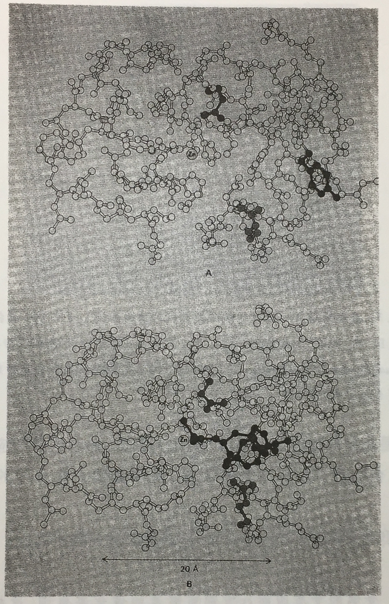
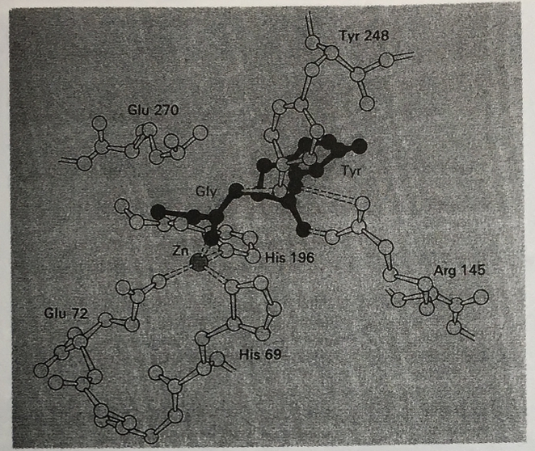
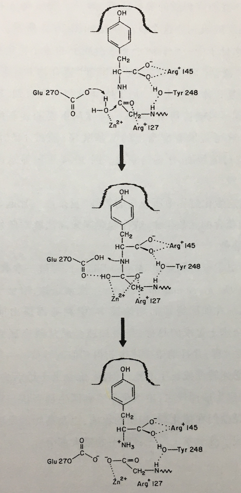

## 0703. 羧肽酶

前面提过的三向触媒是铂、钯和铑三种金属粒子的混合物。另一种金属原子锌，则在接下来要谈到的生物催化剂（enzyme，我们称为「酵素」或是「酶」）的作用上，扮演了重要的角色。酵素是蛋白质，也就是由氨基酸串成的链。它们几乎完全是由碳、氢、氧、氮和硫原子组成。但是酵素的活性中心，常常会利用一些基本的金属原子，如铁、铜、锰、钼、镁、锌和其他金属。不过这些金属在生物系统中的重要性，和它们在地売中的丰度无关。

羧肽酶 A（ carboxypeptidase A）是一种消化酶。动物摄食的分子必须先分解，才能重新建构成较大和较佳的分子。但是这个过程可不是把原来的分子彻底分解成原子，那样太没效率了。事实上，只要分解成含二到十一个碳原子的氨基酸建构单元就行了，因为一套这样的分子建构单元，就足以创造出生化上的多样性。

我们需要摄食蛋白质，而羧肽酶 A 是蛋白酶（protease），能把蛋白质切碎；它从多肽链的一端把氨基酸一个个水解下来。每种蛋白质会水解成特定的氨基酸组成。图 36.1 就是它的化学作用。

请你注意这个反应有多简单，它只不过是把水加到左边箭头标示的碳-氮键上。那么，谁需要这样的酵素？我们人类需要。因为在缺少酵素的情况下，这个简单的反应 A+H2O→←B+C，就无法有效进行。

让我说得更具体一些吧！坎纳（D. Kahne）和史狄尔（W. C. Sti）曾经对一段胜肽（peptide）进行测量，他们发现在没有酵素的情况下，必须耗上七年的时间オ能打断半数的碳-氮键。所以要消化一个汉堡，得等上非常非常久的时间。

在生化系统中，受质（substrate，就是与酵素作用的分子，习惯上用 S 来表示）和水会被送达酵素（E）那儿。酵素以一连串的反应，展现它那显而易见的效能。它把产物释出以后，又重复进行催化的工作。我们可以把这个过程用以下的反应序列简明表示：

	E +S→←ES

	ES+H2O→←E+P

此处 ES 是酵素和待分解的蛋白质所形成的复合体，也就是中间产物。

我们会对这样的反应感到好奇，想知道酵素究竟是怎么作用的。要找出这个问题的答案，势必要从酵素的结构来着手探究。我们也需要知道中间产物 ES 的形状。不过，探究这两者就好比张网捕风般困难。酵素之所以为酵素，并非浪得虚名，它能够非常有效率地催化相关的化学反应。

ES 是存在的，不过它向来转瞬即逝，因为典型的酵素每秒钟能对一亿个分子进行加工。

因此，研究酵素作用最重要的技巧，就是使催化过程慢下来。经由试验，你可以找到一种受质 S'，它能与酵素结合，却不会迅速被酵素分解。所以 ES' 会停留够长的时间，使我们能测到它的结构。由于酵素的化学作用持续不断并且一致，所以 S' 与 S 两者之间可谓既相同又相异。而我们从 ES' 的结构所学到的知识（因为这状态停留得够久，足以让我们研究它），或许能适用于 ES 的情况。

李普斯寇姆（Wiliam N. Lipscomb）和他的研究伙伴分离出羧肽酶 A，并建立羧肽酶 A 的几种「酵素-受质」复合物的结构。李普斯寇姆是我攻读博士学位时的指导教授之一，尽管我研究的化学论题和他的酵素领域相去甚远。

羧肽酶 A 包含一条长约 900 个原子的胜肽链，链上连接了许多基团；它一共含有 307 个氨基酸，折叠成大约 50×42×38 A 的紧密形状（1A 等于 1 x10^(-8) 厘米。经测量，一个氧分子的长度约为 3A）。图 36.2 即显示羧肽酶 A 的结构及复合物（ES'）的结构；其中，复合物是带着一个叫作甘胺酰酪氨酸（glycyltyrosine）的受质，它需要很长的时间才能由酵素分解。

图 36.3 把「酵素-受质」的复合物放大了，图中与酵素结合的甘氨酰-L-酪氨酸以红色表示。

酵素的结构上必然有让受质结合的位置，你可以说它是一个凹槽、一个小洞、一个钥匙孔，或任何比喻。但实际情况却比这些比喻还复杂，因为那个凹槽、小洞或是钥匙孔并不是静止不动的 —— 它还会「呼吸」呢！或者，让我们用较不拟人化的方式来说，这个酵素和受质结合时，会重新调整形状。

图 36.2 羧肽酶 A（图 A）与它的甘胺酰酪氨酸的复合物（图 B）的结构。此图依据李普斯寇姆的论文绘成。实际的插图则取材自史特莱尔所著的《生物化学》第三版

寇许兰德（Daniel Koshland）提出了「诱导式接合」（induced-ft）酵素作用模型，并强而有力地主张：这样的情形时常在酵素上发生。

你会看到有一个氨基酸（酪氨酸 248, 在图 36.2 中以深色标示，数字 248 是指氨基酸的排列序号）的几个原子，在该酵素回应受质的结合时，会移动 12A 那么远的距离（是该酵素直线宽度的四分之一）。

图 36.3 与羧肽酶 A 结合的甘胺酰酪氨酸的周围环境。这个分子结构根据布罗（D. M. Blow）和史帝兹（A. Steitz）的论文《酵素的 X 射线绕射研究》（Annual Rewiews of Biochemistry39, No.79,1970），插图则取材自史特菜尔所著的《生物化学》第三版

这里有史特菜尔（Lubert Stryer）讲述的有关酵素的话：

受缚的受质四面八方都有酵素的催化基包围，这样的布置能促进催化作用…不过很显然，受质无法进入这样的催化基阵列，而且产物也无法离开，除非那个酵素是可以弯曲变形的。可以「弯折」的蛋白质比僵硬不可弯曲的蛋白质，更能为拥有催化潜力的分子构形提出更多的演出戏码。

图 36.4 羧肽酶 A 的作用机制。取材自克理斯汀森（D. W Christianson）和李普斯寇姆的论文

最后，李普斯寇姆做的美妙硏究，解开了羧肽酶 A 神奇切断胜肽链的详细反应机构。这个反应机构如图 36.4 所示。图 36.4 的上图显示，水分子受一个锌离子和蛋白质上的一个特定氨基酸谷氨酸 270「激活」后，进攻「受质-酵素」复合物 ES；于是，另一个中间产物的复合体便形成了，从图 36.4 的中图可看到，这个中间产物崩解时，碳-氮键被切断，氢原子再度从重要的谷氨酸 270 上回到氮原子。这可是借着酵素上的氨基酸精（氨酸 145、酪氨酸 248 和精氨酸 127) 的帮助，才得以完成。图 36.4 下图显示即将释放出来的产物片段。

大自然这生化过程中所包含的美妙「复杂性」，比起你家后院一平方米内所蕴含的无数生命，或比起美国最高法院对堕胎权的考量来说，毫不逊色。

宗教历史学家伊利亚德（Mircea Eliade），写过一本著名好书《熔炉与坩埚》（The Forge and the Crucible），探索宗教、冶金学和炼金术之间的关系。在他那绝妙的结论篇中，伊利亚德提出他惊人的发现：那些炼金术士追求的目标，是要加速金属从贱金属到贵金属的「自然」发展过程，并且期望身体也获得相似的转变一一从生病转变为健康，从必死转变成长生不死。但是，炼金术士最后失败了，现代的化学家和医生取而代之；虽然化学家和医生都否认与炼金术有任何关联，但是他们在催化剂、物质的组成，以及药物的发明与发现等方面，已达成了炼金术士原先目标中的极大部分。