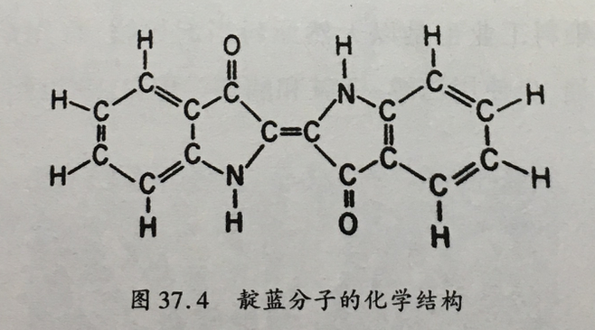

第八部 利益、伤害和民主

## 0801. 神奇靛蓝

在人类的环境中，任何事物都具备「有利」和「可能有害」的双重性质，这是实际、易犯错而又具备道德感的人类必须面对的。像汽车、面包刀和电视节目，可能对我们有益，也可能有害。而就当今人们对大型化学工业运作所持的态度而言，这样的双重性质就更显得重要了。其实，当你考虑到化学工业带来的报酬、丰富的产品和大小工厂所排放的废物时，你就等于在凝神注视着杰纳斯的肖像（见图 1.3）。

化学工业会永久存在，因为我们若不改变生活环境，就难以生存。有许多实用的原始化学，像治金术化妆品、发酵与蒸馏、染色药剂处方和食物的制备，在分子科学出现前就已伴随我们几千年了。这些经由化学变化产生的物品，很早以前就成为有系统的交易商品。

我想到一个这方面的例子，是关于神奇美妙的色素「泰尔紫」（tyrian purple）的制造。自古罗马时代起（以及在希伯来人的生活里），介于红色和蓝黑色之间的紫色毛料就极受珍爱，被称为「泰尔紫」或「王室紫」。普林尼形容它是「凝固的血色，第一眼看到是黑的，但是放在阳光底下就会闪闪发光」。在当时的罗马共和国，只有监察官和战胜的将军才配穿着全身紫色的衣服，执政官只能穿着镶紫边的宽袍，而战场上的将官则身穿紫色的披风。

图 37.1 能产生泰尔紫染料的三种骨螺。由左至右：紫染料骨螺、川克拉斯骨螺、血口骨螺

泰尔紫或王室紫的制造，在罗马帝国受到严格限制，只有皇家染坊有权制造，私下制造王室紫的人会遭处死。就在当时，希伯来人也在《旧约》上记载了一种蓝色的染料配方；经文上记载，要他们在衣服边上做穗子，再钉一根蓝细带子，希伯来人称这种蓝色为「特贺乐」（tekhelet），我们称它「圣经蓝」。

泰尔紫和圣经蓝都由动物身上取得，而且必须细心地从三种腹足类骨螺身上抽取，所以非常昂贵。这三种骨螺的学名分别是：川克拉斯骨螺（Trunculariopsis trunculus），紫染料骨螺（Mbrandaris）和血口骨螺（T als haemastoma），见图 37.1。

这些美丽的骨螺身上有一层外套膜，在外套膜之中有一条鳃下腺。这个鳃下腺化学工厂有许多功能，不仅能产生黏液状物质，包裏沙石颗粒将之排出体外，还能产生数种具有神经毒性的攻击用化学物质。此外，这条鳃下腺还会释放出一种澄清的液体，它就是泰尔紫染料的前身。这种液体接触到空气中的氧气时，会在酵素和阳光的作用下（后者尤其重要），从微白色变成脓黄色，然后变绿，最后变成蓝色和紫色。亚里士多德是细心的观察者，他和普林尼两人都对这些骨螺和染料的抽取方法，做了详尽的描述。

当时人们仔细鉴定这些骨螺的种类确定无误后，会小心翼翼地把骨螺的外壳弄碎，搜集宝贵的外套膜液，并使其发生反应。把反应产生的染料分离出来后，先浓缩，再用于染羊毛或染丝。其中也许有简单的化学程序 —— 一连串氧化还原的反应，因为氧化还原反应是溶解染料所必需的，如此一来染剂才能固定在羊毛或丝的纤维上。

沿地中海东岸勘探，我们发现了关于这项巧妙的化学活动的考古证据。这些证据显示，当时腓尼基的化学家似乎也有废物丢弃的问题，因为被他们弃置的骨螺外壳分布的范围很广。

长久以来，就有一种非常类似泰尔紫和圣经蓝的染料来源，而且比使用骨螺经济得多。这种蓝紫色染料得自木蓝属（Indigofera）的豆科植物，这种植物广布于温暖的气候环境下，在印度很容易培植，是当地重要的贸易商品。

图 37.2 的上图即是木蓝田。图 37.3 取材自 1753 年狄德罗（Denis Diderot）出版的古典百科全书，图中描绘的是木蓝染料的生产。其中，发酵和氧化的阶段就在这些大槽中进行。

另一种紫染料的来源是菘蓝（见图 37.2 下图），它又名大青，学名为 Isatis tinctoria。这种植物广布于欧洲，并跨至亚洲；在较北的温带气候区中受到广泛利用，直到后来才被经由东印度交易而来的南方木蓝取代。

为什么豆科植物与骨螺会合成出完全相同的分子？这是一个好问题，它必然与生物体共同具有的生化途径和演化的神奇游戏有关。我还能举出其他在分类上分属不同「门」的生物，但却能制造出相同复杂分子的实例。例如假荆芥内酯（nepetalactone），它是猫薄荷的活性要素，既可以得自薄荷，也可以得自一种竹节虫；还有从蟾蜍毒液中得到的强心剂蟾蜍甾二烯内酯（bufadienolide），也可以得自萤火虫。

19 世纪后半叶，我们晓得从骨螺、木蓝和菘蓝得到的紫色，都是由一种叫作「靛蓝」（indigo）的分子产生的，它的结构如图 37.4 所示。此外，我们也从某些种类的动物身上，发现靛蓝的类似分子（其中靛蓝的两个氢原子由溴原子取代）。

而后，在 19 世纪的最后二十多年里，化学这门科学达到鼎盛时期，此时德国的化学家已研究出如何合成靛蓝染料。他们开发这项合成或许部分是出于好奇，但是主要目的显然是以实用和交易为主，因为染料有市场，尤其是靛蓝染料。
