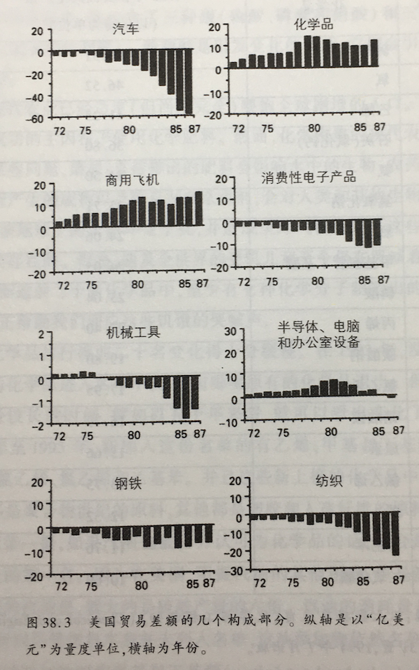
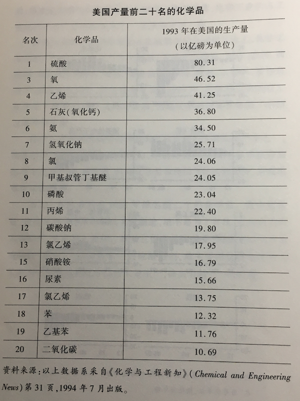
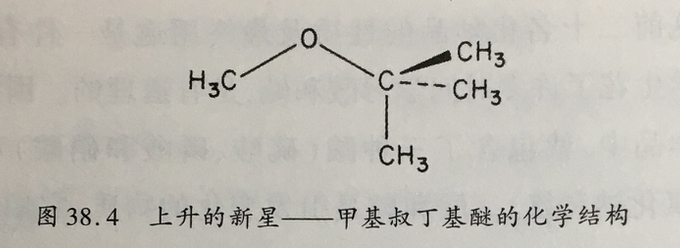

## 0802. 化学和工业

从软体动物养殖场和泰尔紫的原始工厂，到 1900 年左右，拜耳、德固萨（Degussa）和赫斯特（Hoechst）公司成功地大量制造靛蓝染料期间，究竟发生过哪些事情？

噢，那可多着呢！比方说，天然物转变的规模就跃进了一大步，泰尔紫的原始化学，是在对天然物不甚了解的情况下就进行利用，但却是以了不起的细心和技巧，把天然物转变成有用的和人们想要的产品，使产品具有商业价值。

德国的染料工业也是以天然原料当起始物，首先是用煤焦油，然后采用石油，也使用乙醇、钾碱和醋酸。但是 19 世纪的工业合成涉及许多阶段，化学程序持续演变成我们目前知道的样子：一系列包含上百个物理操作的反应，在闪亮的玻璃或钢制容器中进行。这样庞大的运作方式，足以生产每年染制上百万条牛仔裤所需的合成能蓝染料。

图 38.1 巴斯夫公司的实验室早期生产的一些合成染籵样品，取材自慕尼黑的德国博物馆。克拉兹（Otto Kratz）提供

19 世纪下半叶，德国的染料工业有非常戏剧化的进展，从中变化出化学治疗、人造肥料和炸药工业。这其中并没有什么是德国专有的，因为这些知识就如同所有的化学知识一样，自古以来都是属于人类全体的。

工业化国家有愈来愈大部分的产品，本质上皆属化学产品。并且国家的富强与否，得直接或间接依赖化学，亦即视这国家在天然物转换上的总体能力而定。我定义化学在世界经济上扮演的角色时，是把所有天然物质的转换都包括进去的，其中包括了食品加工金属治炼（这是十分化学的过程），以及能量的生产。（你能说油料、煤炭或天然气的燃烧不是化学吗？）依我计算，化学工业约占工业化国家生产总值的四分之一，重要性可见一斑。

即使大多数的经济学家把定义限制在化学制程工业上，化学工业仍然广泛到包括合成纤维和塑胶、大量化学药品、肥料、燃料、润滑剂、催化剂、吸附剂、陶器、推进燃料、炸药、颜料、涂覆剂、弹性高分子、农药和医药等，而且还有更多。1990 年，美国的化学制程工业售出了价值 4320 亿美元的货品，为这些货品的原料增添了远超过成本的价值。

化学工业是对美国贸易净差有正面贡献的少数几个产业之一，而美国的贸易差额则如众所周知，净值为负。图 38.3 显示该差额的几个主要产业，请注意，只有化学品和商用飞机这两部分，呈现乐观的正面收益。

第 22 页的表列出 1993 年排名前二十的化学品。我向你保证，这些化学品之所以如此大量制造，绝不是为了好玩，而是因为有人会购买，并且有人使用。而且它们不是奢侈品，而是生活上不可或缺的「面包」。以排名第一的硫酸为例，最主要用途就是作为人工肥料。但是这些化学品的大量生产，确实引起了一些问题。

思考这前二十名化学品的性质及最终用途是一件有趣的事。化学系的学生花了许多时间学习酸和碱，是有道理的。因为在这前二十名化学品中，就包含了三种酸（硫酸、磷酸和硝酸）和三种碱（石灰、氢氧化钠和氨）。酸和碱是引发变化的物质，它们会引起化学反应。

现代农业已经适度（但尚未完全）喂饱全球剧增的人口。造就这项成功的主因在于使用化学肥料。然而，化学密集的现代农业也存在某些问题，诸如：直接排出的肥料会影响水中的生物；农药制造过程所产生的废物以及除草剂和杀虫剂，会对人类和其他生物造成伤害，使地球上的大循环受干扰，并造成全球气候变迁。这些问题是真实存在的。但是，遍及全世界的受饥儿童至今仍在哭喊着需要食物，而这前二十名化学品中，至少有七种化学分子制造出的化学肥料，正帮助我们回应这些饥饿的哭喊声。

化学品排行榜前二十名变化得十分缓慢。在 1993 年，没有任何新的化学品进入名单中，也没有哪项原有的化学品退出。但是经过一段较长的时间，警如以五十年来看，就可以看出变化了。从 1940 年至 1995 年，新加人这份名单的有乙烯、甲基叔丁基醚、丙烯、二氯乙烯、氯乙烯和乙基苯。并且这些新上榜的化学品中，只有一种不是聚合物世纪的原料，其他都是塑胶和人造纤维的原料。

附带一提，如果汽油也被官方认可为化学品的话，它会是这排行榜上的第一名。因为在美国，不提汽油的其他用途，单是流进汽车油箱的汽油量，就大约是硫酸产量的六倍。汽油的消耗量是如此之大，所以尽管燃料本身并未列入名单，汽油添加物依然名列榜上。这种汽油添加物叫作甲基叔丁基醚（methyl tert-butyl ether），缩写成 MTBE，结构如图 38.4，它是一颗跃升中的新星，产量比往年跃升了 121%（所以你早该投资它的制造公司）! 

MTBE 出现在前二十名化学药品排行榜中，并引人瞩目地一路攀升，印证了人们对汽车的迷恋，也印证了科学、技术和环保事务与政府的法令间交互作用的方式。甲基叔丁基醚取代了有害的四乙基铅，成为提高辛烷值的汽油添加物。它在每升汽油中的含量可达 7%。

想想看，什么化学品会是下一个上榜的？
