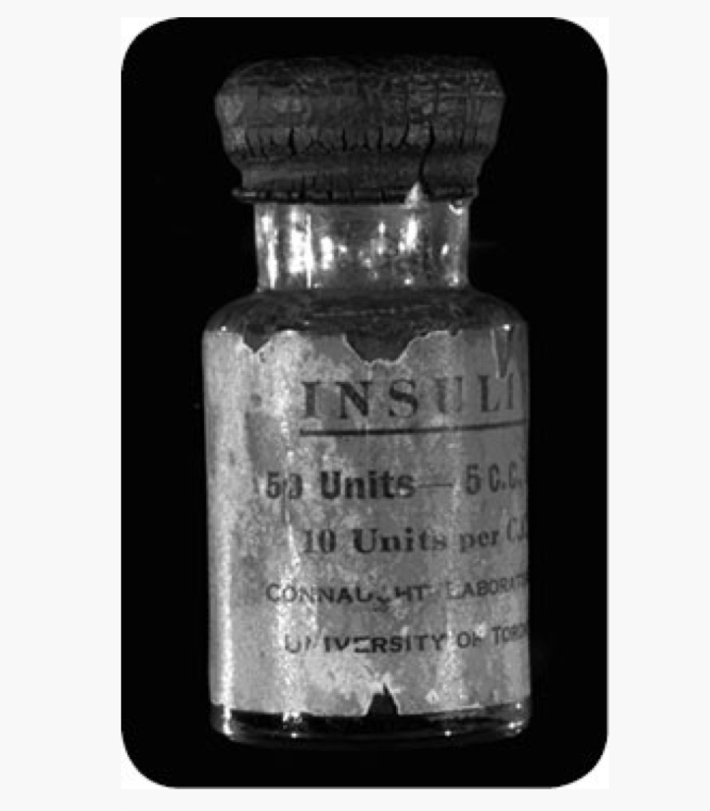
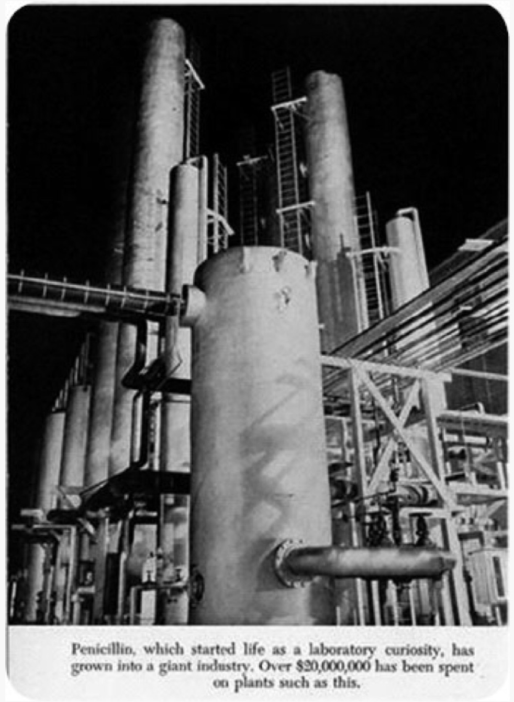

# 0201. 伴随药理学完善而渐兴起的新药发现

发现洋地黄的伯明輸月光社成员威廉·维瑟林 William Withering）写出了英国第一本植物志，他的妻子也是一个植物爱好者。植物分类学隶属于启蒙运动的百科全书派，而维瑟林的研究，进一步推动了药理学的发展。药理学最终由德国的奥斯瓦尔德·施米德贝格（Oswald Schmiedeberg）建立起来，他培养的药理系毕业生成为德国制药工业的中坚力量。药理筛选动物模型为新药发现奠定了基础。

水合氯醛是在兔子身上验证的，苯巴比妥则利用了狗作为验证模型，百浪多息的发现得益于小鼠葡萄球菌感染模型，这些都离不开药理学的发展。除了药理筛选模型的增多，阿司匹林、苯佐卡因、普鲁卡因磺胺类抗生素、可的松类激素的发现也离不开合成技术进步。胰岛素、肝素、青霉素被推向临床，得益于提取工艺优化及制药企业（简称药企）进行大生产工艺开发。

## 2.1 第一个安眠药：水合氯醛

水合氯醛（chloral hydrate）最早是在 1832 年，由德国化学家李比希使用氯气与乙醇反应生成的，他还发现在碱性环境下，水合氯醛生成氯仿和甲酸。德国药理学家鲁道夫·布赫海姆（Rudolf Buchheim）在 1869 年之前就发现了水合氯醛的催眠作用，但布赫海姆的初衷是解決一些疾病中，患者血液呈现出碱性化的问题，他希望水合氯醛在碱性条件下生成的甲酸可以解决这一问题，但并没有达到目的，于是终止了这一研究。

德国药理学家奥斯卡·利布来希（Oscar Liebre ch,1839-1908) 在柏林大学病理研究所担任助教期间也研究化合物的催眠作用，他着眼于水合氯醛在碱性条件下生成的氯仿，希望观察到更好的催眠效果。他首先在兔子身上验证了自己的假设，然后设计了不同剂量的实验研究，相关结果于 1869 年发表。很快水合氯醛被应用于临床的催眠和镇痛。并且它在水中和乙醇中都很稳定，所以被大量应用于临床。先灵（Schering）公司建设了一个工厂生产这一药品，商品名为 Noctec，作为瓶装溶液出售。这是临床上第一个被真正应用于催眠的药物，还可用于儿童，但使用者不能饮酒。短短几年，水合氯醛的需求量每年超过 1 吨。

不过，实验显示，虽然水合氯醛有催眠作用，但使用者的血液中氯仿成分非常低。发现胰腺降血糖作用的德国医生约瑟夫·冯·梅灵（Joseph von Merin g,1849-1908) 在研究巴比妥类催眠药物时对水合氯醛也做了研究。他推测水合氯醛的作用机制有可能是在血液中生成了三氯乙醇，三氯乙醇在血液中发挥了催眠作用，但这一推测直到 20 世纪 40 年代才被验证。1962 年，葛兰素史克推出了三氯乙醇的磷酸盐 —— 磷酸三氯乙酯钠，用于催眠。

1962 年，好莱坞女明星玛丽莲·梦露（Marilyn Monroe）由于服用药物过量致死，当时就发现她饮酒的同时使用了水合氯醛。另外，她胃内还有另一类药物 一一 巴比妥类药。

## 2.2 解痉催眠药巴比妥：GMP（良好生产规范）的推手

1864 年 12 月 6 日，德国化学家阿道夫·冯·拜耳（Adolf von Baeyer,1835-1917,1905 年诺贝尔化学奖获得者）利用动物的尿素与丙二酸二乙酯（苹果酸衍生酯）合成了巴比妥酸（barbituric acid）。但当时拜耳并未发现它有什么实用价值，于是把它放在了一边。

直到 1903 年，拜耳的学生，当时在拜耳公司担任顾问的化学家赫尔曼·埃米尔·路易·菲舍尔（Her mann Emil Louis Fischer,1852-1919,1902 年诺贝尔化学奖获得者）和上文提到的德国医学家梅灵「（Joseph von Mering），切除狗的胰岛后，得到了高血糖的狗，这导致后来胰岛素的发现」发现了二乙基乙酰脲（diethylacetylurea）可以非常有效地使狗进入睡眠状态。它是以乙醇钠为催化剂，通过冷凝的二乙基丙二酸乙酯与尿素反应而生成的。

作为医生的梅灵在寻找一个比水合氯醛更好的催眠药，他合成了一个对狗有催眠效果的化合物，但由于对化学不精通，所以他咨询了菲舍尔，请菲舍尔帮助确证自己所推测的化合物的结构是否正确，分析其化学性质，并进一步纯化它。菲舍尔精通碳水化合物重复了他的实验，并合成了几个化学结构相关的药物，其中包括效果更好的二乙基巴比妥酸（5,5-di ethylbarbituric acid）。然后菲舍尔和梅灵于 1903 年共同发表了结果，并且又以巴比妥（barbital）为名申请了专利。[1]

1904 年，拜耳公司把巴比妥作为镇静催眠药推向市场，商品名为「Veronal」。1912 年，拜耳公司又推出了苯巴比妥（phenobarbital，商品名为 Lumin al）。另外一个可溶的巴比妥盐则被先灵公司（Sch erino）以商品名 Medinal 推向市场。它一直应用到 20 世纪 60 年代，オ被后来上市的苯二氮类药物取代。

巴比妥被推向市场后，一位年轻的医生阿尔弗雷德·豪普特曼（Alfred Hauptmann，德国神经学家）发现，癫痫患者服用本药后，癫痫发作次数明显减少了，它的效果远比溴化钾要好。但他也同时发现，患者一旦断药，癫痫发作会比以前更频繁。于是巴比妥类药物开始应用于解痉治疗。

在随后的应用过程中，临床医生们又发现，巴比妥还可以治疗新生儿黄疸。不过，这种用法于 20 世纪 50 年代光疗法被发现后终止。

另外，巴比妥药还因一起严重的药品安全事故促进了《良好生产规范》（GMP）颁布实施。1940 年 12 月，温斯洛普化学公司（Winthrop Chemical）在生产磺胺噻唑时，使用了未清洁的苯巴比妥生产设备结果使得磺胺噻唑片中混有苯巴比妥，每片苯巴比妥剂量达到 350 mg，这是引起成人喈睡剂量的 2 倍。这一药物上市后导致数百人死亡，所引发的公众的强烈反应也加快了 GMP 的实施。

## 2.3  阿司匹林 一一 百年名药的「罗生门」

早在公元前 5 世纪，古希腊医生希波克拉底已记载从柳树皮提取的苦味粉末可用来镇痛、退热。此后柳树皮提取物一直被收入西方药典。

英国一位传教士爱德华·斯通（Edward Stone, 1702-1768），在一次乡间散步时，疟疾发作的他感到身上有些难受，便从身边一棵柳树上揭下一块树皮咀嚼，希望柳树皮的苦味可以减少不适感。没想到过了一会儿真的有效了。那时人们已经知道金鸡纳树皮中的奎宁可治疗疟疾，于是斯通设想柳树皮中也有治疗疟疾的物质，并开始这方面的研究。斯通花了 5 年时间收集柳树皮，提取有效成分并在人们身上验证。他于 1763 年，分离得到了水杨酸溶液，并写信向英国皇家学会主席介绍了自己的成果，这封信后来被保留在英国的博物馆内。

1827 年，柳树皮中的活性成分水杨苷被分离、纯化了出来。随后几年，化学家在不同的植物中提取到了相应的水杨苷成分，但提取工艺复杂，并且产率很低。

1853 年，曾在李比希实验室工作过的法国化学家查尔斯·弗雷德里克·热拉尔（Charles Frederic G erhardt,1816-1856) 成功制备了乙酰水杨酸。他研究各种酸酐的合成与性能，有一次他把乙酰氯与水杨酸钠混合加热，得到一个新产物，他称之为水杨酸乙酸酐，但产物并不纯，而且他没有进一步加以分析。1859 年，化学家冯·希尔曼（von Gilm）用水杨酸和乙酰氯合成了纯的乙酰水杨酸。1869 年，其他化学家重复了两人的实验后得出结论，两个人得到的产物是相同的。但是，这一物质的药理作用仍没有被发现。

19 世纪 80 年代，德国的染料工业发展迅速，并且煤焦油工业也开始发展，大量化学物质被合成。其中不乏具有药理活性的新物质。卡乐公司的乙酰苯胺（Antifebrine，退热冰）原本是一个染料衍生化合物，1886 年偶然发现其有解热镇痛作用，被推向药品市场后大卖。

这一药物鼓舞了化学家弗雷德里希·卡尔·杜伊斯贝格（Friedrich Carl Duisberg,1861-1935)。杜伊斯贝格曾在阿道夫·冯·拜耳的实验室学习，1883 年应聘到弗雷德拜耳公司（Friedr. Bayer&Co., 即拜耳公司前身）的法本沃克（Farbenwerke）染料工厂。在乙酰苯胺被发现之后，他说服公司高层，也开始进军解热镇痛药硏究。很快，在他的带领下，1887 年解热镇痛药非那西丁（phenacetin）被研发出来，接着镇静药索佛那（sulfonal，丙酮二乙基砜）和甲基砜（trional）在 1988 年被推向市场。这些成功使杜伊斯贝格在拜耳公司一路升迁，于 1890 年担任研究部门负责人，并进入董事会。他于 1900 年担任公司 CEO。第一次世界大战后，他主导拜耳公司等 5 家德国主要化学企业，合并为 IG 法本（IG Farben）这一当时世界排名第四的大公司。

德国化学家费利克斯·霍夫曼（Felix Hoffman n）于 1894 年加入了拜耳公司，1897 年 8 月，他在药学部主管亚瑟·艾兴格林（Arthur Eichengrun）指导下进行合成奎宁的研究，不过在这一过程中，他在乙酸环境中乙酰化水杨酸，合成了乙酰水杨酸（阿司匹林）这一百年名药。艾兴格林将包括水杨酸在内的几种化学品送到公司的药理组进行初步试验，认为其中乙酰水杨酸的效果最佳。但是药理组负责人海因里希德莱塞（Heinrich Dreser,1860-1924) 认为乙酰水杨酸对心脏有害，拒绝进行临床试验。于是艾兴格林首先在自己身上进行试验，觉得乙酰水杨酸无害，然后递交给同事，召集医生秘密地进行临床试验。试验的结果非常好，但德莱塞仍认为该产品没有价值。

在拜耳公司研究负责人杜伊斯贝格的干预下，公司才开始全面评估乙酰水杨酸。之后，德莱塞改变了看法，在 1899 年发表一篇介绍这个新药发现经过的文章，并取名为阿司匹林（Aspirin），文章中既没有提艾兴格林，也没有提霍夫曼。当年，本品以瓶装粉剂上市，很快被推广到全世界。[2]

德莱塞是三人中唯从阿司匹林销售中获利的人。艾兴格林、霍夫曼和公司签的协议是他们将从他们发明的专利产品中获得专利费。而德莱塞和公司的协议是任何由他引进的产品他都能从销售中分成不过，霍夫曼在阿司匹林上市后，从研发部门转到销售部门工作，并在 1934 年提出，自己研发阿司匹林是为了治疗老父亲的风湿病。这受到纳粹当局的吹捧，因为艾兴格林是犹太人，正受当局迫害。于是拜耳公司也把这个故事传遍全世界，以提高本品的销量。

艾兴格林还同时主持了另一个药品的研发，即银粒子蛋白（silver proteinate，商品名为 Protargol）通过银酸盐与白蛋白结合而成，用于染色。后来发现对细菌有作用，便用来治疗淋病，于 1897 年上市。

二战结束后，大约在 1949 年，艾兴格林提出自己是阿司匹林的发明人，但不久他就去世了。后来英国医药史学家沃尔特·斯尼德（Walter Snead r）几经周折获得德国拜耳公司的特许，查阅了公司实验室的档案，宣布艾兴格林为发明人。

艾兴格林除参与新药开发，还与西奥多·贝克尔（Theodore Becker）一起，于 1903 年开发出第一个可溶性的醋酸纤维素。在阿司匹林上市后，他便转向研究塑料、油漆、人造纤维等。他在塑料注射成型技术方面也有贡献。

而拜耳公司是建于 1863 年的一家化工小公司原来主要是生产染料。在 19 世纪 80 年代后期，拜耳公司转而研究化学制药，获得了巨大成功。不过，第一次世界大战对拜耳公司造成了不小的损失，美国没收了拜耳公司的海洛因、阿司匹林等商标权。阿司匹林的生产原料之一苯酚（还可以应用于塑料、火药等工业）的主要供应商英国还对德国进行封锁，拜耳公司不得不利用德国间谍从美国以生产消毒剂名义进口原料。

第一次世界大战后，阿司匹林再度红火，还分销到中国市场。民国影星阮玲玉就做过阿司匹林的代言人，为其做广告。阿司匹林在中国取得不小的成功，1936 年，拜耳公司还开始在上海生产阿司匹林。可以说，巴比妥、阿司匹林等药物的成功，奠定了拜耳公司在世界制药业的地位。

民国影星阮玲玉为阿司匹林代言。图中英文指治疗头痛、流感、发热、伤风。

## 2.4 局麻药可卡因与弗洛伊德（精神分析学家）失之交臂

欧洲人发现美洲后，探险家们便注意到南美土人通过咀嚼古柯植物的叶子来提神。1855 年，德国化学家弗里德里希·歌得克（Friedrich Gaedcke,1828 1890) 首次从古柯叶中提取出麻药成分，但并不纯。合成尿素的德国化学家弗里德里希·维勒（Friedrich Wohler,1800-1882) 也对古柯叶子感兴趣，希望提取出相应的有效成分。他请一位探险家给他带回了些古柯叶，然后交给自己的博士生阿尔贝特·奈曼（Albert Neiman,1830-1861, 他合成了芥子气这个用于「一战」的化学武器，也不幸地死于芥子气中毒研究。1859 年，奈曼精制出高纯度的化合物，维勒品尝过后（在当时发现新化合物，很多化学家都会亲自品尝一下），感觉味苦且麻，把它命名为可卡因（Cocaine），又称古柯碱。

其后，有人在酒中加入古柯叶提取物，最初的可口可乐当中（1886 年的配方）也有古柯提取物。1884-1885 年，好几组医生发现可卡因的麻醉和镇痛作用，其中还包括心理学家西格蒙德·弗洛伊德（Sig mund Freud,1856-1939)。弗洛伊德的好友卡尔科勒（Karl Koller,1857~-1944) 也在寻找一种局麻药，希望用于眼科手术，他注意到了可卡因，并与德国默克公司联系，尝试把可卡因用于临床，取得了良好的效果。很快，可卡因被普及到临床中。

由于可卡因有成瘾性，水溶液不稳定，高压灭菌时易分解，以及资源有限，于是可卡因的临床应用就受到了限制。化学家们便对可卡因的结构进行研究和改造，以寻找更好的局部麻醉药。

## 2.5 局麻药普鲁卡因是美国的抢仿品

苯佐卡因（benzocaine）于 1890 年由德国化学家爱德华·里策特（Eduard Ritsert,1859-1946) 合成，并于 1902 年以「麻醉」（Anasthesin）为商品名上市。阿米洛卡因（amylocaine）是由巴斯德研究所埃内斯特·富尔诺（Ernest Fourneau,1872-1949) 于 1903 年发现，临床应用于脊髓麻醉。[3]

德国化学家阿尔弗雷德·艾因霍恩（Alfred Ein horn,1856-1917) 于莱比锡（Leipzig）大学学习后来曾于 1882 年加入慕尼黑大学阿道夫·冯·拜耳 Adolf von Baeyer）的研究团队。并一直在慕尼黑大学任职。在研究麻醉类药品时，艾因霍恩于 1905 年首次合成了一个有效化合物，并以奴佛卡因（novocal ne）为名申请了专利。

外科医生海因里希·布劳恩（Heinrich Braun,1862-1934) 在菜比锡享有盛名，1901 年，他设计了一种混合多种麻醉气体的医疗器械，1903 年，他又发表文章，提议局部麻醉手术中可以把前列腺素作为血管收缩剂。艾因霍恩合成奴佛卡因后，请布劳恩实验。布劳恩发现奴佛卡因有很好的局部麻醉作用。从而奴佛卡因很快被推向市场。

虽然奴佛卡因的麻醉效果不如可卡因，并且对少数患者有致过敏副作用，但安全性仍强于可卡因，并且没有成瘾性。艾因霍恩希望奴佛卡因可以取代普鲁卡因，但外科医生们仍然喜欢在手术中全身麻醉，但牙科和眼科医生对奴佛卡因青眼有加。

「一战」后期，美国对德国宣战，取消德国药企的相关专利。于是美国制药商立即开展了抢仿，把它以普鲁卡因（procane）的名字上市。国内后来也采用了普鲁卡因的名字。普鲁卡因目前基本被利多卡因取代，但仍在口腔麻醉中使用。

## 2.6 科赫门下「三杰」与白喉抗毒素

德国微生物学家罗伯特·科赫（Robert Koch）自发现结核分歧杄菌后，就一直寻找相应的「疫苗或杀菌剂」，但总不能成功。不过，他的实验室聚集了大量被称为「微生物的猎手」的人オ。科赫实验室中以贝林、北里柴三郎、埃尔利希等三人最为优秀，他们开创了免疫学的新时代。

1889 年，上尉军医埃米尔·冯·贝林（Emil von B ehring,1854-1917) 被调往科赫实验室。出身贫困不得不学医，并担任多年军医的贝林非常珍惜这次机会。他在科赫实验室的第一个同事是北里柴三郎（Ki tasato Shibasaburo, 1853-1931)。

北里柴三郎于 1885 年受日本政府派遺到科赫实验室学习。1892 年回日本，并于 1894 年在香港与巴斯德研究所的亚历山大·耶尔森（Alexandre Yersi n,1863-1943) 几乎同时发现了鼠疫的病原菌，但科学界把荣誉给了耶尔森。

1883 年，皮埃尔·保罗·埃米尔·鲁（Pierre Paul Emile Roux,1853~1933) 与亚历山大·耶尔森一起发现了白喉杆菌，并对其毒素做了研究。白喉毒素 diphtheria toxin）也相继被发现，只要有毒素作用于动物，不需要细菌，动物也会出现相应的症状。

在当时还没有办法培养厌氧菌，但北里柴三郎通过实验，于 1890 年成功地培养出了破伤风病原菌。这时贝林已经通过实验研究发现，小鼠对白喉病原体有抵抗力，而豚鼠对霍乱也有抵抗力。并且白喉杆菌「可引起急性呼吸道疾病白喉（diphtheria）」免疫动物后，动物血清中有一种抗菌物质（即抗体），于是科赫让两人合作。他们发现这是一种「抗毒素」物质，于是共同发表了一篇文章。贝林又单独发表一篇文章阐明了他们发现的「抗毒素」。这些成果开创了免疫学的新时期。[4]

同样在科赫实验室从事研究工作的保罗·埃尔利希（Paul Ehrlich,1854-1915) 也转向免疫学研究并以植物毒素免疫动物，得到了动物血清中的「抗毒素」。埃尔利希曾经为科赫改进过细菌染色方法，赢得科赫的赏识。

因为贝林同科赫在抗毒素研究的专利权上产生分歧，结果离开了科赫实验室。一家染料企业赫希斯特公司（Hoechst AG，后来成为安万特的前身，即赛诺菲安万特的一部分）也在医药产业上升之际进行转型。它已经资助科赫对结核疫苗和抗结核药物的研制，虽然不成功，但得知白喉抗毒素之后，该公司又与贝林签订合同，开发这类新药。

但贝林的工艺方法无法达到工业生产的要求，于是他邀请埃尔利希来帮忙。埃尔利希凭借自己在植物毒素免疫，以及化学方面的高超技能，通过把白喉菌反复注射到马的体内，得到了马免疫血清。1894 年本品临床试验取得成功，赫希斯特公司随后把这一制剂作为治疗白喉的新药推向市场，这种新药在随后的次白喉流行中获得极大成功。

第一个白喉抗毒素血清由巴斯德研究所的鲁（Roux）等人制备成功虽然他们也是根据贝林等人的研究原理，但在贝林与埃尔利希成功之前，他们已经在 300 多位儿童身上得到了成功验证。

1895 年，柏林设立了血清学研究所，埃尔利希担任第一届所长。然后埃尔利希开发出一种定量白喉抗毒素的方法，从而将其开发为一种注射制剂。使得血清抗毒素的产品质量变得稳定。不过，贝林和埃尔利希因为利益分配产生矛盾。两人从一开始的平均分配利益，变成埃尔利希只得到 8%，这伤害了两人之间的友谊。贝林因抗毒素的研究而获得了第一届诺贝尔生理学或医学奖（1901 年），并依靠与制药企业的合同变得富有。但遗憾的是，与贝林一起获得首届诺贝尔奖提名的北里柴三郎和埃尔利希却没有得到相应的回报。而科赫于 1905 年才获得诺贝尔奖。

贝林和埃尔利希虽然存在一些不快，但还是把友谊维持终生。另外，跨国生物制品药企杰特贝林（C SL Behrino）的前身即为贝林创立。贝林诊断（Be- hring Diagnostics）公司是从赫希斯特分离出的公司，延续了贝林的名字。

## 2.7 花柳病终于有救了：埃尔利希团队发现「神奇子弹」砷凡纳明

保罗·埃尔利希（Paul Ehrlich）在研究免疫的工作中得到启发，他用亚甲蓝给活神经细胞染色，而不影响周边组织。所以他认为病原与抗毒素之间的关系如如同染料化合物的「侧链」，化合物侧链不同，就表现出不同的颜色和性状。而相应的病原则会引起生物产生相应的抗毒素（抗体），这就是所谓的「侧链」理论。

这在那个时期是一种很有见地的推测，但由于当时尚未发现抗体或受体，所以引起了同辈科学家的争议，他们认为埃尔利希过多地借用了有机化学的概念。但埃尔利希在后来的梅毒药物硏究中，发挥了自己的「側链」理论。因为免疫学的成就，埃尔利希获得了 1908 年诺贝尔生理学或医学奖。

20 世纪之前，梅毒没有有效的药物治疗。大哲学家卢梭就曾在《忏悔录》中描述自己在一次性行为后，因深信自己感染梅毒而陷入为期三周的极度恐惧状态。梅毒的起源有两种假说，一种是哥伦布从新大陆带回来的，另一种是本来就存在于欧洲，只是一直没有引起人们注意。首次有记录的梅毒的传播被发现是在 1495 年左右的意大利那不勒斯，由法国入侵士兵引起，也称「法国病」。在传入中国以后，被称为「花柳病」。许多历史人物，包括蒋介石都被怀疑患过梅毒。1905 年在柏林一家医院里，植物学家弗里茨·里夏德·绍丁（Fritz Richard Schaudinn,1871-1906 和皮肤病医生埃里克·霍夫曼（Erich Hoffmann,1868-1959) 从一位梅毒患者的样本中观察到了梅毒螺旋杄菌这一致病菌。

于是埃尔利希组织了一个包括保罗·卡勒（Paul Karrer,1889-1971,1937 年获得诺贝尔化学奖）以及卷入伦敦狗活体解剖事件（引起了动物保护者与医学界之间的长期冲突和司法纠纷）的亨利·哈利特·戴尔（Henry Hallett Dale,1875-1968) 在内的团队通过筛选先导化合物的形式寻找治疗梅毒的药物。

因砷剂在当时非常流行，福勒溶液这种砷剂被写进多个国家的药典，甚至被当成万能药应用。1859 年法国化学家、生理学家安托万·贝尚（Antoine Bec hamp,1816-1908, 发明贝尚还原反应，助推了染料工业进展。但反对巴斯德的病菌学，坚持「疾病自然生发说」。）在研究苯胺染料时，利用自己发明的贝尚还原反应，合成了对氨基苯胂（arsanilic acid）。经过检测发现它的毒性比福勒溶液要低得多，把它命名为 atoxyl。1905 年，英国的 H. 托马斯（H. W Thomas）和 A. 布赖因（A. Breinl）用对氨基苯胂成功地治愈了动物的锥虫病（trypanosomiasis）。1906 年，罗伯特·科赫把它应用到人类锥虫病患者，取得了一定疗效，这是第一个有机砷药物。

鉴于这些，埃尔利希让工业化学家们合成多种有机砷的化合物，其中阿尔弗雷德·贝特海姆（Alfred Bertheim,1879-1914) 就把「对氨基苯胂」（atox y）进行了详细研究，提出了它的正确结构，并于 1906 年左右合成了砷凡纳明等大量有机砷化合物。不过他们发现砷凡纳明对锥虫病没有效果。

埃尔利希等人把它们按结构分成类别，然后通过筛选先导化合物，并不断优化，接近自己的目标。这是历史上首次以团队的形式，运用类别筛选先导化合物的方法来发现新药。

埃尔利希的助手秦佐八郎（Sahachiro Hata,1873-1938) 是位非常细心、专注的实验专家，他在比里柴三郎的推荐下从日本到德国学习。1909 年他在重复埃尔利希实验室以前的实验时，发现一种有机砷化合物可以选择性地杀死梅毒螺旋杄菌。这种化合物被命名为「606」，即砷凡纳明（arsphenamine) [5]。606 并非是第六百零六次试验，而是第六类化合物的第六个。在此药物出现之前，梅毒的治疗主要是用汞化物，不但效果不显著，副作用也非常大。当 606 被开发出来后，很快被赫希斯特公司推向市场。商品名为洒尔佛散（Salvarsan）。虽然本品副作用也不小，但它治疗梅毒非常有效，被称为「神奇子弹」（magical bullet）。

埃尔利希还根据自己的化学结构理论，合成了个有类似活性的易溶的同族化合物，使得它可以肌内注射。在青霉素出现之前，这两种砷化物就成为治疗梅毒的最主要药物。

## 2.8 切除术、结扎术与胰岛素的发现

德国病理硏究所的医学生保罗·朗格汉斯（Pau Langerhans,1847-1888) 于 1868 年在显徽镜下观察氯化金染色后的皮肤细胞，发现了不成熟的树突状细胞，后来以他的名字命名为朗格汉斯（Langerha ns）细胞。第二年，他在硏究胰腺细胞时，发现大量的胰岛细胞聚在一起，与周围分开形成岛状，后来称为朗格汉斯（Langerhans）岛。但当时大家都不明白这些细胞有什么功能。

在参与巴比妥药物的发现之前，德国医学家约瑟夫·冯·梅灵（Joseph von Mering）对胰腺很感兴趣，希望了解这一器官的功能。1889 年，他正在斯特拉斯堡大学，于是与同事德国医学家奥斯卡·闵可夫斯基「Oskar Minkowski,1858-1931, 是数学家赫尔曼·闵可夫斯基（Hermann Minkowski,1864-1909) 的哥哥」合作。两人为了研究人体胰腺的功能，闵可夫斯基动手将一只狗的胰腺切除掉，然后观察狗的变化。实验管理员发现，实验场上一摊狗尿布满了苍蝇，而旁边的一摊狗尿却一只苍蝇也没有。敏锐的科学思维使他们意识到这两摊狗尿的成分一定不同。经过分析，发现那条被切去胰腺的狗尿中含有大量的糖分。这说明糖尿病与胰腺之间有某种关系。通过胰腺切除术，科学家明白了胰腺的作用。

1901 年，胰岛与糖尿病之间的确切关系已经得到了证实。但要从胰岛中分离出相应的有效成分分泌物并不容易，因为胰腺分泌的胰液中的许多酶会破坏这种分泌物。第一个分离胰岛素的是罗马尼亚生理学教授尼古拉·保列斯库（Nicolae Paulescu,1869-1931)。他在 1916 年成功分离胰岛素，但工作被第一次世界大战打乱，他于战后 1921 年发表了相关文章。被「一战」打乱相关胰岛素工作的还有其他科学家，否则很难说谁会最快把胰岛素推向市场。

1920 年 10 月，加拿大一个小镇上的医生弗里德里克·班廷（Frederick Banting,1891-1941），在参加完第一次世界大战后，看到梅灵和闵可夫斯基关于胰腺与糖尿病关系的论文，想要把胰岛的分泌物提取出来。他想到母校 一一 多伦多大学，那里的实验室设备先进、试剂齐全。于是，便先后两次找他的老师约翰·麦克劳德（John Macleod,1876-1935) 教授，请求在麦克劳德去苏格兰度假期间使用那里的实验室。

1921 年，麦克劳德教授答应将实验室借他使用个暑假，并为他提供了 10 只狗和两个学生助手。因为班廷只需要一个助手，所以查尔斯·赫伯特·贝斯特（Charles Herbert Best,1899-1978) 通过掷硬币选择的方式幸运地留下来。班廷分析了同行失败的原因后，设计了实验方案。为了停止胰腺外分泌部分泌酶类的工作，他把胰腺里的胰管结扎掉，然后再提取胰岛的分泌物。时间一天天过去了，可实验并没有取得进展。班廷重新审查了实验设计方案和操作方法，发现了失败的原因：胰腺里的胰管结扎不紧，造成胰腺外分泌部仍在分泌酶，从而影响了提取工作。

1921 年 7 月 27 日，班廷重新又做了一次实验。他门结扎了几只狗的胰管，待 7 天后，这些狗的胰腺都萎缩了，并且失去了消化器官的功能，然而胰岛在外观上仍是完好的。他们从这些胰腺中分离出一种液体注射给因切除胰腺而患糖尿病的狗，结果此提取物很快缓解了那只狗的糖尿病症状。胰管结扎术使胰岛素提取成功。

麦克劳德教授度假回来后，了解到他们的结果，心存疑虑。当班廷重新为麦克劳德教授做了一次演示性的实验后，教授信服了，并表示要帮助班廷将实验进一步开展下去。他还为班廷提取的这个物质起名胰岛素（insulin）。而班廷也要求麦克劳德教授给自己和贝斯特发工资。

但班廷和贝斯特对胰岛素进行提取的工作进展很慢。擅长生物化学的詹姆斯·科利普（James Colli- p,1892-1965) 刚好从美国作为交流学者在多伦多大学生理系工作。于是麦克劳德教授邀请他参加改进提取、纯化岛素的工作，他们用乙醇提取法终于得到较纯的胰岛素。1922 年利用胰岛素进行第一例临床试验，获得成功。班廷、贝斯特和科利普申请了专利，并以 1 美元的价格转让给了多伦多大学。

在口才较好的麦克劳德教授的宣传下，他们提取胰岛素的实验得到医学界承认。不过，他们希望在多伦多大学下属的康诺特实验室（Connaught Labora- tories）进行大规模生产。康诺特实验室是由卫生系教授约翰·杰拉尔德·菲茨杰拉德（John Gerald Fit. Zgerald,1882-1940) 创办于 1917 年。在此之前，他和妻子一起买马，生产马血清抗白喉毒素，后来把实验室捐献给了多伦多大学。因为这一实验室主要做公益性工作，所以发展一般，对胰岛素大生产显得力不从心。于是礼来公司参与进来，大大提高了胰岛素的产量和质量。

康诺特实验室（Connaught Laborator ies）生产的胰岛素。英文标示为 50 单位，每次 10 单位

为了避免一家独大的情况，多伦多大学把胰岛素生产权授予多家企业，包括丹麦专门为此成立的诺和诺德公司。从此，大量上市的胰岛素使糖尿病成为种可控疾病。

1923 年班廷和麦克劳德获得诺贝尔生理学或医学奖，这是加拿大人首次获得诺贝尔奖。当时，班廷准备放弃诺贝尔奖，因为奖金给了麦克劳德教授一份，而没给贝斯特，他认为贝斯特的工作被忽略了。经过劝说，当时 32 岁的班廷接受了奖金，然后把自己的奖金分给贝斯特一半。而麦克劳德也把奖金分给了科利普一半。因为班廷和麦克劳德之间的误会，麦克劳德无心继续在多伦多工作，他于 1928 年离开了加拿大。而贝斯特接替麦克劳德教授，成为多伦多大学生理学系教授，他成立了肝素研究团队，开发了肝素这种抗凝生物药。

## 2.9 从科研助手到领军人物：贝斯特在肝素发现中独当一面

1913 年，德裔美国外科医生里夏德·勒威森（Ri chard Lewisohn,1875-1961) 在美国芒特西奈医院（Mount Sinai Hospital）发明了一种新的抗凝血方法，他在血中加入柠檬酸物质，使得血液凝结时间延长，从而可以实施体外输血。他用这种方法，把自己的血输给患者，这是历史上第一次体外输血。

1916 年，约輸·霍普金斯（Johns Hopkins）大学的二年级学生杰伊·麦克莱恩（Jay Mclean）在教授威廉·亨利·豪厄尔（William Henry Howel,1860 1945) 指导下研究抗凝血机制。他从狗的肝脏组织中提取了一种脂溶性的膦脂，而这种膦脂加入血液中可以延长凝血时间，具有抗凝血效果。

1918 年，豪厄尔把它称为肝素（heparin，肝脏的希腊文是 hepar）。1920 年后，麦克莱恩转做外科医生，但仍与豪厄尔合作抗凝剂的研究。豪厄尔又发现了一种水溶性的多糖类物质，也具有抗凝作用，他把这种物质也命名为肝素（heparin）。现在的肝素指多糖类的生物大分子物质。豪厄尔在很长一段时间研究肝素的临床应用，但他的产品因为纯度不够、副作用大，效果不明显。但仍然引起了一些药企和科学工作者的注意。

1928 年，因为与班廷不和，麦克劳德教授伤心地离开加拿大，接任多伦多大学生理系教授的正是查尔斯·赫伯特·贝斯特（Charles Herbert Best）。他当时还兼任了另一个职务：加拿大多伦多大学的康诺特医学研究实验室（Connaught Medical Research Laboratories）副主任。1929 年，瑞典科学家埃里克约尔佩斯（Erik Jorpes,1894-1973, 发现胰岛素重结晶后可降低不良反应）拜访了贝斯特，并参观胰岛素生产线。他向贝斯特建议开发肝素。

在开发过胰岛素后，贝斯特也希望找到一种新的生物活性物质开发成药品。因为肝素有抗凝作用，但其生产工艺尚未建立，难以大生产，所以只能做科研用。同时，相应的动物实验资料不全，临床试验也未开展。贝斯特希望优化肝素生产工艺，得到纯化肝素并进行临床试验，争取能把它作为抗凝血药品推向市场。

于是他邀请有机化学家阿瑟·F.查尔斯（Arthur F. Charles,1905-1972)、多伦多全科医院外科医师戈登·默里（Gordon Murray,1896-1976) 和参加过胰岛素工作的大卫·A。斯科特（David A. Scot t）加入自己的肝素研究团队。

他们首先开发从牛肝中提取肝素的工艺，不过当年食品涨价，牛肝的成本升高，他们又转向尝试从牛肺和牛肠中提取肝素。这一工艺首先让原材料腐败然后再进行提取，以提高产量。1933 年，工艺成功了他们得到了结晶的肝素，并把它制作成盐溶液，用来做动物实验。又经过两年的优化，于 1935 年发布了肝素钠盐的工艺标准。同年，临床试验开始，证明了它的安全有效 [6]。1937 年，肝素正式上市。

而埃里克·约尔佩斯也一直关注着肝素的生产情况。1936 年，约尔佩斯在研究了肝素的结构后，发表了相应的结果，随后还发现肝素在肝脏、肺脏、肥大细胞中都存在。1937 年，瑞典维切姆制药公司（Vit rum AB）也把肝素推向市场，静脉注射使用。直到现在，肝素都在临床大量使用，不过，肝素的来源多为半合成。

## 2.10 非那西丁与扑热息痛（对乙酰氨基酚）从辉煌到低谷的互换

美国化学家哈蒙·诺思罗普·莫尔斯（Harmon N orthrop Morse,1848-1920) 最知名的成就是对渗透压的研究，但他留给后世最大的医学贡献是他合成了对乙酰氨基酸。1877 年，他使对一硝基酚和冰醋酸在锡催化下反应合成了对乙酰氨基酚（paracetamol 也称 acetaminophen）。1878 年，他又用对乙酰氨基酚与乙基碘以碳酸钾为催化剂进行，得到苯胺衍生物非那西丁（phenacetin)。

19 世纪 80 年代，德国拜耳公司的科学家弗里德里希·卡尔·杜伊斯贝格（Friedrich Carl Duisberg）说服公司高层，也开始进军解热镇痛药研究。很快，在他的带领下，1887 年，非那西丁被研发出来，成为种畅销的解热镇痛药。这是第一个非阿片类的镇痛剂。

发现胰腺对血糖的作用后，临床药理学家约瑟夫梅灵（Joseph Mering）将对乙酰氨基酚与非那西丁的临床效果做了比较，他于 1893 年发布一份报告，认为对乙酰氨基酚有产生高铁血红蛋白血症的倾向，于是非那西丁就迅速热卖，而对乙酰氨基酚则慢慢被遗忘。

澳大利亚医生哈利·约翰·克菜顿（Harry John C ayton,1887-1928) 把阿司匹林、非那西丁和咖啡因组合在一起，并于 1918 年推向市场，即 APC (as pirin- phenacetin- caffeine）。当时多家药企生产非那西丁。此药曾在我国民间应用广泛，并且还有这样句话，「感冒发烧，APC 一包」。

但因为非那西丁的副作用不断被报道，FDA 于 1983 年将其撤市。非那西丁从辉煌迅速走向谷底。罗氏（Roche）公司推出的原本含有非那西丁的散利痛（Saridon），也在 1981 年替換了相应成分，替换非那西丁的，居然是对乙酰氨基酚。从而这两个由莫尔斯合成的解热镇痛药新药，完成了从辉煌到低谷的互换。

与非那西丁同时用于临床的还有乙酰苯胺（即退热冰）。乙酰苯胺是第一个被发现具有镇痛和解热性质的恭胺衍生物，并迅速以商品名 Antifebrin 于 1886 年左右推向市场。随后有几位德国科学家研究，退热冰其实会在人体内代谢为对乙酰氨基酚，但未能引起人们的注意。后来因为乙酰苯胺的副作用而于 20 世纪 40 年代被撤市，但随后关于对乙酰氨基酚的研究得到了关注，使对乙酰氨基酚取得了巨大的成功。

几十年后，人们注意到阿司匹林的消化道副作用如引起胃溃疡、胃肠出血等，有不少专家呼吁控制阿司匹林的使用。美国消化医学专家詹姆斯·罗斯（J ames Roth）博士就在全美巡回演讲，警告阿司匹林的副作用。再加上药物发现技术的增多，医药工业的发展，医药学界重新开始对解热镇痛类药物的研硏究有了兴趣。

1946 年美国止痛与镇静剂研究所（the Institute for the Study of Analgesic and Sedative Drugs）拨款给纽约市卫生局（New York City Department of Health）研究止痛剂的问题。伯纳德·布罗迪（Be nard Brodie,1907-1989) 被分配研究非阿司匹林类退热剂为何产生高铁血红蛋白症（一种非致命的血液疾病）这一副作用。布罗迪和他的实验技师、同事兼学生朱利叶斯·阿克塞尔罗德（Julius Axelrod,19 12-2004,1970 年诺贝尔生理学或医学奖获得者）等人合作，发现对乙酰氨基酚的解热镇痛作用，而非那西丁与退热冰能够在人体内代谢为对乙酰氨基酚 [7]，相关结果于 1948 年发表。

1950 年，美国上市的一个镇痛剂 Triagesic（商品名），即包含乙酰氨基酚、阿司匹林和咖啡因，但别患者中出现粒细胞缺乏症，随即被撤市。美国另家制药企业，麦克尼尔（Mcneil）制药公司对对乙酰氨基酚产生了兴趣，并在实验中确证了相关的研究结果。于是他们聘请了詹姆斯·罗斯（James Roth 博士作为公司顾问，开始这一药物的研发。1953 年麦克尼尔制药公司把仲丁比妥钠（sodium butabar bitl）与对乙酰氨基酚的复方酏剂推向市场；1955 年春天，该公司又把对乙酰氨基酚的酏剂以商品名泰诺（Tylenol）推向市场。泰诺随即在美国取得了成功成为最为畅销的解热镇痛药。1959 年，强生公司 Johnson& Johnson）收购了这家公司。该药在英国也取得了成功，以必理痛（Panado）为商品名，后来本品收归葛兰素史克公司。

## 2.11 第一个磺胺类抗生素：百浪多息

1909 年，维也纳大学一个叫保罗·杰尔莫（Paul Gelmo）的化学系学生合成了对氮基苯磺酰胺（su fanilamide），他申报了专利并把研究结果写入了他的博士论文，但杰尔莫只是把它作为一种染料中间体来研究。

1932 年，拜耳公司的病理学和细菌学研究所研究主任杰拉德·约翰内斯·保罗·多马克（Gerhard Jo hannes Paul Domagk,1895-1964），以保罗·埃尔利希（Paul Ehrlich）发现洒尔佛散（606) 的原理为基础，对染料化合物进行筛选，希望发现具有杀死细菌的化合物，即潜在的抗生素。

他的同事约瑟夫·克拉雷（Josef Klarer）和弗里波·米奇（Fritz Mietzsch）合成了 2,4-二氨基偶氮苯ー4-磺酰胺（sulfonamidochrysoidine）等数干种染料化合物。多马克当时已经使用从患者身上得到的细菌，建立了小白鼠的疾病模型。

他首先通过细菌培养试验来验证这些化合物的抗菌性，结果效果不佳。旦当他把 2,4-二氨基偶氮苯一-4-磺酰胺应用到动物模型后，发现对感染链球菌的小白鼠疗效极佳。接着，多马克（Domagk）又研究了 2,4-二氨基偶氮苯-4- 磺酰胺的毒性，发现小白鼠和兔子的耐受量为 500mg/kg 体重，更大的剂量也只能引起呕吐，说明其毒性很小，使用相当安全。由于「一战」后，拜耳公司合并入德国法本（IG Farben）公司，所以 1932 年，法本司申报了本品的专利。

正在这时，多马克的女儿因为手指被刺破，感染上了链球菌，病情危急。无可奈何之下，多马克以自己的女儿作为人体实验对象，用自己新发现的这种抗细菌药物挽救了爱女的生命。随后，经过几年的临床试验研究，1933 年，该药物以 Streptozon 为名推向市场。在缺乏抗生素的当时，它最初几年的表现相当神奇。1935 年，本品更名为百浪多息（Prontosil）迅速普及到全世界，挽救了美国总统富兰克林的儿子。

这样，百浪多息作为人类征服链球菌引起的各类感染性疾病的第一个抗生素，使得现代医学进入化学药物医疗的新时代。1939 年，多马克被授予诺贝尔生理学或医学奖，不过因为受到纳粹阻挠（当年的和平奖被授予了一位正关在纳粹集中营的犯人，激怒了纳粹党人），直到「二战」结束后他才接受该奖。[8]

一方面，拜耳公司对这个药物的市场前景充满了希望；另一方面，百浪多息的神奇，吸引了数百支科学家队伍参与到磺胺类药物的研究当中，不久，巴斯德研究所的雅克·特福（Jacques Trefouel）和特蕾莎·特福（Therese Trefouel）夫妇，及其同事丹尼尔·博韦（Daniel Bovet,1907~-1992 年，1956 年诺贝尔生理学或医学奖获得者）等人揭开了百浪多息的作用原理，即百浪多息在体内能分解出磺胺对氨基苯磺酰胺。磺胺与细菌生长所需要的对筑基甲酸在化学结构上十分相似，被细菌吸收而又不起养料作用细菌就会死去，并且这种物质是无色的。

虽然百浪多息有专利，但磺胺的结构在 1909 年由杰尔莫公开过，所以大家纷纷开发相关的衍生化合物。众多第二代的磺胺类药物迅速被开发出来并推向市场。而随后青霉素这种比磺胺药物更有效、有更小副作用的药物被开发出来后，磺胺类药物的市场就小了。

有人认为德国拜耳公司，包括多马克等人，当时已经知道了对氨基苯磺酰胺的抗菌作用，但因为其专利已经在 1908 年被申报而转向合成新的、能够申报专利的百浪多息。不过，丹尼尔·博韦却对此持不同看法，他于 1988 年发表文章，称如果没有自己与巴斯德研究所同事们的研究，多马克等人是不了解对氨基苯磺酰胺的抗菌作用的。

1937 年，美国制药商 S. E. 麦森吉尔（S. E. Ma ssengil) 公司在制造磺胺制剂使用二甘醇作为溶剂二甘醇的毒性已经为当时知道，但药剂师哈罗德瓦特金斯（Harold Watkins）并不知情。公司也未做任何动物实验。这种称为「磺胺酏剂」的药物于当年 9 月份被推向市场。导致了 100 多人的死亡。但由于无法可循，该公司仅受到了很小的处罚，不过化学工作者瓦特金斯因内疚而自杀。鉴于公众对此事件的强烈反应，美国于 1938 年通过了《食品、药品与化妆品法》。

1943 年，新开发出来的磺胺毗啶治愈了英国战时首相丘吉尔的疾病，但因为磺胺类药物是由德国科学家最先发现，所以英国报纸把这一功劳给了英国的发现：青霉素。

## 2.12 从溶菌酶到青霉素：新药发现需要有准备的头脑

1909 年，拉斯切斯可夫（Laschtschenko）首次描述了鸡蛋清有一定的抗菌作用，其他科学家还发现在人的唾液里也有抗菌物。但直到 1922 年，才由英国细菌学家亚历山大·弗莱明（Alexander Fleming,1881-1955) 对溶菌酶进行了系统研究，并正式命名为 isozyme。

弗莱明有着坎坷的少年时代，他于 20 岁时才在做医生的兄长鼓励下学习医学。后来，虽然他取得了外科医师及独立开办诊所的资格，但在他参加的来福枪会朋友的说服下，转而从事细菌、免疫学工作，并在短时间内贏得了声誉。除了免疫接种、梅毒治疗方面的成绩，弗莱明还在「一战」中积极参加前线的求助工作，改正了以往伤口感染的处理方法。1922 年，弗莱明用一个重感冒患者的鼻黏液处理一个细菌培养基, 结果发现浴菌酶的抗细菌作用。虽然他后来从鸡蛋清中提出大量溶菌酶，但只对一部分致病性不强的细菌有效果，所以缺乏临床应用价值。[9]

1928 年 7 月底，弗莱明计划与家人一起外出度假他在出发前把所有葡萄球菌培养基放到了实验室的个架子上。当弗莱明于 9 月 3 日回到实验室后，他注意到一个培养基上被污染了真菌，并且真菌周边的葡萄球菌被杀灭了。他立即兴奋地把这一结果展示给同事默林·普赖斯（Merlin Price）看，后者提醒他：「这和你发现溶菌酶抗菌类似。」（后来弗莱明把这个培养皿，捐献给大英博物馆收藏。）

于是弗莱明在一个干净的培养基上接种上这种真菌，随后他发现，不仅这种青霉菌具有强烈的杀菌作用，而且就连黄色的培养汤也有较好的杀菌能力。于是他推论，真正的杀菌物质一定是青霉菌生长过程中分泌的代谢物，他称之为青霉素（penicillin））。并且即使这种物质被稀释 1000 倍，也能保持原来的杀菌力。

1929 年 2 月 13 日，弗莱明向伦敦医学院俱乐部提交了一份关于青霉素的论文 [10]。在这篇文章中，他阐明了青霉素的强大抑菌作用、安全性和应用前景。但在当时的技术条件下，即使对于专门的生化学家来说，提取青霉素也是一个重大的难题。因为当时提取的青霉素杂质较多，性质不稳定，疗效不太显著。另外一个原因是，弗莱明并未在疾病动物模型上进行药效试验，他只是在健康动物身上验证了一下毒性然后就开始用细菌培养的方式筛选青霉素对哪些细菌有效，所以未能充分认识到青霉素的医学价值。这些因素都延缓了青霉素的开发。在 1930 年就开始有医生把它尝试着应用到临床治疗感染，虽然有几例取得成功，但因为提取的青霉素不纯等原因，也出现几例失败。而后青霉素的研究就沉寂下来。

1938 年，在牛津大学威廉·邓恩爵士病理学院（Sir William Dunn School of Pathology）工作的澳大利亚裔学者厄恩斯特·鲍里斯·钱恩（Ernst Boris C hain,1906-1979) 计划研究溶菌酶的效能，他在研究中再次发现了真菌分泌物的抗菌作用。幸运的是他的同事那里刚好有弗莱明研究青霉素用的真菌，于是他开始接手青霉素的提取和药理作用研究。而学院的院长，是同样来自澳大利亚的病理学教授霍华德弗洛里（Howard Florey,1898-1968)。弗洛里在 1932 年就对青霉素有过一定的了解，于是他建议钱恩调整研究计划，重点关注青霉素这一抗菌物质。

到了 1939 年年底，弗洛里等人通过改进提取方法，终于成功地分离出像玉米淀粉似的黄色青霉素粉未，并把它提纯为药剂。实验结果证明，这些黄色粉剂稀释 3000 万倍仍然有效。它的抗菌作用比最厉害的磺胺类药物还大 9 倍，比弗莱明当初提纯的青霉素粉末的有效率还高 1000 倍，而且没有明显的毒性。有了初步的结果，英国医学研究委员会为研究提供每年 300 英镑的资助，美国洛克菲勒基金会也为研究提供每年 5000 美元的资助。

1940 年 8 月，钱恩和弗洛里等人把对青霉素的重新研究的全部成果都刊登在《柳叶刀》杂志上 [11]。弗莱明看到了钱恩和弗洛里的报告，立刻动身会见这两个人。并把自己培养了多年的青霉素产生菌送给了弗洛里。三人着手进一步把青霉素开发成药物，但他们四处寻求支持，都反响不佳。当时的欧洲，第二次世界大战已经打响，他们只得到美国的研究资助。

1941 年 12 月，美国军方宣布把青霉素列为优先制造的军需品。随后人们发现了一种来源广泛又非常便宜的营养液。又在皮奥里亚的一家杂货店里腐烂的罗马甜瓜中，找到了一种青霉菌。利用这个菌种，科学家们培养出一种产量更高的真菌突变种。当时为了大规模培养真菌，还发明了一种有两层楼高的巨大的容罐，里面装上 25000 加仑营养汤，用巨大的搅棒在謹中不停地搅拌，使纯净的空气源源不断地通过容器内的营养汤。这样，真菌就不仅仅生长在营养汤的表面，而且也可以在全部营养汤内部生长。有了这三个方面的突破，青霉素的产量一下子提高了。

早期的青霉素生产设备

有 11 家美国药厂参与了青霉素的开发工作，其中就包括辉瑞、礼来、美国默克（已经与德国默克分开）等公司。由于这项工作对拯救土兵的生命如此重要，所以它由战时生产部直接领导。而生产工艺改进措施对于青霉素生产率的提高是极为明显的，1943 年的青霉素价格还是 20 美元一剂，到了 1946 年，其价格已经跌至 0.55 美元一剂。第二次世界大战后，美国成为世界制药工业的领导，到 20 世纪 40 年代末，美国几乎生产世界一半的药品，在药品国际贸易中占 1/3。

改进后的青霉素生产工厂

图中英文：青霉素生物从实验室制备开始，已经形成了一个巨大的工业，像这样一个生产车间约需要 2000 万美元

南京农业大学校长、中国微生物学家和农业教育家樊庆笙教授（1911-1998) 于 1940 年赴美留学。1944 年 1 月，他随身带着刚在美国问世不久的三试管盘尼西林菌种，经印度沿驼峰路线飞越喜马拉雅山回到了中国。1944 年他在昆明西山极简陋的条件下，与朱既明合作，制造出中国第一批 5 万单位一瓶的盘尼西林制剂，并由他审定了中国学名 一一 青霉素。在同时期，从美国约翰·霍普金斯大学医学院获得博士学位的童村（1906-1994) 于 20 世纪 40 年代获准在施贵宝等公司参观青霉素制造工艺。新中国成立后，童村任华东人民制药公司青霉素实验所所长，他与上海药物所合作，研究提高青霉素发酵的产量，并解决了青霉素的分离、提纯、结晶等一系列问题，于 1951 年 3 月 13 日，试制成功青霉素钾盐结晶。在国内首先合成了青霉素 G 钾盐结晶，随后成功生产出青霉素。

## 2.13 原来风湿不是感染：可的松的发现与激素产业爆发

美国梅奥医学中心的风湿病学家菲利普·肖沃尔特·享奇（Philip Showalter Hench,1896-1965) 一生致力于风湿性关节炎的治疗。他在 1930 年左右就细心地发现得黄疸或怀孕的患者风湿病情会减轻，于是猜测关节炎不大可能是感染引起的疾病，而可能与内分泌有关，相应的治疗药物也应当是人体自身分泌的物质。

同在梅奥医学中心的化学家爱德华·卡尔文·肯德尔（Edward Calvin Kendall,1886-1972) 也正在研究激素，他曾提纯了甲状腺素。塔德乌什·赖希施泰因（Tadeusz Reichstein,1897-1996, 与同事合作，最先合成了维生素 C）是波兰裔瑞典科学家他曾研究过肾皮质激素并发表了相应结果。肯德尔参考了赖希施泰因的研究结果，并在亨奇的要求下制备了几种肾上腺分泌物，不过由于纯度不高而无法体现出疗效。

最后，美国默克公司参与进来，该公司的资深化学家刘易斯·萨雷特（Lewis Sarett,1917~-1999) 通过 36 步全合成反应，打通了可的松的合成工艺。在 1948-1949 年间，享奇得到了纯度较高的可的松并进行临床试验，临床效果非常喜人。

由于发现用激素来治疗风湿性关节炎的方法，整个科学界为之震动。1950 年，肯德尔、赖希施泰因和亨奇一起获得了诺贝尔生理学或医学奖。其颁奖速度可与胰岛素相媲美。

虽然因可的松的副作用大而无法在临床推广，但用激素治疗免疫性疾病的疗法却从此被广泛应用，氢化可的松等相关衍生物也迅速被推向市场。

20 世纪 30 年代，随着可的松的发现，激素需要越来越迫切，但受限于生产技术，始终无法满足市场需求。珀西·拉万·朱利安（Percy Lavon Julian,18 99-1975) 是一位非裔美籍科学家。他第一个合成了天然化合物毒扁豆碱「又名依色林（eserine）」用于治疗青光眼，还可作为解毒剂。他还在激素药物的大规模生产方面做出了贡献，为可的松及衍生物以及避孕药的工业化生产奠定了基础。

朱利安的祖父是被贩卖到美洲的黑奴，并曾因学习文化而被砍掉三个手指。他的家庭付出了许多努力以使他能够进入接受黑人学生的迪堡（Depauw）大学接受高等教育。朱利安是在备受歧视的环境中读完大学的。因为皮肤颜色，他无法继续在他喜爱的化学专业取得博士学位。幸而他在 1929 年得到洛克菲勒基金会的支持，前往维也纳大学，师从埃斯特·史帕斯（Ernst Spath,1886-1946, 最先合成致幻剂酶斯卡灵。「二战」中一无所有，朱利安为他办了葬礼）学习，并取得了博士学位。

1932 年左右，朱利安回到美国，成为迪堡大学的讲师。1935 年，他与皮克尔（PikI）一起，完成了毒扁豆碱的全合成。他还提取了豆甾醇，期望作为合成激素的前体物质。1934 年，德国科学家验证豆甾醇的确可以通过有机化学反应转变为孕酮。

因为是黑人，他无法被提升为教授，杜邦公司也因肤色拒绝录用他。他通过一次偶然机会，来到格利登（Glidden）公司，主持了从大豆中提取蛋白的工艺开发。他还把大豆蛋白的水解物加入水中，再利用充气阀门，制造出大量的泡沫，从而制成了消防用的泡沫灭火器。它对汽油、机油等引发的火灾非常有效，成为海军非常喜爱的灭火工具。

1940 年左右，他又利用这种泡沫技术，分离了植物中的甾醇化合物，并以此为基础合成人体性激素。当时的性激素产品主要由提取获得，非常珍贵和稀缺，因为他的工作，化学合成得到的公斤级的性激素成品被推向市场，使产品价格大大降低。

1949 年 9 月，朱利安宣布他以胆汁酸为原料，大大提高了可的松的产率。1953 年，辉瑞公司和先达（Syntex）公司从格利登公司获得了孕酮专利的许可。因为辉瑞公司已经开发出从微生物发酵制得的 116-氧化物，把孕酮通过一步反应转化为 116-氢化可的松的技术，而先达公司则可以把这一工艺放大。

先达公司的拉塞尔·马克（Russell Marker,190 2-1995) 以墨西哥野生山药为原料，通过四步反应将薯蓣皂甙元转换成孕酮（黄体酮），这种反应后来被命名为马克（Marker）分解反应。这对于所有的甾体激素，包括可的松和激素避孕化学品的大规模生产非常重要。

1952 年，普强（Upjohn）公司的 D. H.彼得森（D. H. Peterson）和 H. C.默里（H. C. Murray）使用根霉菌（Rhizopus），把孕酮氧化为一个更易于转变为可的松的化合物。

随着新技术的应用，类固醇激素的成本从每克 80 美元降低到 1955 年的每克 0.31 美元。因为高额利润，先灵、默克等公司也加入了这一行列。跨国公司通过相互协议，把价格稳定在每克 5 美元左右。

朱利安后来离开了格利登公司，自己开办一家企业，生产激素药物中间体。虽然他取得了一些成功还把激素中间体的得率提高了 4 倍，但终归不是辉瑞公司与先达公司的对手。1961 年，他把公司拆分，以总额 230 万美元的价格出售给史克公司（Smith Klin- e，即 GSK 的前身之ー），以及普强公司。

## 参考文献

[1] COLLINS G W, LEECH P N. The indispensa ble uses of narcotics. Chemistry of barbital and s derivatives J]. Journal of the Amer ican Medical Association,1931,96 (22:1869-1871.

[2] SNEADER W. The discovery of aspirin: a r appraisal l J]. Bmj Clinical Research, 2000, 321 (727 6):1591-1594.

[3] LOFGREN N, LUNDQVIST B. Studies on local anaesthetics II [J]. Svensk Kem Tidskr, 1946, 58: 20 6-217.

[4] GRUNDBACHER F J. Behring's discovery of diphtheria and tetanus antitoxins]. Immunol To day,1992,13 (5):188-190.

[5] EHRLICH P Pro und Contra Salvarsan
Wien Med Wochenschr. 1910.61: 14-20

[6] MURRAY G D, BEST C H. The Use of Heparn In Thrombosislj]. Annals of Surgery, 1938-08, 1 08 (2):163-177

[7] BRODIE. B B. AXELROD J. The estimation o f acetanilide and its metabol ic products, aniline N-acetyl p-aminophenol and p-aminophenol  (free and total con jugated) in biological fluids and tssueslj]. Journal of Pharmacology and Experiment- Therapeutics, 1948, 94 (1): 22-28

[8] KYLE R A, SHAMPO M A. Gerhard Domagkiji AMA: the Journal of the American Medical Asso- ciation,1982,247 (18):2581

I9] FLEMING A. On a remarkable bacteriolytic element found in tissues and secretions J. Proc- eedings of the Royal Society, 1922, 93 (653): 306-31 7.

[10] FLEMING A. Cultures of a penicillium, wi th special reference to their use in the isolation of B. Influenzae J]. International Journal of Exp erimental Pathology, 1929, 10: 226-36

[11] CHAIN E B FLOREY H W, GARDNER AD, et a Penicillin as a chemotherapeutic agentlj cet.1940.2:226-228.