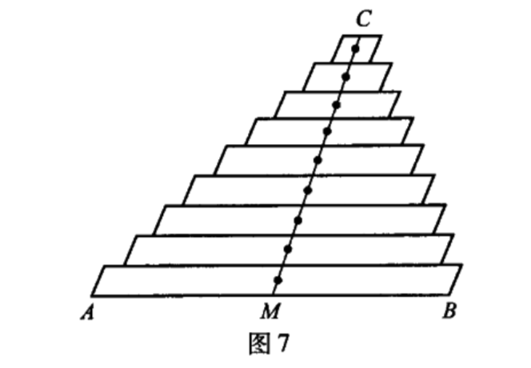
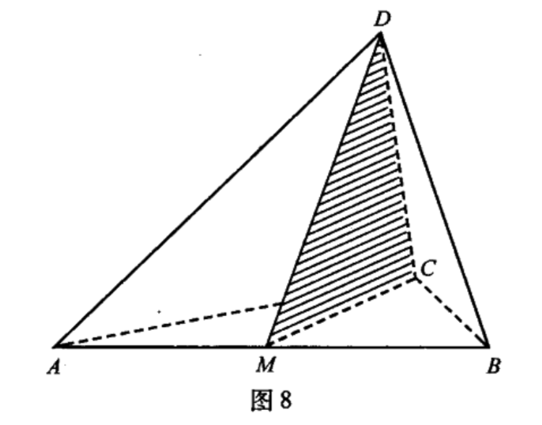
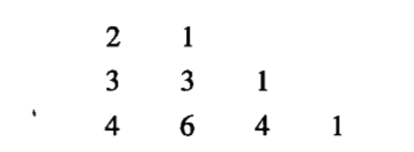
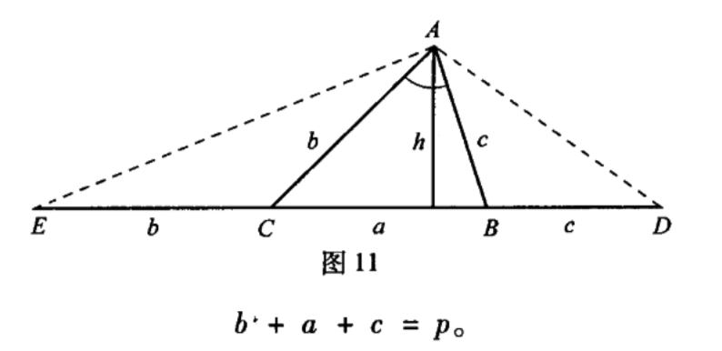
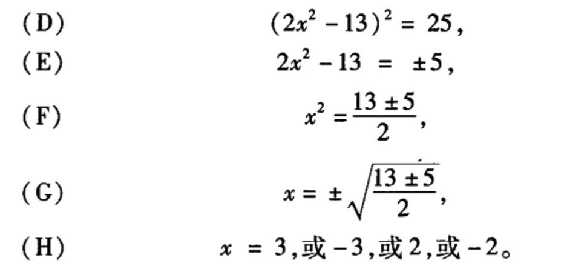

第三部分 探索索法小词典

## 3.1 类比

Analogy

类比是一种相似性。相似的物体在某些方面彼此一致，而类似的物体则在它们相应部分的特定关系上相一致。

1、一个长方形和一个长方体具有类似性。

事实上，长方形各边之间的关系同长方体各面之间的关系类似：长方形的每一条边只与另外一条边平行，而垂直于其他边。长方体的每一个面只与另外一个面平行，而垂直于其他面。

让我们约定把边称为长方形的「边界元素」，把面称为长方体的「边界元素」。那么，我们就可以将前面的两项表述简写为条对两种图形都适用的叙述：

每一个边界元素只与另一边界元素平行，而垂直于其他的边界元素。

1『这不就是抽象出公共模型么。（2021-01-18）』

这样，我们就把进行比较的矩形的边和长方体的面这两个对象所共同具有的某些特定关系表述出来了。这些体系的类比就存在于这种关系的共性之中。

2、类比渗透于我们所有的思想、我们每天讲的话和我们作出的琐碎的结论乃至艺术的表达方法和最高的科学成就。类比在各种不同的层次上得到应用。

人们常常使用含糊的、模棱两可的、不完整的或不完全清楚的类比，但是类比可以达到数学精度的水平。各种类型的类比都能在发现解答的活动中起到一定的作用，因此，我们不应忽视其中的任何一种。

3、在尝试去解一道题目时，如果我们能成功地想到一道更为简单的类比题目，那么可以说我们是幸运的。在第一部分第 15 节中，我们原来的题目是关于一个长方体的对角线的，而考虑到的更为简单的类比题目则是关于一个矩形的对角线的，这引导我们获得了原题的解答。我们再来讨论这样的一个例子。

求解下面这道题目：找出一个均匀四面体的重心。

在不懂积分知识，且对物理学不甚了解的情况下，这道题目确实不简单。在阿基米德（Archimedes）时代或者伽利略（Galileo）时代，这是一个重大的科学问题。

因此，如果我们想尽可能只用很少的初等知识就解决它，我们就必须尽力寻找一个更为简单的类比题目。在这里很自然会想到平面几何中的一道相应的题目：找出一个均匀三角形的重心。

现在我们就有了两个题目而不只是一个，但是两个题目也许比只有一个题目要容易解答 —— 假如能把这两个题目巧妙地联系起来的话。

4、先暂时把我们原来那个关于四面体的题目搁在一边，而把注意力集中在那个和三角形有关的更为简单的类比题目上。为了解这个题目，我们必须先具备一些有关重心的知识。下面这一原理听来似乎很可信，把它提出来也很自然。

假如一个物质系统包括几个部分，而每一部分的重心都在同一平面上，则整个系统 S 的重心也必在此平面上。

这个原理给出了我们在三角形这个例子中所需要的所有东西。首先，它说明三角形的重心必在此三角形所在的平面上；其次，我们可以把这个三角形看作由细条（薄片，「无限窄的」平行四边形）组成，这些细条都平行于三角形的某一边（图 7 中的边 AB）。

很明显，每一个细条的重心都是其中点，而且所有这些中点都在三角形顶点 C 到 AB 边中点 M 的连线上（见图 7）。

任何一个通过三角形中线 CM 的平面都包含了所有这些组成此三角形的平行细条的重心，由此引导我们作出结论：整个角形的重心也必在此中线上。不过它也必定在三角形的另两条中线上，它必定就是这三条中线共同的交点。

现在值得一做的是，用纯几何的方法而不依赖于任何力学上的假设来证明，三角形的三条中线交于ー点。

5、在解决了三角形的问题以后，四面体的问题也就相当简单了。现在我们已经解决了一道和我们要解的题目类似的题目，并且在解了这道题目以后，我们就有了一个可遵循的范例。

在现在我们作为范例的那道类比题目的求解中，我们把三角形 ABC 想象成是由平行于三角形一边 AB 的细条组成的。现在，我们把四面体 ABCD 也想象成是由平行于四面体一边 AB 的细条组成的。

组成三角形的所有细条的中心点都在一直线上，即此三角形的联结 AB 中点 M 和对顶点 C 的那条中线。组成四面体的所有细条中心点则都在一平面上，即由四面体一边 AB 中点 M 和其对边 CD 所组成的平面（见图 8），我们可以把这个平面 MCD 称作四面体的中面。

在三角形的例子中，我们有 MC 等三条中线，其中每一条中线都包含了三角形的重心。因此，这三条中线必交于一点，这点必然就是三角形的重心。

在四面体的例子中，我们有 MCD 等六个中面，即将某一边的中点和其对边联结起来获得的平面，其中每一个中面都包含了四面体的重心。因此，这六个中面必交于一点，它就是四面体的重心。

6、这样，我们就解决了均匀四面体重心的题目。为了使我们的解答完整，现在用纯几何的方法而不依赖于力学上的考虑来证明这六个中面通过同一点是值得一做的。

在解决了均匀三角形重心的题目以后，我们发现为了使解答完整，需要证明三角形三条中线通过同一点。这个题目和前面的题目类似，但显然要简单一些。

在解四面体的这一题目中，我们可以再次应用关于三角形的那个更为简单的类比题目（假设这个题目已经解决了）。实际上，考虑通过从顶点 D 出发的 DA、DB、DC 三边的三个中面，每一个中面都通过对边的中点（如过 DC 的中面通过点 M，见图 8)。现在，这三个中面和 ΔABC 所在的平面分别交于此三角形的三条中线，这三条中线交于同一点（这是那道更为简单的类比题目的结论），而这一点同 D 点一样，是三个中面的公共点。联结这两个公共点的直线即这三个中面的公共线。

我们证明了六个中面中通过顶点 D 的这三个面具有一条共线。这对于通过顶点 A 的三个中面也必成立，对通过顶点 B 的三个中面亦复如此，同样如此的还有通过顶点 C 的三个中面。把这些事实适当地联系起来，我们就可以证明这六个中面有一个公共点。（通过 ΔABC 三边的三个中面决定了一个公共点，而它们的三条截线也通过这个公共点。现在，根据我们刚才所证明过的，必有另外一个中面通过每一条截线。）

7、在第 5 点和第 6 点中，我们都应用了关于三角形的那道比较简单的类比题目，来解决关于四面体的题目，然而这两种情况在一个重要的方面有所不同。在第 5 点中，我们逐点模仿道比较简单的类比题目的解答方法。在第 6 点中，我们应用道较简单的类比题目的结果，而并不在意这个结果是怎么来的。有时候，我们也许可以对一道较简单的类比题目既利用其方法又利用其结果。如果我们把第 5 点和第 6 点看作是解答同一个题目的两个部分，那么甚至前面的这个例子也能说明这一点。

我们的例子是典型的。在解决一道提出的题目时，我们可以经常应用一道较简单的类比题目的解答，我们既可利用其方法，也可利用其结果，或者两者同时采用。当然，在一些更费力的例子中，也许会出现在本例中尚未出现的复杂情况。当那个类比题目的解答不能直接用在当前的题目里时尤其会发生这样的情况。那时在重新考虑它的解答时，就值得对其进行变化和修改，并且尝试各种不同形式的解答，直到最后找到可推广到原来题目的那种形式的解答。

8、我们希望能预见到答案，或者以一定程度的真实性至少预见到答案的一些特性。这种真实可信的预见常常是建立在类比的基础上的。

这样，我们可能知道，均匀三角形的重心同时也是它的三个顶点的重心（也就是说，把质量相同的三个质点放置在三角形三个顶点上）。知道了这个，我们就可以推测出，均匀四面体的重心和它四个顶点的重心重合。

这种推测是一种「类比推断」。在知道了三角形和四面体在许多方面具有相似性以后，我们就可以推测出它们还有另一个方面的相似性。绝对相信这种推测的真实性可能是不明智的，但绝对不相信它的真实性也同样是不明智的，也许会更愚蠢。

看起来类比推断是最普遍的推论方法，也许也是最重要的种。它提供了多少具有一定可信度的推测，这些推测也许可以用经验或更严密的推理加以验证，也可能不行。药学家在动物身上做实验来预测这些药物对人会产生的影响，通过类比来得出结论。然而我所认识的一个小男孩也是这样干的，他的宠物狗得送到兽医那儿去治疗，于是他问道：

「兽医是干什么的？」

「是动物的医生。」

「动物的医生是哪一种动物？」

9、由许多相似的例子进行类比所得出的结论要比由少数例子得到的结论有力。然而，在这里质量比数量重要得多。明确的类比比模糊的相似分量更重，有系统地安排的例子比随便收集起来的例子更有价值。

在前文（第 8 点中）我们提出了关于四面体重心的一个推测。这个推测是由类比得出的，四面体的情况和三角形中的情况是类似的。我们可以通过再检验另一个类似的例子来强化这个推测，这是一个关于一根均匀杆（即一段密度均匀的直线段）的例子。

线段 —— 三角形 —— 四面体

以上三者之间有许多方面类似。线段在一直线上，三角形在一个平面内，四面体则在空间中。直的线段是最简单的一维有界图形，三角形是最简单的多边形，四面体是最简单的多面体。

线段具有 2 个零维的边界元素（2 个端点），而它的内部是一维的。

角形具有 3 个零维边界元素和 3 个一维边界元素（3 个顶点和 3 条边），而它的内部是二维的。

四面体具有 4 个零维边界元素、6 个一维边界元素和 4 个二维边界元素（4 个顶点、6 条边和 4 个面），而它的内部是三维的。

这些数字可以汇编在一张表中。相连各列分别表示零维、一维、二维和三维元素的个数，相连各行则分别表示对应于线段、三角形和四面体的数目。只需要稍微有一点二项式展开的知识，你就能认出这是帕斯卡三角形的一部分。我们找出了线段、三角形和四面体中一个值得注意的规律。

10、如果我们已经感觉到我们所比较的对象之间是密切联系着的，像下面这样的「类比推断」也许就会对我们有一定的重要性了。

均匀杆的重心与其两个端点的重心重合。均匀三角形的重心与其三个顶点的重心重合。难道我们不应该猜测均匀四面体的重心与其四个顶点的重心重合吗？

还有，均匀杆的重心将杆两端之间的距离分为长度比为 1:1 的两段。均匀三角形的重心将任何一个顶点和其对边中点之间的距离分成 2:1 的两段。难道我们不应该猜测一个均匀四面体的重心会把任何一个顶点和其相对的面的重心之间的距离分成 3:1 的两段吗？

看上去非常不可能，由这些问题所提出的推测竟会是错的，一个如此完美的规律竟会被破坏。和谐而简单的秩序不可能是骗人的，这种感觉在数学或者其他学科中都指引着做出发现的人。有一句拉丁格言表达了这一点：simplex sigillum veri（简单性是真理的标志）。

上面所说的启示人们可以把它扩展至 n 维的情况。对于头三个维数，即 n=1, 2, 3 时是正确的东西，当 n 取更高的值时，其正确性看起来也不太可能会终止。这种推测是一种「归纳推断」，它说明归纳自然地建立在类比的基础之上。参见归纳与数学归纳。

11、我们以简单考虑一下通过类比来实现数学概念的精确性的一些最重要的情况来结束本节。

11.1）两个数学对象系统 S 和 S' 联系得十分紧密，支配 S 中各对象之间的规则也同时支配着 S' 中各对象。

S 和 S' 之间的这种类比关系可用我们在第 1 点中讨论的内容来引证，只要将 S 看作一个矩形的各边，将 S' 看作一个长方体的各个面。

11.2）在两个系统 S 和 S' 中的各个对象之间存在着一种保持某种关系的一一对应。也就是说，如果在一个系统中的各对象之间存在着一种关系，那么在另一系统中与其相对应的对象之间也必存在此种关系。两个系统之问这样的一种联系则是一种非常精确的类比，称之为同构（或称为全同构）。

11.3）在两个系统 S 和 S' 中的各个对象之间还存在着一种保持某种关系的一对多的对应。这样的一种联系（这在高等数学研究的各分支之中是很重要的，尤其是在群论中，这里不详细讨论）称为欠缺的同构（或同态，相仿映射也许是个更好的术语）。欠缺的同构也可以看作另一类十分精确的类比。

## 3.2 辅助元素

Auxiliary elements

当我们的解题工作进行到末尾时，我们对题目的想法会比开始时要多得多（见进展与成绩，1)。随着我们工作的进展，我们向原先的想法中注入新的元素。旨在促进求解而引入的元素称为辅助元素。

1、有各种各样的辅助元素。

在解一道几何题时，我们可能会在我们的图中引人一些新的线条，即辅助线；在解一个代数题时，我们也许会引入一个辅助未知量（见辅助题目，1)。我们希望通过一条定理的证明促进对原题的解答，这条定理就称为辅助定理。

2、有各种理由来引入辅助元素。

当我们顺利想起一道和我们的题目有关，而且以前解过的题目时，我们会很高兴。可能我们能应用这样一个题目，但是却不知道怎样来应用它。

比如说，我们现在试图要解的题目是一道几何题，我们顺利想起来的那个以前解过的相关题目是关于三角形的。然而在现在的图形里并没有三角形；为了尽可能利用我们想到的这个题目，我们必须有一个三角形。所以，我们必须通过在现在的图形中添加些适当的辅助线来引入ー个。

一般说来，想到了一个以前曾经解过的相关题目，并且希望能在目前的题目中应用它，我们常常要问：为了有可能应用它，我们是否应该引入某个辅助元素？（第一部分第 10 节中的例子是典型的。）

回到定义上去，我们会发现另外一个引入辅助元素的机会。例如，为了阐明一个圆的定义，我们不仅应该提到它的圆心和半径，同时也应该将这些几何元素添加到我们的图形中，如果不引入这些元素，我们就不可能对这个定义有任何具体的应用。叙述一个定义而不作图，那么它只能停留在嘴皮子上。

尽可能利用那些已知的结论和回到定义上去，是引入辅助元素的一些最好的理由，然而它们还不是仅有的理由。为了使题目的概念更完整、更具有启发性、更为人熟悉，我们可以引入些辅助元素，尽管我们几乎还不明确知道如何才能利用这些添加的元素。我们也许只是觉得添加这样或那样的元素对于理解这个题目来说是个「好主意」。

我们可能有这样那样的理由去引入一个辅助元素，但是我们总得有理由。不能随心所欲地引入辅助元素。

3、例子。已知三角形的一个角、从这个给定角的顶点向对边所作的高及该三角形周长。求作这个三角形。

我们引入适当的符号：用 a 表示已知的角，h 表示从的顶点 A 向对边所作的给定高，p 表示周长。

我们画一张图，在上面很容易标出 a 和 h。我们用到所有的已知数据了吗？没有，我们的图形中还未包括给定长度 p，它等于三角形周长。因此我们必须引入  p。但是怎样引入呢？

我们可以用不同的方式来尝试引入 p。图 9、图 10 表示的这些尝试看上去很笨拙。如果我们试图弄清为什么它们看上去如此令人不满意，就会发现这是因为它们缺乏对称性。

事实上，这个三角形具有三条未知的边 a、b、c。我们根据惯例，称 A 的对边为 a，我们知道 a+b+c=p。

现在，边 b 和 c 起的作用是相同的，它们可以互换，我们的题目对于 b 和 c 来说是对称的。但是在前面的图 9、图 10 中，b 和 c 没有起到相同的作用。放上了长度 p，我们对 b 和 c 的处理就不同了。图 9 和图 10 破坏了题目对于 b 和 c 的自然对称性。我们放置 p 时应该使它和 b 与 c 有相同的关系。

上面的考虑也许有助于提示我们如图 11 中那样来放置 p。我们在三角形的边 a 的一头延长长度为 b 的线段 CE，在另一头延长长度为 c 的线段 BD，这样 P 就作为线段 ED 出现在图 11 中，它的长度为：

如果我们对于解作图题有一点经验，就不应忘记在图中引入 ED 的时候，同时引入辅助线 AD 和 AE，它们分别都是一个等腰三角形的底边。事实上，在题目中引入像等腰三角形这样特别简单又熟悉的元素是很合理的。

到现在为止，我们在引入辅助线方面一直非常幸运。通过观察这个新的图形，我们也许就会发现 ∠EAD 和已知的角 α 之间有一种简单的联系。事实上，我们应用两个等腰三角形 ΔABD 和 ΔACE 后可知 ∠DAE=a/2+90°。注意到这一点后，很自然就会想到构造 ΔDAE，构建了此三角形，我们就引入了一个辅助题目，这个题目比原题要简单得多。

4、教师们和教科书的作者们不应忘记一点：聪明的学生和聪明的读者不会满足于只验证推理的各步骤都是正确的，他们也想知道各个不同步骤的动机和目标。引入辅助元素是引人注目的一步。如果一条巧妙的辅助线陡然出现在图形中，看不出任何动机，并能令人惊讶地解决了题目，那么聪明的学生和读者就会感到失望，他们觉得受骗上当了。

数学的趣味性就在于它需要我们推理和创造能力的充分发挥。但如果最为引人注目的步骤其动机和目的仍不可理解的话，那么我们在推理和创造方面就学不到任何东西。要通过适当的说明（正如前面，在第 3 点中所做的那样）或通过精心选择一些题目和提示（正如在第一部分第 10、18、19、20 节中所做的那样），使得这样的步骤可以理解，就需要花费大量的时间和精力，但这是值得的。

## 3.3 辅助题目

Auxiliary problem

辅助题目是这样的一种题目，我们考虑它并非为了它本身，而是因为我们希望对它的考虑可能有助于我们解决另一道题目，即我们原来的题目。这道原题才是我们要达到的目的，而这道辅助题目则是我们试图达到目的的一种手段。

一只飞虫试图通过一块窗玻璃逃出屋子，它试了又试，却不去尝试一下旁边那扇它由此飞进来的开着的窗子。人能够或至少应该能够做得更聪明一点。人的优越之处就在于，在遇到无法直接越过的障碍时他能绕开，当原来的题目看上去无法解决时，他能想出一个适当的辅助题目。想出一道辅助题目是一项重要的思维活动。能够提出一个有助于另一个题目解答的一道明确的新题目，能够清楚地将达到另一个目标的手段设想为个新目标，这是一种智力上的卓越成就。学习（或讲授）如何能聪明地处理辅助题目是一项重要的任务。

1、例子。

求满足下列方程的 x 值：`x^4 - 13x^2 + 36 = 0`。

如果我们注意到 `x^4 = (x^2)^2`，我们也许就会发现引入 `y = x^2` 的好处。这样我们就有了一个新的题目：

求满足下列方程的 y 值：`y^2 - 13y + 36 = 0`。

这个新问题是一个辅助题目。我们打算将这个题目作为解决原题的一个途径。辅助题目中的未知量 y 自当称作辅助未知量。

2、例子。

已知长方体由一顶点引出的三条棱长，求这个长方体的对角线长。

在试图解决这道题目（第一部分第 8 节）时，通过类比（第一部分第 15 节），我们也许会被引导到另一道题目上：已知矩形由一顶点引出的两条边长，求这个矩形的对角线长。

这道新的题目是一道辅助题目，我们希望通过考虑它，而能从中获得对解决原题有利的东西。

3、好处。

我们通过考虑辅助题目而获得的好处可能各种各样。我们可以应用辅助题目的结果。于是，在例 1 中，解得关于 y 的二次方程的根为 y 等于 4 或 9 以后，我们可推断出 x^2=4 或 x2^=9，并由此可得到 x 所有可能的值。在另一种情况下，我们可以应用辅助题目的方法。于是，在例 2 中，辅助题目是一道关于平面几何的题目。它和原题类似，但要简单一些，原题是道立体几何的题目。引入一道这类的辅助题目，期望它具有启发性，并使我们有机会熟悉特定的方法、运算或工具，能在原来的题目中应用它们，这是很合理的。在例 2 中，辅助题目的选择是相当幸运的，仔细地考虑它以后，我们发现既可以利用其方法，又可以利用其结果（见第一部分第 15 节，和你用到所有的已知数据了吗？）。

4、风险。

我们离开了原来的题目，而将时间和精力投入到辅助题目中，如果我们对辅助题目的研究失败了，我们投入的时间和精力也就浪费了。因此，我们在选择一道辅助题目时应该加以判断。我们也许会有各种充分的理由来支持我们的选择。辅助题目也许看上去比原题要容易解答，或者看上去更具有启发性，又或者它具有某种美学上的魅力。有时候辅助题目的唯一优点只是它是新的，提供了尚未探查过的可能性。我们选择它只是因为我们对原来的题目厌倦了，看起来所有可能的方法都已经用尽了。

5、如何去找到它。

发现既定题目的解，常常有赖于发现个合适的辅助题目的解。令人不快的是，没有一种一贯正确的方法总能找到合适的辅助题目，正如没有一种一贯正确的方法总能找到解答一样。然而，常常会有一些问题和提示是有用的，参见观察未知量。通过变化题目，我们常常能想到有用的辅助题目。

6、等价题目。

如果两道题目各自的解都包含了对方的解这两道题目就是等价的。这样，在例 1 中，原题和辅助题目等价。

考虑下面的定理：

A. 在任何等边三角形中，每个角都等于 60°。

B. 在任何等角三角形中，每个角都等于 60°

这两条定理并不等同。它们包括了不同的概念，一条涉及角形边的相等，另一条涉及三角形角的相等。但每条定理都可由另一条推出。因此，求证 A 的题目就和求证 B 的题目等价。

如果要求我们证明 A，那么引入证明 B 的题目作为辅助题目无疑有某些好处。定理 B 的证明要比 A 稍微容易一点，更重要的是，我们可能会预见到 B 比 A 要容易证明，我们也许能判断出这一点，也许从一开始就能发现，说 B 比 A 容易证明似乎很可信。实际上，定理 B 只与角有关，而定理 A 则既与角有关又与边有关，因此 B 比 A 更具「单一性」。

如果原题和辅助题目这两道题目是等价的，则我们把从原题转变到辅助题目的过程称为可逆约简，或双向约简，或等价约简。由此可见，从 A 到 B 的约简（见上文）是可逆的，例 1 中的约简也是如此。在某些方面，可逆约简要比其他引入辅助题目的方式更为重要，也更理想，但是与原题不等价的辅助题目也可能是十分有用的，正如例 2 所示。

7、等价辅助题目链在数学论证中是司空见惯的。

要求我们解题目 A，我们看不出如何解答，不过也许能发现 A 和另一道题目 B 等价。在考虑 B 时我们可能又会碰到一道题目 C 和 B 等价。照这样下去，C 又可化为 D，以此类推，直到我们最终碰到一道题目 L，它的解答是已知的或明显可知的。每一道题目都和前一道等价，于是最后一道题目 L 也必和原题目 A 等价，于是我们可以由题目 L 推出 A 的解答，而 L 是辅助题目链的最后一环。

这类题目链早已为希腊数学家所注意，正如我们可以从帕普斯一节里的重要段落中看到的。为了说明，让我们重新考虑下例 1，我们称（A）为未知量 x 要满足的条件：

（A）x^4-13x^2+36=0。

解决这道题目的方法之一就是将现在的条件转变为另一个条件，我们称之为条件

（B）(2x^2)^2-2(2x^2)·13+144=0。

我们观察到条件（A）和（B）是不同的。如果你愿意的话，可以说它们只是稍微有点不同。你很容易使自己相信它们肯定是等价的，但它们无疑并不完全相同。从（A）过渡到（B）的过程不仅是正确的，同时也有一个明确目的，这对任何一个熟悉二次方程解答的人来说都显而易见。

沿这一方向继续下去，我们再将条件（B）转换成另ー个条件（C)：

  (C)  (2x^2)2-2(2x^2)·13+169=25。
  
  以这种方式再继续下去，我们得到：

每一步约简都是可逆的。因此，最后一个条件（H）和第一个条件（A）是等价的，从而 3、-3、2、-2 就是我们原题的所有可能的解。

前面我们从原来的一个条件（A）推出一系列条件（B）、（C）、（D) …，其中每一个条件都和前一个条件等价。这一点值得我们给予最大的注意。等价的条件都由相同的对象来满足。因此，如果我们由已知的一个条件过渡到和它等价的一个新条件，我们得到的解答是相同的。但是如果我们由已知条件过渡到一个较为狭窄的条件，我们会失去某些解；而如果我们过渡到一个更为宽松的条件，我们会得出不正确的、增加出来的解，这个解和原题没有任何关系。

如果在一系列连续的约简中，我们过渡到一个较狭窄的条件，然后又过渡到一个较宽松的条件，我们可能会完全脱离原题的轨道。为了避免这种危险，我们必须仔细检査每一个新引入的条件的特性：它和原来的条件等价吗？如果我们要处理的不是像这样的单个的方程，而是一组方程，或者当条件不是用方程表示，比如说是一道几何作图题时，上面的这个问题就显得更为重要了。

（与帕普斯一节作比较，特别是其中的评注 2,3,4,8。在第 143 页，第 4 行到第 21 行的描述*受到一个不必要的限制，它描述了一个「求解题」的链，而链上的每一环都有一个不同的未知量。这里考虑的例子正好具有相反的特性：链上每一环的未知量都是相同的，不同的只是条件的表现形式。当然，这种限制并不是必要的。）

8、单向约简。

我们有两个没有解决的题目，A 和 B。如果我们能解决 A，我们就可由此得到 B 的完全的解；但反过来却不行，如果我们能解决 B，我们也许可以得到关于 A 的一些信息，但却不能从 B 的解答中得出 A 的完全解。在这种情况下，从 A 的解答中得到的收获要比 B 的解答大。我们不妨称 A 为两个题目中期望大的，而称 B 为期望小的。

如果我们从所提的题目过渡到一个期望更大的或者一个期望较小的辅助题目，我们就把这一步称为单向约简。单向约简有两种，但这两种无论如何都要比双向约简或可逆约简冒更大的风险。

我们的例 2 就是一种过渡到期望较小的题目的一个单向约简。

事实上，如果我们能解答原来那个关于长、宽、高分别是 a 、b、c 的长方体的题目，只要令 c=0，从而得到一个长、宽分别为 a、b 的矩形，我们就能转到辅助题目。

转向期望更小的单向约简的另一个例子见特殊化，3,4,5。这些例子都表明了在某些幸运的情况下，我们可以把一道期望小的辅助题目当作一块垫脚石：将这个辅助题目的解答再加上适当的补充说明，就能得到原题的解答。

过渡到期望大的题目的单向约简也可能成功（见普遍化，2 以及归纳与数学归纳，1,2 中第一个题目化为第二个题目的例子）。实际上，期望大的题目也许更容易着手，这就是创造者悖论。

## 3.4 波尔察诺

波尔察诺（Bemard Bolzano,1781~1848），逻辑学家和数学家。在他的综合性逻辑学著作《科学理论》（Wissenschaftslehre）中，有相当大的篇幅是关于探索法这一主题的（第三卷，第 293-575 页）。

他在著作的这部分中这样写道：

我根本不认为我能在此提出长久以来所有天才的人们都没有发现过的任何研究过程；我也根本不会承诺你能在此找到任何这类很新的东西。但是我所煞费苦心的是要以清晰的文字去表达一些研究的规则和方法，所有有才华的人都遵循这些规则和方法，甚至在大多数情况下他们是不自觉地这样做的。虽然我并不幻想这样做了就能获得完全的成功，但我仍希望这里提出的一孔之见能取悦于某些人，并在今后有所应用。

## 3.5 出色的念头

出色的念头（Bright idea），或称为「好念头」或「看到了希望」，是描述突然向解答跨出了一大步的通俗的表达法（参见进展与成绩)。

出色的念头的出现，对每个人来说都是一种熟悉的经历，但很难描述。所以注意一下像亚里士多德（Aristotle）这么一位古老的权威曾经偶然提到过关于它的一个建议性的叙述，也许会是很有趣的。

大多数人都会同意，想出一个出色的念头是一种「灵感活动」。亚里士多德是这样定义「灵感」的：灵感是在一段微不足道的时间里，通过猜想而获得事物本质的联系。

举例来说，如果你看到一个人在以某种方式和一个富人谈话，你也许立即就会猜想那个人正试图借钱。或者你发现月亮明亮的一边总是向着太阳，你也许会突然想到为什么是这样，那就是因为月亮是靠太阳的光而发亮的。

第一个例子不坏，只是太浅薄了。在猜测这类关于富人和钱的事情上，并不需要多少灵感，而且这个念头也并不十分出色。而第二个例子则给人以相当深刻的印象，如果你能发挥点想象力把它放到适当的环境中来看的话。

我们应该意识到，一个与亚里土多徳同时代的人如果想知道时间，他就得观察太阳和星星，因为当时没有手表；如果他想晚上旅行，那他就得观察月相，因为当时也没有路灯。

他要比现代的城市居民对天空熟悉得多，而且他的天生才智也没有因为报刊上关于天文理论的生搬硬套的零星知识而被蒙蔽。他把满月看作一只扁平的圆盘，和太阳的圆盘相似但远没有太阳明亮。他对于月亮的位置和形状的不断变化一定会感到疑惑。他观测到月亮偶尔也在白天出现，大约是在日出或日落的时候，并发现「月亮明亮的一边总是向着太阳」，这本身就是一项可观的成绩。

然后他又认识到月亮外观上的变化就好像一个从一边被照亮的球的外观变化，所以一半是亮的，另一半是暗的。于是他意识到，太阳和月亮并不像扁平的圆盘，而是像球体，一个发出光，另一个则接收光。

他理解了这种本质的联系，立即就「在一段微不足道的时间里」修正了他先前的概念，突然间就达到一个想象的高峰，产生一个出色的念头，灵光一闪。