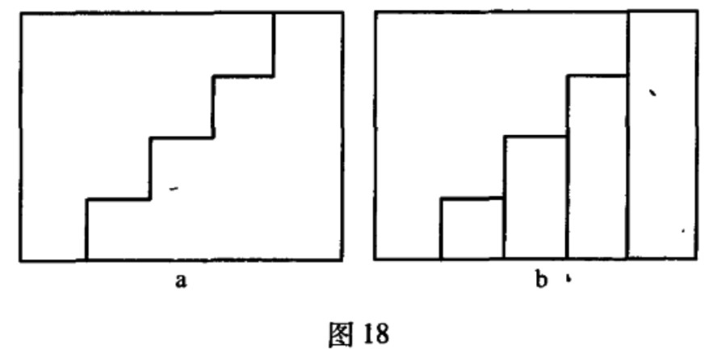

## 3.26 这里有一道题目和你的题目有关而且以前解过

Here is a problem related to yours and solved before

这是一条好消息。道题目，我们知道它的解答，而且又和我们现在的题目有联系，它当然是受欢迎的。如果这种联系密切，而解答又简单，那就更受欢迎了。这样的一道题目很有可能会有助于解答我们目前的题目。

我们在这里正在讨论的情况既典型，又很重要。为了看得更清楚，我将它与我们在解一道辅助题目时能发挥自己的特长的那种情况相比较。两种情况下我们的目的都是要解答某道题目 A，我们都引入并考虑了另一道题目 B，以期在考虑这另一道题 B 中得出某些对解决题目 A 有用的东西。

其区别在于我们与 B 的关系。在前者中，我们成功地回忆起了一道老题目 B，我们知道它的解答，但还不知道怎样利用它；在后者中我们成功地创造了一道新题目 B，我们知道（至少是强烈地感觉到）怎样利用 B，但还不知道怎样去解答它。我们关于 B 的困难造成了两种情况下的所有差别。一旦克服了这一困难，我们在两种情况下都可以用同样的方式来利用 B。我们可以利用它的结果或者方法（正如在辅助题目，3 中解释的那样），而且幸运的话，我们可以既利用其结果又利用其方法。在这里考虑的情况中，我们熟知 B 的解答，但还不知道如何利用它。因此，我们要问：你能利用它吗？你能利用它的结果吗？你能利用它的方法吗？

应用某道以前解过的题目的意图影响到我们对目前题目的考虑。在试图将新旧两道题目联系起来时，我们根据那道旧题目中某些重要元素来为新题目引入一些相应的元素。例如，我们的题目是求给定的四面体的外接球。这是一道立体几何题。我们也许会记起在平面几何中以前解过的一道类似题目：作出给定三角形的外接圆。然后我们想起，在那道平面几何的旧题目中，我们利用了三角形三边的垂直平分线。于是，尝试在我们现在的题目中引入一些类似的东西也就很合理了。由此，作为相对应的辅助元素，我们可在现在的题目中引入垂直平分四面体各棱的平面。有了这个主意以后，我们根据平面几何中的解答，就能很容易地得出这道立体几何题的类似解答了。

前面那个例子是典型的。考虑以前解过的一道相关题目引导我们引入一些辅助元素，而适当的辅助元素的引入使我们有可能最大限度地利用那道相关题目来解答我们当前的题目。为了达到这样的目的，当我们思考是否有可能去利用一道以前解过的相关题目时，我们就要提出下列问题：为了有可能应用它，你是否应该引入某个辅助元素？

有一条定理和你现在要证的有关，而且以前证明过。这是上面讨论的变异，在第一部分第 19 节中有例证。

## 3.27 探索法

Heuristic

探索法也可写成 heretic，或「ars Inveniendi」，它曾是某个分支学科的名称，但没有清楚地界定过。它属于逻辑学或者哲学，又或者属于心理学，它常常是提纲挈领式地阐述的，很少有详细陈述，而且今天简直已经被遗忘了。

探索法的目的是要学习「发现和创造」的方法和规则。我们可以在欧几里得的一些注释者那里找到这种研究的一些痕迹。在这一方面帕普斯的一段文章尤为有趣。在建立起一个探索法体系方面最著名的尝试当属笛卡儿和菜布尼茨，他俩都是伟大的数学家和哲学家。波尔察诺曾提出了关于探索法的一个著名的详细描述。我们的这本小册子试图以一种现代而朴素的形式来复兴探索法。见现代探索法一节。

Heuristic 用作形容词时的意思是「启发的」。

## 3.28 探索式论证

Heuristic reasoning

探索式论证并不是作为最终的严格的论证，而只是暂时的和看似合理的，它的目的是要发现当前题目的解。我们常常不得不采用探索式论证。在我们将要得到完整的解答时，我们应该得到完全的确定性，但在得到确定性以前，我们常常必须满足于一个多少有点看似可信的猜测。在得到最终论证以前，我们可能需要这种暂时性的论证。我们在构建一个严格的证明时需要探索式论证，正如我们建造栋房子时需要脚手架一样。

见「进展的标志」一节。探索式论证常常建立在归纳或类比的基础上；参见「归纳与数学归纳」（30节）及「类比」。（01节）

探索式论证本身是好的。但是如果把探索式论证和严密证明混淆起来，那就不好了。而以探索式论证来代替严密证明，那就更糟了。

某些学科的教学，尤其是教工程师和自然科学家微积分时，如果我们能更好地理解探索法的性质，坦率地认识到它的长处和局限，而且如果教科书又能公然提出探索式论证，那么教学就可得到显著改进。

一个得体而直接地提出的探索式论证可能会有用，它常常包含了严密论证的某些萌芽，从而能为严密证明做好准备。不过，如果是在游移于不自信和自负之间时作出的含糊不清的探索式论证，那么它更可能是有害的。参见「为什么证明？」

## 3.29 如果你不能解所提的题目

If you cannot solve the proposed problem

如果有这种情况，别让这种失败太折磨你了，去尝试在某些比较容易获得的成功中得到安慰，先尝试去解某道有关的题目，然后你可能又有勇气再去攻克原来那道题目了。别忘了，人的优势在于：在不能直接越过障碍时会绕过去，在原来的题目看上去不能解时会思考某道适当的辅助题目。

你能否想到一道更容易着手的相关题目？你现在应该创造一道相关题目，而不仅仅是回忆起一道相关题目来。我希望你早已尝试过回答下面这个问题了：你知道一道与它有关的题目吗？

在表中以本节标题开始的那一段中，所有其余的问题都有个共同的目标：变化题目。要达到这一目标有不同的方法，如普遍化、特殊化、类比以及其他分解和重组的各种方法。

## 3.30 归纳与数学归纳

Induction and mathematical induction

归纳是通过观察和组合特殊的例子来发现普遍规律的过程。它在所有科学中都有应用，甚至是数学中也有应用。数学归纳只用于数学，用来证明某种定理。这两个名称之间的联系实在是不适宜的，因为在这两种过程之间几乎没有什么逻辑联系。然而它们之间有一些实际应用上的联系。我们常常同时使用这两种方法。我们将用同一个例子来说明这两种方法。

1、我们可能碰巧发现：

	1+8+27+64=100

并且，意识到这些数都可写成立方或平方的形式，我们就可能把上面这个观察到的式子写成一种更有趣的形式：

	1^3+2^3+3^3+4^3=10^2

怎么会有这等事发生？一系列连续自然数的立方和等于一个数的平方，这种情况会经常发生吗？

在问这个问题时，我们就像是一个博物学家，一种奇异的植物或一种奇异的地质构造会给他留下深刻的印象，并使其构思出一个普遍问题。我们的普遍问题是关于连续自然数的立方和：

	1^3+2^3+3^3+…+n^3

这个问题是由 n=4 的那个「特殊的例子」引出的。

对于我们的问题，我们能做些什么呢？我们能按博物学家们所会做的那样，去考察别的特殊例子。n=2,3 的特例更为简单，而 n=5 则是接下去的一种情况。为了一致性和完整性，让我们把 n=1 的情况加进去。将所有这些情况整齐地排列起来，就像一位地质学家会把他的某种矿砂的标本排列起来那样，我们就得到下表：

```
1=1^2

1+8=3^2

1+8+27=6^2

1+8+27+64=10^2

1+8+27+64+125=15^2
```

如果认为所有这一些连续自然数的立方和，仅仅是碰巧才等于某个数的平方，那就很难使人相信了。在类似的情况下，博物学家对从以往的特例中获得的普遍规律的正确性基本上是不会怀疑的，普遍规律几乎总是通过归纳来证明的。数学家自然基本上也是以同一方式思考的，但他在表明这一点时却会謹慎得多。他会说，下面的定理是由归纳有力地表明的：

开头 n 个立方数的和是一个平方数。

2、我们已经推测到一条不寻常的而且有点神秘的规律。为什么这些相继立方数之和是平方数？但显然，它们是平方数。

在这样的情况下，博物学家会怎么去做？他会继续仔细检查他的猜测。为此，他会遵循不同的研究路线。博物学家可能会进一步积累实验事实。如果我们也想这么做的话，就要检验 n=6,7, …这些后面的情况。博物学家也可能把引导他做出这种推测的那些观察事实再检验一遍。他将它们仔细地作比较，从中试图理出某种更深刻的规律，以及更进一步的类比。让我们遵循这种研究路线。

我们来重新检验已排列在图表中的 n=1,2,3,4,5 的那些情况。为什么这些和都是平方数？关于这些平方数我们能说出什么？它们的底数是 1,3,6,10,15，关于这些底数有什么情况？有没有某种更深刻的规律、更进一步的类比？不管怎么说，它们的增长看上去并非太不规则。它们是怎样增长的？在这个数列中两个相邻数字之间的差值本身也是增加的：

3-1=2,6-3=3,10-6=4,15-10=5。

现在，这些差值明显是有规律的。在这里我们可以发现这些平方数的底数之间呈现出一种惊人的规律性，我们可以看到在 1,3,6,10,15 这些数字中有一种值得注意的规律：

```
3=1+2

6=1+2+3

10=1+2+3+4

15=1+2+3+4+5
```

如果这种规律是普遍的（如果不是，那倒是难以置信的），那么我们所猜测的定理就有了一种更精确的形式，即：

对于 n=1,2,3, …有：

	1^3+2^3+3^3+…+n^3=(1+2+3+…+n)^2

我们刚才所述的规律是由归纳得出的，发现这一规律的方法告诉我们关于归纳的概念，这种概念必然是片面的、不完整的，但不是弯曲的。归纳试图在观察中发现规律性和一致性。它最显著的手段是普遍化、特殊化、类比。试验性的普遍化从努力理解观察到的事实开始，它以类比为基础，并用更进一步的特例加以检验。

关于归纳，哲学家们多有分歧，我们不再就这一论题作进一步的评论。但应该补充一点的是，许多数学上的结论都是先由归纳得出，然后才得以证明的。严格表述的数学是一门系统的演绎科学，但在形成过程中的数学则是一门实验性的归纳科学。

4、如同在物理科学中那样，在数学中我们也可以应用观察和归纳来发现普遍规律。但其中有一个差别。在物理科学中再没有比观察和归纳更高的权威了，而在数学中则存在这样的一个权威：严格的证明。

在做了一段试验性的工作后，可能最好转变一下我们的观点，让我们严格起来。我们已经发现了一个有趣的结论，而引导我们得到它的推理却只是貌似可信的试验性的、暂时性的、探索式的；让我们尝试通过一种严格的证明把它明确地建立起来。

我们现在就面临了一道「证明题」：证明或推翻前面所述的结果（见上文第2点）。

这里作一个小的简化。你们可能知道

1+2+3+…+n=n(n+1)/2

无论如何，这是容易证明的。假设有一个矩形，它的两边长分别为 n 和 n+1, 由一根折线把它分成两半，图 18a 表示 n=4 的情况，其中每一半都是「阶梯形」的，它的面积可表示为 1+ 2+…+n，对于 n=4 的情况，面积为 1+2+3+4，见图 18b。现在，整个矩形的面积为 n (n+1），而其中阶梯形的面积是其一半，这就证明了上面的公式。



我们可以将由归纳得到的结果改写成下面的形式：

	1^3+2^3+3^3+…+n^3=(n(n+1)/2)^2

5、如果我们不知道怎样证明这一结论，至少可以检验下。首先我们来验证第一种还没有验证过的情况，即 n=6 的情况，对于这个值，公式成为。

计算以后发现这是正确的，等式两边都等于 441。

我们可以更有效地来验证这个公式。这个公式很可能是普遍成立的，即对于任何 n 值都成立。当我们从一个任意 n 值再过渡到下一个 n+1 的值时，它仍然成立吗？

根据上面的公式，我们也应该有

	1^3+2^3+3^3+…+n^3+(n+1)^3=((n+1)·(n+2)/2)^2

现在，要作一个简单的检验：在这个公式中减去上面的公式，我们就得到:

	(n+1)^3=((n+1)·(n+2)/2)^2-(n(n+1)/2)^2

而这很容易检验。等号右边可写成 XX。

我们由试验发现的公式通过了一次极其重要的检验。

让我们来看清楚这一检验意味着什么。我们确定无疑地证明了：

	1^3+2^3+3^3+…+n^3+(n+1)^3=((n+1)·(n+2)/2)^2

我们不知道：

	1^3+2^3+3^3+…+n^3=(n(n+1)/2)^2

是否正确。但如果我们知道它是正确的，则加上我们刚才确定无疑地证明了的那个等式，就可以推断出：

	1^3+2^3+3^3+…+n^3+(n+1)^3=((n+1)·(n+2)/2)^2

也是正确的。这是对下一个整数 n+1 的同样的推断。现在我们确实知道，我们的推测对于 n=1,2,3,4,5,6 的情况都成立。根据我们刚才所说的性质，既然这个推测对于 n=6 成立，那么对于 n=7 也必成立；既然对于 n=7 成立，那么对于 n=8 也必成立；既然对于 n=8 成立，则对于 n=9 也必成立；以此类推。它对于所有的 n 都成立，即证明了它是普遍成立的。

6、前面的证明可在许多相似的例子中作为一种模式。这模式的主要思路是什么？

我们要证明的论断必须事先以精确的形式给出。

论断必须由一个整数 n 决定。

论断必须足够「明确」，使得我们有可能验证从 n 过渡到下一个整数 n+1 时它是否仍成立。

如果我们有效地成功检验了这点，我们就可以应用在检验过程中获得的经验来得出下列结论：只要这个论断对于 n 成立则它对于 n+1 也必成立。如果我们能做到这一点，那么我们只要知道此论断对于 n=1 成立就足够了；因为由此可得出它对于 n=2 也必成立；对于 n=3 也必成立等等。从任意整数过渡到下一个，我们就普遍地证明了这一论断。

人们经常使用这一过程，因此它应该有一个名字。我们可以称它为「从n到n+1的证明」，或更简单地称它为「过渡到下整数」。不幸的是，公认的专业术语是「数学归纳法」。这个名字是随便起的。我们要证明的精确论断可能有任何来源，而从逻辑的观点来看，来源是什么并不重要。

在许多例子中，正如我们在这里详细讨论的例子，来源就是归纳，论断是以试验性的方式发现的，因此论证就像是对归纳的一个数学补充，这解释了它的名字。

7、还有另外一点，这一点虽然有些微妙，但对于任何一个想自己去论证的人来说都很重要。在前文中，我们通过观察和归纳先后发现了两条不同的论断，第一条在第 1 点中，第二条在第 2 点中，第二条比第一条更精确。运用第二条论断，我们发现种检验从 n 过渡到 n+1 的可能性，由此我们可以用「数学归纳」找到一个证明。运用第一条论断，而忽略由第二条所添加的精确性，我们就不大可能找到这样的证明。事实上，第一条论断不如第二条那么精确、「明显」、「确凿」，它不及第二条那么易于试验和检査。从第一条过渡到第二条，从不太精确过渡到精确的陈述，是为最后证明所作的一种重要准备。

上述这种情况中有一个矛盾的方面。第二条论断更为有力，它直接蕴含着第一条；反之，多少有点「含糊」的第一条论断则很难包含更为「清晰」的第二条。由此，有力的理论却比比较弱的更容易掌握，这就是创造者悖论。