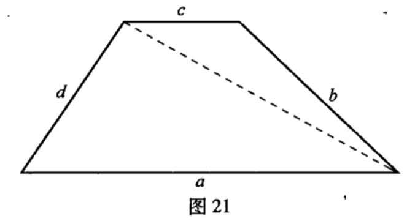
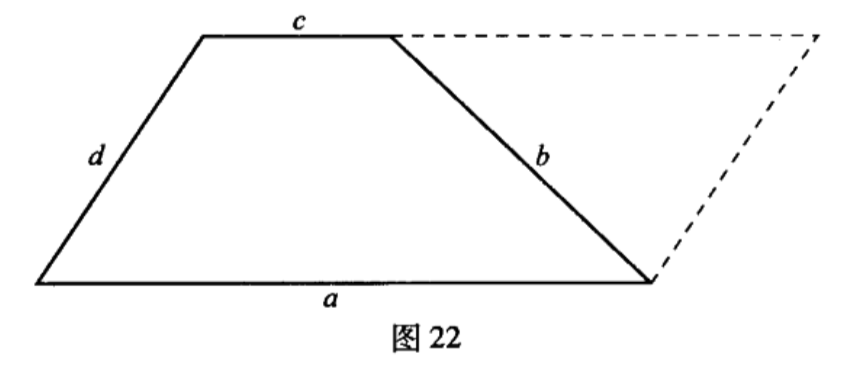
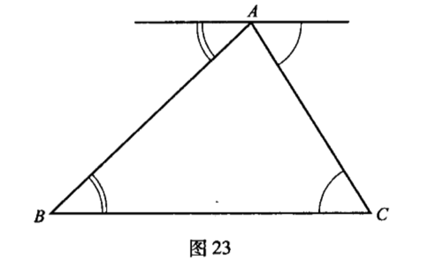
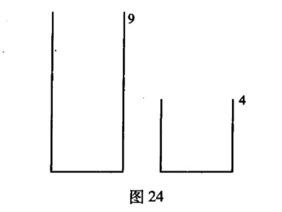
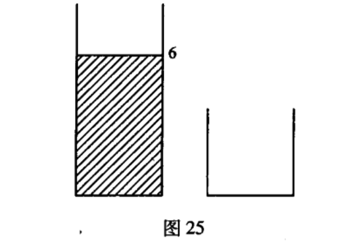
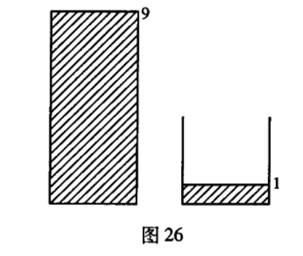
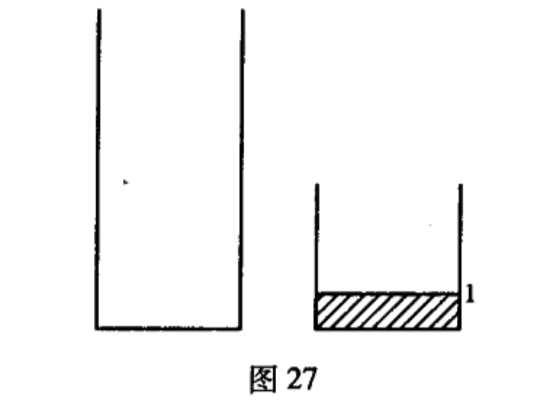
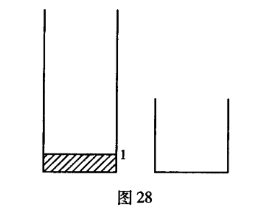
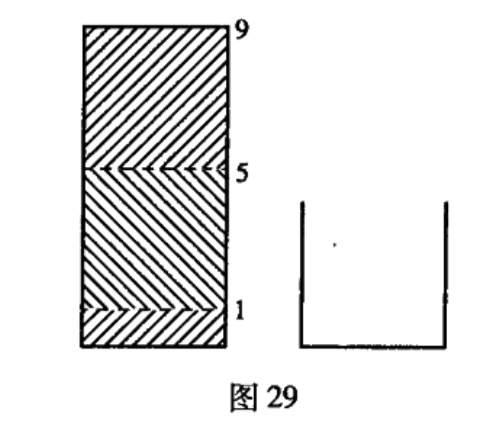
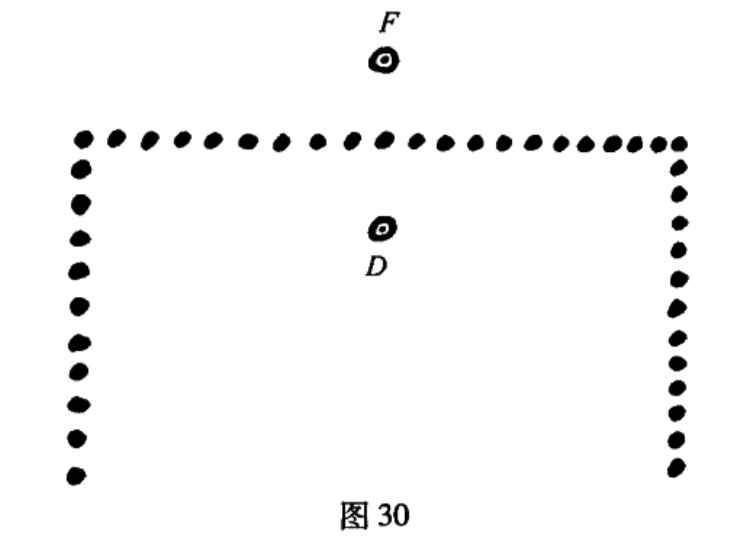

## 3.62 传统的数学教授

The traditional mathematics professor

民间传说中传统的数学教授是心不在焉的。他当众出现时，常常好像双手都拿着丢失了的雨伞似的。他宁愿面对黑板，也不愿意转过身来面对班级。他写的是 a，说的是 b，意思指 c，实际上应该是 d。他的一些名言一代一代地传了下来。

「要解这道微分方程，你就盯着它看，直到你想到一种解法。」

「这个原理是如此普遍，它不可能有什么特殊应用。」

「几何是根据不正确的图形做出正确推理的艺术。」

「我克服困难的办法就是绕过它。」

「方法和手段有什么不同？方法就是你用了两次的手段。」不管怎么说，你还是能从这位传统的数学教授那儿学到一点东西的。我们希望那种你从他身上学不到任何东西的数学教师可不要变成传统的才好。

## 3.63 变化题目

Variation of the problem

一只飞虫（正如别处所提到过的那样）试图穿过窗玻璃逃出去，它一遍又一遍地重复这个没有希望的动作，却不去试试旁边那扇开着的窗，而它就是穿过那扇窗飞进屋子里来的。老鼠可能要聪明一些，它落入鼠笼以后，试图从两根栅栏之间挤出来，然后再试另外两根，如此这般。它改变它的尝试，探索各种可能性。人能够，或者说应该能够更加聪明地改变他的尝试，以更深入的理解来探索各种可能性，通过自己的错误和缺点来认识。「试试，再试试」是一条流行的忠告。它是一条很好的忠告。飞虫、老鼠和人都遵照它办事；但是如果哪个遵照它办事的人比另一个更成功的话，那是因为他能更聪明地变化他的题目。

1、在我们的工作结束时，当我们得到了解答以后，我们对题目的概念要比一开始更加丰富，更加充分。由于我们期望将对于题目最初的概念进展到一个更加充分、更加适合的概念，我们尝试不同的立场，从不同的方面来观察题目。

解题的成功决定于选择正确的角度，决定于从容易接近的侧来攻克要塞。为了找出哪一个角度是正确的，哪一侧是容易接近的，我们要尝试各种侧面和角度，我们要变化题目。

2、题目的变化必不可少，这个事实可以用不同的方式来解释。从某种观点来看，解题中的进展似乎就是对以前获得的知识进行了动员和组织。我们必须从记忆中提炼出某些元素并运用到题目中去，现在，题目的变化能帮助我提炼出这样的元素。怎样帮助呢？

我们记忆事情是通过一种叫做「思维联想」的「联系活动」来进行的。我们记忆中现存的东西往往使我们回忆起在以前某种情况下与它有联系的东西。（这里由于篇幅所限，同时也没有必要对关联理论作比较简洁的介绍，或是去讨论它的局限性。）变化题目时，我们引入新的内容，从而建立了新的联系，产生联系与我们的题目有关的各元素的新的可能性。

3、我们不能指望没有极度的专心就能解答什么有价值的题目。但是如果非常专心地集中注意力于某一点上，我们很容易就会感到疲劳了。为了保持我们的注意力活跃，注意力指向的对象必须不断地改变。

如果我们的工作获得进展了，还有一些事情要做，还有一些新的点要检验，我们的注意力就被占据了，兴趣也活跃起来。但是如果我们没有获得任何进展，我们的注意力就会松解，兴趣就会减退，我们对题目感到厌倦，思想开始涣散，接下去就可能有整个儿失去题目的危险。为了逃离这种危险，我们必须给自己提出一个关于这道题目的新问题。

这个新问题提供了一种未经考验的、与我们以前的知识发生联系的可能性，它重新唤起我们对建立有用的联系的希望。这个新问题通过变化题目，展现它的某个新的方面，重新引起了我们的兴趣。

4、例子。

四棱台的底面是正方形，已知它的下底面边长为 a，上底面边长为 b，棱台高为 h。求该棱台的体积。

这个题目可以向熟悉棱柱及棱锥体积公式的班级提出。如果学生们自己想不到什么主意，教师可以从变化题目中的已知数据开始。我们开始时的棱台是 a>b 的。如果 b 不断增大直到它与 a 相等时会怎样呢？这时棱台就变成了一个棱柱，问题中的体积变成 a^2h。如果 b 不断减小直到它等于 0 时又会怎样呢？这时棱台变成了一个棱锥，问题中的公式变成了 (a^2h)/3。

这种数据的变化首先有利于产生对题目的兴趣。其次，它可以提示以这种或那种方式来利用引入的关于棱柱和棱锥的结果。不管怎么说，我们已经得到了最后结果的一些明确性质，最终的公式在 b=a 时应简化为 a^2h，在 b=0 时应简化为 (a^2h)/3。

能预见到我们试图得到的结果的性质是有好处的。这种性质能给我们提供有价值的建议，不管怎样说，在得到最终的公式以后，我们能够利用这种性质来检验它。因此，我们对于下面这个问题预先就有了一个答案：你能检验这个结果吗？（见该节第 2 点）

5、例子。

已知梯形的四边长为 a、b、c、d，求作这个梯形。

令 a 为梯形下底，c 为上底；a 和 c 平行但不相等，b 和 d 不平行。如果想不出任何其他主意的话，我们可以从变化数据开始。

我们从一个 a> c 的梯形开始。如果 c 不断减小直到它等于 0 时会怎样呢？这时梯形退化成一个三角形。现在，三角形是一个熟悉而简单的图形，我们能用不同的数据来作出三角形，引入这样的三角形到这个图形中是会有些好处的。我们通过只画出一条辅助线，即梯形的一条对角线，就将它引入了（见图21）。然而我们检验这个三角形时却发现，它几乎没有什么用处。我们知道它的两条边 a 和 d，但我们应该要有三个数据才行。

让我们来试一下其他途径。如果 c 不断增大直到和 a 相等时又会怎样呢？这时梯形变成了一个平行四边形，我们能利用它吗？稍作一下检验（见图2），我们就注意到在画平行四边形时添加在原来的梯形上的那个三角形。这个三角形很容易画出，我们知道它的三个数据，即它的三条边 b、d 和 a-c。

通过变化原题（求作梯形），我们已经被引导到一道更容易着手的辅助题目（求作三角形）。利用这道辅助题目的结果我们就可以轻易地解答原来的题目（我们必须将这个平行四边形画完整）。

我们的例子是有代表性的。我们第一次尝试的失败也是有代表性的，但是我们回过头来看它时，就会发现第一次的尝试也不是完全没用的。其中还是有些思想，尤其是，它给了我们一个良机，能想到作出一个三角形来作为达到目的的途径。事实上我们正是通过修改我们第一次不成功的尝试才得到了第二次成功的尝试。我们变化了 c，先是尝试减小它，然后又尝试增大它。

6、正如在前面的例子中那样，我们常常必须尝试对题目作不同的修改。我们必须一次又一次地变化、重述、变换，直到最终成功地找到一些有用的东西。我们可以在失败中学习，在一次不成功的尝试中也许会有某个好的想法，而且我们通过修改一次不成功的尝试也许可以得到一个更为成功的尝试。如上例所示，我们在不同的尝试后得到的往往是一道更容易着手的辅助题目。

7、有一些变化题目的方式是典型有用的，诸如回到定义上去、分解和重组、引入辅助元素、普遍化、特殊化，及使用类比等等。

8、我们刚才（第3点中）谈到有关能重新贏得我们兴趣的新问题的内容，对正确使用我们的表是很重要的。

教师可以利用这张表来帮助他的学生。如果学生有进展，他就不需要任何帮助，教师也不应问他什么问题，而是让他独立工作，这显然更有利于他的独立性。但是当他停滞不前时，教师当然应该寻找某个合适的问题或建议来帮助他。因为那时产生了一种危险性，学生可能会对题目感到厌倦而把它扔在一边，或者丧失了兴趣并由于完全的漠不关心而犯下愚蠢的错误。

我们可以利用这张表来解答我们自己的题目。为了正确地使用它，我们遵照前面例子中的做法。当我们的进展令人满意新的迹象自发出现时，用一些不相干的问题来妨碍自然的进展简直是愚蠢的做法。但是当我们停滞不前，当我们想不到什主意时，我们就有对题目感到厌倦的危险。因而这就是我们该考虑一个可能有用的一般性的想法，考虑这张表中的某一个可能适用的问题或建议的时候了。我们欢迎每一个有可能显示出题目的一个新方面的问题，它可以重新引起我们的兴趣，使我们继续工作和思考。

## 3.64 未知量是什么？

What is the unknown？

要求的是什么？你想要什么？你应该去寻找什么？

已知数据是什么？已知的是什么？你有些什么？

条件是什么？未知量通过什么条件与已知数据相联系？

教师可以使用这些问题来检验学生对题目的理解程度，学生应该能够清楚地对它们做出回答。此外，它们将学生的注意力引向一道「求解题」的主要部分，即未知量、已知数据和条件。由于有必要对这些部分一遍又一遍地进行考虑，这些问题在解答过程的后面几个阶段中还会常常重复。（参见第一部分第 8、10、18、20 节；建立方程，3，4；实际题目，1；谜语及别的地方提到过的一些例子。）

这些问题对于解题者是极其重要的。他检查自己对题目的理解，他把注意力集中于题目的这个或那个主要部分。问题的解答本质上就是把未知量与已知数据联系起来。因此，解题者必须再三地把注意力集中在这些元素上，并自问：未知量是什么？已知数据是什么？

题目可能会有很多未知量，或者条件可能有几个需要分开考虑的不同部分，或者对某个数据可能最好是单独考虑。因此，我们可以使用问题的不同变化形式，如：未知量是哪些？第一个已知数据是什么？第二个已知数据是什么？条件的各个不同部分是什么？条件的第一个条款是什么？

一道「证明题」的主要部分是题设和结论，而相应的一些问题是：题设是什么？结论是什么？我们也许需要这些常常有用的问题在文字表达上的某种变化或变形，如：你假定的是什么？你的假定中的各个部分是什么？（见第一部分第 19 节中的例子。）

## 3.65 为什么证明？

Why proof？

关于牛顿，有一个传说的故事在他还是个年轻学生的时候，像他那个时代通常所做的那样，他从阅读欧几里得的《几何原本》开始学习几何。他阅读这些定理，认为它们是正确的，并忽略了证明过程。他感到疑惑：为什么人们要煞费苦心地去证明那些很明显的东西呢？然而，许多年后，他改变了他的看法，并对欧几里得由衷地表示赞赏。

这个故事不知是否可靠，不过下面这个问题还是存在的：为什么我们应该学习或者讲授证明过程？什么更为可取：根本不去证明，或者每件事都证明，还是证明其中一些？而如果要证明其中一些的话，该证明哪一些？

1、完全证明。

对于某种类型的逻辑学家来说，只存在完全证明。要成为一个证明，必须没有缺口、没有漏洞、没有任何的不确定之处，否则它就不成其为证明。我们在日常生活中，或者在法律程序中，或者在自然科学中有没有可能找到根据如此高的标准作出的完全证明？几乎没有。因此很难理解，我们是怎么会获得如此严格的一个完全证明的概念的。

我们不妨稍带夸张地说，人类是从一个人和一本书那里得到这个概念的：欧几里得和他的《几何原本》。不管怎么说，学习平面几何的基本原理仍能提供获得严格证明这一概念的最好机会。

让我们以证明下面这条定理为例：任何三角形的三个内角之和等于两个直角。

对我们中的大部分人来说，图 23 已经成为我们之中大多数人的知识财富中不可分割的一部分，因此几乎无需再对它作解释了。过顶点 A 有一直线和 BC 边平行，由于内错角普遍相等，三角形中 B 点和 C 点处的角与 A 点处相应的角相等，这在图中已强调指出。于是三角形的三内角就等于以 A 为公共顶点的三个角，而后面的这三个角构成了一个平角，或者说是两个直角，由此该定理就得证了。

如果一个学生完成他的数学课程，但是却没有真正理解如上面所述的这样的一些证明，他就有权向他的学校和教师提出尖锐的批评。事实上，我们应该把比较重要的东西和不太重要的东西区别开来。

如果这个学生不熟悉某一个具体的几何事实，那么他的损失并不太大，在他今后的生活中，他可能几乎不会用到这些事实。但是如果这个学生不熟悉几何证明的话，那么他就损失了关于确实证据的一些最好最简单的例子，也错过了获得严格论证这一概念的最好机会。没有这个概念，在现代生活中他就缺少一个真正的、用来对他的各种所谓证据作比较的标准。

简言之，如果普通教育打算给予学生直观证据和逻辑推理的概念，它就必须为几何证明留下一席之地。

2、逻辑系统。

欧几里得的《几何原本》中所提出的几何并不是一些事实的简单堆砌，而是一个逻辑系统。公理、定义和命题不是按随机的顺序列出，而是以一个完善的顺序列出的。每一个命题都这样安排，使它能以前面的公理、定义和命题为基础。我们可以将这种命题的编排方式看作是欧几里得的主要成就，而它们的逻辑系统则是《几何原本》的主要价值所在。

欧几里得几何不仅是一个逻辑系统，而且是这类系统的第一个也是最了不起的一个例子，其他的科学领域已经而且至今仍在努力模仿。其他的科学领域——尤其是那些和几何关系甚小的，如心理学或法学——是否应该模仿欧几里得的严格逻辑？这是一个可以争辩的问题，但是如果谁不熟悉欧几里得的逻辑系统，他就没有能力参与这一辩论。

现在，几何体系是和证明胶合在一起的。每一个命题都通过证明和前面的公理、定义和命题相联系。不理解这样的证明我们就无法理解这个系统的精髓。

简言之，如果普通教育打算给予学生逻辑系统的概念，它就必须为几何证明留下一席之地。

3、助记系统。

作者认为直观证据、严格推理和逻辑系统的概念对每个人都不是多余的。然而，可能在有些情况下，由于没有时间或者别的原因，学习这些概念不是绝对必要的。但即使在这种情况下，我们仍希望能学习证明。

证明提供证据，在这样做的时候，它们共同组成了一个逻辑系统，而且它们帮助我们记起组合起来的各项内容。以上面讨论过的图 23 为例，这个图形清楚地说明了三角形三内角之和等于 180。该图形又将这个事实和内错角相等的另一个事实联系起来，而相互联系的事实要比孤立的事实有趣得多，也更容易记忆。因此，这张图使我们将两个相互联系的几何命题牢记在心，最后这张图和这些命题就会成为我们不可分割的知识财富。

在下面我们要讨论的情况中，我们认为获得一般性的概念不是必要的，而只是希望得到某些事实的要领。即使是在这样的情况下，这些事实也必须在某种联系某种系统中呈现出来，这是因为孤立的内容学起来费力而且容易被遗忘。这里任何能把这些事实简单、自然、牢固地结合在一起的联系都是受欢迎的。这个系统不需要建立在逻辑基础上，只须设计成有助于有效地记忆，它必须是一个所谓的助记系统。然而，即使是从一个纯助记系统的观点来看，证明也是有用的，尤其是简单的证明。例如，学生必须学习关于三角形内角和的内容和另一个关于内错角的内容。难道还有什么办法能比图 23 更简单、更自然或更有效地去记住这些内容吗？

简言之，即便是一般的逻辑概念不具有什么特别的重要性时，证明作为一种助记方法也可能会有用。

4、食谱系统。

我们已经讨论了证明的优点，但无疑并没有去提倡所有证明都应该「详细」给出。相反地，有些情况下几乎不可能这么做，其中一个重要的例子就是给学工程的学生教授微积分。

如果要用现代的严格标准来讲解微积分，这就要求有一定难度和精细程度的证明（ε-证明）。但是工程师们是为了应用而学习微积分的，而且他们既没有足够的时间，也没有足够的训练或兴趣去奋战冗长的证明或者欣赏它们的精妙。由此，我们就很强烈地想把这些证明都删掉。然而这样做，我们就把微积分降到了食谱的水平。

食谱对所有的原料和过程作了详细的描述，但是既没有这种配方的证明，也没有这种调制方法的理由。要证明布丁的好坏，一尝便知。食谱可以极好地为它的目的服务。事实上，它不需要有任何一类的逻辑或助记系统，因为食谱是手写的或印刷的，并非保留在记忆之中。

但是如果一位微积分教科书的作者或者一位大学教师过于遵循这种食谱系统，他就很难达到他的目的。如果他只教授程序而不教授证明，这种动机不明的程序就不能被理解。如果他只讲规则而不讲理由，这种相互不联系的规则就会很快被遗忘。数学不能完全以品尝布丁的方法来进行测试，如果把所有类型的推理都排除在外，一门微积分课程就很容易会变成一锅由难以消化的信息构成的毫无条理的杂烩。

5、不完全证明。

处理过分证明和食谱水平之间的两难问题的最好方法也许是合理使用不完全证明。

对于一个严格的逻辑学家来说，一个不完全证明根本不能算是证明。而且我们无疑应该小心地区分不完全证明和完全证明，将两者混为一谈很不好，为了一个而牺牲另ー个就更糟了。如果一本教科书的作者含含糊糊地提出一个不完全证明，其中可以明显看出他对于证明的完全性是该羞愧还是该自负犹疑不定，那将是很痛苦的。但是当不完全证明在适当的地方得体地提出时，它也会有用。它们的目的不是要去代替完全证明（这是它们绝对不可能办到的），而是要使问题的陈述有趣味性和连贯性。

例 1：一个 n 次代数方程恰好具有 n 个根。

这个被高斯（Gauss）称为「代数基本定理」的命题必须经常向那些还不足以理解其证明的学生提出。但是他们知道一次方程有一个根，也知道某一个ニ次方程有两个根。此外，这个困难的命题还有一个很容易证明的部分：任何 n 次方程都不可能具有多于 n 个相异的根。上面所述的事实是否足以构成对这条「基本定理」的完全证明？绝对不够。但是它们已足以使这个基本定理有趣并看似正确一一并使学生们将这条定理牢记在心，而这是主要的。

例 2：一个三面角的三条边所构成的三个平面角中，任意两个平面角的和大于第三个。

很明显，这条定理就等于肯定在个球面三角形中任意两边之和大于第三边，注意到这一点以后，我们自然就会想到球面三角形和直线三角形之间的类比。上面这些说明是否构成了一个证明呢？绝对没有。但它们能帮助我们理解并记住所提出的这条定理。

我们的第一个例子具有历史上的重要性。在一段约 250 年的时间里，数学家们相信这个「基本定理」，却没有完全证明一一事实上，当时所知道的也就是上面所提到的那些。

我们的第二个例子指出类比是推测的一种重要源泉。在数学中，与在自然科学和物理科学中一样，发现常常始于观察、类比和归纳。在构成一个看似正确的探索式论证时，只要得体地使用这种方法，那么它们会特别投物理学家和工程师所好。（亦见归纳与数学归纳，1,2,3）

不完全证明的作用和价值已经由我们对解题过程的研究得到了一定程度的解释。某些解题的经验说明，证明中的第一个念头通常都是不完全的。其中可能已经有了最基本的说明、主要的联系、证明的萌芽，但是细节还需以后再给出，而且常常是很麻烦的。有些（但不是很多）有天赋的作者，他们恰恰能够提出证明的萌芽、最简单形式的主要念头，并指出余下那些细节的性质。这样的一个证明虽然不完整，却可能远比一个提出完整的细节的证明更具有启发性。

简言之，当我们要求在叙述上还算连贯，而不是在逻辑上严格一致时，不完全证明可以用作一种助记手段（但是它当然不能代替完全证明）。

提倡不完全证明是很危险的。但是，我们可以利用几条规则将可能的误用限制在一定的范围之内。

首先，如果一个证明是不完全的，那就必须在某处并且以某种方式名副其实地加以指出；其次，一位作者或教师没有权力对一条定理提出一个不完全证明，除非他们本人对它的完全证明知道得非常清楚。

而且应该承认，要得体地提出一个不完全证明绝非易事。

## 3.66 谚语的智慧

Wisdom of proverbs

解题是人类的一项基本活动。事实上，人类有意识的思维中大部分都与题目有关。如果不是仅仅耽溺于冥思苦想或者白日梦，我们的想法总是指向某个目标的；我们寻求方法，我们尝试解题。

有些人在达到目标和解答题目方面比较成功，另一些则没有那么成功。这些差异被注意到了，并进行了探讨和评论，某些谚语看来保留了这种评论的精华。不管怎么说，有相当多的谚语突出地描写了在解题中应遵循的典型程序，包括有关的常识、常用的技巧和常见的错误。

在谚语中有许多敏锐的和一些精微的说明，但是明显地，其中并没有一个极为协调、毫无含糊之处的科学体系。恰恰相反，许多谚语可以和另一个给出完全相反的建议的谚语配起来；而且存在着很大程度的不同解释。把谚语看作是普遍适用的智慧的一个可靠来源是愚蠢的，但是无视谚语提供的关于探索性程序的生动描述，也将会是一件憾事。

将关于制定计划、寻找方法和选择行动路线的谚语（简单来说，就是关于解题的谚语）进行收集和归类会是一项有意思的任务。这里只能提供进行这样一次任务所需要的部分篇幅，我们所能做的最好的事情就是引述一些能说明我们表中所强调指出的，以及在第一部分第 6 到第 14 节和其他一些地方讨论过的那些解答过程的主要阶段的谚语。下面我们对所引述的谚语都用斜体字标出。

1、我们解题时必须做的第一件事是理解题目：「知敌方能应敌。」我们必须清楚地看到我们所要达到的目的；「想清目标再动手。」这是老生常谈了，用拉丁语来说就是「respice finem」。不幸的是，并非每个人都听从这样一条好的建议，人们常常在还没有真正理解他们所应该努力的目标以前，就开始推测、谈论，甚至鲁莽行事。「愚者只看脚下，智者紧盯目标。」如果我们心中对目标不明确，就很容易会偏离了题目以致半途而废。「智者从目标着手，愚者在起点止步。」

然而光理解题目是不够的，我们还必须渴望求出它的解答。如果没有强烈的解题愿望，我们就不可能解出一道难题，只有具备这样的愿望，才有可能解出它。「有志者事竟成。」

2、设计一个方案，构思一条适当行动的思路，是解题中的主要成就。

一个好的思路是一个好运、一个灵感、一份神赐的礼物，我们必须受之无愧：「勤勉是幸运之母。坚持就是胜利。一口吃不成胖子。出师不利，再三尝试。」然而反复尝试是不够的，我们必须试着用不同的方法，变化我们的尝试。「千方百计。条条道路通罗马。」我们必须使我们的尝试与环境相适应。「趁着风儿起，扬帆就起航。量布裁衣。力所能及，不可强求。」如果我们失败了，就必须再去尝试点别的方法。「智者通权达变，愚者墨守成规。」我们甚至应该从一开始就预计到计划可能会遭受的失败，并准备好另一个方案以备用。「一弓须有二弦。」当然，我们可能会因为有过多的从一个计划到另一个计划的这种变化而损失了时间。那时，我们就会听到冷嘲热讽：「做了又作废，反正时间够你费。」如果我们不忘我们的目标，就可能少犯错误。「钓鱼不在于钓而在于鱼。」

我们努力从记忆中汲取有用的东西，然而当一个可能有用的思路出现时，我们却常常由于它的不显眼而不重视它。专家也许并不比没有经验的人有更多的思路，但他们更重视他们已有的思路，并且对它们运用得更好。「智者创造机会多于发现机会。智者会利用到手的一切。智者变机会为财富。」专家的优势也可能就在于他不断注意着机会：「莫失良机。」

3、我们应该在适当的时候，即在我们的方案成熟的时候才开始执行它，而不要提前。我们不能轻率行事。三思而后行试验在先，相信在后。巧施缓手，确保安全。另一方面，我们也不应犹豫太久。不入虎穴，焉得虎子。做最可能的事，抱最大的希望。全カ以赴，天助人愿。

我们必须运用我们的判断力来决定适当的时候。下面这个适时的警告指出最常见的谬误、最常见的判断错误：心之所愿，盲目信之。

我们的方案通常只给出一个一般性的梗概。我们必须使自己确信细节符合该梗概，因此，我们必须仔细地逐个检査每一个细节。梯子要一步一步爬，饭要口吃。蚂蚁啃骨头。步一个脚印地前进。

在实施方案的时候，我们必须仔细地按照适当的顺序来安排它的各个步骤，这个顺序常常就是把发现的顺序倒过来。蠢人最后做的事，智者放在最先。

4、回顾已经完成的解答是工作中的一个重要且有启发性的阶段。不爱再思索的人，必定不善思索。多思出上策。

重新检验解答后，我们可能会对结果更加坚信。但必须向初学者指出，这种额外的验证是有价值的，两个证明要比一个好。抛两个锚停泊更安全。

5、我们并没有对所有关于解题方面的谚语作出详尽的说明。但是几乎已经不可能引述任何谚语以形成新的主题了，只能对已经提出的这些主题作些变动。解题过程中某些更加系统化和更加复杂的方面则很难包括在「谚语的智慧」之中。

在描述解答中更为系统的那些方面时，我时常尝试模仿谚语的特殊表达方式，而这并不容易。下面几条「人造的」谚语描述了稍微复杂一些的情况。

目标决定手段。

你最好的五个朋友是「什么」（What）、「为什么」（Why）「哪里」（Where）、「何时」（When）与「怎样」（How）。当你需要建议时，你只要询问「什么」、「为什么」、「哪里」、「何时」与「怎样」一一而不要再去询问别人了。

不要相信一切，只怀疑值得怀疑的。

当你找到第一个蘑菇或作出第一个发现后，再四处看看；它们总是成群生长。

## 3.67 倒着干

Working backwards

如果我们希望理解人类的行为，那么我们就应该把人类的行为与动物的行为作比较。动物们也「有题目」，也「解题目」。过去 10 年中，实验心理学在探究各种动物的「解题」活动方面取得了长足的进展。我们在这里不可能讨论这些研究过程，但是我们会粗略地只讲述一个简单而有启发性的实验，我们的叙述也将作为对于分析方法或者说「倒着干」的方法的一种说明。顺便说一下，这种方法在本书的其他地方（帕普斯）也讨论到了，该方法的一个重要描述应归功于帕普斯。

1、让我们尝试去找出下面这个巧妙的题目的答案：如果你只有两个容积分别是 4 升和 9 升的容器，怎样从一条河中恰好取出 6 升水？

让我们清楚地想象一下给定的工具，我们必须使用两个容器（给定的是什么？）我们想象有两个圆柱形容器具有相同的底面，它们的高为 9 比 4，见图 24。

如果在每个容器的侧面上都有等间隔的水平横线，从这些刻度我们就可以读出水位的高度，我们的题目就很容易了。但是现在没有这样的刻度，因此我们离解答还很远。

我们还不知道怎样量出恰好 6 升水，但是我们能测量出别的东西吗？（如果你不能解所提的题目，先尝试去解某道有关的题目。你能从已知数据中得出一些有用的东西吗？）让我们干点什么，让我们反复推敲一下。我们可以将大桶装满，再将大桶中的水尽可能多地倒入小桶中，这样我们就能得到 5 升水。

我们能不能得到 6 升水呢？这里又是两个空桶，我们还可以……

我们现在正在做的正如大多数人面对这道难题时所做的样。我们开始时有两个空桶，我们试试这个再试试那个，倒空又装满，如果没有成功，我们又重新开始，尝试别的方法。我们在向前干，即从给定的初始条件到要求的最终情况，从已知数据到未知量。在经过许多次尝试以后，我们可能会碰巧成功。

2、但是那些特别有才能的人或者那些曾经有机会在数学课中学到过要比仅仅常规运算更多的内容的人，不会在这样的试验中花费太多的时间，而是回过头去开始倒着干。

要求我们做的是什么？（未知量是什么？）让我们尽可能清楚地想象我们最终要达到的情况是怎样的。我们设想现在在我们面前的大桶里恰好装有 6 升水，而小桶是空的，如图 25 所示。（帕普斯说，让我们从要求的东西开始，并且假设要寻找的已经找到了。）

从前面的什么情况我们可以得出如图 25 所示的要求的最终情况？（帕普斯说，让我们研究要求的结论可以根据什么前提得出。）我们当然可以将大桶装满 9 升水，但是然后我们还必须倒出恰好 3 升水。为了做到这点…我们的小桶中必须正好有 1 升水！这就是思路。见图 26。

（我们刚才完成的这一步绝非易事。很少有人能不经过前面的一系列犹疑就想到这一点。事实上，认识到了这一步的重要性以后，我们就能预见到接下去的解答的一个梗概了。）

但是我们怎样才能得到我们刚才想到的，即图 26 中所示的情况呢？（让我们再研究那个前提又是根据什么前提得出的。）就我们的目的而言，河水的量是无限的。因此图 26 中的情况和下面的图 27 或图 28 中的情况是一样的。

容易看出，如果能得到图 26、图 27 或图 28 中的任何一种情况，其他的那些情况也就同样可以得到了，但是图 28 不太容易想到，除非我们以前曾经看到过，即在最初的某一次试验中偶然遇到过。将水在两个桶之间倒来倒去时，我们也许已经做了类似的事情，而正是在现在这一时刻，我们想起图 28 的这种情况可由图 29 中所示的方法产生：将大桶装满，然后倒出 4 升到小桶中，再将小桶中的水倒入河中，这样连续两次。我们最终遇到了某些已知的东西（这是帕普斯的话），并且遵循倒着千的分析方法，找到了适当的操作顺序。

确实，我们已经以倒过来的次序找到了合适的顺序，但剩下来要做的是只要把这一过程反过来，从我们在分析中最后到达的点开始（正如帕普斯所说）。首先，我们施行图 29 所示的操作，就得到了图 28，然后我们过渡到图 27，再过渡到图 26，最后是图 25。沿着我们的步骤回溯上去，我们最终成功地得到了要求的东西。

3、希腊传说认为是柏拉图（Plato）发明了分析的方法。该传说也许并不很可靠，但不管怎么说，如果这种方法不是柏拉图发明的，某位希腊学者也会认为有必要把这一发明归功于一位哲学天才。

在这种方法中无疑有些值得深思的地方。迁回前进、脱离目标、倒着干、不遵循通往要求的目标的直接道路走，会造成某种心理上的障碍。在我们发现了适当的操作顺序后，思维必须遵循与实际操作恰好相反的次序进行。由于对这种逆向的顺序有一种心理上的反感，所以如果不小心地提出的话，可能会使得一个相当能干的学生都难以理解这个方法。

然而通过倒着干来解决一道具体题目并不需要天才，任何有一点常识的人都能做到。我们专注于所要求的目标，我们想象我们想要的最后位置，我们从前面哪个位置可以到达这里？提出这个问题是很自然的，而提出这个问题时我们就在倒着干了。十分初级的题目可以很自然地引导我们倒着干，见帕普斯。

倒着干是一种在每个人能力所及限度内的常识性程序，我们几乎不会怀疑，在柏拉图以前的数学家和非数学家已经应用过它了。可能曾被某个希腊学者看作能与柏拉图的天才相媲美的成就，指的是用通用的术语来叙述这种程序，并且表明它是种对于解答数学题和非数学题典型有用的操作。

4、现在我们转而讨论下列心理学实验一一如果把话题从柏拉图转移到狗、鸡和黑猩猩身上不是太突然的话。一道篱笆围成了一个矩形的三边，而第四边是敞开的，如图 30 所示。

我们将一只狗放在篱笆一边的 D 点上，把一些食物放在另一边的 F 点上。对于狗来说，这道题目是相当容易的。它可能会先摆出一个姿势，好像要直接扑到食物上去，但是它很快就转过身来，匆匆绕过篱笆的一端，毫不犹豫地沿着一条光滑的曲线跑到食物那儿。但是有的时侯，尤其是当 D 点和 F 点彼此很接近时，要解决这个问题就没有这么顺利。这只狗会浪费一点时间又叫又抓，或者去撞篱笆，然后才会「想到好主意」（我们姑且这么说吧），即绕过去。

将各种动物放到这只狗的位置上，然后比较它们的行为，是一件很有意思的事情。这个题目对于一只黑猩猩或者一个四岁大的小孩都是很简单的（对于小孩，也许放一件玩具要比放食物更具有诱惑力）。然而这道题目对于一只母鸡来说，却是惊人地困难，它会在篱笆的这一侧激动地奔来奔去，即使它终究能到食物那边，在这方面也要花费相当多的时间；但是在弃跑了很长时间以后，它还是有可能偶然取得成功的。

5、我们不能只根据一个仅仅简略地转述了一下的简单实验就构造出一大套理论来。但是如果我们准备重新检验和重新评价这里出现的明显类比，那么注意到它们还是没有什么害处的。

绕过障碍是我们在解答任何类型的题目时都会做的，这个实验具有某种象征性的价值。母鸡的行为就像那些做题时浑浑噩噩的人，试了一次又ー次，最后靠一些运气碰巧成功，而不去深究其成功的原因。那只狗在转身之前又抓又跳又叫，就像前面我们摆弄那两只桶一样。我们先前想象桶上有刻度能显示水位，它只是一种几乎毫无用处的「抓」，它只能说明我们要寻找的东西更深地隐藏在表面之下。我们起先也是试图顺着干，然后才产生了把顺序倒过来的想法。那只狗在简略地察看了一会儿形势后，转身匆匆离去，这给人的印象是（无论其正确与否），它具有出色的洞察力。

但我们甚至也不应责怪母鸡的笨拙。要转过身从目标跑开，不一直盯着目标前进，不沿直接的道路到达目标，确实是有一定的困难。母鸡的困难和我们的困难具有明显的类似性。