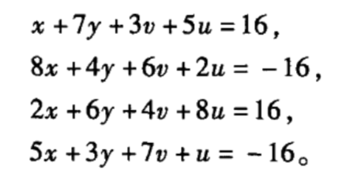
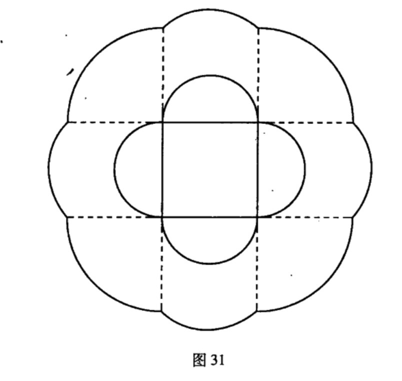
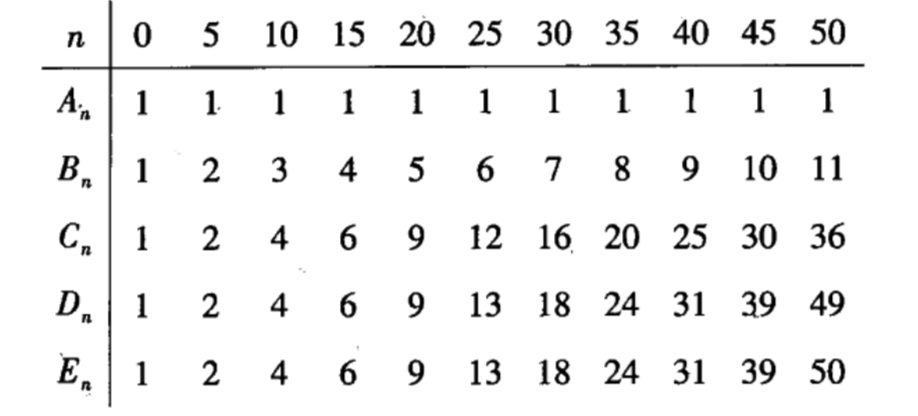

# 0401. 题目、提示、解答

这最后一部分向读者提供一些另外的练习机会。

解答这些题目只需要读者具有一所好的中学所能提供的课程以内的预备知识。但是这些题目并不容易，也不仅仅是常规题目，其中有些需要独创性的聪明才智。

提示提供了引导出解答的一些说明，其中大多数是通过从表中引用一个合适的句子。对于一位非常用心的、准备采纳建议的读者，它们也许能揭示出解答的关键思路。

解答提供的不仅是答案，还包括导出答案的整个过程，虽然读者无疑还需要充实某些细节。有些解答的后面加了几句话，旨在开拓一下眼界。

热切地想解题的读者最有机会从这些提示和解答中得益。如果他是通过自己的方法来得到答案的，他可以将自己的方法和书中的方法作比较，从而学到一点东西。如果经过认真的努力以后，他倾向于要放弃，这时提示可以给他提供没想到的新思路。如果连提示也帮不了忙，他就可以看着解答，尝试将关键的想法分离出来，把书放在一边，然后再尝试自己去得出解答。

## 4.1 题目

1、一只熊从 P 点出发，向正南走一英里」，然后改变方向向正东走一英里，然后再向左转，往正北走一英里，此时它正好到达它出发的 P 点。这只熊是什么颜色的？

2、鲍勃（Bob）想要一块完全平坦的土地，它有四条边界线，其中两条为正南北走向，另两条为正东西走向，而其中每一条边界线的长度恰好为 100 英尺。鲍勃能在美国买到这样的块土地吗？

3、鲍勃有 10 个口袋和 44 枚银币。他想把这些银币分配到这些口袋中去，使每个口袋中的银币数都不相同。他能做到吗

4、为了给一本厚书标上页码，印刷工人用了 2989 个数字。这本书总共有多少页？

5、在祖父的文件中发现了一张账单

72 只火鸡$_67.9.

那个显然表示这些家禽总价的数的第一位和最后一位数码已经褪色了，难以辨认，因此这里用横线代替。

这两个褪色的数码是什么，每只火鸡的价格是多少？

6、已知一个正六边形和它所在平面上的一点，试过此点作直线将这个六边形分成面积相等的两部分。

7、已知一个正方形，从某一点观察此正方形时，张角为（a)90°, (b)45°，求这些点的轨迹。（令 P 点为正方形外但在同一平面上的点，以 P 为顶点，包含此正方形的最小角称为从 P 点「观察此正方形的张角」。）清楚地画出这两条轨迹，并给出完整的叙述。

8、联结某个立体表面上两点的一条直线，如果这个立体绕这条直线转过一个大于 0°而小于 360°的角后能和自身重合，这条直线就称为该立体的一根「轴」。

求一个立方体的各根轴，清楚地描述每根轴的位置，并求出与之相应的转动角。假定这个立方体的边长为单位长度，计算这些轴的长度的算术平均值。

9、一个四面体（不一定是正四面体）的两条对边长度都为，且互相垂直。此外，它们都垂直于联结它们中点的长度为 b 的线段。用 a 和 b 来表示这个四面体的体积，并证明你的答案。

10、棱锥中相对于底面的那个点称为顶点（apex）。（a）如果一个棱锥的顶点到底面各角顶点（vertices）的距离相等，就称这个棱锥是「等腰的」。利用这一概念证明此时等腰棱锥的底面内接于一个圆，而这个圆的圆心即此棱锥的高的垂足。

 (b）如果一个棱锥的顶点到底面各边的（垂直）距离都相等，我们就称它为「等腰的」，采用这一概念（与前一概念不同）证明此时等腰棱锥的底面外切于ー个圆，这个圆的圆心即此棱锥的高的垂足。

11、求满足下列由四个方程组成的方程组的 x、y、L 和υ的值

（这看起来又长又繁：试着找一条捷径。）

12、鲍勃、彼得和保罗一起去旅行。彼得和保罗是徒步旅行的好手；他们每小时都可以走 P 英里，鲍勃的脚力不行，他驾驶一辆小汽车，可以坐两个人，但坐不下三个，这辆车每小时跑 c 英里。这三个朋友采取下面这个方案：他们一起出发，保罗乘鲍勃开的车，彼得走路。过一会儿鲍勃丢下保罗让他继续走路，鲍勃回去接彼得，然后他们俩驾车直至追上保罗。此时，他们进行了轮换，即保罗换上去坐车，彼得又步行，这就回到了开始时的情形。这样整个过程不断重复直至必要的次数。

 (a）他们每小时前进多远（多少英里）?

 (b）旅行中有几分之几的时间汽车上只有一个人？

 (c）检验 p=0 和 p=c 的极端情况。

13、有三个数成等差数列，另有三个数成等比数列，将这两组数列的对应项相加，我们分别得到 85,76 和 84。将此等差数列的三项相加，得 126。求这两组数列的各项。

14、已知关于 x 的方程 x4- (3 m+2) x2+m2=0 中的四个实根成等差数列，求数 m 的值。

15、一个直角三角形的周长为 60 英寸，斜边上的高的长度为 12 英寸，求此直角三角形的各边长。

16、从山峰上可以看到平原上的两点 A 和 B。指向这两点

的视线的夹角为γ，第一条视线相对于水平面的倾角为 a，第二条相对于水平面的倾角为 B。已知 A 点和 B 点在同一水平面上，它们的间距为 c。

用角α、B、y 和距离 c 来表示山峰离 A 点和 B 点所在水平面的高度。

17、注意到下式：

在 n=1,2,3 时的值分别为

1523

24

推测其值的一般规律

（如果需要的话可以再观察更多的值），并证明你的推测。

18、考虑下表：

推测这些例子所提示的一般规律，用适当的数学符号来表述并加以证明。

19、一个正六边形的边长为 n (n 是整数）。用平行于其各边的等距平行线将这个六边形分成 7 个边长为 1 的等边三角形。用 V 表示出现在此划分中的顶点数，L 表示长度为 1 的边界线条数。（一条边界线属于一到两个三角形，一个顶点属于两个或更多个三角形。）在 n=1 这一最简单的情况中，T=6, V=7, L=12。考虑一般的情况，并用 n 来表示 T、V 和 L。（能推测出结果就不错，能证明更好。）

20、你能用几种方式来把一美元兑换成硬币？（硬币的种类有：一分币、五分币、一角币、二角五分币、五角币。兑换的「兑换方式」由所用各类硬币的数目表示。）

1 英里=1.609 千米。一一译者

## 4.2 提示

1、未知量是什么？一只熊的颜色但是我们怎么能从数学数据中得出一只熊的颜色呢？已知的是什么？几何学上的种状况但这似乎是自相矛盾的：这只熊在按照描述的方式走了三英里路以后，怎么可能回到它的出发点呢？

2、你知道一道与它有关的题目吗？

3、如果鲍勃有许多银币，他在每个口袋里都装入不同数目的银币当然不成问题。你能重新叙述这道题目吗？能装人 10 个口袋并使每个口袋中的数目都不同的最小银币数目是多少？

4、这里有一道题目和你的题目有关：如果这本书恰有 9 页被标上页码，那么，印刷工人用到多少数字？（当然是 9 个。）这里还有另外一道题目和你的题目有关：如果这本书恰有 99 页被标上了页码，那么印刷工人用到多少数字？

5. 你能重新叙述这道题目吗？如果整个价格以美分来表示，可以被 72 整除，那么这两个褪色的数字会是什么呢？

6. 你能否想到一道更容易着手的相关题目？一道更为普遍化的题目？一道类似的题目？（见普遍化，2。

7. 你知道一道与它有关的题目吗？以一个已知的张角观

察一段已知直线的点的轨迹构成两段圆弧，它们的端点在这条

线段的两端，并关于这条线段彼此对称。

8. 假定读者熟悉该立方体的形状，并且仅仅通过观察找到了它的几条轴一一但它们是全部的轴吗？你能证明你所列出的穷尽了所有可能的轴吗？你列出的表是不是根据一个清晰的分类原则？

9. 观察未知量！未知量是一个四面体的体积一一是的，我知道只要一个棱锥的底面和高已知，这个棱锥的体积就可以计算出来（将两者相乘，再除以 3），但在本例中既不知道它的底，也不知道它的高。你能否想到一道更容易着手的相关题目？（你没有看到一个更好着手的四面体吗？它是已知四面体的个等分部分。）

10. 你知道一条与它有关的定理吗？你知道一条更相关的……比较简单的…类似的定理吗？是的，在一个等腰三角形中，高的垂足即底边的中点。这里有一条定理和你的定理有关而且以前证明过，你能利用……它的方法吗？这条关于等腰三角形的定理是通过两个直角三角形的全等来证明的，它的高即这两个直角三角形的公共边。

11. 假定读者对于线性方程组有一定的熟悉。要解答这样一个方程组，我们必须通过某种方法将这些方程组合起来一仔细寻找这些方程之间的联系，这种联系可能会指出一种特别有利的组合方式。

12. 将条件的不同部分分开。你能把它们写出来吗？在这三位朋友的出发点和他们再次相遇的地点之间有三个不同的阶段

 (1) 鲍勃和保罗乘车

 (2) 鲍勃独自乘车；

 (3) 鲍勃和彼得乘车。

将这三个阶段所用的时间分别称为、2 和 2。你如何能把条件分成几个适当的部分？

13. 将条件的不同部分分开。你能把它们写出来吗？令

a-d a+d

为等差数列的各项，而

g

为等比数列的各项。

14. 条件是什么？这四个根必须构成一个等差数列。但这个方程还有另一个特点：它只包含未知量 x 的偶次幂。因此，如果 a 是方程的一个根，则-a 也必是一个根。

15. 将条件的不同部分分开。你能把它们写出来吗？我们可以把条件按

 (1) 周长（2) 直角三角形（3) 斜边上的高分为三个部分。

16. 将条件的不同部分分开，你能把它们写出来吗？令 a 和 b 分别表示（未知的）视线的长度，a 和 B 分别表示它们相对于水平面的倾角。我们可以把条件按

 (1) a 的倾角

 (2) b 的倾角

 (3) 以 a、b 和 c 为三边的三角形分为三个部分。

17. 你有没有注意到 2、6、24 这些分母？你知道一道与它有关的题目吗？一道类似的题目？（见归纳与数学归纳）

18. 靠归纳来发现规律需要通过观察。观察这些式子的右边、左边的开始几项和最后几项。此时普遍的规律是什么？

19. 画一张图。观察图形可以帮助你以归纳的方式发现规

律，或者可以引导你找到 TV、L 和 n 之间的关系。

20. 未知量是什么？我们要寻找的是什么？甚至是这道题目的目标也需要作一定澄清。你能否想到一道更容易着手的相关题目？一道更为普遍化的题目？一道类似的题目？这里有道十分简单的类似题目：你能用几种方式来支付一分钱？（只有一种方式。）这里有一道更为普遍化的题目：使用一分币、五分币、一角币、二角五分币和五角币这五种硬币，你能用几种方式来支付 n 分钱？我们特别关心的是 n=100 的这一特例。

在 n 比较小的最简单的特例中，我们用不着什么高深的方法，而只要通过尝试和观察就能得出答案。这里有一张简表（读者可以对它进行检验）。

第一行列出了要支付的钱数，通称为 n。第二行列出了相应的「支付方式」的种数，通称为 E。（为什么选择这个符号是我的个小秘密，在现阶段我还不愿意透露。）

我们特别关心的是 E10, 但是如果没有一种明确的方法，我们就不大可能计算出 E10。事实上，本题对读者的要求比前面一题要高一点，他应当能创造一点理论。

我们的问题是一般的（对一般的 n 计算相应的 E。值），但也是「孤立的」。你能否想到一道更容易着手的相关题目？道类似的题目？这里有一道十分简单的类似题目：求只用一分币来支付 n 分钱的方式的数目 An。（A=1

## 4.3 解答

1. 你认为这只熊是白的而 P 点是在北极？你能否证明它是正确的？过去这个问题多少有点不言而喻，所以我们现在来对它作理想化的解释。我们将地球看成完全是一个球体，把这只熊看成是一个移动的质点。这个点向正南或正北移动时，走过的是经线的一段弧，而它向正东移动时，走的是纬线（平行于赤道）的一段弧。在此我们必须区分这两种情况。

 (1) 如果这只熊回到 P 点所走的那条经线不同于它离开 P 点时所走的经线，那么 P 点必定就是北极点。事实上，在地球上另外只有在南极点处才会有两条经线相交的情况，但是熊此时只能向北走，才能离开南极。

 (2) 如果这只熊向东走一英里，只有沿一个纬度圈走 n 次(n 可以是 1,2,3…），它オ有可能沿着它离开 P 点时所走的那根经线再回到 P 点。在这种情况下，P 点不是北极点。而是一个非常靠近南极的纬度圈上的一点，这个纬度圈的周长以英里

来表示时，稍小于 2 T+1。

2. 我们把地球表示成如题 1 解答中那样的一个球。鲍勃想要的土地由两条经线和两条纬线围成。想象有两条固定的经线和一条向远离赤道的方向运动的纬线：这条移动的纬线被这两条固定的经线截得的弧逐渐缩短。鲍勃想要的土地的中心应该在赤道上。他在美国找不到这样的一块土地。

3. 一个口袋中可能装的最小银币数目显然是 0, 次大的至少是 1, 再其次则至少是 2…最后的（第 10 个）口袋中的银币数目至少是 9。因此，所需的银币数至少为

0+1+2+3+·+9=45 鲍勃做不到这一点：他只有 44 枚银币。

4. 一本有 99 页的书需要

9+2×90+3×900=2889

个数字。如果问题中那本厚书有 x 页，则

2889+4 (x-999) =2989

x=1024。

这道题目可以教育我们，对未知量作一个初步的估计也许是有用的（如本例中甚至是必要的）。

5. 如果_679_可以被 72 整除，那么它也必定可以被 8 和 9 整除。如果它可以被 8 整除，那么 79 必定可以被 8 整除（因为 1000 是可以被 8 整除的），因此这个数 79_就必定是 792: 最后一个褪了色的数字就是 2。如果 6792 能被 9 整除，那么它的各位数字之和必定能被 9 整除（「舍九法」的规则），因此第一个褪了色的数字必定是 3。一只火鸡的价格（在祖父的那个时代）是 8367.92÷72=85.11。

6.「在平面中给出一个点和一个具有对称中心的图形，求一条通过已知的点并平分这个图形面积的直线」。要求的直线当然得通过这个对称中心。见创造者悖论。

7. 在任何位置，角的两边都必须通过该正方形的两个顶点。只要它们通过同一对顶点，则该角的顶点必在同一个圆弧上移动（根据作为提示基础的那个定理）。因此，所求的两条轨迹都由几段圆弧所组成，在情形（a）中是 4 个半圆，在情形（b）中是 8 个四分之一圆。见图 31。

8. 轴在某点穿过这个立方体的表面，这个点要么是该立方体的一个顶点，要么在一条棱上，要么在一个面上。如果这根轴通过一条棱上的一个点（但不通过它的端点），这个点一定是它的中点；否则这条棱在转动后就不可能和自己重合。同理，一条穿过一个面内部的轴必定通过该面的中心。所有的轴无疑都必须通过立方体的中心，因此，就有下面三种类型的轴

 (1)4 根轴，每根都通过两个相对的顶点，转动角度为

120°,240°。

 (2)6 根轴，每根都通过两条相对梭的中点，转动角度为

180°

 (3)3 根轴，每根都通过两个相对面的中点，转动角度为

90°,180°,270°。

对于第一类轴的长度，见第一部分第 12 节，其他两类轴的长度较容易计算，于是所要求的平均值是

43+6√2+3

1.416

13

（这道题目对准备研究晶体学的读者来说，也许会有用。对积分学有充分了解的读者也许会注意到计算出来的平均值和立方

体的「平均宽度」相当接近，事实上，平均宽度为=1.5。）

9. 通过长度为 a 的一条棱并和长度为 b 的棱垂直的平面将四面体分成两个更容易着手的全等四面体，其中每一个的底

面积都是，高是。因此要求的体积就等于

10. 棱锥的底面是一个 n 边形。在（a）的情况中，棱锥的 n 条侧棱长是相等的；在（b）的情况中，它的 n 个侧面上的（从顶点作出的）高相等。如果我们在（a）的情况中画出棱锥的高，并把它的垂足和底面的 n 个顶点联结起来，而在（b）的情况中将它的垂足和 n 个侧面上的高的垂足联结起来，那么在两种情况下我们都得到 n 个直角三角形，而棱锥的高是它们的一条公共边：我们说这 n 个直角三角形是全等的。事实上这些直角三角形的斜边【在（a）的情况中是侧棱，在（b）的情况中则是侧高】根据题目所提出的定义是等长的，我们刚才提到过，所有三角形都有一条公共边（棱锥的高）和都有一个公共角（为直角）。所以，在这 n 个全等直角三角形中第三边也必相等，它们都在同个平面（底面）上从同一点（高的垂足）作出。于是它们在（a）的情况中和（b）的情况中分别构成了一个外接于或内切于棱锥底面的圆的 n 条半径。【但是在（b）的情况中还需要证明，刚才提到的 n 条半径分别垂直于底面的各条边，这可由立体几何中关于投影的一个著名的定理得出。

最值得注意的是，平面图形中的等腰三角形在立体几何中可能有两种不同的类比。

11. 我们注意到，在第一个方程和第四个方程之间与第二个方程和第三个方程之间有相同的联系：它们左边的系数都相同，但是顺序相反，而右边则符号相反。于是将第一式与最后式相加，第二式与第三式相加，得到：

6 (x+u) +10 (y+) =0

10 (x+L) +10 (y+) =0。

这可以看作是由两个线性方程组成的具有两个未知量的一个方程组，也即关于 x+L 和 y+v 的方程组，容易得出

x+u=0, y+=0。

在原方程组的前两个方程中用-x 代替み，用ーy 代替υ，我们就得到

4 x+4 y=16 6 x-2 16。这是一个简单的方程组，由它可以得出

y=2 2

12. 在起始点和他们会合的点之间，每个朋友的行程都是相同的（记住，路程=速度 x 时间）。我们区分出条件中的下列两个不同部分：

鲍勃和保罗的行程一样多

ct1 -ct2 +ct3 ct1+ pt2 +p3,

保罗和彼得的行程一样多

ct1+ pt2+ pt3 ptl t plz ct3 o

由第二个方程可得

)1= (c-p)2

当然，我们假设汽车的速度比徒步快，即 c> P。于是有

也就是说，彼得步行的时间恰和保罗一样长。由第一个方程我们得到

t3 c+

C

这当然也就是一的值，由此我们就得到了下列答案

 (a)4-+  (c+3

ち1+2+ち 3 c+p

C

1+ム2+ち3 c+P

（）事实上，0 <p <c。存在着下列两种极端的情况

若 p=0, (a）成为，而（b）成为

若 P=c, (a）成为 c，而（b）成为 0。这些结果不必经过计算就很容易看出。

13. 很容易把条件分成四个部分，它们可用下列四个方程来表示

bg

=85

A +b =76

a+d + bg 84

3 a=126。

由最后一个方程可得 a=42, 然后由第二个方程得 b= 34。将余下的两方程相加（为了消去 d），我们就得到

2 a+b (g+g) =169。

由于 a 和 b 是已知的，我们在这里就得到一个关于 g 的二次方

程。它的解为

6=2, d=-26 或 8=, d=25 于是这两个数列为

68,42,16 17,42,67

17,34,68

或

68,34,17

14. 如果 a 和-a 是具有最小绝对值的两个根，那么它们在数列中的位置是彼此相邻的，因此该数列具有如下形式

3 a 3 a

因此题目中方程的左边必可表示如下形式

 (x2-a2) (x2-9 a2)。

将上式展开，并比较同次项的系数，我们得到下列方程组

10 a2=3 m+2

9 a2=m2。

消去 a 后得到

19 m2-108 m-36=0

由此可得 m=6 或-0。

15. 令 a、b 和 c 代表该三角形的三边，其中 c 为斜边。条件的三个部分可表示为

b+c=60

Ab=12

注意到

 (a+b) t b2+2 ab

我们得到

 (60-c) +24

因此 c=25, 而 a=15, b=20 或 a=20, b=15（这对于所求三角形来说并无区别）。

16. 条件的三个部分可表示为

sin B

c =a+b-2 ab cos yo 消去 a 和 b 可得

csin B

sin a+sin B-2 sin asin Bcos y

17. 我们猜测

 (n+1)!

遵循归纳与数学归纳的模式，我们问：当我们从 n 的值过渡到下一个 n+1 的值时，猜测的公式仍正确吗？根据上面的公式，我们应有

n+1

2!3!  (n+1)! (n+2)! (n+2)

我们通过两式相减来检验它

 (n+2)! (n+2) n t 这意味着
 
 N+2

n+2)! (n+1)! °

上面最后一个等式对于 n=1,2,3, …明显都成立。因此，根据上面提到的模式，我们就能证明我们的猜测了。

18. 在第 n 行中，右边似乎是 n2, 左边是一个 n 项和，这和式中的最后一项是第 m 个奇数，即 2 m-1, 其中

m=1+2+3+…+7 m=u (n+1)。

见归纳与数学归纳，4。因此左边和式中的最后一项应该是

2 mー1=n2+n-1。

因此，我们可以有两种方法来得出所考虑的和的首项：从最后项倒推 n-1 步，我们发现

 (na2+n-1) -2 (n-1) =n2-n 而从上面一行的末项向前推一步，我们有

 [(n-1)2+ (n-1) -1] +2

将它进行常规的化简后，我们得到同一结果：非常好！由此我们

断言

 (n2-n+1) + (na2-n+3) +…+ (n2+n-1) =n2。其中左边表示一个等差数列的一些连续项的和，而这个数列的差为 2。如果读者知道这样一个数列的求和规则（首项和末项的算术平均值乘以项数），他就能证明

ル+1) + (n+n-1

2

这样，上面的断言就得证了。

（这里所引用的求和规则可以由一张与图 18 几乎完全相同的图得出。）

19. 边长为 n 的正六边形的周长为 6 n。因此，这个周长由 6 n 条长度为 1 的边界线组成，并包括 6 n 个顶点。因此在从 n1 过渡到 n 时，V 增长 6 n 个单位，于是

v=1+6 (1+2+3+…+n) =3 n2+3 n+1。

见归纳与数学归纳，4。六边形被三条通过其中心的对角线分成 6 个（大的）等边三角形。通过观察其中一个可知

Tr=6 (1+3+5+ 2 n-1) =6

（等差数列的求和规则在第 18 题的解答之中已经引用过了。）这？个三角形共有 37 条边。在这全部的 37 条边中，每一条长度为 1 的内分界线都被计算了两次，而沿六边形周长的那 6 n 条边则只计算了一次，因此

2 L=3 T+6 n, ・L=9 n2+3 no

【致程度较高的读者：根据欧拉（Euler）关于多面体的定理 T+V=L+1 可以得出这一结论，证明这一关系式！]

20. 这儿是一系列排列整齐的类比题目：计算 An、Ba、C D。和 E。，这些量都表示支付 n 分钱的方式的种数，区别在于所使用的钱币：

A 只用一分币

B 用一分币和五分币

C，用一分币、五分币和一角币

D 用一分币、五分币、一角币和二角五分币 E 用一分币、五分币、一角币、二角五分币和五角币其中符号 E,（使用这个符号的理由现在清楚了）和 A。前面用到了。

E。是对用这五种钱币来支付 n 分钱的所有方式进行计数的结果，但是我们可以区分两种可能性

第一种，不用五角币，根据定义可知这样支付的方式的种数是 D

第二种，用一个（或更多）五角币，在第一个五角币放在柜台上以后，还有 n-50 分钱要付，恰好可以用 Ens 种方式来支付。

我们推断

E=D+E 50

同理，

D. =C. +D. C. =B. +C. B=A+B

5

稍加注意就能发现，如果我们令（这显然是有意义的）

A=B。=Co=Do=Eo

并且当 An, B, …, E。这些量的下标为负数时认为它等于 0, 则以上各式都成立。（举例来说，可以直接看出 E25=D23, 而这与我们的第一个公式一致，因为 E25-0=E-2 y=0。）

我们的公式允许我们递归地计算各量，也就是说，通过回到 n 的较小数值或较前面的字母来计算。例如，如果 C20 和 B3 已知，我们就可以通过简单的相加来计算 C2。在下表以 A 开头的第一行和以 0 开头的第一列的数字中，只包含等于 1 的数。（为什么？）我们从这些初始的数开始，用简单的加法递归地算出其他数：表中其他所有的数都等于它上面的那个数或者等于它上面的那个数和在它左边一定距离的那个数的和。例如

C=B3 o+C2 如=7+9=16。

这样一直计算下去，直到 E0=50: 你可以恰好用 50 种方法来支付 50 分钱。再继续进行下去，读者就可以使自己确信 E=292: 你可以用 292 种不同的方法光換 1 美元。

