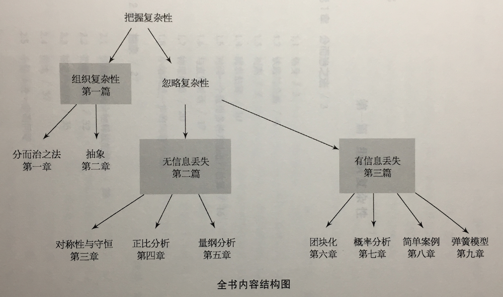

## 序

科学与工程，我们理解和改变这个世界的现代方式，被认为是关于准确性及精确性的学问。然而，能让我们更好把握所处世界的复杂性的是日积月累培养出的洞察力，而非精确性。我们需要洞察力是因为我们的大脑不过是这个世界的一小部分。洞察力会将知识的碎片整合成适合大脑的一个简单图像。但是精确性会使大脑储存发生溢出，冲刷掉洞察力所带来的理解。本书将告诉你如何构建洞察和理解，从而避免被淹没在复杂之中。

1『说的真好。洞察力将知识碎片整合正适合大脑的一个简单图像，精确性却会使大脑储存发生溢出，冲刷掉洞察力所带来的理解。』

因此，我们所使用的方法不是严格的。严格（rigor）很容易变成僵尸（rigor mortis），分析（analysis）变成无能（paralysis）。放弃严格，我们来研究自然的和人为的世界，即科学和技术的世界。因此，对于物理学概念，诸如力、功率、能量、电荷和场，你需要有一些（并非很多）理解。书中尽可能少用数学，大部分是代数和几何，有一些三角，很少涉及微积分，因此数学将会提高而不是阻碍我们的洞察和理解，并使得问题的解决更容易。目的是帮助你把握复杂性，于是没有问题能吓倒你。

正如我们生活中所有重要的事件一样，无论婚姻还是职业，我进入这个领域在很大程度上不是事先计划好的。作为一名研究生，我人生中的第一个科研报告是给同学们介绍视网膜圆柱细胞中的化学反应。我只能通过近似使化学混沌变得有意义。在同一年，我办公室的同事卡洛斯·布罗迪（Carlos Brody）对孪生素数的分布感到好奇。所谓孪生素数，指相差为 2 的两个素数，如 3 和 5，11 和 13 等。没有人确切知道孪生素数的分布。作为一个懒惰的物理学家，我用素数的概率模型近似回答了卡洛斯的问题。这里又一次看到，近似促进了问题的理解。

1『近似促进了理解，确实，有些东西不是需要那么精确的。』

作为一个物理学研究生，我需要准备研究生资格考试。同时，我担任「数量级物理学」（Order-of-Magnitude Physics）课程的助教。在 3 个月内，通过准备资格考试和对课程进行备课，我在这段时间所学到的物理比我整个大学本科阶段学到的都要多。物理教学和学习有很大的改进空间——近似和洞察可以弥补这些不足。

感谢我的老师们，我将本书献给卡弗·米德（Carver Mead），他给我的指导是不可替代的；献给彼得·戈德赖希（Peter Goldreich）和斯特尔菲尼（Sterl Phinney），他们在加州理工学院开设了「数量级物理」这门课程。从他们身上我学到了进行简化和洞察的勇气一一这是一种我期望能教会你的勇气。

我曾经在剑桥大学和麻省理工学院开设「近似的艺术」（Art of Approximation）课程很多年，这是由物理学和工程中的一些课题构成的课程。课程的内容限制了材料的一般性：除非你成为广义相对论的专家，否则一般不会再去研究引力理论。然而，在估算引力场使星光偏折多少（5.3.1 节）中所学会的分析工具的运用远远不局限于这一个例子。工具比课题本身更一般，更有用。

因此，我围绕分析工具重新设计了「近似的艺术」这门课程。这种我在麻省理工学院和欧林工程学院使用过的方式已经反映在本书中——通过每章教你一种工具的方式来帮助你构建洞察力和把握复杂性。

把握复杂性的方式有两大类：组织复杂性（第一篇）和忽略复杂性（第二篇和第三篇）。组织复杂性，即第一篇的主题，通过两种工具来教给你分而治之法（第 1 章）及抽象（第 2 章）。忽略复杂性（第二篇和第三篇）体现了「聪明的艺术就是知道什么是可以被忽略的艺术」这一理念。

第二篇中，在不丢失信息的情况下，复杂性被忽略。这部分包含三种工具：对称性与守恒（第 3 章），正比分析（第 4 章）和量纲分析（第 5 章）。第三篇中，复杂性被忽略，伴随着信息丢失。这部分包含最后 4 种工具：团块化（第 6 章），概率分析（第 7 章），简单案例（第 8 章）和弹簧模型（第 9 章）。

利用这些工具，我们可以探索自然的和人为的世界。我们将估算鸟和飞机的飞行距离，化学键的强度以及太阳偏折星光的角度；理解钢琴木琴和话筒的物理；解释为什么天空是蓝的而夕阳是红的。我们所用到的工具把这些和其他许多例子编织成了一幅有意义的科学和工程挂毯。

最好的教师应该是一个技艺精湛的导师。一个好的导师很少下结论，而是问你问题，因为质疑、探究和讨论会促进持久性的学习。为了帮助你掌握工具，两种类型的问题会在书中出现。1）用 ▶ 标记的问题。这类问题，教师可以在教学过程中提问，要求你在讨论中将其发展到下一步。这些问题会在接下来的叙述中得到答案这时你可以检验你的思考。2）用阴影背景标记的带有编号的问题。这些问题教师会作为家庭作业，让你用来练习工具的使用，例子的推广，几种工具的综合使用，甚至让你解决一个特殊的悖论。只是观看制作好的健身视频几乎不会有健身效果。所以，多多尝试这两种类型的问题。

经过努力，复杂性就能被把握，并且会有更广泛的作用。正如物理学家埃徳温·杰恩斯（Edwin Jaynes) 关于教学所说的一段话：教学的目的不是把教师现在知道的每一个事实都灌输到学生的大脑中去，而是把思考的方式教给学生，使得学生在将来能够用一年的时间就学会教师用两年时间才学会的东西。只有这样，我们才能持续不断地一代比一代更进步。希望本书介绍的工具能帮助你推动这个世界，使它变得比我们这一代人留下的世界更进步。

1『教学的目的，做一张任意卡片。』——已完成

## 组织架构

第一篇，组织复杂性。当面对一团乱麻时，你不可能发现很多线索。你需要将其重新组织。举常见的例子来说，如果这是你的书桌，或者是晚宴后的厨房，你可能从一个角落开始清理，然后移到下一个区域。你所应用的正是分而治之法（第 1 章）。进而，在你书桌的每一个区域，你很可能并不是将所有的文件材料随意地放在一个文件夹中，你会按照不同的主题将它们归档。在你的厨房，你会将银器和瓷器分开摆放。在银器类中，你又会将叉和勺分开。在进行这些高级分类时，你应用的正是抽象化的分析工具（第 2 章）。利用这两种工具，我们就能组织并把握复杂性。

## 最后的话：长期持久的学习

世界是复杂的！但我们的九个分析工具帮助我们把握和享受了复杂性。这些工具不仅构建了跨领域的知识，还将不同的事实和概念关联在一起并由此促进了长期持久的学习。互相关联的知识的价值可用一个无限的二维点阵来类比：一个渗流点阵。每个点代表一个知识一个事实或一个概念。现在对相邻的知识点加上一条连接的键，每条键赋予一个概率「P 键」。下面的图形给出了从「P 键」= 0.4 开始的有限格点的例子。黑线标记的是最大的团簇——即最大的联通点集。当「P 键」增加时，这个团簇就联通了更多的知识的格点。

一个无限大点阵可能有许多无限大团簇，衡量方法也是类似最大团簇的大小，来看属于这个团簇的点阵在整个点阵中所占的比。类似于无限团簇个数，这个比「P∞」一开始是零直到「P 键」达到临界概率 0.5。然后开始大于零，随着「P 键」继续增加最终达到 1。

对于长期持久的学习，知识的碎片应该通过互相关联得到互相支撑。当我们记住一个事实或者使用一个概念时，我们就会激活关联的知识和概念并将其在大脑中强化。知识最好的储存方式是将其放在无限的自我支撑的团簇中。但是当我们学习孤立的事实和概念时，我们得到的是不连接的点。于是「P 键」即无限团簇中成员之间的关联就下降。如果「P 键」下降太多，无限团簇就直接消失了。

所以，对于长期持久的学习和理解，要构建彼此的关联；将每个新的事实和概念关联到你已经熟知的部分。这种思维方式将会使你在一年内学到我两年或二十年才学到的东西。利用你的分析工具去编织一幅密切关联的，持久的知识锦绣。这就是对你学习和发现新知识以及令人着迷的互相关联所要说的最后的话！

只有关联！这是她所要讲的全部…...不要再生活在碎片中。——E. M . 福斯特