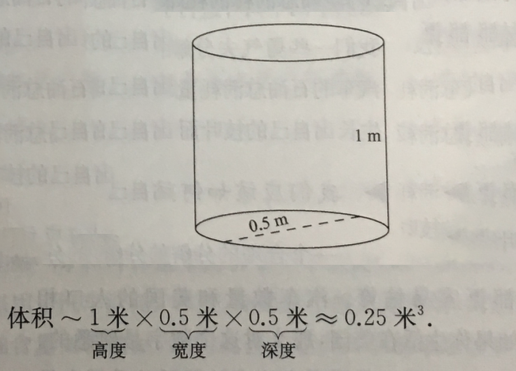

第一篇 组织复杂性

当面对一团乱麻时，你不可能发现很多线索。你需要将其重新组织。举常见的例子来说，如果这是你的书桌，或者是晚宴后的厨房，你可能从一个角落开始清理，然后移到下一个区域。你所应用的正是分而治之法（第 1 章）。

进而，在你书桌的每一个区域，你很可能并不是将所有的文件材料随意地放在一个文件夹中，你会按照不同的主题将它们归档。在你的厨房，你会将银器和瓷器分开摆放。在银器类中，你又会将叉和勺分开。在进行这些高级分类时，你应用的正是抽象化的分析工具（第 2 章）。

利用这两种工具，我们就能组织并把握复杂性。

# 第1章 分而治之法

正如帝国的统治者们深谙的道理，不必一下子征服所有的敌人，而是应该逐一征服他们，你可以将一个难题分解为一些小的、可以处理的问题。这个过程体现了我们的第一个分析工具：分而治之法！

## 1.4 需求估算

我们对高速公路和铁路运输能力的分析（章节1.2）是现实社会中运用估算的一个常见例子——即估算市场的规模。公路铁路的比较是这一例子的延续。在其他问题上，一个更实用的分析方法则建立在需求估算的概念基础之上。

➤ 美国进口的石油是多少（按每年桶数计算）?

这个体量相当巨大，因此难以刻画。而分而治之法将使复杂性变得简单。只要将难题不断分解，问题总能分解到不再复杂的地步。现在，我们来分解需求一一即消耗量。我们在太多的方面需要消耗石油；对每一种消耗石油的途径去估算不仅要花很长的时间，而且也不会得到太多的洞见。反之，我们来估算一下最大的消耗——很可能就是汽车；然后再评估其他用途的消耗，以及总的消耗与进口之比。

以下为相应的树图。第一个因子是三个因子中最难估算的量，我们需要再生长出分支得到子树图。第二个和第三个因子不需要进一步分解就可给出估算结果。下面我们来看看怎么做。


➤ 我们是应该将整个树图都构建完毕后再来估算每个树叶的值呢，还是应该先来估算一个树叶的值，当无法估算时再将其进一步分解？

这取决于每个人的思维习惯。在进行新的估算时如果看到的都是未知量，我会感到忧虑。而在对一个树叶估算之前就长出新的分支会加重我的忧虑。这样似乎树图会永无止境不停地分叉下去，因而永远无法给出估算结果。因此，我更喜欢在生长出新的分支之前给出那些树叶的估算值，以及时得到每一步的结果。你应该通过实践来了解自己的习惯。你自己就是你解决问题最好的工具，熟悉你的工具是很有帮助的。

由于我的习惯，我会首先估算下面这个树叶的值：

```
石油总消耗量/汽车消耗石油量
```

但不是直接来估算这个值。从直觉上来说，更容易、更直观的做法是首先估算汽车消耗石油量和其他消耗量的比。对一些不相交的集合之间进行比较的能力已经固化在我们大脑中了，至少对具体的事物来说是这样，这与计数的能力无关。并且，也不局限于人类。卡伦·麦库姆（Karen Mccomb）和她的同事所研究的母狮们在外来狮群入侵它们的领地时，会判断自身数量和人侵狮群的多寡。只有当它们在数量上大大超过入侵者时，它们才会去攻击入侵者，这个比例大约是 2。

石油的其他消耗主要是非汽车运输（如卡车、火车和飞机），取暖和制冷，以及汽油产品如化肥、塑料和农药等。在判断汽车的消耗与其他消耗的相对比重时，有两种互相对立的说法：1）其他消耗比汽车消耗要多得多和重要得多，因此其他消耗量要大大超过汽车的消耗量；2）汽车已经无处不在，汽车的运输效率又是如此低下，因此汽车的消耗量要大大超过其他消耗量。

按照我的直觉，这两种说法都过于极端，有失偏颇。我的直觉告诉我，这两类消耗量是差不多的。基于这个估算，石油总消耗量（汽车和其他消耗之和）差不多是汽车消耗量的两倍。

这个估算是第一个树叶。这里隐含了一个假定，即一桶原油中汽油的含量足够高以用于汽车消耗。幸好，如果这个假定是错的，我们会得到警告。如果汽油含量太低的话，我们就会去建设其他基础运输体系一一如电力火车，其中电力可以通过燃烧原油中非汽油部分来产生。这很可能是污染较少的方式，据此我们就可以来估算火车会消耗多少原油。

回到我们的现实世界，先来估算第二个树叶的值。

```
进口石油量/石油总消耗量
```

这一项是考虑到这样的事实：在所有消耗的石油中只有一部分是进口的。

➤ 你的直觉告诉你，这个比例是多少？

与之前一样，不要直接估算这个比例。而是对彼此没有重叠的集合进行比较，首先比较进口量和国内产量。在估算这个比例时，两种理由也是对立的。一方面，美国的媒体广泛报道了其他国家的石油生产，这说明石油进口量是巨大的。另一方面，美国产品也是铺天盖地并且常常和日本这样几乎自己不产油的国家比较。我的直觉是这两大类基本上旗鼓相当，因此进口量大约是总消耗量的一半。

这个树叶以及前一个因子都是无量纲数。这类数（第 5 章的主要内容）具有特殊价值。我们的感觉系统擅长估算无量纲比例。因此，如果个树叶节点是一个无量纲比例的话，那很可能不需要进一步往下分解了。


树图现在有三个树叶。在成功地对其中两个树叶进行估算后应该能给我们一些勇气去分解剩下的树叶，汽车的石油总消耗量。这个树叶将会生长出自己的枝叶而变成中间节点。

➤ 我们应该如何分解汽车的石油消耗量？

一个合理的分解是将其分解为汽车的数量 N 和单车消耗量。这两个量都更容易估算。汽车数量和美国的人口相关一一如果你生活在美国，那么对这个数字是熟悉的。单车消耗的石油量比美国所有汽车的消耗总量要容易估算。我们的直觉会更准确地判断那些和人本身尺度相关的量，比如单车的消耗量，而不是数字巨大的那些量，比如总消耗量。


出于同样的理由，我们不是直接估算汽车的总数，而是将这个树叶再分解为两个树叶：1）人口数；2）每人拥有的汽车数。

第一个树叶是熟悉的，至少对美国人是这样：

```
N（人口）≈3×10^8
```

第二个树叶，每个人拥有的汽车数，是一个和「人本身尺度」相关的量。在美国，汽车是很普遍的，一个夸张的说法是甚至婴儿都拥有汽车，许多成年人拥有不止一辆车。一个粗略、简单的估算可以是每人一辆车。因此：

```
N（汽车）≈3×10^8
```

单车消耗可以进一步分解为三个更容易估计的因子（树叶）。下面是我对这些因子的估算。


1、每辆车的年里程数。对于旧车来说，没有特殊情况的话每年 10000 英里是相当少的。因此，稍微多一点，比如 20000 英里/年或 30000 公里/年，这是一个相当合理的估算。（最后计算选的 20000）

2、每加仑可行驶里程。一辆典型的汽车燃油效率是 30 英里/加仑。

3、每桶加仑数。你可能已经在修建高速公路时见过那些沥青桶。根据我们过去将一张纸的厚度等同于纸币的厚度的自由联想传统，或许一桶石油也和一桶沥青类似。

桶的体积可以利用分而治之法来计算。将圆柱体近似为长方体，估算三个维度的大小，然后相乘：



1 立方米等于 100 升，或者按每加仑等于 4 升来算，大约 250 加仑。因此，0.25 立方米大约是 60 加仑（官方数据每桶原油是 42 加仑，因此我们的估算是合理的）。把这些估值相乘，别忘了两个「-1」的幂次，我们得到每车每年大约消耗 10 桶。

在计算的时候，首先考虑单位。加仑和英里消去，然后计算数值。分母中的 30×60 大约为 2000。分子的 2×10^4 除以 2000 就得到结果 10。这个估算是汽车总石油消耗树图的一个子图。于是汽车消耗石油量就是每年 30 亿桶。


这个估算本身又是进口石油量树图的一个子图。因为另两个因子贡献值为 2×0.5, 正好是 1，所以每年进口石油量也是 30 亿桶。这里给出完整的树图，包括了各个子图。


题 1.6 使用公制。作为公制的练习（如果你是在非公制国家长大的）或者为使结果更熟悉（如果你是在公制国家长大的），对桶的体积，一年行驶距离以及一辆典型汽车的燃油效率使用公制单位重新进行估算。

➤ 每年 30 亿桶的估算结果有多精确？

对于美国的石油进口，美国能源部的报告是每天 916.3 万桶（2010 年数据）。我第一次看到这个数据的时候，心沉了两次。第一次是看到「9」位于百万位上。我误以为是在 10 亿位上，还奇怪为什么 30 亿桶的估算结果会小了 3 倍。第二次是「百万」估算的结果怎么可能大了 100 倍以上呢？然后「每天」一词又重新让我找回自信。按年来算，每天 916.3 万桶就是每年 33.4 亿桶一一仅仅比我们的估算高了 10%。分而治之法再次取得胜利。

题 1.7 一架波音 747 的燃油效率。根据长途机票的价格，估算下列量的值：a）波音 747 的燃油效率；b）油箱体积。

和波音 747 的技术参数对比来验证你的估算结果。

1 英里≈1.61 千米。——译者注

1 加仑≈3.79 升。——译者注

## 1.5 对同一个量用多种方法进行估算

完成一个估算之后，很自然的我们想要知道估算的可靠性。或许我们犯了一个令人汗颜的大错。想知道估算是否正确的最好方式是用不同的方法对同一个量再估算一次。一个日常经验的例子，可以说明这个原则，来看看我们是如何对一组数字做加法的。

我们通常是从上往下加。对于 12+15+18，我们这样计算，「12 加 15 等于 27；27 加 18 等于 45。」为了验证这个结果，我们可以颠倒顺序，从下往上来加：「18 加 15 等于 33；33 加 12 等于 45。」两个结果完全一致，所以很可能是正确的。多次计算不太可能出现数字完全相同的错误。这种重复抓住了错误。

然而，盲目的重复几乎没有作用。如果我们通过从上到下再加一遍的方式来检验计算结果，我们常常会重复所有的错误。类似，重读一遍写好的文稿常常会忽略同样的拼写、语法或逻辑错误。反之，把文稿塞抽屉放一个星期，然后再看；或者请同事或朋友帮忙这两种情况，用的都是全新的眼睛。简言之，可靠性来自聪明的重复。

这个原则帮助你做可靠的估算。首先，用几个不同的方法估算同一个量。其次，使用彼此差异尽可能大的方法——例如，利用背景知识没有关联的方法。这一达到可靠性的方法是分而治之法的另一个例子：进行可靠的估算这一难题变成了几个简单的子问题，而每个估算方法就是一个子问题。

1『可靠性来自聪明的重复，上面的信息做一张金句卡。』

你已经在章节 1.1 看到了例子，即估算纸币的体积。使用的第一个方法是基于纸币的长度，宽度和厚度的分而治之法。检验的方法是：和一张折叠的纸币进行比较。两种方法得到一致的结果，即纸币体积大约为 1 立方厘米这给了我们进行估算的自信。

使用多种方法的另一个例子，可以回到对油桶体积的估算（章节1.4)。我们用路边的沥青桶来代替原油桶，然后估算了沥青桶的体积。60 加仑的结果似乎还不错，但可能原油桶的大小是完全不同的。改进这类错误的一个方式是用不同的方法来估算体积。例如，我们可以从一桶原油的价格出发：2013 年约 100 美元，而一加仑汽油的价格税前约 2.5 美元，即一桶原油价格的 1/40。如果认为汽油的利润是不重要的，则一桶原油差不多 40 加仑。即使考虑到利润，我们仍然可以说，一桶原油至少是 40 加仑。由于这两种估算——60 加仑和 40 加仑以上一一基本一致，我们对这两种方法的自信也就增加了。如果两种结果互相矛盾，那么或者其中一个或者两种方法都是错的，我们需要找出错误的假设，错误的计算，或者需要去寻找第三种方法。

