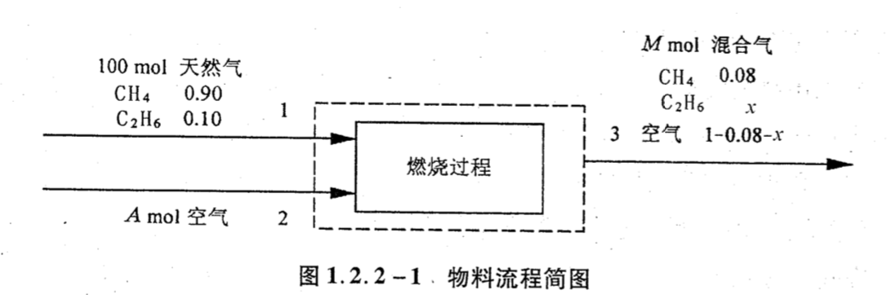
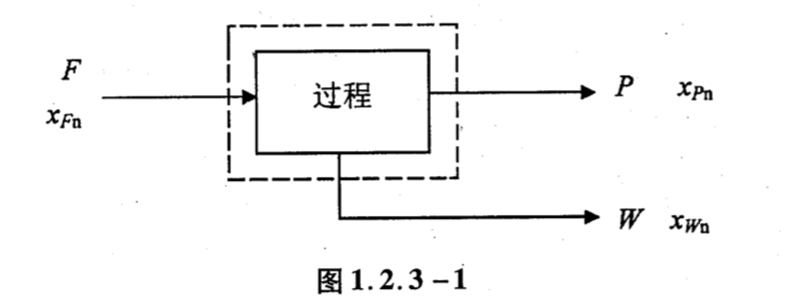
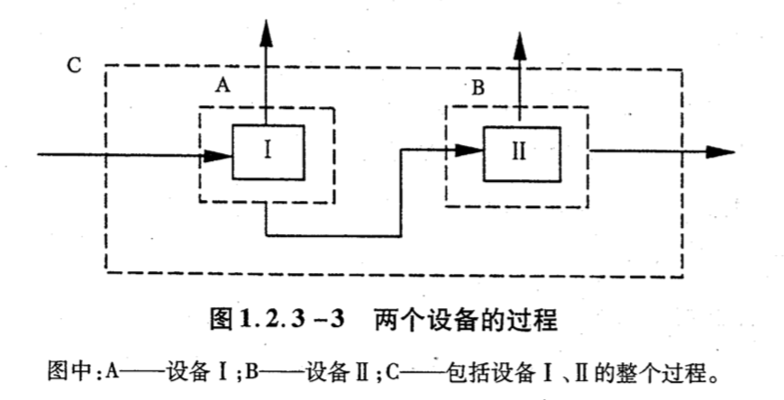
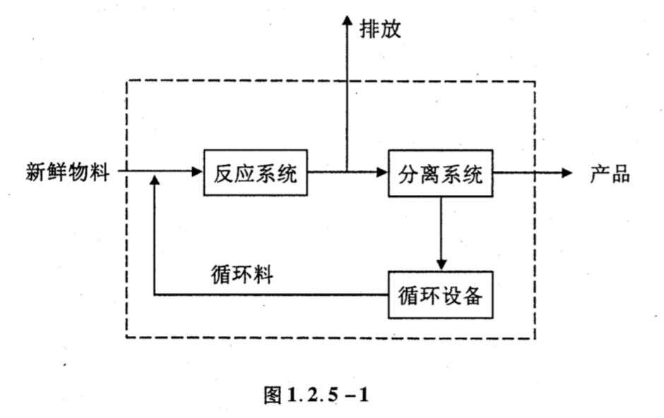

# 0101. 物料和能量平衡

## 1.1 概述

物料衡算和能量衡算是化工工艺设计的基础，也是进行化工工艺设计及经济评价的基本依据，通过对全过程或单元过程的物料和能量衡算，可以确定工厂生产装置设备的设计规模和能力；同时，可以计算出主、副产品的产量，原料的消耗定额，生产过程的物料损耗以及三废的排放量，蒸汽、水、电、燃料等公用工程消耗。

通过物料平衡和能量衡算可以确定各物料的流量、组成、状态和物化性质，从而为确定设备尺寸、管道设计、仪表设计、公用工程设计以及建筑、结构设计提供依据。因此，物料和能量衡算是化工技术人员必须掌握的基本技能，也是学习和对化工过程进行深入研究时，推导数学模型基本方程的重要基础。

化工过程根据其操作方式可以分成间歇操作、连续操作以及半连续操作三类。或者将其分为稳定状态操作和不稳定状态操作两类。在对某个化工过程作物料或能量衡算时，必须了解生产过程的类别。

1、间歇操作过程：原料在生产操作开始时一次加入，然后进行反应或其它操作直到操作完成后，物料一次排出。在整个操作时间内，没有物料进出设备，设备中各部分的组成、条件随时间不断变化。

2、连续操作过程：在整个操作期间，设备的进料和出料是连续流动的，原料不断稳定地输入生产设备，同时不断从设备排出总量相等的物料。在整个操作期间，设备内各部分组成与条件不随时间而变化。

3、半连续操作过程：操作时物料一次输入或分批输入，而出料是连续的；或连续输入物料，而出料是一次或分批的。

整个化工过程的操作条件（如温度、压力、物料量及组成等）不随时间而变化，只是设备内不同点有差别，这种过程称为稳定状态操作过程或称稳定过程。如果操作条件随时间而不断变化的，则称为不稳定状态操作过程或称不稳定过程。

化工过程操作状态不同，其物料或能量衡算的方程亦有差别。

## 1.2 物料平衡

### 1.2.1 基本概念

进行物料衡算的理论依据是质量守恒定律，即在一个独立的体系中，无论物质发生怎样的变化，其质量保持不变。物料衡算基本式：

```
进入体系的物料量 = 输出体系的物料量 + 体系累积的物料量
```

若体系内有化学反应发生，在作衡算时，要把由反应消耗或生成的量考虑在内。式（1.2.1-1) 为（1.2.1-2）。

从式（1.2.1-2）可以看出，在对反应物作衡算时，由反应而消耗的量应取减号；对生成物作衡算时，由反应而生成的量应取加号。

### 1.2.2 基本方法

进行物料衡算时，基本方法是：画出物料流程简图，选择计算基准及物料衡算式。

1、物料流程简图。

求解物料衡算问题，应先根据给定的条件画出流程简图。图中用简单的方框表示过程中的设备，用线条和箭头表示每个流股的途径和流向，并标出每个流股的已知变量及单位。对一些未知的变量，可用符号表示。

例如：含 CH4 90% 和 C2H6 10% (mol%）的天然气与空气在混合器中混合，得到的混合气含 CH4 8%，试计算 100 mol 天然气应加入的空气量及得到的混合气量。所画的物料流程图如图 1.2.2-1 所示。

画出物料流程图，能将各流股的已知变量及未知变量清晰地记在图上，对所列物料衡算式有帮助。



2、选择计算基准。

进行物料、能量衡算时，必须选择一个计算基准。从原则上说任何一种计算基准都能得到正确的解答，但计算基准选择得恰当，可以使计算简化，避免错误。

根据不同过程的特点：1）应选择已知变量数最多的流股作为计算基准。例如：某一个体系，反应物组成只知其主要成份，而产物的组成已知，就可以选用产物的单位质量或单位体积作基准，反之亦然。2）对液体或固体的体系，常选取单位质量作基准。3）对连续流动体系，用单位时间作计算基准有时较方便。例如：以 1 小时、1 天等的投料量或产品量作基准。4）对于气体物料，如果环境条件（如温度、压力）已定，则可选取体积作基准。

3、根据过程的不同情况选择物料衡算式进行计算。

一般包括下面几个步骤：1）收集已知数据，如进入或输出体系的物料的流量、温度、压力、浓度、密度等。2）作流程简图，在图中应作出所有物料线，标上所有已知和未知量。若过程中有多股物流，则可将各股物流编号。3）确定衡算体系，根据已知条件及计算要求进行确定，可在流程图中用虚线表示体系边界。4）写出化学反应方程式，包括主副反应，注明分子量。若无化学反应发生，可免去此步。5）选择恰当的计算基准，在流程图上注明所选的基准值，过程的物料衡算和能量衡算应在同一基准上进行。6）列出物料衡算式，用数学方法求解。对组成较复杂的物料，可先列出输入输出物料表，便于整理已知条件和计算结果。7）完成输入-输出物料表。

### 1.2.3 无化学反应过程的物料平衡

在化工过程中，一些没有发生化学反应，只发生物理变化的单元操作，比如混合、蒸馏、蒸发、干燥、吸收、结晶、萃取等。如果体系没有积累，这些稳定过程的物料衡算都可以根据物料衡算式：

```
进入体系的物料量 = 输出体系的物料量
```

列出总物料和各组分的衡算式，再用代数法求解。



如图 1.2.3-1 所示，若每个股流有 n 个组分，则可以列出下列衡算式：1）总物流衡算式；2）各组分的衡算式。

由上可见，若物料中有 n 个组分，可列出 n 个组分的衡算式和一个总物料衡算式，共 n+1 个衡算方程。但是，在同一个物流中，各组分的质量分数（或摩尔分数）之和等于 1，即：

由式（1.2.3-2）、（1.2.3-3）可以引伸出 n+1 个方程，其中只有任意 n 个方程是独立的，由这 n 个独立方程用代数运算可以得到另一个方程。所以，有 n 个组分的体系，只需求解 n 个未知量。

1、简单过程的物料衡算。

简单过程是指仅有一个设备、或一个单元操作、或整个过程简化成一个设备的过程。在物料流程简图中，设备的边界就是体系的边界。

以连续蒸馏塔为例，连续蒸馏塔物料衡算的目的是找出塔顶产品、塔底产品的流量和组成与原料液的流量和组成之间的关系，若塔的分离任务已定，则已知进料组成和流量可求出塔顶和塔底产品的流量和组成。

对图的蒸馏塔作全塔总质量衡算得：

作全塔各组分的质量衡算得：

2、有多个设备过程的物料衡算。

对于有多个设备的过程，在进行物料衡算时，可以先划分出多个衡算体系。例如：有两个设备的过程，如图 1.2.3-3。可划分成三个衡算体系。



每个衡算体系均可列出相应的衡算方程。若每个设备的输入和输出物料中均含有 3 个组分，则每个体系可写出 3+1 个衡算方程，其中有 3 个是独立方程。

如体系 A、B、C 各有 3 个独立方程，每个体系的 3 个独立方程成为一组，共三组。这样，具有两个设备的过程，共有 2+1 组衡算方程（即设备 I、Ⅱ 的 2 组方程和整个过程的 1 组方程）。但是，只有 2 组方程是独立的。所以，独立方程的总数应该是 2x3 个，就是最多能求出 6 个未知量。

### 1.2.4 有化学反应过程的物料平衡

由于发生了化学反应，在体系中就会有新的物质产生，所以各化学物质的进入与输出体系的量或质量流率就会不平衡。同时，还要考虑反应中的反应速率、转化率、产物的收率等因素所带来的影响。

工业化学反应过程中，当反应原料比不按化学计量比时，根据反应物的化学计量数大小可称其为限制反应物与过量反应物。

1、限制反应物：化学反应原料不按化学计量比配料时，其中以最小化学计量数存在的反应物称为限制反应物。

2、过量反应物：不按化学计量比配料的原料中，某种反应物的量超过限制反应所需的理论量，称该反应物为过量反应物。

3、转化率：某一反应物反应掉的量占其输入量的百分数。若以 NA1、NA2 分别表示反应物 A 输入及输出体系的摩尔数，则反应物 A 的转化率为：

```
x=(NA1-NA2)/NA1
```

一个化学反应，由不同的反应物可计算得到不同的转化率。因此，应用时必须指明某个反应物的转化率，若没有指明，则通常指限制反应物的转化率。

4、选择性：反应物反应生成目的产物所消耗的量占反应物反应掉的量的百分数。若反应物为 A，生成的目的产物为 D，ND 表示生成的目的产物 D 的摩尔数，a、d 分别为反应物 A 与目的产物 D 的化学计量系数，则选择性为：

```
S=(a/d)·ND/(NA1-NA2)
```

反应率和选择性是反应过程中的两个主要技术指标。

5、收率：目的产物的量除以反应物（通常指限制反应物）输入量，以百分数表示。它可以用物质的量（摩尔数）或质量进行计算。若以摩尔数计算，考虑化学计量系数，则目的产物 D 的收率为：

```
Y=(a/d)·ND/NA1
```

转化率、选择性和收率三者之的关系为：

```
Y=S·x
```

在进行有化学反应过程的物料衡算时，可以有几种计算方法。

1、直接计算法。根据化学反应方程式，运用化学计量系数进行计算的方法，称作直接计算法。

2、利用反应速率进行物料衡算。在以物质的量或质量进行衡算时，将输入与输出速率之差 ri 定义为物质的量生成速率，则化学反应过程的物料衡算式为：

```
F输出 = F输入 + ri
```

3、元素平衡。由于化学反应中化学物质产生变化，可采用元素平衡的方法进行衡算，衡算式可表示为：

```
输入（某种元素）=输出（同种元素）
```

4、用联系组分作衡算。「联系组分」是指随物料输入体系，但不参加反应，最终随物料输出体系的组分。因此，在整个反应过程中，联系组分的数量不变。若 F、P 分别为输人、输出物流，L 为联系组分，L 在 F 中的质量分数为 Xfl，在 P 中的质量分数为 Xpl，则：

```
F·Xfl=P·Xpl
```

### 1.2.5 具有物料循环、排放及旁路过程的物料平衡

1、物料循环过程的物料衡算。带有物料循环的流程可用图 1.2.5-1 表示。



对循环系统来说，有单程转化率、单程收率和总转化率、总收率之分，单程化率和单程收率指物料通过反应器一次所达到的转化率和收率，而总转化率和总收率是指新鲜原料，从进入系统（图中的虚线方框为系统边界）起到离开系统止所达到的转化率和收率。

由于物料循环，新鲜物料在系统内经过反应器若干次，达到的转化率和收率当然比经过反应器一次达到转化率和收率高，所以有下面的关系：

```
总转化率＞单程转化率

总收率＞单程收率
```

按照单程转化率和总转化率的定义，可写出有物料循环的流程的单程转化率和总转化率计算如下：

```
单程转化率 = 已转化关键组分 A 的量 / 反应器入口的关键组分 A 的量

总转化率 = 已转化关键组分 A 的量 / 新鲜物料中的关键组分 A 的量
```

比较上述两式，亦可明显看出总转化率大于单程转化率。

连续操作是一个稳态过程，其积累项为零，若以图中虚线方框为界，列循环系统的物料平衡方程，则有如下关系：

总物料平衡：

```
新鮮物料量 = 产品物料量 + 排放物料量
```

组分平衡：

```
新鲜物料量 - 反应中物质减少量 = 产品物料量 + 排放物料量
```

对不参加反应的惰性组分，有如下关系：

```
新鲜物料中惰性组分量 = 产品物料惰性组分量 + 排放物料惰性组分量
```

2、具有排放过程的物料衡算。循环过程在稳定状态下，物料的质量既不积累又不消失，各流股的组分恒定。但是，如果原料中含有不反应的杂质或惰性物质，经长时间的循环会使其浓度逐渐增加，因此就必须把一部分循环不断地排放掉，以维持进料中杂质的含量不再增大。

根据稳态流动过程的物料平衡，为了不在体系内累积杂质或副产物，排放物料应调节到能排放体系内杂质或副产物的流量等于新鲜物料中杂质进入体系的流量。

```
M(排)·x(排杂)=M(新)·x(新杂)
```

排放物流流量和新鲜原料流量之比称为排放比：

```
排放出排放物流流量/新鲜原料流量
```

3、具有旁路过程的物料衡算。具有旁路的过程，就是把一部分物料绕过一个或多个设备，直接与另一流股物料相混。旁路主要用于控制物流组成或温度，这类过程的物料衡算与循环过程的物料衡算相类似，计算时应注意结点平衡。