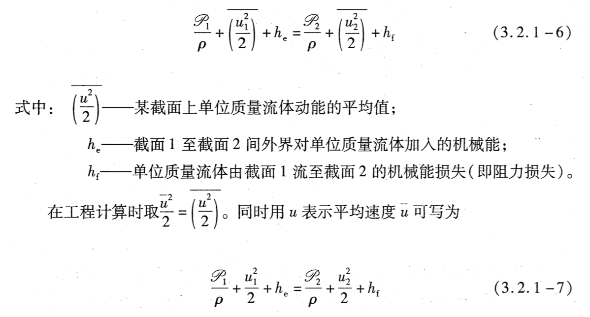
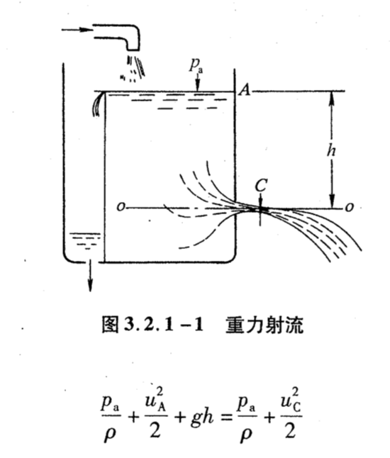
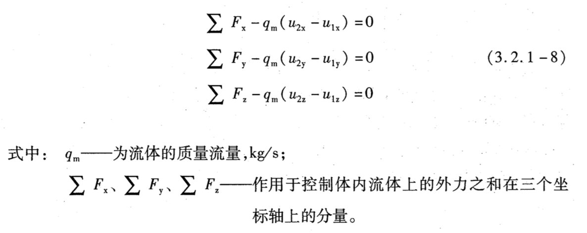
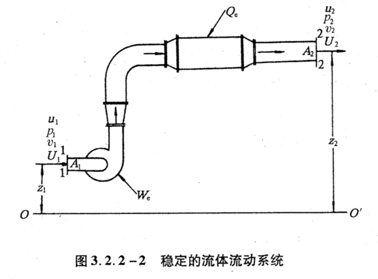
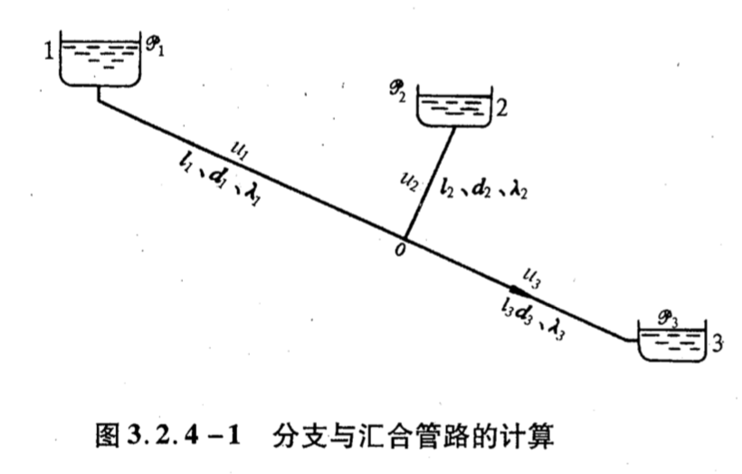
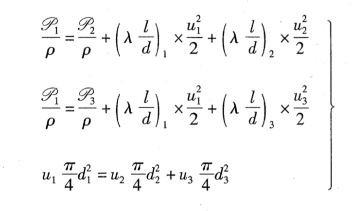
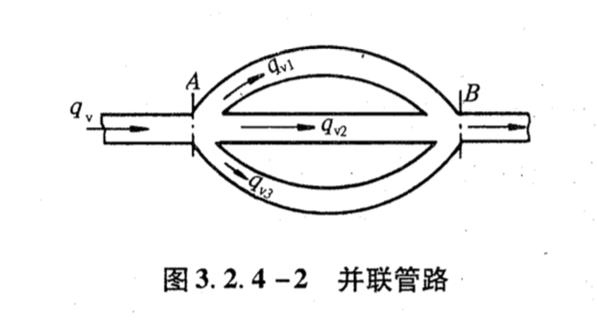

# 0301. 流体流动过程

## 3.1 概述

化工过程中所处理的物料以流体（气体和液体）占多数，原是固体的物料，可能时亦作成溶液以便于输送或处理，流体输送遂成为化工过程中最普遍的单元操作之一。流体输送问题所包括的内容有：通过管路系统的压力变化；输送所需功率；流量测量；输送设备的选择与操作等。

本章讨论的内容为与流体输送有关的基本原理，称为「流体流动」。在化学工程中，流体流动并不仅是指流体在管内或设备内的流动，因为还有许多单元操作与流体流动直接有关，例如沉降、过滤等。本章将结合化工单元操作的需要讨论一些流体力学中最基本的问题。

压力或温度改变时，其密度改变很小的流体称为不可压缩流体，若有显著改变者则称为可压缩流体。液体属于不可压缩的，气体是可压缩的，然而气体在输送过程中若压力改变不大，因而密度也改变不大时，亦可按不可压缩流体处理。真实气体的压力温度、体积之间的关系是复杂的，但一般气体在常温常压下也可按理想气体考虑。

## 3.2 流体流动

### 3.2.1 流体流动中的守恒原理

流体流动规律的一个重要方面是流速、压强等运动参数在流动过程中的变化规律。流体流动服从一般的守恒原理：即质量守恒、能量守恒和动量守恒。

#### 3.2.1.1 质量守恒

流量单位时间内流过管道截面的物质量称为流量。体积流量与质量流量之间存在下列关系：。。。。质量守恒方程根据质量守恒定理，稳定流动时，单位时间内流进和流出的质量相等。即：。。。。

式（3.2.1-2）称为流体在管道中作定态流动时的质量守恒方程式。对不可压缩流体，即密度为常数。式（3.2.1-3）表明，因受质量守恒原理的约束，不可压缩流体的平均流速其数值只随管截面的变化而变化。流体在均匀直管内作稳定流动时，平均流速沿流程保持定值。

#### 3.2.1.2. 机械能守恒

根据牛顿第二定律，推导出流体流动中的机械能守恒定律。只有在无摩擦作用时，才能保持机械能守恒。因此首先假设流体粘度为零，即考虑理想流体的机械能守恒，随后再作出某些修正以应用于实际流体。

 1）沿轨线的机械能守恒在运动流体中，任取一立方体流体微元。由于假设粘度为零，微元表面不受剪应力，运动流体中则各力不平衡而造成加速度 du/dt。由牛顿第二定律可知：

	体积力+表面力=质量×加速度

对于不可压缩流体，ρ 为常数。理想流体的运动方程，其积分形式为：

	gZ+P/ρ+u^2/2=常数

此式称为沿轨线的伯努利（Bernoulli）方程。

对于不可压缩的流体，位能和压强能均属势能，其和以总势能表示，因此伯努利方程又可写成：。。。。此式表明不可压缩的理想流体在稳定流动过程中，沿其轨线，单位质量流体的总势能和动能可以相互转换，其和保持不变。

2）理想流体管流的机械能守恒将伯努利方程应用到管流时，应注意到管流中包含了大量的流线。

前已指出，伯努利方程只说明了每一条流线上的机械能守恒。它对管流是否适用，在于管道截面上各条流线的机械能是否彼此相等。

如果所考察的截面处于均匀流段，即各流线都是平行直线且与截面垂直。流体属理想流体，粘度为零，则截面上流速分布均匀，各点上的动能也相等。

因此，截面上各点的总势能与动能都相同，即经过截面各点的每一条流线具有相同的机被能。所以，对于理想流体，伯努利方程可以直接推广应用于管流。这样，式（3.2.1-4) 可写成：

	gZ1+P1/ρ+u1^2/2=gZ2+P2/ρ+u2^2/2

3）实际流体的机械能衡算如果所考察的是粘性流体，那么，若所考察的截面处于均匀流段，则截面上各点的总势能仍然相等。但是截面上各点的速度却不相等，管中心处速度大，近壁处速度小，即各条流线的动能不再相等。

因此要将伯努利方程推广应用到粘性流体，必须采用该截面上的平均动能以代替原伯努利方程中的动能项。此外，粘性流体流动时因内摩擦而导致机能损耗，称为阻力损失。外界也可对控制体内流体加入机械能，如用流体输送机械等。此两项在作机械能衡算时均必须计入。这样机械能衡算则为：

4）伯努利方程的应用举例。

1、重力射流。

如图 3.2.1-1 所示，某容器中盛以液体，液面 A 维持不变。距液面 h 处开有一小孔，液体在重力作用下成自由射流，自小孔流出，液面 A 处及小孔出口处的压强均为大气压 pa。

要注意的是，液体自小孔流出时由于流体的惯性造成液流的收缩现象，液流的最小截面位于 C 处。在最小截面 C 处液流满足均匀流条件，故列伯努利方程应取 A 与 C 作为考察截面。

设截面 A 的流速为 ua，截面 C 的流速为 uc，并取图中水平面 0-0 作为位能基准面，则根据伯努利方程可得：

	uc=√(2gh)

为计算小孔流出时的流量，必须已知流动截面积。C 处截面积无法确定，小孔面积却是已知的。因此，工程计算时以小孔平均流速 u 代替 uc，同时考虑流体流动时的能量损失，而引入一校正系数 C，则：

	u=C·√(2gh)

式中 C 称为孔流系数，其值一般在 0.61~0.62 之间。

此例说明位能与动能的相互转换，A 处的位能在 C 处转化为动能。

2）压力射流。

如图 3.2.1-2 所示，管道或容器中流体的压强为 p，其值大于外界大气压 pa，流体自壁面小孔流出。设圆管或容器内的流体不断得到补充，p 保持不变。仿照上例，取 1-1 和 2-2 截面，应用伯努利方程可得：

当容器内外压强差 △p 较小时，气体也可视为不可压缩流体，上式也可用于气体。此例说明压强能与动能的相互转换。

#### 3.2.1.3 动量守恒

物体的质量 m 与运动速度 u 的乘积称为物体的动量，动量和速度都是向量，其方向与速度的方向一致。

牛顿第二定律的另一种表达方式是：物体动量随时间的变化率等于作用于物体上的外力之和。现取图 3.2.1-4 所示的管段作为控制体，则：

	作用于控制体内流体上的外力的合力-(单位时间内流出控制体的动量)+(单位时间内进入控制体的动量)=(单位时间内控制体中流体动量的累积量)

对定态流动，动量累积项为零，并假定管截面上的速度作均匀分布，则上述动量守恒定律可表达为：

### 3.2.2 流体流动的基本方程

#### 3.2.2.1 流体静止的基本方程

流体在重力与压力作用下达到平衡，便呈现静止状态；若平衡不能维持，便产生流动。静止流体的规律实际上是流体在重力作用下内部压力变化的规律。

1）流体的静力平衡。

静止流体内部任一点的压力，称为该点处的流体静压力，其特点如下：

1、流体静压力的方向与作用面相垂直；

2、从各方向作用于某一点上的流体静压力相等，即静压力与方向无关；

3、同一水平面上各点的流体静压力都相等。

流体静压力随位置高低而变，表示此变化关系的公式可通过分析流体内部的静力平衡而得：

	p/ρ+gz=常数

高度等于 z1 与 z2 的两个平面，又作用于这两平面上的压力分别为 p1 与 p2，则得：

	p1/ρ+gz1=p2/ρ+gz2

式（3.2.2-2) 是流体静止的基本方程。

#### 3.2.2.2 流体流动的基本方程

1）总能量衡算。

在稳定条件下，每单位时间若有质量为 m 的流体通过截面 1 进入划定体积（图 3.2.2-2），亦必有质量为 m 的流体从截面 2 送出。能量有各种形式，但是与流动有关的只有下列几项：

1、内能：[mU]

2、位能：[mgz]

3、动能：[mu^2/2]

4、压力能：[pV]，将流体压进划定体积时需要对抗压力作功，称流动功。

质量为 m 的流体所具有的总能量 mE，即为上述四项之和：

此为伴随流体进、出划定体积而输入或输出的能量。除此之外，能量不依附着流体也可以通过其它途径进、出划定体积。它们是：

1、热。

若管路上连接有换热器。令每单位质量流体通过划定体积的过程中交换的热为 qe，则总热量 mqe。

流体吸人热量为正，放出热量为负。

2、功。

若管路上安装泵或鼓风机等流体输送设备向流体作功，便有能量从外界输入到划定体积内。反之，流体也可以通过水力机械等向外界作功而输出能量。令每单位质量流体通过划定体积的过程中所接受的外功为 We，则总功为 mWe。

流体接受外功为正，向外界作功为负，则由图 3.2.2-2 所示流动系统所作的总能量衡算为：

	mU1+mgz1+mu1^2/2+p1V1+mqe+mWe=mU2+mgz2+mu2^2/2+p2V2

将上式的每一项除以 m，又令 V/m=v 代表流体的比容，则得到以单位质量流体为基准的稳定流动的总能量衡算式：

	U1+gz1+u1^2/2+p1v1+qe+We=U2+gz2+u2^2/2+p2v2

U 与 pv 之和为 H（单位质量流体的焓），故总能量衡算式又可写成：

式（3.2.2-3) 中所包括的能量可划分为两类。一类是机械能，即位能、动能、压力能、功，其能量在流体流动过程中可以互相转变，亦可转变为热或流体的内能；另一类包括内能和热。这二者在流动系统内不能直接转变为机械能而用于流体输送。

#### 3.2.2.3. 机械能衡算——伯努利方程

设流体是不可压缩的，式（3.2.2-4）中的 v1=v2=v=1/p；流动系统中无热交换器，式中 qe=0；流体温度不变，则 U1=U2。

流体在管内流动时要做功以克服流动的阻力，故其机械能有所消耗。机械能衡算中不计入内能与热，则因克服流动阻力而消耗掉的机械能，便应作为散失到划定体积以外的能量而列入输出项中，即于衡算式的输出项目中增加 Wf——单位质量流体通过划定体积的过程中所损失的能量，其单位与 We 同，为 J/kg。

式（3.2.2-4) 于是成为：

	gz1+u1^2/2+We=gz2+u2^2/2+Wf

采用 SI 单位时，式（3.2.2-6）中各项的单位 m2/s2，它的意义是每 kg 流体的能量为多少 kg/m2/s2（即多少J）。

若将式（3.2.2-6）的各项都除以重力加速度 g，则可写成：

	z1+u1^2/2g+he=z2+u2^2/2g+hf

上式中各项的单位均为 m。

由于「米」反映一定的高度，故式中各项分别称为位头（位压头），速度头（动压头）与压力头（静压头）。三项之和称为总压头。

he 是流体接受外功所增加的压头，hf 是流体流经划定体积的压头损失。

#### 3.2.2.4 机械能衡算式的意义与应用

若没有外功加入又没有能量损耗，则任一截面上的机械能总量 E 为常数。

若有外功加入并有能量损耗，则下游截面与上游截面的机械能总量之差为：

伯努利方程将各种机械能的互变形象地表示为压头的互变。若没有外加压头又没有压头损失，则任一截面上的总压头 h 为常数。

若有外加压头并有压头损失，则下游截面与上游截面的总压头之差 △h 为：

	△h=he-hf

按能量的公式计算或按压头的公式计算，结果相同，但应注意其单位不同，前者是 J/kg 即 （m2/s2），后者是 J/N，即 m。

### 3.2.3 阻力损失 

#### 3.2.3.1 两种阻力损失

化工管路主要由两部分组成：一种是直管，另一种是各种管件。

无论是直管或管件都对流动有一定的阻力。直管造成的机械能损失称为直管阻力损失（或称沿程阻力损失）；管件造成的机械能损失称为局部阻力损失。对阻力损失作此划分是因为两种不同阻力损失起因于不同的外部条件，也为了工程计算及研究的方便，但这并不意味着两者有质的不同。

此外，应注意将直管阻力损失与固体表面间的摩擦损失相区别。固体摩擦仅发生在接触的外表面，而直管阻力损失发生在流体内部，紧贴管壁的流体层与管壁之间并没有相对滑动。

#### 3.2.3.2 直管阻力损失的计算式

统一的表达方式对于直管阻力损失，无论是层流或湍流，均可为统一形式，以便于工程计算。

XX

式中摩擦系数 λ 为 Re 数和相对粗糙度的函数。

1）摩擦系数 λ 对 Re <2000 的层流直管流动，摩擦系数与管壁粗糙度无关，根据理论推导后可得：

	λ=Re/64

湍流（Re>2000）的摩擦系数与 Re 和管壁粗糙度有关。湍流的 λ 可分为 3 个区域，水力光滑管区，过渡区和阻力平方区。

2）粗糙度对 λ 的影响。层流时，粗糙度对 λ 值无影响。在湍流区，管内壁高低不平的凸出物对 λ 的影响是相继出现的。随着 Re 的增大，越来越低的凸出物相继发挥作用，影响 λ 的数值。

3）实际管的当量粗糙度。管壁粗糙度对阻力系数 λ 的影响，首先是在人工粗糙管中测定的。工业管道内壁的凸出物形状不同，高度也参差不齐，粗糙度无法精确测定。实践上是通过试验测定阻力损失并计算 λ 值，然后反求出相当的相对粗糙度，称之为实际管道的当量相对粗糙度。由当量相对粗糙度可求出当量的绝对粗糙度。

4）非圆形管的当量直径。前面讨论的都是圆管的阻力损失。实验证明，对于非圆形管内的湍流流动，如采用下面定义的当量直径 d。代替圆管直径，其阻力损失仍可按式（3.2.3-1) 进行计算。

	de=4×管道截面积/浸润周=4A/∏

当量直径的定义是经验性的，并无充分的理论根据。对于层流流动还应改变式（3.2.3-3) 中的 64 这一常数，如正方形管为 57，环隙为 96。对于长宽比大于 3 的矩形管道使用上式将有相当大的误差。

#### 3.2.3.3 局部阻力损失

化工管路中使用的管件都会产生阻力损失，和直管阻力的沿程均匀分布不同，这种阻力损失是由管件内流道多变所造成，因而称为局部阻力损失。局部阻力损失是由于流道的急剧变化使流动边界层分离，所产生的大量旋涡消耗了机械能。

局部阻力损失是一个复杂的问题，难于精确计算。通常采用局部阻力系数和当量长度的近似方法计算。

实际应用时，长距离输送以直管阻力损失为主；车间管路则往往以局部阻力为主。

### 3.2.4 流体输送管路的计算

管路按其配置情况可分为简单管路和复杂管路。前者是单一管线，后者则包括最为复杂的管网。复杂管路区别于简单管路的基本点是存在着分流与合流。

#### 3.2.4.1 管路计算

1）简单管路的数学描述。表示管路中各参数之间关系的方程只有三个：质量守恒、能量守恒和摩擦系数方程。
 
管路计算按其目的可分为设计型计算与操作型计算两类。

2）简单管路的设计型计算。

设计型计算一般是管路尚未存在时给定输送任务，要求设计经济上合理的管路。典型的设计型命题如下。

设计要求：给定输送量 q，确定最经济的管径 d 及须由供液点提供的势能。

给定条件：

a、供液与需液点间的距离，即管长 l；

b、管道材料及管件配置；

c、需液点的势能；

在以上命题中只给定 5 个变量，方程组（3.2.4-1) 仍无定解，设计人员必须再补充一个条件才能满足方程求解的需要。

例如，对上述命题可设定流速 u，计算管径 d 及所需的供液点势能。设定不同的流速 u，可对应地求得一组 d 和势能。设计人员的任务就在于从这一系列计算结果中，选出最经济合理的管径。由此可见，设计型问题一般都包含着「选择」或「优化」的问题。

最经济合理的管径或流速的选择应使每年的操作费与按使用年限计的设备折旧费之和为最小。

原则上说，为确定最优管径，可选用不同的流速作为方案计算，从中找出经济、合理的最佳流速（或管径）。对于车间内部的管路，在经济流速范围内，经验地选用流速，然后由质量守恒式算出管径。再根据管道标准进行圆整。

在选择流速时，应考虑流体的性质。

3）简单管路的操作型计算。

操作型计算问题是管路已定，并且要求核算在某给定条件下管路的输送能力或某项技术指标。这类问题的命题如下。

给定条件：XX；

计算目的：输送量 qv；

或给定条件：XX；

计算目的：所需的 P；

计算的目的不同，命题中需给定的条件亦不同。但是，在各种操作型问题中有一点是完全一致的，即都是给定了 6 个变量，方程组有唯一解。

在第一种命题中，为求得流量 q 必须联立求解方程组（3.2.4-1）中的（b）、（c）两式，计算流速 u 和 λ，然后再用方程组中的（a）式求得 q。

由于式（3.2.3-2) 或图 3.2.3-1 系一个复杂的非线性函数，上述求解过程需试差或迭代。

必须指出，当已知阻力损失服从平方或一次方定律时，则可以解析求解。

4）分支与汇合管路的计算。

在图 3.2.4-1 所示的管路中，根据 2-0 内的流向，可能是分支管路，也可能是汇合管路。在交点 0 都会产生动量交换。在动量交换过程中，一方面造成局部能量损失，同时在各流股之间还有能量转移。

在机械能衡算式的推导过程中，两截面之间是没有分流或合流的。但能量衡算式是对单位质量流体而言的，若能搞清因动量交换而引起的能量损失和转移，则能量衡算式仍可用于分流或合流。工程上采用两种方法解决交点 0 处的能量交换和损失。

1、交点 0 的能量交换和损失与各流股的流向和流速大小有关，但可将单位质量流体跨越交点的能量变化看作流过管件（三通）的局部阻力损失，由实验测定在不同情况下三通的局部阻力系数 ε。当流过交点时能量有所增加。则 ε 值为负，能量减少则为正。这样，只要各流股的流向明确，仍可跨越交点列出机械能衡算式。

2、若输送管路的其它部分的阻力较大，如对 l/d 大于 1000 的长管，三通阻力所占的比例甚小而予以忽略，可不计三通阻力而跨越交点列机械能衡算式，所得结果是足够准确的。

现设图 3.2.4-1 中流体由槽 1 流至槽 2 与槽 3, 则可列出如下方程：

式中管长 l 均包括局部阻力的当量长度；下标 1、2、3 分别代表 0-1、0-2 0-3 三段管路。

对操作型计算，可设 λ 为一常数，由上述方程组可求出 u1、u2、u3。如有必要，可验算总管及各支管的 Re 数，对假设的 λ 值作出修正。

5）并联管路的计算并联管路如图 3.2.4-2 所示。并联管路的特点在于分流点 A 和合流点 B 的势能（即 p/ρ+gz）值为唯一的，因此，单位质量流体从 A 流到 B，不论通过哪一支管，阻力损失应是相等的，即：

	hf1=hf2=hf3=hf

若忽略分流点与合流点的局部阻力损失，各管段的阻力损失计算可按下式：

式中 li 为支管长度，包括了各局部阻力的当量长度。

在一般情况下，各支管的长度、直径、粗糙度情况均不同，但各支管中流动的流体是由相同的势能差推动的，故各支管流速 ui 也不同，将 ui 代入上式经整理得：

由此式可求出各支管的流量分配。如只有三个支管，则：

由质量守恒知总流量：

#### 3.2.4.2 可压缩流体的管路计算

1）无粘性可压缩气体的机械能衡算。

2）绝热流动。

### 3.2.5 气-固和液-固两相管道流动

#### 3.2.5.1 气-固和液-固两相管道流动的一些基本概念

本章讨论的是气体-固体和液体-固体的非均相混合物在管道内的流动特性，如流动型态、压降计算和最小输送流速等，应予说明的是一些微细和超微细（<5um）粒子的水悬浮液，当其在流动中形成假均相悬浮状态时，常常可能显示出非牛顿流体的流动特性，特别在固体粒子浓度较高时更易这样。

1）气力输送和水力输送的应用。

气-固和液-固两相在管道内的流动见于工业中日益增多的气力输送（Pneu matic conveying）和水力输送（hydraulic transport）。

水力输送很早以来已用于治金厂内废细料的输送、挖泥、疏浚和类似操作中泥沙和碎粒的短距离输送，以及采矿工业中矿物的输送。近年以来长距离水力输送固体的操作愈来愈受到重视。

气力输送和水力输送的关系尚不完全清楚。不过它们的基本原理和处理方法相同的。有的经验关联包含了气-固和液-固混合物两者的数据，有些关联只包含气-固或液-固混合物一些的数据。

2）管道中固体流体两相混合物的状态。

管内固体的表观流速：

和气-液两相流动一样，气-固两相在管内是以不同的流速流动的，因而使两相之间产生滑动或持料现象。持料现象通常用管内某处气-固两相各占的面积分数或体积分数来量度。若管内各处持料量不同，则可有平均持料量。

#### 3.2.5.2 气-固和液-固两相在垂直管内的流动 

1）流动型态。

当流体速度远比粒子沉降速度高时，在垂直管内气-固和液-固两相的流动通常是粒子呈充分分散的悬浮状态。粒子的浓度分布在轴向上一般是均匀的，但在径向上粒子浓度分布却不是均匀的。随着流速的减小，管内固体粒子浓度增大。

在正常流动状态下，管内的物料没有积累。管道进出口处的物料浓度是一样的，此时的流动是稳定的。当气速进一步减小到某一数值时，管内开始产生物料的积累，流动变为不稳定的。最后管道将由于物料的不断积累而噎塞，此时的流速称为噎塞流速或最小输送流速。

管内流动型态的变化可由压降和流速的曲线示出。如图 3.2.5-1 所示。图中 AB 线表示物料在管内是充分悬浮的，其压降随流速的减小而减小，BC 线表示管内物料的浓度随流速减小而迅速增加，因此压降增大 C 点表示流速已到噎塞流速 uch 的情况。

2）垂直管内的最小输送流速。

在设计气力或水力输送系统时，最基本的设计参数就是最小输送流速。最小输送流速必须使粒子不致沉降，达到保持稳定的操作。当流速低于此数值时会导致不稳定的操作甚至阻塞。但是，过高的流速会导致不必要的压力损失和增大管道的磨损。因此，必须首先确定最小输送流速。

从理论上讲，在垂直管道中，只要流体速度大于最大粒子的自由沉降速度，则全部颗粒均可以带走。球形粒子的自由沉降速度计算按下式：

3）垂直管压降的关联。

试图关联流体和固体混合物在垂直管内流动的压降梯度的努力始于 Gaster stat，此后已经有若干经验关联。Rose 和 Duckworth 关联已为若干物料和不同管径的数据所证实，是一个很好的计算垂直管压降的普遍关联式，但计算比较复杂。

#### 3.2.5.3 气-固和液-固两相在水平管内的流动

1）流动型态。
 
1、对称悬浮流动。

当混合物流速高于某一数值 um1 时，粒子在流体中处于充分悬浮状态，并在管轴线周围呈对称分布。对于液-固流动一般在混合物流速达 3m/s 左右，且粒子属于中、细粒径时，都可以达到对称悬浮流动。如果粒子的沉降速度很小，则在液体流速为 1m/s 左右就可形成对称悬浮流动。

2、不对称悬浮流动。

当流速降到小于 um1 时，湍流强度减弱，一些粒子碰撞到下半部管壁后又被弹回流体，于是较多的粒子特别是大粒子处于管子的下半部。管内上半部的粒子浓度比下半部小。这种流动称为不对称悬浮流动。随流速减少到 um2 以前，这种流动可以一直保持。

3、移动床流动。

当流速降到小于 um2 后，粒子就会沉积在管底部。先像是分离的「沙丘」，然后成为连续的移动床。移动床的移动速度比液体速度小。沙丘或移动床上部的粒子以较其下部粒子以更快的速度滚动前进。对于混合粒子的情况，床层由沉降最快的粒子组成，中等沉降速度的粒子处于不对称悬浮状态，而沉降最慢的粒子则保持对称悬浮状态。

4、静止床-跳跃-不对称悬浮流动。

当流速进一步降低到以时，粒子床的最下部几乎静止不动，床层增厚。床层最上部粒子跳跃滚动着前进。对于粒径广泛的混合粒子，则有的小粒子仍然能够在床层上部保持为不对称悬浮状态。这种状态称为静止床-跳动-不对称悬浮流动。最后随流速减小到 um4 静止床迅速增厚直至将管道堵塞。

流动型态的改变可以从压降曲线反映出来，如图 3.2.5-3 所示。

2）水平管内的最小输送流速 um2。

水平管内的最小输送流速是指在管内为不对称悬浮流动时，流体速度的低限。低于这一数值，粒子就开始沉积在管底。

液-固混合物的最小输送流速。

Durand 在 40 到 700 mm 的管道中用沙、煤粒进行了实验，固体浓度为 2% 到 15% 体积百分率，得到最小输送流速：

3）对称悬浮流速 um1 的关联。

当悬浮物流速大于 um1 时，流动是对称悬浮流动，当流速小于 um1 后，流动就变为不对称悬浮流动。对液-固悬浮液，这一过渡流速 um1 有若干经验关联。

4）水平管压降的关联。

水平管内固体流体混合物的压降，当粒子动能变化项可以略去不计时，就等于阻力损失压降。它应与管内是对称悬浮或是不对称悬浮有关。因此应该分别对这两种状态进行关联才比较可靠。但为简便起见，也有一些关联其实验范围，包括对称和不对称两种悬浮状态的情况。复合悬浮系统的压降计算方法请参考相关技术资料。