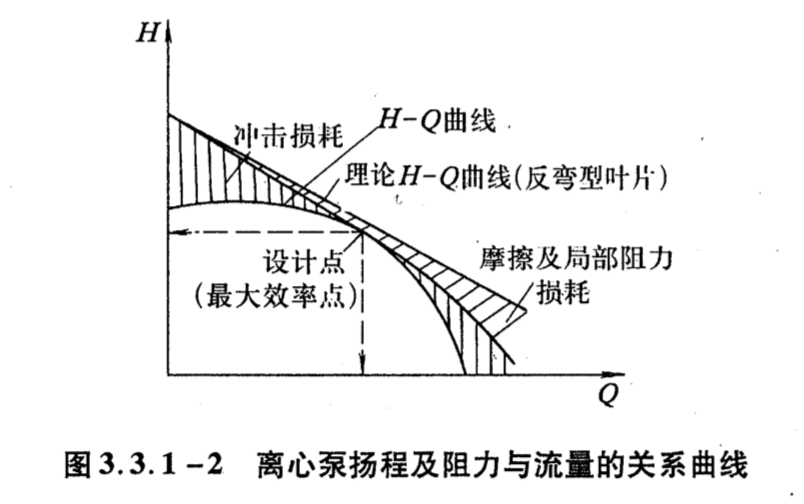
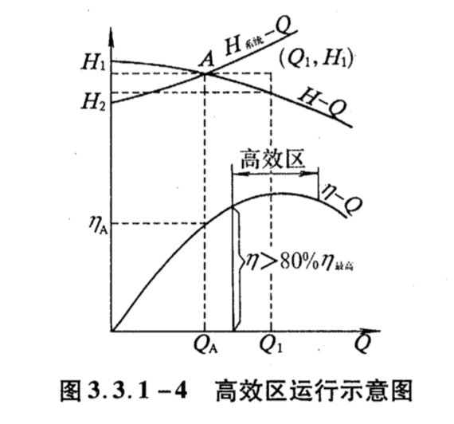
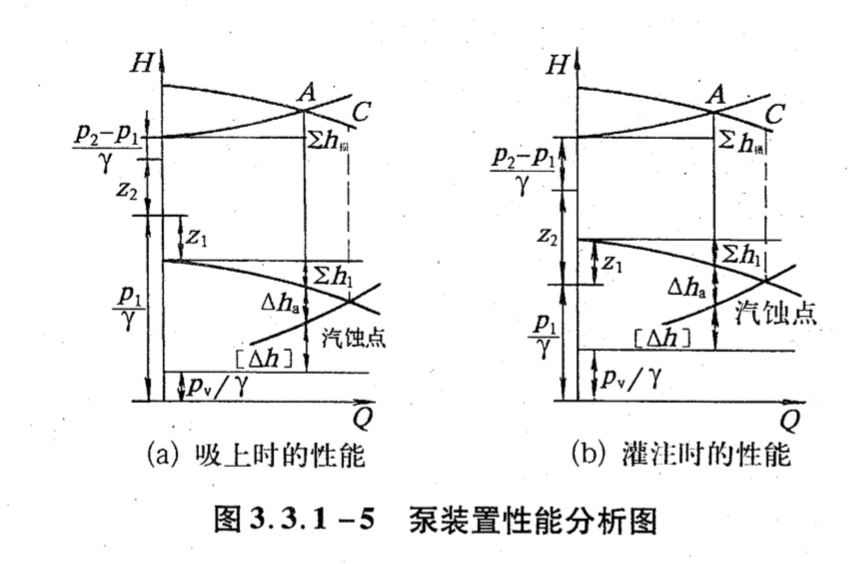
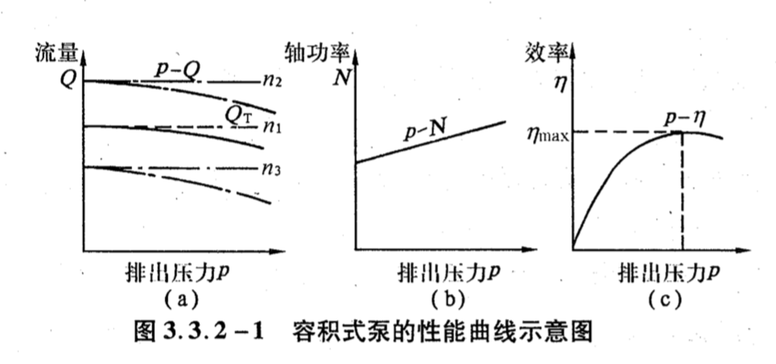
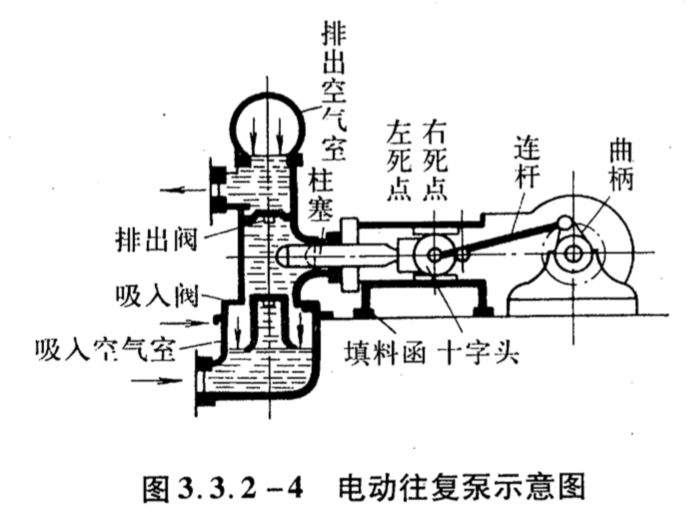
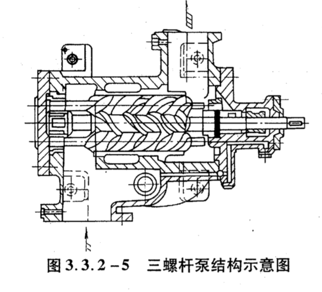
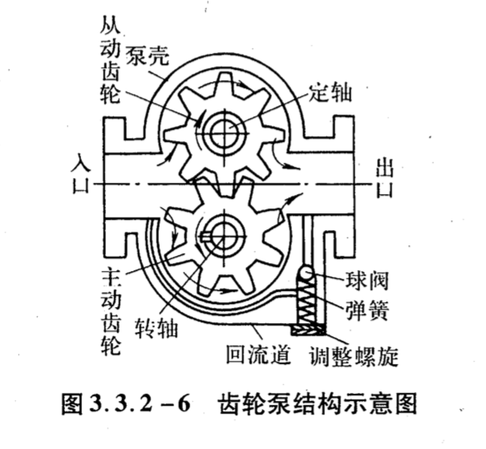
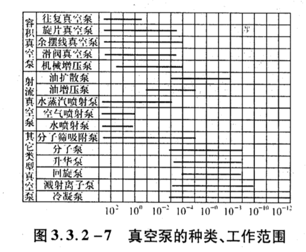
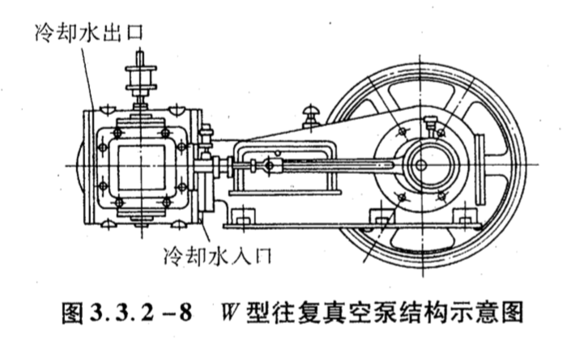
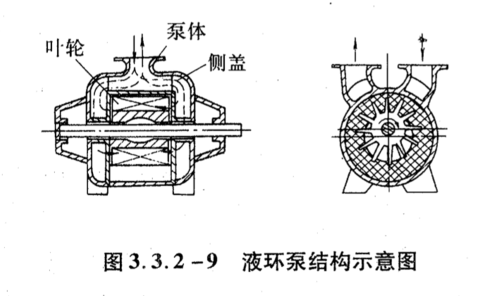

# 0302. 流体流动过程

## 3.3 流体输送机械

### 3.3.1 叶片式泵
 
#### 3.3.1.1 泵的性能参数

1）流量。

泵的流量是指单位时间内泵排出的液体量。常以体积流量表示。叶片式泵的流量与扬程有关，扬程为流量的函数。

2）扬程（或压头）。

泵的扬程是指泵输送单位重量液体由泵进口至出口的能量增加值。其值等于泵出口总水头和入口总水头的代数值。

3）功率和效率。

泵在单位时间内对液体所作的功，称为有效功率 Ne，其值为：

泵工作时由驱动机传给泵（轴）的功率，称为轴功率 N。泵的效率是泵的有效功率与轴功率之比，即：

泵效率与泵类型和泵能力大小有关。

4）气蚀余量。

气蚀液体在离心泵中流动时，在某一局部地方的压力降低，使该处的液体压力与该介质温度下的饱和蒸气压相等时，液体即气化或从液体中析出溶解于其中的气体，形成气泡。气泡随液体进入叶轮中压力较高的地方，重新又凝缩成液体。蒸汽凝缩过程进行得很快，周围的液体很快地流向汽泡凝缩处，液体在叶轮内发生猛烈的冲击和响声。

此时冲击的压力很大，高达几千大气压，且冲击次数每秒钟达数百次，以致造成泵内液体流通部分表面严重损伤，表面形成凹陷或显微裂缝。这种液体的汽化和凝缩，随之而产生的冲击现象，称为气蚀或汽穴现象。

为了保证泵操作时不发生气蚀，应使泵所需要的气蚀余量比泵的最小气蚀余量大一裕量。根据国家标准 CB/T3216-1989，此裕量为 0.3 m。泵需要的允许气蚀余量为：

5） 比转数 ns。

泵在最高效率下运转，产生扬程为 1m，流量为 0.075 m3/s 所消耗的功率为 1 马力时的转速，称为这台泵的比转数（亦称比速）。

比转数 n 与实际转速、流量、扬程的关系为：

比转数是一个综合性能参数，其实质是每一类型（相似）泵群的模型泵。叶片泵的比转数大小还反映出泵效率的高低，即泵经常运转的经济性。叶片式泵的效率只有在 ns=90~300 范围内较高（低值是指小流量泵而高值是指大流量泵）。

#### 3.3.1.2 理论基础和基本方程

被输送的液体在泵内流动时获得能量，即泵对液体作了功；液体流动时受到管路系统的阻力，而又损失掉部分能量。

液体在泵内的能量转换中，获得位能、动能和压力能。根据能量守恒定律，总的输入能量与总的输出能量相平衡。以伯努利方程表示，即：

上式各项能量表示于图 3.3.1-1 中。

式中各项能量以米液柱（简用米）作单位。这种以液柱高度表示的能量在工程上也叫压头或扬程，其中 z 叫位压头，u^2/2g 叫动压头，P/pg 叫静压头。

将式（3.3.1-7） 变换，得到任何管路系统所需要的扬程：

#### 3.3.1.3 离心泵

化工用泵虽然品种繁多，但使用的离心泵大体占 80% 以上。离心泵有单吸、双吸、单级、多级、卧式、立式及高速离心泵等。

目前高速离心泵的转速已达 24,700 r/min，单级扬程达 1700m。我国单吸泵的流量为 5.5~300 m3/h，双吸泵的流量为 120~20,000m3/h。

1）离心泵的性能曲线及性能换算。

1、性能曲线。

泵的最主要运转特性是流量 Q、扬程 H、功率 N 和效率 η。而影响这些性能的变量是转速 n 和叶轮的直径 D。

离心泵的性能曲线是反映泵在恒速下流量与扬程（Q-H）、流量与允许吸上真空高度（Q-Hs）或流量与允许气蚀余量（Q-△h）关系的曲线，见图 3.3.1-2。

一般离心泵叶轮叶片为后弯型，理论 H-Q 是一条向下倾斜的直线，实际 H-Q 曲线是一条抛物线，如下图所示。

2、性能换算。

a）转数改变时的性能换算。

符合几何相似和运动相似条件的特性，可近似地按下列公式进行换算：

转数与流量成正比；

转速的平方与扬程成正比；

转速的立方与功率成正比；

b）输送介质改变时的性能换算。

介质重度改变输送介质重度与常温清水的重度不同时，泵的扬程、流量和效率不变，而泵轴功率则随输送介质重度而变化，即：

泵轴功率与密度成正比。

2）泵的工作点及调节。

在化工装置中，液体输送是由泵和管路系统组成泵系统。其性能决定于输送系统的性能和泵的性能。

把泵的性能「H-Q」和输送系统性能「H系统-Q」用同一比例画在一起，两条曲线的交点 A（见图 3.3.1-3），这就是泵运行的「工作点」或称工况点，并有一组扬程 HA、流量 QA、功率 NA、效率等性能指标。

一般正常运行时泵的工作点，应落在泵性能曲线的高效区（见图 3.3.1-4）。

泵裝置的流量、扬程满足后，能否有效地工作，还必须校核吸入性能是否可靠即吸入系统的有效气蚀余量 △h。是否能保证大于泵所需要的允许气蚀余量【△h】，或实际吸上真空度是否小于泵允许吸上真空度。

用装置性能图 3.3.1-5 来分析当工作点 A 落在气蚀发生点 C（吸入系统性能曲线与允许气蚀余量性能曲线【△h】-Q 的交点）左边时，泵能可靠地吸入，此时液体在进泵前所剩余的能量△h - 【△h】能有效地用来制止气蚀的产生。然而，这部分剩余能量是随着流量的增大而减小的，在到达 C 点时减小至零，因而产生了气蚀，使泵的性能突然下跌，见图 3.3.1-5。

从泵装置的性能分析，可以归纳出：

1、只有工作点 A 落在泵的高效区，且在气蚀点 C 的左边时，才能保证泵装置性能良好，工作可靠。当泵装置发生性能故障时，可利用图 3.3.1-4 进行分析、校核、寻找故障原因。

2、如果需要改变泵装置的性能，可以通过改变管路系统的性能或泵的性能来实现。如改变泵出口阀门的开度来调节流量，满足管路系统所需要的扬程；改变泵的转速和级数、车削叶轮外径，以改变泵的性能曲线来移动工作点，达到调节装置性能的目的。

3、为防止气蚀的发生，应尽可能地采用最短的管路，减少管件，降低管内流速等，以减小 ∑h1，提高 △ha。

3）离心泵的并联和串联。

1、并联。

当流量要求有较大变化，或者一台泵不能满足流量要求时，可用两台泵或多台泵并联工作。两台泵并联时，总的性能曲线的合成方法是将单独性能曲线在相等的扬程 H 下两台泵的流量 Q 相加，得到并联以后总的 H-Q 曲线。

此曲线与管路系统的阻力特性曲线相交，得到并联以后的工作点。离心泵的特性决定了并联运行，泵的工作点高于单独工作时的工作点，流量比单台泵大，但比两台泵单独运行时的流量之和小，且管路阻力特性曲线越陡，并联运转时流量增加的越少。

2、串联。

当单台泵流量已能满足工艺要求而扬程不能达到设计要求时，可将两台泵或多台泵串联操作。依据单台泵的性能曲线，将一定流量下两台泵的扬程相加，就得到了串联工作时的性能曲线。若输送系统阻力性能曲线其起始点低于单台泵的关死扬程（流量 Q=0） 时，则两台泵串联时，不仅扬程提高，流量也有所增加。

若两台泵的规格不同，泵流量将受其中最小的一台泵的流量所限制。最后台泵的排出总压头为各台泵排出压头之和。

考虑泵的串联或并联操作时，以下几点应予注意：

a）不论泵是并联操作还是串联操作，单台泵的特性曲线必须是具有连续下降特性，否则将产生操作上的不稳定。

b）单泵的最佳操作点与输送管路系统阻力有关，因此，管路系统阻力越小对发挥单台泵的能力和整个泵系统的能力越佳。

c）离心泵串联能提高总扬程，但要注意各台泵串联后，泵体的强度是否能满足，以确保安全。

d）为充分发挥单泵的效率，无论串联或并联工作，最好采用相同规格的泵。

### 3.3.2 容积式泵

容积式泵有两种类型：具有往复运动工作件的往复泵（柱塞泵、活塞泵、隔膜泵）和有旋转运动工作件的转子泵（齿轮泵、螺杆泵、滑片泵液环泵等）。

#### 3.3.2.1 泵的基本参数

1）容积式泵的流量 Q，是单位时间内排出的液体量，其计算通式为：
 
 	Q=60vnη

式中：

V——活塞或转子排挤容积，m3

n——转速或往复次数，r/min 

η——容积效率
 
2）轴功率和效率。

如下公式：
 
#### 3.3.2.2 容积式泵的性能曲线和性能换算
 
1）性能曲线。

图 3.3.2-1 为容积式泵恒速下的 P-Q、P-N 和 p-η 性能曲线。

由图可以看出：

1、容积式泵的理论流量 QT 与排出压力 p 无关，而随转数升降而增减；

2、泵的轴功率 N 随着排出压力的提高而增大；泵的效率随着排出压力的提高而增高；

3、输送的液体粘度增大，泵的流量降低、轴功率增加而效率降低；如液体中的气体夹带量及气体溶解量增加，泵的流量减小。

2）性能换算。

1、转数变化时的性能变化。齿轮泵和螺杆泵的流量随转数的改变而变化，当液体粘度、排出压力不变时，转数降低，则流量 Q1、功率 N1 将减少，近似换算式为：

2、粘度变化时的性能换算。当齿轮泵和螺杆泵的转数，排出压力不变，液体粘度由从 1 增至从 2 时，流量 Q 和轴功率 N 的改变，可近似地按下式计算：

3、液体夹带和溶解气体的影响。在大气温度和压力下，因液体夹带或溶解气体对齿轮泵和螺杄泵流量的影响，可由图 3.3.2-2 及图 3.3.2-3 査出其校正值后，计算实际流量。或按下式直接计算实际流量 Q。

3）泵的调节。

容积式泵不能采用关小排出阀的方法调节泵的流量，因为这种调节不仅无效反而浪费能源，甚至使泵的驱动机超负荷。

容积式泵一般采用旁路调节，改变泵转数、改变活塞或柱塞行程和顶开吸入阀的方法来调节流量。

#### 3.3.2.3 往复泵

往复泵泵头部分主要由泵体（液缸）、活塞（或柱塞）、吸入阀和排出阀组成，如图 3.3.2-4 所示。

往复泵的工作原理是：依靠往复运动的活塞将能量直接以静压形式传给液体以增加液体的动能，将机械能转变为压力能。

往复泵的类型主要决定于作用方式、传动方式及液缸布置等。

按作用方式分为：电动往复泵、直动往复泵（蒸汽、气动、液动）和隔膜泵（柱塞或隔膜）。

往复泵又有单作用、双作用；单缸、双缸、多缸；立式、卧式和水平对置式之分。

1）电动往复泵。

它的活塞是曲柄连杆机构驱动，尽管曲柄回转很均匀（角速度ω不变），但活塞的直线运动却是不等速的。因此，电动往复泵的流量是不均匀的，有脉动现象。为克服这一缺点，有的泵设置有吸入空气室和排出空气室。

空气室的作用是：当液体都经过空气室时，起到缓冲作用。

空气室中一般充满空气。当输送易燃、易爆液体时，应充注惰性气体。

2）蒸汽往复泵。

它是以水蒸汽为动力，不会产生火花，很安全。因此，特别适用于输送挥发性、易燃性液体。

3）隔膜泵。

当往复泵输送悬浮液、酸液或其它贵重、或有毒液体时，为了不使悬浮液、酸液进入泵缸中磨损、腐蚀缸壁及活塞，或贵重、有毒液体在轴封处泄漏，常采用隔膜泵头。

泵头中有一层弹性隔膜，用耐磨、耐腐蚀的橡胶、塑料或金属片制成，在隔膜两边均有多孔支承扳。当泵的柱塞作往复运动时，液缸内的介质使隔膜也跟着交替地向某一方向弯曲，迫使隔膜另一侧的液体交替地吸入和排出。

#### 3.3.2.4 转子泵（旋转泵）

常用的转子泵有：螺杆泵、齿轮泵、高粘度泵和滑板泵。

转子泵由静止的泵壳和旋转的转子组成。它没有吸入阀和排出阀，靠泵体内的转子与液体接触的一侧将能量以静压力形式直接作用于液体，并借旋转的转子挤压作用排出液体，同时在另一侧留出空间，形成低压，使液体连续地吸入。

转子泵的转速高，压头也较高，流量小，排液均匀。它适用于输送粘度高，具有润滑性，但不含固体颗粒的液体。

1）螺杆泵。

螺杆泵有单螺杄、双螺杆和三螺杆之分。

图 3.3.2-5 是三螺杆泵。它有一个主动转子和两个与它相啮合的起密封作用的转子。当螺杆一边转动一边啮合时，液体被转子上的螺旋槽带动并沿轴向排送。

螺杆泵具有结构紧凑、流量无脉动、运转平稳、噪声低、寿命长效率高的特点。

2）齿轮泵。

齿轮泵中有一对啮合的齿轮，其中一个是主动齿轮，用键固定在泵轴上，由原动机带动旋转；另一个是从动轮，自由地套在定轴上，见图 3.3.2-6 所示，并与主动齿轮相啮合而被带动旋转。

齿轮泵的工作原理：利用两齿轮相互啮合过程中所引起的工作空间容积变化来输送液体。

齿轮泵的主要类型有：外啮合齿轮泵和内啮合齿轮泵两种。常用来输送油类等粘性液体。

利用机械、物理化学或物理化学方法对容器进行抽气，以获得真空的机器或器械，都叫做真空泵。

#### 3.3.2.5 真空泵

真空泵的种类、工作范围见图 3.3.2-7 所示。

1）真空泵的主要性能参数。

1、抽气速率（简称抽速）。

对于给定气体在一定温度、压力下，单位时间内从泵吸气口平面处抽除的气体容积，单位 L/s。

2、抽气量。

对于给定气体在一定温度下，单位时间内从泵吸气口平面处抽除的气体量，单位为 Pa·L/s。

3、极限真空。

真空泵在给定条件下，经充分抽气后所达到的稳定的最低压力。

4、最大反压力。

需要前级真空的真空泵，在一指定的负荷下运转时，其反压力升高到某一定值时，则泵失去正常的抽气能力，该反压力称为最大反压力。

5、起动压力。

真空泵能够开始起动工作的压力。

2）容积真空泵。

它利用回转件或往复运动部件，在泵内连续运动，使泵腔内工作室的容积变化，产生抽气作用达到真空目的。

容积式真空泵的型式有：往复真空泵、旋转真空泵（旋片真空泵、定片真空泵滑阀真空泵、机械增压泵、余摆线真空泵和水环真空泵等）。化工中常用的是往复真空泵和水环真空泵。

往复真空泵（见图 3.3.2-8） 的基本结构与活塞压缩机结构相同。它适用于化工厂中的真空蒸馏、蒸发、结晶、干燥和过滤等过程中抽除气体。

液环真空泵（亦称水环真空泵）的工作原理是依靠叶轮的旋转把机械能传递给工作液体（旋转液环），又通过液环对气体压缩，把能量又传递给气体，使其压力升高，达到抽吸真空或压送气体的目的。

液环真空泵（见图 3.3.2-9） 的叶轮与泵体呈偏心位置，两端由侧盖封住，侧盖端面上开有吸气和排气口，分别与泵的进出口相通。

目前液环真空泵的最大气量 300 m3/min;、；单级泵的极限真空可达 4 kPa，两级泵达 2 kPa，与喷射器串联的达到 0.26~0.66 kPa。它主要用于真空蒸发、干燥和水泵引水等。

液环真空泵与气体喷射器串联组成的机组，喷射器连接在液环真空泵的进口以大气或真空泵本身的排出气体为工作气体，从喷嘴高速射出而将被抽气体带走，使被抽系统达到较高的真空。当真空泵的真空度为 8~4 kPa 时，使喷射器开始工作较为理想。它广泛用于真空干燥、真空除气、真空脱水等。

3）射流真空泵。

射流真空泵亦称喷射真空泵，是利用通过喷嘴的高速射流来抽除容器中的气体，以获得真空的设备。

射流真空泵一般是由喷嘴、喉管和扩散管等部件组成，见图 3.3.2-10 所示。

射流真空泵的工作流体可以是气体（空气或蒸汽）或液体（水或油）。

射流真空泵内没有运动部件，因此结构简单，工作可靠，安装维修方便，密封性好。