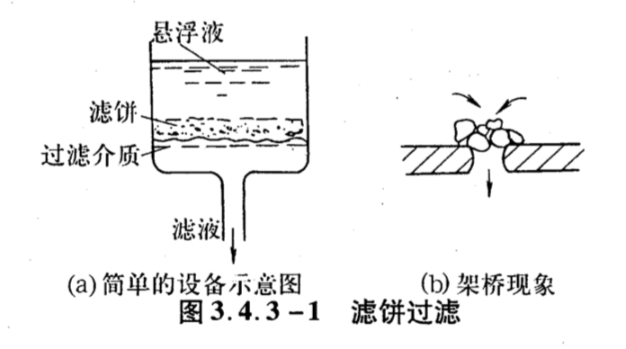
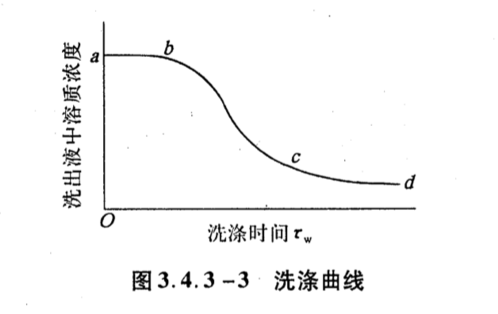
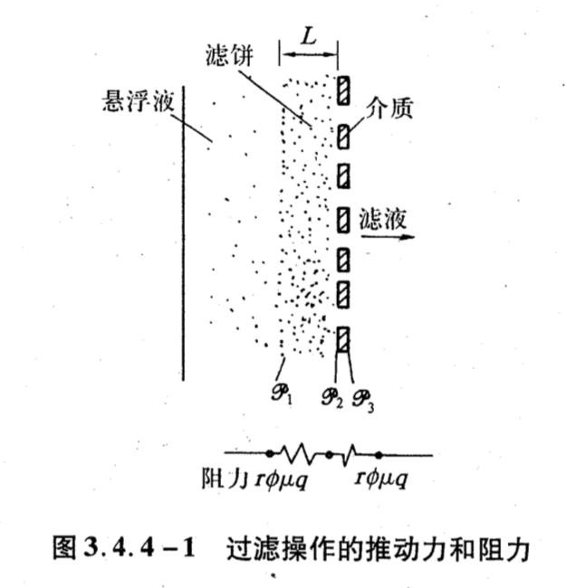
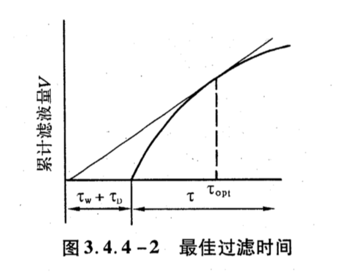

# 0304. 流体流动过程

## 3.4 流体通过颗粒层的流动

### 3.4.1 颗粒床层的特性

流体通过颗粒层的流动与普通管内流动相仿，都属于固体边界内部的流动问题。流体在颗粒层内的流动问题，却遇到边界条件复杂难以用方程式加以表述的困难。

颗粒层内的流体通道是由大量尺寸不等、形状也不规则的固体颗粒随机堆积而成的，具有复杂的网状结构。这样复杂通道的描述应从组成通道的颗粒的特性着手。

#### 3.4.1.1 单颗粒的特性

对颗粒层中流体通道有重要影响的单颗粒特性主要是颗粒的大小（体积）、形状和表面积。

1）球形颗粒。

球形颗粒存在以下两个关系：
 
2）非球形颗粒。

工业所遇的固体颗粒大多是非球形的。通常试图将非球形颗粒以某种当量的球形颗粒代表，以使所考察的领域内非球形颗粒的特性与球形颗粒等效，这一球的直径称为当量直径。根据不同方面的等效性，可以定义不同的当量直径。

综上所述，对球形颗粒，以一个参数即颗粒直径 dp 便可唯一地确定其体积、表面积和比表面积；对非球形颗粒，则必须定义两个参数才能确定其体积、表面积和比表面积。通常定义体积当量直径 dev（以下为方便起见简写为 de）和形状系数 ψ，此时：

#### 3.4.1.2 颗粒群的特性

在任何颗粒群中，形成一定的粒度分布。可以考察粒子的分布函数和频率函数曲线。

### 3.4.2 流体通过固体床的压降

### 3.4.3 过滤原理及设备 

#### 3.4.3.1 过滤原理

过滤是将悬浮液中的固-液两相有效地加以分离的常用方法，藉过滤操作可获得清净的液体或获得作为产品的固体物料。

过滤操作是利用重力或压差使悬浮液通过多孔性过滤介质，悬浮液中的固体颗粒被截留，滤液则穿过介质流出。

1）两种过滤方式。
 

 
1、滤饼过滤。

图 3.4.3-1 (a），是简单的滤饼过滤设备示意图，过滤时悬浮液位于过滤介质的一侧。过滤介质常用多孔织物。在过滤操作初始阶段，会有部分颗粒进入过滤介质网孔中发生架桥现象（图 3.4.3-1b），也有少量颗粒穿滤而混于滤液中。随着滤渣的逐步堆积，在介质上形成了一个滤渣层，称为滤饼。不断增厚的滤饼才是真正有效的过滤介质，而穿过滤饼的液体则变为清净的滤液。

2、深层过滤。

图 3.4.3-2 是深层过滤示意图。在深层过滤中，固体颗粒并不形成滤饼而是沉积于较厚的过滤介质内部。在惯性和扩散作用下，进入通道的固体颗粒趋向通道壁面并藉静电与表面力附着其上。深层过滤常用于净化含固量很少（颗粒的体积分数 < 0.1%）的悬浮液。

2）过滤介质。

工业操作使用的过滤介质主要有以下几种。

1、织物介质。由天然或合成纤维、金属丝等编织而成的滤布，它的价格便宜清洗及更换方便。此类介质可截留颗粒的最小直径为 5~65 μm。

2、多孔性固体介质。此类介质包括素瓷、烧结金属（或玻璃），或由塑料细粉粘结而成的多孔性塑料管等，能截留小至 1~3 μm 的微小颗粒。

3、堆积介质。

此类介质是由各种固体颗粒（砂、木炭、石棉粉）或非编织纤维（玻璃棉等）堆积而成，一般用于处理含固体量很少的悬浮液，如水的净化处理等。

此外，工业滤纸也可与上述介质组合，用以拦截悬浮液中少量微细颗粒。过滤介质的选择要根据悬浮液中固体颗粒的含量及粒度范围，介质所能承受的温度和它的化学稳定性、机械强度等因素来考虑。

3）滤饼的洗涤。

某些过滤过程需要回收滤饼中残留的滤液或除去滤饼中的可溶性盐，则在过滤过程结束时用清水或其它液体通过滤饼流动，称为洗涤。

在洗涤过程中，洗出液中的溶质浓度与洗涤时间的关系如图 3.4.3-3 所示。

图中曲线的 ab 段表示洗出液基本上是滤液，它所含的溶质浓度几乎未被洗涤液所稀释。滤饼空隙中 90% 的滤液在此阶段被洗涤液所置换，此称为置换洗涤。此阶段所需之洗涤液量约等于滤饼的全部空隙容积（εAL）。

曲线的 bc 段，洗出液中溶质浓度急骤下降。此阶段所用的洗涤液量约与前阶段相同。

曲线的 cd 段是滤饼中的溶质逐步被洗涤液沥取带出的阶段，洗出液中溶质浓度很低。洗涤终止时的溶质浓度应从经济角度加以确定。

图 3.4.3-3 所示的洗涤曲线、洗涤液用量和洗涤速率都应通过小型实验确定。

4）过滤过程的特点。

液体通过过滤介质和滤饼空隙的流动是流体经过固定床的一种实例。所不同的是，过滤操作中的滤饼厚度不断增加，在一定压差下，滤液通过速率随过滤时间的延长而减小，即过滤操作系一非定态过程。但是，由于滤饼厚度的增加是比较缓慢的，过滤操作可作为拟定态处理。

设过滤设备的过滤面积为 A，在过滤时间为 τ 时所获得的滤液量为 V，则过滤速率 u 可定义为单位时间、单位过滤面积所得的滤液量，即：

	u=dV/Adτ=dq/dτ

不难理解，在恒定压差下过滤，由于滤饼的增厚，过滤速率必随过滤时间的延续而降低，即 q 随时间 τ 的増加速率逐步趋于缓慢。对滤饼的洗涤过程，由于滤饼厚度不再增加，压差与速率的关系与固定床相同。

过滤计算的目的在于确定为获得一定量的滤液（或滤饼）所需的过滤时间。

#### 3.4.3.2 过滤设备

长期以来，为适应各种不同要求而发展了多种形式的过滤机，这些过滤机可按产生压差的方式不同而分成两大类。

1、压滤和吸滤。如叶滤机、板框压滤机、回转真空过滤机等

2、离心过滤。有各种间歇卸渣和连续卸渣离心机。

### 3.4.4 过滤过程计算

#### 3.4.4.1 过滤过程的数学描述

1）物料衡算。

对指定的悬浮液，获得一定量的滤液必形成相对应量的滤饼，其间关系取决于悬浮液中的含固量，并可由物料衡算方法求出。

通常表示悬浮液含固量的方法有两种，即质量分数（kg固体/kg悬浮液）和体积分数（m3固体/m3悬浮液）。对颗粒在液体中不发生溶胀的物系，按体积加和原则，两者的关系为：
 
2）过滤速率。

过滤操作所涉及的颗粒尺寸一般都很小，液体在滤饼空隙中的流动多处于康采尼公式适用的低雷诺数范围内。

由过滤速率的定义式（3.4.3-1) 可知，即为某瞬时流体经过固定床的表观速度 u。由康采尼公式（3.4.2-1) 可得：

式（3.4.4-8) 中的分子 ∆P 是施加于滤饼两端的压差，可看作过滤操作的推动力，而分母可视为滤饼对过滤操作造成的阻力，故该式也可写成：

	过滤速率=过程的推力(∆P)/过滤的阻力(rΦµq)

图 3.4.4-1 表示过滤操作中推动力和阻力的情况。滤液通过过滤介质同样具有阻力，过滤介质阻力的大小可视为通过单位过滤面积获得某当量滤液量 qe 所形成的虚拟滤饼层的阻力。

	K=2∆P/rΦµ

∆P 滤液是过滤饼和过滤介质总压差，K 和 qe 称为过滤系数。考虑滤饼和过滤介质总推动力和阻力，速率方程由式（3.4.4-8）可得：

式（3.4.4-10）称为过滤速率基本方程。它表示某一瞬时的过滤速率与物系性质、操作压差及该时刻以前的累计滤液量之间的关系，同时亦表明了过滤介质阻力的影响。

由式（3.4.4-9）可知，K 值与悬浮液的性质及操作压差 ∆P 有关。显然对指定的悬浮液，只有当压差不变时 K 值才是常数。常数 r 反映了滤饼的特性，称为滤饼的比阻。

由式（3.4.4-7）可知，比阻 r 表示滤饼结构对过滤速率的影响，其数值反映过滤的难易程度。不可压缩滤饼的比阻 r 仅取决于悬浮液的物理性质；可压缩滤饼的比阻 r 则随操作压差的增加而加大，一般服从如下的经验关系：

#### 3.4.4.2 间歇过滤的滤液量与过滤时间的关系

过滤过程的典型操作方式有两种：

1、在恒压差、变速率的条件下进行，称为恒压过滤；

2、在恒速率、变压差的条件下进行，称为恒速过滤。

1）恒速过滤方程。

用隔膜泵将悬浮液打入过滤机是一种典型的恒速过滤。

此时，过滤速率之为一常数，由式（3.4.4-10) 可得：

式（3.4.4-13) 和式（3.4.4-14) 为恒速过滤方程。

2）恒压过滤方程。

在恒定压差下，K 为常数。若过滤一开始就是在恒压条件下操作，由式（3.4.4-10) 可得：

此两式表示了恒压条件下过滤时累计滤液量 q（或 V）与过滤时间 τ 的关系，称为恒压过滤方程。

#### 3.4.4.3 洗涤速率与洗涤时间

当滤饼需要洗涤时，单位面积洗涤液的用量 qw 需由实验决定。在洗涤过程中滤饼不再增厚，洗涤速率为一常数，从而不再有恒速与恒压的区别。

1）叶滤机的洗涤速率。

此类设备中洗涤液流经滤饼的通道与过滤终了时滤液的通道相同。洗涤液通过的滤饼面积亦与过滤面积相等，故洗涤速率（dq/dτ）可由式（3.4.4-10) 计算，即：

实际操作中洗涤液的流动途径可能因滤饼的开裂而发生沟流、短路，由式（3.4.4-18）计算的洗涤速率只是一个近似值。

2）板框压滤机的洗涤速率。

板框压滤机在过滤终了时，滤液通过滤饼层的厚度为框厚的一半，过滤面积则为全部滤框面积之和的两倍。但在滤渣洗涤时，洗涤液将通过两倍于过滤终了时滤液的途径，故洗涤速率应为式（3.4.4-17) 计算值的 1/2，即：

式中 qw 为单位洗涤面积的洗涤液量。但应注意，此时的洗涤面积仅为过滤面积的一半，故用同样体积的洗涤液，此种板框压滤机的洗涤时间为叶滤机的四倍。当洗涤液与滤液粘度相等、操作压强相同时，板框压滤机的洗涤时间为：

#### 3.4.4.4 过滤过程的计算

过滤计算可分为设备选定之前的设计计算和现有设备的操作状态的核算两种类型。

1）设计计算。

在设计问题中，设计者应首先进行小型过滤实验以测取必要的设计数据，如过滤常数 qe、K 等，并为过滤介质和过滤设备的选型提供依据。然后由设计任务给定的滤液量 V 和过滤时间 τ，选择操作压强 ∆P，计算过滤面积 A。

2）操作型计算。

在操作型计算中，则是已知设备尺寸和参数，给定操作条件，核算该过程设备可以完成的生产任务；或已知设备尺寸和参数，给定生产任务，求取相应的操作条件。

1、间歇式过滤机的生产能力。

已知过滤设备的过滤面积 A 和指定的操作压差 ∆P，计算过滤设备的生产能力，这是典型的操作型问题。叶滤机和压滤机都是典型的间歇式过滤机，每一操作周期由以下三部分组成。

a）过滤时间 τ

b）洗涤时间 τw

c）组装卸渣及清洗滤布等辅助时间 τd

一个完整的操作周期所需的总时间为：

过滤时间及洗涤时间的计算方法如前文所述，辅助时间须根据具体情况而定。间歇过滤机的生产能力，即单位时间得到的滤液量为：

对恒压过滤，过分延长过滤时间 τ 并不能提高过滤机的生产能力。

由图 3.4.4-2 可知，过滤曲线上任何一点与原点 O 连线的斜率即为生产能力。显然，对一定洗涤和辅助时间（τw+τd），必存在一个最佳过滤时间 ropt，过滤至此停止，可使过滤机的生产能力 Q（即图中切线的斜率）达最大值。这是设备操作最优化的课题。

2、回转真空过滤机的生产能力。

回转真空过滤机是在恒定压差下操作的。设转鼓的转速为 ns-1，转鼓浸入面积占全部转鼓面积的分率为 Ψ，则每转一周转鼓上任何一点或全部转鼓面积的过滤时间为：

	τ=Ψ/n

这样就把真空回转过滤机部分转鼓表面的连续过滤转换为全部转鼓表面的间歇过滤，使恒压过滤方程依然适用。

将式（3.4.4-15) 改写成：

设转鼓面积为 A，则回转真空过滤机的生产能力（单位时间的滤液量）为：

若过滤介质阻力可略去不计，则上式可写成：

此式近似的表达了诸参数对回转真空过滤机生产能力的影响。

3、离心机的生产能力。

沉降分离时固体颗粒处于重力场中。在离心力场中，单个球形颗粒在粘性液体中或低粘度悬浮液中受离心力作用沿径向的沉降过程与重力场中的沉降过程相似，沉降的初始阶段仍有极短的加速过程，当颗粒所受的离心力等于阻力时，作用力与阻力处于随遇平衡状态，颗粒的沉降速度随所处半径的增加而增大。固体颗粒的离心沉降速度公式为：