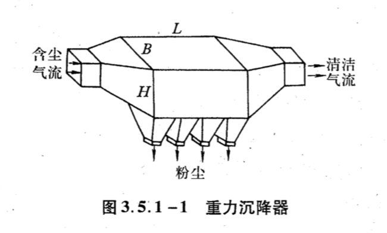
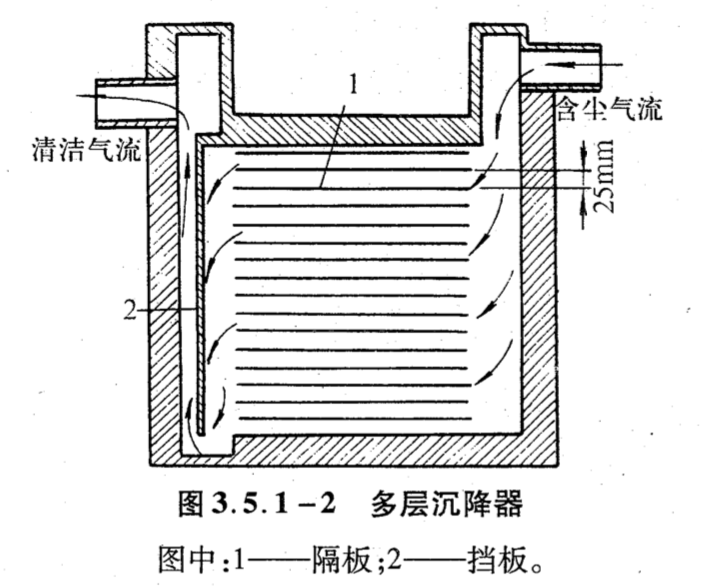
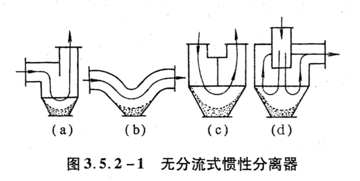
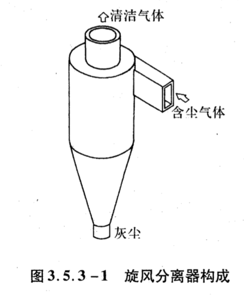
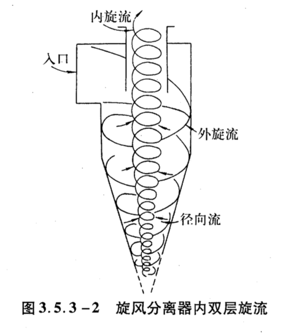
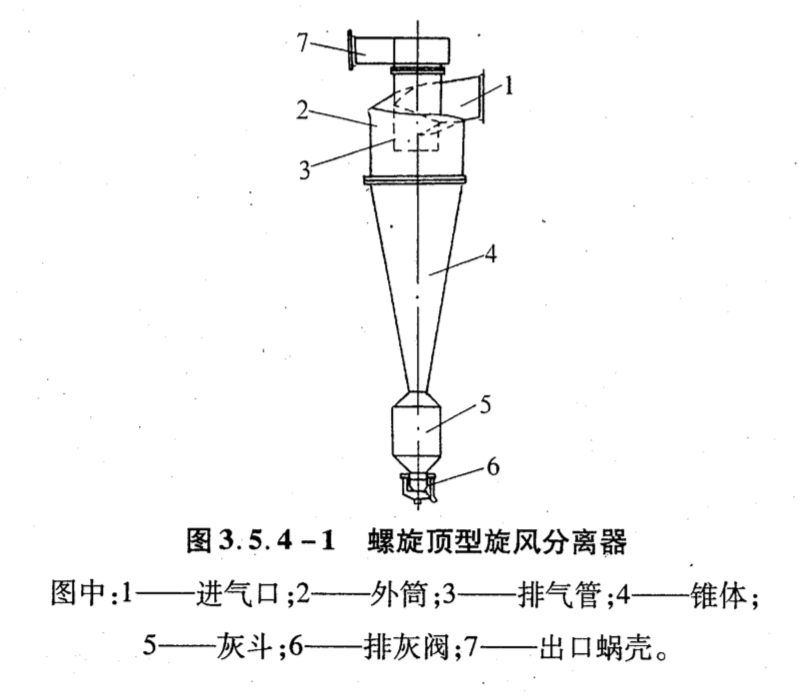
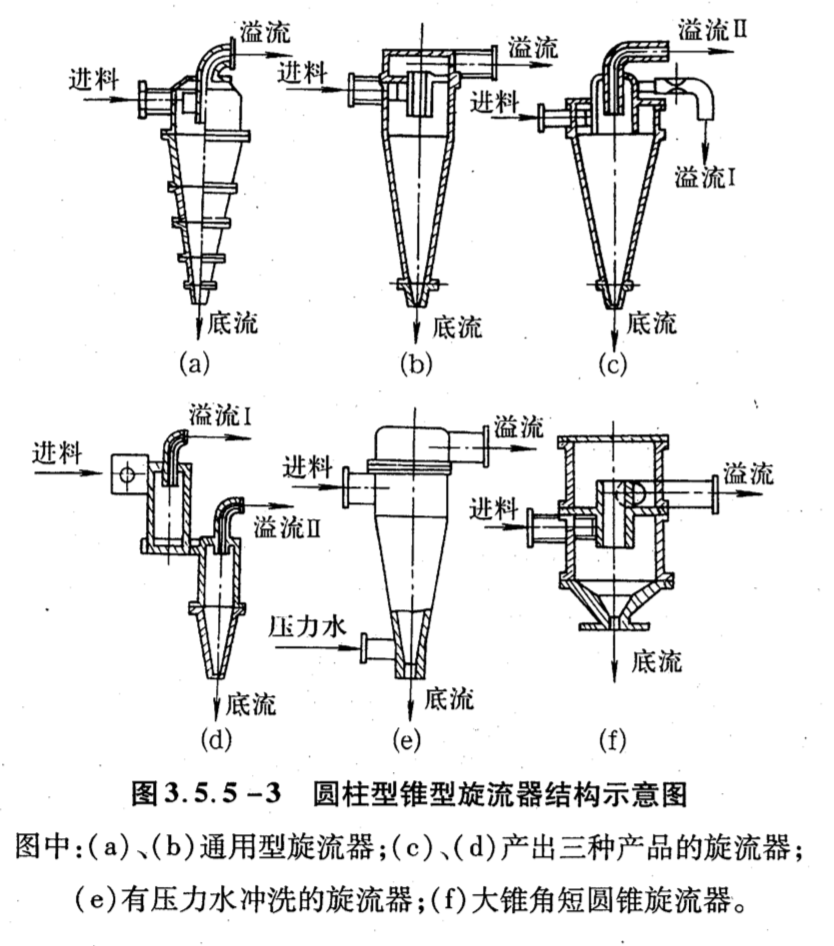

# 0305. 流体流动过程

## 3.5 颗粒的沉降与输送

机械力分离方法主要有三种，即：重力沉降、惯性分离及旋风分离，是工业上应用最广泛的方法。

### 3.5.1 重力沉降器

重力沉降器是一种只依靠颗粒在重力场中发生的沉降作用而将颗粒从气流中分离出来的设备。它的典型结构见图 3.5.1-1 所示。

#### 3.5.1.1 重力沉降器的分离效率

图 3.5.1-1 所示的重力沉降器内，设入口含尘气流颗粒沿入口截面上是均匀分布的，进人沉降器后，气速变小，一般属于层流范围，颗粒则在重力场作用下逐渐沉降下来，积集下来，积集在器的下部而被除走。在层流条件下，可假设颗粒在横截面上没有返混，应为塞流分离模型。对于某个粒径为，的颗粒而言，向器的下部移动的速度就是该颗粒的终端沉降速度，与路径无关。气速也沿长度方向无变化，于是可推得其粒级效率为：。。。。

由上式可知，要提高细颗粒的捕集效率，应尽量减少气速 υ 和沉降器高度 H，尽量加大沉降器宽度 B 和长度 L，但这样所需设备就会过于庞大，并不经济。为克服这个缺点，可在沉降室内加水平隔板，做成如图 3.5.1-2 所示的多层沉降器。

于是，对每一格而言，有效沉降高度将变为 H/(n+1)，这时粒级效率就可提高 (n+1) 倍，n 为水平隔板数目。但隔板上沉降下来的粉尘很难清除，气速稍大，就会再次扬起。一般常选用气速为 0.3~3m/s，对密度小的轻颗粒应尽量选用较低的气速。

#### 3.5.1.2 重力沉降器的压降

一般重力沉降器的压降很小，在几十帕左右，而且主要损失是在入口处，所以可将入口做成喇叭形或设置气流分布板以减少涡流损失。

### 3.5.2 惯性分离器

在惯性分离器内，主要是使气流急速转向，或冲击在挡板上再急速转向，其中颗粒由于惯性效应，其运动轨迹便会偏离气流，从而获得分离。气流速度高，这种惯性效应就大，所以分离器的体积不太大，可捕集到 30~40 μm 的颗粒。

#### 3.5.2.1 惯性分离器的结构型式

要使含尘气流急速转向，大体上有两类：

1、无分流式惯性分离器。如图 3.5.2-1 几种实例，入口气流作为一个整体，依靠较大的转折，使颗粒在惯性效应下分离出来。结构简单，但分离效率不高。

2、分流式惯性分离器。为使气流都有同样的较小回转半径及较大回转角，可以采用各种挡板结构，最简单的是图 3.5.2-2 所示的百叶窗式挡板。提高气流在急刷转折前的速度，可以有效地提高分离效率；但如果过高，又会引起已捕集颗粒的二次飞扬，故一般多选 用12~15m/s 左右。百叶挡板的尺寸对分离效率也有影响。

#### 3.5.2.2 惯性分离效率的计算模型

惯性分离器内气流速度较大，有可能属于湍流范围，故可以考虑有两种基本计算模型，即横混模型和塞流模型。若判定是湍流流动，则一般可采用横混模型。将图 3.5.2-1 的惯性分离器化简成图 3.5.2-3 的计算模型，并假设气流速度分布服从自由涡分布；而颗粒的径向速度，可根据半径方向上的简化的单颗粒运动方程推得为：

### 3.5.3 旋风分离的基本原理

含有颗粒的气体在作高速旋转运动时，其中的颗粒所受到的离心力要比重力大几百倍到几千倍，所以可大大地提高其分离效率，能分离的最小颗粒直径可到 5 μm 左右。在气-固两相分离工程中，应用最广泛的是旋风分离器。它的结构简单，单位处理气量所需的体积很小，造价低，维护方便，又可耐高温到 1000 C，耐高压到 50 MPa，也可适用于含尘浓度很高的情况。但它的压降一般较高，对于小于 5 μm 细颗粒的分离效率不高。

旋风分离器的结构型式很多，最典型的结构型式示见图 3.5.3-1，它由切向入口，圆筒及圆锥体形成的分离空间、净化气排出及捕集颗粒的排出等几部分组成。各部分的结构有很多型式，从而组成了各种型式的旋风分离器，但它们的气固两相分离原理都是一样的，只是性能上有差异以适应各种不同的用途。

#### 3.5.3.1 旋风分离器内的气流运动

旋风分离器内是三维湍流的强旋流，在主流上还伴有许多局部二次涡。主流是双层旋流，如图 3.5.3-2 所示。外侧是向下旋转，中心是向上旋转，但旋转方向是相同的。

1、切向速度 ut。在旋风分离器内切向速度占主导地位，由它带动颗粒作高速回转运动，在离心效应下被甩向器壁处而被分离出来，所以切向速度增大，分离效率会提高。它的典型分布特点，分成内外两层旋流。外旋流是准自由涡，内旋流是准强制涡，一般可用下列公式表达：。。。。内外旋流的分界处有最大的切向速度 utm，分界点半径 rt，主要取决于排气管的下口半径 rr，与轴向位置的关系不大，一般为 rt=(0.65~0.8)rr。

2、轴向速度 u2。旋风分离器内的轴向速度不仅沿径向上的分布较复杂，而且沿轴向上的变化也很大，轴对称性不如切向速度，外侧是下行流，内侧是上行流。外侧下行流的气量沿轴向向下逐渐变小，约有 15%~40% 进入灰斗，沉降于灰斗内后再从中心返回到旋风分离器内。这时，总会夹带一部分细颗粒进入中心向上气流中，对分离是很不利的。

3、径向速度 ur。旋风分离器内的径向速度一般要比切向速度小一个数量级，大部分是向心的，只在中心涡核处才有小部分的向外的径向流。

4、静压 P。在强旋流中，一般静压主要取决于切向速度，可近似表达为：。。。。随半径的缩小而急剧降低，中心涡核处静压远低于入口处静压，而且也低于排气管内平均静压，也使灰斗内平均静压低于入口处静压。当旋风分离器在负压下操作时，若灰斗密封不好，将使分离效率急剧变小。

5、局部二次流。除上述主流外，还有几处局部二次流，主要的有环形空间的纵向环流、排气管下口附近的短路流、排尘口附近的偏流都大大降低分离效率。

#### 3.5.3.2 旋风分离机理

由于旋风分离器内颗粒运动的复杂性与随机性，迄今尚无准确可靠能反映各种影响因素的分离理论，各国学者采用不同的简化假设，提出了不同的假说，主要有：1）平衡轨道假说。2）横混假说。一般而言，较细的颗粒采用横混假说较为合理，而较粗的颗粒则似乎更接近于平衡轨道假说。

### 3.5.4 切流式旋风分离器的结构与设计

旋风分离器的类型很多，但以图 3.5.3-1 所示的切向入流式的为最常用，其研究工作也较系统。

#### 3.5.4.1 切流式旋风分离器的典型结构与应用

下面介绍两种国内外常用的结构型式。

1、螺旋顶型旋风分离器。为了消除顶板下的「顶灰环」，可将顶部做成如图 3.5.4-1 所示的螺旋状。美国 Ducon 公司曾在炼油厂催化裂化装置内成功地应用此种型式来回收昂贵的催化剂。国内类似的型式称为 CLG 型，是由北京市劳动保护科研所研制，可适用于 2 t/h 以下的小型燃煤锅炉。

2、通用型旋风分离器。最简单的结构是平顶及矩形截面入口组成的通用型旋风分离器，为了提高效率，一般采用较长的锥体或较大的高径比，并根据不同的性能要求而采用不同的进出口面积比。一般入口可分为直切式及蜗壳式两种。蜗壳采用渐开线形状，常用 90° 及 180° 蜗壳。我国西安治金建筑学院开发的 CZT 型就是一种长锥体结构，入口矩形的高宽比也较大。石油大学等开发的 PV 型则采用 180°蜗壳，高径比较大。美国 Emtrol 公司的旋风分离器为 90° 蜗壳及直切入口两种，高径比也较大。欧洲各国大多采用直切入口结构。典型的举例示于表 3.5.4-3。

#### 3.5.4.2 影响旋风分离器性能的因素

掌握各种因素对旋风分离器性能的影响规律，对于正确选用、设计、制造、操作与维护旋风分离器是十分重要的。这些影响因素大体可分为三大类——结构参数、操作条件与制造安装质量。详细分析读者可参考有关设计资料。

### 3.5.5 旋流器

旋流器由于构造简单、设备费用低、占地面积小、处理能力大而广泛应用于化工、治金、环保、选矿、制药等工业部门，但进料用泵的动能消耗大、内壁磨损大、操作稳定性差、进料浓度和流量的变化很易影响分离性能。

#### 3.5.5.1 旋流器的结构

旋流器是由圆柱筒和圆锥筒组成的容器，如图 3.5.5-1 所示，既可作分级也可作分离用。悬浮液由进料管沿切线进入圆筒部分，形成旋流如图 3.5.5-2 所示。外层为下降旋流，内层为上升旋流。下降旋流中的粗粒在离心力作用下向器壁方向运动的同时并被下旋流集聚到下方出口，形成底流浓浆排出。细粒部分被上升内旋流挟带经溢流管排出。旋流器内流体的运动是三维速度场，由于切向速度对分离的影响较大，研究者较多，提出了不少计算式，但用得较多的是谢菲尔德和列波尔提出的计算切向速度的公式：。。。。

旋流器的结构形式主要为圆柱圆锥组合形式，也有由单锥或单圆筒组成。圆柱圆锥型旋流器的结构示意图见图 3.5.5-3。按用途不同而在结构上的区别在于：圆柱部分长度、锥体角度大小、进料管结构、底流管结构、有无压力水冲洗装置等。

#### 3.5.5.2 旋流器的尺寸

旋流器的常用尺寸范围如表 3.5.5-1 所示。

#### 3.5.5.3 旋流器的性能

1、旋流器的操作性能范围如表 3.5.5-3 所示。
 
 
 
2、流量比 R。旋流器的底流流量 Qc 与进料流量 Q 的比值 R 称为流量比，它是直接影响操作性能的因素。R 值的大小主要取决于底流管径 Du 与溢流管径 De 的比值以及进料流量、压力、循环量等操作条件和溢流与底流排出口结构。以下公式供粗略估算用：。。。。

3、分级效率与分离中位径 d50。旋流器的分级效率是指小于临界直径 de 的颗粒的部分回收率（亦即级效率），主要是指中径 d50 的颗粒的尺寸大小。

4、处理能力和压力降。一定尺寸旋流器处理给定的料浆，则进料流量 Q 与进料口和溢流口之间的压力降的关系就是相互依赖的。提高压力降必然增大流量，反之亦然。除此之外，增大压力降还会导致中径 d50 变细、R 下降、总效率 Et 上升、底流浓度提高和溢流液澄清度提高。其关系式可用下列准数方程表示：。。。。