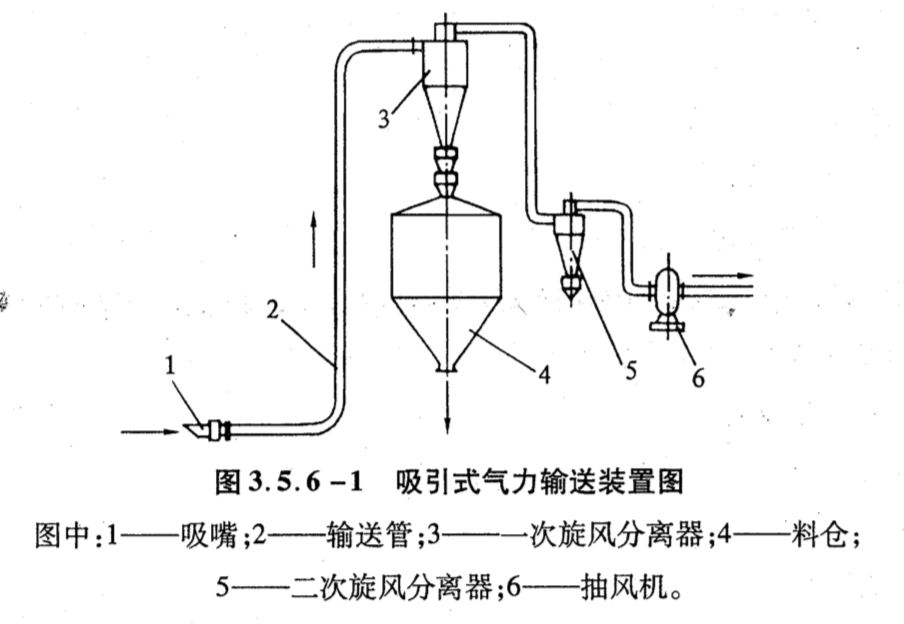
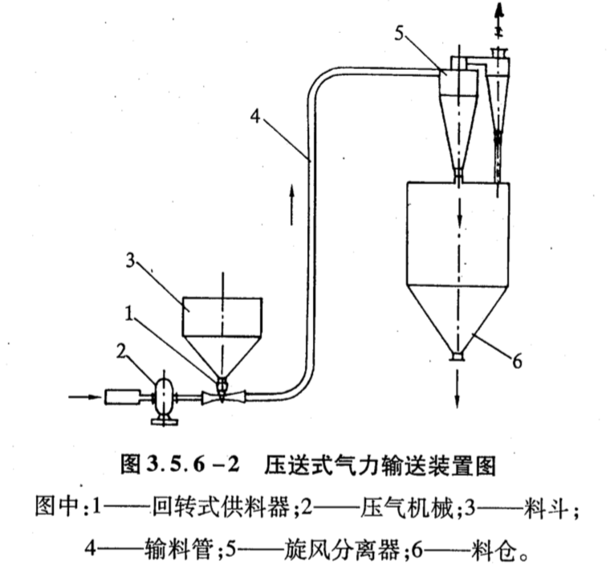
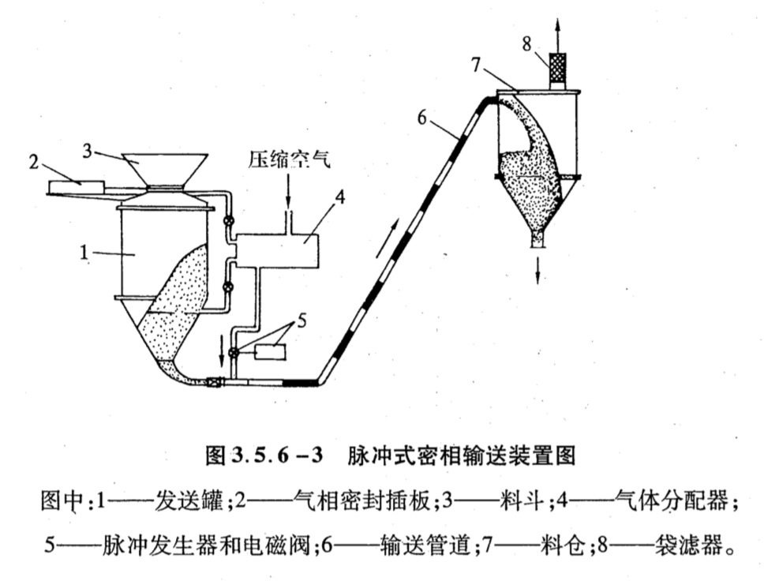
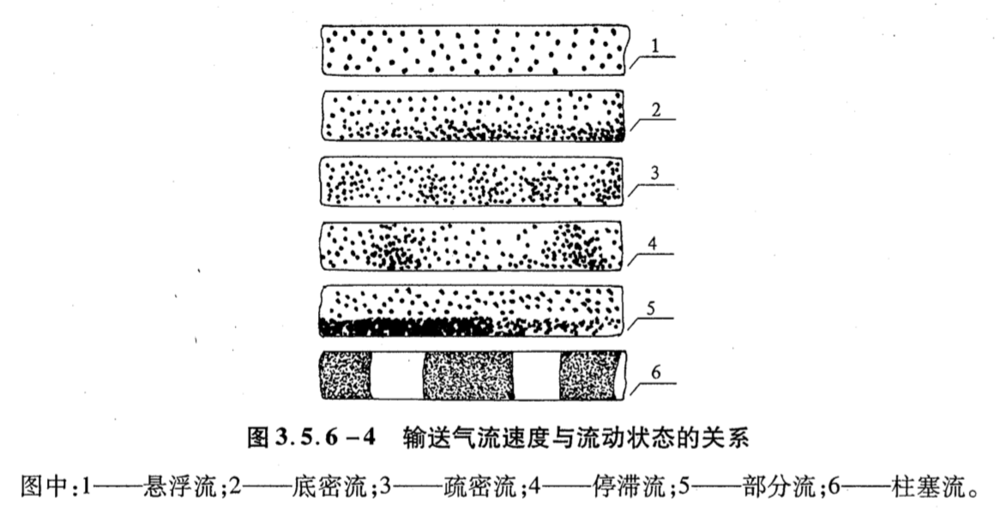

# 03 流体流动过程

## 3.5 颗粒的沉降与输送

### 3.5.6 气力输送 

#### 3.5.6.1 基本情况

利用气体在管内流动以输送粉粒状固体的方法称为气力输送。作为输送介质的气体最常用的是空气，但在输送易燃易爆粉料时，也可采用其它惰性气体。

气力输送方法从 19 世纪开始就用于港口码头和工厂内的谷物输送。因与其它机械输送方法相比较有许多优点，故气力输送在化工生产上的应用也日益增多。气力输送的优点是:

1. 系统密闭，避免了物料的飞扬、受潮、受污染，也改善了劳动条件。

2. 可在输送过程中（或输送终端）同时进行粉碎、分级、加热、冷却以及干燥等操作。

3. 占地面积小，可以根据具体条件灵活地安排线路。例如，可以水平、垂直或倾斜地装置管路。

4. 设备紧湊，易于实现连续化、自动化操作，便于同连续的化工过程相衔接.

但是，气力输送与其它机械输送方法相比也存在一些缺点，如动力消耗较大，颗粒尺寸受到一定限制（<30mm）；在输送过程中物料易于破碎；管壁也受到一定程度的磨损，不适于输送粘附性或高速运动时易产生静电的物料。

气力输送可以从不同角度加以分类：

1）按气流压强分类。

 1、吸引式。

输送管中的压强低于常压的输送称为吸引式气力输送。气源真空度不超过 10 kPa 的称为低真空式，主要用于近距离、小输送量的细粉尘的除尘清扫；气源真空度在 10~50 kPa 之间的称为高真空式，主要用在粒度不大、密度介于 1000~1500 kg/m3 之间的颗粒的输送。吸引式输送的输送量一般都不大，输送距离也不超过 50~100 m。

吸引式气力输送的典型装置流程如图 3.5.6-1 所示，这种装置往往在物料吸入口处设有带吸嘴的挠性管，以便将分散于各处的或在低处、深处的散装物料收集至储仓。这种输送方式适用于须在输送起始处避免粉尘飞扬的场合。

 

2、压送式。

输送管中的压强高于常压的输送称为压送式气力输送。按照气源的表压强也可分为低压式和高压式两种。

a）低压式气源表压强不超过 50 kPa。这种输送方式在一般化工厂中用得最多，适用于小量粉粒状物料的近距离输送。

b）高压式气源表压强可高达 700 kPa，用于大量粉粒状物料的输送，输送距离可长达 600~700 m，压送式气力输送的典型装置流程如图 3.5.6-2 所示。
 
 
 
2）按气流中固相浓度分类。

在气力输送中，常用混合比（或称固-气比）R 表示气流中固相浓度。所谓混合比，即单位质量气体所输送的固体质量，其表达式为：

	R=Gs/G

式中：

Gs——单位管道面积上单位时间内加入的固体质量，kg/ (s·m2)

G 一一气体的质量流速，kg/ (s·m2)

1、稀相输送。

混合比在 25 以下（通常 R=0.1~5） 的气力输送称为稀相输送。在稀相输送中，固体颗粒呈悬浮状态。目前在我国，稀相输送的应用较多。

2、密相输送。

混合比大于 25 的气力输送称为密相输送。在密相输送中，固体颗粒呈集团状态。

图 3.5.6-3 为脉冲式密相输送流程。一股压缩空气通过发送罐 1 内的喷气环将粉料吹松，另一股表压强为 150~300 kPa 的气流通过脉冲发生器 5，以 20~40 r/min 的频率间断地吹人输料管入口处，将流出的粉料切割成料栓与气栓相间的流动系统，凭藉空气的压强推动料栓在输送管道中向前移动。

密相输送的特点是低风量和高混合比，物料在管内呈流态化或柱塞状运动。此类装置的输送能力大，输送距离可长达 100~1000 m，尾部所需的气-固分离设备简单。由于物料或多或少呈集团状低速运动，物料的破碎及管道磨损较轻。目前密相输送已广泛应用于水泥、塑料粉、纯碱、催化剂等粉状物料的输送。

气力输送可在水平、垂直或倾斜管道中进行，所采用的气速和混合比都可在较大范围内变化，从而使管内气-固两相流动的特性有较大的差异，再加上固体颗粒在形状、粒度分布等方面的多样性，使得气力输送装置的计算目前尚处于试验阶段。以下着重讨论稀相输送。

#### 3.5.6.2 固体颗粒在水平管内的稀相输送

1）粒子在水平管内的运动状态。

输料管内粒子的运动状态，随着输送气流速度而显著变化。

图 3.5.6-4 表示按输送气流速度逐渐减小而将粒子运动状态进行分类的情况。

1、悬浮流。当输送气流速度较大时，粒子基本上接近均匀分布，在气流中呈悬浮状态而被输送，这种状态称为悬浮流。

2、底密流。粒子愈接近于下半部管壁，分布愈密，但没有出现停滯，这种现象称为底密流。这时固体粒子一面作不规则的旋转、碰撞，一面被输送。

3、疏密流。疏密流是粒子悬浮输送的极限状态。为疏密不均的流动，也有部分粒子在下部管壁滑动，但还没有停滯。

4、停滞流。气-固呈停滯流时，大部分粒子失去悬浮能力，停滞在下半部管壁的粒子在局部地区集聚在一起，使管截面局部变狭窄。因此，在该处的气流速度增大，在下一瞬间又把停滞的粒子群吹走。粒子就是这样停滞集聚和吹走互相交替、呈不稳定的输送状态。

5、部分流。部分流是指粒子堆积在下半部管壁，气流在上部流动时的情况。当输送气流过小时可见到部分流。堆积的粒子层表面，有部分粒子在气流作用下作不规则的移动。并且，堆积的物料层也随着时间作砂丘移动似的流动。

6、柱塞流。柱塞流是指堆积的物料层充满了输料管，靠空气的压强输送时的情况。

这些不同的流动状态也与粒子的物理性质有关。但是，对同一种物料，主要受气流速度的支配。可以认为：第 1~5 类的运动状态是靠气流的动能推动的，而第 6 类是靠气流的压强进行输送的。

2）水平输送时的最低气速（沉积速度）。

如前所述，当气速足够高时，粒子能作充分分散和悬浮着的流动。

估算沉积速度 uc 的方法如下：对于混合尺寸的粒子，根据物料筛分的最小粒径和最大粒径，分别用图 3.5.6-5 定出输送混合物中单个最大颗粒和单个最小颗粒时，所需的最低速度 XX 和 XX，同时，在此图上求出这两点连线的斜率 n。为安全计，应选择这两个速度中较大的值为以后计算的依据。

如果物料粒子尺寸是均一的，则由图 3.5.6-5 得到的即为输送单个颗粒所需的最低流速，而 n 即为该点切线的斜率，其余步骤同上。

#### 3.5.6.3 垂直管中稀相输送时的最低气速（噎塞速度）

于垂直管中进行向上的稀相输送时，在一定的固体负荷下，若气速足够高，则粒子也能充分分散地流动。噎塞速度是在垂直管中进行稀相输送的最低气速。噎塞发生的临界条件可用下式估算:

噎塞时的空隙率 E 几乎与粒径无关，而只取决于粒子的密度。其关系式如下：

#### 3.5.6.4 倾斜管中的最低气速

据研究，当管子与水平线的夹角在 10° 以内，或当管子与垂直线的夹角在 8° 以内时，其相应的 ucs 或 uch 没有显著的变化。研究者在试验中发现，当倾斜管与水平线的夹角在 22~45° 时，沉积速度比在水平管中的相应值高 1.5~3.0 m/s。

以上是从理论上计算各种情况下气力输送所需的最低气速-沉积气速与噎塞气速。实际上，气力输送所需的操作气速下限与粒子的物性、混合比、供料器的类型和构造、输料管内径和长度及配管方式等许多因素都有关系。

在气力输送装置中，一方面由于粒子之间及粒子与管壁之间存在着摩擦、碰撞或粘附作用，另一方面也由于在输料管中气体速度分布不均匀，存在着「边界层」。因此，理论计算所确定的最佳气速通常与实际采用的输送气速经验值并不一致。

关于稀相气力输送的压强降的计算及系统设计请参考相关技术资料。
