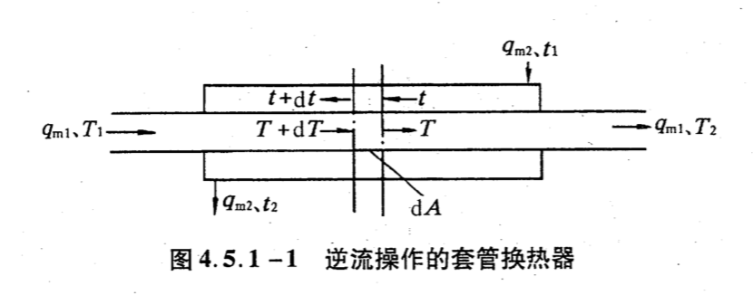
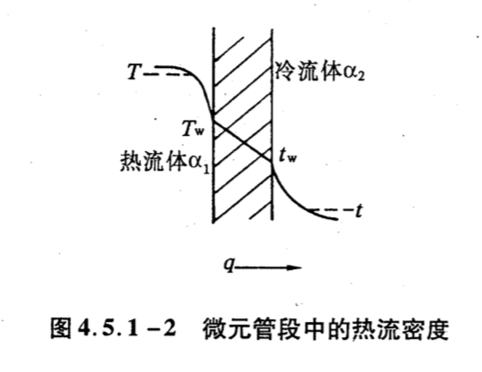
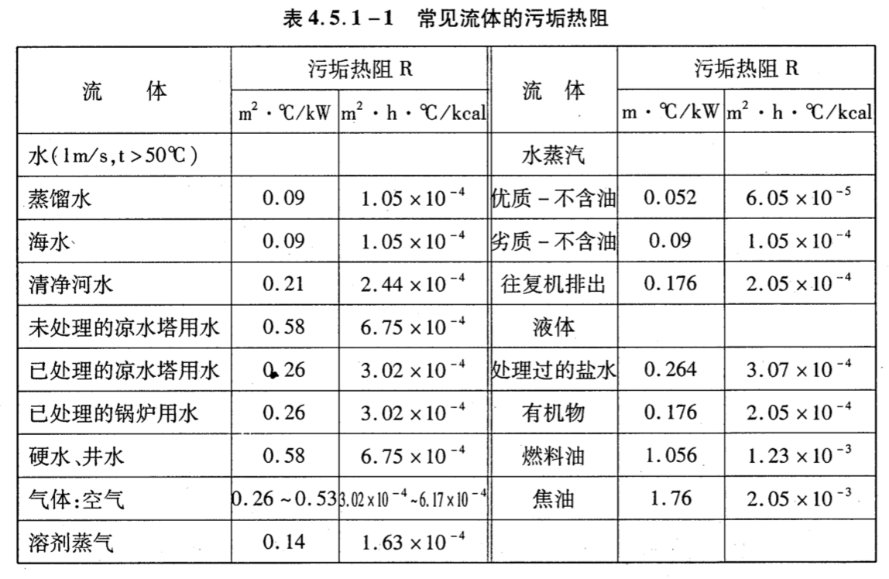

# 04 传热过程

## 4.4 辐射传热

### 4.4.1 热辐射的基本性质

任何物体，只要其绝对温度不为零度，都会不停地以电磁波的形式向外辐射能量；同时，又不断地吸收来自外界其它物体的辐射能。当物体向外界辐射的能力与其从外界吸收的辐射能不相等时，该物体与外界就产生热量传递。这种传热方式称为热辐射。

热辐射可以在真空中传播，无需要任何介质，即其换热无需在固体与固体或固体与流体间相互接触的情况下进行。这是热辐射与对流和传导的主要不同点。因此辐射传热的规律也不同于对流和传导。

固体和液体的热辐射与气体的热辐射不同，前者只发生在物体的表面层，而后者则深入到气体的内部。

从理论上说，固体可同时发射波长从 0 到 ∞ 的各种电磁波。但是，在工业上所遇到的温度范围内，有实际意义的热辐射波长位于 0.38 到 1000 um 之间，而且大部分能量集中于红外线区段的 0.76 到 20 um 范围内。

和可见光一样，当来自外界的辐射能投射到物体表面上，也会发生吸收、反射和穿透现象。假设外界投射到表面上的总能量 Q，其中一部分 Qa 进入表面后被物体吸收，一部分 Qr 被物体反射，其余部分 Qd 穿透物体。按能量守恒定律：

	Q=Qa+Qr+Qd

公式两边同时除以 Q：

	a+r+d=1

式中 a 为总能量中被吸收的分率称为吸收率，r 为反射的分率称为反射率，d 为透过的分率称为穿透率。

自然界所有的物体（气、液、固）的吸收率 a、反射率 r、穿透率 d 的数值都在 0 到 1 之间。并把 a=1 的物体称为绝对黑体（简称为黑体）；r=1 的物体称为镜体（漫反射时称为白体）；d=1 的物体称为绝对透明体（简称为透明体）。黑体、镜体、透明体都是假定的理想物体。

### 4.4.2 固体辐射

#### 4.4.2.1 黑体的热辐射

黑体是为了研究热辐射现象的方便而假想的物体。它是一个完全的吸收体，不论投入射线的波长范围及投射的角度如何，它都能把投入的射线完全吸收；黑体也是一个完全的辐射体，即它能够发射最多的辐体能。实际物体只能或多或少地接近于黑体。

理论硏究证明，黑体的辐射能力，即单位时间单位黑体表面向外界辐体的全部波长的总能量，服从下列 Stefan- Boltzmann 定律，可表示为：

Stefan- Boltzmann 定律表明黑体的辐射能力与其绝对温度的四次方成正比，亦称为四次方定律。其表明辐射传热对温度异常敏感，低温时热辐射往往可以忽略，而高温时则往往成为主要的传热方式。

#### 4.4.2.2 实际物体的辐射能力和吸收能力

实际物体在一定温度下的辐射能力（以 E 表示）恒小于同温度下黑体的辐射能力 Eb。不同物体在相同温度下的辐射能及辐射能按波长的分布规律各不相同当然也与同温度下的黑体不同。现把实际物体与同温度黑体的辐射能力的比值称为物体的黑度，以 ε 表示：

注意物体的黑度不单纯是颜色的概念，它表明物体的辐射能力接近于黑体的程度。物体的黑度不仅与物体的表面温度、而且与物体的种类、表面的状况有关。总之，物体的黑度只与辐射物体本身状况有关，是物体的一种性质，而与外界无关。

#### 4.4.2.3 灰体的辐射能力和吸收能力一 Kirchhoff 定律

任何实际物体只能部分吸收投入其上的辐射能，而且对不同波长的辐射能呈现出一定的选择性，即对不同波长的辐射能吸收的程度不同。

实际物体对投入辐射的吸收率不仅取决于物体本身的情况（物体的种类、表面温度、表面状况等），而且还与辐射物体的情况（即所辐射的波长）有关。因此实际物体的吸收率 a 比其黑度 ε 更为复杂。故如不对实际物体的吸收率作出恰当的估计，辐射传热就无法进行计算。

实验证明，对于波长在 0.76 到 20 um 范围内的辐射能，即工业上应用最多的热辐射，大多数材料和吸收率随波长的变化不大。根据这一实际情况，为避免实际物体吸收率难以确定的困难，可以把实际物体当成是对各种波长辐射能均能吸收的理想物体。这种理想物体称为灰体。

和实际物体一样，灰体的辐射能力可用黑度 ε 来表征，其吸收能力用吸收率 a 来表征。灰体的吸收率是灰体自身的特性。

Kirchhoff 从理论上证明，同一灰体的吸收率与其黑度在数值上必相等，即：

	a=ε

此式称为 Kirchhoff 定律。由此定律可以推知，物体的辐射能力越大其吸收能力也越大，即善于辐射者必善于吸收。此定律还可以说明，实际物体（可近似为灰体者）对任何投入辐射的吸收率均可用其黑度的数值，而黑度是可以通过实验加以测定。

实践证明，引入灰体的概念，并把大多数材料当作灰体处理，可大大简化辐射传热的计算而不会引起很大的误差。但须注意，不能把这种简化处理推广到太阳辐射的吸收。因太阳表面温度很高，在太阳辐射中波长较短（0.38 μm~0.76 μm）的可见光占 46%。物体的颜色对可见光的吸收呈现强烈选择性，故不能再作为灰体处理。根据黑度的定义，式（4.4.2-5）也可以表示为：

此式是 Kirchhoff 定律的另一种表达形式，它说明灰体在一定温度下的辐射能力和吸收率的比值，恒等于同温度下黑体的辐射能力。

#### 4.4.2.4 辐射换热计算

对于两块相距很近的黑体平行板的表面传热量，可以按式（4.4.2-2）取两物体辐射力之差，再乘以板面积 A 就可简单求出：

而对于两任意物体表面间的辐射换热计算要复杂得多。其一，是因为实际物体表面是非黑体，因而要引入一个修正系数一一系统黑度 ε12。如果材料的 ε 较大（ε≥0.8），则无论物体如何放置均可近似地取 ε12=ε1xε2。

此外，还应考虑物体由于受其大小、尺寸、形状及相互位置和距离等几何因素影响，致使所能接受的辐射能量的有效面积并不是其本身面积。其有效面积可取等于物体本身面积乘以角系数。

角系数是反映两物体相对位置、大小、形状等几何因素的量，它表示由表面 1 向各个方向发射出去的辐射能量到达表面 2 的百分数。

如果不考虑两物体之间的介质影响，假设两物体间是真空或是充满不参与热辐射的介质，可以允许热射线完全穿透，则任意物体两表面辐射换热的公式为：

#### 4.4.2.5 影响辐射传热的主要因素

 1）温度的影响由式（4.4.2-8）可知，辐射热流量并不正比于温差，而是正比于温度四次方之差。这样，同样的温差在高温时的热流量将远大于低温时的热流量。例如 XX 两者温差相等，但在其它条件相同情况下，热流量相差 16 倍多。因此，在低温传热时，辐射的影响总是可以忽略；在高温传热时，热辐射则不容忽视，有时甚至占据主要地位。

 2）几何位置的影响。

角系数对两物体间的辐射传热有重要影响，角系数决定于两辐射表面的方位和距离，实际上决定于一个表面对另一个表面的投射角（见图 4.4.2-3）。

3）表面黑度的影响。

由式（4.4.2-7）可以看出，当物体的相对位置一定，系统黑度只和表面黑度有关。因此，通过改变表面黑度的方法可以强化或减弱辐射传热。例如，为增加电气设备的散热能力，可在其表面上涂上黑度很大的油漆；而在需要减少辐射散热时，可在表面镀以黑度很小的银、铝等。

4）辐射表面之间介质的影响。

先前都假设两表面间的介质为透明体（d=1），实际上某些气体也具有发射和吸收辐射能的能力。因此，气体的存在对物体的辐射传热必有影响。

有时为削弱表面之间的辐射传热，常在换热表面之间插入薄板来阻挡辐射传热。这种薄板称为遮热板。

#### 4.4.2.6 辐射传热膜系数

尽管热辐射和对流给热遵循完全不同的规律，但在对流和热辐射同时存在的场合，常将辐射热流量用统一的牛顿冷却定律表示，辐射传热膜系数定义为：

### 4.4.3 气体辐射

气体辐射也是工业上常见的现象。在各种加热炉中，高温气体与管壁或设备壁面之间的传热过程不仅包含对流给热，而且还包含热辐热。高温设备对周围环境的散热，也是如此。严格来说，气体和固体表面之间一切传热过程都伴随有辐射传热，只是当温度不高时，辐射传热可以忽略而已。

在工业常遇的高温范围内，分子结构对称的双原子气体，如 O2、N2、H2、等可视为透明体，既无辐射能力，也无吸收能力。但是，分子结构不对称的双原子及多原子气体，如 CO、CO2、SO2、CH4 和水蒸汽等一般都具有相当大的辐射和吸收能力。

#### 4.4.3.1 气体辐射和吸收对波长有强烈的选择性

固体能够辐射和吸收各种波长的辐射能，而气体则不然。实验表明，气体只能辐射和吸收某些波长范围内的辐射能，例如水蒸汽只能辐射和吸收 2.5~2.84、5.6~7.6、12~30 um 三个波长范围的辐射能，对其它波长的能量则不能辐射也不能吸收。因此气体不能近似地作为灰体处理。

气体作为一种实际物体，其辐射能力 Eg 仍可用其黑度 εg 来表征。但气体的吸收能力不仅取决于本身情况，还与外来辐射的波长范围有关。所以，气体的吸收率 ag 不再与其黑度相等。为计算气体辐射过程，必须对特定的某外来辐射测定气体的吸收率，因此气体辐射过程的计算显得更为复杂。

#### 4.4.3.2 气体辐射是一个容积过程

热射线不能穿透固体，所以固体的辐射和吸收只能在表面上进行。因为是种表面过程，固体之间的辐射传热只与表面积的大小和表面特征有关。气体的穿透率 d 不为零，投射到气体表面的辐射能必进入气体内部，沿途被气体分子逐渐吸收。

另一方面，在气体界面上所感受到的气体辐射应是到达界面上的整个容积气体辐射的总和。因此，气体的辐射和吸收是在整个容积上进行的，必定与气体容积大小和形状有关。

气体辐射虽是一种容积过程，但其辐射能力同样定义为单位气体表面在单位时间内向半球空间各方向所辐射的总能量。在一定温度 Tg 下，气体的辐射能力 Eg 不仅取决于气体容积和形状，而且还与表面所处的位置有关。这是因为从各方向到达表面所处位置的射线行程不等的缘故。为避免上述麻烦，可通过实验对各种不同形状气体的不同表面位置测定其平均射线行程 L（可査有关资料），在缺少资料的情况下，各种几何形状的气体对整个表面的辐射能力的平均射线行程，可按下式估算：

## 4.5 传热过程

工业上大量存在的传热过程（指间壁式传热过程）都是有由固体内部的导热及各种流体与固体表面的给热组合而成。

### 4.5.1 传热过程的数学描述

在连续化的工业生产中，换热器内进行的大都是定态传热过程。

#### 4.5.1.1 热量衡算微分方程式

图 4.5.1-1 为一定态逆流操作的套管式换热器，热流体走管内，流量为 qm1；冷流体走环隙，流量为 qm2。冷、热流体的主体温度分别以 t 和 T 表示。在与流动垂直方向上取微元管段 dL，其传热面积为 dA。若所取微元处的局部热流密度为 q。则热流体通过 dA 传给冷流体的热流量为 dQ=qdA。

以微元体内内管空间为控制体作热量衡算，并假设：

1. 热流体流量 qm1 和比热 Cp 沿传热面积不变；

2. 热流体无相变化；

3. 换热器无热损失；

4. 控制体两端面的热传导可以忽略（因轴向温度梯度很小，此假定基本符合实际）。

可以得到下式：

	qm1·Cp1·dt=qdA

同样，对冷流体作类似假定，并以微元体内环隙空间为控制体作热量衡算，可得到：

#### 4.5.1.2 传热速率方程式

热流密度 q 是反映具体传热过程速率大小的特征量。从理论上讲，热流密度 q 已可以计算。

但是，这种做法必须引入壁面温度；而在实际计算中，壁温往往是未知的。为实用方便，希望能避开壁温，直接根据冷、热流体的温度进行传热速率的计算。

在图 4.5.1-1 所示的套管换热器中，热量序贯地由热流体传给管壁内侧，再由管壁内侧传至外侧，最后由管壁外侧传给冷流体（见图 4.5.1-2）。

上式为传热过程总热阻的倒数，称为传热系数。

由此可知，传热膜系数 α 同流体与壁面温差相联系，而传热系数 K 则同冷、热流体的温差相联系。因此，根据式（4.5.1-6）由壁面两侧的传热膜系数 a 求出传热系数 K，可避开未知的壁温计算热流密度。

#### 4.5.1.3 传热系数和热阻

由式（4.5.1-4）可知，传热过程的热阻 1/K 系由各串联环节的热阻叠加而成，原则上减小任何环节的热阻都可以提高传热系数，增大传热过程的速率。

但是，当各环节的热阻 1/a1、b/A、1/a2 具有不同数量级时，总热阻 1/K 的数值将主要由其中最大热阻所决定。由此可见，在串联过程中可能存在某个控制步骤。故在考虑传热过程强化时，必须着力减少控制步骤的热阻。同样，在设计计算时应尽量准确地确定控制步骤的热阻或 α 值，并取足够的安全系数。

在式（4.5.1-4）的推导过程中，忽略了管壁内、外表面积的差异。实际上，由于管壁内、外表面积不同，两处的热流密度亦不等。

式中：K1、K2 分别为以内、外表面积为基准的传热系数。

显然，以内、外表面积为基准的传热系数是不相等的。如圆管的内、外直径分别为 d1、d2 表示，则可导出：

式中 dm 为 d2 与 d1 的对数平均值，在 d2/d1≤2 时可用算术平均值代替。

在传热计算中，用内表面或外表面作为传热面积计算结果相同，但工程上习惯以外表面作为计算的传热面积。当管壁不太厚，则传热系数仍可按式（4.5.1-6）计算：

#### 4.5.1.4 污垢热阻

以上推导过程中，未计及传热面污垢的影响。实践证明，表面污垢会产生相当大的热阻，在传热过程计算时，污垢热阻一般不可忽略。

但是，污垢层的厚度及其导热系数无法测量，故污垢热阻只能根据经验数据确定。表（4.5.1-1）给出某些工业上常见流体的污垢热阻的大致范围以供参考。

如管壁冷热流体两侧的污垢热阻分别用 R2 和 R1 表示，则传热系数可由下式计算：

#### 4.5.1.5 壁温计算

1）计算壁温的意义。

1. 据此确定定性温度。

2. 在自然对流、沸腾和冷凝等传热膜系数计算中，均需先假定壁温，试算后再作校核。

3. 据此决定是否需要设置热补偿装置，以及计算温差应力之大小。

4. 有些场合下，壁温过高，易引起物料变质或烧焦；相反壁温过低，有时又会使物料凝固或冷凝，这在设计中都应加以避免。

5. 在高温高压下，正确计算壁温，有助于选用较适宜的材料与操作条件，以免损坏设备。

6. 热损失计算中，也须先知壁面温度。

2）壁温计算。
 
其中包括三个方程式，原则上可以解出热流密度及两侧壁温 Tw、tw。由此式还可以看出，在传热过程中热阻大的环节其温差也必然大。金属壁的热阻通常可以忽略，即 Tw≈tw，于是得：
 
此式表明，传热面两侧温差之比等于两侧热阻之比，壁温 Tw 必接近于热阻较小或传热膜系数较大的流体温度。
 
####  4.5.1.6 传热过程基本方程式
 
1）有效平均温差法。

1、传热过程的积分表达式。

随传热过程的进行，冷流体温度逐渐上升而热流体温度逐渐下降，故换热器各截面上的热流密度是变化的。为计算换热器的总热流量，或计算传递一定热流量所需要的传热面积，须将式（4.5.1-1）或式（4.5.1-2）沿整个传热面积分。将热流密度计算式：

假定传热系数在整个传热面上保持不变，将以上两式积分。实际流体的物性随温度而变，严格说来 K 保持不变的假定难以满足。但在普通换热器的温度变化范围内，取平均温度下流体的物性计算传热系数 K，并把它作为常数，这在工程计算上是允许的。

2、传热基本方程式。

经分析和推导，得到传热过程基本方程式：

3、对数平均推动力。

在传热过程中，冷热流体的温度差沿加热面连续变化的。但由于此温度差与冷、热流体温度成线性关系，故可用换热器两端温差的某种组合（即对数平均温差）来表示。

对数平均推动力恒小于算术平均推动力，特别是当换热器两端推动力相差悬殊时，对数平均推动力要比算术平均推动力小得多。当换热器一端两流体温差接近于零时，对数平均推动力将急剧减小。对数平均推动力的这一特性，对换热器的操作有着深刻的影响。

例如，当换热器两端温差有一个为零时，对数平均温差必为零。这意味着要传递相应的热流量，需要无限大的传热面。但是，当两端温差不大时，如相差小于 2 时，对数平均推动力可用算术平均推动力代替，这样造成的差不到 4%。

此式在 ≤10 的条件下，误差小于 1%。甚至在换热器实际设计中几乎碰不到的 =20，该式的误差都很少大于 2%。故此式可用于工程设计。

在冷、热流体进出口温度相同的条件下，并流操作两端推动力相差较大，其对数平均值必小于逆流操作。因此，就增加传热过程推动力△tm 而言，逆流操作总是优于并流的。

式（4.5.1-15）对逆流操作时，可写成如下形式：

3、对数平均温差的修正。

以上列出的对数平均温差 △tm 仅适用于并流或逆流的情况。当采用多管程或多壳程时，管壳式换热器内的流动形式复杂，平均推动力的计算式相当繁复。各种流动形式的平均推动力可先按纯并流或逆流求出对数平均温差△tm，然后乘以温差校正系数 Fr。

并流或逆流换热器，以及两流体中有一种流体的温度固定不变时（如冷凝、沸腾）即是复杂的折流换热器，Fr=1；其余情况，Fr 均小于 1。各种流动方式下的温差校正系数，可根据 R、P 两个参数从相应的各种流动形式的线图上査得。

设计时，不应使 Fr 小于 0.8。一方面经济上不合理，另一方面当 Fr 值在 0.7 左右时，如果操作温度略有变化时，Fr 值就可能急剧降低，这样将影响操作的稳定性。因此，当 Fr 小于 0.8 时，应该增加管程数或壳程数，或者用几个换热器串联，必要时亦可调整温度条件。

当参数 R 值超过温差校正系数图中所示的范围，或 Fr 的读数不易确定时，可用 1/R 代替 R，R·S 代替 S，仍用有关图线查得 Fr 值。

由于热平衡的限制，并不是任何一种流动方式都能完成给定的换热任务。当根据已知参数 S、R 在某线图上找不到相应的点，即表明此种流型无法完成指定的换热任务，应改为其它的流动方式。

各种换热器的平均温度差校正系数 Fr 可在图 4.5.1-3 中查得。

2）传热单元数法（ε-NTU 法）

在换热器的传热设计中，如在操作型传热进行计算时，往往会遇到已知两流体进口温度，而出口温度之一是未知的。此时，如果沿用有效平均温差法，就免不了要进行试差运算，或作些假定后方可求解。但应用传热单元数概念和换热器效率来计算，就可以直接求解。

1、基本参数的定义。

传热单元数法的基本传热公式中，用了以下定义的三个无因次参数 ε、NTU 和 R。

a）热容比 R：流体流量与其比热的乘积（WCp），称为热容量或水当量。它表明在一定流量下，流体贮藏热量的能力；或者把它视为温度变化 1℃ 时，流体接受或放出热量的大小。很明显，热容量较小的流体，在换热过程中温降（或温升）就大，这样就会使有效平均温差较低。因此，两流体热容量之比值，称为热容比，以 R 表示，它是换热器的一个基本参数。
 
b）传热单元数 NTU。
 
c）换热器效率 ε。

必须指出，所谓换热器效率乃是衡量离平衡状态远近的尺度，而这种平衡状态只有当传热面积无限大时才能达到。因此，效率高并不意味着其性能好。应该说，在某一温差条件下进行换热时，传热面积能尽可能地小，传热速率尽可能大的换热器，其性能才是优秀的。在这个意义上，可以认为传热系数 K 才是换热器性能的标志。

通常，比较经济的换热效率，多在 90% 以下；到达 90% 以后，就不必要再增大传热面积，以造成浪费。

2、基本公式。

由于传热单元数 NTU 体现了单位传热温差、单位热容量的传热量，而两流体的热容比 R 又体现了两流体的传热当量。两流体的相对流向对两流体在换热器中的温度分布有直接影响，从而影响到换热器的传热温差。因此，以上诸因素对换热器效率都有直接影响，可以把换热器效率表示为上述三个因素的函数，即：

在一定的流体、温度条件下，流体的流向安排，对换热器效率起着主要的影响。下面将分别讨论主要的或常用的不同流向安排下，基本传热公式ー一换热器效率的表达式的具体形式。

a）逆流换热器：在逆流换热器中，两流体以相反方向沿换热面流动。图 4.5.1-4 表示的就是逆流情况下，两流体沿流动方向的温度分布。在传热面上任取一微元面积 dA。则在 dA 的传热面积内传过的热量有：
 
b）并流换热器传热基本公式如下：
 
c）1-2 n 型换热器：壳程的流体混合，逆流、错流同时存在，这是管壳式换热器最普遍的现象。

传热基本公式如下：

其它流动型式的换热器传热基本公式请査阅有关资料。

d）设计中的应用：下面将用两个代表性的问题，通过与有效平均温差法相对照解题步骤的方式，来说明传热单元数法的应用。

参数具有明确的物理意义，从而可防止计算错误的可能性。例如，效率。按其本身的意义不可能超过 1，传热单元数（NTU）是换热器的无因次特性，不可能是负数而且对大多数换热器来说，它不会超过 4~5。

