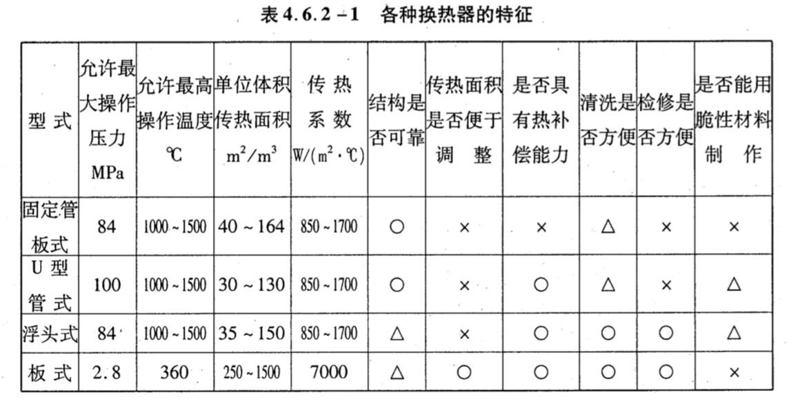
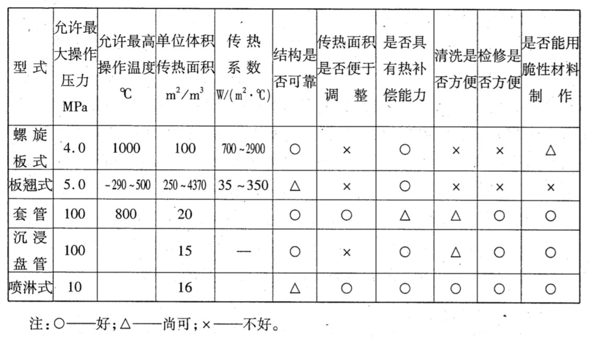
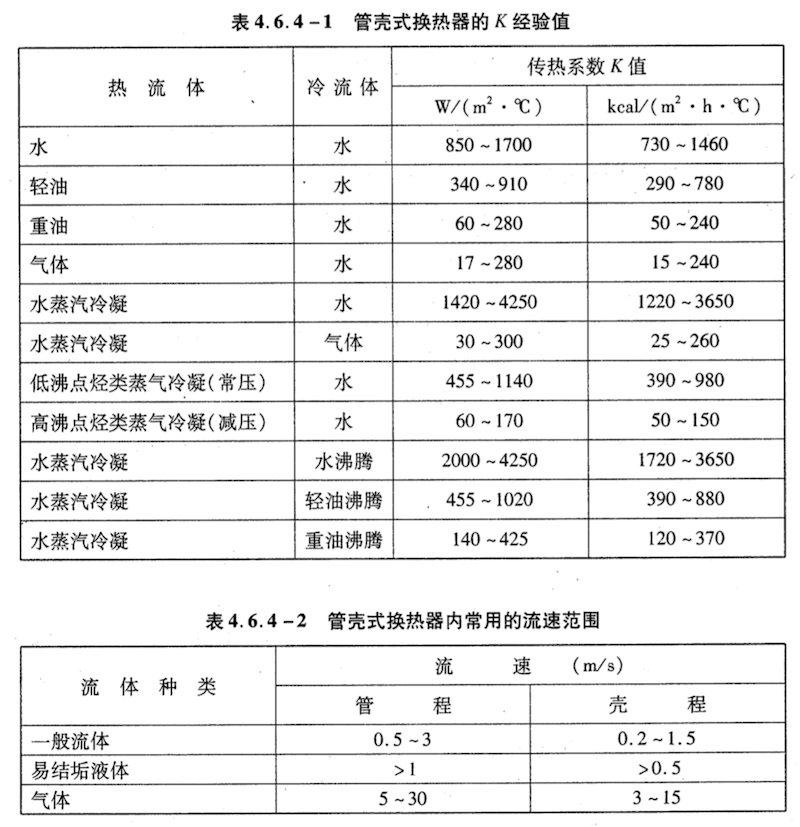
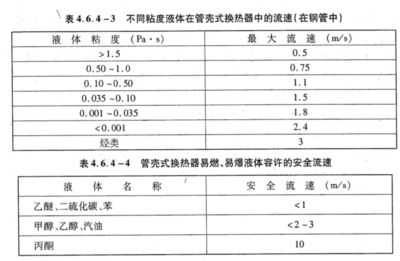

# 04 传热过程

## 4.6 换热器

换热器又称为热交换器，专指那些能实现冷热流体之间交换热量的设备。在化工、石油化工、轻化工、纺织化工、医药、动力等工业部门中，换热器一般作为加热器、冷却器、冷凝器和蒸发器使用。

### 4.6.1 换热器的分类

#### 4.6.1.1 按换热流体之间的热量交换方式分类

换热器可分为间壁式、直接接触式和蓄热式。

间壁式换热器是指冷热流体通过器壁隔离互不接触而得以换热的设备。直接接触式是指冷热流体直接接触并换热的设备。蓄热式换热器是指冷热流体周期性通过蓄热体进行换热的设备。分类如下：

1）间壁式。

1、管売式：a）浮头式；b）固定管板式；c）U 型管式；d）填料函式；e）釜式；f）套管式。

2、夹套式。

3、蛇管式：a）沉浸式；b）喷淋式。

4、紧凑式：a）板式；b）螺旋板式；c）板翅式；d）板壳式；e）伞板式。

2）直接接触式。

1、塔式。

2、喷射式。

3、蓄热式。

#### 4.6.1.2 按换热器功能不同分类

1）冷却器：用水或其它冷却介质冷却液体或气体。如：

1. 空气冷却器：用空气冷却或冷凝工艺介质；

2. 低温冷却器：用低温的致冷剂，如冷盐水、氨、氟里昂等作为冷却介质。

2）冷凝器：冷凝蒸气或混合蒸气，这又可分为下列几种：

1. 单一饱和蒸汽冷凝器；

2. 过热蒸汽冷凝器；

3. 多组分蒸汽冷凝器；

4. 具有不凝性气体的冷凝器；

3）再沸器：用蒸汽或其它高温介质将蒸馏塔底的物料加热至沸腾，以提供菾馏时所需的热量。其又可分如下形式：

1. 垂直热虹吸再沸器；

2. 水平热虹吸再沸器；

3. 强制循环型再沸器釜型再沸器内部设备型再沸器；

4）加热器：用蒸汽或其它高温载热体来加热工艺介质，以提高其温度。

5）换热器：在两个不同工艺介质之间进行显热交换，即在冷流体被加热的同时，热流体被冷却。

6）蒸气发生器：用燃料油或气的燃烧加热产生蒸气。如果被加热汽化的是水，也称为蒸气发生器，即为锅炉。如果被加热的是其它液体，或液体混合物则统称为气化器。

7）过热器：将水蒸汽或其它蒸气加热到饱和温度以上，就是过热器。（8）废热（或余热）锅炉。凡是利用生产过程中的废热或余热来产生蒸汽的统称为废热锅炉。

### 4.6.2 换热器的优化设计

换热器优化设计的主要内容为：

1）如何从可供选择的各种换热器形式中，选择较适宜的形式；

2）比较各种可用的换热表面，从中确定出最佳性能的换热表面；

3）分析各种设计参数对换热器各方面性能的影响，寻求最佳设计。

#### 4.6.2.1 换热器型式的选择

常用的各种换热器的性能和特征示于表 4.6.2-1。

考虑换热器选型主要因素如下：

1）流体种类。

对于液-液换热器，一般采用两侧都是光滑表面的间壁作为传热面较适合。螺旋板式和板式换热器的传热壁面为两侧光滑的板，且两侧流道基本相同，适用于两侧液体性质流量接近的情况，但由于结构上的原因，仅适用于工作压力及压差较小的场合。管壳式和套管式换热器大多也是以光壁作传热壁面，更适宜用于高温高压场合。

小流量宜用套管式，大流量宜用管壳式。管壳式换热器中管侧流道和壳侧流道的差异，再加上通过变换壳侧折流板和管侧的隔板，可组成不同的流程，调整两侧液体的传热膜系数，以适应两侧液体不同的性质和流量。两侧液体换热性能差别较大时，传热膜系数小的一侧可采用翅片或扰流件。管壳式换热器易于制造、选材范围广，因此它在液-液换热器中是主要型式。

对于气-气换热器，大多采用两侧都有翅片的换热面，以扩大传热面，缩小换热器的体积。常用的这类换热器有管壳式换热器和板翅式换热器。压力、温度较高的情况也有采用管壳式换热器的。如果气-气间泄漏不是重要问题，也可采用蓄热式换热器。

对于气-液换热器，由于气体侧的传热膜系数大大低于液体侧，因此气体侧常用带翅片的换热面，液体侧多为光壁，采用较多的为各种翅片管制成的管式换热器。对于这类换热器，通常气侧通道的横截面和通道所占的体积比液体侧大许多倍。这就使得气侧通道传热面的结构与布置成为设计中特别重要的问题。

2）重量和尺寸。

在移动装置和一些特殊应用场合，对换热器的尺寸、重量和体积等的限制常常是选型中考虑的重要因素。这些限制不仅是对换热器本身，还涉及维修所需的空间。为了适应这些要求，就需采用紧凑式换热器的形式，选取较高的流速，使运行中功率消耗较大、制造复杂。

3）投资和运行费用。

换热器优化设计的重要内容就是在满足工艺要求的条件下，使换热器的初投资、运行费用及其维修费等的总成本为最低，也就是用最低的费用获得最大收益。

4）污垢及清洗。

如果换热器中工作的流体较脏，就容易结垢。在此情况下，考虑结垢的影响及清洗的可能就成为主要因素。此时换热面的选择、流速的确定、受热面的布置等方面都要加以认真考虑。

在换热器设计中，除考虑上述因素外，还应对结构强度、材料来源、加工条件安全性等方面加以考虑。所有这些又常常是相互制约、相互影响的，通过设计的优化加以解决。

#### 4.6.2.2 换热表面设计的优化

选定了换热器的类型后，接着的问题是选哪一种形式的换热表面。例如，板翅式换热器可以用各种尺寸的平直翅片、多孔翅片、波形翅片等；翅片管换热器不仅涉及管子形状、管子的布置，还涉及翅片的形状、翅片的间距等；即使是光管换热器，也可选用不同的管径、不同的排列方式等。显然，不同换热表面有其各自的特点。

作换热器设计时，对换热器两侧表面结构都要作出选择。对于气侧通道，它的传热膜系数、流阻、重量、尺寸等的矛盾显得更为突出，进行细致的比较作出合理的选择尤为重要。

为了对各种换热表面的性能作出定量比较，至今已有很多方法，其比较的基准主要为：

1）基于换热表面的传热因子与摩擦因子的比较；

2）基于流体消耗功率的比较；
 
3）与参考表面的比较；

4）多方面性能的比较。

为了进行换热表面性能的比较，通常应用的比较参数有：

1）单位质量流量所需的换热表面积, A/W；

2）单位质量流量所消耗的输送功率，P/W；

3）单位换热表面所消耗的输送功率，P/A; 

4）传热功耗比， P/（A·a）;

5）单位通道长度的流阻，△p/L。

比较参数大多应用相对参数的形式，由于这些参数与换热器的结构参数、工作参数、流体物性参数、表面的传热及流阻特性等互相联系，因而用作比较较为方便。

#### 4.6.2.3 系统优化

1）冷却器冷却水的最佳出口温度。

设计水冷却器时，冷却水的出口温度直接关系到冷却器的大小以及冷却水的耗量。冷却水出口温度高，可节省冷却水的耗量，但要增加冷却器的面积；反之相反。因此，冷却水的出口温度必然有个最经济的数值，在这个温度下得出的冷却器设备费和冷却水费的总费用为最小。

水冷却器的设备费和水费的总值可用年总消耗费 C 来表示：

2）废热的最经济回收量。

化工生产中的废热应尽量可能加以回收利用，但是随着废热回收量的增加，换热器的面积也需要增大。当温差较小时，增大废热回收量并不有利，因此要通过经济分析，确定废热的最经济回收量。

废热回收的净收益可用下式表示：

由于上式中只有高温流体的出口温度 T2 为变量，因此可以通过试算求出。T2 为能获得最大净收益的排放温度。

3）低压蒸汽预热的经济值。

利用生产工艺中副产的低压蒸汽来预热工艺物料，可以节省一部分价格较高的高压蒸汽。低压蒸汽预热工艺物料到什么温度同样存在一个经济值。

设工艺物料需从 t1 加热到 t2，首先采用温度为 T1 的低压蒸汽将物料预热到温度 t，然后再用温度为 Th 的高压蒸汽加热到 t2。工艺物料加热所需的总费用为：

由上式通过试算可得出，从而可求得最经济的低压蒸汽预热值。

#### 4.6.2.4 计算机辅助优化设计

优化设计的任务就是采用优化理论和方法，对于一个限定的系统，确定一组设计参数，包括热工参数和结构参数，使得某一预定的目标或某项性能要求达到最佳值。

换热器优化设计的主要内容包括：

1）确定所研究问题的范围；

2）规定一个评定的目标或指标；

3）换热器选型和传热面的选择；

4）分析所研究问题的有关参数及设计变量；

5）确定各有关参数的约束条件；

6）建立目标函数；

7）适当的简化；

8）求解目标函数的最优化条件。

实现优化的过程要对每一个设计变量作多种试探。对于每一次试探都要完成整个换热器，以至包括更大范围内的传热、流阻等多方面的繁杂计算，而影响换热器性能的变量又很多，因此需要计算的工作量非常大，必须用计算机进行辅助设计。

### 4.6.3 换热器的计算 

#### 4.6.3.1 换热器的设计型计算

下面以某一热流体冷却为例，说明设计型计算命题、计算方法及参数选择。

1）设计型计算的命题方式。

设计任务：将一定流量 W1 的热流体自给定温度 T1 冷却至指定温度 T2。

设计条件：可供使用的冷却介质温度，即冷流体的进口温度 t1。

计算目的：确定经济上合理的传热面积及换热器其它有关尺寸。

2）设计型问题的计算方法。

设计计算的大致步骤如下：

1、首先由传热任务计算换热器的热流量（通常称为热负荷）。

	Q=WCP（T1-T2）

2、作出适当的选择并计算平均推动力△tm。

3、计算冷、热流体与管壁的对流传热膜系数及总传热系数 K。

4、由传热基本方程 Q=KA△tm 计算传热面积。

3）设计型计算中参数的选择。

由传热基本方程式可知，为确定所需的传热面积，必须知道平均推动力△tm 和传热系数 K。

为计算对数平均温差△tm，设计者首先必须：

1. 选择流体的流向，即决定采用逆流、并流还是其它复杂流动方式。

2. 选择冷却介质的出口温度。

为求得传热系数 K，须计算两侧的传热膜系数 a，故设计者必须决定：

1. 冷、热流体各走管内还是管外。

2. 选择适当的流速。

3. 同时，还必须选定适当的污垢热阻。

总之，在设计型计算中，涉及一系列的选择。各种选择决定之后，所需的传热面积及管长等换热器其它尺寸是不难确定的。不同的选择有不同的计算结果，设计者必须作出恰当的选择才能得到经济上合理、技术上可行的设计，或者通过多方案计算，从中选出最优方案。

4）选择的依据。

选择的依据不外经济、技术两个方面。

1、流向的选择。

为更好地说明问题，首先比较纯逆流和并流这两种极限情况。

当冷热流体的进出口温度相同时，逆流操作的平均推动力大于并流，因而传递同样的热流量，所需要的传热面积较小。

此外，对于一定的热流体进口温度，采用并流时，冷流体的最高极限出口温度为热流体的出口温度 T2。反之采用逆流，冷流体的最高极限出口温度可为热流体的进口温度 T1。这样，如果换热目的是单纯的冷却，逆流操作时，冷却介质温升可选择得较大因而冷却介质用量可以较小；如果换热的是回收热量，逆流操作回收的热量温位（即温度 t2）可以较高，因而利用价值较大。显然在一般情况下，逆流操作总是优于并流，应尽量采用。

但是，对于某些热敏性物料的加热过程，并流操作可避免出口温度过高而影响产品的质量。另外，在某些高温换热器中，逆流操作因冷却流体的最高温度 t2 和 T1 集中在一端，会使该处的壁温特别高。为降低该处的壁温，可采用并流，以延长换热器的使用寿命。

须注意，由于热平衡的限制，并不是任何一种流动方式都能完成给定的生产任务。

2、冷却介质出口温度的选择。

冷却介质出口温度 t2 越高，其用量可以越少，回收的热量的价值也越高，同时，输送流体的动力消耗即操作费用也减少。

但是，t2 越高，传热过程的平均推动力 tm 越小，传递同样的热流量所需的加热面积 A 也越大，设备投资费用必然增加。因此，冷却介质出口温度的选择是一个经济上权衡问题。目前，根据一般的经验 Δtm 不宜小于 10℃。如果所处理问题是冷流体加热，可按同样原则选择加热介质的出口温度 T2。

此外，如果冷却介质是工业用水，出口温度 t2 不宜过高，以防工业用水内所含盐因温度过高而溶解度下降而析出，而形成导热性很差的垢层，沉积于传热表面，使传热过程恶化。为阻止垢层的形成，可在冷却用水中添加某些阻垢剂和其它水质稳定剂。即使如此，工业用水的出口温度一般也不高于 45℃。否则，冷却用水必须进行适当的预处理，除去水中所含的盐类。这显然是一个技术性限制。

3、流速的选择。

流体流速的选择，对换热器的设计和运转效果都具有重要意义的。为了增大传热膜系数，进而提高传热系数，一般都希望参与换热的流体采用高的流速。同时，流速高，可使结垢程度减轻、降低热阻，而有利于传热。因此，当传递的热量定时，采用高的流速，所需的传热面积可减少，换热器的外形尺寸也较小，从而节约材料和制造费用。

但流速过高，又会使通过换热器的压力降增大，使输送流体的动力消耗增加，从而提高了操作费用。可见，要选取比较合适的流速，须经过全面的比较才能确定。选择流速时，通常可从下列几方面考虑。

a）要尽量使流体呈稳定的湍流状态（即 Re≥10000），或至少使流体呈不稳定的过渡流状态（即 Re=2300），这样可以在较大传热系数下进行热交换。在垂直管束流动下，一般希望流速大于过渡流时的流速，除非流体的粘度很高，为避免压力降过大，才不得不选用呈层流状态下的流速。

b）高密度流体（或在相变中的流体）的摩擦动力消耗（即压力降损失的能量）与传热速率相比，一般是小的，不起控制作用。因此，适当提高流速是有利的。反之，低密度流体（如气体）的热交换，传热系数既低，克服流体阻力所需动力消耗又较大，在考虑提高流速时，就应注意其合理性。

c）不会导致流体动力冲击、使换热器管子振动和冲蚀，否则会大大缩短换热器的使用寿命。

d）应使管长或程数恰当。因管子长度是有限制的，一般取 6~7 m 以内。管子太长，不但会因冷凝液的积聚而降低传热效果，而且不便于拆换和清洗管内污垢。而程数增加，则会使结构复杂化，且会使传热温差减小，降低传热效果。

e）使换热器有适宜的外形结构尺寸。

由上述可知，要选取最适宜的流速，在技术经济上需要全面进行比较。要做到全面比较并非容易。因此，通常是参照工业生产中所积累的经验数据，选取较为合适的流速。

4、冷、热流体流动通道的选择。

a）不洁净和易结垢的液体宜在管程，因管内便于清洗；

b）腐蚀性流体宜在管程，以免管束和壳体同时受到腐蚀；

c）压力高的流体宜在管程，以免売体承受压力；

d）饱和蒸气宜走壳程，因饱和蒸气比较清净，传热膜系数与流速无关而且冷凝液容易排出；

e）被冷却的流体宜走壳程，便于散热；

f）若两流体温差较大，对于刚性结构的换热器，宜将传热膜系数大的流体通入売程，以减小热应力；

g）流量小而粘度大的流体一般在壳程为宜，因在壳程 Re>100 即可达到湍流。但这不是绝对的，若流动阻力损失允许，将这种流体通入管内并采用多管程结构，反而能得到更高的传热膜系数。

5）换热管规格和排列的选择。

a）换热管规格：换热管直径越小，换热器单位容积的传热面积越大。因此，对于洁净的流体管径可取得小些。但对于不洁净或易结垢的流体，管径应取得大些，以免堵塞。考虑到制造和维修的方便，加热管的规格不宜过多。目前我国试行的系列标准规定采用 25×2.5 和 19x2 两种规格，对一般流体是适应的。管长的选择是以清洗方便和合理使用管材为准。我国生产的钢管长 6 m，故系列标准中管长有 1.5 m、2 m、3 m 和 6 m 四种，其中以 3 m 和 6 m 更为普遍。

b）管子的排列方式有等边三角形和正方形两种。与正方形相比，等边三角形排列比较紧凑，管外流体湍动程度高，传热膜系数大。正方形排列虽比较松散，传热效果差些，但管外清洗方便，对易结垢的流体更为适用。如将正方形排列的管束斜转 45° 安装，可在一定程度上提高传热膜系数。

6）管心距。

该距离的确定随管子和管板连接方法不同而异。胀接时 p=(1.3~1.5)d；焊接时，P=1.25d。

7）壳程折流挡板。

安装折流挡板的目的是为提高管外传热膜系数，为取得较好效果，挡板的形状和距离必须适当。

对于圆缺形挡板而言，弓形缺口的大小对壳程流体的流动情况有重要的影响。

弓形的缺口太大或太小都会产生「死区」，既不利于传热又往往增加流体阻力。一般说来，弓形缺口的高度可取为壳体内径的 10%~40%，最常见的是 20% 和 25% 两种。

挡板的间距对壳程的流动亦有重要的影响。间距太大，不能保证流体垂直流过管束，使管外传热膜系数下降；间距太小，不便于制造和检修，阻力损失亦大。一般取挡板间距为壳体内径的 0.2~1.0 倍。

#### 4.6.3.2 换热器的操作型计算

1）操作型计算的命题方式。

在实际工作中，换热器的操作型计算是经常遇到的。例如，判断一个现有换热器对指定的生产任务是否适用，或者预测某些参数的变化对换热器传热能力的影响等都属于操作型问题。常见的操作型问题命题如下：

1、第一类命题。

给定条件：换热器的传热面积以及有关尺寸，冷、热流体的物性，冷、热流体的流量和进口温度以及流体的流动方式。

计算目的：冷热流体的出口温度。

2、第二类命题。

给定条件：换热器的传热器面积以及有关尺寸，冷、热流体的物性，热流体的流量和进出口温度，冷流体的进口温度以及流动方式。

计算目的：所需冷流体的流量及出口温度。

2）操作型问题的计算方法。

在换热器内所传递的热流量，可由传热基本方程式计算，对于逆流操作其值为：
 
因此，对于各种操作型问题，可联立求解以上二式得到解决。

第一类命题的操作型问题通过一定的数学处理将传热基本方程式变换为线性方程，然后采用消元法求出冷、热流体的温度。但第二类操作型问题，则须直接处理非线性方程的传热基本方程式，只能采用试差法逐次逼近。

例如，可先假定冷流体出口温度 t2，由式（4.6.3-2）计算 W2、Cp，计算 a2 及 K 值，再由式（4.6.3-1）计算 t2'。如计算值 t2' 和设定值 t2 相符，则计算结果正确。否则应修正设定值 t2 重新计算。

数学上有一系列方法，可根据设定值 t2 和计算值 t2' 的差异选择新的设定值，这种方法称为迭代法。

如果传热系数 K 可以预计并且两端温差之比小于 2，则对数平均推动力可由算术平均值代替。此时，传热基本方程式成为线性，无论何种类型的操作型问题皆可采用消元法求解，无需试差或迭代。

3）传热过程的调节。

传热过程的调节问题本质上也是操作型问题的求解过程，下面仍然以热流体的冷却为例加以说明。

在换热器中，若热流体的流量 W1 或进口温度 T1 发生变化，而要求其出口温度 T2 保持原来数值不变，可通过调节冷却介质流量来达到目的。

但是，这种调节作用不能单纯地从热量衡算的观点理解为冷流体的流量大带走的热量多，流量小带走的热量少。根据传热基本方程式，正确的理解是，冷却介质流量的调节，改变了换热器内传热过程的速率。传热速率的改变，可能来自 △tm 的变化，也可能来自 K 的变化，而多数是由两者共同引起。

如果冷流体的传热膜系数远大于热流体的传热膜系数，调节冷却介质的流量 K 值基本不变，调节作用主要靠△tm 的变化。

如果冷流体的传热膜系数与热流体的传热膜系数相当或远小于后者，改变冷却介质的流量，将使 Δtm 和 K 皆有较大的变化，此时过程调节是两者共同作用的结果。

如果换热器在原工况下冷却介质的温升已经很小，即出口温度 t2 很低，增大冷却介质流量不会使 △tm 有较大的增加。此时，如热流体给热不是控制步骤，增大冷却介质流量可使 K 值增大，从而使传热速率有所增加。但是若热流体给热为控制步骤，增大冷却介质的流量已无调节作用。这就提示我们，在设计时冷却介质的出口温度也不宜取得太低，以便留有调节的余地。对于以冷流体加热为目的的传热过程，可通过改变加热介质的有关参数予以调节，其作用原理相同。

显然，对于操作型计算问题，传热单元数法要比平均推动力法方便。

#### 4.6.3.3 流体通过换热器的阻力损失计算

1）管程阻力损失。

换热器管程内的总阻力损失是由各程直管阻力损失 hf1、回弯阻力损失 hf2 及换热器进出口阻力损失 hf3 构成的，而相比之下 hf3 可忽略不计。因此管程总阻力损失（以单位质量流体的能量损失表示，J/kg）：

2）壳程阻力损失。

用来计算壳程阻力损失的公式很多，但皆可归结为：

这一基本形式。壳程结构参数较多，流动复杂，因而 § 和 u0 的决定比较困难。不同的计算公式，决定 § 和 u0 的方法不同。计算结果往往很不一致。

下面介绍目前比较通用的埃索计算公式，把壳程阻力损失看成是由管束阻力损失和折流板弓形缺口处的阻力损失构成的。考虑到污垢的影响，再乘以校正系数 f，即：

#### 4.6.3.4 热损失的计算

在传热过程中，换热器壳体外壁面的温度通常都高于周围空气的温度，故热量将从外壁面以对流和辐射两种方式传到周围空气中去，造成热损失。此项热损失，可根据对流给热方程式：

### 4.6.4 管壳式换热器的选用和设计计算步骤

此类型换热器（包括一些类同的换热器）在工业上应用非常广泛，一般在确定方案后，设计部门须进行选型和计算。其他类型的换热器，一般由设计部门提出工艺条件和规格要求由专业制造公司进行选型和计算，然后与设计共同确定。

#### 4.6.4.1 选用和设计步骤

目前，我国已制订了管壳式换热器系列标准，设计应尽可能选用系列化的标准产品，这样可简化设计和加工。

但是实际生产条件千变万化，当系列化产品不能满足需要时，仍应根据生产的具体要求而自行设计。

1）非系列标准换热器的一般设计步骤。

1、了解换热流体的物理化学性质和腐蚀性能；

2、由热平衡计算传热量的大小，并确定第二种换热流体的用量；

3、决定流体通入的空间；

4、计算流体的定性温度，以确定流体的物性数据；

5、初算有效平均温差。一般先按逆流计算，待后再校核；

6、选取管径和管内流速；

7、计算传热系数 K 值，包括管程传热膜系数和壳程传热膜系数的计算。由于壳程传热膜系数与壳径、管束等结构有关，因此一般先假定一个壳程传热膜系数，以计算 K 值，然后再作校核。

8、初估传热面积。考虑安全系数和初估性质，因而常取实际传热面积是计算值的 1.15~1.25 倍；

9、选择管长 l；

10、计算管数 N；

11、校核管内流速，确定管程数；

12、画出排管图，确定壳径 D，和壳程挡板型式及数量等；

13、校核壳程传热膜系数；

14、校核有效平均温差；

15、校核传热面积，应有一定安全系数，否则需重新设计；

16、计算流体阻力。如阻力超过允许范围，需调整设计，直到满意为止。

2）系列标准换热器选用的设计步骤。

1 至 5 步与非系列标准换热器相同。

6、选取经验的传热系数 K 值；

7、计算传热面积；

8、由系列标准选取换热器的基本参数；

9、校核传热系数，包括管程、壳程传热膜系数的计算。假如核算的 K 值与原选的经验值相差不大，就不再进行校核；如果相差较大，则需重新假设 K 值并重复上述 6 以下步骤。

10、校核有效平均温差；

11、校核传热面积，使其有一定安全系数，否则需重新设计；

12、计算流体阻力，如超过允许范围，需要重新设计。

#### 4.6.4.2 具体选用和设计计算步骤

设有流量为 W1 的热流体，需从温度 T1 冷却至 T2，可用的冷却介质温度为 t1，出口温度选定为 t2。由此已知条件可算出换热器的热负荷 Q 和逆流操作平均推动力△tm 道。根据传热基本方程式：

当 Q 和 △tm 已知时，要求取传热面积 A 必须知道 K 和 Fr；而 K 和 Fr 则是由传热面积 A 的大小和换热器结构决定的。可见，在冷、热流体的流量及进、出口温度皆已知的条件下，选用或设计换热器必须通过试差计算。

此试差计算可按下列步骤进行：

1）初选换热器的尺寸规格。

1、初步选定换热器的流动方式，由冷、热流体的进出口温度计算温差修正系数 Fr。Fr 的数值应大于 0.8，否则应改变流动方式，重新计算；

2、根据经验（或下表 4.6.4-1）估计传热系数 K，然后计算传热面积 A。

3、根据 A 的数值，参照系列标准选定换热管直径，长度及排列；如果是选用，可根据 A 在系列标准中选择适当的换热器型号。

2）计算管程压降和传热膜系数。

1、参考表 4.6.4-2、表 4.6.4-3 选定流速，确定管程数目，由式（4.6.3-4）计算管程压降△P。若 △P> 允许值必须调整管程数目重新计算。

2、计算管内传热膜系数，如 K< 估值，则应改变管程数重新计算。若改变管程数不能同时满足 △P < 允许值、a > 估值的要求，则应重新估计 K 值，另选一换热器型号进行试算。

3）计算壳程压降和传热膜系数。

1、参考表 4.6.4-2 的流速范围选定挡板间距，根据式（4.6.3-9）计算壳程压降△P，若△P > 允许值，可增大挡板间距。

2、计算壳程传热膜系数 a，如 a 太小可减小挡板间距。

4）计算传热系数，校核传热面积。

根据流体的性质选择适当的垢层热阻 R，由 R、a1、a2 计算传热系数 K，再由传热基本方程式（4.5.1-14）计算所需传热面积 A。

当此传热面积 At 小于初选换热器实际所具有的传热面积 A，则原则上以上计算可行。考虑到所用传热计算式的准确程度及其它未可预料的因素，应使选用的换热器传热面积留有 15~25% 的裕度，使A/At=1.15~1.25。否则需重新估计一个 K 重复以上的计算。

### 4.6.5 空气冷却器

#### 4.6.5.1 概述

空气冷却器是以环境空气为冷却介质，对管内高温流体进行冷却或冷凝的设备，简称为空冷器。

1）空冷器的特点及应用。

一般地，在下述条件下（满足 4~5 项）使用空冷器比较有利。

1、热流体出口温度与空气进口温度之差（即接近温度）大于 15℃。

2、热流体出口温度大于 50~60℃，其允许波动范围大于 3-5℃。

3、空气的设计进口温度低于 38℃。

4、有效对数平均温差大于（或等于）40℃。

5、管内热流体的传热膜系数小于 2300 W/（m2·℃）。

6、热流体的凝固点低于 0℃。

7、管侧热流体的允许压降大于 10 kPa，设计压强在 100 kPa 以上。

2）空冷器的结构与型式。

空冷器主要由管束、风机、构架等组成，可分类如下：

1、按管束布置方式，最常见的有如下型式：

a）水平式空冷器管束水平放置，如作冷凝器时，为便于凝液排出，管束应有 3° 或 1% 的倾斜。其使用范围最广。水平管束适用于多单元组合，传热面积大管外侧空气分布较均匀，热风循环小，造价较低，但占地面积较大。

b）斜顶式空冷器管束按人字形放置，夹角 60° 左右，常用于冷凝或占地面积受限制的场合，占地面积可比水平式少 40%~50%。其缺点是：管束长度有限制，空气流动分布不易均匀，受自然风影响较大，另形成热风循环，造价较高。

c）立式空冷器此种型式只用于小规模装置。

d）圆环式空冷器管束垂直排列成圆环形，风机置于上部中央，空气分布较好，安装在塔顶时（如作为塔顶冷凝器），结构紧凑，可不占地，但此时风机容量受限，空气流速范围窄，灵活性差。

2、按通风方式分类。

a）自然通风式空冷器。

b）鼓风式空冷器。

c）引风式空冷器。

3）按冷却方式分类。

a）干式空冷器；

b）湿式空冷器；

c）干湿联合空冷器。

3）翅片管和管束

1、翅片管空冷器常用翅片管为横向翅片，有以下几种：绕片式、镶片式（代号为 C），双金属轧片式（代号为 DR）。按基管形状主要有圆管和椭圆管两类。

2、管束由管箱，翅片管排和框架组成，结构独立，可完整地在空冷器构架上进行装卸。

a）管箱是被冷却介质的集流箱。常用的有如下几种型式。

- 丝堵式管箱允许工作压力 ≤ 16~20 MPa；

- 可卸盖板式管箱允许工作压力 ≤ 6.4 MPa；

- 集合管式管箱允许工作压力 ≤ 32 MPa；

- 分解式管箱按规定，对碳钢空冷器，热流体进出口温差大于 110℃，对奥氏体钢空冷器进出口温差大于 80℃ 时，均应采取减少温度应力的措施。分解式管箱是措施之一，也可采用 U 型管结构，使 U 形回弯部分吸收温差应力。

b）管束基本参数的选择：管束中翅片管的排列多采用等边三角形错列，管束的管间距、管排数、管程数等参数的选择对空冷器的传热性能和总费用（设备费与操作费）影响较大。

1. 管间距 p，管间距加大，管外传热膜系数和压降均减少。国产管束采用等边三角形排列，低翅片管 P1=54~59 mm；高翅片 p1=62-64 mm。

2. 管排数换热面积一定时，管排数增加，空气的流动压降增加、温升增加、功率消耗及操作费用增加；但单位占地面积的传热面积和制造费用降低。目前常用管排数，对水平式为 2~8 排，其它形式管東为 2~4 排。

3. 管程数管程数的选择取决于管内介质流速和压降，要根据工艺对传热和压降的具体要求而定，最高可用至 8 程。

4. 迎风面积与管排最小流通面积。

管束的迎风面积 S，是垂直于空气流向的管束外框内壁以内的面积。S=管束的宽×长-2×梁宽x长。

迎风面积的大小取决于迎风面空气流速的选择。在空冷器管束外侧的对流传热膜系数或压降计算中，通常使用最大质量流速 G 或最大流速，它们都取决于管束间最小流通面积 Sm。对三角形错列翅片圆管管排，

#### 4.6.5.2 空冷器传热计算

在空冷器传热计算中，不同文献对空气侧传热膜系数与总传热系数进行表达时，分别使用以光管外表面和以翅片外表面两种不同的基准，引用时必须注意区别

1）总传热系数和传热热阻。

1、总传热系数。

2、传热热阻。

2）管外空气侧传热和压降计算。

对常用的圆形翅片管束管外空气侧的传热和压降计算介绍如下：

注意：管壳式换热器的 F 图线不适用于空冷器。适用于空冷器的 F 图线请查阅有关资料。

#### 4.6.5.3 空冷器的设计

1）设计条件与基本参数。

1、设计气温。

指设计空冷器时选用的当地空气入口干球温度。设计气温的选取有以下几种方法。

a）保证每年不超过 5 天的最高气温，即其出现时间约占全年时间的 1.3%; 

b）按当地最热月的日最高气温的月平均值加 3~4℃；

c）7、8 月的日最高气温的月平均值，并乘以 1.10；

d）不超过一年的最热三个月中或最热月期间日平均气温 5% 时间的温度；

e）假定一设计气温，一年中仅有 2%~5% 时的温度超过该值；

f）对高凝固点和高粘度介质，采用年平均气温。

可根据具体情况取上述方法之一，考虑到工艺和经济上的合理性及我国大多数地区的气候条件，采用（a）较多。应参照各地具体气象资料确定。

2、管内流体温度。

a）入口温度。理论上热流体入口温度愈高，采用空冷器愈经济，但入口温度超过 200℃ 时，应考虑用其它换热器进行热量回收。目前使用空冷器，其热流体入口温度一般在 130℃ 以下。入口温度若低于 70℃，可采用水冷。湿式空冷器的热流体入口温度以 60~80℃ 为宜，以避免喷淋水结垢。

b）出口温度。出口温度的选取是直接影响空冷器经济性的重要指标。热流体出口温度与设计气温之差称为接近温差（或接近温度）。一般条件下，对干式空冷器接近温度一般应大于 15℃。若热流体出口温度不能满足要求，可考虑采用湿式空冷器。一般认为：热流体冷却至 75℃，选用干空冷最经济；热流体冷至 75~ 65℃，选用干空冷或湿空冷均可；热流体冷至比湿球温度高 5~6℃，选用蒸发式湿空冷器有利。

3、管排数。

管排数对空冷器的经济性影响较大，从经济上考虑，一般希望空气温升大于 15~20℃，增加管排数，空气温升增加，但压降也增加。合理管排数的选择可参考图 4.6.5-1 图中的 K 是以光管表面积为基准的总传热系数。

4、迎风面空气流速。

简称迎面风速。它是空气状态为 20℃、101.3 kPa 时，在迎风面处的流速。

5、高低翅片的选择。

6）管程数的选择。

主要取决于管程允许压降及热流体温度变化范围。管程数增加，则管内流速增加。对冷却过程，管内液体流速在 0.5~1.0m/s，气体质量流速在 5~10kg/(m2·s) 左右；对冷凝过程，一般采用单管程，当其温差校正系数 Ft < 0.8 时，应考虑采用双管程或多管程。

2）设计步骤。

空冷器的设计包括总体方案确定、选型及估算和详算三个步聚，其间也需要反复试差或修改方案。

1、总体方案确定。根据工艺要求、场地情况、环境气温变化资料及环保等要求，选择水冷或空冷，选定空冷器型式及其组合方式（干式与湿式的组合，水冷与空冷的组合）。

2、估算。

3、详算。

为减少空气出口温度 tca 试差的工作量，可参阅有关资料中各种方法，来估算。