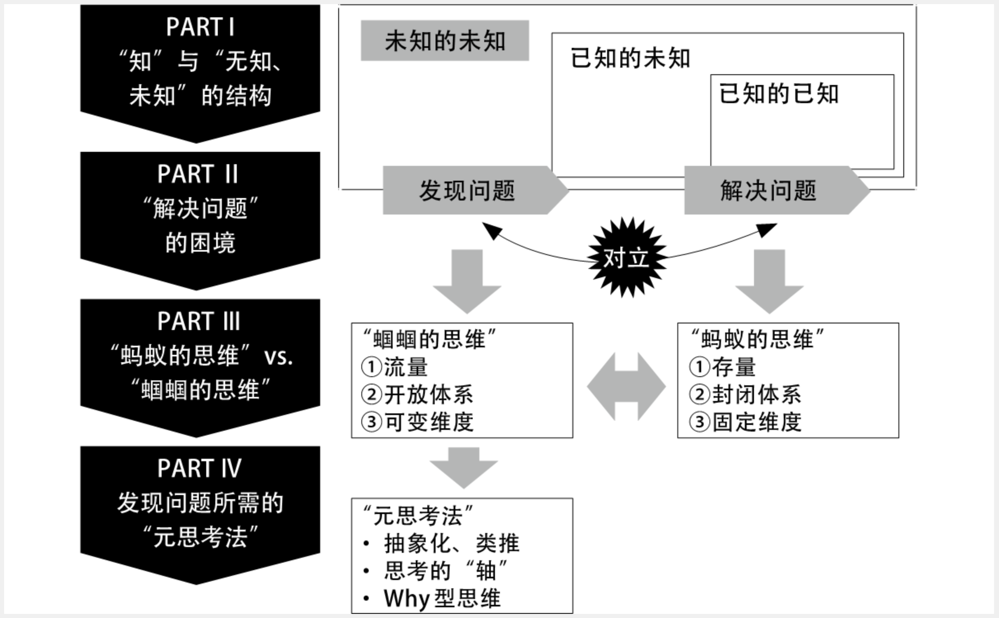

高维度思考法——如何从解决问题进化到发现问题

书名： 高维度思考法：如何从解决问题进化到发现问题

作者： [日] 细谷功

译者： 程亮

版权： 后浪出版咨询（北京）有限责任公司

## 前言

一生留下近 40 册著作的管理界巨匠彼得·德鲁克在逝世前约两年（2004 年初）时曾接受美国 《财富》杂志的采访，记者问他：「假如您还有没写的主题，会是什么？」德鲁克答道：「是无知的管理。要是早写出来，大概已经成为我的最高杰作了。」无知的管理…… 早已对经营洞悉无遗、预见了「知识社会」和「知识劳动者」的德鲁克，在人生的最后关头究竟想告诉我们什么？

说起无知，距今两千多年，苏格拉底曾提出「无知之知」的概念。在那个家喻户晓的故事中，苏格拉底听说德尔斐神庙传出神谕，称「苏格拉底是最有智慧的人」，可他自己对此「毫无印象」，便同众多「智者」交谈，然后得出了结论 —— 自己与他们的不同之处在于「我知道自己多么无知」。这便是「无知之知」的由来。

奇妙的是，「经营学之父」和「哲学之父」探寻到的领域却都是「无知」。也就是说，「无知」是孕育新智慧的最重要的关键词。这听起来有些像禅学问答。「知识丰富」为好，「无知」为不好 —— 这是世间「最基础的常识」，但本书反而挑战这一价值观，探究「德鲁克和苏格拉底究竟想告诉我们什么」，同时也尝试着对用来实践发现问题的思维方法论做出阐释。

### 01.「无知、未知」与解决问题的困境

写下你对「租庸调」的认识。这是 1908 年日本旧制一高（现日本东京大学教养学部）的入学试题。这个题目对考生的「填鸭式知识量」有着极高的要求。如今，这样的问题已经完全不适用于人才需求了，因为如果只是单纯地比拼「知识量」，人类是敌不过电脑的。IBM 的人工智能「沃森」，曾在美国最受欢迎的智力问答节目《危险边缘》中战胜人类冠军。从人工智能击败国际象棋世界冠军开始，电脑逐渐在各种智力活动中凌驾于人类之上。「靠知识量取胜」和「解决既有问题」已不再是人类该努力的课题。

现阶段，人类应该把努力的方向转换至（广义的）解决问题，即发现并定义没人意识到的新问题这一「上游部分」。在商业、教育等多种场合，均要求这种「从下游到上游」的需求转换。

以商业而言，所有业界一致要求员工以「发现问题型」的方式工作，也就是说要能够主动发现顾客的潜在需求，而不是被动应对来自顾客的交易需求；不是在其他公司的后面苦苦追赶，而是创造出业界前所未有的革新性的商品或服务；不是单纯提供个别的商品或服务，而是从需求中挖掘出顾客的根本性需求并提交方案。用河流来比喻，就是不要在下游静待顺水而下的猎物落网，而是应该站在险峻的上游，即便需要在岩石间反复搜寻，也要找出隐藏其间的猎物。

这里的问题在于，「下游」和「上游」不仅要求各自必需的着眼点，所要求的工作价值观和技能也不相同，有时甚至完全相反。也就是说，擅长（狭义的）解决既有问题的人不擅长发现问题，反之亦然。这便是本书所阐述的「解决问题的困境」。

如今，社会、公司、学校所提倡的价值观几乎已统统被优化为「下游的价值观」。因此，我们现在需要溯流而上，逆转价值观，将必要的思路转换至「上游」。「上游」所需要的，不是囿于旧有成见的思维，而是发挥「想象力」和「创造力」以开拓新世界。换言之，就是要将人类的「思考」能力完全发挥出来，仅此而已。为此，我们不能把知识当成「存量」来用，而必须将其视作「流量」来活学活用。这就要求我们必须转换价值观，着眼于「无知」和「未知」，而非积存的知识。

### 02.「困境」的机制和解决方法

那么，这种「困境」是由怎样的机制产生，又需要如何解决呢？本书将以「无知、未知」为线索，从两个角度加以分析。一个是「作为知的对立概念」。「知」有时会成为阻碍新发现的重大要因，所以本书会着眼于将「知」重置（unlearn）这个意义上的「无知的优点」。另一个是「无知之知」这一侧面。苏格拉底所提倡的重点不在于「无知本身」，而在于「无知的无知」（不自知无知的状态）这一「元级」（meta-level）的无知。

正如前文所述，解决既有问题的（狭义的）「解决问题」，与作为其「上游」的发现新问题的「发现问题」，二者所要求的思路和价值观是正相反的。然而迄今为止，在极大程度上受到重视的却是（狭义的）「解决问题型」的思路。本书将对二者进行彻底的对照和比较，阐明如何活用无知以消除「困境」的思路。其核心便是「从知到无知的视角转换」，以及与此相关的三组关键词 ——「从存量到流量」「从封闭体系到开放体系」「从固定维度到可变维度」。

本书会以「蚂蚁和蝈蝈」作为比喻，对基于上述三种视角的思路加以比较，尝试从「无知」的观点出发，对一直被人们视为理所当然的「蚂蚁是善，蝈蝈是恶」这一价值观进行检验，同时展开新的讨论。此外，本书还提出「通过元级超越维度」的思考法，将其作为活用「无知」和「无知之知」的具体思考法，用来发现问题和定义问题。如此，本书便介绍这种着眼于无知和未知来发现新问题和创造新视角的思考法，并将其作为解决「困境」的方法。

德鲁克在其 1994 年的著作《后资本主义社会》中，关于「知识提高生产力」做了如下论述，可供参考：

伟大的英国小说家爱德华·摩根·福斯特（1879 - 1970 年）提倡「联结」。（中略）联结所需要的，是用来定义问题的方法论，其重要程度甚至超过当今流行的解决问题的方法论。（中略）需要「未知事象的体系化」（Organizing Ignorance）。事实上，这也是我从 40 年前便已开始写的书的标题，但至今仍未完成。

这里的「定义问题」，接近本书所说的「发现问题」。而从这段话中，也能看出德鲁克一生的问题意识。

### 03. 本书全貌

本书的结构和整体概要如图所示。

本书大体上由四个部分构成。

PART Ⅰ 对「未知的未知」加以阐述，同时提出本书对于「知」和「无知、未知」的定义和框架。

PART Ⅱ 针对「解决问题的困境」，通过对比「河的上游和下游」，阐释「解决问题与发现问题的思路差异」，即在何种场合需要何种思路，它们之间存在怎样的结构性矛盾，也就是「困境」，以及「为什么」会出现这种困境。发现问题居于解决问题的上游，但二者之间并非一路坦途相通，而是存在不连续的裂隙。很多时候，人们正是因为没有意识到这一点，才难以发现问题。世人往往被「解决问题型」的价值观所支配，本书会在这个部分谈及该现象的原因，并探求困境的解决办法。

PART Ⅲ 通过「蚂蚁和蝈蝈」的类比，明确对比两种思路，思考二者的对立结构和「共存共荣」的方向性，同时指出基于「奇点」的发现问题和用以预测未来的着眼点。任何领域均存在蚂蚁思维的人和蝈蝈思维的人，关键在于理解这两种思路的机制，根据不同的场合加以区分，各尽其用。

PART Ⅳ 讲解了三种通过超越维度打破壁障的元思考法，即能像蝈蝈那样「跳跃思考」的「用以发现问题的思考方法」。

这里的关键词是「上位概念」和「元视角」。本书将通过三种上位概念的用法，讲解蚂蚁和蝈蝈的思路差异之一 ——「是只用下位概念思考，还是配合上位概念思考」，将其作为关系到具体创意的思考法介绍给读者。本书将直面「无知」「知」等抽象概念，尤其是 PART Ⅰ、Ⅱ 中的讨论，非常抽象，部分读者可能会感到难以理解。若出现这种情况，建议这部分读者把 PART Ⅰ、Ⅱ 当作「要点」，从相对容易理解的 PART Ⅲ 开始读起，然后再回头去读 PART Ⅰ、Ⅱ。希望读者能理解「用以发现新问题的思路」的机制，重新审视「无知、未知」「上位概念」「元视角」。只要读者能够想出打破旧有的「常识之墙」的创意，向着新领域不断跃进，本书的目标就算达成了。

细谷功

## 后记——「知的不可逆性」决定问题的发现和解决

本书从彼得·德鲁克的言论出发，阐述了以「无知、未知」为起点的发现问题的方法论。在智慧的世界中，受重视的向来是「知识」「专家」「存量」「封闭体系」「固定维度」等用来高效率地解决问题的关键词，而这些关键词在发现问题的世界里，统统是起负面作用的。关于这一点，想必大家已经明白了。

像这样的「解决问题的困境」，应该怎样解决呢？能根据场合巧妙地区分使用「蚂蚁的思维」和「蝈蝈的思维」的「超人」般的人物当然也有，但那只是极少的一部分人。世界上的大多数人受能力及「立场」所限，只能扮演「蚂蚁」或「蝈蝈」中的一个角色。因此从结构上来说，同时扮演这两者往往是不可能的。

重要的关键词还是「元视角」。可以说，苏格拉底想传达的基本信息正在于此。此外，正如本书后半部分所说明的，「元视角」是思考的原点，尤其对于发现问题而言，可谓是最最基本的思维方式。所谓的「元」，就是「意识」。任何事情走到最后，都会抵达简单的本质。本书也在最后探究了「意识」的机制。

关于 PART Ⅰ 所阐述的德鲁克和苏格拉底所说的「两种无知」的活用，下面再来重新思考一下。德鲁克所提倡的「无知」，是将人类有意识或无意识持有的知识，主要是解释等级的知识进行重置，以「外行的视角」看待；而苏格拉底所提倡的「无知之知」，是「从上方俯瞰」自己的无知本身，也就是强调了「元视角」的重要性。

想一想就能明白，本书所阐述的这些「两种无知的活用法」，对于发现问题而言，其实本质上说的是同一回事。「知识的重置」之所以有必要，是因为掌握的知识一旦固化，就会成为偏见而起反作用。这种「偏见」的代表例是以自我为中心的事物观，这既可以称为「自我偏见」，也可以称为在自己与他人之间「画线思考」的「自我封闭体系」。

首先对这一点有所意识的便是「元视角」，即「无知之知」。也就是说，这「二者」总是一起出现才能发挥作用。由此可见，无知之所以对于发现问题作用重大，原因正在于 PART Ⅱ 所阐述的「解决问题的困境」。在结构上，只有着伴随时间流逝的不可逆性这一困境，因此不可能「后退」，只有通过「重置」，才能解除这一困境。

不仅限于智慧领域，整个世界都被「不可逆性」支配着。人的一生也好，组织的荣枯盛衰也好，以及社会、国家本身，都被伴随时间流逝的不可逆性支配着。不可逆过程一旦开始，就无法使之后退，但会出现下一个不可逆过程，使这一流程永远循环下去。就像人的一生结束后，还会诞生新生命，使人类的进步和发展得以延续。这一流程在智慧领域里也一样。自古相传的「盛极必衰」「川流之水不绝，且非原本之水」等不可逆变化，支配着整个世界。

「将无知结构化」，本就是自相矛盾的。因为在完成结构化的一瞬间，无知便已不再是无知，而且无知的边界会扩至遥远的远方。即便如此，还要尝试无谋的挑战，是因为人们把这里视为一切思考的原点了。同样地，「意识」是人们在日常生活中经常于无意间使用的词语，但它其实也是一个内涵极其深邃的概念，因为这个词同「无知」是表里一体的关系。所谓发现问题，就是「回溯至上游」，这是本书的关键信息之一，而其中相当于「最上游」的，就是「意识」。

仔细想来，「起疑心」「持逆反心理」「怀有好奇心」等思考事物时的必要姿态，也是全部建立在源自「元思考」的「意识」的基础之上的。就这一点而言，对思考的「第 0 步」，即「意识」的相关「方法论」进行总结，与其说是很有意义的一项挑战，更不如说「为何至今仍未使其明确？」

仔细想想，人类是以「从父母到子女的世代交替」的形式，自然而然地对无知进行重置的。婴儿出生时不具备任何知识，所有人都不得不花费大量时间，从零开始学习加法、乘法，难道不能说这就是人类巧妙地将神所赋予的知进行了重置吗？

## 目录

前言

PART Ⅰ「知」与「无知、未知」阐明其结构

PART Ⅱ「解决问题」的困境——能「解决问题」的人不能「发现问题」

PART Ⅲ「蚂蚁的思维」vs.「蝈蝈的思维」——从解决问题到发现问题

PART Ⅳ 发现问题所需的「元思考法」——升维发现问题

后 记