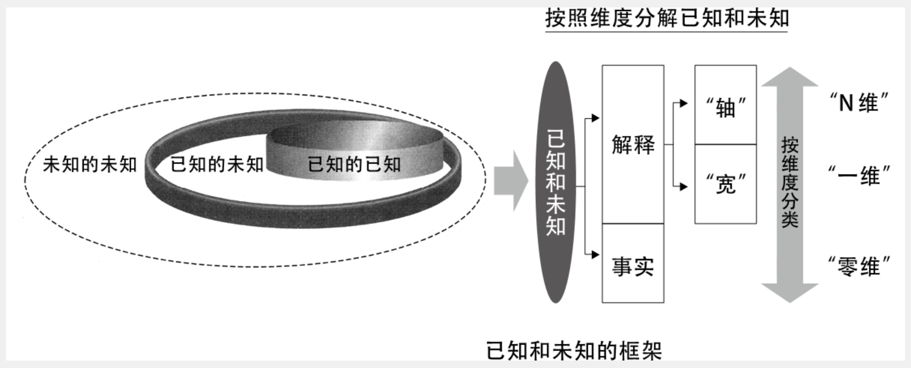

# PART Ⅰ「知」与「无知、未知」——阐明其结构

PART Ⅰ 的整体概念图

## PART Ⅰ 的要点

要点汇总：1）思考时要将知的世界分成「三个领域」：「已知的已知」「已知的未知」「未知的未知」。尤其重要的是，要把未知的领域一分为二，意识到「不知道自身还有不知道的事」=「未知的未知」这一领域的存在。2）「知」是「事实和解释的集合体」，知识即定义为该集合体的快照。3）通过「维度」理解「知」和「无知、未知」的世界，而维度大体上可分为事实（零维）、宽（一维）、轴（N 维）。4）活用苏格拉底和德鲁克所提倡的「无知」的两种视角，有助于发现问题。

在 PART Ⅰ 中，我将尝试对发现问题所必需的「无知、未知」做结构化处理，将其作为框架呈现，进而通过与「知（识）」的对比，从多个角度切入，对无从捉摸的「无知、未知」进行整理和讲解。在「知识是一切的原点」的（狭义的）解决问题的阶段，为了把「已知的未知」变成「已知」，使固定变量达成最优或者比喻为「给固定轮廓中的空白图案上色」—— 这一点至关重要 —— 就需要灵活运用已经具有一定体系的知识。与之相对，在发现问题的阶段，模糊性和不确定性较高，此时要求的则是「找出变量本身」，所以需要在运用既有知识的基础上发挥新的创造性，因此着眼于「无知、未知」就会变得很关键。那么，着眼于「无知、未知」具体该怎样做呢？本应无所不能的知（识）为何有时反而会变成消极因素？无知和未知何以能成为积极因素？下面我们就来一同寻找这些问题的答案。

## 1.1「未知的未知」这一死角

「根本没意识到自己不知道」以及「无知、未知」，它们有何意义？让我们先来找出需要着眼于此的动机。

首先，作为全书的绪论，这里会利用简单的练习和常见的事例，同大家分享把视角从「知（识）」拓展至「无知、未知」的过程。

你能列举出几个「便利店里不出售的东西」？

请备好纸笔，实际动手尝试解答以下问题。

两个问题为一组。限时一分钟，请尽可能多地列出答案。

【问题①】「列举便利店里出售的东西」（限时一分钟）

【问题②】「列举便利店里不出售的东西」（限时一分钟）

你列出了哪些东西？有多少个？

其实稍经思考就会发现，回答这两个问题需要「不同的思路」。

问题①「列举便利店里出售的东西」，相对而言比较简单。想必九成以上的读者都会想起自己常去的便利店，然后从货架的一端开始逐次「浏览」，同时列出这些商品：「饭团、盒饭、副食品、乳制品……」如果单词的「细度」（例如饭团所用的具体食材等）暂且不论，则几乎所有列举出来的商品都是这样的。

可以说，这同我们依赖「已有的知识和经验」思考创意时的「用脑法」是一样的，即找到脑中的「货架」—— 也就是自己已有的知识和经验，然后从一端开始浏览，按需取出上面的物品。在这种情况下，思路的个体差异是非常少的（大家的想法都一样）。

那么，「不出售的东西」又如何呢？这个问题不同于前者，其思路和答案因人而异，千差万别，能够如实体现「头脑的灵活度」。

首先，无法摆脱「已有的知识和经验」的人，会想起与便利店类似的其他商店，例如百货商店、家电卖场等，然后仍旧在「货架」上浏览商品，如钱包、皮包、鞋、服装、寝具、冰箱、手机，等等。总之比起前一个问题，只有「货架的种类」变了，思路还是完全一样的。

头脑再灵活些的人，会扩大范围，想到与便利店差异较大的商店，比如各种兴趣爱好用品的专营店，然后在这类商店的「货架」上浏览商品，如「自行车、钓鱼竿、高尔夫球、滑雪板、小提琴……」然而，这种思路仍未脱离「知识和经验」的范畴。

头脑更灵活的人，可能会想到「大件」（汽车、房屋）或「奢侈品」（珠宝、高级手表），甚至还可能想到下面这样的答案：

·（不属于产品的）「服务」（保洁、咨询……）

·「生物」（狗、蛇、独角仙……）

·「无形之物」（电、煤气、空气……）

·「极巨大或极昂贵的东西」（银河系、非洲之星……）

·「以前有而现在没有的东西」（平安时代的空气……）

·「本就不是商品的东西」（爱、人行横道……）

·「世上根本不存在的东西」（永动机、时光机……）

……

「便利店里不出售的东西」其实是无限多的，如图 1-1 所示（这只是其中一例，若从其他侧面观察，还可能通过各种切入点进行不同的扩张）。

图 1-1　便利店里不出售的东西的范围的扩张

可以想到仙女座星系、宿醉、助动词、希格斯粒子、邪马台国、跳蚤的心脏、长生不老药…… 倘若进一步发挥想象力，还有迪士尼乐园的百年免费门票、无人能解的微积分、青春的苦涩回忆、跟源赖朝的握手券、奔跑时速高达 200 公里的蟋蟀…… 可谓无穷无尽。

总而言之，包括荒诞无稽的事物在内，「不出售的东西」是「应有尽有」的。然而我们听到这样的创意时，却常会做出「这样也行？」的反应。这正是一种「囿于固定观念」的状态。

虽然回答这个问题只需要一分钟，却能轻易检验出思维之环可以扩张多远（视野能扩张多远），亦即「头脑的灵活度」。

将这部分引导练习与「知（识）」和「无知、未知」联系起来，更能得出几条训示：

·运用既有的知识和信息获得创意会更加简单快捷

·想出创意的过程几乎不会因人而异

·既有的知识和信息中存在「向心力」（知道得越多，越难摆脱）

·轻易意识不到「根本没意识到自己不知道」

·崭新的创意是指「乍看很蠢」「引人发笑」的东西

此外，通过这样的引导练习，还能从各方面对创意有所意识。关于这部分的内容，会在本书的各章节进行讲解。

拉姆斯菲尔德所说的「未知的未知」

经过上一节的「便利店例题」，本节将针对「未知的未知」这一「连不知道都不知道」的领域，重新思考它与「知（识）」的相对关系。

说起「无知、未知」，有一段话值得注意。2002 年 2 月 12 日，时任美国国防部长的唐纳德·拉姆斯菲尔德在记者会上被问及「伊拉克政府向持有大规模杀伤性武器的恐怖分子提供援助一说有何证据」时，他给出了闻名全美的回答：

首先存在知道自己知道的「已知的已知」（known knowns），然后存在知道自己不知道的「已知的未知」（known unknowns），另外还存在不知道自己不知道的「未知的未知」（unknown unknowns）。

（There are known knowns; there are things we know we know. We also know there are known unknowns; that is to say we know there are some things we do not know. But there are also unknown unknowns-the ones we don’t know we don’ t know.）

这里尤其值得注意的是，未知被分成了两类，在「已知的未知」外侧还存在「未知的未知」（图 1-2）。这使我们重新意识到一件理所应当的事 —— 关注「连不知道都不知道」的领域，是开拓知的世界的第一步。

图 1-2　拉姆斯菲尔德所说的已知和未知的三个分类

无论个人还是企业等组织，通常存在一种误解和盲信，那就是以为「第二个环」的内侧 ——「已知的未知」和「已知的已知」就是「整个世界」。人们很容易忘记一个至理：人类的未知远超（足有天文学上的差距）已知。

正如图 1-3 所示，从内向外的第一、第二个环，其实只是我们所处世界的一小部分（如同宇宙空间中的地球）。可以说，深刻地认识到这一点是发现问题的基本前提。为了便于表现，「第三个环」也用线画了出来，但它实际上应该是无限的，是不停膨胀着的，完全可以代表「宇宙的尽头」。

图 1-3　「三个环」的相关误解和实际形态

这种体验与「便利店的引导练习题」类似。「便利店里不出售的东西」其实存在无限的可能性，但我们会在不知不觉间被「世上出售的东西」这一「知道不出售」的领域束缚，至于其外侧那无限大的领域，则甚至连想都想不到。

除此之外还有不少这样的例子。后文还会提到，我们会被这个「外侧的环」以各种形态「包围在内」，很难发现其存在。这也恰恰关系到「无知之知」的重要性。

例如在风险管理的世界里，人们会设想可能发生的风险并思考相应的处理办法。但实际上，作为风险而被认识到的风险（可能发生哪些事）已然属于「已知的未知」，而真正应该考虑的是「甚至无法设想的事」，也就是「未知的未知」。「出乎预料」这个词有两层含义，一是「未知的未知必然存在，所以就算知道也无计可施」；二是对于「未知的未知」这一领域毫无预料。对于风险管理而言，后者是很糟糕的状况，正是「对于未知的未知连想都没想过」的典型。

举个例子，比如用互联网检索引擎搜索信息。我们往往会陷入一种错觉，以为任何未知的信息都能搜索出来，但实际上，当你想到要输入「关键字」的一瞬间，搜索出来的结果就必然无法脱离「知道自己不知道」这一领域，而真正的「连不知道都不知道」，则处在其外侧无限扩展的「连关键字也想不出来」的领域。

「常识」是位于「已知的未知」外侧的墙

再把「三个领域」扩展到商业顾客的范围来看。既有顾客处于最内侧的环里；被视为现有市场的对象顾客 ——「知道有可能购买，还没买」的顾客处于第二个环里；目前甚至还没被设想为顾客的人，即所谓的「未创造」的顾客，处于第三个环里。

德鲁克曾经说过：「商业就是创造顾客。」身处稳定业界的人，总是容易张口闭口「有或没有市场」，这恰恰体现了局限于「第二个环」内侧的思路。可以说，德鲁克的那句话直截了当地呈示了一种精神，就是要着眼于第二个环的外侧。

世间所谓的「常识」也正是如此。可以说，位于「已知的未知」外侧的墙，其名即为常识。在这种情况下，世间「非常识的」行为和现象自然并非不可见，但就算能亲眼见到「事实」，人们仍会建起一堵名为「常识」的隐形之墙，并在墙上安装过滤器，把墙外侧的「非常识的」领域排斥在外，认为那不值得思考。也就是说，即使亲眼能见，也认识不到其存在。

世间所谓的常识，终归是虚幻的东西，会因时间、场合、地点而改变。昨天的常识可能变成明天的非常识，这个业界的常识可能是那个业界的非常识。依着固守常识的事物观，反而看不见重要的东西。也就是说，我们不仅会陷入无知的状态，更会陷入没意识到自己正处于这种状态的「无知的无知」的状态。

举个身边常见的例子，比如在职场上，上司叫下属「拿出更有新意的创意！」可一旦下属提出「真正有新意」的创意，上司无非会给出「其他公司也在做这个方案吧？」「这个构想为时尚早」之类的评价。这其中的结构，也可用上述的「三个环」来加以说明。

上司所说的「有新意」，根本没脱出「第一个环的外侧，第二个环的内侧」这一领域，而且恐怕连上司本人也没意识到这个结构的存在。下属提出的创意，却处在（对于上司而言）「第二个环的外侧」。突然「有新意」到如此程度的创意，往往会遭到上司的否定。

此外，「三个领域」是因人而异的。对于某些人而言属于「已知的未知」这一领域，对于其他人而言可能就是「未知的未知」。

我们即使在无意识中谈到未知的领域，也往往是在谈论「已知的未知」，对于连不知道都没意识到的「未知的未知」这一领域则毫无意识。

在本书中，基于对「未知的未知」所意识到的「无知之知」的思考被称为「开放性思考」。相对地，处于对「未知的未知」毫无意识的「无知的无知」状态下的思考被称为「封闭性思考」。如何才能有意识地实践「开放性思考」，使之为己所用呢？首先，我们来思考本书中的「知」和「知识」指的是什么 [shu 籍 分。享 V 信 jnztxy]。

## 1.2「知」是「事实和解释的组合」

在思考「无知」和「未知」之前，我们先来明确其对立概念 ——「知（识）」在本书中的定义。「知（识）」是我们平时不假思索就拿来用的词语，各人对其定义的理解大概是千差万别的。「什么是知（识）？」若真正探究起来，这是一个十分深奥的课题。本书考虑到实用意义及其与「无知」的关联性，或者说是与本书中的信息和思考法的关联性，简单定义如下：

·「‘知’是事实和解释的集合体」

·「‘知识’是可再利用的‘知’」

什么是「事实」，什么是「解释」

我们先来明确「事实」和「解释」的关系。首先，事实和解释的关联性如图 1-4 所示。

图 1-4　事实只有一个，解释因人而异

人类为了获得「知」，会以模式化的形式表现自己认识和理解到的状况。像是自然界中存在的物体、现象，或是种种（比如「×× 如何了」）真实存在的、不因人而异的对象，本书将其定义为「事实」。反之，可能因人或时代而变的对象，本书将其定义为「解释」。「事实」通常有实体，一般能「通过五感感受到」，或者至少也能用语言表述。相对地，「解释」主要来自人类的大脑，既有能表述的，也有不能表述的（不能表述的知，就是所谓的「隐性知识」）。

事实与解释的特征对比，如图 1-5 所示。

图 1-5　事实与解释的对比

事实不因人而异，对于任何人而言都一样，是「客观」的；解释则因人而异，千差万别，是「主观」的。事实本身不随时间而变（例如像「某某时间的什么什么」一样限定在某个时间点），事实（即使是同一个现象）的解释则会随时间而变。例如，历史事实会随时代及当时掌权者的意向而发生变化。

再比如，对于「A 公司本年度的利润比去年提高了 5%」这一「事实」，可以有诸如「去年比前年提高了 10%，说明进步变慢了」「即便如此，对比业界标准也是相当好的业绩了」「从提高营业额的角度来看，利润率很低」等多种「解释」。

事实是中立的，其中不存在「意思」，所以事实本身是没有善恶的。意思存在于解释当中，所以其中包含着因人而异的对善恶的价值判断。

事实是零维，解释是 N 维

也可以说，事实是「点」，因为「任何人从任何角度看都一样」。本书中的事实就是如此定义的（严格来说，零维的点「没有大小」，所以是无法「看」的。这里用日常所说的「点」的形象来解释）。

例如，「线」和「面」就不一样。「线」从不同的角度看，可能会变长或变短；至于「面」，以从中截出的「正三角形」为例更容易理解。从正面看，三角形的三条边线长度相同，但若改变角度斜着看，边线的长度就会发生变化，甚至连三角形也不复存在。立体的情况也一样。

图 1-6　事实和解释的形象图

这里向知的世界引入了「维度」的概念。事实是「点」，是零维，也就是「没有维度」。与之相对，解释是从多个视角对事实的看法的组合，可以理解为是由「多个维度」构成的。这对于之后的讨论有重要意义。

解释就是「分」和「连」

「事实」相对容易理解，「解释」则有些抽象，不太好理解，所以下面我们再做进一步的思考。

深究起来，本书中的「解释」可称为「分」和「连」的组合。人类在认识各种事实时，首先会明确对象事象与其他事象有何不同，属于什么类别，然后将其与各种事象、事件联系起来。所谓的「分」和「连」，换言之就是「分类」和「建立关系」。

可以说，我们的绝大多数认知行为都是这样的组合。

例如，绝大部分语言能力便是连续的「分」和「连」。所谓「分」，就是捕捉对象事实或概念的特征并加以抽象化，使之与具备其他特征的事象区别开来。

人们常说，「理解」的含义就是「分」。也就是说，「分」是人类理解事物的基础之一。那么，「分」究竟是指什么呢？在本书中，「分」是指在某集团与其他集团之间「画线」。

线该怎么画？就是要捕捉集团中的某个特征，将符合该特征的事象与不符合该特征的事象区别开来。为此需要针对某一属性，将除此之外的其他性质统统抛弃，根据有无该属性来把集团一分为二。

如此一来，人类就能通过「分」认知事象，将其转换成语言或数学公式。例如，彩虹之所以看起来有 7 种颜色，也是因为人们在一定程度上将原本连续变化的颜色分割开来，通过「画线」造成了不连续，而并不是说自然界的彩虹本身就有界线。此外譬如国境、选区等，皆是如此。只要是真正的自然事象，本身都没有界线，「画线」的是人类。

为了给事象命名，须将其与其他事象「分」开。为了使已掌握的、已用语句完成表述的事象变成有意义的信息，还须以文章或列表的形式将其组合起来。

数学公式也是如此，首先要把经过分类、整理的元素通过建模组合起来。从这一点上可以说，数学公式与语言的操作方式是一样的。

无论是用来理解自然现象的自然科学，还是用来理解社会现象的社会科学，都需要将复杂的事象经过建模后记述下来，而要想实现建模，就必须定义对象（分）并记述相关性（连）。这正是「分而连之」的范例。

还有「分」和「知」的关联。知，就好比「分辨率」，意味着「能分解到多细的程度」。例如，在「文科生」看来，理科和工科大概是「完全一样」的，但在理科生眼中，二者是完全不同的学科。

反之亦然。在不懂经济学的「理科生」看来，「微观经济学」和「宏观经济学」肯定也是「完全一样」的。也就是说，知就是可以进行细致分割的区分能力。

在商界同样如此。例如市场营销，根据特性区分顾客的客户细分就属于「分」。可以说，将其与特定的技术或产品等「诀窍」联系起来以满足顾客需求的计划的制订，正是通过「分而连之」实现「理解顾客」的实践例子。

「画线」须明确「方向」和「长度」

对于「解释」这一「知」的构成要素而言，「画线」是不可或缺的。要想画线，须事先明确「方向」和「长度」。这里所说的「方向」，也包括「坐标轴」本身。比方说，就算是一维，也存在一正一反两个方向，二维的平面世界则可以认为有「360 度」的方向性。这里所说的「方向」，指的是基于什么样的「坐标轴」这一「轴」本身。而且一旦这个「轴」确定下来，就需要明确在其中的哪个范围画线，也就是要明确位置或作为位置差的「长度」。亦即是说，在具备「方向」的视角中，长度代表了「程度」或「尺度」。

这就是「解释」的两个要素。结合刚才提到的「维度」来考虑，由于长度是特定坐标轴上的两点间的距离，所以可将其视为「值」，即一维，而将方向视为各坐标轴本身，即多维。也就是说，长度、宽度、范围是一维，方向（仅从方向的数量这一意义而言）是 N 维。这些对应关系在后文关于「无知、未知」的讨论中也会用到。

仅有事实或仅有解释，也能构成知识。例如，我们上学时背诵的「某地产金」「应仁之乱始于 1467 年」等等，就是仅有事实的知识。而纯粹的理论（逻辑的展开方法等）、定律、公式或框架，则是仅有解释的知识，向其中「代入」事实，就能形成可具体实践的知。

解释的代表例是「相关性」。例如，牛顿第二运动定律（F=ma）便是「力（F）与质量（m）和加速度（a）的相关性」这一知的具体实例。「拿在手中的物体，松手就会下落」也是与「因果关系」存在相关性的知。

再举个生活中更常见的例子，比如通过日常闲谈来理解、想象其中登场人物之间的「关系」，也属于解释中的「相关性」。

即使对于同一个事实，解释也会因人数而定。进一步说，就算只有一个人，解释也可能随时间、场合而变，所以理论上解释是有无限多的。其实，随着事实的增多，解释的数量甚至会达到天文数字。

现实中的事实和解释极少脱离彼此而单独存在。在大多数场合，二者会成为浑然一体的「组套」，很难分离开来。尼采曾经说过：「事实并不存在，存在的只有解释。」因为事实是经过解释后才被人类认知的，所以不会独立存在。

本书只是在讨论的概念上，才将二者分开处理。

此外，本书将「事实和解释的集合体」，即知的静态固化物定义为知识。我们可以尝试将这一定义套用于身边的具体概念。

表述知识时，不可或缺的构成要素是「语言」、「数字」和「概念」。它们无疑是构成绝大部分知识的要素，其共同点是「抽象」。抽象是「分」和「连」的集大成者。

这是因为，将具备共同特征的事象归为一类，与其他事象区别（分）开来，命名后再「同等对待」（连），正是抽象化的基本行为。

「概念」也是先捕捉个体事象的集合体的共同点，然后加以抽象化并命名而成的，所以也适用于解释「分」和「连」的固化物这一定义。

除此之外，表述知识还有其他切入点，那就是「分类」和「体系化」。例如，植物学、动物学、生物学的许多内容都是建立在分类和体系化之上的。为具备相同特征的多种动植物命名，再有体系地对其进行分类，也可称为「分」和「连」的集大成者。

分类和体系化所不可或缺的是思考的「轴」。这里的「轴」，指的是通过「大小」「重量」等变量来表现的一个「维度」，也通过相互对立的两个「极」来表现（例如「北和南」「是 ××，而不是○○」）。由于它们是在捕捉各种事象的特征后投影在轴上的，也是抽象化的产物，所以是上述的知识表现方法的派生。

某个思考的轴，加上基于该轴某分类所组成的「思维组套」「思维略图」等，通常被称为「框架」。用某种思维方式的「画线法」组成套后加以模板化，可说是知识的一个典型模式，这也正是「分」（以「轴」的形式）「连」模式的一例。

在人类所积累的知识里，「画线」这一要素在「分」和「连」中都占有重要的位置。但如后文所述，在构思新创意时，它也有可能成为障碍。这是本书的要点之一。

知识是「可重现」的快照

前面所讲的「事实」和「解释」的关联，适用于人类所有与「知（识）」有关的认识和理解。例如，接触 45℃的热水会感到「热」，这一状况也可从概念上分成「存在 45℃的水」这一「事实」和觉得水「热」这一「解释」来理解。不过，仅仅如此只能叫「认识」，还称不上「知识」。这是因为，这样的理解只限于该场合，通常对于其他场合是没有任何作用的。

本书所说的「知识」，是指通过抽象化或分类，将这样的认识以某种形式表现出来，形成可重现的状态。

归纳前述的分析，作为「事实」和「解释」的可重现组合的知识，其形象如图 1-7 所示。

图 1-7　知识是事实和解释的快照

以「分」和「连」的形式，使一个个事实经过分类、建立关系所形成的集合体，就是知。其静态固化物，即所谓的「快照」就是知识。假如知识只是事实和解释的集合，那就跟通常的认识和理解的「知」没区别了。而为了某个目的使其重现，是使知真正成为「知识」的另一个要素。也就是说，如果把「知」本身比作动态的东西，那么以静态的形式将其固化而成的东西就是知识。换言之，根据本书的定义，知识并不存在时间维度。实际上，这也是作为「快照」的知识的阿基里斯之踵。

所谓的可重现，要么是通过语言化等手段而拥有形态的「显性知」，要么是没有形态、只存在于头脑之中的「隐性知」，总之都必须经过固化。也就是说，知识必须是某时间点上的事实和解释的快照。

快照和「照片」一样，能够移动、保存，能「随时」「随地」「给任何人看」，也就是确保了「When/Where/Who 的可移植性」。但同时它也有缺点，那就是每一张快照终究都会变成深褐色，也就是「陈旧」。

正如后文所述，这关系到以「无知」形式重置大脑的必要性。知识迟早都会变得陈旧，可由于环境变化，人类往往意识不到知识正在变得陈旧，结果一直固执墨守。为这一危机敲响警钟的，便是「无知的重要性」。

想象和创造是指「知识的重构」

知识必须是「可重现」的，而「重现」的方式大致有两种，一种是将作为快照固化的知识「原样不动」地重现使用，另一种是将知识的解释部分打散，然后重新进行「分类」和「建立关系」。

后者属于「思考」行为，是想象和创造的组合。因此对于想象和创造而言，知识这一「材料」是不可或缺的，主要是为了获得崭新的创意而对其「解释」部分进行重置。也就是说，在本书中，知识 = 静态，思考 = 动态，二者是区分开来的。人们常说，绝大多数「创意」都是既有想法的组合，这下大家应该明白是怎么回事了吧。

反过来说，停止思考指的就是既有解释「固着」而不流动的状态。因为「使解释固化」后可再利用的是将之变为知识，而使其流动化后加以重构的是思考行为。这是一种「无知」，是创造和想象所不可或缺的本质的结构。

对于以某种形式经过固化而可重现的知识，本书将其作为一个体系来对待。正如「建立体系」这一表达方式所示，在多数场合，知识都是作为一个互相关联的统合整体而存在的，在这个意义上即可作为体系处理。相对而言，单独的事实或信息是不能称为体系的。本书所说的事实和解释，以及由具备多个解释的维度所构成的复合体，均被定位在这里所说的体系当中。之所以非要如此处理，是因为后述的「开放性体系」和「封闭性体系」的区别对于知识和无知的考察而言非常重要。

## 1.3「无知、未知」的思考框架

用一句话表述「无知」和「未知」，可以有多种方式。知（识）与「无知、未知」并非平等的对立概念，而是非对称的，同时还存在单向通行的不可逆性。关于这一点，只要想想「有」和「无」的关系（例如，证明「无」的难度远高于证明「有」），或是「有限」和「无限」的关系就能明白。尤其是后者，无限的深奥程度远超有限，同时无从捉摸，这跟知（识）与「无知、未知」的关系是一样的。

本书的主题是「无知、未知」的活用，所以针对上一节整理的「知（识）」及其对立概念 ——「无知、未知」，均已事先整理出若干视角作为考察的框架。关于我们平时几乎意识不到的「无知、未知」，本书从多种视角出发，对包括书中用语的定义和范围在内的对象进行了分类，希望能在后面的章节中帮助大家认识到应该如何发现问题，如何具体构思。

很少有像「无知」和「未知」这样难以分类、整理的（所以才称其为无知和未知）。话虽如此，世上的无知和未知有各种存在方式，而且每个人的理解方式也不相同，所以本书将尝试对这种种侧面做一整理。

「无知、未知」和「三个领域」

有些用语，人们向来是不假思索就拿来用的。在这里，我们先来明确这类用语在本书中的区别。关于「无知」和「未知」的区别，本书以「不知道」这一认知状态为「无知」，而以作为其「对象」的事实和解释（不知道什么）为「未知」。

因此，拉姆斯菲尔德的框架中对于「知道 / 不知道的对象」，使用的是未知一词，而在表述人类理解的时候，则使用了「无知」「无知之知」「无知的无知」这样的措辞。

本书同时提及二者时，统一表述为「无知、未知」；单独提及时，则分别表述为「无知」、「未知」。

下面再来思考「知」「未知」的「三个领域」与发现问题、解决问题的关联。

可以说，（狭义的）解决问题就是将拉姆斯菲尔德框架中从内侧数的第二个环 —— 即「已知的未知」这一领域，变成最内侧的「已知的已知」（图 1-8）。

图 1-8　「知」的三个领域与发现问题、解决问题的关系

如前文所述，钻研欧美企业能做到而自己做不到的领域，通过贯彻标准的分析而努力赶超并最终达成最优化，是日本汽车和电机界向来的取胜模式。可以说，最优化就是指能够消除瑕疵、使某个框架内部达成最佳状态的思路，是「知道自己不知道」（认识到目前做不到）这一领域内的胜负之争。

对「已知的未知」和「未知的未知」的探究，二者的区别用一句话形容，就是「寻找已经提出来的问题的答案」与「从问题本身开始寻找」的区别。也就是说，解决问题的要点正从「狭义的解决问题」变为「广义的解决问题」（发现问题 + 解决问题），而要想发现问题，首先应该着眼于「什么是我们不知道的」。

对此，基于「问」和「答」视角的整理成果如图 1-9 所示。

图 1-9　「广义的问题」与「狭义的问题」的区别

该图基于①「‘答案’已知吗？」和②「最初的‘问题’已知吗？」这两个视角，整理了我们身边常见的「问题」。如此一来，我们的日常课题就可以分为三个领域。

第一个是「问题和答案均已知」的领域，对应既有的经验和知识。该领域是在商业和日常生活中已经发生的事，重中之重是共享、保存以便今后活用。可以说，入学考试等场合的试题便是其代表。这里的解决问题只是单纯解答已给出的问题，而且在大多数场合，给出的问题是肯定「存在正确答案」的，所以只要集中精力于「如何有效、准确、快速地解答问题」即可。

以公司内部的业务而言，「日常工作」对应的便是这个领域，即经过标准化和手册化的、「任何人用同样的做法都能得到同样结果」的工作。

第二个是「问题已知而答案未知」的领域，狭义的「解决问题」便是指这一领域，也就是解决已给出的问题。例如关于「知道成本低的商品更畅销但不知道该如何实现」的产品开发等，对应的便是这个领域。日本以前格外擅长在这一领域战斗，而「问题已经给出」是大前提。

以入学考试的试题为例。稍微想一下就能明白，「出题」远比「答题」更难，况且这一领域所创造的问题未必全是「能够完美解答」的问题。然而学校的教科书或考试中出现的问题，与实际的复杂社会中的问题相比，只不过是「很小一部分简单的」问题而已。

以公司业务而言，「项目工作」对应的便是这个领域。所谓的项目，通常已确定特定的目标、时间周期及对象范围，而通过这些「目标、周期、对象范围」，工作中的问题便已有了明确的定义。

最后第三个领域，是「连问题也不知道」（自然也不知道答案）的领域。可以说，这是广义的解决问题，即发现问题的领域。当今商界的不确定性很高，仅靠因循守旧地思考并不能取得成功，因此必须创新，所以真正应该关注的部分正以压倒性的比例转向这一领域，而「第二个领域」已在逐渐成为新兴国家的主战场。

正如前文所述，开篇介绍的拉姆斯菲尔德框架中所说的「三个领域」，与此处的分类几乎完全一致。也就是说，「已知的已知」对应知识和经验，「已知的未知」对应狭义的解决问题，最外侧的「未知的未知」对应这里所说的「第三个领域」。

总而言之，「已知的已知」就是已解决的（有答案的）问题，「已知的未知」就是未解决的问题，「未知的未知」就是连问题还未提出的事象。

再通过解决问题的流程对此进行整理，如图 1-10 所示。

图 1-10　意识到问题→发现问题·定义问题→解决问题的流程

画线即处于定义问题的阶段，在规定好的范围内「上色」是狭义的解决问题。思考「白纸上的哪块地方可能存在问题」是发现问题，那么接下来画线就是定义问题。

通过「维度」所见的三种无知

接下来要定义的无知的视角，是与知相对应的无知的「维度」（图 1-11）。

图 1-11　「知」和「无知」的维度

这里要对通过维度所见的「三种无知」做些说明。零维 = 事实的无知，一维 = 范围的无知，N 维 = 维度的无知。

本书最重要的视角，就是「维度」这一思维方式。无知也有多种「维度」。本书将在意识到这一视角的基础上分析世间的种种无知，并给出活用「无知」的切入点和思路。

事实的无知和解释的无知

如图 1-11 所示，下面把对应于知识的「事实」和「解释」的无知分开来思考。先从所有人都能轻易理解的「事实的无知」开始说明。

「那人对于○○很无知」，通常指「事实的无知」。政治家不知道简单的史实或地理、身边的人不知道汉字的读法…… 人们日常谈论的这些话题，也几乎都是「事实的无知」。

「事实的无知」是「重罪」吗？一般来说并不是什么大过。政治家若不认识简单的汉字，会被国民嘲笑，但这是「所有人都能轻易看出的无知」，并不会直接损害国家的利益。

至于「解释的无知」，是指知道事实，但没有用于解释事实的框架、分类方法或「视角」。例如，一个人意识到了「汇率正在剧烈变动」这一「事实」，却没意识到事实的解释，即这件事对于国家利益或企业的意义，因而没有采取任何应对措施。这种情况就属于「解释的无知」。

此外，对事象的原因、目的等「相关性」毫无意识的无知，也对应「解释的无知」。所谓科学，即是指将诸般事象的相关性作为定律记述下来。从这一点上讲，追寻「未知的相关性」可谓是科学的一大动机。

与「事实的无知」相比，「解释的无知」是自己难以察觉、别人也很难指出的。由于「解释的无知」是当事者和周围人均难以察觉到的，所以与任何人都能轻易理解的「事实的无知」相比，「解释的无知」很少造成问题，但实际上，它的问题才是根深蒂固的，也有可能导致决策上的决定性错误。因此，真正应该着重关注的问题恰恰是「解释的无知」。

对「事实的无知」与「解释的无知」的对比的归纳，如图 1-12 所示。

图 1-12　「事实的无知」与「解释的无知」

其中，「解释的无知」是本书的主要研究对象。正如前文所述，「解释的无知」不仅难以察觉，处理起来也比「事实的无知」困难得多，但它触及本质性问题的可能性也要远远高于前者。

此外，关于难以察觉的「解释的无知的无知」，可以用认知偏差的无知做例子。所有人在理解事实的时候，多少都会存在一些偏差，或是以自我为中心去看待问题，或是对于最近发生的事印象更深刻，又或是选择性地放大对自己有利的事，对自己不利的事则装作视而不见。实践「无知之知」的一个侧面，就是要意识到「解释的无知」并将其重置，从而在无偏见的状态下进行思考。

范围的无知

这里再把「解释的无知」大致分成两部分。一是持有某种视角或事物观，但并未意识到在该视角中所见的范围是有限的，即「有范围的无知」。打算通过某视角纵观全局，却（并未意识到）只能看见局部的状态即属此例。「视野狭隘」这一表述所对应的便是这种「有范围的无知」，或是作为其元级（上位）的「有范围的无知的无知」。

「有范围的无知」可称为「一维的无知」，主要是指自己所持有的「尺度」在某视角的「坐标轴」上只能覆盖部分范围，并且自己对此毫无意识的状态。「有范围的无知」的模式化表现如图 1-13 所示。

图 1-13　「范围的无知」的机制

依据某个「尺度」衡量事象的时候，即使针对的是同一个事象，在坐标轴上所能认识到的范围不同，认知也会大相径庭。

举个身边的例子，比如一个人看见 4000 日元一瓶的葡萄酒，会觉得贵还是便宜，通常是由这个人以哪种标准看待葡萄酒的价格来决定的。如果是认为「葡萄酒的价格不应超过 3000 日元」的人，就会觉得这瓶酒贵；而若是经常接触「一万乃至数万日元」的葡萄酒的人，就会觉得这个价格「很实惠」。格列佛在「小人国」里就是巨人，在「大人国」里就是侏儒，也就是说对于持有「更高一级的视角」的人来说，这是不言自明的事，但对于那些只知道本国世界（想不到还存在其他尺度）的人来说，格列佛就是巨人（或侏儒）。

如果只是这种程度的事态，并且是像价格、尺寸一样能够用固定标准表现的视角，那么很容易就能意识到自己与对方在认识上的不同，但若是无法定量表现的视角或坐标轴，「有范围的无知」往往就会成为交流上的问题所在。

「有范围的无知」多会在「对重要性的认识的不同」上造成问题。

向习惯迟到的人说明「时间的重要性」，只会得到「我知道」这样的回答。例如，对于「每个月迟到一两次」这件事，有的人认为「我知道这样不好，但还在容许的范围内」，有的人则会觉得「这对步入社会的人来说是致命的」。尽管双方均持有「严守时间的重要性」这一视角，其「范围」却大相径庭。而且很多时候，双方的交流是在当事者对于此种情况并无明确意识的状态下进行的。

能够明显表现出「有范围的无知」这一现象的就是普通人常会表现出「已经做到」的态度，而这方面的专家则会表现出「还没做到」的态度。前文提到的对于「顾客导向的重要性」的认知度便是如此。说起「顾客导向很重要」，在这方面意识程度高的人会做出「确实如此，但实践起来很难，我还没能做到」的反应，而意识程度越低的人，越容易做出「那当然了，我已经在这样做了」的反应。

「范围的无知」之所以会产生，是由于不同的人即使持有同一个视角（坐标轴），也很难意识到其最小值和最大值的范围是大相径庭的。尤其是无法像「价格」「尺寸」一样用数字表现的事物，连共享这之间的不同都很难。

总而言之，「有范围的无知」源自「认识不到计量仪表指针的摆动」。归根结底，能否意识到「计量仪表的范围有问题」，是「有范围的无知」的关键所在。

越是深明事理的人，越会说「我不明白」；越是不明事理的人，越会说「我明白」。关于苏格拉底所说的「无知之知」的重要性，「解释的无知」的占比要远远大于「事实的无知」。

「有范围的无知」常见于交流、讨论等场合，也可称为「分场合的无知」。日常生活中，我们周围的人以「○○好」「×× 坏」等形式，进行着关于善恶的各种讨论。比起绝对的「A 或 B」，不如说「○○的场合是 A 好，×× 的场合则是 B 好」。也就是说，善恶是分场合而有所不同的，可人们在讨论时却往往混为一谈。

例如，明明正在讨论「在大公司里正确而在小公司里不正确的事」，可如果一方以大公司为前提，其他人却以小公司为前提，那双方当然谈不拢。在这种情况下，（当事者没意识到自己）完全没考虑到「公司规模」这一变量的相关「范围」。

人的意见既不会是绝对正确的，也很少是绝对错误的。在这种情况下，讨论的矛头本该指向「场合之分」，可人们往往将自以为是的场合奉为金科玉律，没意识到自己所看见的「只是其中的一种场合」（图 1-14）。

图 1-14　「分场合的无知」示意图

维度的无知

研究「事实的无知」和「解释的无知」时，我们应该关注「维度」这一视角。关于「维度」，在 PART Ⅲ 中会作详述，这里只将「维度」简单定义为「变量」「视角」或思维的「自由度」，也可以表述为「将事物观逐一分解后的产物」，其无知主要包括「与视角无关的事实的无知」和「对于新变量或新视角本身毫无意识的无知」。

举个身边的例子，比如读书时，认识到「同体裁」中未知领域的存在（例如，历史爱好者「不了解公元前的非洲……」等），便属于「同维度的无知」，而对于连「体裁本身」或同体裁也会存在「出自完全不同的视角的解释」这一状况也毫无意识，则属于「新维度的无知」。

从事实和解释的关联来说，事实是「零维」，「从任何视角看都一样」。也就是说，与事实有关的无知是仅存在于同一维度的无知，而解释是「多维」的，所以存在对于新维度本身毫无意识的另一种无知，这种无知仅存在于「解释的无知」当中。

前文提到的「范围的无知」，是「一个变量或维度里的范围的无知」。从这一点上，可将其称为「一维的无知」，因为它是在变量固定的状态下的无知。

在这前面的、没意识到某个视角或变量本身的无知，则属于维度的无知，即所谓「N 维的无知」。人们在看待事物的时候，往往难以意识到某种事物观的缺失，也就是「变量本身」的缺失，这就是「维度的无知」。

像这样分类后，「事实的无知」是零维，「有范围的无知」是一维，在其之前的「维度的无知」则是 N 维。如此一来，便形成了一种通过维度给无知分类从而展开思考的视角。

前文中曾提到，「解释的无知」很难察觉，而且它对于发现问题的作用最大。但更进一步说，在「解释的无知」当中，对于「新维度」的无知是最难察觉的，而且它对于发现问题也有着重要的作用。因此比起事实，本书打算将思考的重点放在解释上，即「有范围的无知」这一新维度上。

「批判的无知」可作为「维度的无知」的范例。通常，批判是在批判方所擅长的领域里进行的，也就是在变量固定的状态下进行的，所以在这个意义上的局部战对「被批判方」是极其不利的。

一般来说，被批判方 —— 也就是选手，是在有多个变量的状态下行动或发言的。相对而言，批判方只要设法从变量中选出自己所擅长的，或是能成为对方弱点的变量，然后发动「攻击」即可，所以很容易就能驳倒对手，而且乍一看自然是获胜者。

然而问题在于，辩论中包含许多「看不见的变量」。从选手的角度来说，就是「另有隐情」。如果对此毫无意识，只聚焦于特定的领域进行批判，自以为获胜并为此洋洋得意，那就是典型的「维度的无知」。

关于无知的对立轴

除此之外，关于无知还存在若干视角。下面从对立轴的视角出发，列举几个例子。也就是说，该视角本身也可作为本书所说的无知的「维度」。

被苏格拉底视为问题的「无知的无知」

提及维度的无知，不能忘记「无知之知」这个概念。被苏格拉底视为问题的并非「无知」（Ignorance），而是「无知的无知」（Meta-Ignorance）。也就是说，「无知」本身并不是问题，不知道自己无知才是最大的问题，也就是说并非对于其他事象无知，而是「对于无知本身没有自觉」的状态。正因如此，「无知之知」才尤为重要。

也就是说，苏格拉底指出了客观审视自身的「元」视角的重要性。苏格拉底所关注的，并非知的广度这种「横向」的问题，而是能否从其上方俯瞰「纵向」的问题。无论如何增加知识，拓宽「横向」知识面，人类的知识量毕竟是有限的，覆盖不到「未知的未知」这一领域（反而是学得越多，未知的领域越大。关于这一点留待后述）。

这种「元视角」是「升维」的象征性范例。这里所说的「元」维度，体现了在主观视角⇔客观视角这个「轴」上，从第三方视角审视自身时的要点。

在这种场合，解决方案并非「努力学习」，而仅仅是站在「元视角」上，意识到「（以为）自己知道」的局限，时刻牢记无比庞大的「未知的未知」这一领域的存在。

换言之，「无知之知」就是客观审视自身从而排除盲信的「意识」。人类是在各种各样的认知偏差的前提下，「以自我为中心」看待事物的。也就是说，由于是主观性的理解，所以认知偏差会阻碍我们发现适用于所有人的问题。此外正如前文所述，「解释」这一层是完全因人而异的，这一点也有必要事先有明确的认识。

「元无知」可视为「维度的无知」的特例。它是关于「自己 — 他人的轴」这一维度的无知，关键在于能否把自己彻底当作一个客观对象看待。可以说，即使在「维度的无知」当中，这也是最难以自己意识到的一种无知。而且，由于「自己」是过于特殊的存在，所以在各种各样的思考的轴中，也可以将其理解为「除○○和○○以外」这一突出、特殊的轴。总之无论如何，「元无知」都该作为一种视角（维度）去理解。

「已知的已知」与「未知的已知」

关于「解释的无知」，我们已经分析过它与「事实的无知」的区别，而这里应该着眼的一点，是在解释的领域内存在「未知的已知」这一领域。也就是连正在做出某种解释都没有意识到的状态，例如前面提到的认知偏差，以及「没有意识到偏见」的状态，等等。

人类只会在某种解释下认识事实，而对于这一情况本身毫无察觉、没意识到自己已被某个解释所桎梏的状态，要比「解释的无知」本身更加难以察觉，也很难处理，是通往发现问题的道路上的巨大障碍。

积极的无知与消极的无知

下一个关于无知的视角，是「积极还是消极」。

在 99% 的场合，无知会被人们消极地理解，认为是「可耻的」，例如「那人会因无知而陷入困境」「那是无知造成的悲剧」等。无知常被用于因缺乏某种知识而发生的否定性事象。

德鲁克当然也曾谈及无知的消极的一面。例如在《管理：任务、责任、实践》一书中，他举出无知作为组织抗拒变化的原因，阐述了「抗拒变化的根本原因在于无知，在于对未知的不安」。

然而，无知有时也能从积极意义上去理解。「眼不见为净」这句话便是一个很好的例子。尽管在某些场合，这句话也会被用来讽刺，并不是褒义词，但大体而言，它还是从积极意义上去诠释「不知道」的。例如，有别人在背后说自己的坏话，当事者往往会觉得「幸好不知道」。这句话不仅适用于日本，英语圈里也有一句话与之对应，那便是「Ignorance is bliss（无知是福）」。可见这是一个普遍的概念。

「眼不见为净」通常被用来形容「事实的无知」，但很多时候，「解释的无知」，尤其是「范围的无知」也可以这样说。「范围的无知」的根本原因在于（没意识到）自己所能理解的层次的上限太低。简而言之，就是指对某个领域的「眼光不高」。

在鉴赏艺术品等场合，从「能够理解高级事物」的角度来说，「眼光高」自然更容易度过充实丰盈的人生，但这未必就能称为真理。

譬如饮食，「口味高的人」和「口味不高的人」哪个更「幸福」？从某种意义上讲，比起那些因为了解最高级的美食而无法满足于「普通美食」、无论吃什么都会表达不满、觉得哪儿哪儿的什么东西更好吃的人，反倒是觉得所有食物都好吃的人更称得上幸福，不是吗？由此可见，还存在这种「解释的无知的积极一面」。

作为无知发挥积极作用的例子，还可以举出在决断中冒风险的场合。「所知过多」有时会导致决断力的钝化。在存在多个未知变量的场合，冒风险的决断是必需的，而知识丰富往往会成为「无法决断的理由」。在这种情况下，反而是「不知道」能起到积极作用。这也可说是「眼不见为净」的另一种解释。

将积极 / 消极的视角与前文的事实 / 解释的视角组合起来考虑，即如图 1-15 所示。

图 1-15　积极 / 消极的无知

首先，左上方的「事实的无知」是从积极意义上理解的领域，通常被称为「眼不见为净」。接下来，左下方是事实的无知被消极理解的领域，这是「无知」一词最常用的「可耻的无知」。

至此是通常所说的「事实的（零维的）无知」，而本书的重点是（一维以上的）「解释的无知」。它可大致分为两类，分别是接下来讲的「将既有的解释重置，进行无差异的平均思考」，即右上方的「积极的解释的无知」这一领域，以及「元级」的「高维的无知」，比如右下方的「消极的解释的无知」的代表是「无知的无知」。

正如前文所述，「事实的无知」无论积极还是消极的程度都比较低，而「解释的无知」无论积极还是消极的影响都很大。尽管如此，本书的着眼点仍在于「难以察觉」这一本质性课题。

## 1.4 已知和未知的不可逆循环

我们在思考无知和未知的时候，事先就对已知和知识的基本关系有所认识了，而已知和未知的关系是非对称的。也就是说，「知道」和「不知道」并非对等关系。

例如在时间轴上，无知具有「不可逆性」。也就是说，无知一旦变成知识，就不会再度变回无知。一旦已经知道，就不可能「当作没这回事」。并不是说不会「忘记」，而是已经知道的知本身不会消失。纵观人类历史，知识基本上都是单方面地增加和蓄积的。天体运行的椭圆轨道定律的发现者、十六世纪的德国天文学家开普勒曾留下这样一句话：「所谓未知，就好比产下知识这个孩子后死去的母亲。」

「知」和「未知」扩张的边界

如前文所述，「知道」的最前沿正在随着人类的进步而向外扩张。基本上，一旦知道，就不会再变回不知道了。就这一点而言，从无知到已知的转换是不可逆的。也就是说，已知的领域是只增不减的。

然而有趣的是，已知的增多并未导致未知部分的减少，而是恰恰相反，「知道得越多，未知的领域就变得越大」。

爱因斯坦曾说：「越是学习，就越知道自己有多无知；越是意识到自己无知，就越想更深入地学习。」据称，剧作家萧伯纳曾在一次宴会上对爱因斯坦说：「科学一直在犯错。因为每解开一个问题的同时，就必定会造成十个其他的问题。」

「无知之知」的机制就藏在这句话里（图 1-16）。

图 1-16　「无知之知」和「无知的无知」的进化过程

无论个人还是企业之类的集团，知识均会不断地提升，「已知的已知」领域则会随着知识的增长而拓宽。与此同时，正如萧伯纳所言，原本的「已知的未知」这一领域也会扩大，而「未知的未知」这一领域更会以指数级扩大。

然而人类对于这件事的认识，大致可分为两类。对「未知的未知」这一领域毫无意识，也就是说没有「无知之知」的自觉的「无知的无知」的人，会觉得「第二个边界线」——「已知的未知」这一领域是固定的。既然「已知的未知」减少了，那么当然是「自己随着知识的增长而变聪明了」。

与之相对，「无知之知」的实践者所感受到的「无知」是「未知的未知」这一领域，它理应随着知识的增长而变得越来越大，所以会觉得「自己随着知识的增长而变愚蠢了」，从而具备了实践「无知之知」的思维方式。

知的边界线正在扩张，对此可以举个容易理解的例子。比如在地震、台风、海啸等自然灾害中，「失踪者」的数量会逐渐增多。想想有些奇怪，那些后来「下落不明的人」，为什么没进入最初的「失踪」名单呢？这是因为，那些人最初属于「连是否下落不明都不明」这一「连不知道都不知道」的领域。

「无知、未知」和「知」的循环

由此可见，人类的知的发展过程，可称为「由无知、未知状态产生知的不可逆过程」。这里的关键在于，「无知、未知」的存在是产生「知」的必要前提，而且这一过程基本上是「单行道」。也就是说，人类的历史就是接连不断地将「未知」这一未来的广袤「荒野」开拓成「知」的道路（不过与此同时，在其他领域又会产生「新的未知」）。

知识在产生的一瞬间，就会成为旧物。人类对知的探求，也可称作是对「知」和「无知、未知」之间状若地平线的海市蜃楼的追逐。也就是说，知的边界线只会前进从不后退，一直是不断扩张的。因此反过来说，对知的探求就是对未知的探求。真正的先驱，必须率先开拓那片没人见过的、位于知的边界线对面的领域。

在知的世界里，按照未知→已知这一不可逆过程，「知（识）」不断创造出其他新的「知（识）」，同时借此实现知的世界的整体扩张。也就是说，从无知到已知或从未知到已知的不可逆过程，会产生新的「无知、未知」，如此便形成了一种循环。下面我将通过上位概念，对这种循环作进一步分析（图 1-17）。

图 1-17　未知→已知→下个未知的循环

正如前文所述，「无知、未知」和「知（识）」的关系，是二者共同形成了不可逆的「循环」，并呈螺旋状发展。对于产生新的知识而言，俯瞰循环整体的视角是非常重要的。接下来，我们将尝试俯瞰包含「无知、未知」在内的「知（识）」的整体。

「无知管理」的思维方式

对于关系到新知产生的发现问题而言，「无知、未知」是至关重要的。无论在商界、个人的世界还是组织的世界，都需要有意识地活用「无知、未知」。而要做到这一点，就须具备「无知管理」的思维方式。

「无知管理」是英语圈里的常用词汇，但它并不是像「知识管理」那样已确立的概念，其定义和范围因主张的学者和顾问而有千差万别。二者的共通点只有一个，就是「需要重视并活用的是未知，而非已知」。

从某种意义上讲，无知（Ignorance）是知识（Knowledge）的反面，所以与其将无知管理理解成知识管理的对立概念，不如把它定位为对知识管理的一个侧面的补足，而这恰好与从狭义的解决问题向包括发现问题在内的广义的解决问题扩张的形象相吻合。

可以说，自 20 世纪 90 年代起，各企业所采用的知识管理都是「狭义」的，也就是共享、管理、活用企业内的既有知识。在这一点上可以说，知识管理与无知管理是完全对立的。然而，真正的知识管理是用来产生新知识的，在这一点上又可以说，无知管理是对知识管理的入口的补足和强化。

通常，无知多被人们从否定的角度去理解，而本书的立场是从「对无知的关注是一切创造性活动的触发器」这一肯定的角度去理解。关注其积极的一面，就有可能引发革新。为此，可以通过尽可能实现无知的结构化，来探寻活用无知的方法。在这个发现问题越来越重要的时代，「无知管理」可谓是组织运营也要牢记的必需概念。

1.5 苏格拉底和德鲁克所提倡的「无知」的两种视角

前文阐述了「知（识）」「无知、未知」的相关定义、分类及其功过。接下来在本节中，将对如何活用本书的主题之一，即「无知、未知」进行讲解。有两个大方向，一个是苏格拉底所提倡的「无知之知」，另一个是德鲁克所提倡的「无知和未知的活用」。

「元认知」是基于「无知之知」的意识的原点

第一个对于「无知」的着眼点，是「无知之知」。正如前文所述，「无知之知」是从「元」级，即站在俯瞰自身的视角来认识自己的无知。用前面的话来形容，就是成败取决于对「未知的未知」能有多大程度的意识。

元认知是为「意识」准备的视角。没有意识，寸步难进。它是发现问题的「第零步」。没有「无知之知」，一切思路都不会启动。因此，我们需要对前文所讲的无知的种种侧面和种类有足够的自觉。

苏格拉底所提倡的「如果我是最有智慧的人，说明‘我对于自己多么无知有所自觉’」这句话，可谓道尽了「无知之知」。若将「无知之知」用「无知、未知的维度」来表现，关键就在于能否通过「自己和他人」这一视角的轴来「实现自身存在的相对化」。可以说，这是「维度的无知」中的特殊（高难度）例子。通过客观地审视自己，从而达到「无知之知」的境界，启动思路，是发现问题的最难的第零步。

用无知重置既有知识

「无知」的第二个活用法，是持有与知识量庞大的专家视角相对的「外行视角」。在认为知识就是一切的世界里，只要是一度进入脑中的知识，就是「既存」的，所以会做出堆积式的思考。可实际上，发现问题所需要的反而是将这种知识重置。尤其是「解释」这一层次的知识，有时会成为贬义上的「坚信不疑」，导致人的判断变得迟钝。能否果断地将这类解释统统重置，在无知的境界里朴素地看待事物，是发现问题的关键所在。

可以说，「知识」和「偏见」是硬币的正反两面。「直观」与「盲信」、「自尊」与「顽固」同样如此。人类的思维委实复杂。把其他动物与人类区别开来的一切智力，都有可能变成弊端（动物的「烦恼」比人类少得多）。

而且，人类只会以自我为中心去思考，简直到了可怕的地步。正如前文所述，本书中的解释不论好坏，都是「主观」的，所以一旦在宛如白纸的状态下发现问题，那样的「自私」往往就会变成智慧负债，妨碍我们的智力活动。

智力活动也不例外。已有为数众多的创造性人士和重视思索的人指出，在绝大多数场合被用于否定意义的「无知」，有时也会对我们有益。同样也有人指出，「知（识）」也会阻碍思考。

作为代表例，因《思考的整理学》等作品而闻名的外山滋比古在其著作《思考力》一书中，关于知识反而会阻碍思考以及无知的重要性，做出了如下论述：

「思考能力低下的最大原因，在于偏重知识的风潮。若无必要，绝大多数他人的论文皆可不看。为了创新，没必要了解科学的历史。一旦知道了，就会受困而不得脱身。」

「英语里有这样一句俗话 ——‘被祝福的无知（Blessed Ignorance）’。因为不知道，反而能产生新想法。知识渊博的人未必聪明机灵。不一味刻意地掌握知识，反而能使头脑变得轻松灵活，发挥出独创性。

「‘无知’一般被认为是坏事，但因为没有多余的知识而产生的‘无知’，反而应该欢迎。」

你能做到 unlearning（舍却所学）吗？

英语有个单词叫 unlearn，就是在「学」=learn 一词的前面添加带有否定这一语感的前缀「un」而成。顾名思义，其含义就是「将曾经所学重置为空白状态」（可以用 PC 操作中的「undo」类比，这样更易理解）。

这个词对于思考「无知之知」很重要。怎样才能把曾经学过的知识 unlearn（舍却所学），是创新所必需的。

以前曾一度流行「脑筋急转弯」。

【问题①】 怎样把大象装进冰箱？（这是「预热问题」，可以先看答案）。

【问题②】 怎样把长颈鹿装进冰箱？（假设冰箱的大小刚好只能装得下一头大象或长颈鹿）

首先，【问题①】的答案分为以下 3 步：

步骤 1：把冰箱门打开

步骤 2：把大象装进冰箱

步骤 3：把冰箱门关上

以上内容可当作「预热问题」给出的提示。

在此基础上，真正值得思考的是【问题②】。

乍看起来，似乎只要把 【问题①】的答案中的「大象」换成「长颈鹿」即可，但这个问题的关键在于如何更深入地思考。

【问题①】的大象和【问题②】的长颈鹿究竟有何不同？

给些提示：

①冰箱只能装得下一头大象或长颈鹿

②比装大象多一个步骤

好了，答案分为 4 步：

步骤 1：把冰箱门打开

步骤 2：从冰箱里取出大象

步骤 3：把长颈鹿装进冰箱

步骤 4：把冰箱门关上

对此，本书将从「重置」的重要性这一视角来进行说明（尽管这个问题的真正用意并不在此）。

也就是说，关键在于「尽管第一次和第二次做的是同样的事，却有很大的区别」。

为了在已经装有动物的冰箱里再装进其他动物，必须把先装进去的动物挪开。关于知识，可以说同样如此。

尤其是关于后述的上位概念。一般来说，要想掌握新的上位概念，必须把此前学到的上位概念统统抛弃。实际上，这一步是非常辛苦的（相当于取出「冰箱里的大象」）。「知识桎梏」的现象在发现问题的阶段尤为明显，所以务须铭记。

正如后文所述，为了实现想象和创造，必须「重新画线」，而重新画线所需要的正是 unlearn，也就是「要把以前画的线重置为空白状态后再思考」。

在前面所讲的「无知、未知」中，与此有关的是「上位概念」的无知，也是后述的「解释的无知」的一个例子。没意识到自己已在不知不觉间被某种固定观念束缚，也可称为一种无知。它比单纯只是「知道」「不知道」事实这个层次的无知更难觉察，所以很棘手。

前文提到的外山滋比古的《思考力》一书，在阐述完「无知」的重要性之后，同样还有这样一段论述：

此时‘忘却’很重要。忘记曾经学到的东西，有意识地营造近于无知的状态。这并非自然的无知，而是由大脑的功能所实现的‘智慧型无知’。在这种状态下思考，因为知识并不是不可或缺的，所以自然就能忘记。

这里所说的「忘却」，可以理解为上述的「unlearn」。

「把大象拖出冰箱」是很费劲的。大象平时生活在非洲或印度的炎热地区，难得进入舒服的冰箱，肯定感觉无比惬意，所以叫它出来是没用的。而且既然是「大象」，简单的推拽也没用。把长颈鹿装进冰箱之前，光是把大象拖出来这一步，大概就能叫人精疲力尽。

因此，前面那个问题的「真正的解决方案」也许是这样的：

步骤 1：准备一个新冰箱

步骤 2：把冰箱门打开

步骤 3：把长颈鹿装进冰箱

步骤 4：把冰箱门关上

这个办法可能需要花钱，但既然能用钱来解决，似乎还是这样做要轻松得多，可见把已经装进去（enter）的大象「unenter」有多麻烦。

德鲁克所说的「无知」的活用法

为了探究「前言」中所讲的德鲁克关于无知的问题意识，我们来看看他在其著作及采访中的语录。

首先介绍威廉·艾伦·科恩的著作《德鲁克的一堂课》（A Class with Drucker）中的引用：

一个学生询问成功的秘诀，老师是这样回答的：「没什么秘诀，全在于恰当的提问，仅此而已。」

突然又有一个学生举起手，接连提了三个问题。

「‘恰当的提问’该如何寻找？」

「提问难道不是建立在已掌握咨询对象的业界相关知识的基础上吗？」

「您在没有经验的新人时期，是如何掌握了知识和专业性的呢？」

老师是这样回答的：「我向顾客提问以及面对咨询课题的时候，不记得自己依赖过业界相关的知识和经验。不如说恰恰相反，我完全不会依赖知识和经验，而是会以一无所知的空白状态去面对。因为不管要解决哪个业界的什么问题，要想帮到顾客，一无所知是最大的武器。」

教室里的学生纷纷举手，老师未作理会，继续说道：「只要掌握了活用的方法，知识不足绝非坏事。所有管理者都应该掌握这个方法。我们需要做的，不是活用那些基于过去经验的知识，而是找机会迫使自己在头脑空白的状态下面对问题。况且，那些知识有误的情况也不少。」

从德鲁克的发言可以看出，他是在「立问」，也就是强调发现问题的重要性，并表明可以为此活用「无知」。