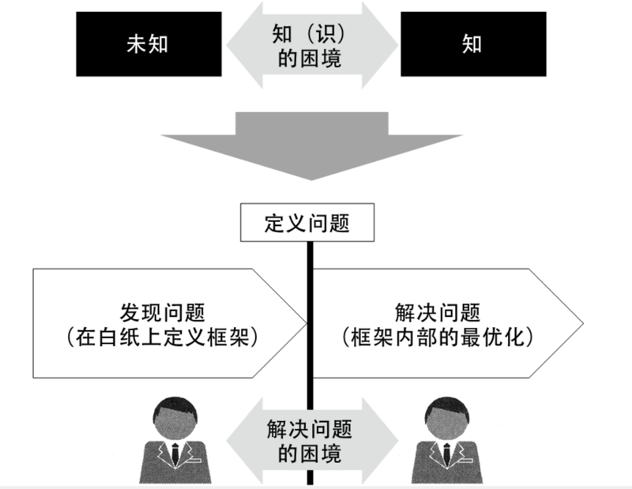
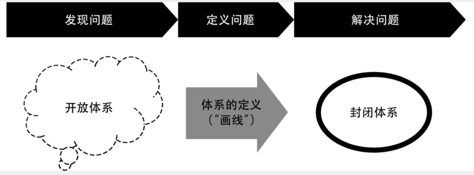
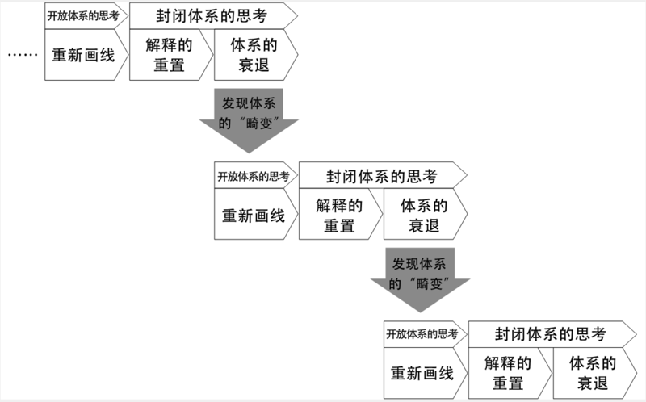
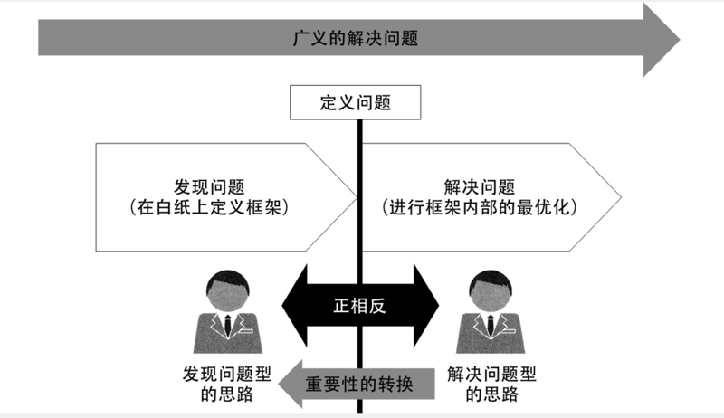
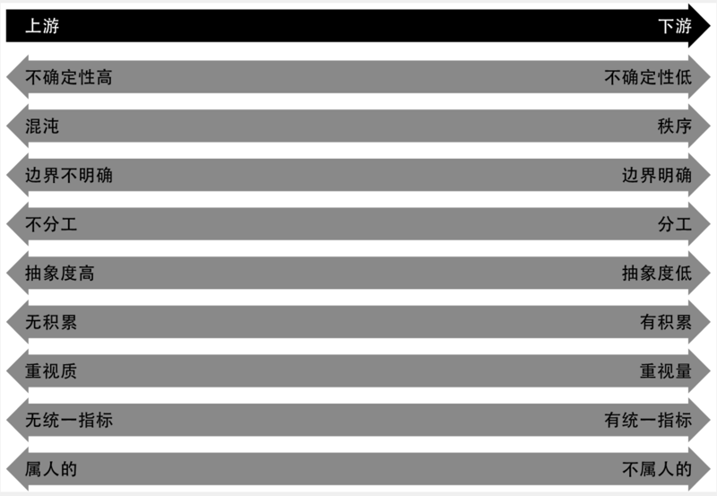

# PART Ⅱ「解决问题」的困境 —— 能「解决问题」的人不能「发现问题」

PART Ⅱ 的整体概念图

## PART Ⅱ 的要点

汇总：1）「知（识）」会对活用「无知、未知」以实现「发现新的问题」造成阻碍。2）「问题」源自「事实和解释的乖离」。3）存在这样一种结构性矛盾 ——「知（识）的困境」：人类通过「画线」拓展「知」的世界，但「所画的线」反而会在发现问题并产生下个新「知」时变成障碍。4）一旦为了「便于解决问题」而定义「封闭体系」，就会引发造成下个问题的「封闭体系的困境」。5）存在这样一种结构性的「解决问题的困境」：「解决问题」和「发现问题」各自所需的价值观和技能有着 180 度的不同，也就是（狭义的）解决问题的人不能发现问题。

PART Ⅰ 阐述了意识到「未知的未知」这一领域的存在对于发现问题的重要性。至于为什么重要，是因为我们已知的领域非常有限，倘若局限在其中思考，终归只能解决片断的、表层的问题。尤其在当今这个时代，重要的不是解决既有问题，而是发现并定义问题本身。因此，不带预判和偏见地思考「根本问题是什么」的能力至关重要。

PART Ⅱ 将说明一种结构性的困境 —— 由于「解决问题」和「发现问题」各自所需的价值观和技能有所不同，导致擅长（狭义的）「解决问题」的人不能「发现问题」。「知（识）」会妨碍发现问题这一「知（识）的困境」、画线容易造成下个问题这一「封闭体系的困境」以及由于「封闭体系」的「闭锁性」而迟迟不能发现下个问题这一根本性的「解决问题的困境」，这些都是真实存在的。

## 2.1「知（识）的困境」

发现问题与解决问题的思维的根本区别在于此前论述的「知」的性质。在 PART Ⅰ 中，已将「知识」定义为事实和解释之组合的静态快照。积累知识这一行为本身，会成为发现下个新问题时的障碍。

半导体内存大体分为可读取但不可写入的 ROM（Read Only Memory）和能够自由写入的 RAM（Random Access Memory）。有一种 ROM 叫 PROM（Programmable ROM），用户只能在最初写入一次数据，然后就只能读取不能写入。人类的基本思维，不是在很大程度上跟这种 PROM 很像吗？当然从物理上讲，人类的记忆装置应该近似于 RAM，但在实际操作时，每当重写的次数增多，速度就会变慢，内存泄漏和运行紊乱都会加速增多。

虽说「三岁看到老」并非真理，但在工作和私人生活中，难以跳出最初记忆的思维方式是很常见的。在这种场合，关于事实的「重写」比较简单，但关于「解释」的「重写」则很难。因为很多时候，我们连特定的解释被深埋在脑中这一「未知的已知」都毫无察觉。

例如，在进化迅速的 IT 等技术更新换代的时候，这样的事象就会被如实地呈现出来。键盘世界里的传呼机 → 按键手机 → 智能手机触屏手写板的变化、「金钱」世界里的现金 → 信用卡 → 电子货币的潮流，还有购物也从实体店发展到网购等变化，都是常见的例子。从通过「一种做法」记住的价值观和程序中脱离出来是很难的。在更新换代的时候，过去的经验反而会起消极作用，比起从零开始的新一代人，不得不从「负债状态」开始。

当然，记忆新的技术用语、「升级」技术信息还是可以做到的，但诸如「文字的输入方法」和以特定技术为前提的「生活习惯」，则很难跳出最初的记忆。曾经记住的价值观是无法轻易舍弃的，这是「知（识）的困境」的根本原因。

### 2.1.1「问题」源自事实和解释的乖离

随着时代发展，各种各样的事象正在发生。根据本书的定义，这一个个「事实」本身都具备超越了时间（When）、地点（Where）、个人（Who）的普遍性。与之相反，解释则应该是经常随时代在变的。为了使其成为「可再利用」的知识，必须截取某个「快照」并做静态固化处理。因此，解释并不具备超越时间的普遍性，所以在环境急剧变化的时代，很多东西都会因过于陈旧而失去作用。正如 PART Ⅰ 中所指出的，所谓知识，便是这些东西固定下来的，所以会引发问题。

自然科学中的事实（天体运行、物理现象等）是发生在自然界的现象，所以基本事象并不会发生很大的变化，但人类和动物的行为在社会等因素的影响下，会随着环境的变化而发生巨变。尤其是在技术飞速发展的当代，人类的行为特性也会发生变化。

在这样的状况下，通过时间轴来看，事实和解释就会发生乖离。然而人类的认知并没有那么灵活，基本上是保守的，所以固定下来的解释会长期盘踞不去。就这样，解释不得不在某个期间固定下来，但实际正在发生的事情却是时时刻刻变化着的，所以事实和解释之间会发生乖离，因而引发问题（图 2-1）。

图 2-1 事实和解释的乖离

例如，单词和语法的关系便是其中的典型代表。所谓语法，是指将用于交流的单词（一个个事实）通过某种模式进行解释并固化。如此一来，学习语言的方法就会形成体系，效率肯定能得到飞跃性的提升。然而对应每天的单词变化，单词和语法之间就会发生乖离。

再比如，法律、规章等也适用于这一模式，商业中的「业界」和「习俗」同样如此。中途发生「事实和解释的逆转现象」，由此产生二者的乖离，即所谓的「本末倒置」状态。这种状态会引起各种各样的问题：例如不符合实际情况的过去的法律、规章得不到修订，现实因为遵循「旧解释」而被扭曲…… 简直不胜枚举（不过，「规章至高无上」的思路并不会产生这样的「扭曲」）。

也就是说，实践发现问题的关键在于认识到这种机制并找出偏差。

人类的语言能力也是建立在「分、连、画线」之上的，所以封闭思路的人和开放思路的人在理解方式上并不相同。例如，日本人把口语发音限定为「五十」，只要听到某种语言，就会「分割」成五十音来认知。就好像大脑里有五十个箱子，把听到的读音与其中最近似的箱子相对应。

如果只生活在说日语的世界里倒是没什么问题，可一旦想理解外语，这样做反而会变成障碍。原本只是为了促进理解、发展智力活动的日语读音的「五十个箱子」，却也想套用在外语身上，结果只能「用片假名表现」。日本人分不清 L 和 R 的原因就在这里。由于日语中的「箱子」数量有限，无法准确对应，导致「rice」和「lice」的读音听起来完全一样。

这也是受困于「解释」而无法准确把握「事实」的一个例子。好坏暂且不论，尚未形成「解释」这一过滤器的小孩子能够准确地学习并掌握外语，就是一个有力的证据。同样地，关于 Digital 一词的日语写法，在「封闭思路」的人看来，「哪种写法正确」是讨论「正确的外来语」上的大问题，而在「开放思路」的人看来，这是一个「无所谓」的问题。因为 Digital 就是 Digital，用其他语言如何解释，归根结底只是手段，而「事实只有一个」（通过语言而发音的单词）。

### 2.1.2 创新者是指「重新画线」的人

只要记住这个结构，「创新」与思路的关系就会自然呈现。所谓创新，便是找出发生在事实和解释之间的「畸变」，展示与之相对的「新画线」并使其具象化。这里「畸变」的原因主要是重大的环境变化，例如技术革新、社会潮流的变化等。世间的规则，其形式多为「oo 以上适用，oo 以下不适用」，而随着时间流逝，在某个位置「画过线」的事物就会发生畸变。

诸如补助金的发放标准、选区的地域划分等由过去的状况或规则决定的东西，很多都不再符合现今的实际情况。例如，「组织」也是要「画线」的，一旦根据不同地区、不同业界确定了负责人，大部分人都会按照「因为我是 oo 的负责人」来画线，确定工作范围。随着环境变化，这部分就会发生畸变（而且大部分人和组织意识不到这种畸变，仍会强行遵照旧有规则行事）。

假如说，像这样永远固执地遵守「无形之线」的人是这个世界上的多数派，那么能够找出其中「畸变」的人就是创新者。曾经画过的线是非常顽固的，即便是已经老化而丧失应有机能的事物，一旦成了习惯，就会被人当作是正确的，而那些连续变化后的「先行」事象，反而会被认为是错误的。大多数人都会做出这种「本末倒置」的解释。

如果养老金领取人的标准，或是公司、社会上的津贴发放标准等是根据标准制定时的民众状况而确定的，那么即使实际情况随着环境变化而变化，这些标准也不会改变。而且，这种边界线的周围必然会发生「畸变」。

商业中的「业界」「产品类别」「顾客类别」等也一样，一旦确定了作为某个时间点的快照的类别，相关人员就会以固化的眼光去看待连续变化的事象，从而产生「开发 oo 类别的产品吧」的想法。创新者则会把顾客需求作为「事实」去理解，试图创造出不被现有画线所束缚的产品或服务，使用当前最新的技术和概念重新画线。不过在这一瞬间，就会产生「创新的困境」。起初完成新画线的创新者，在下一步扩大这一新结构的时候，需要将已定义（重新画过线）的体系进行固化管理，所以思路本身会变成封闭性的。

对于画线后的、条件和规则已经固定的世界里的解决问题而言，电脑则显得尤为重要。20 世纪 90 年代，电脑已在国际象棋比赛中击败人类的世界冠军。在复杂性、自由度更高的将棋比赛中，电脑也几乎达到了人类的最高水平，完成国际象棋比赛般的壮举也只不过是时间问题罢了。

这些桌上游戏属于典型的「封闭体系」。由此可见，关于边界已被明确定义的体系中的最优化，人类的优势已经无从体现。与之相反，电脑所不擅长的是解决「边界未被明确定义」的「开放体系」中的问题。即使对象问题更为「灵活」，基本上也只是边界有所扩大，仍未脱离「封闭体系」的范畴。

### 2.1.3 模式识别有助于理解，模式化导致死脑筋

能够体现「画线」之功过的另一个例子是「模式识别」。它是抽象化的一种形态。按照模式识别，相较于逐一理解个体事物，人类能够同时理解多个类似的事物。只需发挥一种经验的效用，就能实现智慧的飞跃性发展。但同时，模式化也是一柄双刃剑，可能导致思维的固化。

说到「双刃剑」的一面，思维中的「框架」同样如此。在一定程度的短期内，能让初学者轻松掌握某个领域的整体思维方式和总汇项目的，便是框架。从这个意义上讲，框架也是模式识别的一种。

框架能够帮助我们找出容易存在偏差的视角死角，发现容易忽视的领域。同样的还有「模板」。从「只要付诸应用，就能轻松做出具备一定程度的品质的东西」这一点而言，模板和框架一样，都很有用。只不过，模板也是在短期内达到一定水平的情况下很有效，而在需要发挥「前瞻」的创造性时，就有可能变成累赘。

从中也能看出「在某个程度之前能起到积极作用，而一旦超过某个关键点，就会起消极作用」的结构。模式识别、框架、模板等，在「通过模式化，起初能起到积极作用，但‘思维会固化’」这一点上是共通的，其根本原因便在于前面提到的「事实和解释的乖离」。

### 2.1.4「画线」导致「出乎预料」

如前文所述，在风险管理的世界里，能把风险「预料」到何种程度是问题的关键。无论是产品的设计，还是社会、组织的设计，都不得不以有限的资源为前提，所以必须在某处「画线」，明确体系的边界条件，不然就无法解决问题。然而一旦画线，就必然会发生「出乎预料」的事态，产生根本性矛盾。风险管理本就要面对「必须对‘出乎预料’有所预料」这一结构性的困境。「因画线而产生下个问题」的事例，在风险管理中并不少见。

此外，「画线」也会成为不幸的根源。国境纷争、民族问题、选举中的一票之差，等等。我们周围的很多问题，皆源自某种「边界」，为什么呢？这其中隐藏着「画线」的本质。归根结底，「线」只是人类为了脑中的认识和理解而擅自画出的。「国境」也好，「选区」也好，「业界」也好，都是人类脑中的概念上的隔墙。有个笑话讲的是，一名乘客一边望着飞机窗外，一边问机舱乘务员：「哪儿能看见国际日期变更线？」

大概没人会真的相信国际日期变更线是实际存在的，但事实上，类似这个故事的「笑话」在现实生活中随处可见。很多时候，人们在脑中假想的画线会在不知不觉间独立出来，使人误以为它是具有绝对权威的。

「知（识）的困境」的另一个要因在于知识中存在类似向心力的东西。越是有专家之称的人，越难以从积累的知识中跳出来。开篇的便利店的例子便是如此，关于便利店货架的知识越详细，就越难做到「远离」。同样地，自己专业领域内的知识积累得越多，就越难以摆脱其中的「引力」。越是「这一行的专家」，越难提出跳出藩篱的崭新意见，反倒是「外行的视角」由于没有向心力，摆脱了预判和偏见，所以容易得到零基础的创意。

### 2.1.5 定义问题造成「封闭体系」

「封闭体系」源自定义问题。反过来讲，每定义一个问题，就会造成一个「封闭体系」。因为要想解决一个问题，就必须设定某种边界，明确区分「是问题」还是「不是问题」。发现问题 → 定义问题 → 解决问题是广义的解决问题的流程，其中的「开放体系」与「封闭体系」的关系如图 2-2 所示。

图 2-2 发现问题 → 解决问题的流程与「开放体系」「封闭体系」的关系

定义「封闭体系」的同时，也意味着问题的相关变量已被固定。「固定变量」是为了解决相关问题而将应考虑的视角固定下来，以实现其中的最优化。例如，光说「环境问题」，并没有准确地定义问题。我们是应该最大限度地减少二氧化碳的排放量，还是最大限度地提升可循环部件的比例？像这样特定「应该最优化的变量」，才算是明确定义了该解决的问题。

## 2.2「封闭体系」的困境

如前文所述，解决问题须减少维度并使之固定，然后「画线」。也就是说，为了使问题确定下来并变得容易解决，必须在定义「封闭体系」的基础上设定边界条件。然而，「封闭体系」内含有一种根本性的困境：「使问题变得容易解决」和「容易引发下个问题」。这是因为，画线会引起「固定解释导致解释与事实发生乖离」这一现象。

使问题变得容易解决，在短期内容易发展，就容易导致下个问题的产生，而发展后形成的体系也容易退化 —— 这就是「封闭体系」的困境。在热力学的世界里，有一条关于不可逆性的第二定律，通称熵增定律。该定律表明，在「封闭体系」，尤其是与外部无交换的「孤立体系」中，熵这一物理量只会增大，不会减小。简单来说，熵的增大就是指体系内的「杂乱性」增加，趋向平均化。

前文所述的组织作为「封闭体系」，同样适用「不可逆性」的定律。成长和退化以不可逆的形式同时进行，这一点也与本条定律一致。

### 2.2.1「封闭体系」和「开放体系」的循环

像这样，人类通过「画线」使工具和文明得以进化，同时因为画线，向下个世界的转变又会变得很困难。人类就是在与这种根本性矛盾的斗争中生存至今的。如此巨大的洪流，适用于国家、企业等组织及其他几乎所有体系，是不可违抗的。由于「画线」，一度已成为资产的那些「知」，随着时代变迁变成了「负资产」。相对于身为该时间点上的权力阶层的主流派，作为革新者的「挑战派」可以说始终在反复消除其中的畸变。该流程可表现为一个循环，如图 2-3 所示。

图 2-3「封闭体系」和「开放体系」的循环

首先出现的，是为混沌状态「画线」的人。主要是准确理解那些悄然出现的社会或自然倾向并将其总结成规律和理论的学者，以及开发那些能够满足该时代模糊需求的企业或服务（等「体系」）并提供给消费者的企业家，又或是将自然聚集的民族形成「国家」并施政的执政者。

如此被定义的种种「体系」，会作为「封闭体系」完成进化，而且在满足该时代民众需求的同时，作为体系的完成度会逐渐提升，但此时必然会发生「封闭体系的困境」。只要创造了固化的「封闭体系」，这种情况就是绝对不可避免的。因为社会和自然事象是连续变化着的，而管理这些事象的体系或机构则是固定的，只能做到不连续的变化。这里所说的「封闭体系」，可以知识、产品、服务、行政单位等为例。

也就是说，其间必然产生偏差，出现体系本身逐渐衰退的机制。人类就是这样使文化和文明随着发展而衰退、然后再次出现下一个新时代的创造者，继而促进下一个文化和文明的发展。《平家物语》中所说的「盛极必衰之理」，其根本原因便在于这种机制。

因此，只要人类持续活动并在脑中为之「画线」，「问题」仍会在包罗万象的一切场所继续发生。人类凭借高度发达的智慧解决了各种各样的问题，然而讽刺的是，其高度发达的智力还不断催生了新的问题。这是一种「知的敲诈勒索」。

### 2.2.2「公司」这一「封闭体系」也会成长、退化

「封闭体系」和「开放体系」，往往会经历与商界中的企业、业界或特定的产品、技术相似的过程。这是因为，黎明时期的先驱大多会「在白纸上画线」，定义「封闭体系」，通过创造一个闭锁性的世界来享受先行者利益，并砌起一堵「墙」以牵制、阻碍后来者进入。从技术上讲，「专利」便相当于这堵墙，技术也多未实现标准化，而是以各自不同的规格呈现出差别。

接着，先行者会使该「封闭体系」在闭锁状态下完成。正因为是「封闭体系」，外界干扰很少，所以这一阶段的完成用时较短。然而在多数场合，「封闭体系」此时会遇到障碍，原因在于「封闭体系」的困境的出现，即「质」的进化很快，但「量」的进化，即扩大的速度太慢，因而造成严重的负面影响。

「创建公司」是定义了「公司」这一「封闭体系」的组织，相当于定义了该公司想要解决的（社会或生意上的）「问题」。从这个角度出发，适用于「封闭体系」的定律仍然适用于「公司」这一组织。「存在中心和序列」是定义并维持「封闭体系」的原则，它也同样适用于公司组织。公司里明确存在「具有超凡魅力的经营者」「独揽大权的创业者」这一中心，以及「组织阶层」这一序列，而且它们越是牢固，公司就越能快速成长。然而，这样的结构有着排他性、内向性等消极面，也容易跟不上环境的变化。

从这一点上讲，以员工迅速「毕业」为前提的招聘公司，作为一个组织，其「体系」的存在颇值得关注。如果不把该公司看成一家公司，而是当作一个包括「毕业生」在内的生态系统来看，那么从该体系本身呈外向性成长这一视角出发，可以说它是日本企业中罕见的近于「开放体系」的机构。

### 2.2.3 同样适用于人类的「封闭体系」的困境

「封闭体系」和「开放体系」的讨论也适用于人类活动。这里假设对外界持有强烈排他性思维方式的人属于「封闭体系」，能够灵活接受他人思维方式的人属于「开放体系」。「封闭体系」的人，便是所谓「哲学已确立的人」。从本书的「事实和解释」这一分类而言，这类人已经为自己确立了牢固的「解释模板」，所以面对事物时的判断迅速且坚定。反过来讲，面对持有不同哲学或价值观的人或思想，他们有着强烈的排他性。

只要想想我们周围存在的这种「封闭体系」的人就会明白，能在短期内完成某件事的人，通常都是持有这种「坚定价值观」的人。也就是说，「拥有已固定的体系的人完成速度更快」这一规律在这里也适用。同样，这也是「封闭体系」的缺陷。从经验上就能理解，「不能应对完成后的环境变化」也适用于这类人。与之相反，持有「开放体系」的思维方式的人，很难构筑并确立自己的世界，但他们也有长处，那就是能够灵活地应对任何人，也容易避免「衰退」。

## 2.3「解决问题」的困境

如前文所述，「封闭体系」存在结构性的困境：易发展，但也容易衰退，并且不容易向下一代转变。「人类的知（识）」这一「封闭体系」也不例外。而且，它也适用于「问题」。可以说，这一困境的本质在于，用于解决问题的技能和价值观与用于以「开放体系」为前提的发现问题的技能和价值观在根本上是完全对立的。

下面我们来实际看一看，这一困境在商业场合是如何成为问题的。1）想开发出不被既有框架束缚的崭新的商品和服务。2）我们所需要的人才，不是顾客说什么才做什么的人，而是能够主动发现顾客的问题并提出方案的人。

在商界，不管哪个时代，这些话都会被反复提及，而且其重要性近年来尤为高涨。换言之，随着环境变化和技术革新，商业中解决问题的重要性正从下游转向上游。广义的解决问题，可大致分为上游的「发现问题」和下游狭义的「解决问题」。从这里开始，本书所说的「解决问题」均指狭义的「解决问题」。

关于「从下游到上游」的需求变化，以及随之而来的「从解决问题到发现问题」这一当前正需要的视角变化，我们下面就来论述它们为什么是必要的、是以怎样的机制产生的以及该如何应对。图 2-4 模式化地表现了「发现问题」与狭义的「解决问题」之间的关系。

图 2-4「发现问题」与「（狭义的）解决问题」

这里所说的位于上游的「发现问题」，是指「在白纸上定义（问题这一）框架」，而位于其下游的狭义的「解决问题」，则是指「进行‘已确定的框架’内部的最优化」。二者的分界线便是问题这一「框架」的定义。

以手机开发为例，「手机开发」这一问题（What）被提出之后，开发性能和功能最强的手机（How）就是「解决既有问题」。新发现了「希望能让工作和生活随时随地变得丰富多彩」这一顾客需求（Why），定义「智能手机（或平板电脑）这一新类别的产品的开发」这一新问题（What）并实现，是发现问题→解决问题这一广义的解决问题的流程。换言之，在 What 被提出的时候将其落实到 How，是解决问题；而从 Why 导出 What 本身，则是发现问题。

再看另一个例子，系统开发和导入。可以说，顾客提出「想制作这种规格的系统」这一希望（What）后，将其落实到详细规格并实现（How），属于解决问题型的业务；而通过经营课题或系统本身找出顾客希望解决的真正需求（Why），并由此提出方案，像这样的「归根结底需要这样的系统」（What），则属于发现问题型的业务。

### 2.3.1 从下游的解决问题到上游的发现问题

我们再来重新思考「上游」和「下游」这两个词。上游和下游，指的是同一条河流在时间、空间上位于前面的领域和在同时间、同空间上位于后面的领域。关键在于，本书会从「空间」和「时间」这两方面来研究「上游」和「下游」（图 2-5）。

图 2-5 上游和下游的例子

首先关于「空间」，全球范围的产品开发流程很容易理解。其空间上的流程即是：主要在发达国家发起创新，开发出拥有新概念的产品，然后新兴国家加以模仿，设法降低成本（容易让人混淆的是，在一个国家从新兴国家发展成发达国家的「时间上的」过程中，上游和下游会发生逆转，详情会在后文再作交代）。

比如，20 世纪 80 年代以前，日本主要擅长「下游」型的产品开发，体现为追赶欧美。如今，这个任务正由新兴国家承担。日本现在应该完成的任务是转向发达国家的类型，即领导创新。以往「应该解决的问题」，是在已定义的线的内部进行最优化，而今应该考虑的则是「在哪里画线」。

接下来，在「时间轴」上的上游和下游，是作为一个工作或企业从开始阶段到最终阶段这一生命周期的进程。以公司为单位来看，通过创业而诞生的新锐公司是所谓的「最上游」，它会随着自身成长和企业并购带来的「人力、物力、财力」而变大，最终成为传统型的大企业，即「下游」。就商业的「实质」而言，其流程也是从开发新产品、新结构的创新这一上游阶段，转向高效的运营这一下游阶段。

同样地，作为时间轴上的上游和下游，一无所有阶段的创意和企划通常是上游，将其落实到具体计划上的执行则是下游。例如销售，把握难以捉摸的顾客需求并使之成形，便是上游；以商谈的形式为顾客明确而具体的要求提供具体的商品或服务，则是下游。

再以人的一生作比，上游就好比孩子，下游就好比大人（老人）。无论组织还是社会，从上游到下游的流程，可以理解为是和人类一样的。

### 2.3.2 上游和下游是不连续的

那么，企业中为何会经常发生「转向上游」的需求呢？那是因为，上游和下游的特性有很大不同，并非简单的连续变化，有时需要把价值观扭转 180 度来考虑。如此一来，人才的技能和价值观也必须变得完全不同才行。然而这方面既耗时间，又存在种种阻碍要因，同时归根结底，这一根本性区别尚未被人们明确认识到，所以变革才会难以推进。下面就来实际看看上游和下游有着怎样的对立特性（图 2-6）。

图 2-6 上游和下游的各自特性的对比

首先列举的上游的特征，是需要处理不确定性高的、混沌的事物。组织及职责分担的边界也不明确，要求一个人灵活地完成多个任务。与此相对，下游的不确定性低，任务已被明确定义，可以细分到每个部门或负责人。上游的工作内容大多抽象度高，比如确定整体概念，或是确定大体上的基本构架。相对地，下游的工作会落实到每一步实施，同时伴随着具体的执行，所以具体性高。此外，技术诀窍和人力、物力、财力等资源的积累，在上游自然是从一无所有的状态开始的，而到了下游，就会在各方面有所积累。

至于工作本身的量，到了下游就会增多。资源的积累度也是到了下游就会加速增长。与之相对，上游更重视「质」而非「量」。下游须具备用以管理、评价多人的「共同指标」，而最好的共同指标，就是「金钱和时间」。与之相对，「重视质」的上游潜在具有多个必要指标，无须具备共同指标。本来，「考虑指标本身」就是上游的工作，使已确定的指标达成最优化才是下游的工作。此外，由于上游的工作是非定型的、创造性的，所以不论好坏，都在很大程度上依赖于个人的能力。「属人的」自然是好事 —— 这是上游的思维方式，而尽可能做到标准化、不依赖于人，则是下游的思维方式。

这些价值观并不一定是以「非 0 即 1」的方式从白变成黑的，随着从上游到下游的移动，平衡会逐渐变化，而在某个要点前后，会发生明显变化。那个要点便是「定义问题」的阶段。随着这样的流程和价值观的变化，上游和下游所需要的价值观和技能也会变得「正相反」（图 2-7）。

图 2-7 上游和下游的各自特性的对比

「从零开始创造新事物」的创新意向这一上游，需要的是创造性。相对地，指标已经固定、在指标中「使 80 分的东西变成 90 分或 100 分」的运营意向这一下游所需要的，则是以最佳方式解决既有问题、使相应指标达成最优化的效率性。此外，在不确定性较高的上游，重要的并不是详细分析过去的数据、通过只做有胜算的工作来「使一切走向胜利」的「决定论」的思维方式，而是在进行一定程度的尝试后，插入一定比例失败的所谓「概率论」的思维方式。

从「个人还是组织？」这一视角出发，在依赖个人能力的上游，怎样才能发挥个人的能力是重中之重。相对地，在要求多人高效运作的下游工作中，即使压制个性，也要优先确保组织性能的最大化。也就是说，在上游是「个人 > 组织」的关系，在下游则是「组织 > 个人」的关系。

在抽象度高的上游，需要的是抽象化的思考能力；在现实行动最重要的下游阶段，首要的则是具体的行动力。在技术诀窍得以积累的下游，知识量很重要；在要求从零开始的创造性的上游（由于原本就没有积累的知识），需要的则是将有限的信息与过去的类似知识组合、联系起来从而创造新事物的想象力和创造力。此外，上游并未确定工作分担，始终要求灵活柔软的姿态；而在下游，从组织秩序的角度来说，也不希望个人轻易脱离被分配的任务，所以对遵守规则的依从姿态有着强烈的要求。

上游时刻要求主动性，因为没有人提供指示，毕竟「发现问题」本身就多是主动的行为。相对地，在下游，为了确保组织的秩序，对于「服从上级的命令」或「切实履行手册化」等被动姿态则有着压倒性的要求。

### 2.3.3 社会、企业、学校被「下游」最优化的原因

如前文所述，在当前环境下，出于种种原因，存在向「上游」转移的需要，因此要求相应的价值观和技能。然而，社会、企业、学校大多已被下游的思维方式最优化了，因此存在这样的结构性矛盾 —— 尽管真正需要的是适合上游的人才，却无法培养并充分发挥其能力。

为何世人会依据「以下游为中心的价值观」行动呢？此外，各种领域均在掀起从上游依时间序列「被冲向下游」的潮流。这种情况又是以怎样的机制发生的呢？下面，我们尝试通过「上游」「下游」这两个词的存在基础，即河的类比来进行思考（图 2-8）。

图 2-8 上游、下游的「河」的类比

#### 原因 1：下游总是多数派

首先，第一个原因在于，河的水流（水量）会随着流向下游而增多。也就是说，「下游总是多数派」。例如，不管是商品的企划，还是城市、社会的设计，真正的初期计划往往是在少数人（通常是「一人」）的脑中开始的，直到该计划被具体化，来到详细的设计或构筑阶段，才会有多数人参与进来。

而且越是往下游去，越会从有限的少数人所做的决策变成「多数人所做的决策」，形成基于「众多顾客呼声」和「积累的数据」的决策方式。也就是说，「多数派」的意见更容易通过。而且在上游，河底多是「尖锐的大石块」，而到了下游，随着水流的「冲刷」，细小的圆石子就会变多。也就是说，下游世界是由平均化的多数人所支配的。

在这种状况下，依靠特定个人的力量推动工作的上游式思维退处劣势，可谓是必然的结果。

#### 原因 2: 驱动世界的下游

第二个原因在于，除了「量」的问题之外，即使从「执行和运营」这一「质」的角度来看，在每天驱动世界、公司、组织「运转」的人里，下游的人也占据了压倒性的大多数。人力、物力、财力等用于执行的资源，基本上存在于「下游」。这些丰富的资源并不会轻易流向「无形的」创意和创造性，其运转总是以下游为中心的，所以这个世界显然也会以下游为中心运转。

此外，乍一看很光鲜的上游的创意，大多只是不涉及人力、物力、财力的纸上空谈罢了。当然，如果这种纸上的「大创意」不启动，执行就无从谈起，但在绝大多数场合，具体成形还是在进入下游阶段后才实现的。

#### 原因 3：下游的具体性便于所有人理解

第三个原因在于，下游「更容易理解」。下游有多数人参与，而且具体地「形成可见的形式」，而上游的理解难度则相对更高。下游的工作经过标准化，属人性质被排除。说得极端些，就是内容「便于所有人理解」。越往下游去，「任何人都能理解」的东西越会被优先考虑。下游的决策基本上是「多数决定」，所以能够确保多人理解的内容存活下来，可谓是必然的结果。

如此一来，占少数的上游的「难以被多人理解」的价值观便自然没了生存的余地。这也是「下游化」在组织、社会中加速发展的原因，恰如「水往低处流」。

#### 原因 4：从上游流向下游的水流是「不可逆」的

「水往低处流」这句话适用于一切事物。从上游流向下游的水流是单向的，绝不会往回流，也就是不可逆的。可以说，前面所讲的上游和下游的特性的变化也一样。水流一旦流向效率性，就不会重新回到创造性。一旦由多数派执行的标准发展起来，就不会再回归原来的状态。「下游」这个状态会悄然无声地发展下去。因此在相同的体系中，走向下游这个状态总是会永不后退地单向发展下去。

如此一来，从本质的性质而言，自然总是会在无意识中形成「下游占优」的社会和组织。而且在一个社会或公司等社会体系中，「下游」会不可逆地进行下去。然而讽刺的是，「不可逆地变为下游」越是进行下去，就越会出现重新创造新河流的「上游需求」。而且，由于上游的需求与下游的特性有着 180 度的不同，所以会潜藏着靠自然水流无法消除的结构性矛盾。这就是本书所说的「解决问题的困境」。

与此同时，为了实现着眼于「无知、未知」的发现问题，我们还要思考：上游的人才需要具备怎样的价值观和技能组合？社会、企业等组织要怎样做才能活用这些人才？