# PART Ⅲ「蚂蚁的思维」vs.「蝈蝈的思维」—— 从解决问题到发现问题

PART Ⅲ 的整体概念图

## PART Ⅲ 的要点

要点汇总：1）明确「解决问题的困境」的原因在于解决问题型的思路与发现问题型的思路不同这一对立结构。2）二者的不同特征可归结为「存量 vs. 流量」「封闭体系 vs. 开放体系」「固定维度 vs. 可变维度」这三个根本要因。3）通过「视储存为美德、有巢、在二维世界中行动 = 蚂蚁的思维」与「视使用为美德、无巢、在二维和三维世界间往来 = 蝈蝈的思维」的类比，将二者的行为原理加以对比。4）对社会、企业中的蚂蚁和蝈蝈的对立结构进行整理，寻找共存共荣的办法。5）关于发现问题所应着眼的「奇点」，思考从两种思路研究的重要性及其方法。

PART Ⅱ 阐述了解决问题与发现问题在思路上的巨大差异，指出了存在「解决问题的困境」，还分析了「解决问题的困境」为何会成为导致上游和下游之间产生裂隙的根本原因，以及社会、企业、学校均被「下游」最优化的原因。我们平时能够隐约意识到，解决问题与发现问题在思路上存在巨大差异，但往往并不明确。

在 PART Ⅲ 中，我们将把活用「无知」的发现问题的思路与解决问题的思路进行对比，突出二者的差异，明确活用「无知」需要满足哪些条件。这里将利用「蚂蚁和蝈蝈」的类比，因为发现问题与解决问题在思路上的三个明显不同点，与蚂蚁和蝈蝈的特征是一致的。发现问题型 = 蝈蝈，解决问题型 = 蚂蚁。

要想消除「解决问题的困境」，不能单纯对表面事象和行为模式进行类型化，而要聚焦于根本的「思路」，讨论「为什么」会形成相反的行为模式和对立结构。此外本书还会讨论，要想把活用「无知」的发现问题的思路以及蝈蝈思考法运用于企业等组织、集团时，需要满足哪些条件。

## 3.1「蚂蚁思维」与「蝈蝈思维」的差异

正如前文所述，指向用于解决问题的「下游」的创意，与指向用于发现问题的「上游」的创意，在价值观和视角上有很大的不同。我们平时需要的主要是解决问题型的思维，无论学校、公司还是日常生活，大致都被这种价值观支配着。这种价值观大体上来说正确，但在「发现问题」的场合，则有可能变成阻碍。这就是「解决问题的困境」。因此，为了将目前占统治地位的解决问题型的价值观转变为当前急需的发现问题型的思维，必须彻底逆转齿轮的转向。从「重视知识」的思维方式转为指向「无知、未知」的思维方式，就是一个具体的例子。

PART Ⅱ 中讨论过的「知（识）的困境」的产生，源自「静态固化导致的衰退」「封闭体系」「向心力」等知识的内在本质特征。这会直接导致「解决问题的困境」。

考虑到这些因素，思维的转换大体上有三个要点：1）从「存量」到「流量」。2）从「封闭体系」到「开放体系」。3）从「固定维度」到「可变维度」。

下面我将尝试从这三个视角出发，对两种相反的思路进行对比，讨论着眼于「无知、未知」的发现问题需要怎样的思维方式。在对比两种思路的时候，将利用「蚂蚁和蝈蝈」的类比。因为蚂蚁和蝈蝈在这三个视角上是各自不同的，而且从以前被看好的「蚂蚁的思维」转变为以前受尽白眼的「蝈蝈的思维」，可谓形象生动，容易把握。

### 3.1.1 蚂蚁与蝈蝈的思维的三个差异

众所周知，蚂蚁和蝈蝈的对比来自著名的伊索寓言。在夏天辛勤劳动「蓄积财富」的蚂蚁到了冬天也不愁，而在夏天「唱歌、跳舞、游手好闲」的蝈蝈毫无积蓄，到了冬天就会陷入困境。这则寓言通过蚂蚁辛勤劳动增加积蓄的行为，教我们知道了存量的重要性。接下来，本书将提出这种一直被视为理所当然的价值观的反论。

首先列举解决问题型思路与发现问题型思路的三个根本性差异，这就是我们用「蚂蚁和蝈蝈」的类比来表现的原因。请见图 3-1。「蚂蚁思维」与「蝈蝈思维」的三个差异如图所示。

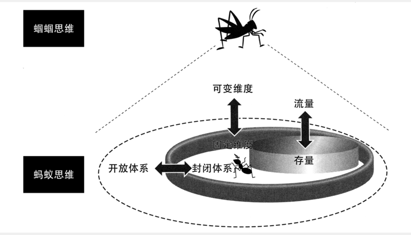

图 3-1「蚂蚁」与「蝈蝈」的思维差异

1、「储存的」蚂蚁和「使用的」蝈蝈。第一点是「存量」与「流量」的区别。主要的不同在于：是重视由智慧资产，即过去的经验和知识积累的「存量」，还是重视用后就扔掉也没关系的「流量」。想想那个著名的伊索寓言故事，很容易就能明白：「储蓄型」的蚂蚁拥有的是存量思维，而「有了就立刻用掉」的蝈蝈则是流量思维。伊索寓言中的对象是财产，即「金钱」。相较于有了就立刻用掉的蝈蝈，蚂蚁将以备将来之用的积蓄视为美德。这就是二者价值观的差异。

若把「金钱」换成「知（识）」来看，本书所说的重视知识，就是把知识当成「存量」的思维方式，而重视「无知、未知」则决不是在轻视知识本身，可以视其为「重视流量」的思维方式，也就是为了生成新知识，用后就扔掉也没关系。这便是我们通过用「蚂蚁和蝈蝈」做比喻来对比思路的最大理由。换言之，也可称为「发自已知的想法」与「发自未知的想法」的不同。

2、「有巢」的蚂蚁和「无巢」的蝈蝈。第二点是「封闭体系」与「开放体系」的区别。直接来说，区别在于：是根据自己的常识和判断基准给事物「画线」，「将其内侧与外侧分开考虑」，还是「原样不动（不画线）地看待所有事物」。有自己的「巢」的蚂蚁，会将「组织的内与外」「常识与非常识」明确地区分开来思考。与之相对，没有「可依之巢」的蝈蝈则会「不画线」地、一视同仁地看待事物。

3、「二维」的蚂蚁和「二<=>三维」的蝈蝈。第三点是「固定维度」与「可变维度」的区别。简单来说，就是基本上只能进行前后或左右这种「二维」动作的蚂蚁，与必要时可以选择进行「跳跃」这种「三维」动作、「能在二维和三维之间自由往来」的蝈蝈的区别。这里所说的维度，指的是「对象问题的变量」。把变量的种类固定下来进行思考的是蚂蚁，使变量的种类出现增减等变化来思考的是蝈蝈。

总结上述思路的三个差异即为：「重视解决问题」的蚂蚁「重视存量」，并且在「封闭体系」内以「固定维度」进行思考；蝈蝈则「重视流量」，在「开放体系」内「自由增减维度」。在后面的章节中将会针对这三个差异和行动模式的不同逐一进行讲解。

### 3.1.2 判断是蚂蚁还是蝈蝈的检查表

你或你周围的人，是有着「蚂蚁的思维」，还是有着「蝈蝈的思维」？哪一方的倾向更强？请使用图 3-2 的检查表，判断自己（或周围的人）属于哪一类。

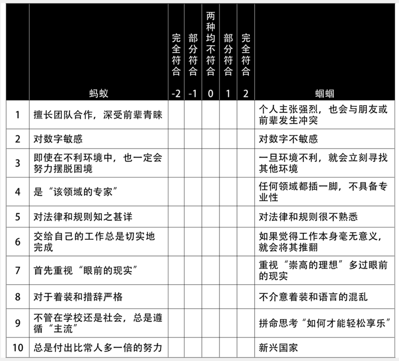

图 3-2 判断是蚂蚁还是蝈蝈的检查表

1『蚂蚁之于蝈蝈，如同刺猬之于狐狸。（2020-12-13）』

总分在 -20 和 +20 之间。作为一个大概的衡量标准，可以说，低于 -10 分的人明显有着「蚂蚁型的思路」，高于 +10 分的人明显有着「蝈蝈型的思路」。根据检查表的内容，总结先前导致「思路的三个差异」的行为特性，可以得出蚂蚁与蝈蝈的不同如图 3-3 所示。

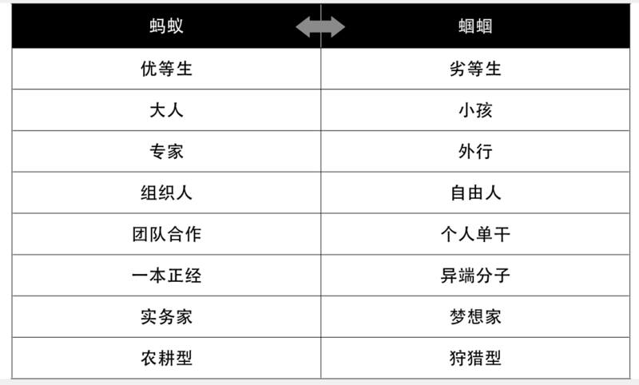

图 3-3 蚂蚁与蝈蝈的不同

请逐一观察，看看思路和行为特性上的这些不同，究竟是通过怎样的对比体现出来的。

当然，蚂蚁和蝈蝈不一定像「非 0 即 1」那样能用数字分割开来，二者的要素在每个人身上都是同时存在的。而且在一个人的人格之中，会根据场合区分使用二者的功能。例如在工作中，可能蝈蝈的要素更明显，而在家庭中，则是蚂蚁的要素更明显。正如表中所示，蝈蝈是「小孩」，蚂蚁是「大人」，随着时间流逝，曾是蝈蝈的要素往往会变成蚂蚁的要素。

蚂蚁是存量型思维，这意味着一个人一旦开始积蓄，就很可能从蝈蝈型思维变为蚂蚁型思维。随着年龄增大，人会逐渐积累经验，建立地位和财产，增强专业性，提升自己对组织、集团的归属感 —— 这些都是推动思维向蚂蚁型转变的要因。

本书将基于这样的背景，将两种思路进行对比。此外，本书之所以使用各种形式，在「二分法」的结构下进行讨论，是为了将那些要素作为不同视角明确区分开来，明确各场合的论点及其视角，避免无用的对立，各尽其才地活用各个特性。希望读者理解这一点。

后文还会谈到，「二分法」的视角与单纯的「二选一」有很大的不同。本论并不是在进行「是蚂蚁还是蝈蝈」这样单纯的「是 0 还是 1」的二选一讨论，而是在揭示「解决问题」和「发现问题」中的视角。希望读者能够充分理解这一点，然后再去阅读后面的讨论。

在这部分，本书不会将二者理解为表面的对立事象，而是根据二者的思维和行为模式源自「思路的三点差异」这一脉络，配合其结构性理由，阐释这样的差异「为什么」会发生。思路的三点差异未必是完全独立的，下面就对其进行大致分类，说明彼此的不同。

## 3.2 从「存量」到「流量」

首先阐述第一点的「存量」与「流量」的差异。伊索寓言里「蚂蚁和蝈蝈」的故事，描写了在夏天辛勤储存粮食以备冬用的蚂蚁，以及在夏天有什么就用什么，结果到了冬天没有任何积蓄的蝈蝈。也就是说，蚂蚁重视「存量」，蝈蝈重视「流量」。

### 3.2.1 当蚂蚁的美德瓦解时

在这则寓言里，「蚂蚁是善，蝈蝈是恶」的一面体现得非常明显。然而在当代环境中，这一关系有时会发生逆转。例如，为了引发能够摆脱因循守旧状态的「破坏性创新」，需要将以往的积蓄重置，在「零基」上进行思考。要想实现「在白纸状态下思考」，关键恰恰在于能否将以前作为存量所积累的资产全部抛弃。而且这里所说的存量，一般是指包括「人力、物力、财力」，即人力资产、物质资产和金融资产在内的品牌、技术诀窍等。

在解决问题的阶段，资源是不可或缺的。问题的解决方案确定之后，要想落实到执行上并取得成果，「人力、物力、财力」自然不可缺少，而且通常是「越多越好」。所以，蚂蚁才会有平时把能积攒的东西积攒起来的想法。再加上发现问题与解决问题的这种本质结构的差异，使得作为商业中智慧资产的知识的定位，也正从「重视存量」变为「重视流量」。

环境变化对此影响很大。首先能够举出的一大要因，是 ICT（Information Communications Technology）的发展。由于互联网和云端存储的发展，知识和信息成为能在网络上随时检索的共有财产的趋势越来越明显。这是因为，「作为存量的知识」不再由企业个体和个人把持，而是由作为共通仓库的云端和互联网来存储。也就是说，对于企业个体和个人而言，知识和信息从「积攒」变成了「使用」。SNS 的普及，也使交流中的信息从存量变成了流量。「时间线」将信息理解为流量，「曾经问过的问题的答案，要向过去的存档中寻找」是存量式的想法，而「再问一遍能更快地得到答案」则是作为流量的时间线的想法。

此外，当代商业环境的变化显著加快，也是出于「知识流量化」的推动。在变化极少的环境里，「因循守旧」进行思考，大多能得到好的结果，所以存量型的思维是有利的。而在变化激烈的世界里，「过去的知识」的价值会相对降低，如此一来，需要在各方面把知识和信息当作流量的场合就会增多（「新鲜的蔬菜」不可能统一贮存整个冬天的量）。

当然也有人认为，通过网络得到的知识难堪大用。这种意见自然不无道理，但尤其是关系到「事实」或「可重现」的知识，网络上的信息肯定正在飞跃性地增多，所以确实存在向这个方向发展的趋势。

### 3.2.2「有产者」与「无产者」的区别

存量思维与流量思维的区别体现为：不管在哪方面，一方是「发自现有的东西」的想法，另一方则是「发自现在没有的东西」的想法。重视存量的思维，就是所谓「有产者」的思维。知识也好，物品也罢，总之蚂蚁已经积累了一份财产，所以会思考「怎样才能最大限度地活用现有的东西」。这自然就成了「重视守护」的思维。以知识的世界来说，这样的思维很难向颠覆既有定论的方向发展，因为一旦那样做了，自身地位这一存量就会受到威胁。

在商界，最先需要考虑的是如何最大限度地活用既有顾客、技术、工厂设备等「现有的东西」，所以很难产生引入全新结构的想法。由于重视「现有的知识和经验」，无时无刻不对「去年的实绩」和「竞争对手的事例」有所意识，将一切事物的「积累」都视为美德，所以总是因循守旧地考虑问题。

目前已在业界内建立起一定地位的企业，自然是「蚂蚁型思维」，即使在同一家企业内部，比起弱小的事业部，拥有强大产品的事业部的蚂蚁型思维也更明显。品牌也一样。已经拥有「口碑和名声」的组织或个人，会想方设法地守护这些东西。因此，所谓的「沉浸于过去的成功体验中」也是蚂蚁型思维的弊端之一。

蚂蚁始终认为，自己现在所属的组织或业界的规则、常识、社会规范都是「理所应当」的。对于蚂蚁而言，它们就是思维的「牢笼」。与之相反，流量型的蝈蝈是「无产者」的思维，其意识始终从「现在没有的东西」出发，指向未知的事物。蝈蝈对「囤积」毫无兴趣，总是觉得「使用才有意义」。对于蝈蝈而言，存储在互联网上的海量信息大概是绝佳的「食材」吧。

此外正如前文所述，二者的结构未必一定要简单地分成「蚂蚁型思维的人（或组织）」和「蝈蝈型思维的人（或组织）」。哪怕只是一个人，即使（暂且不论好坏）在自己的「外行」领域里能够进行蝈蝈型的思考，一旦到了自己的专业领域或「有东西要守护」的领域，往往就会不可避免地变成「蚂蚁型思维」。

因此，并不是说「创业家」就能一直秉持蝈蝈型思维。一旦事业步入正轨，业绩和组织规模扩大，自然就会变成「有产者的思维」，然后要么在不知不觉间彻底变成蚂蚁的守护型思维，要么由于无法适应或不想适应而变成「连续创业者」，离开自己创建的这家公司，重新回到能够活用蝈蝈型思维的创业阶段。也可以说，二者的区别在于，一种是喜欢定居的农耕型思维，一种是不定居的、频繁搜寻新猎物的狩猎型思维。

### 3.2.3 从「未知」=「不知道的事」开始思考的蝈蝈

在安定的时代，蚂蚁的存量型思维是有利的，但是缺乏变化。一旦到了变化剧烈的时代，就像好不容易积攒的金融资产瞬间化为乌有一样，知识资产也有可能一下子变得毫无用处。在环境变化迅速的世界里，知识资产的衰退是不可避免的。对于某个时代或领域的专家而言有用的知识资产，到了下个时代反而会变成「负担」。正如「行李多的人」搬家很麻烦，这同「动作迟钝」的结构是一样的。

像蚂蚁这样对变化表示抗拒，原因正在于「存量型思维」所导致的巨大的「惯性力」。在这一点上，流量型的蝈蝈更加灵活，能发挥「无产者的优势」，灵活地应对变化。蚂蚁的思维是「守」，蝈蝈的思维是「攻」。这在很大程度上是因为，蚂蚁有「要守护的东西」，而蝈蝈「没什么要守护的东西」。蚂蚁会从「知道自己能做到的事」开始切实执行，但对于蝈蝈而言，「已经知道自己能做到的事」便不再是感兴趣的对象。蝈蝈之所以在旁人看来「没长性」，原因便在于此。

可以说，从「知道的事」开始思考的是蚂蚁，从「不知道的事」开始思考的是蝈蝈。蝈蝈的智慧好奇心总是朝向「新的未知事物」，即便在使用知识的时候，其目标也非常明确，归根结底就是「为了创造出未知事物」。显而易见，要想在「在白纸上定义框架」的发现问题的阶段进行零基思考，蝈蝈的思维更合适。对「现有事物」顽强执着的蚂蚁的姿态在解决问题时很有效，但在发现新问题的时候，反而会起负面作用。

### 3.2.4 积蓄「已知」=「知（识）」的蚂蚁

对于蚂蚁而言，了解「现有的巢的复杂结构」是其最大优势，而且巢的结构越复杂，就越能跟其他蚂蚁拉开差距，所以这一点很关键。这一类比如果应用到业界知识上，也可以说，洞悉规制产业中的规制，是在那个世界生存下去的最佳方法。对于蚂蚁而言，洞悉现状的复杂结构就是生存技能。组织中的规则、人脉、权力斗争越复杂，熟悉「业界情形」「公司内幕」的人就越强大，越有机会晋升。对于闭锁性的组织，可以直接应用这一类比。

对于蚂蚁而言，「存钱」很重要，要么以备将来之用，要么用来提高自己的地位。与之相对，蝈蝈则认为「使用才有意义」，会把现有的东西统统用光。这就是二者在思路上的决定性差异。这种经济积蓄中的蚂蚁与蝈蝈的性格差异，同样适用于「智慧积蓄」，即知识。从蚂蚁的思维来看，辛勤地反复学习知识并积蓄起来，是对下个时代的最大储备。也就是说，重视积蓄「知（识）」的蚂蚁看着过去的成功规律和体验这一「存折余额」，会暗自窃喜。

然而，认为「使用才有意义」的蝈蝈可不会这样想。换个季节就会重置的蝈蝈，可以说「连隔夜的知识也没有」。对于蚂蚁而言，「过去的原委」很重要。过去的事永远不会忘记，因为现在就存在于过去的积累之上。与之相反，蝈蝈不会留恋过去，它只会考虑「当前」的事，决断总是不厌其烦地「变来变去」，随时都能变成其眼中最好的选择。这里也明确体现了「存量思维」与「流量思维」的区别。

## 3.3 从「封闭体系」到「开放体系」

接下来说明思路的第二点差异，即「封闭体系」和「开放体系」之间的差异。将 PART Ⅱ 所讨论的「封闭体系」与「开放体系」的区别跟蚂蚁和蝈蝈的形象联系起来，可以说就是「以巢为中心活动的蚂蚁」与「无巢的蝈蝈」的区别。就解决问题而言，「在框架内思考」是「封闭体系」的思维，除去框架思考是「开放体系」的思维。

在「封闭体系」内思考时的思路有两个特征：1）观察对象已被画「线」；2）存在内外之分。也就是说，「封闭体系」的思维是内向的。这里的「内」和「外」，指的是「包括自己」和「不包括自己」。也就是说，「封闭体系」总是以「主观」为中心进行思考，「开放体系」则拥有客观看待自身的视角。与之相反，「开放体系」不画线，没有内外之分，思维总是外向的。思路的各种差异如图 3-4 所示。

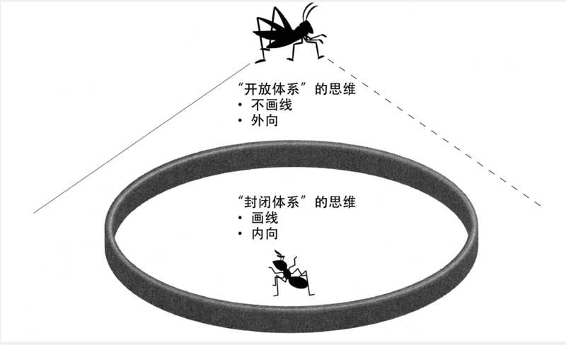

图 3-4「封闭体系」与「开放体系」的思维差异

### 3.3.1「画线」的蚂蚁与「不画线」的蝈蝈

在思考「知」「无知、未知」的时候，「画线」的意义正如 PART Ⅱ 的说明。下面再来重新确认蚂蚁和蝈蝈有着怎样不同的思路。蚂蚁画线思考，蝈蝈不画线思考。其形象如图 3-5 所示。

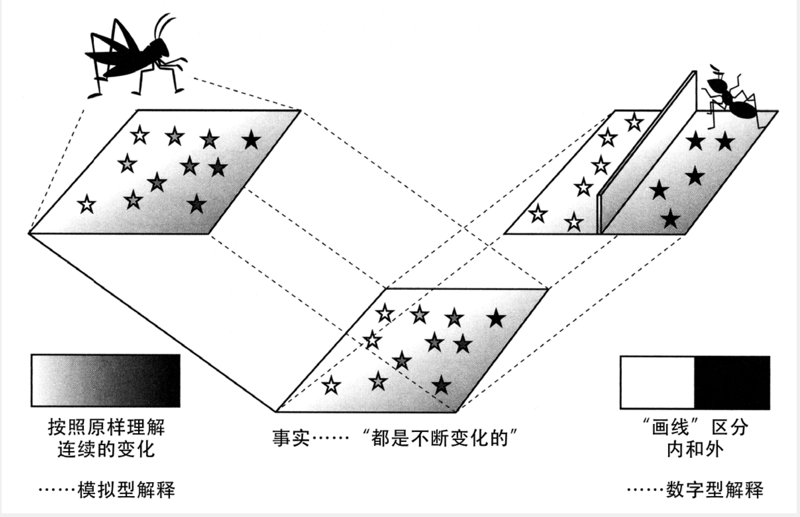

图 3-5「画线」的蚂蚁、「不画线」的蝈蝈

在图 3-5 中，位于下方中部的是不包括个人解释在内的具体的「事实」本身，与之相对应的解释各不相同。对于这些解释，蚂蚁是通过画线明确区分「内和外」来加以认识的，而蝈蝈则故意不画线，按照原样直接理解。可以说，蚂蚁的事物观（非 0 即 1 般的二值视角）是数字型的，蝈蝈的事物观（连续变化的视角）是模拟型的。其他例子还有前文所述的「业界」「组织」的画线。对于蚂蚁而言，商业中的企业或个人活动的重点在于「哪个业界或组织的活动」。如果该组织的结构是由不同部门负责不同业界，则只有明确定义了具体的负责部门，蚂蚁才会付诸行动。

相反，不论好坏，蝈蝈都是灵活机变的。面对无法明确定义具体业界的顾客，蝈蝈首先会洞悉该顾客的特性，然后若有必要，就会欣然地「重新画线」（重新定义组织）。「封闭体系」与「开放体系」的具体差异经过整理，如图 3-6 所示。下面分别解释这些特征。

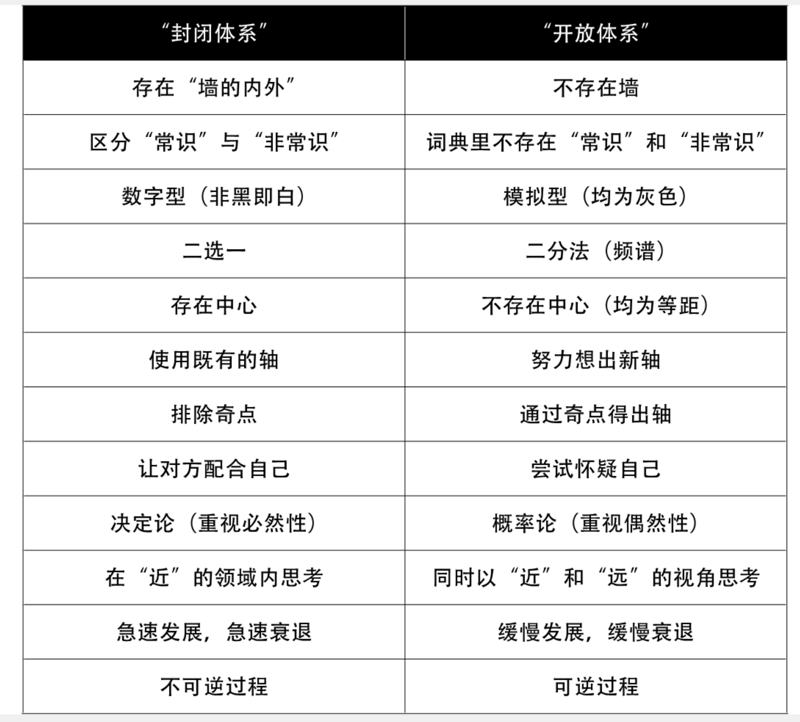

图 3-6「封闭体系」与「开放体系」的差异

PART Ⅱ 中曾讲过「画线」的功过。

下面列举几个对观察对象画线的例子。第一个是已经说过的「常识」和「非常识」的区分。孩子在长成大人的过程中，应该掌握的最重要的东西之一，便是「常识」，但常识必然会随时间而衰退。

例如，以前除了电话之外，个人之间还用电子邮件作为联络手段，但通过电话提出正式请求属于「常识」，通过电子邮件沟通要事则属于「非常识」，所以有时会频繁使用「用邮件联系，真是失礼了」这样的开场白。然而随着时代改变，现在的这一代人生活在电子邮件是「常识」的环境里，认为打电话有可能妨碍私人时间而讨厌通过电话交流的人逐渐成了多数派。由此可见，所谓的「常识」终归会随时代或状况而变，可很多人却把通过画线完成的「常识和非常识」奉为金科玉律。

蚂蚁将那些与自身群体所共有的价值观相一致的事象作为「常识」予以肯定，对其外侧的事象则视为「非常识」予以否定。与之相对，蝈蝈会把所有事象当作连续的变化去理解，所以在思考时不会有明确的常识与非常识之分。也就是说，蝈蝈的词典里不存在「常识」和「非常识」这两个词汇。

例如，蚂蚁会将自己无法理解的新一代人的行为视为「非常识」，做出二选一的判断：要么促其行为改变，使之进入「常识世界的内侧」，要么否定拒绝。相对地，蝈蝈只会觉得「有那种倾向的人正在增多」，淡然地理解事象的变化，既不否定也不肯定。

以语言来形容，蚂蚁的思维就是固执于「正确的用法」。语言这东西是随时代而变化的，但蚂蚁会用线画出「语法」等「正确的用法」，思维局限于固定视角。即便是很多人使用的「惯用读法」的词，蚂蚁也始终会从语法的角度去判断，坚持「这样才是正确的」。

相反，蝈蝈对此不会觉得正确或错误，而是会以「有 20% 的人正在使用这个词」「最近像这样说话的人越来越多了」之类的形式，原封不动地、连续地把握事实，不在其中「画线」。蝈蝈对于变化很敏感，同时会灵活应对，而且能够迅速意识到蚂蚁所画之线的矛盾之处。

### 3.3.2 重视「中心和序列」的「封闭体系」

外框和中心确定的「封闭体系」，会受到「向心力」的作用。其中存在明确的「依据」，也就是存在「巢中的蚁后」般的中心。这种向心力越强，作为「封闭体系」的排他性就越强。由此，提高体系完成度的速度会加快，但与之同时，排他性会导致体系迟迟不能适应外部环境的变化，可谓功过参半。这关系到本书一贯主张的「体系的不可逆性」所引发的困境。

在存在这种中心的场合，「序列」很重要。将组织看作一个体系比较容易理解。例如，无论国家还是组织，在「向心力」很强的独裁国家或具备超凡魅力的经营者所领导的组织中，其所依据的价值观很明确（独裁者的「哲学」），同时大多牢固地维持着以之为中心的「序列」。蚂蚁的组织即是如此，存在「蚁后」这一中心，也存在蚁后、兵蚁、工蚁这样序列明确的「种姓制度」。可以说，这也直接反映出，这样的序列最适合蚂蚁的「思维」和「行为模式」据此经营「巢」这一「封闭体系」。

「封闭体系」中不存在「下克上」。不难理解，视维持秩序为最优先的封闭组织，其不可逆发展的程度越甚，越会早早确定「阶层」。通常，在传统的大规模官僚型组织中，入职时的学历或最初分配的工作岗位几乎决定了在该公司的整个职业生涯。以「闭关锁国」和「士农工商」制度为象征的江户幕府之所以能维持日本史上罕见的「长期政权」，绝非偶然。反之也不难理解，将长期安定的组织或社会进行重置的革新者，大多奉行「不看身份用人才」的宗旨。

此外，蚂蚁「封闭体系」思维中的所谓「内和外」，就是明确区分自己所在的一侧和自己不在的一侧。因为有巢，蚂蚁会尽心竭力地守护内侧。蚂蚁总是会依据组织的逻辑及上一节所述的存量型的「有产者思维」而行动。蚂蚁的思路就是通过画线区分「对方」和「己方」，始终以「己方」为中心思考事物，否定、排除并规制「对方」。

与之相对，蝈蝈没有「巢」，所以不会带着预判去看待事物。不是「支持或不支持哪一方」，而是先从中立的视角开始观察 —— 这就是蝈蝈的立场。对于生活在以中心为顶点的序列下的蚂蚁而言，「服从蚁后」是金科玉律。要想高效地维持组织，需要大量的「依附权势」的成员。

蚂蚁不会破坏队列，基本上会「仿效排头」。相对地，基本外向且高度自由的、（在蚂蚁看来）「任性」的蝈蝈则与集团行为不相融合。蝈蝈所依据的前提条件和思路，与其工作风格密切相关。

### 3.3.3「二选一」的蚂蚁与「二分法」的蝈蝈

「画线」的蚂蚁和「不画线」的蝈蝈。我们再来从其他角度分析二者思维的差异。通过画线明确区分巢的内外的蚂蚁，容易形成「二选一」的思维。在这里，经常与二选一相混淆的，是「二分法」的思维方式。所谓二分法，是指在解释事物的时候，将以两个相反概念为「两极」的轴设为思考的轴的思考方法。本书中也出现了多种二分法的思维方式，比如「发现问题和解决问题」「蚂蚁和蝈蝈」等，它们恰恰提供了「用来思考的视角」。二分法与二选一的区别如图 3-7 所示。

图 3-7「二分法」与「二选一」的区别

所谓二分法，归根结底就是明确「对立轴」，但这未必意味着「所有事物都可分为两类」，而二选一的思维，则是认为所有事物都可分成两类。通过二分法，可以明确思考的轴（视角）。换言之，为了表现「灰色的程度」，如果明确了「白」和「黑」这两个极端，就能通过一个坐标轴和该值（程度）来表现「何种程度的灰色」。这便是前文所述的「画线思考」的思维与「不画线按原样理解」的思维的差异。正是这些差异，导致了是具体理解个体事象还是作为「概念」理解的区别，即通过上位概念理解还是通过下位概念理解的区别（图 3-8）。

图 3-8「二选一」是下位概念，「二分法」是上位概念

### 3.3.4「封闭体系」思路的优势和弱点

从「封闭体系」还是「开放体系」的角度来说，日本人的思路可用「村落社会」和「岛国根性」等词语来代表，总之毫无疑问是「封闭体系」。

例如日语这一语种，全世界懂日语的人和不懂日语的人的分布是「数字型」的。在日语能力这方面，几乎完全呈现为「会的人」和「不会的人」这种两极化（就整体而言，掌握日语的「外国人」是极少数派）。相对地，关于英语能力，假如当地人的能力是一百分，那么可以说，全世界连续分布着「二十分」「五十分」「七十分」等「蹩脚」的人。也就是说，英语是「开放体系」型的语种。

此外，「鬼在外，福在内」这句话象征性地体现了日本人的思维模式。明确意识到「内和外」，「鬼在外」，表明了让鬼出去的意思，而从「开放体系」的思维来看，则意味着「出去的鬼自有其作用」。

再比如，依照商界习惯，向其他公司的人提到本公司的人，不会在姓名后附加敬称。这也是通过画线明确区分自己所在公司内外的「封闭体系」的思维的象征。在开放式创新和外包日益发展的过程中，如此明确画线的思维往往会导致偏差的出现。

这样想来，对于擅长「在封闭体系内思考」的日本人而言，「使固定框架内部达成最优化」可以说是绝佳的成功模式。被揶揄为「加拉帕戈斯化」的、实现了日本特有进化的产品和服务，容易得到「这是在日本以外并不通用的特有样式」之类的负面评价，但同时也不乏「框架内的成果非常出色」这样的评价，可见这方面的优势也得到了充分的发挥。汽车、电机产品等也是如此，当被加上「产品」这种程度的「外框」时，使其达成最优化就是典型的成功模式。可以说，既有的日本企业很好地体现了「封闭体系」的优势和弱点。也就是说，日本人所拥有的传统思路，擅长的即是「解决问题型」而非「发现问题型」。

在研究今后的商业时，「全球化」「社会化」等关键词不容忽视，而它们无一不是以「开放体系」为前提的。此外，以 ICT 的世界为中心，「云」「平台型商业模式」等概念的重要性日益提高，而这些概念均需要定义新的体系，所以要求「重新画线」的思维。通过这些视角不难看出，发现问题型的思维，即「蝈蝈的思维」将变得越来越重要。

#### 01.「公司内部 SNS」的自我矛盾

因推特、脸书等 SNS（Social Networking Service）而在全世界得到爆炸性普及的「社交」风潮，从大的意义上讲，意味着人际交往和交流正逐渐从「画线」的封闭体系转向「线被擦掉」的开放体系。具体来说，把各种维度下的分界，包括「公司内部」与「公司外部」的分界、「私人」与「工作」的分界、「在校生」与「毕业生」的分界、「上级」与「下级」的分界等的「线」擦掉，是「社交」的基本思路。

脸书的创始人马克·扎克伯格在 2010 年 1 月于美国旧金山举办的活动现场表示：「个人隐私已不再是社会规范。」人们对此臧否不一，但这句话也证明，SNS 的根本是无公私之分的哲学。这句话的内涵与社交的基本思路是一致的。从这个意义上讲，近年来为了革新企业内的信息共享而被很多公司导入的「公司内部 SNS」，从开放体系 / 封闭体系的维度来看，实在是一个很复杂的工具。

「公司内部」明确体现了「（与公司外部之间的）墙」的意识，SNS 则意味着「开放体系」。这两个词组合起来本身就显得很矛盾。当然，这一工具是将旧有的「封闭体系」的信息共享系统置换为最新的（就 ICT 技术而言）SNS 系统。这一点是可以理解的，而且其出色的效果也不难想象。只不过，就 SNS 的本质，即从「封闭体系」到「开放体系」的「哲学转变」这点来看，「局限在公司内部的社交活动」可说是极不完善的次品。

#### 02.「横向串联」「跨职能协作」是「封闭体系」的思维

在纵向领导关系牢固、本位主义盛行的组织里，常能见到横跨组织，即所谓「横向串联」「跨职能协作」的活动。然而，这些活动中仍残留着「各组织间存在墙」这一「封闭体系」的思路，因为这样的交流中仍然残留着必须通联起来的「串」的基本结构，以及「职能」这一限制。如果目的是真正意义上的打破壁障，就要求思路本身必须转变为「开放体系」，不然就会表现出某种自我矛盾。

#### 03.「国内」「海外」事业部的命名是「封闭体系」

如今，全球化正在日渐发展。乍一看容易以为全球化 =「开放体系」，但事实未必如此。从组织的命名方式即可窥见一斑。日本企业中常见的「国内事业部」「海外事业部」等命名，就是存在「中心」、画了线的，是典型的「封闭体系」的思路的体现。

总而言之，这样的命名就是在区分日本与「日本以外」，而全球化则是将等距离看待一切「开放体系」作为前提的。从这一点来看，将所有地区以均等距离（考虑到营业额和公司优势等因素，强弱之分是免不了的）编成组织，才能称为真正的全球化。通过前面提到的 SNS、横跨组织的活动、全球化等例子，可以看出一般的公司组织是怎样由「封闭体系」的思路构成的。即使进行新的尝试，一切思路依然如此。

#### 04. 通过解释看待事实的蚂蚁与通过事实创造解释的蝈蝈

「封闭体系」的优点和缺点均在于「画线」解释事物。根据 PART Ⅰ 的讨论，画线发生于解释层面而非事实层面。因此，蚂蚁和蝈蝈对事实和解释的看法存在很大的差异（图 3-9）。

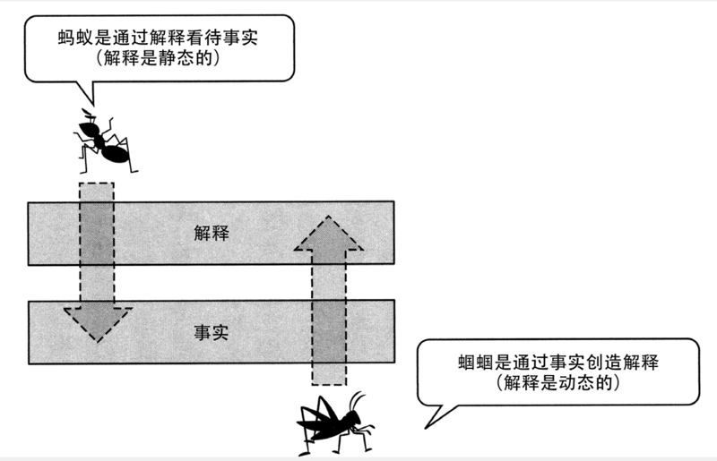

图 3-9 是通过解释看待事实，还是通过事实创造解释

对待任何事都会画线思考或视所画的线为金科玉律的蚂蚁，会通过固定的解释去看待事实，拿事实配合解释。蚂蚁把「规则」「组织的逻辑」或「世间的常识」当作判断基准，一旦现实中发生的事象与之相违，就会表现出改变事实以配合解释的姿态。

与之相对，蝈蝈并不会画下解释的线，而是按照原样去理解事实，如果觉得解释不通，就会配合事实创造新的解释。这里所说的「事实」，不一定意味着「实际存在过的」，而是指将 PART Ⅰ 所定义的「零维」解释去除的原始信息或事象（创造性活动未必全部「基于事实」）。蝈蝈若是觉得「现有的规则」「世间的常识」与事实不符，就会毫不犹豫地改变它们。换言之，蚂蚁是「静态」地理解解释，蝈蝈则是「动态」地理解解释。

#### 01. 重视直观和偶然性的蝈蝈

内向的「封闭体系」的思维，重视的是必然性和逻辑性。与之相反，外向的「开放体系」的思维重视的则是偶然性。在以已经可见或是已经成形的事物为对象的解决问题的世界里，由知识有逻辑地导出结论是常理，而在以未知为对象的发现问题的世界里，则不得不在某种程度上依赖直观和偶然。历史上的发现，往往来自偶然的失败，也可说是缘分注定。

通过纯粹的逻辑思考，绝不会得到超出作为根据的事实、信息或前提条件的结论。而且，逻辑思考的最大武器是任何人据此都会得出相同结论的重现性和必然性，而在进行真正的创造性思考时，仅仅如此是不够的。要想从未知的世界得到新的有创造性的创意，直观和偶然性是无论如何都不可缺少的。

内向的「封闭体系」的思维，是以一切问题和麻烦都能在逻辑上进行预料和假设为前提的，所以会认为一切都能防患于未然。至于「出乎预料」的事情的发生，则被认为是由于事前没有足够考虑好对策。与之相对，外向的「开放体系」的思维本就以不确定性为前提，所以会用发生后应该迅速应对的眼光去看待问题。也可以说，外向的「开放体系」的思维是以失败作为前提的。

换种说法，「封闭体系」的思维是「将一切导向成功」，对于一种创意，会细致入微地对照过去的知识，检查逻辑匹配性。相反，「开放体系」的思维从一开始就预料到，在概率上必然发生一定数量的失败，所以会肯定「一胜九负」，重视创意的「数量」。

#### 02. 从「不足之处」思考的蚂蚁与「零基础」思考的蝈蝈

「封闭体系」存在「边框」，因此不论好坏，「满分（目标水平）」是确定的，所以蚂蚁会着眼于此，思考「还有什么不足」。当杯中装有八成水的时候，蚂蚁会思考「距离装满杯子还差两成」，于是设法补满那两成水，如此则必然（从不好的角度讲）善于「对现有事物吹毛求疵」。想把八十分变成一百分的时候，需要的便是基于这种思维的行为模式。

拿工作来说，一旦反复「评价别人制作的基础方案」，就容易变成这样。例如，在外部委托占比较大的大企业里，「评价外部委托方或供货商制作的东西」的工作往往很多。一旦持续进行这样的工作，就会形成蚂蚁的思维模式并固定下来。依照前文提到的拉姆斯菲尔德的框架，蚂蚁关注的是把「已知的未知」变成「已知的已知」。在这里，「已知的未知的外框」就是「杯子的上限」，而改变这一上限本就不在蚂蚁的思考范围之内。

与之相对，蝈蝈的工作多是在杯底只有薄薄一层水的状态下进行的。而且，蝈蝈认为「杯子的上限」只是假想出来的东西，所以光是装满杯子并不会令蝈蝈感到满足。蝈蝈总是把视线对准「杯子的外侧」，所以会考虑「要是准备个大水桶，多少水都能装得下」。

换言之，由于蝈蝈是将意识指向没有边框的「未知的未知」，所以是永无上限的。日本人之所以擅长「改善」，或许在很大程度上便是源自这种结构。因为「封闭体系」的思路的最大优点，即在于使某种程度上存在边框的事物趋于完美。

#### 03. 不在意他人嘲笑的蝈蝈

生活在「封闭体系」里的成员，彼此之间的关系基本上也是固定且闭锁的。俗话说「枪打出头鸟」，置身其中的生存技巧便是与别人处在同一条水平线上，不显山露水，老老实实地工作。出众、显眼、独占功勋会扰乱集团的规则。同时反过来说，也不会让任何一个成员掉队。这就是蚂蚁的组织。

与之相对，蝈蝈不会在意他人的嘲笑（或是不会逐一在意每次嘲笑）。因为蝈蝈知道，思考的「维度」是因人而异的，所以自己不被「异维度」的人理解是理所当然的事（关于「维度」，下一节会作详细说明）。蚂蚁会察言观色，蝈蝈则不会，而且蝈蝈认为费心尽力察言观色本就是毫无创造性的「无用之举」。

换言之，蚂蚁的视线总是对准「横向」（同事或其他公司的同行等），而蝈蝈的视线总是对准「纵向」（上位概念或目的与手段的关联等）。为了避免误解，这里再稍作补充。在组织里「只看上面的眼色工作」，是蚂蚁的典型的行为模式。此时蚂蚁所看的「上面」，在蝈蝈眼中只是局限在组织这个小的「误差范围」内，从组织内部这一点来说，终归还是没脱出「横向」的含义。

## 3.4 从「固定维度」到「可变维度」

在「解决问题型」的蚂蚁和「发现问题型」的蝈蝈在思路上的「三个视角的差异」上，本节将对最后的「固定维度」与「可变维度」的区别进行说明。在思路的三个差异当中，本节的视角或许是最难以直观理解的。蚂蚁的行动被束缚在「只有前后左右」的二维世界里，蝈蝈则能在必要时选择「跳跃」，能够往来于存在「上下」的三维世界和二维世界之间。通过二者的对比来形象地思考，或许更容易理解（图 3-10）。

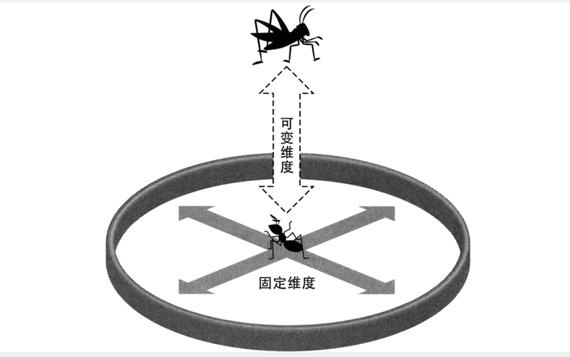

图 3-10「固定维度」的蚂蚁和「可变维度」的蝈蝈

关于「可变」一词需要补充的是，蝈蝈在不使用后腿和翅膀等「飞行工具」的状态下行走，即二维世界里的活动是可以同蚂蚁一样的，同时还能根据需要自由使用「高度」这另一个维度，因此可以表述为「能在二维和三维之间来去自如」。

### 3.4.1 为了「升维」，要以「上位概念」思考

那么，「固定维度」的蚂蚁与「可变维度」的蝈蝈有着怎样的思路差异呢？一言以蔽之，就是「上位概念」的差异，也就是能否从元视角进行思考。上位概念与下位概念的对比如图 3-11 所示。

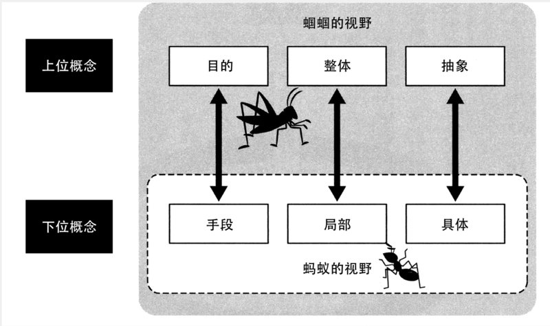

图 3-11 上位概念与下位概念的关系

这里通过三种关系来表现上位概念与下位概念的关系，即目的和手段的关系、整体和局部的关系、抽象和具体的关系。蚂蚁生活在只有手段、局部、具体的世界里，所以无法「跨越壁障」。相反，蝈蝈通过手段 - 目的 - 手段、局部 - 整体 - 局部、抽象 - 具体 - 抽象这样的「反复上下」，能够随意跨越壁障。

下面举例说明目的 - 手段的关系。对于重视狭义的解决问题，即「解决既有问题」的蚂蚁来说，重要的是手段。因为对于蚂蚁而言，「现实和执行」便是一切，而总是以「可见」形式的现实存在着的，就是手段。至于「目的」这一看不见的、未来的东西，以及「单纯的理想论」，去在意它们只是「浪费时间」。总之，切实执行眼前的手段就是蚂蚁的任务。

与之相对，蝈蝈为了目的会不择手段。以某个目的为中心进行思考时，该目的与相应的手段之间的关系如图 3-12 所示，是「1 对 N」的关系，所以蝈蝈基于目的这一上位概念进行思考，就不会局限于特定的手段这一「墙内的世界」，能从宏观的视角出发，选择能够达成该目的的手段。

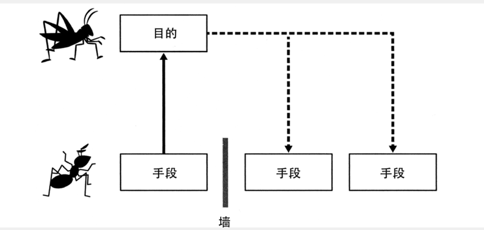

图 3-12 目的与手段的关系

对于蚂蚁来说，最重要的是解决问题的具体化方法，也就是 How。相对地，蝈蝈需要掌握的则是目的，也就是 Why。因为使变量达成最优化需要问的是 How，而寻找变量本身需要问的则是 Why。说到具体化，抽象与具体也可说是同样的关系。如果只看具体的世界，发现问题就会浮于表面，无从窥见本质。而通过抽象化，问题所内含的本质性课题就会浮现上来，由此即可进行「跨越壁障」的思考。暂且不论好坏，抽象是比具体「自由度高」的状态。具体的事物「立刻就能执行」，所以对于解决问题型的蚂蚁来说最重要，但在蝈蝈眼里只不过是「不能应用的表面事象」。

#### 01.「升维」能使变量增多

扩展到思维的世界来看，维度指的便是「思维的自由度」或「变量」。上位概念也可称为「高维」概念，也就是「维度高」。较之一维，二维就是上位概念；较之二维，三维就是上位概念。那么，通过升维在「高维」上进行思考是怎么回事呢？为了便于理解，下面列举几个例题。请思考下面的「火柴棒拼图」。

问题 1：用 6 根火柴棒拼出 4 个正三角形。

最「简单的」答案是，用 6 根火柴棒拼出「正三角锥」。这是一个很有代表性的问题 —— 如果局限在平面上思考，很难得出答案，但若扩展到「立体」，就很简单了。下面再看一个「应用问题」。

问题 2：用 4 根火柴棒拼出「田」字。

对于读过问题 1 的解说后已经「扩展维度」的读者，这个问题并不太难。只要把 4 根火柴棒以 2×2 的形式凑在一起，然后从纵向上观察火柴棒的「底部」，就能看见「田」字了（图 3-13）。

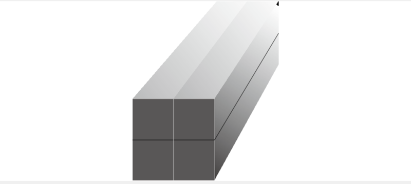

图 3-13 用 4 根火柴棒拼出「田」字

这也是不局限于「单纯的二维上的思考」、通过其他的标准来解决问题的例子。

#### 02. 升维能找到「出路」

通过「升维」，能找到解决问题的切入口，在图形等直观的世界里更加如此。在数学中运用几何学思维，也便于形象地理解升维。下面对「升维」的形象及其优点进行更普遍、更具体的说明。点 => 线 => 面 => 立体的变化，就是升维的形象之一（图 3-14）。

图 3-14 零、一、二、三维的形象

下面说明升维与创意形成之间的关系。

#### 03. 另一个「蚂蚁和蝈蝈」的故事

这次通过「蚂蚁和蝈蝈」的对比，举例说明将二维升至三维以「解决难以解决的问题」的其他「出路」。首先是和前面一样的「预热问题」。

【预热问题】去便利店买东西，前方道路却因施工而无法通行，该怎么办？

我们在日常生活中经常遇到这样的事。此时只要先走旁边的岔路，绕过被堵住的部分，然后再回到原路上就行了（图 3-15）。

图 3-15 升维解决问题

这就是只在一条直线上思考的「一维」思维与在「纵横」这一平面上思考的「二维」思维的区别。如果只在一条直线上思考，就没有手段回避途中的障碍，而若能想到走旁边的岔路这一选项，就能发现解决问题的切入口了。下面来看「从二维到三维」的例子。

【问题】 假设有一只蚂蚁被一个较粗的橡皮圈围在了里面（图 3-16）。

图 3-16 蚂蚁吃不到墙外的食物

橡皮圈的宽度比蚂蚁的身高大好几倍，所以在蚂蚁看来就是一道「墙」。墙外放着蚂蚁爱吃的食物，蚂蚁只能通过气味知道「墙的外侧」有很吸引自己的东西。那么，这只蚂蚁能吃到食物吗？

至少不使用「飞行工具」，蚂蚁是到不了墙外的，因为其行动范围基本上只是平面上的，也就是仅限于「二维」的世界。那么，如果换成蝈蝈又会如何呢？蝈蝈能够「跳跃」，相当于拥有了「飞行工具」，所以能轻松越过壁障（图 3-17）。

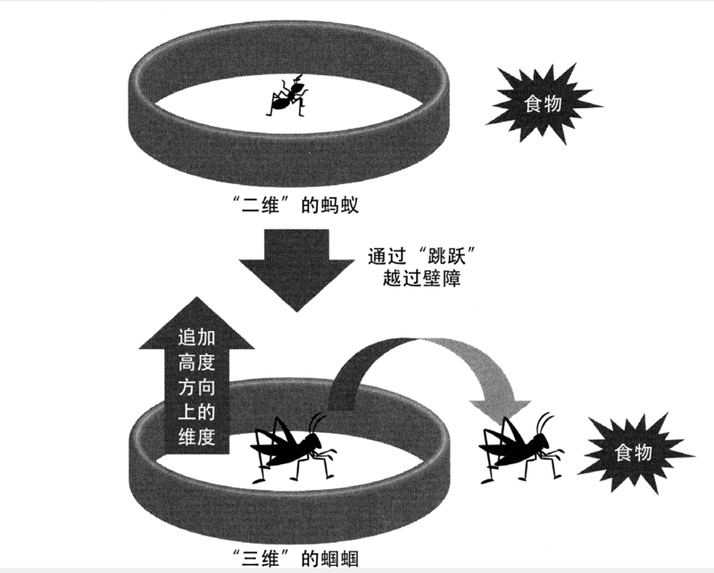

图 3-17 蝈蝈通过升维吃到食物

这是因为，蝈蝈能在「高度」这另一个维度上进行移动。也就是说，通过追加一个维度，行动的自由度便得到提升，在二维中做不到的事也有了可能。这里所展示的蝈蝈「跳过壁障」的形象，与此前反复表述过的「开放体系」的思维是完全相同的。其手段之一便是本节将要阐述的「新维度的活用」。

由此可以说，「升维」这一表述本身，是此前阐述的「抽象化后思考」「用‘轴’思考」「通过 Why 进行思考」等多个思考法的「上位概念」（这些思考法会在 PART Ⅳ 作详细说明）。

### 3.4.2 是使固定变量达成最优化，还是创造新的变量

通过「蚂蚁和蝈蝈的故事」，我们还能得到其他收获。如前文所述，「维度」指的就是「思维的自由度」，也可称为用以思考的「变量」。下面我们通过思考新的商品或服务的开发，对「思考固定变量（的种类）」的蚂蚁和「思考增减变量」的蝈蝈试做比较（图 3-18）。

图 3-18 蚂蚁和蝈蝈在商品开发上的思维方式的差异

这里所说的「变量」，可以是产品各方面的规格和性能（的种类）。例如汽车，就有引擎排气量、车身重量、外形尺寸、耗油率，等等。固定变量进行思考的蚂蚁在开发时，会着眼于在这些性能的数值上超过其他公司，因此首先会（在脑中）列举现有变量，将其与竞争公司进行「对比」，然后思考如何在数值上超过对手。

与之相对，蝈蝈会选择完全不同的途径，不会用「数字的对比」决胜。「能用数字进行对比」意味着是在相同变量（oo 速度等）的优劣上与对手较量。蝈蝈则不然，它会思考哪些「变量本身」是在对比表中的对手栏里填不上的。

这里的关键，不在于增减类似的既有功能，而在于增减根本性的功能，有意剔除其他公司产品「应有」的功能。在这一点上，蝈蝈还拥有「减少变量」这一选择（以前的「随身听」就是这种的典型模式，近年来面向新兴国家的重视成本的产品及服务的开发，也常使用这一手法）。

归根结底，蝈蝈想要做的，是使变量与其他公司的产品脱离开来，处于「制作对比表毫无意义」或「对比表不会限制原型」的状态。例如，当平板电脑诞生时，制作平板电脑与笔记本电脑的「对比表」又有多大意义呢？总而言之，思考如何在同一个赛台上「战而胜之」的是蚂蚁，思考如何彻底改变赛台以便「不战而胜」的是蝈蝈。这些思路的差异如图 3-19 所示。

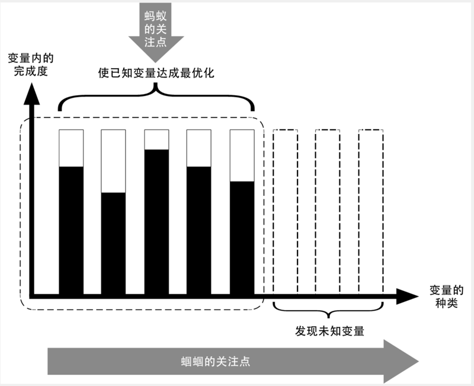

图 3-19 蚂蚁的关注点和蝈蝈的关注点

「使固定变量达成最优化」是蚂蚁最关心的事。蚂蚁的关注点在于变量的「值」，也就是在变量固定的情况下，如何使其「达到满分」。相反，蝈蝈对于已经确定的变量毫无兴趣。既然「问题」已被明确定义，那后面的事交给别人去做即可，自己要去寻找下一个未知的变量。

开发新商品时，与其他公司的基准做比较、分析是必要的，但其定位对于蚂蚁和蝈蝈来说则大相径庭。蚂蚁的理由是「为了跟其他公司对比变量大小」，蝈蝈的理由则是「为了分析其他公司尚未具备的新功能」。更进一步讲，同样是调查其他公司的事例，蚂蚁的目的是「为了模仿」，蝈蝈的目的则是「为了不模仿」。以创新的不同水准而言，蚂蚁的创新是连续的、渐进的，蝈蝈的创新则是不连续的、有破坏性的。

### 3.4.3 各单位所体现的经营管理的维度的不同

下面从「变量的数量」，即经营及决策的自由度的角度来分析经营管理的组织单位。例如，思考经营管理时的单位有成本中心、利润中心、投资中心等概念。

成本中心以人事、总务、会计或信息系统部门等职员部门为代表，数值上的管理指标只有「成本」一项（因为这些职员部门不会对营业额做出直接贡献）。也就是说，成本中心的管理变量是「1」。利润中心的管理指标是「利润」。利润由「营业额－成本」计算得出，所以利润中心的变量是「2」，自由度升了一级。提高利润有「提高营业额」和「降低成本」两个选项，仅仅如此，经营施策的自由度就能有所提升。

进而给这些变量加上「时间」（长期的营业额和成本），给上述的 P/L 指标加上「投资」这一与 B/S 相关的指标，所形成的管理单位就是「投资中心」。如此一来，就能进一步获得思考长期投资和回报的自由度。这些单位通过增加变量，使「自由度」得以提升。其模式如图 3-20 所示。

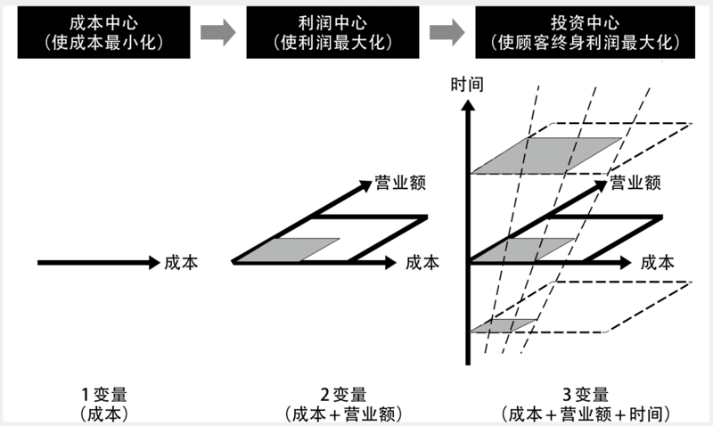

图 3-20「维度不同」的商业适用例

另一个要点在于，其中各变量的「灵活度」（不确定性的高低）关系是成本＜营业额＜时间（长期投资和回报）。在相同变量的前提下不难想象，在变量少的赛台上较量更容易「获胜」。

例如，假设为了扩大营业额而增加经费的利润中心的人，与只关注削减经费的成本中心的人同台辩论。利润中心的理论是「就算为了提高营业额而增加成本，也能提高利润」，但这一理论无法明确回答成本中心的质问 ——「增加成本能确保提升营业额吗？」因为「成本增加」是基本确定会发生的事象，却无法在同样的准确度上确定「营业额也会提升」。所以在这样的辩论中，「变量多」的一方会处于不利的局面。

像这样，当「固定维度」和「可变维度」同台（变量少的）较量时，大多是固定维度的一方会获胜。关于这一结构，在后文谈到蚂蚁和蝈蝈的对立结构时再进行详细说明。

### 3.4.4 低维比高维容易理解

前面列举了通过「升维」来拓宽视野和视角的例子，但反过来，上位概念的操作通常比下位概念的操作更难。我们学习数学时，也是先从一维的世界开始慢慢增加变量，提升维度。这是达成理解的正确途径。因此有些时候，有意地降维思考更易于理解。

例如，分析立体图形的时候，想象其「截面」等投影在平面上的图形更容易理解。建筑图纸就是具体的例子。建筑物自然是「三维」的，但在设计、施工等涉及细节的场合，研究二维的平面图才不至于出现误解。因升维而复杂化的问题，通过降维更易于具体理解。以商业场合而言，前面提到的「○○中心」的思维方式便是如此。肩负「利润责任」的利润中心需要控制「营业额」和「成本」这两个变量，但在按部门进行任务细分的时候，就会分成肩负「营业额责任」的部门和肩负「成本责任」的部门进行管理。该手法便相当于降维。

再比如，上司管理、培养下属时的「工作的自由度」，就相当于「变量的数量」或「维度」。例如，起初让下属在低自由度的状态下记住该如何工作，随着技能提升，再给下属以自由度，也就是裁量权，允许下属挑战难度高的工作。

### 3.4.5「固定的蚂蚁」与「可变的蝈蝈」的对立结构

「变量固定」的蚂蚁，一旦解决问题的进展不顺，就会把责任归咎于他人或环境。也就是说，蚂蚁容易怀有责怪他人的想法和受害者意识。这是因为，蚂蚁作为解决在固定变量中提出的问题的专家，会为之竭尽全力，而一旦进展不顺，就会认为「制定问题（变量的定义）的人有错」。蚂蚁从来没有增减变量本身、「改变问题本身」的选项，所以既然自己已经竭尽全力，那么错误自然在于「制定问题的一方」。

与之相反，蝈蝈若是认为问题本身不对，就会放弃解决问题，开始自己定义别的问题。在思维上拥有如此高自由度的蝈蝈，认为一切问题都能找到办法解决，所以总是将矛头对准自己的创意，在这上面狠下工夫。「若有不满就应提出替代方案」也是蝈蝈的逻辑。在蚂蚁看来，「不满」是在自己已尽全力对自己可控范围内的变量进行最优化后发生的，自己已经再没什么可做的了，所以替代方案「就算想拿出来也拿不出来」。相反，拥有无数可选变量的蝈蝈则会认为，提不出替代方案的原因无他，只是因为自己不够努力。这里也会发生因思路不同而导致的意见对立。

而且，蚂蚁对于「提高自由度」是格外厌恶的。因为在它看来，变量增加得越多，问题就变得越复杂，解决起来也就越麻烦。

#### 01. 指标确定就会干劲十足的蚂蚁和与之相反的蝈蝈

一旦指标确定，蚂蚁就会致全力于该变量的最优化。相反，如果指标不确定，蚂蚁就会因无从着手而不知所措。公司的管理也是如此。公司越成熟，越趋向「下游」，使用指标的管理就越有效。赋予一切以「定量的」「同平台的」「能够对比的」标准，能使蚂蚁的能力得到最大限度的发挥。人事评价同样如此。在蚂蚁看来，「同平台的」「基于共同标准的」评价才是公平的。由此不难看出，「渴望加薪升职」是典型的蚂蚁的动力。

蝈蝈则与之相反，一旦确定了这样的「共同指标」，顿时就会失去动力。蝈蝈不喜欢和别人同台较量，因为「制定别的指标，自己独自获胜」才是蝈蝈的工作哲学。换言之，蚂蚁是志在成为「第一」，蝈蝈是志在成为「唯一」。

#### 02. 希望他人决定的蚂蚁与希望自己决定的蝈蝈

一味讨厌因「自由度提高」而导致工作范围扩大的蚂蚁，不会自行寻找新的工作，而是会让他人决定制约条件，自己在该条件下尽力做到最好。这是因为，「志在解决问题」的蚂蚁本能地明白，如果胡乱增加变量，会令问题难度大增。与之相反，言必及本质并以重新定义问题的「拆台」为信条的蝈蝈，则认为决定制约条件（画分界线）是自己该干的事，所以一旦被他人决定了制约条件，就会一下子失去动力。也就是说，蚂蚁的组织管理需要的是「规章」「规矩」和「模板」，而蝈蝈的管理一旦模板化，则会完全起反效果，因为剥夺自由度是维持蝈蝈工作动力的最大忌讳。

#### 03. 蝈蝈不惜「为轻松而努力」

同样地，当直面无法跨越的困境，即「高墙」时，蚂蚁会不断尽最大限度的努力，设法在墙上挖开「一个洞」，直到终于挖开一个小洞，再一点点使洞扩大，最终脱困（以前面的「道路施工」的例子来说，就是想方设法通过「现有的道路」）。

与之相反，蝈蝈所考虑的完全不是从正面突破，而是「如何回避这堵墙」。岔开的出路也好，简单的办法也好，总之会彻底思考能顺利绕开墙壁的方法。在蚂蚁看来，这样做只是「逃避现实」，但蝈蝈式的竭尽全力，就是要通过彻底思考「别的维度」来找出另一条路。请回忆前文提到的拼图问题。蝈蝈丝毫不会考虑「正面突破」，而是会思考其他办法。

也就是说，蚂蚁和蝈蝈的施力点存在根本上的差异。蚂蚁是在已确定的赛台上尽力做到最好，蝈蝈则是全力思考如何找到别的赛台，以便能在既有的赛台上「轻松享乐」。然而，所谓「轻松享乐」不过是蚂蚁的看法，蝈蝈可是会「为了轻松享乐而彻夜思考」的。

## 3.5 从「奇点」出发的问题发现法

至此，我们针对擅长发现问题的蝈蝈和擅长解决问题的蚂蚁的思路、价值观及行为的结构做出了分析。那么，作为解决问题之上游的「发现问题」，应该如何进行呢？答案是，应该着眼于「奇点」。这里所说的奇点，是指「反常识的新事象」。两种思路对于这类事象的反应各不相同，由此即可对未来做出两种不同预测，从而得到新的创意。

「以两种思路看待奇点」是发现问题的重要视角。蚂蚁和蝈蝈，无论哪一方的视角都会产生问题，而要想认识到问题的存在，就不能用「是蚂蚁还是蝈蝈」这样的二选一论，而是要像上一节所讲的那样，从上位进行观察，认识到「存在两个视角」（实际上，这样的思维本身即可称为蝈蝈的思维）。正如 PART Ⅰ 所述，问题多源自「事实和解释的乖离」。下面我们就来思考发现问题的具体方法。

### 3.5.1「奇点」是如何产生、进化的

这里所说的「奇点」，是指无法以常识测度的、与平均事象严重脱节的所谓「不正常的事象」「古怪的行为」或其主体，即「怪人」（数学中的「奇点」别有所指，这里仅将其定义为一般意义上的词语）。尤其是随着时代和技术的变化，「新出现的特殊事象」成了「奇点」的主要来源。

在「枪打出头鸟」的日本社会，新出现的特殊事象或怪人多被大众以否定的态度予以排除。然而不管人类作何反应，当世间发生变化时，这样的「奇点」就会出现并成长，很多时候甚至会迅速发展成为「主流」。也就是说，「奇点」其实装满了未来创新的种子。这种关系到未来的事象，在英语里被称为 Weak Signal，是暗示未来的「小征兆」。如何尽早着眼于此，使之变为机会，便是关键所在。

为此，我们有必要充分理解奇点的「进化过程」。奇点是如何产生、进化的？其过程的一般化表现如图 3-21 所示。横轴标示了随时间变化的奇点的定位，纵轴按抽象度从低到高的顺序分类为个别事象 => 「名字」 => 框架 => 已经成为体系的理论。

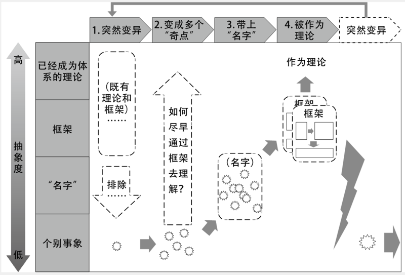

图 3-21 奇点的进化过程

以技术或顾客需求等环境变化为背景，奇点起初是作为罕见的特殊事象，即所谓的「突然变异」开始出现的，然后数量慢慢增多，在世间引发热议的同时有了「名字」，比如日本的「草食系男子」「剩女」等。此外，例如「游牧工作者」等「新人类」的表达方式，也完成了同样的进化过程。

比如互联网或杂志的报道素材，最初只不过是一小部分特殊事象，直到有了名字，才渐渐作为常见的存在而被人们认识到。通常，这些事象在出现当时尚未得到世人的肯定，并往往成为揶揄的对象。那些遭到年长者的白眼，受到「现在的年轻人可真是……」之类评价的年轻一代的言行，可以说就处于这一阶段。

等到这些事象继续进化，被「一流企业或名人」提及，或是成为热门商品，得到世人的广泛认知，作为先进事例被介绍的时候，就会得到大众的肯定。然后，随着这些事象成为书籍的主题，或是得到体系化的阐释并且其中的一部分被整理成理论，它们就会「横向展开」，扩展至同样用途的咨询对象。

然后再继续进化，先进事例不断积累，经过学者的实证研究和理论化，成为「具备重现性的体系的理论」。不过到了这个阶段，最初的「奇点」已经变为不折不扣的「主流」，创意本身因失去新意而发生衰退。而且在这一时期，由于下个「突然变异」的发生，又会有新的奇点开始出现，先前的常识遭到怀疑，如此循环往复。这里应该注意的一个要点是，并非所有最初的奇点都会发展至下一阶段。能够发展至下一阶段并「成为主流」的奇点，只占全体的一小部分。

### 3.5.2 蚂蚁和蝈蝈对待奇点的不同反应

这里的目的是通过奇点充实创意，以实现问题的发现和定义，但蚂蚁型和蝈蝈型对待奇点的反应是完全不同的。一言以蔽之，「蚂蚁型」的反应是对新变化持否定看法，试图对其进行「规制」「管理」「禁止」。世间大部分的人都是这样的反应。

「蝈蝈型」的反应则是对新动向采取中立或肯定的立场，觉得「以后这股动向也许会成为主流」。正如前文已经分析过的，二者的根本区别在于「通过既有的固定解释去看待事实」的蚂蚁的思路与「按照原样看待事实以思考新解释」的蝈蝈的思路的区别。这里也受到「解释＞事实」和「事实＞解释」的不同的影响。

这些差异主要可看作是权力阶层和革新者的视角的差异，即遵循旧有结构提升实绩的「有产者」，和向其发起挑战、试图开辟新世界的「无产者」这两种视角的差异。二者对待「奇点」的不同反应的对比如图 3-22 所示。

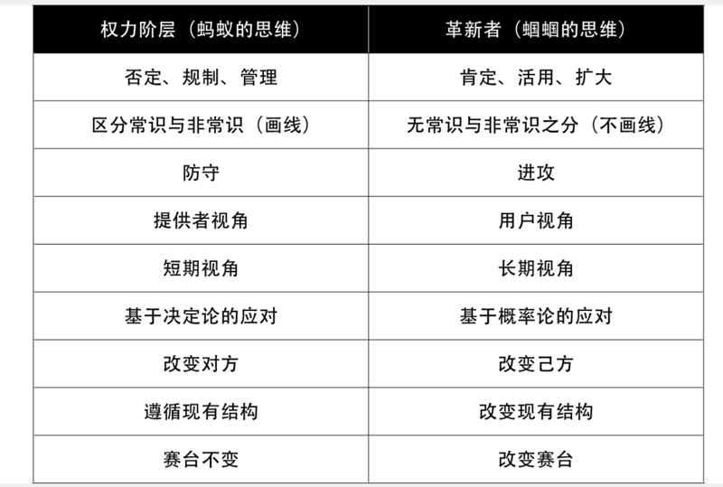

图 3-22 对待「奇点」的不同反应

正如前文详述过的，蚂蚁型的思维是「志在存量的、封闭的、内向的思维」，蝈蝈型的思维则是「志在流量的、开放的、外向的思维」。再次确认一下，这些思维差异的起因在于图 3-23 所示的思路差异。

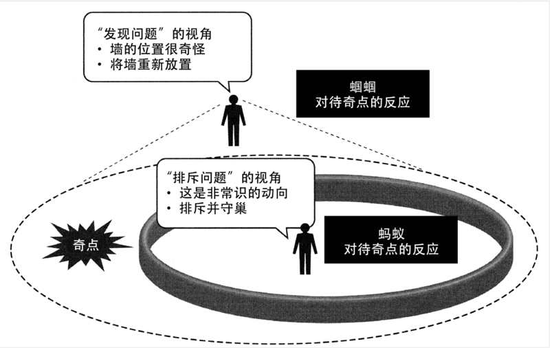

图 3-23 蚂蚁与蝈蝈的思路差异

从形象上加以表述，蚂蚁是「墙内和墙本身处在同一水平线上的视角」，蝈蝈是「从墙的上方俯瞰全局的视角」。这里所说的「墙」，是已构筑的「业界」「组织」，偶尔可以是「规则」，总之是权力阶层需要守护的对象。

### 3.5.3 权力阶层 vs. 革新者

按照蚂蚁的思路，首先会用习以为常的价值观，例如「常识」和「非常识」等来判断世间事象的善恶。正因为蚂蚁有着明确区分墙内墙外的思维，所以会采取「守势」，把奇点视为「墙外」异物而彻底排除。相对地，按照蝈蝈的思路，只有改变现有的（业界或产品的）墙壁本身，才能应对今后存在增加可能的奇点，所以蝈蝈会从「有必要改变墙的位置或方向」这一认识问题的角度入手。无论如何，蝈蝈都不会否定正对面的奇点，而是会秉持「有需求即合理」的视角。

对于那些已在现有世界确立地位的权力阶层而言，根本的大前提是「守护自己的立场」，所以必然不得不从「提供者的视角」出发，对于新需求的出现也只能采取「不同于既有购买模式的顾客是错误的」的立场。与之相对，革新者认为「既然需求有变，就有必要改变结构本身（墙的存在方式）」，所以会从纯粹的用户视角出发，「破坏墙壁」或「重建新墙」。换言之，二者之间就是「试图改变对方」与「主动改变自己」的区别。

权力阶层即便能在短期内将奇点压制为「特殊需求」，如果顾客需求货真价实，从提供者的立场就很难阻止其增加，所以从长期来看，抢占先机的革新者很可能更具优势。

例如近年来，越来越多的消费者倾向于去实体店确认实物后，上网查找售价最便宜的网店进行网购。针对这一「展厅现象（Showrooming）」问题，也存在两种完全不同的见解。

一种是实体店方的看法，认为顾客这样做，自己便根本卖不出货。他们所想到的对策，是根据如何减少这样的顾客、让更多的顾客在实体店购物的思维，即尝试通过诉求于只有实体店才能提供的附加价值（交钱就能立刻拿回家，或是能享受到详细的商品介绍……），减少只看不买的顾客。也就是说，他们会从最大限度地活用「现有」店铺或员工的思路入手。

而另一种思路，则是从用户只看不买的趋势中嗅出「哪怕便宜一分钱也好」「但想看到实物」等「无法在一个地方同时得到满足」的需求，然后设法构建忠实满足顾客需求的新结构。例如，在互联网上利用 AR（扩增实境）、3D 技术等手段，思考「能否在 IT 世界里确认实物」，或是「在实体店里准备‘展厅’，然后进行厂家直销的模式能否成立」。

然而正如前文所述，并非所有的奇点都会增多并成为主流，能够成长为主流的奇点只是其中的一小部分（但这种情况下的冲击力会非常大）。也就是说，权力阶层会着力应对基本确定会发生的与既有业界的冲突，而革新者会把赌注押在那些尽管发生的可能性不大，可一旦「突变」就会具备巨大潜力的所谓「高风险高回报」的事象上。就思路而言，权力阶层是基于决定论的思维方式（一切都要获胜），革新者则是基于概率论的思维方式（夹杂着一定程度的失败）。这就是二者的区别。

意识到这两种思维方式后，在观察一个事象的时候，若能从两种视角加以思考，创意就会倍增。这就好比在脑中想象自己扮演两个角色。前面说过，新创意大多来自外向的「开放体系」，但我们可以像「普通人会这样想（内向），那我反而要考虑到另一面（外向）」一样，从两种完全不同的视角去观察世界，这样就能拓宽思维（图 3-24）。

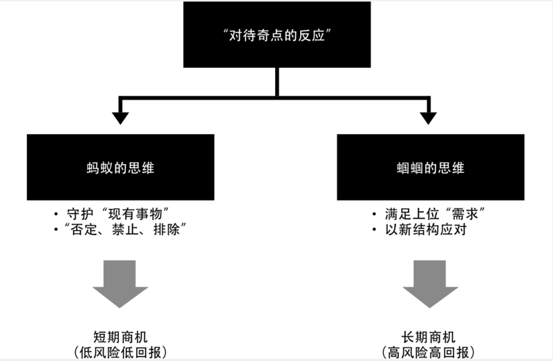

图 3-24 从两种视角看待奇点

针对新动向，短期内会发生来自权力阶层的「禁止」「管理」等变化，而从长期看，一旦新动向成为主流，新的结构或商品就会流行起来。

革新者会尽早着眼于奇点，以肯定的态度加以理解，想象其成为主流后的样子，站在长期的视角，通过投资或施策抢得先手。与之相对，权力阶层见到这样的动向，会先从「那样的东西不是主流」这样的否定态度入手。先是否定、规制、禁止，然后花时间慎重地判断，直到真的发现开花结果时，才会采取对策（图 3-25）。

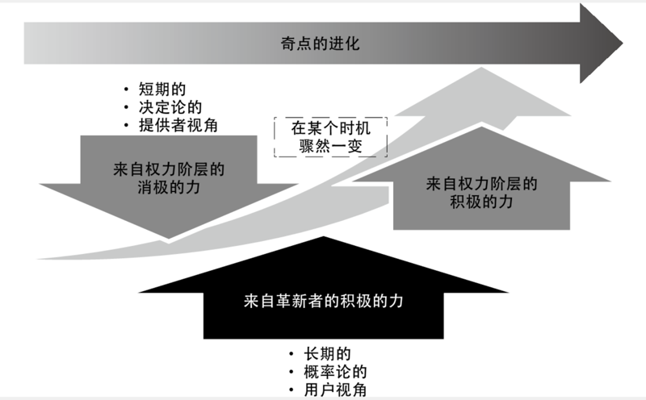

图 3-25 影响奇点进化过程的两种作用力

这里应该关注的另一个要点是，按照「内向的封闭思维」，当奇点在某个时刻变成主流的一瞬间，人们的反应会从否定骤变为肯定。至于转变的时机，可以是「被业界的领先企业采用」或「开始被名人使用」，等等。

### 3.5.4 画线？不画线？

按照「权力阶层」的蚂蚁型思维，其态度会以某个时刻为界发生骤变。为了究其原因，我们再对两种思路差异的另一个侧面进行分析。图 3-23 所示的思路差异，正如本书反复所讲，也可说是对观察对象「画线」还是「不画线」的差异。

蝈蝈作为拥有「外向的开放思路」的革新者，对奇点不抱偏见，以公平的视角看待，而且不会通过画线将其与既有的「常识」区分开来，而是将其理解为新动向的萌芽。与之相对，蚂蚁作为拥有「内向的封闭思路」的权力阶层，对待新事象总是判断其属于自己所持的「常识」的内侧还是外侧，首先着手进行排除、规制、管理。

也就是说，拘泥于抽象的既有规则、迟迟不能发现奇点，可以说是「内向的封闭思维」的特征。由于权力阶层的思路受缚于既有规则，因此以新视角看待奇点的时机总是比革新者慢上几步，抛弃自身成见的时机也会落后于革新者。

### 3.5.5 奇点进化例 —— 智能手机时代的信息安全

「以内向的封闭体系进行思考的常识人」会「试图将奇点拽入常识的范畴」。相对地，革新者会转换思维，通过「考虑在奇点外侧重画常识之线」，想象奇点进入常识范围内的样子。

再举个例子，对于智能手机时代的信息安全的反应也同样分为两种。尽管这样的举措在近年来已经变少，在智能手机普及时期，许多公司因过于惧怕信息泄露和安全对策，采取了「禁止」使用个人智能手机的方针。这是消极理解并试图禁止奇点 —— 也就是将当时正开始普及的私用智能手机带去职场的「内向的封闭体系」的思维。与之相对，另一种想法则认为，智能手机开始普及是理所当然的事，所以会抢先去做以之为前提的工作。

后来的情况众所周知，该奇点有了「BYOD（Bring Your Own Device）」这个「名字」，作为一种概念和框架而被人们认知。可以说，这个例子完美体现了前面所说的奇点的进化过程。实际上在那之后，该奇点发展成了一种「市场」，有各种各样的公司为之提供商品和服务。

### 3.5.6 用来思考「奇点」的框架和练习题

至此，我们通过以两种思路观察作为一个事象的奇点，分析了「站在提供者或规制者的立场上短期思考」与「站在用户的立场上长期思考」之间的区别。如果观察我们身边的「奇点」，通过启动两种思路，就能对短期和长期的未来做出预测。

一般来说，人们出于过去的经验或现在的工作内容，会形成有失偏颇的事物观（多是「内向的封闭体系」的思维）。因此，对完全相反的两种视角有所意识，就有可能通过「两倍」于此前的视角来思考创意。同时，例如当今的业界领袖（内向的封闭思维类型），就能对身为挑战者的革新者的想法做出预测，从而制定对策。下面列举现阶段被否定理解的「新动向 = 奇点」。

希望大家能够尝试从「两种视角」出发，思考今后的「对策」，把握短期和长期的商机。1）在工作中使用 SNS 的员工正在增多。2）边走路边玩智能手机的人正在增多。

如果发现身边有这样的事象，或是在网络、报纸上看见这样的报道，不妨按照图 3-26 的框架进行思考，肯定能发现新的视角或创意。关键就是要时刻从「两种视角」进行思考。

图 3-26 从两种视角思考奇点的框架

### 3.5.7 奇点发现法 —— 着眼于「禁止」「其他」

那么，怎样才能在实际的日常生活中发现奇点呢？着眼于「禁止」，就是奇点发现法的一个例子。如前文所述，新需求往往会被既有结构予以否定，表现为「禁止」的形式。也就是说，某种新需求要以前所未有的方法开始应对，而旧有结构无法处理，所以会被禁止（智能手机的例子即类似于此）。

例如，我们能在有些餐厅里见到「禁止学习」的标示。从「禁止」一词中一定能感觉到「两种需求」，一种是「希望禁止方」的需求，另一种是「被禁止方」的需求。

首先，「希望禁止方」的短期需求会成为创造相应规制、管理工具或结构的商机。此外，从作为「另一种视角」的「容许者」的角度来说，这样的状况必然引发「正在增多的需求未被满足」这一信号。就算禁止，只要存在需求，就会以其他形式显现出来，倒不如抢得先手，自然就能扩大商机。

另一个着眼点的例子，是各种分类中的「其他」这一要素。某种分类完成时，未进入既有分类的事项将被统一归入「其他」。换言之，就是「无法分类的事物」。所谓分类，指的是根据现今已知的事物观进行思考，而奇点的候补就隐藏在那些无法分类，即不得不归入「其他」分类的事物当中。

「其他」通常可称为无法妥善分类的累赘的集合，若是成为无法说明的奇点，就可以认为其中沉睡着充实创意的绝佳素材。例如在填写调查问卷时，如果填入「其他」分类中的事项增多，很多时候就是在理解世间的新动向。

填写职业时，许多新型职业无法分类，只能写在「其他」一栏里。这样的事项就能成为奇点的候补。再比如顾客问卷调查的结果等，也无法记入既有的分类，只能归入「其他」。被归入「其他」的意见，才是不受限于旧有框架的意见，其中或许就隐藏着作为预测未来的「奇点」的提示。

如上阐述了通过关注奇点来发现新问题，同时从两种视角、以短期和长期两方面来预测未来，并将其用作革新契机的手法。通过自主意识到用以发现问题的「解释的无知」，就能定义新问题。这里的发现问题的触发器也是以「无知、未知」作为关键词的。

## 3.6 蚂蚁和蝈蝈能否共存共荣？

前面讲述的「发现问题型人才」（蝈蝈）和「解决问题型人才」（蚂蚁），怎样才能共存并同时提高双方的能力呢？其实在很多组织里，「两种人」都是互相无法理解地存在着的，从而形成了对立结构。

与「先例主义」对抗的革新者、难以应付「怪人」管理的管理职位、总是需要掌握「过去的数据」「其他公司的事例」却又束手无策的新事业负责人、反对向「无法预测是否成功的未知研究和调查」付出高额投资的会计负责人…… 这些无一不是本书中所说的源自「蚂蚁和蝈蝈」的思路根本性差异的对立结构。

即使在公司组织的外部，这样的结构也以各种形式被不断重复着，堪称是永远的课题。在本节中，我们将探寻对策，以使思路截然相反的「两种人」能在最大限度上发挥彼此的能力。不论古今中外，「蚂蚁型」的人和「蝈蝈型」的人一直以各种形式共存至今。后文将会提到，不仅限于商界，在自然科学界和政界，二者也时而妥善地分担职责，时而（绝大多数场合）彼此对立地推动世界。

下面，我们将讨论蚂蚁和蝈蝈是「分担职责」还是「争斗」或「拖后腿」，讨论二者的对立结构，讨论双方是如何看待对方的，讨论怎样做才能人尽其才地共存共荣。

### 3.6.1 各领域的蚂蚁和蝈蝈

前文已在各领域内对比了「解决问题型」的蚂蚁型人才与「发现问题型」的蝈蝈型人才。

再来看数学世界中的例子。生于意大利的美国数学家、哲学家吉安·卡洛·罗塔在其著作《浑然一体的思想》（Indiscrete Thoughts）中，表述了数学家中存在「解答问题的人和构建理论的人」：

数学家分两种：解答问题的人和构建理论的人。绝大多数数学家同时具备这两方面特性，但无论在哪一种里，都能轻易见到极端的例子。（略）这里所说的「解答问题的人」相当于「解决问题型的蚂蚁」，「构建理论的人」相当于「发现问题型（= 定义问题本身）的蝈蝈」。通过下面的记述也能看出，这两种人的特征与本书所说的蚂蚁和蝈蝈的差异几乎完全一致。

解答问题的人在本质上是保守的。对于他们而言，数学是由偶然碰在一起的一系列难题，即若干问题纠缠绊倒的障碍赛组成的。他们认为表述数学问题所需要的数学概念，默认是永久不变的。

（中略）解答问题的人对于普遍化，尤其是可能使自己正在研究的问题的解不证自明的普遍化会表现出愤怒情绪。

保守，加上对给出的条件毫不怀疑，这些人对普遍化、抽象化的反应也跟蚂蚁类似。对于构建理论的人而言，数学中的至高成果是若干不可解的现象突然被光照亮般的理论。数学的成功不在于解答问题，而在于使问题不证自明。解开古老的问题不足为喜，当发现古老的问题不值一提的新理论时，就会迎来光荣的瞬间。构建理论的人在本质上是革命的。比起未发现的数学概念，自过去传承下来的数学概念在他们眼中只是普通概念的不完全的具体例子罢了。

该记述与「革命的」蝈蝈的思路完全一致。此外，如下的「往往不被理解」也是蝈蝈的典型特征。构建理论的人，在数学家的世界里往往得不到认可。

此外，在日本的历史上还能见到其他例子。司马辽太郎认为幕末明治维新的志士们也有「创造才能」和「处理才能」之别。他在《岁月》一书中做了如下描写。

首先，作为「创造型」（= 蝈蝈）例举的是江藤新平和大久保利通。在所谓的维新功臣之中，仅此二人生来便具备不同于他人的别样才能。或许该称作创造才能。此处的创造，是指创建国家的基本体制。对比于「创造才能」，司马辽太郎所举的「处理才能」（= 蚂蚁）的例子是西乡隆盛和大隈重信。他对这二人作了如下描写：

人的才能，可从大体上分为创造才能与处理才能两类。西乡拥有巨大的处理才能，他以哲学和人格作为处理的原理。大隈也属于该系列，但其所用的原理并非哲学和人格，而是事务才能。（中略）

总之，他们这些处理家在如何建立日本的国家体制这一点上，几乎没有丝毫实际上的抱负，即便对此说过豪言壮语，也没有为此挺身而出的关心和热情。唯独大久保和江藤拥有相应的才能，以及对于创造的关心和热情。只有这二人把设计体制当作自己的专业，胸藏自信，并且自然而然地就任该职。

商界同样如此，常会见到解决问题型人才与发现问题型人才的对比。其结构就是作为创业期梦想家的蝈蝈与在实务上给予其支持的蚂蚁。此外，在传统大企业或社会中常见的结构，是由志在成为革新者的蝈蝈和作为与之相对的「抵抗势力」的蚂蚁所组成。

### 3.6.2 在「二维」中，蚂蚁常占据压倒性的优势

「发现问题型」的蝈蝈和「解决问题型」的蚂蚁，二者的思路和行为模式是正相反的。那么，如果蚂蚁和蝈蝈「同居」，会发生什么？实际上，如果「蚂蚁」和「蝈蝈」「同台」竞争，几乎都是蚂蚁型的人会获胜。也就是说，当组织里有「两个不同的人种」一起活动、决策时，通常都是蚂蚁的主张比蝈蝈的主张更容易通过。

原因之一可在前文所述的「二维的蚂蚁与三维的蝈蝈」的差异，即固定变量进行思考的蚂蚁与能够自由增加变量、提高思维自由度的蝈蝈的差异中找到线索。「不同维度的人」同台对抗，需要「让变量配合维度低的一方」。不同变量之间无法比较，所以为了相互比较，必须使变量对齐。

以体育运动为例，假如只用手攻击的拳击选手和手脚并用的自由搏击选手「公平地同台」较量，自由搏击选手就不能用脚。在这种情况下不难推测，始终只用手攻击的拳击选手比手脚并用的自由搏击选手更占优势。

讲回蚂蚁和蝈蝈，由于蚂蚁始终只在自己平时处理的变量中较量，所以蝈蝈总是以「束手缚脚」的状态在对方擅长的领域内作战。如此一来，孰胜孰负显而易见。直观地讲，（翅膀和后腿无法使用的）「不能跳的蝈蝈」与正常状态的蚂蚁在二维赛台上较量，获胜的当然是蚂蚁。

正如前文所述，在组织中的各种决策场合，如果只有「短期成本」这一变量的蚂蚁与在此基础上还要在（加上「营业额」「时间」等变量）「长期利益」这一「更高维度」思考的蝈蝈进行辩论，那么蚂蚁和蝈蝈都只能以更易理解的短期成本作为评价函数。

再从更大的视角来看，只在能用「数字」表现的变量中思考的蚂蚁，与更重视不能用数字表现的变量的蝈蝈之间的决策，只能基于（作为「最大公约数」的）数字进行，所以会趋向于重视（能让全员同台辩论的）数字。最终，集团的决策只会「趋向于容易理解的一方」。

### 3.6.3 蝈蝈在蚂蚁窝里跳不起来

组织会像这样趋向于「容易理解的一方」，而且这种趋向基本上是不可逆的，无法轻易后退。在「飞行工具」被禁用的状态下，蝈蝈无法发挥全部力量，结果只能战死。因此在一个组织里，蚂蚁所占的比例会越来越高，而且这个趋向是不可逆的。但这未必就是坏事。一般来说，组织越成熟，就越会「重视革新」。这也可说是必然的变化。发现新问题，即创造破坏性革新的契机这一职责的只有蝈蝈可以承担，但在蚂蚁和蝈蝈「同居」的状态下，蝈蝈将很难发现新问题，很难将其作为问题重新定义并具体化。

这里存在根本上的困境：组织里蚂蚁的比例越高，革新的必要性就越高，但越是如此，蝈蝈就越没有立足之地，「跳不起来」。要想引发破坏性的革新，需要让这样的蝈蝈型人才发挥出十成的力量。蚂蚁也理解这一点，但实际上如果蚂蚁和蝈蝈「同居」，决策时将必然产生前文所述的对立结构，然后蚂蚁的逻辑获胜。在结构上，蝈蝈无法发挥出全部力量。

以「封闭体系」为前提的蚂蚁和以「开放体系」为前提的蝈蝈在组织这一「封闭体系」内同居，这件事本身就是自相矛盾的。总是根据「巢的逻辑」行动的蚂蚁，与根据「上位目的」进行思考、不顾巢的利害而行动的蝈蝈，二者的思路永远是两条平行线。

同时，以过去的知识和经验为一切依靠的「存量型」的蚂蚁，在决策时最重视的也是「先例和实绩」。与之相对，蝈蝈会毫不抗拒地抛弃先前积累的知识和经验，认为「有用的东西要彻底活用，但陈旧的东西就没必要固守了」，纯粹忠实于未来、理想和上位目的，做出理智的决策。

### 3.6.4 互相怎么看

思路不同的蚂蚁和蝈蝈互相怎么看？下面我们从组织如何对待成员思路才能最大限度地发挥力量的视角来作讨论。

首先，蚂蚁对蝈蝈怎么看？对于蚂蚁而言，蝈蝈作为从「二维世界」所见的「三维」生物，是名副其实的「异次元生物」。蚂蚁所居住的二维空间是一个平面，它看不见该平面以外的任何三维活动，只能看见投影在二维的部分截面。因此在蚂蚁看来，蝈蝈「不认真工作，总是跑到‘某个地方’（异次元空间）玩」。而且在蚂蚁的世界里，遵守已定事项是大原则。在蚂蚁眼中，本来就很少待在二维空间的蝈蝈是「连已定事项也做不好的大懒虫」。

英国数学家、教育家埃德温·A·艾伯特在其著作《平面国》中，对这一结构做了完美的表述。二维世界「平面国」的居民蚂蚁，无法对三维空间的「球」产生认识。因此，即使像图 3-27 那样，球逐渐穿过二维世界，蚂蚁也只能看见投影在自己这个世界的二维图形「圆」从最初的点逐渐变大，然后又逐渐缩小，直到变成点后消失。

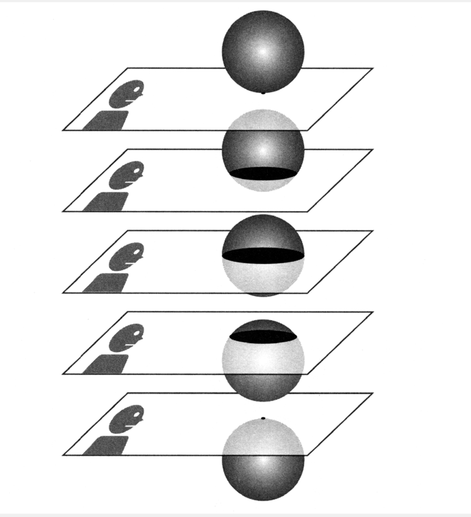

图 3-27 二维的居民无法对三维的「球」产生认识

「变量少」指的就是在这种状态下，无法认识到自己所没有的作为视角的变量（在本例中就是圆的「厚度方向」）。

从蚂蚁和蝈蝈的故事来看，蚂蚁并不具备蝈蝈所持有的视角变量，所以无法在真正意义上理解蝈蝈的想法（本来就连「存在其他变量」这件事本身也想不到）。像前面的「球」那样，蝈蝈经常会在蚂蚁的视野中消失不见（就像三维的居民经常看不见四维的居民）。在这样的状况下，蝈蝈在蚂蚁眼中就是「不干正事，总是不知去哪儿闲玩」的家伙。

正如《平面国》中所表现的那样，在蚂蚁看来，蝈蝈的言行总是很「跳跃」。通过「维度的不同」，就能很好地说明其理由了。正如前文所述，在日常生活中，「维度」也可说是「变量的数量」或「视角的数量」。

对于下属而言，上司的言行经常显得「跳跃」或「变来变去」，原因之一就在于下属「看不见隐藏的变量」。例如，「目的」这一视角就是如此。如果只能看见用于实现特定目的的手段，则「昨天所说的手段」与「今天所说的手段」可能就会显得完全不沾边；但若能牢牢抓住「目的」这个上位概念，通过先升至上位概念，再于其他地点降至下位的解释，就能做到充分理解了。

蝈蝈有时会向蚂蚁强调「外面的世界的美妙」，问蚂蚁「为什么要把自己关在狭小的世界里，自己制约自己」。蚂蚁对此是无比厌恶的。但同时，蚂蚁也会打心底羡慕拥有「自己的世界」的蝈蝈。然而无奈的是，自己无法「追梦」，因为自己没有「追加的变量」这一「飞行工具」。

以作为追梦的变量的「时间」和「金钱」为例。对于蚂蚁而言，时间也好，金钱也好，都是「被追」的对象。也就是说，二者都没有走出「已被确定外框的东西」这一思维局限。蚂蚁常说的口头禅是「要是有充足的时间，想在南之岛悠闲度日」或「要是中了几亿日元的彩票……」。

为什么会说这些呢？因为「要是有无限的时间……」「要是有数不尽的钱……」等假定，都只是「墙外的不现实的话」，所以其发言只能突然跳到这里。与之相反，对于蝈蝈而言，时间和金钱都是「追逐」的对象。也就是说，蝈蝈将其视为自己能够控制的变量，所以能实际挤出时间做一件事，或是赚钱做一件事，写出连续的、现实的剧本。

那么，蝈蝈对蚂蚁又是怎么看的呢？一言以蔽之，就是被关在狭小监牢里的「囚犯」。因为蚂蚁「安居」在维度有限的世界里，坚信「墙外的食物不可能吃到」。蝈蝈即使想告诉蚂蚁三维立体空间有多么自由和美妙，奈何蚂蚁没有空间轴，所以根本没办法说明。蚂蚁使「变量」固定，深信封闭的领域就是整个世界，集中精力于如何使其内部变得更好。了解「广阔世界」的蝈蝈会觉得蚂蚁「为什么不多看看外面呢」，简直是恨铁不成钢。

蝈蝈想让蚂蚁知道「外面的世界的美妙」，可是根本无从说起。即使蝈蝈提起外面的世界，蚂蚁也不会表示关心。以蚂蚁的思路是完全无法理解蝈蝈的。

### 3.6.5 通过「元级」克服对立结构

「蚂蚁与蝈蝈的对立结构」在各种组织或集团里都能见到，可谓是「永远的课题」。当然，正如前文所述，该结构并不能简单地分割为「谁是蚂蚁谁是蝈蝈」，因为一个人的人格之中往往同时存在这二者，组织里也有具备蚂蚁要素的人和具备蝈蝈要素的人错综复杂地交织在一起。不过，「视角」意义上的对立结构与本书所展示的东西，或多或少是相吻合的。

应该怎样思考这种对立结构才能克服它呢？这里的关键字是「元」。关于这个关键字，后文还会谈到，一言以蔽之，就是指以「上位概念」进行客观审视的视角。如前文所述，和蚂蚁「混在一起」的蝈蝈会「被拖后腿」，其能力得不到发挥。这里的「混在一起」，是指在一个封闭组织或评价制度下（多数场合会配合蚂蚁）一起活动（在前文中被表述为「蝈蝈在蚂蚁窝里跳不起来」的状态）。那么，蚂蚁和蝈蝈怎样才能做到共存共荣呢？

首先，蚂蚁和蝈蝈各自为政地同居是最不好的，因为双方的决策方式不同，对待工作的态度也完全相反，所以无法磨合，不能发挥能力、互相补足。因此，首先要做的是从上位，即元的视角来认识「思路的差异」。

例如，在商品企划等决策场合，蚂蚁认为只应该推进那些靠「过去的实绩和逻辑」显然能够进展顺利的企划，蝈蝈则认为「因为做的是史无前例的事，所以只有做过才知道是怎么回事」。即使二者「同台」辩论，蝈蝈也毫无胜算。

发现问题是蝈蝈的职责，蚂蚁则担负着「妥善整顿既定框架内部」的重要任务。粗略地讲，这个世界的九成以上是由蚂蚁构筑起来的，蚂蚁始终直视「现实」，重视具体的思考和执行。支撑现实的是蚂蚁。不论组织还是社会，如果都是追逐「理想」的蝈蝈，后果将不可收拾。

然而，光有蚂蚁的社会或组织必然会随时间而衰退。这是因为，「在封闭体系内」「使变量固定」后进行思考并行动的蚂蚁，容易变得目光短浅，没有进步。

更进一步地讲，让蝈蝈住在「组织这一封闭体系」里，这件事本身就是矛盾的。所谓破坏性革新，从其定义来看，本就与既有的技术和企业不连续，意味着身为「无产者」的革新者向身为「有产者」的权力阶层发起挑战，或失败或取而代之的过程。

因此，蝈蝈本该「在蚂蚁的组织之外」活动。仅靠蚂蚁的思维无法做到对蝈蝈的管理，反之亦然。当蚂蚁和蝈蝈混在一起时，必须在理解二者的特性的基础上区分使用，做到人尽其才。也就是说，需要从一个上位视角看待两者的「元级的」管理。管理者既可以是蚂蚁，也可以是蝈蝈。关键在于「能从上方俯瞰两种思路」。

二者既可能是既有组织和项目组织的形式，也可能是总公司和分公司的关系，还可能是在同一个组织里「组合」其他职责的关系。总之无论如何，如果不能明确区分这些思路，做到人尽其才，结果只会一错再错。

「混合」与「组合」看似一样，实则完全不同。所谓「混合」，是指无视各个体的个性，姑且先混在一起，用一个原理统括起来。这样做会抹杀所有的个性。相对地，所谓「组合」，是指在充分理解每个个体的个性的基础上，在元级上思考最佳的组合方式，以最大限度地活用各个体的个性。

一个是把「砂糖和盐」无秩序地简单混合起来，一个是通过最佳的组合方式用来做菜，只要想想二者的区别就明白了。粗暴地混合只会造出毫无用处的废物，只有灵活组合来调味，才能做出最可口的菜。人才的运用也一样。遗憾的是，有些人嘴上说着「多样性」，却只是把人才简单地「混合」起来，结果导致人才的个性遭到抹杀。这样的例子非常之多。

### 3.6.6 决定是蚂蚁还是蝈蝈的性格和环境

在蚂蚁和蝈蝈的对比的最后，我们来讲讲决定其各自思路的性格和环境。直接来说，将二者区分开来的，很大程度上是天生的性格加上环境要因。那么，什么样的环境会造成怎样的影响呢？

在「权力阶层」这一传统的、大规模的、有名声的「有产」组织里，容易养成「蚂蚁的思维」。这种思路会以维持并发展既成的「帝国」为最优先，所以会在自己筑起的墙内思考事物。而且在这样的环境下，根据旧有想法进行思考及「重视先例」的风险是最小的。

与之相对，适合「蝈蝈的思维」的典型环境，是作为「无产」挑战者的创业型公司之类的组织，身处其中必须具备创业家精神和不区分墙内墙外的「开放体系」的思维。拥有「开放体系」的蝈蝈型思路的人，是站在所谓「超体制」的立场上的。这里故意不使用「反体制」一词，是有道理的，因为用「墙」分割出体制和反体制、确定墙内墙外的思维本身，就是「封闭体系」的思维。

与之相对，「超体制」是从墙的上方俯瞰全局，在其眼中是零基的，没有墙。「开放体系」指的就是这样的思路。所谓权力阶层，指的是已经拥有积攒来的各种「资产」，「可失去的东西太多」的人或组织。现在拥有的越多，「向心力」就越大，从墙壁指向内侧的内向志向就越强。

一般来说，年长者或「在其人生道路上已经获得成功的人」，可称为「可失去的东西太多的人」。反之，「没有（少有）可失去的东西的人或组织」成为蝈蝈型思路的可能性就很高（图 3-28）。

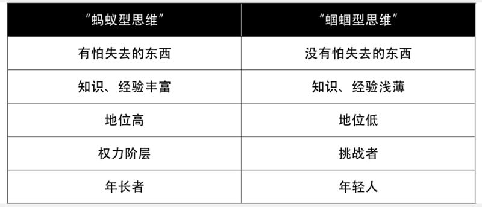

图 3-28 容易变成蚂蚁型思维的人和容易变成蝈蝈型思维的人

思路的形成由与生俱来的性格和环境决定，以此为前提，自觉认识到自己原本在哪些要素上占优势，再考虑环境的影响，思考如何发挥自己的长处，克服自己的短处，才是重中之重。