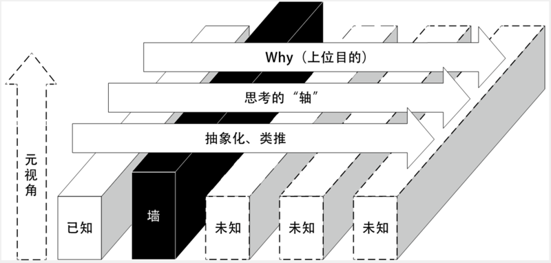

# PART Ⅳ 发现问题所需的「元思考法」—— 升维发现问题

PART Ⅳ 的整体概念图

## PART Ⅳ 的要点

要点汇总：1）介绍三种通过提升视角或思维的「维度」来促进发现未知领域问题的「元思考法」。2）通过「抽象化、类推」升维。找出已抽象化的层级上的共同点，就能找到与遥远领域的关联，从其他领域获得新创意。3）通过「思考的‘轴’」升维。不是关注个别事象，而是在更高一级的「思考的‘轴’」上理解事象，如此就能发现自己的思维盲点，同时意识到新视角的存在。4）通过询问「Why（上位目的）」，即「为什么」来升维。例如，以手段 → 目的的形式升至「上位目的」，就能不受具体手段的限制，正确地定义问题，想出本质的解决手段。

PART Ⅲ 主要通过蚂蚁和蝈蝈的对比，分析了「解决问题型」的思考法与「发现问题型」的思考法的差异。对于发现问题而言，以「重视流量」「开放体系」「可变维度」进行思考的「蝈蝈的思维」至关重要，即使针对同一个事象，也能发现与「蚂蚁的思维」完全不同的问题。

PART Ⅳ 会分析为了从新视角重新定义问题而将思维「升维」的「元思考法」。通过「开放体系」的思维能够「跨越壁障」，再通过继续「升维」至上位概念，从而发现新的思考的「轴」和「变量」。也就是说，关键词是「元」和「上位概念」。蝈蝈「跳跃」的形象，即是用更高一级的维度（变量）「浮至上位」的形象。这正是「以上位概念思考」，而这样的上位视角在这里用「元」来表述。

PART Ⅰ 中提取创意的事例 ——「便利店里出售的东西 / 不出售的东西」，其中也出现了「上位概念」的思维方式。该事例从「大件」「贵重品」等抽象化的关键词出发，想到了「超过一米的东西」「超过十米的东西」，由此想出了车、房等便利店里不出售的东西。在这个过程中，并没有逐个提取商品和物件，而是通过高度抽象的词语进行了分类，在这个等级上扩展思维后，再思考各个对应的具体例子。

在 PART Ⅳ 中，我们将正式针对上位概念的活用进行论述，同时介绍三种具体的思考法，包括「轴」的用法。

## 4.1 上位概念与下位概念

思考中的上位概念，一般多指抽象度的高低。也就是说，越抽象的越是「上位」，越具体的越是「下位」。本书将尝试在后述的相对性比较的基础上理解「上位」「下位」，把这一概念的定义向本书所说的解决问题的「维度的高低」稍做扩展。

### 4.1.1 上位概念是指用以思考的解释层

关于上位概念，本书采取「用于以通过诸多事实获得新知见为目的的思考的层」的见解。简而言之，上位概念就是「用于思考的概念层」。上位概念经常在与下位概念做对比时被提及，是一种相对的概念。

正如 PART Ⅰ 中关于无知的记述，要想发现问题，首先须认识到上位概念下的无知，然后用这个层获得新的画线和知见。

为了使「上位概念」和「下位概念」的对比的形象更加明确，图 4-1 表现了二者在不同截面上的对比。下面就对这些适用例进行说明。

图 4-1 上位概念与下位概念的区别

关于「下位」和「上位」的关系的第一个例子，是「事实」和「解释」。正如 PART Ⅰ 所述，事实是客观且个别的观察对象。人类的思路对事实进行某种解释，即意味着「提升至上位概念」。

与此相关的上位概念，是相对于「具体」的「抽象」。同样如 PART Ⅰ 所述，解释的典型是「分」「连」的「画线」，而画线的代表性产物就是「抽象化」。

抽象化的产物 ——「思考的轴」和「框架」也是上位概念的代表例。关于「思考的轴」，后文还会详述，其特征是由「方向性」和「极」构成。容易理解的关于轴的例子，可以举出「尺寸」「价格」等用数字表现的变量。数学中坐标「轴」的形象也与此相似。

「画线」的一个典型例子是框架。这里所说的框架，指的是通过上位概念的组合，以俯瞰的方式对某特定领域的相关整体进行分类、整理后的大的概念性构架。通过「套用框架」思考，对事象进行分类、关联（「分、连」），就能发现自己的思维盲点。

此外，相对于「手段」的「目的」也是上位概念的应用例。相对于具体的、唯物的手段，目的多是未发生的、不可见的。从这一点上，可以说目的是属于上位概念的。

若将目的视为「与未来的关联性」，那么原因便是「与过去的关联性」。「因果关系」也是作为解释的上位概念的例子。表述这些「与过去或未来之关联性」的是「为什么」这个疑问词。

此外，要想客观地看待「自己」这个对象，就不能只靠「是自己还是自己以外」这种「二选一」的思维方式，而是需要有一个「思考的轴」——「自己⇔他人」，以使自己相对化。若将「自己」理解为封闭体系，就会变成 PART Ⅲ 中的蚂蚁的视角，始终以自我为中心进行思考，坚信墙内是圣域。「元思考法」并非如此，它体现了「从更高一层观察」自己的思维形象。

用上位概念思考，是人类的特权。动物基本上只能在下位的具体层上驱使智慧，只有人类才能用上位概念思考。

上位概念被定位为人类的最大优势，然而讽刺的是，人类在智慧上的最大弱点也来自上位概念。

高度的智慧活动存在于上位概念的活用当中。

为了对使用上位概念和下位概念的思维做更进一步的论述，下面来看这些关系的其他应用例。

### 4.1.2 上位概念是指用「元」思考

在「无知之知」中论述的「从更高一级观察对象」这一「元」的视角，也是上位概念的代表例。相对于「以自我为中心」的思维方式，它是「客观地看待自己」的视角。尽管人们只会以自我为中心去思考事物，但即便如此，在这种情况下，尽力「客观地看待自己」的视角仍属于「上位概念」。这是被称为「元认知」的思维方式。所谓「元」，常被用于「俯瞰作为更高一级的视角的事物」这种形象。例如「元数据」，指的就是「关于数据的数据」。

「元认知」的形象如图 4-2 所示。顾名思义，该形象就是「俯瞰」自己。

图 4-2　元认知的形象

人们在思考新创意时，经常说「勿有先入之见」「不要囿于常识」，但是对于听者而言，这些话是非常难以理解的。这是因为，只要不能客观地看待「抱有先入之见的自己」「囿于常识的自己」，「认识到这种状态」这件事本身就无法做到。

如前文所述，要想认识到「常识之墙」，第一步必须「俯瞰」那道墙，把握不囿于常识的状态，而这就需要「元认知」。

反之，如果不能摆脱以自我为中心的思维方式，就无法做到「元认知」。例如，在认为自己的价值观是「世界中心」的状态下，对于偏离该价值观的事物会全部否定，无法接受。这就是所谓「头脑顽固」的状态。要想使头脑变得柔软灵活，首先需要将已凝固的状态重置。这个过程就是上升至元认知这一上位概念。

人类只会以自我为中心去思考。这很可悲。觉得「只有自己是特殊的」「只有自己吃亏了」，觉得「别人不理解自己」，甚至全没意识到自己「想偏了」。最想对别人说的是抱怨和自夸，最不想听别人说的也是这两样。

人类就是这样的生物。

### 4.1.3 脱离「现在、这里、这个」

将「元认知」稍作扩展，能否客观地看待自己，关键在于能否把自己放在某个坐标轴上客观地看待，而不是站在以自我为中心的视角。

不光是以自我为中心的视角，还能站在「自己和他人」这一对立轴上进行观察，或者视自己为万众之中的渺小一人，便是「元认知」的视角。

应用「元认知」的视角，把自己映射在连接过去和未来的时间轴上，就能获得「现在的自己」这一视角。而且，如果映射在空间轴上并俯瞰，就能客观地看待「身在这里的自己」。再从具体⇔抽象的视角来说，不能把自己看成个别的特殊存在，而是应该当成普通的存在。

也就是说，从「现在（时间轴）、这里（空间轴）、这个（具体⇔抽象轴）」的视角出发，将时间轴、空间轴、具体⇔抽象轴扩展开来看，就是元视角。反之，在执行某事的时候，集中精力于「现在、这里、这个」的课题，不考虑其余的事，往往能够进展顺利，然而一旦精力过于集中，就做不到「退一步」思考了。一味地站在「当事者视角」，也是有利有弊的。把自己这个点放在「轴」这条线上，恰恰意味着「增加维度」。

例如，电子文件名中经常出现「最新版」的字样。这在命名的那一刻确实是正确的，但随着时间流逝，在「下一个最新版」出来以后，如果这个「最新版」依然残留，就会搞不清哪个才是真正的「最新版」。

这一现象源自时间轴上的元视角的缺乏。如果只有「现在的自己」这一视角，实时制作的文件就会全部成为「最新版」。这里缺少了「现在的自己」本身正在走向未来这一视角。

如果以更高一级的「元视角」观察时间轴上的自己，就会发现「现在的自己」只是「○○年 ×× 月△△日□□时☆☆分」的自己。

换言之，（不具备「元视角」的）低一级的下位视角可谓是以自我为中心的相对坐标的视角，「元视角」则是绝对坐标的视角。

下面再举个在空间轴上以元视角进行观察的例子。比如指路的时候，这种「视角的差异」就会体现得很明显。所谓「这里」的视角，是指以自己走在现场的视角开始说明。如果是从某个车站开始指路，就会先以「走出检票口的自己的视角」开始说起。这种场合的特征是，指路人会采取以本人为中心的视角，使用「左」「右」进行说明，其表现力会因真实性而有所增强。然而，对于想不出那种光景的人而言，想象力是必不可少的，一旦有一个地方弄错，就会分不清接下来应该是向左，还是向右。

与之相对，从上方俯瞰地图，根据地图中的自己客观地指路，就是「元视角」。这种场合的指路会用「东」「西」代替「左」「右」，借助所有人都掌握的绝对坐标。相较于前面的例子，这种指路是事务性的，显得枯燥无味，但具有不会出现严重错误的优点。

要想察觉自己的自以为是，元视角至关重要。为此，需要使用「东西」「南北」等所有人都掌握的「坐标轴」。

### 4.1.4「无知之知」是「元认知」的产物

作为本书的主题之一，苏格拉底所提倡的「无知之知」这一概念本身，就是「元认知」的产物。苏格拉底并不是在说「无知」本身是问题，而是在说元级的「无知的无知」，即没认识到自己无知才是最大的问题。

从「高一级的视角」观察有问题的状态，认识到那有问题，就是「元认知」的视角。

也就是说，「有问题」这个状态本身当然也是问题，「没认识到有问题」则是本质的、根本的课题。

例如，说着「啊，我醉了，我醉了」的醉汉与说着「我完全没醉」的醉汉相比，哪个更「没酒品」？

此外，未能做到「元认知」的例子还有以下这些：

·「拖后腿的人」不知道自己正在拖后腿

·对于某事象「不理解的人」，没意识到自己不理解（所以会觉得理解的对象「奇怪」）

·「说话难懂的人」不理解「什么难懂」（如果知道哪里难懂，问题就相当于解决了）

这些例子都（没意识到自己）陷入了 PART Ⅰ 所述的「范围的无知」和「维度的无知」。也就是说，「无知之知」是「意识」的问题，而有助于意识的元认知具有很大作用。

## 4.2 通过「抽象化、类推」升维

接下来的三节，将介绍三种「用上位概念思考」的手法。第一个方法是通过「抽象化、类推」升至上位概念（图 4-3）。

图 4-3　通过「抽象化、类推」升至上位概念

谈到上位概念时，最基本的思维方式是具体与抽象的对立概念。关于「事实」与「解释」的关系，前文已作阐述。若将个别事实视作具体，则基于某共同点抛弃其他所有特征、视为「同一范畴内」的解释，就是抽象。顾名思义，抽象意味着「提取特征」。

通过「抽象化」这一思维概念，人类的智慧实现了飞跃性的进步。可以说，各门科学的「定律」也均来自抽象化。定律即不同事象间的共同规律。抽象化适用于众多事象，可谓是效果显著的定律。

科学的进化一言以蔽之，就是找到各个特殊事象间的共同点，得出定律，再将其适用于各种各样的事象。各类科学技术的进步，都基本上均遵循这一原则。

### 4.2.1「分类」是源自抽象化的上位概念

同样，「分类」也是抽象化的产物。「找到共同点后统一概括」与「分类」，也就是说「分」的行为是表里一体的关系。要想做到「分」，就必须如 PART Ⅰ 所述，画线并在其两侧找出共同点。分类学发达的代表领域是生物学。这也可说是科学的一种进化形式。

「分类」这种行为使人类的智力通过上位概念得以提升，但同时也造成盲目的自以为是，可谓功过参半。例如，「因为○○是 ××……」便刻板地做出决定，就是其中的代表。

人类通过分类整理知识得以进化，可一旦进行分类，原本只是在人类「脑中」所画的分界线，就会被当成不可违背的金科玉律。这便是前文所述的「常识壁障」。

抽象化即简化。由于抽象与「舍象」是表里一体的关系，所以一旦提取有限的特征，其他特征就会全部抛弃，因此余下的特征会变得极其简单。

具体指的是个别事象，抽象则是将其「概括」的行为。因此，越是向「抽象化」这一上位概念过渡，就越简化，越趋向于整体的结构化。因为抽象度越高，统合度就越高，最终会成为一个整体。

通过具体这一下位概念，能够分散地观察不同个体，而在抽象化的世界里，则不得不考虑整体的关联。

### 4.2.2「关系与结构」的抽象化

下一个抽象化的例子，是「单体」和它们的「关系」或「结构」。此处用语的定义是，两个事象间的关联称为「关系」，包括「关系」在内及三个以上的多个事象间的关联称为「结构」。因此，后文即用「结构」一词统括表述。

「单体」与「结构」关联的形象如图 4-4 所示。

图 4-4　单体与结构的关系形象图

认识个别事实的状态是下位概念；无视个别事象「本身」的特征，仅着眼于它们之间的关系性，是上位概念。想想我们学历史时的状态就能明白。「○○年发生 ×× 战争」「○○年签订 ×× 条约」等个别事件是下位概念，它们之间的关联及因果关系是上位概念。

关系性通常是看不见的。能操控无法直接看见的概念，是人类的强项。然而，人类连实际并不存在的不必要的关系也能「看见」，这有时会成为人类的弱点。

后述的类推思维着眼于这里所说的上位的关系和结构，在下位看来是完全不同的联结事象的思考法，却是解决本质问题和形成崭新的创意所不可或缺的。

回转寿司的创意来自工厂的流水线；魔术贴的创意来自苍耳（草丛中附着在衣服上的植物）…… 如此找出乍一看完全不同的领域之间的共同点，从而生成新创意，就是类推思维。

像这样「将相距遥远的不同事物联结起来」，就是类推思维。其中的要点是寻找「乍一看不同的共同点」。与前文的内容联系起来，就是要寻找上位概念而非下位概念上的共同点。

例如，如果着眼于下位概念上的类似性，就算模仿同范畴的竞争公司的功能或设计，也得不到崭新的创意。要找出那些尽管在下位概念看来完全不同，但在上位概念看来却相同的共同点，把它们联结起来，才能得到崭新的创意。也就是说，「寻找难以发现的共同点」与创造性息息相关。

正如 PART Ⅱ 所述，从发现问题到解决问题这一从「上游」到「下游」的过程，是先从具体升至抽象，而后再落回具体的过程。发现并定义问题，需要的是不带预判和偏见地观察具体的「零维事象」，将其抽象化而概括为一个概念的能力。

一旦通过抽象化完成了概念这一「画线」，探讨的方向就会移向如何实现和执行的具体步骤。因此，抽象化可以说是从发现问题到定义问题这一最上游所不可或缺的能力（图 4-5）。

图 4-5　发现、解决问题与抽象化→具体化的过程

### 4.2.3 不用方程式难以教算术的理由

「抽象」在很多人口中仿佛成了「难懂」的代名词，这其实是大大的误解。人类自身的思维方式和思路，比起动物来是十分抽象的，一旦有人站在超出我们所能理解的抽象高度讲话，我们就会觉得「听不懂」。换言之，一旦自己掌握了抽象的表达和理解方法，反而会觉得逐一具体表述的做法不仅很蠢，而且更难理解。

例如，请解答以下问题。

【问题】 买 3 支圆珠笔和 2 支签字笔需要 660 日元，买 5 支圆珠笔和 3 支签字笔需要 1050 日元。

1 支圆珠笔和 1 支签字笔的价格各是多少？

一般，我们会建立二元一次方程式，比如设 1 支圆珠笔的价格是 x，1 支签字笔的价格是 y，那么

3x+2y=660

5x+3y=1050

消去 x 或 y 的变量求解。

然而，教小学生算数就不能使用方程式了。

一旦「不使用方程式」，这个问题对于大人也很难解答。

这是为什么呢？「不能使用方程式」究竟是什么情况？

所谓方程式，是抽象化的产物。x、y 等「变量」是其代表。

这里的要点在于，一旦学会使用上位概念，即抽象化语言的思维方式，就很难再使其落回到下位概念。也就是说，向上位概念的转变是「不可逆」的。

「词语」和「数字」都是如此。例如，一旦掌握了词语，不用它就很难解决问题。「专业术语」便是其中的典型。

抽象化是人类思维的基本，也很有难度。用超出自身极限的抽象化，即上位概念讲话，别人会觉得「难以理解」。但另一方面，一旦自己学会了如何操控抽象化这一上位概念，再用下位概念去表述就会变得很难。

例如，「一起去吃午饭吧」这句很随意的话，也十分抽象。如果作为思维实验进行模拟，对完全只能理解具体事象的人（假设有这样的人存在）说这句话，会发生什么事呢？

A：「一起去吃午饭吧。」

B：「午饭是指什么？不具体说我不明白。」

A：「抱歉，抱歉。那，一起去吃中餐吧。」

B：「中餐是指哪家店的什么菜？太抽象了，我不明白。」

A：「哦。那…… 去街角的台湾餐馆吃拉面吧。」

B：「街角是指哪个街角？光是半径五百米以内就有十个街角。请说得具体些。还有，光说拉面，我不明白是哪种拉面。」

多么「累人」的对话啊。想必读者已经明白，一切都追根问底的交流有多么麻烦，（在已经学会抽象化的人看来）多么「愚蠢」。

由此可见，我们并没有意识到自己日常所使用的词语的通用性经过抽象化得到了提升，从而变得更有效率。也就是说，当自身达到上位概念的水准，就能享受到抽象化的好处，可一旦谈话内容的抽象度超出自身极限，就会「因太抽象而听不懂」。

同样的状况在学习语言的场合也很常见。小孩子在学习语言的时候，不用意识到「语法」这一抽象化的规则。但如果反过来，教那些已经掌握了一定程度的抽象概念和思维方式的初、高中生学习外语或文言文，就应该「先从语法学起」。假如不用语法去教，就必须把所有词语作为一个个个别事象具体学习。

### 4.2.4 抽象化没有「公民权」的理由

抽象化是人类智慧基础中的基础，也可说是区分动物与人类的决定性的能力之一。词语和数字是抽象化思维的典型产物，只要想想生活中没有它们的场面，就能明白抽象化思维有多重要了。

尽管如此，以「抽象」为首的上位概念却多被人们用于否定句中，比如「那个人说的东西太抽象，听不懂」「那完全是抽象论，缺乏现实意义」等。

对于大多数人而言，抽象化这个词本身就不够熟悉。在日常生活中，由于抽象化未能让人们认识到真实，所以往往遭到误解。

之所以出现这种情况，部分原因还在于学生在学校教育中没能有意识地、清楚地用词语来表述抽象化。实际上正如前文所述，在自然科学和经济学中理所应当使用的概念，其意义和应用却未能渗透到日常生活当中。

只在具体的层级上理解事物，与配合抽象化理解事物，二者的世界观本身就是不同的。我们没理由不有意识地加以活用。

而且，行动和实践总是发生在下位的具体层级上。「抽象化」是「思考」所不可或缺的上位概念，但仅仅如此是难以联系实践的，比如前面提到的「那完全是抽象论，缺乏现实意义」的说法。将已经抽象化的概念落回到具体，是迈向实践的关键一步。

抽象最大的优点是「应用范围广」，但这同时也会成为缺点，意味着「可以随意解释」。

占卜师和预言者常用的说辞就利用了这一点。预言的用词越抽象，「应用效果就越好」，简直可以有各种各样的理解方式。例如，预言者或占卜师会用「健康方面或有不适」「工作中的交流会出麻烦」等抽象的语句进行预言。

其实我们所有人都有这些问题，但不可思议的是，听者会将预言同个人经验联系起来，深信「预言说中了」。实际上，那些预言只是使用了抽象的措辞罢了，说中是理所当然的事。

### 4.2.4 作为抽象化应用的「类推」

人们常说，那些乍看起来崭新的创意，其实只是既有创意的组合。只不过在这里下功夫，需要具备抽象化及作为其具体应用的「类推」思维。

近年来经常引起热议的「商业模式」，就是「借用」既有创意的典型例子，体现了类推的形象及其有效性。商业模式的定义不一，这里暂且定义为「抽象度高的‘赚钱结构’」。「模式」一词意味着它并不是单纯的个别战略，而是类型的样式，因此就有可能跨越业界、商品和服务，在抽象度高的层级上进行套用。

从遥远的领域借用

为了跨业界移用「商业模式」，不能只在个别具体事象的层级上进行观察，还要在抽象化后观察关系性和结构，而这个层级就需要具备「借用」的思维。那些并非具有事象间表面的类似，而是在抽象层级上具有结构性类似的创意，可以从乍看仿佛很遥远的其他业界借用，有时还可以从商界以外的领域借用。

「类推」简而言之，就是从「表面上不同，结构上类似」的遥远领域借用创意的思维。通过尽量从看似毫无关系的远方借用创意，就有可能得到崭新的创意和突破。

要想「从远方借用」，需要高度的抽象化。越是深刻地追求抽象化，迫近本质，「从远方」借用的可能性就越大。抽象化与类推的关系如图 4-6 所示。

图 4-6　通过类推「从远方借用」

美国线上 DVD 租赁公司 Netflix 的事例，是使用抽象化的类推思维诞生新商业模式的著名事例。

1997 年的某一天，一名美国男子因在附近的 DVD 出租店租借电影《阿波罗 13》，拖延了 6 周才还，被要求支付 40 美元的附加费用（相当于该影碟售价的三倍）。他当时常去的健身房，只要每月支付 30～40 美元，即可享受不限时待遇，想锻炼多久就能锻炼多久。气愤的他就想，能不能把健身房的这种收费模式用于租赁 DVD 呢？此人正是 Netflix 的创始人里德·哈斯廷斯。通过自 1999 年开始采用的这种包月制度，Netflix 在美国实现了飞速发展。

这个例子贴近生活，简单易懂，但它很好地反映了思考商业模式时的种种侧面。其步骤是，首先从「用户的不满」开始（顾客需求的具体表现方法之一），将本属于个人经验的非常具体的事象（大概在心里）抽象化，在这个层级上从远方借用其他业界的定价方法这一「模式」，然后再落实到 DVD 的租赁。

这一流程作为思维流程的模式化、一般化产物，如图 4-7 所示。

图 4-7　基于抽象化和类推的思维流程

基于抽象化的类推思维还有一个含义：在「从远方」借用这一点上，「不连续的」类推的特征不同于纯粹的、逻辑性的、「连续的」思维，从好的意义上讲，它能使创意「飞跃」（到远方），是特别适合催生商业模式般的新创意的思维方式。

也就是说，在思考「现有商业的延长」时，与更合适的逻辑性思维相比，类推是用来创造不连续的展望的思维方式。为此，可以说抽象化思维是必不可少的。

洞察相似点和不同点

通过抽象化，可以使商业模式的样式的切入口和事例的组合实现标准模式化。如此一来，类推的活用就会变得更容易，但要想做到活用，关键是得恰到好处地洞察「借用」的对象领域与探讨对象领域之间的相似点和不同点。

常见的武断的思维方式有两种。一种是认为自己的行业很特殊，觉得「其他行业或商界以外的事例没用」，心门紧闭，思考停止。这种思维绝对无法「跨越壁障」。换言之，这是「在一棵树上吊死」的思维。

另一种是过于一般化地思考，觉得「做什么都能顺利」。抽象化的程度越高，一般化的程度就越高，所以基本上应用范围会有所扩大，但这是有界限的，需要彻底认清那堵无论如何都无法跨越的墙在哪里。例如，如果基于「人类都一样」的认识，将其他国家的做事方式一般化，就会得到「适用于全世界任何地方」的结论，但实际上却存在着因各种理由而绝对不能改变的习俗、气候性问题、社会体系上的制约等无法轻易跨越的墙。洞彻这些的存在也是关键所在。

「纵向移动的落差」越大越好

如前文所述，由于「抽象」一词给人的形象，使得抽象化往往会吃亏，所以最后讲讲抽象化的活用要点。

图 4-5 对具体→抽象化→再度具体化这一流程做了分析，其中的关键是，在最初和最后阶段「最好说得够彻底、够具体」。这里存在抽象化的一个盲点。对于抽象化这个词，人们总是容易将其理解为使用抽象的词语或模式说话，然而归根结底，抽象化就是抽象「化」，最终得与再次落回到具体事象的「具体化」配合才行。

用来通过抽象化扩充创意的「原材料」，最好尽量含有「固有名词或数字」。与此同时，最终的商业模式也应该彻底描绘出具体的场面，以明确用户姿态。也就是说，「抽象化」也必须有彻底而具体的「入口和出口」。换言之，所谓好的抽象化，关键就是具体⇔抽象的「纵向移动的落差」大。

反之，从抽象化的视角去看，有两种「不好的模式」。一种模式是「从头到尾停留在半高不低的抽象层级上」。例如开发商品时，假如采取「目前不合用，应该加以改善」的措施，则「入口」和「出口」都停留在这种半高不低的抽象表现上，又怎能发生革新呢？而且，由于未能充分抽象化，「跨越壁障」也做不到。

另一种不好的模式是「从头到尾都停留在具体层级上」。例如修正网站设计时，「有人认为‘○○按钮不好按’，所以应该稍向右挪」的改善意见可能比不改要好，但由于课题本身未经抽象化，所以这个「小规模」的措施会变得武断且浮于表面，不待解决根本课题就会宣告终结。

如果使课题抽象化，或许能找到「可能本来就不需要按钮」这一「跨越壁障」的解决对策。这也可说是未进行「从手段到目的」这一抽象化的例子。

「好的抽象化」与「不好的抽象化」的形象对比如图 4-8 所示。

图 4-8　「好的抽象化」与「不好的抽象化」

通过抽象化记忆身边的事象

使用类推的另一个契机在于，要时刻通过抽象化记忆身边的商品或服务。前文所述的要点也已表明，契机总是存在于现场和完整且具体的经验之中。

例如，类似于 Netflix 中的定价，我们身边的咖啡店的早间服务也存在多种「模式」。就「商品的组合和定价」这一切入口来考虑，一般的早间服务是把「咖啡和饭食」统一定价为「白天的咖啡费 +α」，但也有咖啡费不变、仅早晨这个时间段「免费提供饭食」的模式，还有「以不同的超便宜价格（60 日元～　）提供多种饭菜套餐」的模式。

再比如，回转寿司的定价（全部定额、按「盘」定额等）也是如此。「通过模式记忆不同」的教材随处可见。

这里以抽象化和类推作为思考新商业模式的切入点。商业模式的概念包含了「赚钱结构」这一商业的本质，所以其范围很广大。

所以，如何抓住新轴就是商业模式的「蓝海」的找寻方法。因此可以说，如何找出这里所举的抽象化的轴，响应潜在需求，是成功的要因。也可以将其理解为完全属人的、不可能说明的「艺术」，但这里所讲的思维方式，难道不能活用为提取可能重现的创意的契机吗？

## 4.3 通过思考的「轴」升维

下一个升至「上位概念」的方法，是使用思考的「轴」。在对思考的「轴」有所意识的基础上进行思考，就能找出思维的盲点，同时能从多种视角来验证一个事象（图 4-9、4-10）。

图 4-9　通过思考的「轴」升至上位概念

图 4-10　通过思考的「轴」跨越壁障

「轴」是一个常被人随口使用的词，比如「思考要有‘轴’」「那人发言的‘轴’没偏」，等等。

显而易见，这是一个难以定义的词，本书将其定义为「观察个别事象（即下位概念）时，作为基准的上位概念的视角」。本书所说的「维度」或「变量」的表现形态之一就是思考的「轴」。这恰与数学中所说的 X 轴、Y 轴、Z 轴之类的坐标轴的形象会使变量增多的情形完全一致。

这里所说的「视角」的形象可能还不好把握，所以请回忆开头的练习问题 ——「便利店里出售的东西 / 不出售的东西」。为了想出新创意而使用的一个概念是「尺寸」或「价格」等词语，这正是「轴」的例子。「轴」的形象如图 4-11 所示。

图 4-11　思考的「轴」的形象

像这样使创意具备「广度」或寻找「死角」的时候，（并非个别事象的简单罗列的）思考的「轴」这一上位概念的表现形态是必不可少的。

### 4.3.1 思考的「轴」是指解释的方向性

思考的「轴」，可说是用于解释个别事实或事象的事物观。循着这个轴进行前文所述的抽象化和分类，就能产生新知见，进而至于创造和想象。

我们不经意间进行的「分类」，有时有「轴」，有时无「轴」。如果只是单纯地把类似的东西统括起来，尽管也算是分类，但没有「轴」。有「轴」的分类与无「轴」的分类的区别在于，前者不存在「遗漏」和「重复」，可以保证网罗了所有事象（图 4-12）。

图 4-12　「无‘轴’」的分类与「有‘轴’」的分类的区别

具有一定的「轴」的分类，是被称为 MECE（Mutually Exclusive Collectively Exhaustive）的「不存在遗漏和重复」的分类。

前面的「便利店的例题」，大体上展示了两种「轴」的例子。一种是「尺寸」「价格」等数轴形式的「尺度」的「坐标轴」。正如便利店的例题所示，只要在这个轴上思考，就能发现思维的盲点。

另一种「轴」是「可见的东西」⇔「不可见的东西」、「现存的东西」⇔「非现存的东西」等「对立轴」。

在「尺寸」「价格」等坐标轴上思考和在「对立轴」上思考，可说是两种主要的模式。「轴」必须有「两极」。数轴的两极是「负无限大」和「正无限大」，对立轴的两极是互相对立的极端词语。

使用这样的「轴」跨越壁障，就能从新视角看待事物，在增加视角的同时，还能寻找一个视角中的思维偏差和盲点。

### 4.3.2 思考的「轴」的三个种类

那么，具体都有哪些「轴」呢？

作为思考的方向性或视角的「轴」的大体分类如图 4-13 所示。

图 4-13　思考的「轴」的分类

第一种是作为大的视角，视基准是定量的还是定性的。所谓定量的，是指能纯粹用数字表现的「轴」，例如尺寸、重量或价格。这同数学中的「坐标」完全一样，可作为一个变量处理。

第二种领域是定性的，其形象是通过定性地提取对立概念，然后在它们之间架起「轴」。举些简单的例子，比如「左与右」「保守与革新」「旧有和新创」等。

PART Ⅲ 所论述过的「二分法」的意义就在这里。用以提取「对立轴」的思维方式是「二分法」，考虑到其「架起坐标」的形象，想必大家能够再次认识到，它跟「二选一」是完全不同的。

此外，从「轴」的走向上讲，有通过自上而下的演绎式提取的，也有通过基于经验法则的归纳式提取的。通过经验法则以归纳式提取的「轴」，通常称为「框架」。例如市场营销世界里的 4P（Product, Price, Place, Promotion）、制造业等领域使用的 QCD（Quality, Cost, Delivery）等，都是对各自业界内根据经验所使用的分类进行了有体系的定义。

这跟严密的「轴」不同，但由于其定义了客观视角，所以得到了广泛的通用。因此从严格意义上，这一领域的「轴」并不是前文所述的 MECE。

### 4.3.3「多样性」之所以重要的理由

要想升至上位概念，找到作为下位概念的观察事象的相关「轴」，观察事象的多样性是必不可少的。这是因为，寻找「轴」需要「两个极端」。因此，架起「轴」的必须是「相距遥远的事象」（图 4-14 的右侧）。

图 4-14　「无多样性的状态」与「有多样性的状态」的对比

反之，在类似的事象、相距较近的事象间难以找到对立轴，所以很难使创意得到扩充。多样化的重要性越来越受重视，从多样性这块「领地」既可以内插，也可以外插，使思维的幅度得以拓展，从而发现自身视角的盲点。

## 4.4 通过「Why（上位目的）」升维

通过升维跨越壁障的第三种思维是「Why（上位目的）」。

实际上，所谓「5W1（2）H」的疑问词，就含有上位和下位的结构。其中，能升至上位概念的唯一的疑问词是「Why？（为什么？）」。只有「Why？」才能使用上位概念，成为「改变赛台」的契机。

疑问词 Why 使用非常方便，能同时表现「时间序列的两个关系性」，即面向「未来」表示目的，面向「过去」则成为「原因」。无论如何，从「表现关系性」这一点而言，它与其他疑问词有着决定性的不同，可以说是发现问题所必需的提问。

本节将通过 Why 与「上位概念」的关联来阐述其用法。

### 4.4.1 目的与手段、原因与结果是「一个道理」

手段与目的的关系是下位概念和上位概念的一个例子。不管是商业活动还是日常生活，我们每天的行为几乎都是有目的的。手段是具体的，显而易见，容易转化成行为，但若仅以此为对象，则只会停留在表层。

图 4-15　通过「抽象化、类推」升至上位概念

对于上位目的的思考程度越甚，每个行为就越有深度，同时通过思考每个行为与上位目的的关联机制，就能学会如何充分地、高效率地使用时间。以公司而言，就是各种规则与其目的、信息系统与其目的、组织与其目的的关系；在日常生活中，就是每个行为与「其先」的目的的关系。

总是被转化成实际行为的是具体的「手段」或动作，但从长远的眼光来看，是否同时对目的有所意识，结果将有很大不同。解决问题时，对于大的目的有所意识而做出的行为，比只顾及手段这一下位概念，也就是手段本身成为目的的效果更大，更值得期待。

所谓目的，就是疑问词「为什么？」，即英语的 Why。这个「为什么？」有两种方向，即将来（目的）和过去（原因）。换言之，「目的」和「原因」通过「为什么」或「Why」这一上位概念而得到了统一。

解决问题时，「像打鼹鼠游戏那样」使用对症疗法击碎浮于表面的问题，即使能解决个别问题，只要没能摧毁真正的原因，就一定会发生由相同原因造成的麻烦，所以这种做法并不理想。此时需要做的，是不止一次地、两次三番地问自己：「为什么会发生这样的问题？」如此一来，才能找到存在于更「上游」的真正的根本原因。

### 4.4.2「为什么？」是向上位概念回溯的唯一口令

工厂谋求改善时，人们常说「重复 5 遍（3 遍）为什么」。这句话表明，「为什么」可用作商务现场的实践方法。这样做是将作为上位概念的「为什么？」不止提升一级，更是提升至上位的上位，乃至更上位。以这种形式向上位升得越高，越有助于根本地、本质地解决问题。

如前文所述，上位、下位的概念是相对的。通过上述形象，就能形成「上位的上位」（或是下位的下位）这样的多重结构。

我们日常所抱有的疑问分为几种，几乎尽被英语中常用的 5W1H 囊括无遗。

Why（为什么？）

What（什么？）

Where（哪里？）

Who（谁？）

When（什么时候？）

How（怎样做？）

（作为 How 的衍生还有）

How much,long,many,often 等。

通过本书所说的上位概念、下位概念而分析出的 5W1H 的结构，如图 4-16 所示。

图 4-16　疑问词的维度和结构

针对大体上的三个概念，「疑问词」可以被分成几类。首先将作为基点的「问题」定义为 What，对此存在两个大方向：「升至上位概念」和「具体化至下位概念」。

毋庸赘言，唯一一个能升至上位概念的疑问词是 Why。Why 的特殊性正体现在它是「指向上位」的疑问词，只有 Why 能以「要想解决本来的目的，需要解决的问题本身应该不同」的形式定义问题。

其他疑问词都是从「已有问题」的角度出发，然后思考「如何具体化」，是用于解决问题的疑问词。也就是说，只有 Why 是用于发现问题的疑问词，其他都是用于解决问题的疑问词。

### 4.4.3「How 型疑问词」的「维度」

经上所述，我们接下来再根据 PART Ⅱ 的记述，进一步思考各疑问词的维度。图 4-16 下方的 When （什么时候）、 Who（谁）、「Where」（哪里）等疑问词表现的都是「点」的信息 —— 根据先前的定义，也就是零维的信息。How 多是「什么时候、在哪儿、谁」等其他疑问词的集合体，也可称为「零维的集合体」。

接下来的 How much, How long, How often 等 How…… 型疑问词，因…… 的内容而有所不同，是表达某个「标准」上的「程度」的尺度的前置词，根据先前的定义，就是「一维」的前置词。

如上，零维和一维的疑问词大体归纳起来，可概括为「How 型疑问词」，其中的任何一个都可说是用于具体化的疑问词。

### 4.4.4 只有「为什么？」能「重复 5 遍」

如前文所述，「Why（为什么？）」这一上位概念的疑问词，比其他提问有着更特殊的意义。以解决问题的从上游到下游的流程，即从问题的意识开始，到问题的发现、定义、解决而言，其过程就是上游的上位概念流向下游的下位概念。这意味着流程的第一步，即通过发现问题升至上位概念就是「为什么？」这一提问。

也就是说，为了发现问题而向上游回溯的最重要的疑问词是 Why，越是流向下游，How 的内容就会变得越多。这就是造成「Why 的蝈蝈与 How（much）的蚂蚁」的差别的原因。

除此之外，Why 还有其他特殊性。比较「点的信息」的零维疑问词与表现「程度」的一维疑问词，也可将 Why 视为「关系性」的疑问词。如前文所述，Why 是通用性很高的便于使用的疑问词，面向过去就是「原因」，面向未来就是「目的」。

不管怎样，像「原因与结果」「目的与手段」一样，疑问词 Why 所表现的并非单发性事象，而是事象间的关系性。在这一点上，Why 与其他疑问词有着决定性的区别。总之，Why 是用来「画（关系性这一条）线」的疑问词。

由此想来，就能明白为何只有「为什么？」能「重复 3 遍」「重复 5 遍」了（「什么时候」「在哪里」「谁」是不会重复 3 遍的…… 除非没听清）。因为只有「为什么？」是相对的「关系性」疑问词，所以才能探究「其先」，继而多次重复。

而且通过重复，能进一步向「上位概念」提升，所以通过重复为什么，就能迫近本质，重新定义更好的问题，进而发现真正应该解决的新问题。

### 4.4.5 以上位目的思考的 Why 型思维

接下来，我们着眼于作为上位概念的目的和原因，对「通过 Why 型跨越壁障」的思考法做更具体的分析。首先，其形象如图 4-17 所示。

图 4-17　用上位目的跨越壁障

这里表现了作为「手段 - 目的关系」的 Why 不光在手段的层面上进行思考，还顾及其上位目的，由此「跨越壁障」，将思维扩展到其他手段。

此外，思考「Why 的 Why」「Why 的 Why 的 Why」等上位的上位的目的，更能迫近本质的课题，手段的范围也会得到极大的扩展。

例如在商界，改变如今已是常识的「业界」，也就是改变同业种集团的画线进行思考，就是通过 Why 跨越壁障的例子。

行业暗中定义了「竞争的范围」。把行业的墙视为「常识」的缺点是，拼命假设墙内的竞争，即使赢了，也可能会被墙外的敌人统统夺走。关于这一点，下面来看一个较为具体的例题。

【问题】 站前的「老咖啡店」的竞争体现在哪里？

看到这个例题，最先开始活动的思路恐怕跟「便利店的例题」时一样：先从「现有的、一目了然的竞争」开始入手。当然，「最近的」竞争是完全一样的同行 ——「老咖啡店」。

其次容易想到的，是不同于「老店」的、相当于新风格的咖啡店，比如星巴克、Costa 之类的连锁店。如果走得再「远些」，麦当劳等快餐店最近也可当作广义上的「咖啡店」。

简而言之就是把咖啡店假定为「能在店里喝咖啡的场所」这一形态上的特征（也就是在作为手段的具体层面上）。

接下来，我们再从思考 Why 的视角，来分析顾客的目的。

简而言之，只要能满足「喝咖啡」这个目的，场所在哪里都可以。如此一来，便利店、自动售货机，或是方便「在家喝」的咖啡机、速溶咖啡等，都可以假定为「竞争对手」。

而且，从「顾客的真正目的是什么？」这一观点来思考，走进咖啡店的人，究竟有多少人是「为了喝咖啡」？这样一想，「在老咖啡店喝咖啡」反而可能是手段。

图 4-18　通过 Why 使思维跨越壁障

·打发等地铁的时间

·阅读报纸或杂志

·约会

·跟别人碰头

·闲聊

这些才是真正的目的。这样一来，「竞争」的范围便会进一步扩大。

·充实的候车室

·互联网（报纸或杂志）

·移动电话（约会、碰头）

·社交媒体（闲聊）

这些也完全可视为「竞争对手」。

这样一来就会发现，对于老咖啡店来说，能代替以上所有的「智能手机」就是「无形中的强大的竞争对手」。

像这样把握顾客的真正目的或需求，而不是仅仅停留在手段的层面，就能使实现手段变得丰富多样。通过思考 Why，便能够跨越「业界」这一壁障，想到以前想都不敢想的「竞争」。

### 4.4.6 通过 Why 型思维「改变赛台」

像这样，Why 型思维为我们提供了重新画线上的重要视角。通过「目的」这一上位概念进行思考，使得在「手段」层面上思考的范畴画线完全改变，也就是能够「改变赛台」。「改变游戏规则」的思维也是一样的。

改变赛台的一个终极姿态是思考「不必执行该手段（包括代替手段在内）也能达到目的」的方法。

从「为了满足同一个目的」的视角来看，消除产品分类本身、在其他范畴一决胜负，或是行业本身消失不见，都会形成全新视角上的思维。

## 4.5 为了活用「元思考法」

前面介绍了三种在升维后用上位概念进行思考的「元思考法」。

作为 PART Ⅳ 的总结，下面说一说活用这些思考法时的注意事项。

### 4.5.1 与上游工作契合的元思考法

前文所阐述的「上位概念」的思考法，应该活用于 PART Ⅱ 所述的发现问题与解决问题的对立结构中的上游部分，也就是确定整体概念、变量固定之前的不确定性高的工作。

反之，使基本概念具体化并转为执行的解决问题阶段的下游部分，则需要聚焦于现实且具体的事象的思维。到了这一阶段，随意地讲上位概念只会起反效果。

### 4.5.2 上位概念的工作不可能「分担」

例如，作为「上位概念」之代表的抽象概念，其抽象度越高，多人的协作就越难。例如商品或事业的「概念（Concept）」，其抽象度就很高。

所谓概念，是针对象物「简而言之是什么」的简单说明，要做到高度抽象的表现。因此，概念不应该是很多人凑在一起想出来的，而应该是少数人，最好是一个人思考得出的。

与之相反，到了将概念具体化的阶段，关于具体实现方法的个别创意，则可以像众包① 一样由多数人参与。

像「概念」这样高度抽象的智慧概念的形成，不可能有多个意见的折衷方案。

此外，还可以建筑物为例。在建筑物的设计中，「整体概念」也是高度抽象的脑力工作的产物，基本上都是出自一位建筑家的构思。而且，作为高度抽象的事物的特征，要求其具备纯粹性和「美感」。

数学理论也是高度抽象的，同样须具备「美感和纯粹性」。

反之，高度具体的下位概念则必须具备多样性和「数量」。根据一定概念进行设计的建筑物到了具体施工的阶段，多人分担工作就有了可能。

进入设备、装潢、家具等个别领域，就如「术业有专攻」所言，肯定是将各领域的专家的创意汇总起来，才能做出高品质的成果。

如上所述，像众包那样的集体智慧所适合的，是下位概念的创意提取。这一点有必要留意。

「想不出创意」的时候，就算把从事高度抽象的智力工作的人毫无秩序地聚集起来进行头脑风暴，也不会有什么效果。概念这个东西，做决策的有关人员越多，就越容易像嫁接一样，形成不伦不类的折衷方案，最终只会造出凡庸的东西。

上位和下位的差距大小将影响解决问题的品质

解决问题的品质由上位概念和下位概念的「等级差」决定。这就像「抽象与具体」的关系一样。从彻底具体且现实的事实开始，将其抽象化为上位概念，洞彻本质，「重新画线」后再次具体化至可执行的等级，这种「上下运动」能使解决问题行之有效。

至于「思考」和「行动」，不管少了哪个，都无法解决问题。

通过前面的解说，我们能够导出世人所说的「头脑顽固」「头脑灵活」的若干侧面。所谓头脑的灵活度，就是思考「怎样才能升至上位概念」。也就是说，首先在于能否怀疑常识，拆除「常识之墙」，在全新的状态下思考；能把变量增多到何种程度；能把维度升至什么水平。

以「原因」或「目的」的「为什么？」为例，能否不止一次地多次问「为什么」，是头脑灵活的关键所在。再比如，「既定」思考进行到何种程度，是头脑顽固的另一个侧面。在头脑顽固的状态下，会认为身边的规章和框架是「既定」的。这就是「常识之墙」。

数学中将「不能再怀疑」的前提条件称为定理，关键就在于能把它破坏到什么程度。以公司而言，对组织、规则能有多大程度的怀疑，与头脑的灵活度密切相关。

上位和下位是相对的关系

前面所讲的「上位」「下位」完全是相对的，并不是绝对的。例如，想想手段和目的的关系，很容易就能明白。作为某手段的上位层的目的，可能是其他目的的手段，甚至能升至更上面的若干位，成为目的的目的、目的的目的的目的……

换个角度来看，上位、下位是建立在多层结构之上的。不是「二层小楼」，而是像高层建筑一样，存在许多楼层。

上位概念的天花板是「单面镜」

以上位概念思考，能使高度的想象和创造成为可能，解决问题也能达到触及本质的深度，但以上位概念思考的难度很高。

前面在抽象化一项中已经提过，一旦达到那个「高度」，就再也回不去了。身处下位的时候，是无法理解在上位思考的状态的。也就是说，是「从上能看见下，但从下看不见上」的关系（图 4-19）。

图 4-19　上位概念和下位概念是「单面镜」的关系

从高维和低维的关系来看也一样。在「身处三维世界的蝈蝈」眼中，「身处二维世界的蚂蚁」简直急死人，而在蚂蚁看来，蝈蝈的世界是无法想象的。

也就是说，「上位概念」从下方看，好似有一道天花板阻隔。也可将其理解为前文所述的「已知世界的墙」。

上位概念的天花板像单面镜一样，是单向透光的。这也可说是知识与未知的非对称性使然。

①  从一广泛群体，特别是在线社区，获取所需想法，服务或内容贡献的实践。—— 编者注