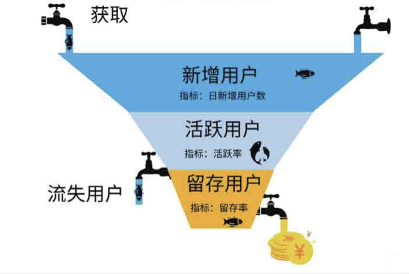

# 0101. 业务指标

为什么要学习业务指标？找到工作的学员在社群内部分享求职经验时，说到两个重要的能力：1）理解数据，懂得从数据中发现业务指标。这就要求你学会如何看懂数据。2）使用相关指标去分析数据，使用多个指标去分析一个问题。这就要求你知道常见的指标有哪些。为了帮助你掌握这些能力，本章内容包括 3 部分：1）如何理解数据？2）常用的指标有哪些？3）如何选择指标？

## 1.1 如何理解数据？

拿到数据以后，可以按照图 1-1 的步骤来理解数据。

第 1 步，弄清楚数据里每一列的含义。例如拿到一份 Excel 数据，要理解清楚每一列表示什么意思。不懂的地方，要和数据提供方沟通清楚。第 2 步，对数据进行分类，有助于后期的分析。通常将数据分为 3 类：用户数据（我是谁）、行为数据（我做了什么）、产品数据（卖什么）。

1、用户数据：我是谁。用户数据是指用户的基本情况，包括姓名、性別、邮箱、年龄、家庭住址、教育水平、职业等。

2、行为数据：我做了什么。行为数据是记录用户做过什么的数据。例如淘宝上，用户行为可以是用户在某个产品页面的停留时间、浏览过哪些产品、购买了哪些产品等。行为数据主要包括用户做了哪些行为、发生行为的时间等。

3、产品数据：卖什么。一个平台里的东西都可以看作产品，例如淘宝里的商品、优酷上的视频、公众号里的文章都可以看作产品。产品数据包括产品名称、产品类别、产品评论、库存等。举个例子，图 1-2 里的 3 个 Excel 文件是从我的公众号（猴子数据分析）里导出的数据。第 1 个文件「用户分析」里记录了关注公众号的用户信息。第 2 个文件「图文分析」里记录了公众号发过的文章信息。第 3 个文件「菜单分析」里记录了用户点击公众号菜单栏的信息。

现在对这 3 个文件的数据进行分类。「用户数据」包括的列名有性别、年、用户所在地区。「行为数据」包括点击某个菜单的次数、文章的分享量和收藏量。把公众号发过的文章看作产品，这样「产品数据」就包括文章的标题、发布文章的日期、文章阅读量。有些数据从不同角度来看，可以属于不同的分类。例如，对于文章的收藏量而言，收藏是一个行为，那么收藏量可以看作是行为数据；另外，收藏是产品被收藏，那收藏量也可以看作是产品数据。对于数据的分类不是绝对的，要根据具体业务去灵活定义。

## 1.2 常用的指标有哪些？

什么是指标？现代管理学之父彼得·德鲁克提出用管理促进企业增长（图 1-3），他讲过一句非常经典的话：「如果你不能衡量，那么你就不能有效增长。」那么如何去衡量呢？就是用某个统一标准去衡量业务，这个统一标准就是指标。接下来分看下用户数据、行为数据、产品数据相关的指标有哪些。

### 1.2.1 用户数据指标

假设我有一个鱼塘，为了扩大鱼塘的规模，我每天都会从外部渠道买新的鱼放到鱼塘里，这些新买的鱼就是鱼塘里的新增用户。鱼塘里的一部分鱼感觉鱼塘非常棒，有好吃的，环境也好，经常在水里活蹦乱跳，很活跃，这些鱼就是活跃用户。剩下的一部分鱼感觉鱼塘没啥意思，就不活跃，经常待在一个角落里，这些鱼就是不活跃用户随着时间的推移，一部分鱼觉得鱼塘没意思，就离开跑到其他鱼塘里了，这些鱼就是流失用户。留下来的鱼就是留存用户。

你会看到，鱼塘里有 3 种用户：新增用户、活跃用户、留存用户（图 1-4）。其中活跃用户对应的是不活跃用户，留存用户对应的是流失用户。

图 1-4 用户数据指标

村里有很多人都有鱼塘，为了成为村里的首富，我必须找到合适的指标来衡量鱼塘里鱼的留存、活跃等情况，从而制定对应的运营策略，才能靠养鱼赚到钱。用户数据相关的指标包括：1）对于新增用户使用的指标：日新增用户数。2）对于活跃用户使用的指标：活跃率。3）对于留存用户使用的指标：留存率。下面分别来讲解下这 3 个用户数据指标。

1、日新增用户数。日新增用户数就是产品每天新增的用户是多少。例如，图 1-5 是我的公众号最近 30 天的日新増用户数（公众号的日新增用户数是指每天新关注公众号的人数），将每天的新用户用折线连起来，就可以看出用户增长或者下跌的趋势。

为什么要关注新增用户呢？一个产品如果没有用户增长，用户数就会慢慢减少，越来越惨，例如人人网。同时，新增用户来自产品推广的渠道，如果按渠道维度来拆解新增用户，可以看出不同渠道分别新増了多少用户，从而判断出渠道推广的效果。

2、活跃率。在讲解活跃率之前，需要先知道活跃用户数。怎么定义活跃呢？是某个用户登录了 App 算活跃用户？还是打开使用了 App 里哪个功能算活跃用户？不同的产品定义不ー样，所以看到这样的指标，一定要搞清楚活跃是怎么定义的。活跃用户数按时间又分为日活跃用户数、周活跃用户数、月活跃用户数。

日活跃用户数：一天之内活跃的用户数。例如把打开公众号文章定义为活跃，日活跃用户数就是一天内打开公众号文章的人数。

周活跃用户数：一周之内至少活跃一次的用户总数。例如把打开公众号文章定义为活跃，周活跃用户数就是一周内打开公众号文章的人数。

月活跃用户数：一个月之内至少活跃一次的用户总数。例如把打开公众号文章定义为活跃，月活跃用户数就是一个月内打开公众号文章的人数。

图 1-6 是三大电商 2018 年 3 月的月活跃人数

需要注意的是，统计人数要去掉重复的数据。例如，小明每天都在看我的公众号文章，每天活跃 1 次，1 个月 30 天活跃 30 次。那么，月活跃人数是 30 吗？当然不是，1 个人 1 个月内活跃多次，也是 1 个人，所以月活跃人数是 1。活跃率是活跃用户在总用户中的占比，计算时用活跃用户数除以总用户数。根据时间可分为日活跃率、周活跃率、月活跃率等（图 1-7）。

电视剧《硅谷》第三季里，当大家开心地庆祝公司产品 Pied Piper 安装用户数突破 50 万的时候，公司的 CEO Richardz 却在担心。他在担心什么呢？因为在这 50 万安装用户里，只有 1.9 万用户是活跃的，也就是产品的日活跃率不到 4%（日活跃率 = 日活跃用户数 / 总用户数 = 1.9/50=3.8%）。这么低的活跃率说明产品存在很大的问题。在接下来，公司团队的主要任务就是抓这个指标，想各种办法来提高活跃率。

3、留存率。什么是留存？通过渠道推广过来的新用户，经过一段时间可能会有一部分用户逐流失了，那么留下来的用户就称为留存用户，也就是有多少人留下来了。所以留存和流失正好是相反的概念，好比一对分手的恋人，一个爱上了别人跑了，一个还爱着对方，留在原地。

还是通过公众号来举例，把取消关注公众号的用户定义为流失用户，那么继续关注公众号的用户就是留存用户。图 1-8 是我公众号（猴子数据分析）后台的数据。7 月 1 日有 117 人新关注了我的公众号，其中有 14 人又取消了关注，那么新关注的人里，剩下的 103 人就是这一天的留存用户数。再例如在游戏 Ap 中，从推广渠道过来的新用户，在一段时间还会再次登录游戏账号的就是留存用户为什么要关注留存呢？

留存可以评估产品功能对用户的黏性。如果一个产品留存低，那么说明产品对用户的黏性就小，就要想办法来提高留存了。留存反映了不同时期获得新用户的流失情况，如果留存低，就要找到用户流失的原因反映用户留存的指标，用留存率来表示。第 1 天新的用户中，在第 N 天还使用过产品的用户数，除以第 1 天新增总用户数，就是留存率。

这里需要注意的是「还使用过产品」，不同业务对于这块定义不样，要根据具体情況来确定。例如，公众号「还使用过产品」是指还关注该公众号，而另一款 App 中，「还使用过产品」是指还打开过 App。根据时间，留存率又分为次日留存率、第 3 日留存率、第 7 日留存率、第 30 日留存率等，计算方法如下 次日留存率：第 1 天新增的用户中，在第 2 天使用过产品的用户数 / 第 1 天新增总用户数；第 3 日留存率：第 1 天新增的用户中，在第 3 天使用过产品的用户数 / 第 1 天新增总用户数 第 7 日留存率：第 1 天新增的用户中，在第 7 天使用过产品的用户数 / 第 1 天新增总用户数；第 30 日留存率：第 1 天新增的用户中，在第 30 天使用过产品的用户数 / 第 1 天新增总用户数例如某个 App，把打开 App 定义为使用过产品，这款 App 每天的留存用户数如图 1-9 所示。

第 1 天新增用户 100 个，第 2 天这 100 个人里有 40 个人打开过 App, 那么次日留存率 = 40/100=40%。如果第 7 天这 100 个人里有 20 个人打开过 App, 那么第 7 日留存率 = 20/100=20%。Facebook 有一个著名的 40-20-10 法则，也就是新用户次日留存率为 40%，第 7 日留存率为 20%，第 30 日留存率为 10%，有这个表现的产品属于数据比较好的。用户数据指标有 3 个：日新增用户数、活跃率、留存率（图 1-10）。

### 1.2.2 行为数据指标

行为数据相关的指标包括：PV 和 UV、转发率、转化率、K 因子（图 1-11）。

1、PV 和 UV。PV（访问次数，Page View）：一定时间内某个页面的浏览次数，用户每打开一个网页可以看作个 PV。例如，某一个网页 1 天中被打开 10 次，那么 PV 为 10。UV（访问人数，Unique Visitor）：一定时间内访问某个页面的人数。例如，某一个网页 1 天中被 1 个人打开过 10 次，那么 UV 是 1。虽然这位用户在 1 天中打开该网页 10 次，但是这位用户都只能算一个人，所以 UV 是 1, 而不是 10。不同的产品，有时候指标名称叫得不样，但是本质上是指 PV 和 UV。例如，图 1-12 是我公众号的菜单分析数据，其中的菜单点击次数就是 PV，菜单点击人数就是 UV。

通过比较 PV 或者 UV 的大小，可以看到用户喜欢产品的哪个功能，不喜欢哪个功能，从而根据用户行为来优化产品。例如，比较上面的菜单栏点击次数（PV），点击次数最多的菜单名称表示用户最喜欢这个菜单的功能，那么就可以将该菜单放到公众号显著的位置。

2、转发率。现在很多产品为了实现「病毒式」推广都有转发功能，转发率 = 转发某功能的用户数 / 看到该功能的用户数（图 1-13）。例如，公众号推送一篇文章给 10 万用户，转发这篇文章的用户数是 1 万，那么转发率 1 万（转发这篇文章的用户数）/10 万（看到这篇文章的用户数）= 10%。

3、转化率。转化率的计算方法与具体业务场景有关，下面举几个例子（图 1-14）。

例如你有一家淘宝店铺，转化率 = 购买产品的人数 / 所有到达店铺的人数。「双 11」当天，有 100 个用户看到了你店铺的推广信息，被吸引进入店铺，最后有 10 个人购买了店铺里的东西，那么转化率 = 10 (购买产品的人数)/100 (到店铺的人数)=10%。如果仔细观察，你就会发现，这里的购买产品的人数、到店铺的人数，都是前面讲到的使用某个功能的访问人数（UV）。

在广告业务中，广告转化率 = 点击广告进入推广网站的人数 / 看到广告的人数。例如经常使用百度，搜索结果里会有广告，如果有 100 个人看到了广告，其中有 10 个人点击广告进入推广网站，那么转化率 = 10（点击广告进入推广网站的人数）/100（看到广告的人数）= 10%。

4、K 因子。K 因子（K- factor）可用来衡量推荐的效果，即一个发起推荐的用户可以带来多少新用户。K 因子 = 平均每个用户向多少人发出邀请 × 接收到邀请的人转化为新用户的转化率。假设平均每个用户会向 20 个朋友发出请，而平均的转化率为 10% 的话，K 因子 = 20x10% = 2。K >1 时，新用户数就会像滚雪球一样大。如果 K <1 的话，那么新增用户数到某个规模时就会停止通过自传播增长。

### 1.2.3 产品数据指标

产品数据相关的指标包括：用来衡量业务总量的指标，例如成交总额、成交数量；用来衡量人均情况的指标，例如客单价；用来衡量付费情况的指标，例如付费率、复购率；以及与产品相关的指标（图 1-15）。

1、总量。用来衡量业务总量的指标有：成交总额、成交数量、访问时长（图 1-16）。如果你经常看分析报告，一定会看到 GMV (Gross Merchandise Volume），它就是指成交总额，也就是零售业说的「流水」。需要注意的是，成交总额包括销售额、取消订单金额、拒收订单金额和退货订单金额。成交数量对于电商产品就是下单的产品数量。对于教育行业，就是下单课程的数量。访问时长指用户使用 App 或者网站的总时长。

2、人均。用来衡量人均情况的指标有人均付费、付费用户人均付费、人均访问时长。

人均付费 = 总收入 / 总用户数，人均付费在游戏行业也叫 ARPU (Average Revenue Per User），在电商行业也叫客单价。付费用户人均付费（ARPPU, Average Revenue Per Paying User)= 总收入 / 付费人数，这个指标用于統计付费用户的平均收入 人均访问时长 = 总时长 / 总用户数，用于统计每个人使用产品的平均时长。来看一个例子（图 1-17），截至 2018 年 3 月 30 日，在过去 12 个月的人均消费，阿里巴巴是 8732 元，京东是 4426 元，拼多多是 673.9 元。

3、付费。付费相关的指标有付费率、复购率（图 1-18）。

付费率 = 付费人数 / 总用户数。付费率能反映产品的变现能力和用户质量。例如，某 App 产品有 100 万注册用户，其中 10 万用户有过消费，那么该产品的付费率 = 付费人数（10 万）/ 总用户数（100 万） = 10%。

复购率是指重复购买频率，用于反映用户的付费频率。复购率指一定时间内，消费两次以上的用户数 / 付费人数。例如，微信收账管理小程序可以帮助商家统计通过信转账的用户，图 1-19 是某商家 2019 年的计界面，其中累计顾客数（付费人数）是 1099，回头客数 (重复购买用户数) 是 46, 那么复购率 = 重复购买用户数 (46)/ 付人数 (1099)=4.2%。

4、产品。产品相关的指标是指从产品的角度去衡量哪些产品好，哪些产品不好。通过找出好的产品来进行重点推销，不好的产品去分析原因。常见的几个指标是热销产品数、好评产品数、差评产品数。这里可以根据具体的业务需求，灵活扩展使用。

对于公众号来说，每篇文章就是一个产品。我每个月会把公众号里的全部文章按转发率来排名，从而发现哪些文章是大家比较喜欢的。当发现大家最喜欢求职类文章后，就按类别将文章放到菜单栏「求职秘籍」里，这样就用数据保证了里面的内容是热销产品，也就是转发率高的文章（图 1-20）。

前面的指标可以用图 1-21 来记住。

### 1.2.4 推广付费指标

在付费做广告推广时，涉及考察推广效果的指标。从不同的付费渠道可以分为以下指标：展示位广告、搜索广告、信息流广告（图 1-22）。

1、展示位广告。展示位广告出现在网站或手机 App 的顶部、App 的开屏等。开屏广告就是当用户打开手机 App 时，会有几秒的广告时间，例如打开微博、知乎时会先给你展示一个开屏广告。这种类型的广告通常是按展示次数付费（CPM, Cost Per Mille），也就是有多少人看到了该广告。

2、搜索广告。例如搜索引擎（百度等）的关键字搜索广告、电商搜索广告（淘宝直通车等）。广告主为某ー个搜索关键词出价，用户看到的搜索结果是按广告主出价的高低来排名的。这种类型的广告是按点击次数付费（CPC, Cost Per Click），也就是有多少人点击了该广告。

3、信息流广告。例如微博、今日头条、知乎、朋友圈（信息流）里的广告。这种广告是根据用户的兴趣爱好来推荐的。这种类型的广告按点击次数付费（CPC）或者按投放的实际效果付费（CPA, Cost Per Action）。按投放的实际效果付费（CPA, Cost Per Action）包括：1）CPD (Cost Per Download）：按 App 的下载数付费。2）CPI (Cost Per Install) l：按安装 App 的数量付费，也就是下载后有多少人安装了 App；3）CPS（Cost Per Sales）：按完成购买的用户数或者销售额来付费。

这几个指标其就在我们的日常生活中，例如你打开知乎 App，在开屏的几秒展示的广告叫作按展示次数付费（CPM）；你对这个广告感兴趣，点击了广告，叫作按点击次数付费（CPC）；看到广告里的介绍，你没忍住下单购买了商品，叫作按投放的实际效果付费（CPA）。

在决定将产品投放到哪个渠道的时候，要清楚你的目标用户是谁，目标用户在哪。如果你是一款为企业服务的软件，在娱乐网站打广告就非常不合适。目前主流广告平台都支持这三种方式的付费：按展示次数付费（CPM）、按点击次数付费（CPC）和按投放的实际效果付费（CPA）。广告主可以按自己的产品需求来灵活选择。

一般来说，如果是推广一个新的产品，要选择按 App 的下载数付费（CPD）。因为新产品还没有人知道，用下载数来衡量，是比较划算的。等有一定的品牌影响力积累了，再用按点击次数付费（CPC）或者按投放的实际效果付费（CPA）。

## 1.3 如何选择指标？

这么多指标，如何选择呢？选择指标的时候，需要考虑两点。

1、好的数据指标应该是比例。通常要想理解一个数字的真实含义，最好把它除以一个总数，换算成一个比例。

例如，告诉你公众号打开次日文章用户数 (活跃用户数) 是 1 万，让你分析公众号是否有问题。这其突是看不出什么的，如果告诉你总粉丝量是 10 万，那么可以计算出次日活跃率 = 1 万（活跃用户数)/10 万（总用户数）=10%。和行业平均活跃率（公众号的平均活跃率是 5%）比较，会发现这个公众号活跃率很高。所以，在求职面试或者工作里看到指标的时候，要看这个指标是不是个比例。如果不是，你需要算成比例

2、根据目前的业务重点，找到北极星指标。北极星指标就是衡量业务的核心指标。为什么叫北极星指标呢？在电影《金蝉脱売》（图 1-23) 中，主角为了知道监狱所在的位置，做了一个似器。通过这个似器可以测北极星的高度，然后通过这个数据算出所在地区的经纬度。所以，北极星在野外活动中可以为人们指明方向。在实际业务中，北极星指标一旦确定，可以像天空中的北极星一样，指引着全公司向着同一个方向努力。

北极星指标没有唯一标准。不同的公司关注的业务重点不ー样，即使是同一家公司在不同的发展阶段，业务重点也不一样，所以要根据目前的业务重点，去寻找北极星指标。这里介绍几个例子（图 1-24），希望对你有启发。

来看第一个例子，图片分享 App Instagram 在早期的社交功能和现在不一样，当时市面上已经有了 facebook 这种多功能的社交产品，如果做的产品和 facebook 一样，是很难走下去的。在分析用户需求后，公司发现用户对分享照片的需求很大，于是公司团队找到的北极星指标是照片分享率，再以照片为核心去设计产品，最后只留下了照片、评论和点赞功能，并増加了美化拍照的滤镜。改变几个月后，专注于图片社交分享的 Instagram 正式推出，上线一天便获得 25000 个用户，3 个月后这个数字达到 100 万

第二个例子是 facebook。在 facebook 成立之前，世界最大的社交网站是 myspace myspace？被 facebook 打败有很多原因，但是两个公司有一个区别：myspace 关注的核心指标是「注册用户数」，而 facebook 在成立的早期就把核心指标定为「月活跃用户率」。

第三个例子是音频 App 喜马拉雅。喜马拉雅的用户最重要的行为是什么？是听音频，所以他们公司内部定的核心指标是用户的收听时长，就是每一个用户进来以后，他能听多久的音频。

## 1.4 指标体系和报表

很多数据分析招聘的要求里会写「构建指标体系」，所以建立指标体系是数据分析人员的一项基本技能。下面从 4 个问题出发，系统介绍指标体系。1）什么是指标体系？2）指标体系有什么用？3）如何建立指标体系？4）建立指标体系有些注意事项？

1、什么是指标体系。实际工作中，想要准确说清楚一件事是不容易的。例如，你在金融公司工作，工作中可能会听到这样的对话：「大概有 1 万多人申请货款吧」有很多人都没有申请通过」「感觉咱们的审核太严了」。同事之间这样闲聊说话没什么问题，但是如果是向领导汇报或者是数据分析师在回答业务部门问题的时候就不能这么说了，一定要用准确的数据和指标来描述清楚。例如上边的对话可以改成：

5 月 4 日新申请货款用户 10450 人，超目标达成 1450 人。

5 月 4 日当日申请货款用户 10450 人，当日通过 2468 人。

截至 5 月 6 日，5 月 4 日申请货款的 10450 名用户中有 3690 人通过申请，申请通过率 35.31%。

上面通过一个指标「申请通过率」说清楚了申请货款用户的情况。但是实际工作中，往往一个指标没办法解決复杂的业务问题，这就需要使用多个指标从不同维度来评估业务，也就是使用指标体系。指标体系是从不同维度梳理业务，把指标有系统地组织起来。简而言之，指标体系 = 指标 + 体系，所以个指标不能叫指标体系，几个毫无关系的指标也不能叫指标体系。

2、指标体系有什么用。在讨论一个人是否健康的时候，常常会说出一些名词：体温、血压、体脂率等。当把这些指标综合起来考量，大概就能了解一个人的健康状况。同样，对于一家公司的业务是否正常（健康），可以通过指标体系对业务进行监控。当业务出现异常时，就能以最快的速度发现问题，开始分析，然后解決这些问题，最大化地減少损失。指标体系的作用包括：1）监控业务情况。2）通过拆解指标寻找当前业务问题。3）评估业务可改进的地方，找出下一步工作的方向。

3、如何建立指标体系。可以用图 1-25 的方法建立指标体系。

1）明确部门 KP，找到一级指标。一级指标是用来评价公司或部门运营情况最核心的指标。例如，某旅游公司在会员积分方面的开销较大，业务部门关心成本，定的 KP 是合理利用积分抵扣金额，节省成本，所以该部门一级指标定为积分抵扣金额。

级指标并非只能是一个指标，有可能需要多个指标来综合评价。例如，某网货公司产品部门的主要职能是开发出符合市场需求的货款产品，在提升业务量（放款量）的同时，也需要监控业务质量（放款逾期率），所以该部门的 KI 有两个：货款产品放款金额、货款产品的坏账率货款产品卖得好光看「放款金额」还不够，还要关注毛利润，同时也需要看用户数，因为用户数直接和获客成本挂钩，要防止营销成本太高、实际没利润这样不可持续情况的发生。所以该部门确定了三个一级指标：放款金额、毛利润、用户数

2）了解业务运营情况，找到二级指标。有了一级指标以后，可以进一步将一级指标拆解为二级指标。具体如何拆解，要看业务是如何运营的。例如销售部门一般按地区运营，就可以从地区维度拆解。市场部门一般按用户运营，就可以从用户维度拆解。例如，前面的案例中一级指标是积分抵扣金额，从订单维度拆解为：积分抵扣金额 = 积分抵扣的订单数 x 平均订单抵扣金额，从会员维度拆解为：积分抵扣金额 = 积分抵扣的会员数人均抵扣金额。一级指标、二级指标的结构如图 1-26 所示

3）梳理业务流程，找到三级指标。三级指标往往是业务流程最终的结果，例如积分抵扣金额，是业务流程（会员 -》购买旅游产品 -》使用积分抵扣ー》支付金额）最后的一个结果。光看一个最后结果是无法监督、改进业务流程的，这就需要一些更细致的指标，也就是添加三级指标。例如，在业务流程中不同会员等级可以抵扣的金额不样，不同旅游产品线可以抵扣的金额比例也不ー样。所以，需要把二指标按照业务流程拆解为更细的三级指标。在会员业务节点可以拆解为 L1 级会员数、LV2 级会员数、LV3 级会员数、LV4 级会员数。在购买旅游产品业务节点可以拆解为酒店订单数、机票订单数、跟团游订单数、自由行订单数。

最后确定的指标如图 1-28 所示，因为一级指标、二级指标、三级指标的结构像金字塔，所以图 1-28 也叫作指标体系金字塔。

每个指标可以从 3 个方面确定统计口径：1）指标业务含义：这个指标在业务上表示什么？2）指标定义这个指标是怎么定义的？3）数据来源：从什么地方收集的原始数据？数据统计的时间范围是什么？

4）通过报表监控指标，不断更新指标体系。报表就是报告状况的表，是通过表格、图表来展示指标，从而方便业务部门掌握业务的情况。每天汇总更新的报表叫做日报，每周汇总更新的报表叫做周报。例如，图 1-29 是猴子·数据分析学院的报表，通过该报表可以了解新老用户的付费情况。

图 1-30 是用户在知乎每周收到的创作者周报，可以了解每周的创作数据。

在前面步骤找到了一级指标、二级指标和三级指标，到这一步可以把这些指标制作到报表中，通过报表监控指标，不断更新指标体系。如何制作报表呢？可以通过图 1-31 的 5 步来制作报表。

现在通过一个案例详细阐释制作报表的步骤：1）需求分析。某旅游公司在会员积分方面的开销较大，业务部门想做一个会员积分报表，监控会员积分使用情况，也为日后优化规则做准备。业务部门想要通过报表知道这些问题：支付订单时有多少会员在使用积分进行抵扣？每个月抵扣了多少金额？ 2）建立指标体系。前文建立的指标体系如图 1-32 所示。3）设计展现形式。报表默认设置是显示全部订单类型、全部会员等级的数据。需要看更详细的数据时，再点击报表上的小三角形展开查看详细数据。报表在筛选器方面，提供时间、订单类型、会员等级的筛选功能。经过和业务部门确认，报表的样式如图 1-33 所示。4）编写需求文档。把上述指标体系和报表需求整理成一份文档，给到开发部门。5）报表开发。报表开发出来之后，如果验证过数据没有问题，就可以告知业务部门。

4、建立指标体系有哪些注意事项。建立指标体系需要注意以下 4 个问题。

1）没有一级指标，抓不住重点。工作里最常见的情况是你获得的报表是从离职同事那里交接过来的，或者是领导给你的指标，你只是负责定时更新报表。但是为什么这样做报表？做完了报表给谁看？其实你是不清楚的想要弄清楚这些，需要知道一级指标是什么。如果不能围绕一级指标来做事会闹出笑话来例如，某银行的一级指标是放款金额。为了激励员工，根据 KPI 给分行经理制定的奖励规则如下投诉率最低的五个分行经理各奖励 2000 元现金分行客服月通话时长平均≥3.5 小时，奖励 3000 元。

某个分行经理带领团队只放出货款 20 万元，在 150 家分行中排名最后一名，也就是该分行经理远远没有完成指定的放款金额。但是因为上面 KPI 完成得好，其奖励反而比某些完成放款金额目标的分行经理高。这种不以一级指标（放款金额）为前提的激励方案就是无效的方案。

2）指标之间没有逻辑关系。如果不按照业务流程来建立指标体系，虽然指标很多，但是指标之间没有逻辑关系，以至于出现问题的时候，找不到对应的业务节点是哪个，没办法解決问题。

3）拆解的指标没有业务意义。有的报表上的指标很丰富，但是却没有实际的业务意义，导致报表就是一堆「没有用」的数字。例如，在销售部门，最关注的是销售目标有没有达成，现在达成了多少，接下来的每天应该达成多少，哪些区域达成最高，哪些区域达成最低。如果不围绕这个业务目标拆解指标，而是随意把指标拆解为用户年、性别，这就与业务没有任何关系，只是为了拆解而拆解

4）一个人就完成了指标体系和报表，也不和业务部门沟通。建立指标体系不是一个人能够完成的，需要业务部门（市场、运营、产品等部门统称为业务部门）、数据部门（这里把数据分析师所在的部门统称为数据部门）、开发部门相互之间进行协作。

业务部门会不断提出新的业务需求。如果业务部门认可数据部门做出的分析报告，并希望以后可以随时查询到相关的数据，那么数据部门会把数据产品化，也就是协助开发部门把数据产品做进公司后台系统，一般形式就是报表。日常工作中，业务部门、数据部门、开发部门是像图 1-34 这样紧密协作。建立指标体系需要各部门紧密沟通，还需要对公司业务和各部门职能的深刻理解，也就是这本书后面章节讲述的业务知识，在此基础上再掌握建立指标体系的方法，不断进行尝试，就能够搭建出合适的指标体系。

下面再来看一个金融行业的报表案例，里面涉及的指标含义不需要理解，在金融行业章节会有详细介绍，这里大概了解工作中的报表是如何应用的就可以。货款产品的业务流程是用户货款申请、资质审核、放款、用户货后还款、逾期欠款催收，可以根据业务流程建立指标体系，一般会用三张报表去监控业务运行情況：货前放款报表、货后逾期报表、货后催收报表。

1、前放款报表。表 1-1 是「贷前放款报表」，记录了当月每个货款产品的申请放款情况。贷前放款报表中，从最初的目标放款额开始，按放款业务流程（用户申请、资质审核、用户货后还款）的各个业务节点的数据都记录在内，从这张报表中可以很直观地去对比各货款产品的数据差异，从中发现问题并及时分析调整。

2、货后逾期报表。当给用户发放完货款之后，接下来就需要用户分期还款了。正常情況下，大部分用户都会按时还款，但是不可避免会有用户不能及时还款而发生逾期。这时就需要用表 1-2「货后逾期报表」来监控各个逾期阶段的情，以便尽早催收贷款挽回损失。货后逾期报表记录了公司各个货款产品货后逾期情況，也就是放款给用户后，有多少人逾期了，逾期未还的占比（逾期率）是多少。如「1~8 天放款逾期率」就等于当前逾期 1~8 天的合同未还金额，除以该产品总放款金额。

3、货后催收报表。当用户还款出现逾期时，为了尽可能地挽回损失，要进行欠款催回，于是就有了表 1-3「货后催收报表」来帮助监控催收情况。货后催收报表记录了用户货后逾期进入催收阶段的数据情況。表中的第一部分入催率主要用于衡量用户未还款进入催收环节的情况，各指标含义如下每日维护总量：公司目前的放款总合同数量 C-M1 户数：逾期天数在 30 天以内的总合同数。

C-M1 户数比率：逾期天数在 30 天以内的总合同数除以总放款合同数表中的第二部分迁徒率主要用于衡量催收部门的工作效果，各指标含义如下入 M2 户数：逾期 30 天以上且在 60 天以内的合同数。

C-M2 户数比率：逾期 30 天以上且在 60 天以内的合同数除以总放款合同数。

1-M2 户数比率：逾期 30 天以上且在 60 天以内的合同数除以逾期天数在 30 天以内的总合同数。

因为用户逾期要先经过 M1 オ会到 M2 阶段，这其中就涉及一个转化问题，只有在 M1 阶段没有被催收人员催回的合同会进入 M2 逾期阶段，所以如果 M1-M2 户数比率很低，就说明很多合同在 M1 阶段逾期时就被催收人员及时催回，没有转入 M2。通过监控 M1-M2 户数比，就可以看到催收人员的工作效率如何了。

## 本章作者介绍

猴子，中国科学院大学硕士，「猴子·数据分析学院」创始人，公众号「猴子数据分析」创始人，前 IBM 工程师。其「分析方法」课程入围知乎年度口碑榜 TOP10，首创的「闯关游戏学习数据分析模式」深受用户喜欢。