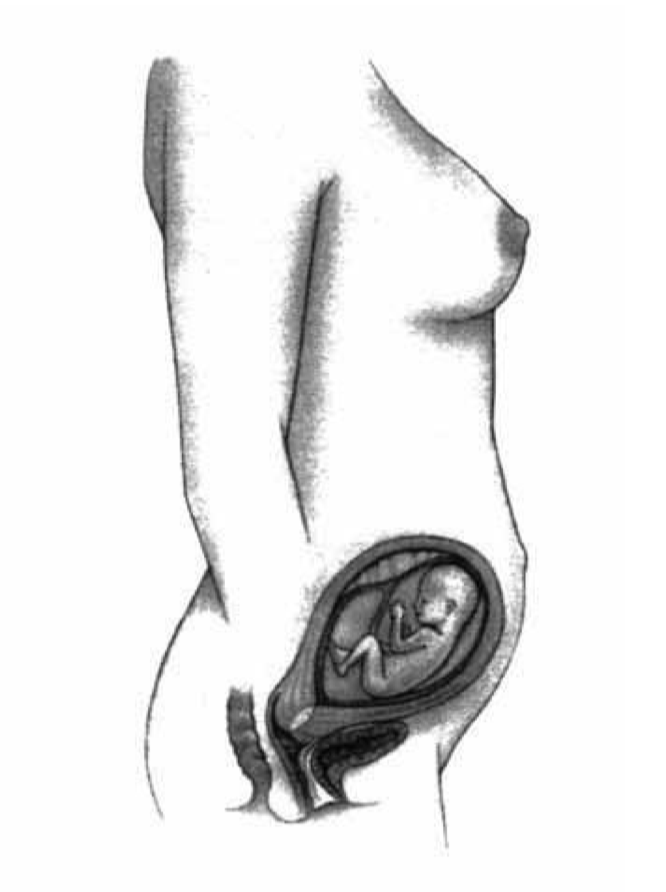
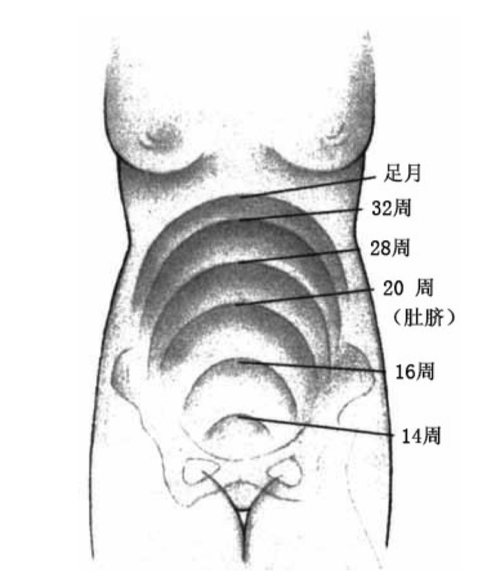

# 0204. 第 4 个月：感觉舒服多了

『

### 第 4 个月的产前检查（13-16 周）

在第 4 个月的产前检查中，你可能会：

1、检查子宫的大小和高度。

2、检查浮肿、静脉曲张和皮疹。

3、有机会听到宝宝的心跳声。

4、有机会通过超声波看见已经发育的所有器官，可能会看到宝宝在动。

5、筛查可能的遗传缺陷。

6、测量体重和血压（接下来的 3 个月体重可能会迅速增长）。

7、尿常规：有无感染、糖和蛋白质。

8、超声波检查胎儿数量、胎盘位置和可能的出生缺陷，可能还会重新估算预产期。

9、有机会与医生讨论你的感受和担心。

』

好日子总算来了！在感觉糟透了的最初几个月过去后，准妈妈终于可以暂时喘口气了。现在，你很有可能会感到更有活力一些，很多准妈妈就是从这个月开始享受怀孕状态的，尽管还是会有「恶心」的日子，但是已经有精力体会将要为人母的那份兴奋和激动了。整天恶心的感觉慢慢消失了，食物对你越来越有吸引力，身体的活力一天天恢复，对一些事情也就逐渐恢复了兴趣，比如吃东西和做爱，而在过去的几个月里这些是你一直回避的事情。

在即将到来的几周内，妈妈和宝宝都会经历一个快速生长期。很快，你的肚皮就会隆起（如果现在还没有的话），对于周围的人来说，你怀孕这件事就变得「显」而易见了。对流产、出生缺陷或遗传异常（如果你已经做了遗传筛查的话）的恐惧已经不再困扰你，你的宝宝现在已经完全成形，正在不断长大。

## 4.1 第 13-16 周宝宝的发育情况

13-16 周的宝宝

到了第 16 周，宝宝大约像葡萄柚那么大，重 86-112 克，胳膊和腿长长了，开始挥手踢腿了，不过你可能直到第 18 周，才会感觉到宝宝的存在。新长出来的手指蜷成拳头，小小的拇指可能放进了张开的嘴里；眼睑仍然闭着，保护快速发育中的眼球；头发和眉毛出现了；宝宝开始用小小的肺芽儿「呼吸」羊水，这种初始的呼吸可能会导致轻微的打嗝；宝宝已经具备一定的听力，可以对声音做出反应；薄薄的头皮上开始长出越来越多的头发；男宝宝开始分泌睾丸素，女宝宝小小的卵巢开始生产卵子。

『

### 感觉子宫在增大

尽管正在增大的子宫的高度因人而异，但是在第 3 个月末至第 4 个月中期的某个时候，你可能开始感觉到子宫顶部正抵在耻骨下方。以后再次怀孕的时候，你可能会更早地感觉到子宫，因为已经了解那种感觉，而且你的腹肌更松弛。

试一下这个：排空膀胱，仰面躺下，放松腹肌，用手指轻轻摩擦耻骨的上端，你可能会感觉到一个小硬球的顶部。如图，到第 16 周，这个小硬球感觉就像个棒球，位于耻骨上端和肚脐之间；到第 20 周，你会感觉自己的子宫大概与肚脐齐平了，大小如同垒球。

你期待已久的第一次能够感觉得到的踢动 —— 胎动一般就发生在末次月经之后约 18 或 19 周的时候。不过，胎动也可能会早几个星期或晚几个星期出现，这取决于胎盘的位置和你的敏感度。最初，胎动常常就像是轻微的颤动，之后慢慢发展成踢、打和翻跟斗。一旦你感觉到内部开始隆起，就很有可能会本能地重复抚摸那个区域，就好像想要拥抱你的宝宝。耐心点，很快你的肚皮就会隆起得更高，你就可以拥抱更大的宝宝了。

』

## 4.2 你可能会有的感觉

威廉医生笔记：在为人父母刚刚开始的那些日子里，疲惫的新妈妈新爸爸经常问我：「我们的生活何时才能重归正轨？」我微笑着提醒他们：「这就是你们现在的正常生活啊！」

### 4.2.1 让大家知道

虽然有些孕妇仍然对自己变化的身体怀有矛盾的情感，但是大多数女性对自己更丰满的体形感到愉悦，甚至有点想炫耀。如果之前你一直没有公开怀孕的消息，那么这个秘密现在可能浮现出来了。由于身材和胎盘的位置不同，在这个阶段，你的肚皮有可能只是稍微有点隆起，也可能已经非常明显地鼓出来。很多孕妇发现，分享这个消息让她们可以好好炫耀一番，这足以补偿身体上的所有不适。

### 4.2.2 宝宝，你好啊！

如果此时你做了第一次超声波检查，看到宝宝的第一眼可能让你说不出话来。通过超声看到宝宝，感受到隆起，听到胎心跳动，所有这一切都让你更深切地意识到，这个小人儿已经定居下来。你的心思可能会更多放在宝宝身上，而较少想到自己，这些高涨的爱意会自然而然地让你和宝宝之间发展出亲密感，每一天，你跟小家伙的关系都在不断加深。

这个月，当我和丈夫看到超声显示器上的宝宝时，完全惊呆了。那是一种发自肺腑的震惊，我的意思是，我的确早就知道自己怀孕了，但是看到活生生的宝宝就在眼前，还是激动得无法控制自己，有好几天我都高兴得忘乎所以。

### 4.2.3 恢复活力

准妈妈可能感到重新变得有活力了，但这只是相对的，你不可能恢复到怀孕之前的水平。这并不是说你的整体能量水平降低了，而是更多的能量用于身体内部发生的变化上了。

我感觉好多了，结果做了个错误的决定 —— 太快地投入高速运转状态，做得事太多。幸运的是，我的身体不允许我这么做，就好像里面有个稚嫩的声音促使我松开油门。

没人会期待你像原来那么能干，能做原来做的所有事情。现在，你是全新的「自己」，你的宝宝会经常提醒你：「妈妈，慢一点！」记住，在整个孕期，宝宝在中间这 3 个月里要比在其他时间发育得更多，而可用的能量只有那么多。生物学提醒你，宝宝会优先得到妈妈的天然资源，而你和其他人都必须适应这一点，你们只能用剩下的资源。

### 4.2.4 去洗手间的次数少了

在过去 3 个月里，宝宝施加在膀胱上的压力让你日夜不停地跑洗手间，随着子宫上升到骨盆之外，离开膀胱，这种压力在之后的一两个月里将会减轻一些。不过，在最后的两个月里，胎儿变得更大，并且开始下降，那时你就又得开始跑洗手间了。所以，好好享受这段短暂的休憩时光吧！

### 4.2.5 阴道分泌物增加

在孕期，阴道分泌乳状、气味独特、类似蛋白的物质，是正常的，这跟经前期的阴道分泌物相似，不过量更大，而且持续不断。这是因为，孕期激素会提高流向阴道组织的血流量，为宝宝准备出生通道，而这些激素会刺激分泌物产生，来帮助不断拉伸和变化的肌肉组织。做好准备，一天多次更换短裤，或是垫上护垫，保持干爽舒适。

尽管大多数阴道分泌物只是增加了一点麻烦，但有些分泌物可能提示有感染。如果出现以下情况，请告诉你的医生：1）之前类似蛋白的分泌物变成脓状、发黄发绿、奶酪状，或是有腐败气味；2）你觉得烧灼或瘙痒；3）你的阴唇肿大、变红或变得敏感；4）排尿时感觉烧灼疼痛。

### 4.2.6 牙龈出血

随着乳房和生殖器官的机体组织需要更多血流量来滋养宝宝，全身的血流量都增加了。这导致暴露在外的组织，例如牙龈，在刷牙的时候更容易出血。显而易见，你的牙龈越健康，你的宝宝就越健康。近年来，医生逐渐认识到状态良好的牙龈和良好的健康之间的关联：当细菌在牙龈上积聚时，它们会导致感染，引发疼痛、肿大和难闻的口气，这些细菌还可以慢慢渗透到血液中，在身体的其他部位引起发炎感染。

去牙医那里做个全面检查吧！虽然研究支持牙齿清洁，但牙医可能仍旧需要医生的许可才会给你进行深度清洁。你的医生会很高兴给牙医发许可，也会告诉牙医注意哪些事项。下面是关于护理牙龈和牙齿的一些小贴士：

1、温柔地对待你的牙龈。使用软毛的牙刷；如果你现在有特别喜欢的牙刷，可以在刷牙前先用热水泡一下刷毛进行软化。除了刷牙，还要注意清洁牙龈边缘 —— 牙齿和牙龈之间的齿龈沟，这里最容易积聚细菌，发生肿大和出血。

2、使用牙间刷（像一根牙签，头上带着圣诞树状的硬毛）来刷牙齿之间和周边的牙龈。口袋里装一支牙间刷，每顿饭后轻轻地刷几下齿缝，尤其是在吃了黏稠的东西之后。

3、怀孕时最好使用水牙线。为了照顾敏感的牙龈，可能需要调整电机的强度。轻柔的水流冲洗可能比普通牙线更能够清洁包裹在整颗牙齿周围的牙龈，保护敏感的牙龈。

4、如果用牙线，可以围绕一颗牙齿把牙线弯成 C 形状，从牙龈上划过；然后在下一颗牙齿反方向弯成 C 形状，重复这个过程。不要让牙线太深入齿缝和牙龈，这可能会伤到敏感的组织，导致出血，让细菌进入齿龈沟。

5、每晚上床前使用刮舌板。在不引发呕吐的情况下，刮得越深越好，因为这是食物残渣容易积聚的地方。

6、饭后和刷牙前用温水漱口。饭后漱口是个好习惯，可以让你口气清新。你甚至可以尝试用洋甘菊茶漱口。

7、给牙龈吃最好的食物。避免黏稠的食物，例如饴糖，要多吃营养牙龈的食物，例如含有维生素 C、D、钙和叶酸的食物。对骨骼有益的营养素对牙齿也有好处。注意：不要购买咀嚼型维生素 C 片，维生素 C 是抗坏血酸，如果停留在牙齿上，会腐蚀牙釉质。

### 4.2.7 流鼻血

激素还会导致鼻子流血，尤其是在用力擤鼻涕或打喷嚏的时候，甚至在没有任何刺激的情况下也会发生，因为怀孕时鼻腔内壁上暴露的血管更脆弱。当你的鼻子堵了的时候，重要的是顾及鼻腔内壁上这些毛细血管，尽量轻柔地擤鼻子，一次只擤一个鼻孔；不要抠鼻孔，尽量保持鼻腔湿润。（继续阅读关于「鼻腔冲洗」和「蒸气清洁」的内容。）

『

### 科学说：牙龈越健康，宝宝越健康

美国北卡罗来纳州大学的研究人员，在一项研究中征集了 1000 名孕妇，对她们的分娩情况进行了比较比较，其中那些有中度或重度牙龈炎或牙周病的孕妇比牙龈健康的孕妇，生下早产儿的风险高一倍多。产科和牙科的研究人员认为，牙龈发炎会导致血液中炎性化学物质的总体水平升高，引发早产。

』

### 4.2.8 充血堵塞

这时要在手边准备一包纸巾。孕期激素使得所有的组织肿大，鼻腔和呼吸道内膜也不例外，过敏患者可能更容易过敏，鼻后滴漏症患者可能滴漏得更厉害。说到鼻子堵塞，在第 9 章学到的「内部药物」模式可以派上用场了。除非你的医生另有建议，否则要避免使用处方的或非处方的去充血剂、抗组胺剂和可的松鼻腔喷剂，尽管少量使用这些药物没有危险，但其实没有太大帮助，而且也没有理由让宝宝接触不必要的药物。更好的办法是通过天然的方式缓解鼻子的堵塞：

1、自制盐水滴鼻液（半匙盐溶解在 225 毫升水中），或是购买现成的盐水。在堵塞的鼻腔里滴或喷上几滴，然后轻轻擤鼻子，一次一个鼻孔。

2、不要用力擤鼻子，也不要在擤的时候同时捏住两只鼻孔，这样会导致鼻子流血，把分泌物推进鼻窦，导致鼻窦发炎。

3、尝试「鼻腔冲洗」。洗鼻壶是解决鼻子堵塞、疏通鼻窦的柔和方式。这种像阿拉丁神灯一样的器具，可以让你仰头用壶嘴把温暖的盐水倒进上鼻腔，让盐水从一个鼻孔进去，从另一个鼻孔出来，把鼻涕冲洗出来。记得使用后一定要彻底清洗洗鼻壶。

4、尽情享用「蒸气清洁」。看书或看电视的时候使用面部蒸气机，上床前洗个热水淋浴，尽情享受蒸气清洁，另外还可以在床边放上加湿器。冬天，把卧室的中央空调的暖风调低，打开一个或两个加湿器。加湿器喷出的温暖雾气可以充当更健康的热源，让你不必呼吸中央空调制造的干燥空气。

## 4.3 你可能关心的事

### 4.3.1 眩晕

感觉头晕眼花？为什么？因为你怀孕了！通常当你快速转换姿势的时候，例如，当你从床上下来或是从椅子上站起来的时候，大脑会告诉心脏快速调整血压，使流向大脑的血流量维持平稳。但在孕期，这个机制变得有些不稳定，当你转换姿势时，心脏对大脑的需要反应比较慢，因为增大的子宫及其乘客在和大脑竞争临时需要的额外血液量，自然，宝宝赢了。当你起身的速度太快，而血液流向大脑的速度暂时减缓时，你就会感觉眩晕，这被称为体位性低血压，即姿势变化造成的低血压。

有时也会发生直立性低血压。当你站着或久坐的时候，血液就在下半身积聚，造成脑部血液供应不足，你会感觉头晕眼花。这种情况在孕后期会越来越严重，因为你的下半身变得越来越大，需要越来越多的血液。不断增大的子宫也会压迫腹部的主血管，使血液流向上半身的速度减慢，尤其是当你仰面躺着或右侧躺的时候。

如果感觉眩晕不只是一个小烦恼，就要跟医生讨论这个问题，可能有医学上的原因导致你产生这种感觉，比如红细胞数量低，即贫血或低血糖。这些可以通过评估你的饮食习惯变化和快速手指采血进行诊断。下面这些方法有助于减少孕期的眩晕：

1、慢慢改变姿势，尤其是起床或长时间躺、坐之后。任何引起流向大脑的血流量发生改变的动作都可能导致眩晕或头痛。

2、缩短站立的时间，经常坐下休息休息。

3、如果你变换姿势时感到眩晕，那就立刻躺下，最好是左侧卧。

4、补水！缺水会加重眩晕，要保证每天至少饮用 8 杯水。如果你出汗很多，增加一定量的盐分摄入（考虑鸡汤）会有帮助。

5、不要静静地坐着或站着。如果你必须在一个地方坐或站很长时间，经常活动活动腿脚，刺激血液持续向上流动。坐着的时候，垫个脚凳抬高双腿，避免血液积聚在下半身。

6、休息或睡觉的时候左侧卧。

7、少食多餐有营养的零食，多吃富含铁的食物，改善血糖和血细胞。

琳达医生笔记：来我办公室或医院抱怨头晕的孕妇让我非常惊讶，当你问及她们的饮食和饮水情况时，她们会说自己已经有好几个小时没吃没喝了。要知道，你和宝宝都需要大量的液体和营养！

### 4.3.2 体温稍高

你是否发现自己的身体随着孕期的发展好像在不断升温？这是因为流向全身各处组织的血流量增加，带来了更多热量，有时候还会让你出更多汗来释放这些热量。除了总是感到热，有些妈妈还会感到一阵阵潮热，甚至夜里会出汗。你可能还会发现你跟伴侣的体温正好换位了。过去你可能常常在夜里抢被子（大多数女性在夜里天生要比男性温度低），而现在你可能是那个踢掉毯子的人。

由于孕期激素的作用，现在你的体温要比平常高出 1℃，这与排卵时体温会小幅上升类似。记住，你是一个绝妙的生物机器，正加班加点高速运转，所以会热。你可以试着用下面这些策略来保持凉爽：

1、多喝液体，补充出汗损失的体液。

2、穿着宽松的棉质衣服 —— 棉是「可以呼吸的」，可以让你保持凉爽。

3、多穿几层上衣，这样热起来的时候，就可以轻易脱掉一两件。

4、洗澡或淋浴。不要完全擦干，在皮肤表层留一层薄薄的水，慢慢蒸发。

5、去游泳。水自然会让你凉快。

6、在一天中比较凉爽的时候进行户外运动，而不要在最热的时候出去。专为孕妇提供的健身课程通常都会把空调和暖气调低几度。当然，如果你觉得身体过热，很不舒服，就应该慢下来，降降温。

我总是感觉很热。我注意到自己稍一用力就会大汗淋漓，即使在隆冬时节，我仍然穿着短袖到处跑，有时候甚至想要穿短裤出门。晚上睡觉的时候，我也会觉得热，所以我不盖毯子，就好像体内自带了一个私人火炉一样。

### 4.3.3 皮肤的变化

到了孕中期，孕妇的皮肤看上去、摸上去都跟以前不一样了。孕中期，血流量的增加达到顶峰，给这片已经有着极为丰富血管的区域 —— 主要是面部带来了更多血液，使它变得更红润。孕妇皮肤下面的很多腺体都在加班加点地工作：油脂腺产出更多油脂，色素腺产出更多色素，汗腺让你出更多汗。你在孕期观察到的皮肤变化很大程度上取决于你肌肤的类型。皮肤颜色越深，可以预期的变化就越多；颜色越浅，变化就更明显。提升的激素水平，尤其是雌激素和孕酮，刺激色素产生，使得深色的区域颜色变得更深。

产后不久，大多数皮肤就可以恢复原来的样子，一些血管印或拉伸痕迹可能会停留的时间长一些，但是最终都会褪去。你可以把这些皮肤变化看作是成为母亲的标志。

我的身体恢复了正常，但是一些拉伸痕迹还在。我认为这些痕迹是创造生命的荣誉奖章，佩戴着它们让我很骄傲。

一定要正确对待你的皮肤，按照第 201 页上的孕期皮肤护理基本原则去做。下面是你在孕期可能会出现的各种不同皮肤状况：

1、容光焕发。

在孕中期的某个时候，你可能会发现镜中的自己不同以往。这种别人会注意到的容光焕发不只是无稽之谈，有趣的是，它有着生物学的基础：皮肤的表皮下面有着很多血管，增加的血流量让脸颊出现很有吸引力的红晕，在红晕之上，油脂腺分泌的更多油脂则让皮肤闪现柔和的光泽。当人们激动、哭泣或做了任何让自己心率加快的事情之后，都会出现同样的红脸蛋。

2、妊娠斑。

更准确的称呼应该叫「孕斑」，是因为雌激素和孕酮刺激皮肤上的黑色素细胞产出更多色素，但又没有让它们的产量保持均衡所致。你看上去就像做日光浴的时候没晒均匀一样，留下了斑斑点点。棕色或黄色的斑块（即黄褐斑）可以出现在脸上的任何地方，不过，最常见的是在额头上、颧骨上、鼻子上和下巴上。深色皮肤的女人，皮肤上已经有很多色素，可能会出现更多颜色加深的部分，就像黑眼圈。你可以通过少接触紫外线（阳光）来最大限度地缩小长斑和变深的区域，紫外线会进一步刺激黑色素产生。

3、孕期瘙痒。

你开始瘙痒了吗？尤其是在皮肤拉伸较多的区域，比如肚皮、臀部和大腿。除了激素和血流量变化导致的瘙痒，一些地方的皮肤还会干燥起屑。下面是缓解皮肤干燥瘙痒的一些补救办法：1）在温热的洗澡水中加入半杯（未烹煮的）速食燕麦，自制抗瘙痒的燕麦浴。2）在半缸温热的洗澡水中加入一杯玉米淀粉和半杯小苏打，舒舒服服地泡一泡。3）在 1 升热水里加入一汤匙玉米淀粉和一汤匙小苏打，把毛巾浸湿，然后包裹在身体的瘙痒部位上。4）使用缓解皮肤瘙痒的产品。

4、孕期痤疮。

你可能以为容易长痘的日子早已成为过去，但是孕期激素也会出现类似青春期的高涨，可能会在你的皮肤上显现出来。好消息是，痤疮在产后很快就会褪去。你可以尝试下面这些治疗痤疮的方法：1）避免使用研磨剂 —— 在青春期阶段，当皮肤较厚或不太敏感的时候你可能用过。2）尝试以燕麦为主要原料的洁面产品，这对孕期超级敏感的皮肤来说更温和。轻柔地用磨砂打圈按摩长痘的区域，去除多余的油脂以及一些小白头。3）使用水性化妆品，不要用油性的，因为它们会加重痤疮。4）让阳光发挥作用。逐渐把不涂防晒霜的日晒时间增加到 15 分钟，享受阳光对痤疮肌肤天然的疗愈效果。5）避免使用治疗痤疮的处方药，例如维 A 酸及含维 A 酸的乳霜，因为这些产品可能导致出生缺陷。你的皮肤科医生或产科医生会告诉你哪种药物可以安全使用。

5、孕期皮疹。

你的大腿、臀部、腹部和手足可能会瘙痒，长疙瘩，出现红色的斑块。这种现象被称为妊娠瘙痒性荨麻疹样丘疹和斑块（PUPPPs），这种烦恼在怀孕的后半段不时出现，之后又很快消失。有趣的是，怀男孩的妈妈比怀女孩的更容易出现这种状况。PUPPPs 是无害的，但是非常恼人。如果我们之前建议的皮肤护理措施不管用，就让医生推荐你使用处方药或非处方药进行治疗。

6、孕期皮垂。

在那些皮肤与衣物摩擦或皮肤之间相互摩擦的地方（腋下、颈褶或胸罩线），一些孕妇会长出小小的息肉，被称为皮垂。皮垂的产生是过度活跃的皮肤细胞受到摩擦刺激造成的。就像其他孕期皮肤问题一样，它们在产后就会消失。如果它们让你烦恼，皮肤科医生也可以为你无痛切除。

7、孕期的线。

在怀孕之前，很多女性就有一条几乎看不见的线，从耻骨顶端通向肚脐，叫作白线。当你的肚子越来越大时，腹部皮肤的拉伸以及孕期皮肤的其他变化可能会让这条线颜色加深，它还可能会向上延伸到胸骨处，这就是黑线，在皮肤颜色较深的女性身上这条线的颜色可能会更深。老话说，分娩后把宝宝放在妈妈肚皮上，这条线会帮助他找到通往乳房的路。这又是一个临时的怀孕徽章，分娩数月后这条线的颜色自然就会变浅。

8、孕期色素沉着。

身体上色素沉着的区域会变深，还可能会出现新的颜色变深的区域，这都是一种叫作黑色素的激素分泌增加所致。有趣的是，这种激素与一些动物的季节性颜色改变有关。可以想见，你的痣颜色会变深，个头会变大，你会长出更多雀斑，因为激素会让这些正常的皮肤斑点变大且颜色加深。很多此类变化产后会消失，但是有些不会。如果出现任何不同寻常的皮肤变化，一定要让你的医生检查。虽然很罕见，但是皮肤癌的确可能会在孕期出现。

9、孕期蜘蛛状血管扩张。

血流量增加，血管变粗，再加上皮肤高度敏感，不可避免地造成表皮下面像蜘蛛网一样延展的毛细血管显露出来，弯弯曲曲，或红或紫。在分娩的剧烈推挤阶段，脸上或眼球上的毛细血管甚至会更凸显。它们可能出现在身体的任何部位，但是常见的地方是大腿和面部。如果它们让你烦恼，可以尝试用遮瑕膏遮盖它们。

### 4.3.4 孕期的皮肤护理

护理高度敏感的皮肤，对你来说是很好的练习，可以让你做好准备，去照料新生儿敏感的肌肤。大多数婴儿很容易生热痱子和尿布疹。不光涂在皮肤表面的东西很重要，向皮肤内部输入的营养也很重要。你可以尝试以下建议：

1、喂饱你的皮肤。

就像在第 33 页上了解的，omega-3 是天然的安全抗炎药，既能让皮肤不过度活跃地长东西，也能应付过度敏感的皮肤。第 48 页的 5S 饮食法包含的都是天然的皮肤光滑剂和柔软剂，因为海产品、果饮、香辛料和补充剂都有天然的抗炎效果。孕期超级沙拉和孕期超级果饮正是皮肤科医生会要求你吃的东西。

2、为皮肤补水。

通过大量喝水并加湿空气来为你的肌肤补水吧！如果你在办公室里工作，或睡在有中央空调的卧室里，那么在天气暖和的时候就要使用加湿器；冬天要调低或关掉中央空调，多打开几个加湿器，来温暖、湿润空气和你的皮肤。

3、让皮肤湿润。

要让特别干燥的鳞片状皮肤变得湿润，我们推荐「渗透封存法」。洗完澡之后，用毛巾轻轻点吸皮肤上的水分，最后要留薄薄的一层水。让它们渗透进你的皮肤，并涂上一层保湿的面霜、膏或油来封存水分。就寝的时候用这个方法后，很多准妈妈第二天一早醒来时就发现鳞片状皮肤减少了，瘙痒也减轻了。保湿产品有双重功效：含有油脂，能够封存水分；含有湿润剂，能够通过把水分提升到皮肤表层来为皮肤补水。如果你发现嘴唇变得敏感、刺痛或干燥，就要用润唇膏。我们不鼓励使用粉类产品，它们容易在皮肤的褶皱处结块，反而会加重皮疹。

4、护理褶皱。

孕期，你的皮肤褶皱会更多，例如，腹股沟、腋窝、乳房下面以及任何衣物容易摩擦到或皮肤之间会产生摩擦的地方，这些地方尤其容易长疙瘩或瘙痒。遇到这种情况，润肤剂 —— 比如 Lansinoh 护乳霜（哺乳时你还可以用在敏感的乳头上）就特别有用。解开胸罩，在下面涂上润肤剂，尤其要涂背带下面，最大限度地减少摩擦刺激。

5、穿着舒适的衣服。

不要穿合成纤维衣物，比如涤纶，湿气不容易散发出去。要穿宽松的棉质衣物，让你的皮肤可以呼吸。避免穿连裤袜，它们可能会加重臀部、大腿和耻骨等部位的热痱子型皮疹。

6、明智地选择和使用护肤品。

避免使用含酒精的洗面奶，它们会让皮肤干燥；避免使用太香的产品，它们会让你变得敏锐的嗅觉吃不消。记住，你敏感的皮肤可能会对之前不过敏的产品有反应。购买任何产品之前，都要在前臂内侧试涂一点，等待 20 分钟，看看皮肤是否会发红或肿胀。不要使用粗糙的磨砂膏、去死皮产品和堵塞毛孔的油性面霜，而要用更柔和的软化剂，例如以燕麦为主料的产品，用打小圈的方式轻轻涂抹。要足量、频繁地使用保湿和软化产品，尤其是在身体上那些容易互相摩擦或与衣物产生摩擦的地方。

7、泡澡时间不要太长。

尽管水有益于皮肤，但是在浴缸里消磨太多时间会损耗皮肤的天然油脂。

8、合理使用香皂。

香皂通常会除掉皮肤上的天然油脂，使皮肤干燥，所以最好使用内含保湿成分的香皂，例如多芬香皂。孕期经常大量使用香皂会让皮肤变得更干燥敏感，面部尤其要谨慎使用，最最重要的是，不要在敏感的乳头上使用香皂。很多妈妈发现使用以皂液为主的剃毛膏祛除腿毛时刺激特别大，需要用护发素、保湿水或喱。

9、晒太阳不要太久。

只要你不过度曝晒乃至晒伤，阳光通常对皮肤有益，可以帮你合成维生素 D。大多数女性每天只要把胳膊和腿暴露在阳光下 15-20 分钟，就能够得到足够的维生素 D。如果你的肤色较浅，一定要格外小心。由于过度活跃的色素生成细胞，孕妇的皮肤对阳光中的紫外线极度敏感，而且这种敏感性可能会持续到产后 3 个月。一定要提高你对阳光的警惕性：1）如果外出时间超过 20 分钟，或者你非常容易晒伤，就要使用 SPF15 以上的防晒霜，至少要在日晒之前 30 分钟涂上防晒霜。我们使用和推荐面部防晒霜 Aloe Kote 已经超过 15 年了，它含有天然的保湿成分芦荟，能够提供 SPF25 的防晒保护。2）戴上宽檐帽，遮挡整个面部，即使在产后，也要继续保护面部不要被过度日晒至少 3 个月。3）避免参加户外派对，这会损害你已经敏感的皮肤。

10、减少化妆。

有些女人怀孕期间舍弃了之前的化妆习惯，这样不会掩盖孕期自然的光泽；另外一些女人则更愿意掩饰这种光泽；还有一些孕妇因不均匀的斑点苦恼，化得更厉害。怀孕时，尽量使用水性化妆品，会比用含酒精的油性化妆品对皮肤更温和一些。夜间一定别忘了认真卸妆，让皮肤可以呼吸。

11、用舒缓的手法按摩皮肤。

轻柔的安抚按摩被戏称为「维生素 T」，不仅对孕期皮肤是一种安抚，对孕期心灵也起到了安抚的作用，这一点非常重要，因为很多妈妈发现她们的皮疹会随着压力水平的升高而爆发。

### 4.3.5 孕期的工作

很多准妈妈，既要艰难地完成内部工作 —— 孕育一个孩子，又要辛辛苦苦地做好外部工作 —— 为赚钱而工作，要平衡这两方面非常困难。对于一些人，尤其那些不需要忍受「晨吐」痛苦的人来说，工作是熬过 9 个月等待期的一种不错的方式，这些孕妇想一直工作到第一次宫缩发生时；另一些孕妇则需要在产前有一个月甚至更多时间待在家里，专注于内部的生命孕育；还有一些准妈妈，由于孕期并发症，不得不在孕早期就辞去工作…… 无论你的情况怎么样，下面这些建议都可以帮助你应对怀孕这件事对你、你的家庭和工作的影响。

1、告知雇主。

一旦知道自己怀孕了，就要开始计划什么时候以何种方式告知你的老板。如果你想在孩子生下来之后不再工作，就需要给雇主留出足够的时间找人接替你的工作，也给自己留出足够的时间来完成重要的项目。告诉老板你计划何时离职，并询问你可以做些什么来顺利完成工作交接。

如果你想在孩子生下来之后继续工作，就一定要谨慎，因为你既想在获得满意的产假计划方面多些选择，又要保护你现有的职位。歧视孕妇是违法的，但是当员工要成为妈妈的时候，各公司的做法常常是混乱的，你原本触手可及的晋升可能会化为泡影，你也可能会因此而被安排做些没有挑战性的工作。你不知道同事对你怀孕这件事持什么态度，有些人可能会对你偶尔的记忆失误和怀孕早期的痛苦持同情的态度，另外一些人则可能会担心自己要在你状况不佳的时候分担你的工作。

什么时候说？告知雇主和同事的最佳时机是在人们刚刚开始怀疑你怀孕但还不确定的时候。尽管你对这个消息感到非常兴奋，但是大多数女性不建议在最初的几个月就说出怀孕这件事。

当然，也不要等太久才告诉大家。你肯定不想让雇主有任何理由认为你不值得信任，任何显示你隐瞒怀孕是为了自身利益的迹象，都可能让你看上去缺乏团队精神。

不要寄希望于你每天能够完成和怀孕之前一样多的工作。如果你想继续在这儿工作，又觉得目前的工作太繁重，就要求暂时调到比较轻松的岗位。最好是诚实面对你的上司，而不要满腹牢骚、低效地工作。如果你不想换工作，就问问你是否可以上半天班，在家里完成一部分工作，或者弹性工作。这样你就可以在比较舒服的日子更努力地工作，工作时间长一些，来弥补那些效率不高的日子。

2、如何协商产假计划？

协商之前要做好准备工作，这样你更有可能最终争取到更好的产假计划。

3、知道自己想要什么。

问问自己，究竟想要什么，只有知道自己想要什么，才更有可能得到它。确定你能承受什么，什么对你的宝宝和家庭最好。你能够在孕育宝宝的同时工作吗？你想这么做吗？要记住，孕期或产后并发症及特殊情况可能会让你别无选择。认真思考你的选择：除非你的医生另有定论，否则你是否可以在孕期大部分时间持续工作？你是否更愿意早点开始休产假呢？你是想待在家里兼职做你现在的工作吗？宝宝出生后，你想继续回到现在的工作岗位，还是换一份更适合照顾宝宝的工作？你想全职工作还是兼职工作？

尽你所能预想你对成为母亲这件事的感觉，你对金钱的需要，你的教养原则。没有永久不变的职业决定，你总是可以改变工作时间、辞职或找一份新工作。

4、了解你的权利。

了解公司的产假政策以及法律规定。如果你认识并信任某个之前与公司商谈过产假的同事，就问问她是怎么做的，结果如何，她有什么建议。如果你没有产假政策的副本，向人力资源部要一份（不过要小心，他们可能会告诉你的老板）。如果你的公司没有产假政策，而且公司太小，法律上也不要求必须有，你可能就不得不做一个先驱者，为将来怀孕的同事的利益而谈判出一个政策来。如果有可能，在与上司谈话之前先看一下其他公司的产假政策。

在浏览公司政策时，一定要弄清楚下面这些问题：1）产假期间有薪水、没薪水还是可以领部分薪水？2）怀孕在法律上被当作医疗失能（medical disability）对待。你的公司是否有医疗保险，可以在休产假的时候付给你一部分薪水？查明你需要填写什么表格，发送到哪里，然后跟踪相应的办事机构是否收到、处理并确定接受你的申请。要确保你的医生签署并填写了相应的表格，说明你何时可以重返工作岗位。3）公司政策是否保证你可以回到之前的工作岗位，或调到一个薪水和晋升机会相当的新岗位？4）允许你休息多长时间？5）你能使用目前拥有的休假天数（病假、事假、休假）来延长带薪产假吗？6）孕期和产后在家里兼职从事当前工作的可能性有多大？7）要是由于医疗并发症或母性欲望而需要改变产假计划，你有什么选择？8）在你延长产假的时候，你的医疗保险是否依然有效？是提供部分保险还是全部保险？公司的医疗保险政策会给你提供多长时间的全部保险和部分保险？你需要分担费用吗？

5、告诉公司的什么人。

正常的情况下，你应该首先告诉你的上司，不要让他先从小道消息得知你怀孕了。或者，你可能想先跟人力资源部门说 —— 如果此类事情通常由他们处理，或是你担心老板会歧视你。如果你想提前一点告诉关系密切的同事，那么一定要保证他们重视你的利益。

如果你可以选择一个上司来说这件事，就选最有可能理解你的。上司自身的教养、经验和理念比他的性别更重要，你需要提前查明上司是否曾经不得不在工作与养育子女之间挣扎平衡，如果上司是女性，就要看她是否已经做妈妈了，孩子几岁，是否有人了解她的产假历史。如果你的上司是男性且有子女，最好能了解他的太太享受了什么样的产假计划。你对上司的教养、经历了解得越多，就越能更好地预见他将会如何处理你的情况。

6、公布消息的最佳方式。

选择好要告知的人和时间（最好是在这个人心情愉快的时候）后，说明你的情况。如何公布消息，取决于你的怀孕状况、你的工作、你的愿望以及你的上司和同事将会如何接纳你。和所有协商一样，要考虑另一方的立场。你的上司想知道你什么时候离开、什么时候回来、在你离开时如何填补空缺，要准备好这些问题的答案。说实在的，你的上司更关心的是公司的运营，而不是你的个人需要，雇主必然要考虑你产后可能会决定不回来工作。（研究表明，有吸引力的产假政策和对家庭友好的工作场所会让女性更有可能重返原来的工作岗位。）

在听你说的时候，你的上司将会全面分析你目前工作的水平，尽管他很可能足够明智，知道公司不能与母亲一职抗衡。在说明情况的时候，首先要表达你对工作的承诺，你在尽力想出一份既考虑到家庭需要又考虑到公司需要的产假计划。用「法律允许我……」开头，很可能会让你的雇主采取守势，只给你法律允许的那部分 —— 在美国某些州和某些公司里这部分真的很少，而以后如果有特殊情况出现，那么你需要得到的就会比法律允许的要多得多。如果你想让上司站在你这边，手里就应该握有一些未用完的谈判力量，最好本着合作的精神开始对话。

为了表明你对工作的承诺和对公司需要的尊重，要在你的计划里包含如何选择和培训你的替代者的具体想法。根据你对上司的了解程度，你甚至可以插入这样的评论：「我知道你以前也曾经面临这样的决定，我会感激你的帮助。」或是：「你的太太休过产假吗？对她和她的公司来说什么样的计划是可行的呢？」记住，如果你表明自己愿意竭尽全力为公司着想，那么公司就更有可能延长你的产假到超过政策或法律允许的长度。

7、争取到适合你的产假。

只有你才清楚自己到底需要多长的产假，只有你的公司知道它能承受你离开多久。记住，你的谈判力量不仅取决于如何说明情况，还取决于你在公司里的价值，如果你具有现有工作所需的特殊技能，比公司里的其他人更能胜任现在的工作，你就具有更多力量。要客观地看待你的需要、你的谈判力量和公司的需要，但是也要记住，公司都希望在产假政策上展现自己关心员工家庭的形象。

8、休假时仍与公司保持联系。

如果你正在完成一个项目，或者具有公司依赖的特殊知识或技能，那就通过提供电话、传真或邮件咨询的方式来体现你对公司的承诺吧！传真或邮件可以让你对何时回应公司需要拥有更多选择。给雇主留下这样的信息：「如果有任何问题或需要我的帮助，请随时给我打电话。」这样做就更有可能让你的上司感觉他或她真的需要你。

9、轻松交接。

承诺帮公司选择和培训临时的或长期的替代者。提醒上司，如果替代者遇到需要你的专业知识才能解决的难题，你可以通过电话、传真或邮件提供帮助。

10、整理好才离开。

当你暂时或永久性地离开目前的工作岗位时，要表明你完成收尾工作的愿望。完成需要完成的工作，或是确定你已经将工作适当地转交给别人了，再离开。

11、留有余地。

一定要想到怀孕和教养过程中的很多可能性：如果孕期或产后出现并发症，医嘱必须卧床休息或延长产假怎么办？如果你生下有特别需要的宝宝，由于医疗原因需要妈妈全职照顾怎么办？如果你迷上了当妈妈，在魔幻般的 6 周结束之后无法忍受离开宝宝怎么办？（6 周产假反映的是商业需要，而不是家庭需要，在养育生物学或婴儿发展上没有任何因素表明 6 周是妈妈返回工作岗位的好时机。）很多职业列车都是因为宝宝的诱惑而脱轨的。

威廉医生笔记：很多医生愿意为妈妈写延长产假的假条。经常是妈妈带着 6 周大的婴儿进来，请求在家里再待两周…… 然后，再待两周…… 如此重复。在对家庭不那么友善的公司工作的妈妈，很多医生都很高兴以各种理由为她们延长「病」假。

12、把计划写下来。

在纸上写出你想要的产假计划，在协商时提交给上司。计划要包含具体的日期和想要的补偿。如果你的上司清楚地知道你想要什么，你就更有可能得到它。当然了，一个谨慎的磋商者总是会要求的比需要的多一点，作为得到的少一点的防护措施。为了确保不会造成误解，在你和雇主签署之前，最好让懂行的朋友或律师看一遍书面计划。

13、也要考虑你的需要。

除了对雇主公平，对自己也要公平。如果你不打算回到目前的公司，那就要在孕期尽可能多地存钱，慢慢习惯只靠一份收入生活。确定你已经争取到了所有应得的利益，比如说就未使用的休假天数获得报酬。与人力资源部谈谈延长医疗保险来保障整个孕期以及产后的生活。

无论你对产后的那段产假计划得有多周全，也只能草拟假期结束的日子，因为母性的本能和宝宝的抗议会令你改变计划。当为人母的现实到来，你感受着胸前的宝宝，可能会成周、成月甚至成年地推迟返回工作岗位的日期。

14、法律怎么规定。

令人惊讶的是，美国现行的联邦法律不能保证所有公司的所有女性都享有休产假的权利，各州的法律各不相同。1978 年，国会通过了联邦怀孕歧视法案，这个法案只适用于联邦工作人员和 15 人以上的公司。法案规定「受到怀孕、分娩或相关医疗状况影响的女性，应该在雇佣方面，包括在接受附加福利方面，与那些没有受此影响但具有相似工作能力的人受到同等对待。」这个法案没有因为你怀孕了而给予特殊待遇，但它确实让你有权享受与公司任何其他员工一样的生病权利。怀孕在法律的框架下被当作一种医疗失能对待，保证孕妇享有医疗或其他职场福利。

公司不能：1）因为你怀孕了而拒绝给你工作。2）因为你怀孕了而解雇你。你的雇主只能因为商业原因而改变或终止你的工作（例如裁员或不称职），而不能只是因为你怀孕了。3）在你还能工作的时候强迫你休产假。4）以你的工作对未出生的孩子有害为理由终止你的雇佣合同。你有合法的权利留在工作岗位上，即使雇主认为（无论正确与否）这份工作对你或宝宝不安全。5）在你没结婚的情况下，拒绝给予你与怀孕相关的福利。6）用不同于其他雇员无法工作或出现医疗状况时的方式对待你。例如，如果雇员由于生病不能胜任某项工作而被调到其他工作岗位，你有权得到类似的调动；如果他们的工作仍然得以保留，那么你的工作也必须为你保留。

1993 年颁布的家庭和医疗休假法案（FMLA）允许孕妇为满足家庭的健康需要而休假，不拿工资，但是保留工作。法律要求：1）在分娩或收养一个孩子以及照顾养子的情况下，或需要照顾出现严重健康问题的孩子、配偶或父母（或自己）的情况下，15 人以上的公司要为雇员提供 12 周的不带薪假期（公司可以选择 12 周都带薪或部分带薪，但是法案不要求提供任何带薪休假）。符合资格的雇员包括：至少服务一年的正规全职雇员，在休假前 12 个月里至少服务 1250 小时的兼职雇员。2）雇员回来后必须做原来的工作，或薪酬、福利和其他条件与原来的工作相当的工作。3）雇主必须在休假期间维持原有的健康福利。

这项法案的一个重要例外是，如果你是公司雇员中 10% 的高工资雇员之一，那么只要雇主能够证明因为你的不在场而使公司受到「实质性的严重经济损害」，就可以在你回来的时候拒绝给你原来的工作。（参见各国关于产假的规定。）

『第 4 个月的怀孕日记模板详见原文。』