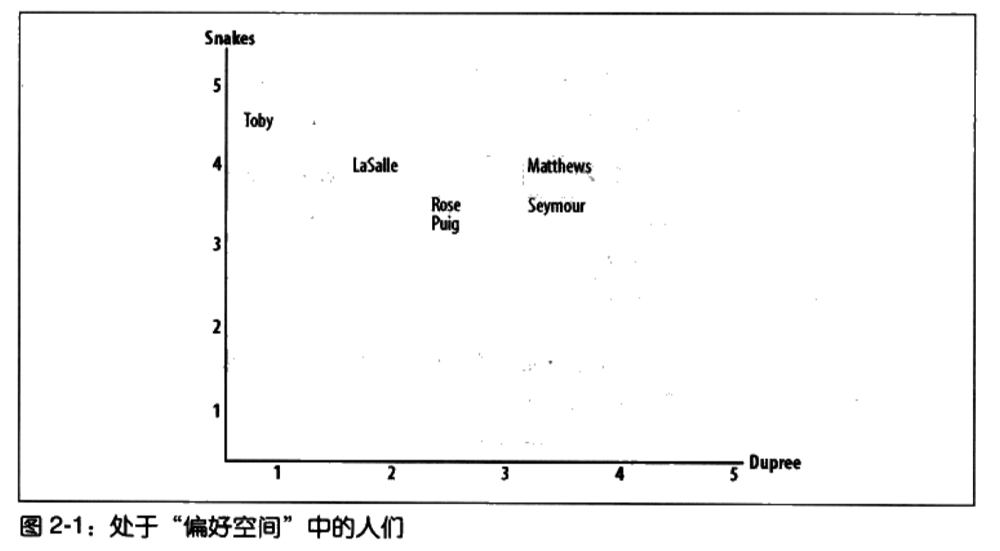
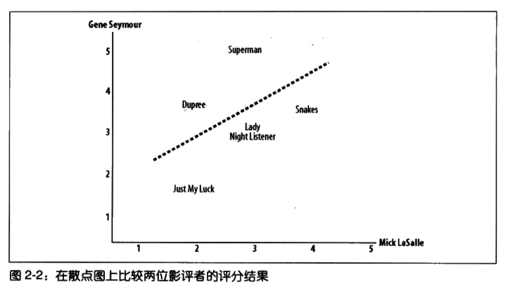
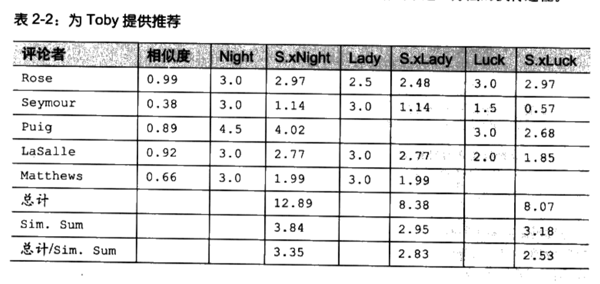
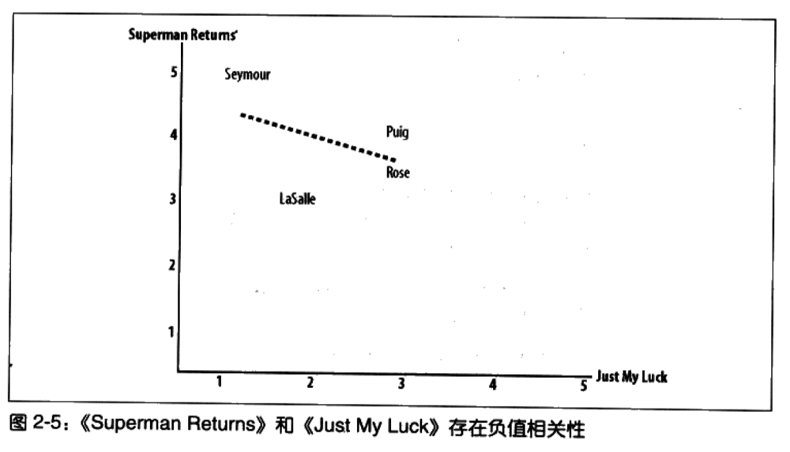

# 02 提供推荐

为了开始集体智慧之旅，本章即将告诉大家，如何根据群体偏好来为人们提供推荐。有许多针对于此的应用，如：在线购物中的商品推荐、热门网站的推荐，以及帮助人们寻找音乐和影片的应用。本章将告诉你如何构筑一个系统，用以寻找具有相同品味的人，并根据他人的喜好自动给出推荐。

也许在使用如 Amazon 这样的在线购物网站之前，你已经接触过某些推荐类引擎了。Amazon 会对所有购物者的购买习惯进行追踪，并在你登录网站时，利用这些信息将你可能会喜欢的商品推荐给你。Amazon 甚至还能够向你椎荐你可能会喜欢的影片，即便你此前也许只从该网站购买过书籍。还有一些在线的音乐会售票代理站点，它们会查看你以前观看演出的历史，并提醒你即将到来的演出，不定这些演出是值得一看的。又比如像 reddit.com 这样的站点，它会让你对其他 web 站点的链接进行投票，然后利用投票结果推荐你也许会感兴趣的其他链接。

从这些例子中，你可以看到我们能使用许多同的方式来搜集兴趣偏好。有时候，这些数据可能来自于人们购的物品，以有关些物品的评价信息，这些评价可能会被表达成「是 / 否」之类的投表决，或者是从 1 到 5 的评价值中，我们将对这些形色各异的表达方法进行考查，以便能够利用一组算法对其进行处理。同时还将建立几个涉及电影评分和社会化书签的可运行的例子。

## 01. 协作型过滤

我们知道，要想了解商品、影片或娱乐性网站的推荐信息，最没有技术含量的方法莫过于向朋友们询问。我们也知道，这其中有一部分人的品味会比其他人的高一些，通过观察这些人是否通常也和我们一样喜欢同样的东西，可以逐渐对这些情况有所了解。不过随着选择越来越多，要想通过询问一小群人来确定我们想要的东西，将会变得越来越不切实际，因为他们可能并不了解所有的选择。这就是为什么人们要发展出一套被称为协作型过滤（collaborative filtering）的技术。

一个协作型过滤算法通常的做法是对一大群人进行搜索，并从中找出与我们品味相近的一小群人。算法会对这些人所偏爱的其他内容进行考查，并将它们组合起来构造出一个经过排名的推荐列表。有许多不同的方法可以帮助我们确定哪些人与自己的品味相近，并将他们的选择组合成列表。本章将择其一二详加介绍。

术语：「协作型过滤」是 David Goldberg 1992 年在施乐帕克研究中心（Xerox PARC）的一篇题为《Using collaborative filtering to weave an information tapestry》的论文中首次使用的。他设计了一个名 Tapestry 的系统，该系统允许人们根据自己对文档感兴趣的程度为其添加标注，并利用这一信息为他人进行文档过滤。

时下，有数以百计的 Web 站点都在采用这样那样的协作型过滤算法，这些算法所要处理的内容涉及电影、音乐、书籍、交友、购物网站、播客服务（podcast）、文章，甚至还有幽默笑话。

## 02. 搜集偏好

我们要做的第一件事情，是寻找一种表达不同人及其偏好的方法。在 Python 中，达到这目的的一种非常简单的方法是使用一个嵌套的字典。如果你打算运行本节中的示例，请新建一个名为 recommendations.py 的文件，并加入如下代码来构造一个数据集。

```
# A dictionary of movie critics and their ratings of a small 
# set of movies 

critics={'Lisa Rose': {'Lady in the Water': 2.5, 'Snakes on a Plane': 3.5, 
'Just My Luck': 3.0, 'Superman Returns': 3.5, 'You, Me and Dupree': 2.5, 
'The Night Listener': 3.0}, 
'Gene Seymour': {'Lady in the Water': 3.0, 'Snakes on a Plane': 3.5, 
'Just My Luck': 1.5, 'Superman Returns': 5.0, 'The Night Listener': 3.0, 
'You, Me and Dupree': 3.5}, 
'Michael Phillips': {'Lady in the Water': 2.5, 'Snakes on a Plane': 3.0, 
'Superman Returns': 3.5, 'The Night Listener': 4.0}, 
'Claudia Puig': {'Snakes on a Plane': 3.5, 'Just My Luck': 3.0, 
'The Night Listener': 4.5, 'Superman Returns': 4.0, 'You, Me and Dupree': 2.5}, 
'Mick LaSalle': {'Lady in the Water': 3.0, 'Snakes on a Plane': 4.0, 
'Just My Luck': 2.0, 'Superman Returns': 3.0, 'The Night Listener': 3.0, 
'You, Me and Dupree': 2.0}, 
'Jack Matthews': {'Lady in the Water': 3.0, 'Snakes on a Plane': 4.0, 
'The Night Listener': 3.0, 'Superman Returns': 5.0, 'You, Me and Dupree': 3.5}, 
'Toby': {'Snakes on a Plane':4.5,'You, Me and Dupree':1.0,'Superman Returns':4.0}
```

本章中，我们将以交互方式使用 Python，因此应该先将 recommendation.py，保存起来，以便 Python 的交互解释程序能够读取到它。我们也可以将文件保存在 python/lib 目录下，不过最为简单的做法，是在与我们保存文件的同一目录下启动 Python 解释程序。

上述字典使用从 1 到 5 的评分，以此来体现包括本人在内的每位影评者对某一给定影片的喜爱程度。不管偏好是如何表达的，我们需要一种方法来将它们对应到数字。假如我们正在架设一个购物网站，不妨用数字 1 来代表有人过去曾购买过某件商品，用数字 0 来代表未曾购买过任何商品。而对于一个新闻故事的投票网站，我们可以分别用数字  -1、0 和 1 来表达「不喜欢」、「没有投票」、「喜欢」，如表 2-1 所示。


对于算法试验和范例演示而言，使用字典是很方便的。我们可以很容易地对字典进行査询和修改。请启动 Python 的解释程序，并试着输入下列几行命令：

尽管可以将相当数量的人员偏好信息置于字典内（即内存中），但对于一个规模巨大的数据集而言，也许我们还是会希望将其存入数据库中。

## 03. 寻找相近的用户

搜集完人们的偏好数据之后，我们须要有一种方法来确定人们在品味方面的相似程度。为此，我们可以将每个人与所有其他人进行对比，并计算他们的相似度评价值。有若干种方法可以达到此目的，本节中我们将介绍两套计算相似度评价值的体系：欧几里徳距离和皮尔逊相关度。

### 1. 欧几里德距离评价

计算相似度评价值的一个非常简单的方法是使用欧几里德距离评价方法。它以经过人们一致评价的物品为坐标轴，然后将参与评价的人绘制到图上，并考査他们彼此间的距离远近，如图 2-1 所示：



该图显示了处于「偏好空间」中人们的分布状况。Toby 在 Snakes 轴线和 Dupree 轴轴线上所标示的数值分别是 4.5 和 1.0。两人在「偏好空间」中的距离越近，他们的兴趣偏好就越相似。因为这张图是二维的，所以在同一时间内你只能看到两项评分，但是这一规则对于更多数量的评分项而言也是同样适用的。

为了计算图上 Toby 和 Lasalle 之间的距离，我们可以计算出毎一轴向上的差值，求平方后再相加，最后对总和取平方根。在 Python 中，我们可以利用函数 pow (n,2) 对某数求平方，并使用 sqrt 函数求平方根。

上述算式可以计算出距离值，偏好越相似的人，其距离就越短。不过，我们还需要一个函数，来对偏好越相近的情况给出越大的值。为此，我们可以将函数值加 1（这样就可以避免遇到被零整除的错误了），并取其倒数。

```
from math import sqrt
sqrt(pow(5-4,2)+pow(4-1,2))
3.1622776601683795

1/(1+sqrt(pow(5-4,2)+pow(4-1,2)))
0.2402530733520421
```

这一新的函数总是返回介于 0 到 1 之间的值，返回 1 则表示两人具有一样的偏好。我们将前述知识结合起来，就可以构造出用来计算相似度的函数了。请将下列代码加入：

```
from math import sqrt

def critics():
    # A dictionary of movie critics and their ratings of a small 
    # set of movies 

    return {'Lisa Rose': {'Lady in the Water': 2.5, 'Snakes on a Plane': 3.5, 
    'Just My Luck': 3.0, 'Superman Returns': 3.5, 'You, Me and Dupree': 2.5, 
    'The Night Listener': 3.0}, 
    'Gene Seymour': {'Lady in the Water': 3.0, 'Snakes on a Plane': 3.5, 
    'Just My Luck': 1.5, 'Superman Returns': 5.0, 'The Night Listener': 3.0, 
    'You, Me and Dupree': 3.5}, 
    'Michael Phillips': {'Lady in the Water': 2.5, 'Snakes on a Plane': 3.0, 
    'Superman Returns': 3.5, 'The Night Listener': 4.0}, 
    'Claudia Puig': {'Snakes on a Plane': 3.5, 'Just My Luck': 3.0, 
    'The Night Listener': 4.5, 'Superman Returns': 4.0, 'You, Me and Dupree': 2.5}, 
    'Mick LaSalle': {'Lady in the Water': 3.0, 'Snakes on a Plane': 4.0, 
    'Just My Luck': 2.0, 'Superman Returns': 3.0, 'The Night Listener': 3.0, 
    'You, Me and Dupree': 2.0}, 
    'Jack Matthews': {'Lady in the Water': 3.0, 'Snakes on a Plane': 4.0, 
    'The Night Listener': 3.0, 'Superman Returns': 5.0, 'You, Me and Dupree': 3.5}, 
    'Toby': {'Snakes on a Plane':4.5,'You, Me and Dupree':1.0,
    'Superman Returns':4.0}}
    
def sim_distance(prefs, person1, person2):
    # Returns a distance-based similarity score for person1 and person2 
    # Get the list of shared_items
    si = {}
    for item in prefs[person1]:
        if item in prefs[person2]:
            si[item] = 1

    # if they have no ratings in common, return 0 
    if len(si)==0: return 0

    # Add up the squares of all the differences 
    sum_of_squares = sum([pow(prefs[person1][item]-prefs[person2][item],2) 
    for item in prefs[person1] if item in prefs[person2]])

    return 1/(1+sum_of_squares
```

我们可以调用该函数，分别传入两个人的名字，并计算出相似度的评价值。在你的 Python 解释器里执行如下命令：

```
In [1]: from recommendations import critics
In [2]: from recommendations import sim_distance
In [3]: critics = critics()
In [6]: sim_distance(critics, 'Michael Phillips', 'Claudia Puig')
Out[6]: 0.5714285714285714
```

上述执行过程给出了 Lisa Rose 和 Gene Seymour 之间的相似度评价。请用其他人的名字试试，看看我们是否能够找到或多或少具有一定共性的人。

### 2. 皮尔逊相关度评价

除了欧几里德距离，还有一种更复杂一些的方法可以用来判断人们兴趣的相似度，那就是皮尔逊相关系数。该相关系数是判断两组数据与某一直线拟合程度的一种度量。对应的公式比欧几里德距离评价的计算公式要复杂，但是它在数据不是很规范（normalized）的时候（比如，影评者对影片的评价总是相对于平均水平偏离很大时），会倾向于给出更好的结果。

为了形象地展现这一方法，我们可以在图上标示出两位评论者的评分情况，如下页图 2-2 所示。Mick Lasalle 为《Superman》评了 3 分，而 Gene Seymour 则评了 5 分，所以该影片被定位在图中的（3,5) 处。



在图上，我们还可以看到一条直线。因其绘制原则是尽可能地靠近图上的所有坐标点，故而被称作最佳拟合线（best-fit line）。如果两位评论者对所有影片的评分情况都相同，那么这条直线将成为对角线，并且会与图上所有的坐标点都相交，从而得到一个结果为 1 的理想相关度评价。对于如上图所示的情况，由于评论者对部分影片的评分不尽相同，因而相关系数大约为 0.4 左右。图 2-3 展现了一个有着更高相关系数的例子，约为 0.75。


在采用皮尔逊方法进行评价时，我们可以从图上发现一个值得注意的地方，那就是它修正了「夸大分值」（grade inflation）的情况。在这张图中，虽然 Jack Matthews 总是倾向于给出比 Lisa Rose 更高的分值，但最终的直线仍然是拟合的，这是因为他们两者有着相对近似的偏好。如果某人总是倾向于给出比另一个人更高的分值，而二者的分值之差又始终保持一致，则他们依然可能会存在很好的相关性。此前提到过的欧几里德距离评价方法，会因为个人的评价始终比另一个人的更为「严格」（从而导致评价始终相对偏低），而得出两者不相近的结论，即使他们的品味很相似也是如此。而这一行为是否就是我们想要的结果，则取决于具体的应用场景。

1『向量的方向和长度。两个向量虽然长度相差很大，但方向差不多，其实相关性还是很高。但是如果能讲所有向量的长度调整为差不多大，那么「欧几里德距离」模型也能反应出真实情况。』

皮尔逊相关度评价算法首先会找出两位评论者都曾评价过的物品，然后计算两者的评分总和与平方和，并求得评分的乘积之和。最后，算法利用这些计算结果计算出皮尔逊相关系数，如下列代码中粗体部分所示。不同于距离度量法，这一公式不是非常的直观，但是通过除以将所有变量的变化值相乘后得到的结果，它的确能够告诉我们变量的总体变化情况。

为了使用这一公式，请新建一个与 recommendations.py 中的 sim_ distance 函数有同样签名的函数：

```
def pear_distance(prefs,p1,p2):
    # Returns the Pearson correlation coefficient for p1 and p2 
    # Get the list of mutually rated items 
    si={} 
    for item in prefs[p1]:
        if item in prefs[p2]: 
            si[item]=1

    # Find the number of elements 
    n=len(si)

    # if they are no ratings in common, return 0 
    if n==0: return 0

    # Add up all the preferences 
    sum1=sum([prefs[p1][it] for it in si]) 
    sum2=sum([prefs[p2][it] for it in si])

    # Sum up the squares 
    sum1Sq=sum([pow(prefs[p1][it],2) for it in si]) 
    sum2Sq=sum([pow(prefs[p2][it],2) for it in si])

    # Sum up the products 
    pSum=sum([prefs[p1][it]*prefs[p2][it] for it in si])

    # Calculate Pearson score 
    num=pSum-(sum1*sum2/n) 
    den=sqrt((sum1Sq-pow(sum1,2)/n)*(sum2Sq-pow(sum2,2)/n)) 
    if den==0: return 0

    r = num/den

    return r
```

该函数将返回一个介于 -1 与 1 之间的数值。值为 1 则表明两个人对每一样物品均有着完全一致的评价。与距离度量法不同，此处我们无须为达到正确的比率而对这一数值进行变换。现在，我们可以试着求一下图 2-3 中的相关评价值了。

### 3. 应该选用哪一种相似性度量方法

我们在此处已经介绍了两种不同的度量方法，但实际上，还有许多方法可以衡量两组数据间的相似程度。使用哪一种方法最优，完全取决于具体的应用。如果你想看看哪种方法能够获得更好的实际效果，皮尔逊、欧几里德距离，或者任何其他方法，都是值得一试的。

本章剩余部分出现的函数均有一个可选的相似性参数，该参数指向一个实际的算法函数。这可以使针对算法的实验变得更为容易：我们可以指定 sim_pearson 或 sim_distance 作为相似性参数的取值。我们还可以使用许多其他的函数，如 Jaccard 系数或曼哈顿距离算法，作为相似度计算函数，只要它们满足如下条件：拥有同样的函数签名，以一个浮点数作为返回值，其数值越大代表相似度越大。

在 http://en.wikipedia.org/wiki/ Metric_%28mathematics%29#Examples 上，我们还可以了解到其他用于比较的度量算法。

### 4. 为评论者打分

既然我们已经有了对两个人进行比较的函数，下面我们就可以编写函数，根据指定人员对每个人进行打分，并找出最接近的匹配结果了。在本例中，我们对找寻与自己有相似品味的影评者很感兴趣，因为这样我们就知道在选择影片时应该采纳谁的建议了。请将该函数加入 recommendations.py 中，以得到一个人员的有序列表，这些人与某个指定人员具有相近的品味：

```
def topMatches(prefs, person, n=5, similarity=pear_distance):
    # Returns the best matches for person from the prefs dictionary. 
    # Number of results and similarity function are optional params. 
    scores = [(similarity(prefs, person, other), other) for other in prefs if  other!=person]

    # Sort the list so the highest scores appear at the top 
    scores.sort()
    scores.reverse()
    return scores[0:n
```

该函数利用了 Python 的列表推导式，采用先前定义过的某种距离度量算法，将自身和字典中的其他每一位用户都进行了比较。然后，函数返回排序结果中的前 n 项。调用该方法并传入自己的姓名，将得到一个有关影评者及其相似度评价值的列表：

```
In [1]: import recommendations as rec
In [3]: rec.topMatches(rec.critics(), 'Toby', 3)
Out[3]:
[(0.9912407071619299, 'Lisa Rose'),
 (0.9244734516419049, 'Mick LaSalle'),
 (0.8934051474415647, 'Claudia Puig')]

In [6]: from recommendations import sim_distance

In [7]: rec.topMatches(rec.critics(), 'Toby', 3, similarity=sim_distance)
Out[7]:
[(0.3076923076923077, 'Mick LaSalle'),
 (0.2857142857142857, 'Michael Phillips'),
 (0.23529411764705882, 'Claudia Puig')]
```

根据返回的结果我们了解到，应当阅读 Lisa Rose 所撰写的评论，因为她的品味与我们的很相近。如果你看过这些电影，也不妨将自己的偏好信息加入字典中，然后看看谁是你最喜欢的评论者。

## 04. 推荐物品

找到一位趣味相投的影评者并阅读他所撰写的评论固然不错，但现在我们真正想要的不是这些，而是一份影片的推荐。当然，我们也可以査找与自己品味最为相近的人，并从他所喜欢的影片中找出一部自己还未看过的影片，不过这样做太随意了（permissive）。有时，这种方法可能会有问题：评论者还未对某些影片做过评论，而这些影片也许就是我们所喜欢的。还有一种可能是，我们会找到一个热衷某部影片的古怪评论者，而根据 topMatches 所返回的结果，所有其他的评论者都不看好这部影片。

为了解决上述问题，我们须要通过一个经过加权的评价值来为影片打分，评论者的评分结果因此而形成了先后的排名。为此，我们须要取得所有其他评论者的评价结果，借此得到相似度后，再乘以他们为毎部影片所给的评价值。表 2-2 给出了这一方法的执行过程。



表中列出了每位评论者的相关度评价值，以及他们对三部影片（《The Night Listener》、《Lady in the Water）》和《Just My Luck》）的评分情况（我们还不曾参与评分）。以 S.x 打头的列给出了乘以评价值之后的相似度。如此一来，相比于与我们不相近的人，那些与我们相近的人将会对整体评价值拥有更多的贡献。总计一行给出了所有加权评价值的总和。

我们也可以选择利用总计值来计算排名，但是我们还须要考虑到，一部受更多人评论的影片会对结果产生更大的影响。为了修正这一向题，我们须要除以表中名为 Sim.Sum 的那一行，它代表了所有对这部电影有过评论的评论者的相似度之和。由于每个人都对影片《The Night Listener》进行了评论，因此我们用总计值除以全部相似度之和。而对于影片《Lady in the Water》而言，Puig 并未做过评论，因此我们将这部影片的总计值除以所有其他人的相似度之和。表中最后一行给出了相除的结果。

下列代码反映了上述过程，非常的简单易懂，并且它对欧几里德距离评价或皮尔逊相关度评价都是适用的。请将其加入 recommendations.py 中：

```
def getRecommendations(prefs, person, similarity=pear_distance):
    # Gets recommendations for a person by using a weighted average 
    # of every other user's rankings 
    totals = {} 
    simSums = {}
    for other in prefs:
        # don't compare me to myself
        if other==person: continue
        sim = similarity(prefs, person, other)

        # ignore scores of zero or lower 
        if sim<=0: continue 
        for item in prefs[other]:
            # only score movies I haven't seen yet 
            if item not in prefs[person] or prefs[person][item]==0:
                # Similarity * Score 
                totals.setdefault(item,0) 
                totals[item] += prefs[other][item]*sim 
                # Sum of similarities 
                simSums.setdefault(item,0) 
                simSums[item] += sim

    # Create the normalized list 
    rankings=[(total/simSums[item],item) for item,total in totals.items( )]

    # Return the sorted list 
    rankings.sort()
    rankings.reverse()
    return ranking
```

上述代码循环遍历所有位于字典 prefs 中的其他人。针对每一次循环，它会计算由 person 参数所指定的人员与这些人的相似度。然后它会循环遍历所有打过分的项。以黑体显示的代码行说明了每一项的最终评价值的计算方法 一一 用毎一项的评价值乘以相似度，并将所得乘积累加起来。最后，我们将每个总计值除以相似度之和，借此对评价值进行归一化处理，然后返回一个经过排序的结果。

这样，我们就可以找到自己接下来应该要看的电影了：

```
In [1]: import recommendations as rec

In [3]: rec.getRecommendations(rec.critics(), 'Toby')
Out[3]:
[(3.3477895267131017, 'The Night Listener'),
 (2.8325499182641614, 'Lady in the Water'),
 (2.530980703765565, 'Just My Luck')]
 
 In [4]: rec.getRecommendations(rec.critics(), 'Toby', rec.sim_distance)
Out[4]:
[(3.5002478401415877, 'The Night Listener'),
 (2.7561242939959363, 'Lady in the Water'),
 (2.461988486074374, 'Just My Luck')]
```

此处，我们不仅得到了一个经过排名的影片列表，而且还推测出了自己对每部影片的评价情况。根据这份结果，我们可以决定自己究竟要不要观看其中的某部影片，还是最好干脆什么也别看。有赖于具体的应用，假如无法满足某一用户给出的标准，我们也可以决定不给予建议。你会发现，选择不同的相似性度量方法，对结果的影响是微乎其微的。

现在，我们已经建立起了一个完整的推荐系统，它适用于任何类型的商品或网络链接。我们所要做的全部事情就是：建立一个涉及人员、物品和评价值的字典，然后就可以借此来为任何人提供建议了。在本章的后续章节中，你将会看到如何利用 del.icio.us API 来获取真实数据，进而向人们推荐 Web 站点。

## 05. 匹配商品

现在，我们已经知道了如何为指定人员寻找品味相近者，以及如何向其推荐商品的方法，但是假如我们想了解哪些商品是彼此相近的，那又该如何做呢？也许我们曾经在购物网站上遇到过这种情形，尤其是当网站还没有收集到关于用户的足够信息时。图 2-4 显示了 Amazon 网站上有关《Programming Python》一书的局部网页。

在这种情况下，我们可以通过査看哪些人喜欢某一特定物品，以及这些人喜欢哪些其他物品来决定相似度。事实上，这和我们此前用来决定人与人之间相似度的方法是一样的 一一 只须要将人员与物品对换即可。因此，假如我们将：

```
{'Lisa Rose': {'Lady in the Water': 2.5, 'Snakes on a Plane': 3.5}, 'Gene Seymour': {'Lady in the Water': 3.0, 'Snakes on a Plane': 3.5}}
```

换成：

```
{'Lady in the Water':{'Lisa Rose':2.5,'Gene Seymour':3.0}, 'Snakes on a Plane':{'Lisa Rose':3.5,'Gene Seymour':3.5}} etc..
```

就可以复用以前所写的方法了。将执行这一转换过程的函数加入 recommendations.py 中：

```
def transformPrefs(prefs):
    result={} 
    for person in prefs:
        for item in prefs[person]:
            result.setdefault(item,{})
            # Flip item and person 
            result[item][person]=prefs[person][item] 
    return result

```

现在，调用以前曾经用过的 topmatches 函数，得到一组与《Superman Returns》最为相近的影片：

```
movies=recommendations.transformPrefs(recommendations.critics)
recommendations.topMatches(movies,'Superman Returns') 
[(0.657, 'You, Me and Dupree'), (0.487, 'Lady in the Water'), (0.111, 'Snakes on a Plane'), (-0.179, 'The Night Listener'), (-0.422, 'Just My Luck')]
```

请注意：在本例中，实际存在着一些相关评价值为负的情况，这表明那些喜欢影片《Superman Returns》的人，存在不喜欢《Just My Luck》的倾向，如图 2-5 所示。

上面我们示范了为某部影片提供相关影片的推荐，不仅如此，我们甚至还可以为影片推荐评论者。例如，也许我们正在考虑邀请谁和自己一起参加某部影片的首映式。

```
recommendations.getRecommendations(movies,'Just My Luck') 
[(4.0, 'Michael Phillips'), (3.0, 'Jack Matthews')]
```

将人和物对调并不总是会得到有价值的结果，但是大多数情况下，这将有助于我们作出有意义的对比。为了向不同的个体推荐商品，在线零售商可能会收集人们的购买历史。将商品与人进行对调 一一 正如我们此前所做的那样 一一 可以令零售商找到购买某些商品的潜在客户。这对于他们为了清仓处理某些商品而在市场营销投入方面制定的规划，也许是很有助益的。这种做法的另一个潜在用途是，在专门推荐链接的网站上，这样做可以确保新出现的链接，能够被那些最有可能对它产生兴趣的网站用户找到。



## 06. 构建一个基于 del.icio.us 的链接推荐系统

本节将向大家介绍，如何从最受欢迎的在线书签网站上获取数据，如何利用这些数据査找相近用户，并向他们推荐以前未曾看过的链接。该网站一可以通过 ht 均 ry/delicto. Us 访问到一允许人们建立自己的账号，并允许张贴自己感兴趣的链接，以备日后参考之用。我门可以访问网站并查看其他人张贴的链接，也可以浏览许多不同用户所张贴的热门链接。图 2-6 展示了一个取自 del icio. Us 网站的网页样例。


和某些链接共享类的网站（ink- sharing sites）不同，在本书撰写期间，del icio. Us 还没有提供寻找相近用户的方法，也不向用户提供链接推荐。所幸的是，我们可以利用本章所讨论的技术来为自己添加这部分功能。

### 1. The del icio, us Apl

通过 API 访问 del. Icio. Us 网站所获得的数据是以 XML 格式返回的。为了方便起见，有一套事先编写好的 Python APT，我们可以从 haty/tode. google. com/p/delicious/source 或 hp ∥ reilly. com/catalog9780596529321 处下载到。

为了使本节中的示例能够正常运行，我们须要下载函数库的最新版本，并将其置于 Python 函数库所在路径下（有关安装该库的更多信息，请见附录 A）。

该函数库提供了一系列简单的函数调用，可以用来获得用户提交的链接信息。例如，为了得到一组近期张贴的有关编程方面的热门链接，我们可以使用 get_ popular 函数

> import pydelicious

> pydeliciousget_popular (tag="programming ')

 (count: I', "extended': 'I, ' hash!: 1!, 'description: UHOW To Write Unmaintainable Code", tags thref':u'http://thc.segfault.net/root/phun/ unmaintain html I, luser": u'dorsial, 'dt: L2006-08-19 T09: 48: 56 Z,  (count: "extended: 11, Thash: '1, 'description: u" Threading in C, tags": '', href: u'http://www.albahari.com/threading/','user':u'mmihale,'dt:12006-05-17 T18:09: 242},

etc，。

我们可以看到，上述调用返回了一个包含字典的列表，其中的每一项都包含了：URL、描述，以及提交者。因为我们使用的是真实数据，所以实际结果可能会与上例有所不同。还有另外两个函数调用我们也可能会用到：get_ urlposts，返回给定 URL 的所有张贴记录；get userposts，返回给定用户的所有张贴记录。这些函数调用所返回的数据同样都是 XML 格式的。

### 2. 构造数据集

Building the Dataset

要想从 del. Icio. Us 网站将所有用户张贴的信息都下载下来是不可能的，因此我们须要从中选择一个子集。根据自己的喜好，我们可以选择任何形式的子集，不过为了让例子给出的结果显得更有意义，我们不妨找一找那些经常张贴链接的用户和张贴内容类似的用户。

为了达到这一目的，有一种做法是找到一组近期提交过的某一热门链接，且链接附带指定标签（tag）的用户。请新建一个名为 deliciousrec, y 的文件，输入如下代码：

执行上述代码将得到一个包含若千用户数据的字典，其中每一项都各自指向一个等待填入具体链接的空字典。由于 API 只会返回最后 30 个张贴链接的用户，因此上述函数只搜集了与前 5 个链接相对应的用户数据，并进而构造出一个数据集。

不同于保存影评者的数据集，在本例中只有两种可能的评价值：0（如果用户没有张贴这链接）和 1（如果用户张贴了这一链接）。现在，我们可以利用 API 来建立一个填充所有用户评价值的函数了。请将如下代码加入到 deliciousrec py 中：


我们可以利用上述函数来构造一个数据集，类似于本章开始处手工构造的反映影评者信息

的字典


上面第三行代码将用户 tsegaran 添加到了列表中。假如你也使用 del icio. Us，则不妨以自

己的名字来替换 tsegaran。

对 f11 tems 的调用可能会花费儿分钟的时间来执行，因为它会向网站发起数百个请求。

有时会因为请求反复发起太快而致使 API 阻塞请求响应。在这种情况下，代码会暂停执行

并至多重试三次。

### 3. 推荐近邻与链接

既然我们已经构造好了数据集，那就可以利用此前在影评数据集中曾经用过的同一组函数

进行推荐了。为了随机选择一位用户，并找出与其品味相近的其他用户，请将如下代码输入你的 Python 会话中：


我们也可以通过调用 get Recommendations 函数为该用户获取推荐链接。因为方法调用将会依序返回全部物品，所以最好将其限制在前 10 条


当然，与之前所演示的一样，偏好列表中的各项是可以被调换的，这样我们就可以依据链接而非人员来进行搜素了。为了寻找与我们所关注的某一链接相类似的一组链接，我们可以尝试输入下列命令


就这样！我们成功地为 delicio. Us 网站增加了一个推荐引擎。我们还可以做更多的事情。因为 del. Ici. Us 网站支持根据标签进行搜索，所以我们还可以找出那些彼此相似的标签。甚至，我们还可以搜索出那些使用不同账号张贴同一链接的、企图以此来炒作网页的人。

## 07. 基于物品的过滤

迄今为止已经完成的推荐引擎，要求我们使用来自每一位用户的全部评分来构造数据集。这种方法对于数量以千计的用户或物品规模而言或许是没问题的，但对于像。Amazon 这样有着上百万客户和商品的大型网站而言，将一个用户和所有其他用户进行比较，然后再对每位用户评过分的商品进行比较，其速度可能是无法忍受的。同样，一个商品销售量为数百万的网站，也许用户在偏好方面彼此间很少会有重叠，这可能会令用户的相似性判断变得十分困难。

目前为止我们所采用的技术被称为基于用户的协作型过滤（user- based collaborative filtering）。除此以外，还有另一种可供选择的方法被称为基于物品的协作型过滤（item- based collaborative filtering）。在拥有大量数据集的情况下，基于物品的协作型过滤能够得出更好的结论，而且它允许我们将大量计算任务预先执行，从而使须要给予推荐的用户能够更快

地得到他们所要的结果。

基于物品的过滤过程沿用了我们之前已经讨论过的许多内容。其总体思路就是为每件物品预先计算好最为相近的其他物品。然后，当我们想为某位用户提供推荐时，就可以查看他曾经评过分的物品，并从中选出排位靠前者，再构造出一个加权列表，其中包含了与这些选中物品最为相近的其他物品。此处最为显著的区别在于，尽管第一步要求我们检查所有的数据，但是物品间的比较不会像用户间的比较那么频繁变化。这意味着，无须不停地计算与每样物品最为相近的其他物品，我们可以将这样的运算任务安排在网络流量不是很大的时候进行，或者在独立于主应用之外的另一台计算机上单独进行。

### 1. 构造物品比较数据集

uilcling the Item Comparison Dataset

为了对物品进行比较，我们要做的第一件事情就是编写一个函数，构造一个包含相近物品的完整数据集。再重申一次，这项工作无须在每次提供推荐时都做一遍一一相反，构建完次数据集之后，我们就可以在需要的时侯重复使用它。

为了生成数据集，请将下列函数加入 recommendations. Py 中：

该函数首先利用了此前定义过的 transformprefs 函数，对反映评价值的字典进行倒置处理，从而得到一个有关物品及其用户评价情况的列表。然后，程序又循环遍历毎项物品，并将转换了的字典传入 topmatches 函数中，求得最为相近的物品及其相似度评价值。最后它建立并返回了一个包含物品及其最相近物品列表的字典。

请在你的 Python 会话中构造一个物品相似度的数据集，然后看一看运行的结果

>> reload (recommendations)

>> itemsimmrecommendations calculatesimlaritems (recommendations. Critics)

>>> ュ temin

Lady in the Water!:  [(0.40000000000000002, You, Me and Dupree

 (0.2857142857142857, " The Night Listener");, Snakes on a Plane:  [(0.22222222222222221, Lady in the Water

181818182, The Night Listener)

etc。

请记住，只有频繁执行该函数，才能令物品的相似度不至过期。通常我们须要在用户基数

和评分数量还不是很大的时候执行这一函数，但是随着用户数量的不断增长，物品间的相似度评价值通常会变得越来越稳定。

### 2. 获得推荐

Getting Recommendations

现在，我们已经可以在不遍历整个数据集的情况下，利用反映物品相似度的字典来给出推荐了。我们可以取到用户评价过的所有物品，找出其相近物品，并根据相似度对其进行加权。我们可以很容易地根据物品字典来得到相似度

表 2-3 给出了利用基于物品的方法寻找推荐的过程。不同于表 2-2, 此处并没有涉及所有评论者，而是给出了一个表格，对我们打过分和未打过分的影片进行了对照。


此处的每一行都列出了一部我们曾经观看过的影片，以及对该片的个人评价。对于每一部我们还未曾看过的影片，相应有一列会指出它与已观看影片的相近程度一一例如：影片《Superman》和《The Night Listener》之间的相似度评价值为 0.103。以 R. X 打头的列给出了我们对影片的评价值乘以相似度之后的结果一一由于我们对《Superman》的评分是 4.0, 所以「Night in the Superman」的后一列对应取值为：4.0*0.103=0.412

总计一行给出了毎部影片相似度评价值的总计值及其 Rx 列的总计值。为了预测我们对每部影片的评分情况，只要将 Rx 列的总计值除以相似度一列的总计值即可。我们对影片《The Night Listener》的评分情况为：1.378/0.433=3.183。

请将下列函数加入 recommendations. Py I 中，我们就可以利用上述功能了

def getrecommendeditems (prefs, itemmatch, user

userratings=prefs  [user]

scores=i b

totalsim= (

环遍历由当前用户评分的物品


排如果该用户已经对当前物品做过评价，则将其忽略


全部相似度之和


将每个合计值除以加权和，求出平均值


我们可以试着运行一下该函数，并传入以前构造好的相似度数据集，为 Toby 提供一个新的

推荐结果：


《The Night Listener》依然以较大的评价值排在最前面，而《Just My Luck》和《Lady in the Water》尽管依然靠得很近，但它们的排列位置有了变化。更为重要的是，在调用 getrecommendedi tems 时，我们不必再为所有其他评论者计算相似度评价值，因为物品相

似度数据集已经事先构造好了。

## 08. 使用 Movie Lens 数据集

Using the Movielens Dataset

作为本章的最后一个示例，让我们来看一个涉及电影评价的真实数据集，叫做 Movielens。Movielens 是由明尼苏达州立大学的 Grouplens 项目组开发的。我们可以从 hty/ooo grouplens. org/node12 处下载到数据集 (译注 1)。有两个数据集可供下载。请选择下载十万数据集。根据所使用的平台，我们可以选择以 amgz 格式或 zp 格式进行下载

译注 1: 此处提供的下载链接有误，实际为 ht ャ laura grouplens. org/node/73。

归档文件中包含了不少文件，不过我们关心的是。Iem 和。Dana，前者包含了一组有关影片 ID 和片名的列表，后者则包含了以如下形式给出的实际评价情况：

96 242 881250949

86 302

22 3312 891717742

878887116

244 51 880606923

166 46 886397596

298 474 884182806

此处的每一行数据都包含了一个用户 ID、影片 D、用户对该片所给的评分，以及评价的时

间。我们可以通过影片的 ID 获取到片名，但对于用户数据而言，由于是匿名的，因此在本节中我们只能对用户 ID 进行处理。该数据集中包含了 943 名用户对 1682 部影片所作的评价，毎位用户至少曾为 20 部影片做过评价。

请在 recommendations. Py 文件中新建一个方法，取名 1 oadmovielens，用以加载上述数据：

请在你的 Python 会话中将数据加载进来，并随机査看任意一位用户的评分情况

>> reload (recommendations)

>> prefs=recommendations. Loadmovielens  (

>> prefs [87

 (Birdcage, The (1996): 4.0, 'E. T. The Extra-terrestrial  (1982) ': 3.0, Bananas (1971) ":5.0, " Sting, The (1973) ':5.0, ' Bad Boys (1995) ":4.0, In the Line of Fire  (1993): 5.0, 'Star Trek: The Wrath of Khan  (1982): 5.0, Speechless (1994): 4.0, etc

## 09. 我们可以获取基于用户的推荐

>> recommendations getrecommendations (prefs, '87) [: 301

 [(5.0, They Made Me a Criminal  (1939)), (5.0, ' Star Kid  (1997) ')  (5.0, 'Santa with Muscles (1996) '), (5.0, ' Saint of Fort Washington  (1993) ') etc。

当利用上述方式获取推荐时，我们可能会注意到有停顿的现象，停顿时间的长短取决于我门】所用机器的速度。那是因为此刻我们正在处理一个较之先前更大规模的数据集。拥有的用户越多，获取基于用户的推荐所花费的时间就越长。现在，请改换为基于物品的推荐试：

尽管构造物品的相似度字典花费了较长的时间，但是推荐过程几乎是在数据构造完毕后瞬间完成的。而且，获取推荐所花费的时间不会随着用户数量的增加而增加。

这是一个很好的测试用数据集，利用它我们可以了解不同评价方法对结果的影响程度，以及基于物品和基于用户的过滤方法是如何以不同方式执行的。Grouplens 网站还有另外一些数据集可供使用，内容涉及图书、笑话，以及更多的影片。

基于用户进行过滤还是基于物品进行过滤

Usei-based or ltem-based Filtering

在针对大数据集生成推荐列表时，基于物品进行过滤的方式明显要比基于用户的过滤更快，不过它的确有维护物品相似度表的额外开销。同时，这种方法根据数据集「稀疏」程度上的不同也存在精准度上的差异。在涉及电影的例子中，由于每个评论者几乎对每部影片都做过评价，所以数据集是密集的（而非稀疏的）。另一方面，它又不同于査找两位有相近 delicio. Us 书签的用户 - 一大多数书签都是为小众群体所收藏的，这就形成了一个稀疏数据集。对于稀疏数据集，基于物品的过滤方法通常要优于基于用户的过滤方法，而对于密集数据集而言，两者的效果则几乎是一样的。

提示：要了解更多有关这些算法在执行效率上的差异情况，请从 http:/citeseerist.ps.edu/sarwvarolitembased.html 处下载由 Sarwar 等人所撰写的一篇论文，名为《基于物品的协作型过滤推荐算法 Item-based Collaborative Filtering Recommendation Algorithms))

尽管如此，基于用户的过滤方法更加易于实现，而且无需额外步骤，因此它通常更适用于规模较小的变化非常频繁的内存数据集。最后，在一些应用中，告诉用户还有哪些人与自己有着相近偏好是有一定价值的一他许对于一个购物网站而言，我们并不想这么做，但是对于一个链接共享类或音乐推荐类的网站，这种潜在需求却是存在的。

现在，我们已经学会了怎样计算相似度评价值，以及怎样利用它们对用户和物品进行比较。

本章介绍了两种不同的推荐算法，基于用户的推荐算法和基于物品的推荐算法，还介绍了记录用户偏好信息的方法，以及使用 del. Icio. Us API 构建链接推荐系统的方法。在第 3 章中，我们将会看到如何以本章中的某些观点为基础，运用无监督聚类算法（unsupervised clustering algorithms）来査找相近的用户组。第 9 章中，我们将会考査其他可行的方法，以实现在得知人们偏好类型的前提下对用户进行匹配。

## 练习

1. Tanimoto 分值求出 Tanimoto 相似度评价值。在何种情况下，我们可以将该方法作为相似性的度量方法，用以替代欧几里德距离法或皮尔逊系数法？请利用 Tanimoto 分值建立一个新的相似度函数。

2. 标签相似度请使用 del icio. Us API 构造一个涉及标签和链接的数据集。利用它来计算不同标签间的相似度，看一看是否能找到相似度几乎一样的情况。请找出某些本该被标记为「programming」，但却没被标记的链接。

3. 基于用户算法的执行效率由于基于用户的过滤算法，在每次须要推荐时，都会将某位用户与其他所有用户进行比较，故而效率低下。请编写一个预先计算用户相似度的函数，并修改涉及推荐的相关代码，只取出当前用户外的其他前 S 名用户来给出推荐。

4. 基于物品的书签过滤请从 del icio. Us 网站下载一组数据，并将其加入数据集中。建立张「物一物」表，并利用它为不同用户提供基于物品的推荐。将之与基于用户的推荐做一个对比。

5. Audioscrobbler 请访问 http: /arow. Audioscrobbler. Net，该网站拥有一个由大群用户的音乐偏好所构成的数据集。利用网站提供的 Web Services API i 获取一组数据，并以此来构造一个音乐推荐系统。
