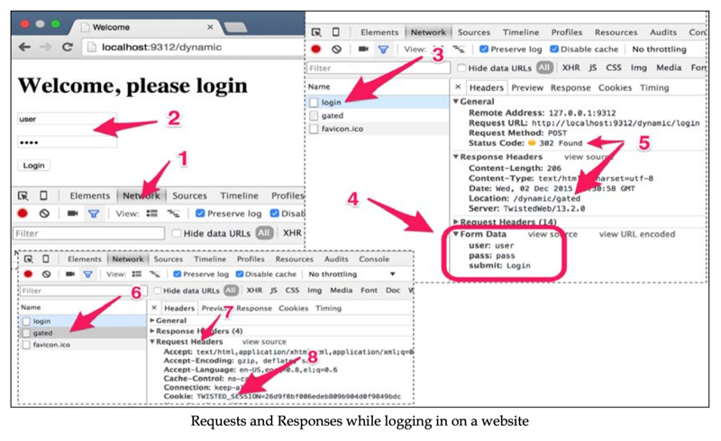
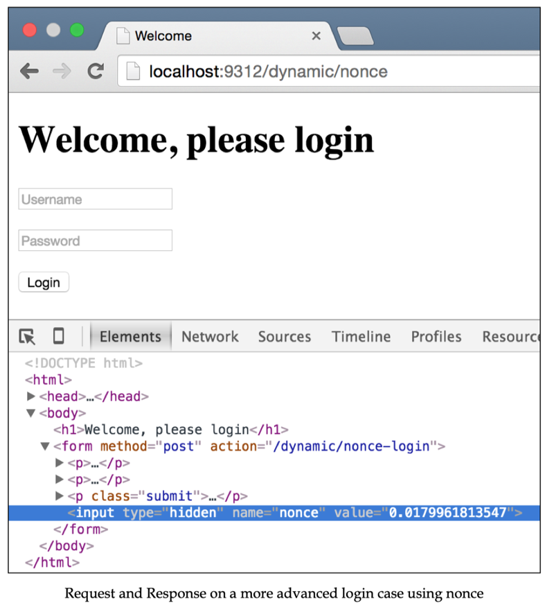
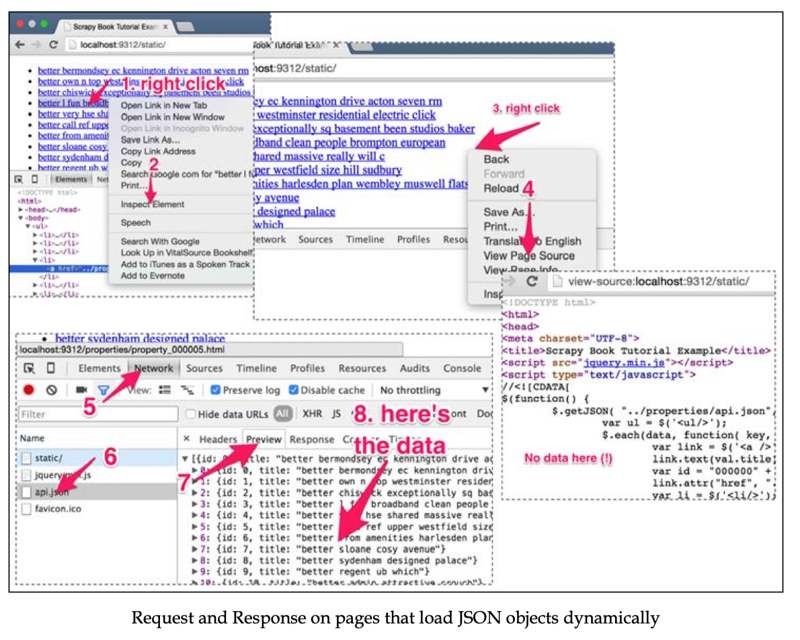
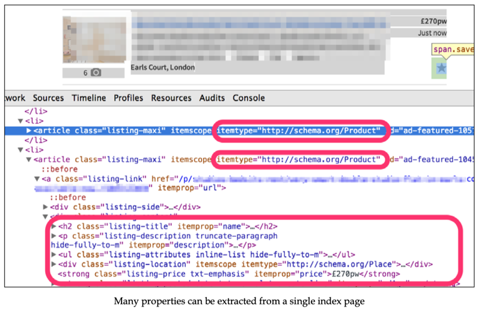

# 05 快速构建爬虫

第 3 章中，我们学习了如何从网页提取信息并存储到 Items 中。大多数情况都可以用这一章的知识处理。本章，我们要进一步学习抓取流程 UR2IM 中两个 R，Request 和 Response。

## 01. 一个具有登录功能的爬虫

你常常需要从具有登录机制的网站抓取数据。多数时候，网站要你提供用户名和密码才能登录。我们的例子，你可以在 http://web:9312/dynamic 或 http://localhost:9312/dynamic 找到。用用户名「user」、密码「pass」登录之后，你会进入一个有三条房产链接的网页。现在的问题是，如何用 Scrapy 登录？



让我们使用谷歌 Chrome 浏览器的开发者工具搞清楚登录的机制。首先，选择 Network 标签（1）。然后，填入用户名和密码，点击 Login（2）。如果用户名和密码是正确的，你会进入下一页。如果是错误的，会看到一个错误页。

一旦你点击了 Login，在开发者工具的 Network 标签栏中，你就会看到一个发往 http://localhost:9312/dynamic/login 的请求 Request Method: POST。

提示：上一章的 GET 请求，通常用来获取静止数据，例如简单的网页和图片。POST 请求通常用来获取的数据，取决于我们发给服务器的数据，例如这个例子中的用户名和密码。

点击这个 POST 请求，你就可以看到发给服务器的数据，其中包括表单信息，表单信息中有你刚才输入的用户名和密码。所有数据都以文本的形式发给服务器。Chrome 开发者工具将它们整理好并展示出来。服务器的响应是 302 FOUND（5），然后将我们重定向到新页面：/dynamic/gated。只有登录成功时才会出现此页面。如果没有正确输入用户名和密码就前往 http://localhost:9312/dynamic/gated，服务器会发现你作弊，并将你重定向到错误页面：http://localhost:9312/dynamic/error。服务器怎么知道你和密码呢？如果你点击左侧的 gated（6），你会发现在 RequestHeaders（7）下有一个 Cookie（8）。

提示：HTTP cookie 是通常是一些服务器发送到浏览器的短文本或数字片段。反过来，在每一个后续请求中，浏览器把它发送回服务器，以确定你、用户和期限。这让你可以执行复杂的需要服务器端状态信息的操作，如你购物车中的商品或你的用户名和密码。

总结一下，单单一个操作，如登录，可能涉及多个服务器往返操作，包括 POST 请求和 HTTP 重定向。Scrapy 处理大多数这些操作是自动的，我们需要编写的代码很简单。

我们将第 3 章名为 easy 的爬虫重命名为 login，并修改里面名字的属性，如下：

```
class LoginSpider(CrawlSpider):
    name = 'login'
```

提示：本章的代码 github 的 ch05 目录中。这个例子位于 ch05/properties。

我们要在 http://localhost:9312/dynamic/login 上面模拟一个 POST 请求登录。我们用 Scrapy 中的类 FormRequest 来做。这个类和第 3 章中的 Request 很像，但有一个额外的 formdata，用来传递参数。要使用这个类，首先必须要引入：

from scrapy.http import FormRequest

我们然后将 start_URL 替换为 start_requests () 方法。这么做是因为在本例中，比起 URL，我们要做一些自定义的工作。更具体地，用下面的函数，我们创建并返回一个 FormRequest：

就是这样。CrawlSpider 的默认 parse () 方法，即 LoginSpider 的基本类，负责处理响应，并如第 3 章中使用 Rules 和 LinkExtractors。其余的代码很少，因为 Scrapy 负责了 cookies，当我们登录时，Scrapy 将 cookies 传递给后续请求，与浏览器的方式相同。还是用 scrapy crawl 运行：

我们注意到登录跳转从 dynamic/login 到 dynamic/gated，然后就可以像之前一样抓取项目。在统计中，我们看到一个 POST 请求和四个 GET 请求；一个是 dynamic/gated 首页，三个是房产网页。

提示：在本例中，我们不保护房产页，而是是这些网页的链接。代码在相反的情况下也是相同的。

如果我们使用了错误的用户名和密码，我们将重定向到一个没有 URL 的页面，进程并将在这里结束，如下所示：

这是一个简单的登录示例，演示了基本的登录机制。大多数网站可能有更复杂的机制，但 Scrapy 也处理的很好。例如一些网站在执行 POST 请求时，需要通过从表单页面到登录页面传递某种形式的变量以确定 cookies 的启用，让你使用大量用户名和密码暴力破解时变得困难。



例如，如果你访问 http://localhost:9312/dynamic/nonce，你会看到一个和之前一样的网页，但如果你使用 Chrome 开发者工具，你会发现这个页面的表单有一个叫做 nonce 的隐藏字段。当你提交表单 http://localhost:9312/dynamic/nonce-login 时，你必须既要提供正确的用户名密码，还要提交正确的浏览器发给你的 nonce 值。因为这个值是随机且只能使用一次，你很难猜到。这意味着，如果要成功登陆，必须要进行两次请求。你必须访问表单、登录页，然后传递数值。和以前一样，Scrapy 有内建的功能可以解决这个问题。

我们创建一个和之前相似的 NonceLoginSpider 爬虫。现在，在 start_requests () 中，我们要向表单页返回一个简单的 Request，并通过设定 callback 为名字是 parse_welcome () 的方法手动处理响应。在 parse_welcome () 中，我们使用 FormRequest 对象中的 from_response () 方法创建 FormRequest，并将原始表单中的字段和值导入 FormRequest。FormRequest.from_response () 可以模拟提交表单。

提示：花时间看 from_response () 的文档是十分值得的。他有许多有用的功能如 formname 和 formnumber，它可以帮助你当页面有多个表单时，选择特定的表单。

它最大的功能是，一字不差地包含了表单中所有的隐藏字段。我们只需使用 formdata 参数，填入 user 和 pass 字段，并返回 FormRequest。代码如下：

像之前一样运行爬虫：

我们看到第一个 GET 请求先到 /dynamic/nonce，然后 POST，重定向到 /dynamic/nonce-login 之后，之后像之前一样，访问了 /dynamic/gated。登录过程结束。这个例子的登录含有两步。只要有足够的耐心，无论多少步的登录过程，都可以完成。

## 02. 使用 JSON APIs 和 AJAX 页面的爬虫

有时，你会发现网页的 HTML 找不到数据。例如，在 http://localhost:9312/static/ 页面上右键点击检查元素（1,2），你就可以在 DOM 树种看到所有 HTML 元素。或者，如果你使用 scrapy shell 或在 Chrome 中右键点击查看网页源代码（3,4），你会看到这个网页的 HTML 代码不包含任何和值有关的信息。数据都是从何而来呢？



和以前一样，在开发者工具中打开 Network 标签（5）查看发生了什么。左侧列表中，可以看到所有的请求。在这个简单的页面中，只有三个请求：static / 我们已经检查过了，jquery.min.js 是一个流行的 JavaScript 框架，api.json 看起来不同。如果我们点击它（6），然后在右侧点击 Preview 标签（7），我们可以看到它包含我们要找的信息。事实上，http://localhost:9312/properties/api.json 包含 IDs 和名字（8），如下所示：

这是一个很简单的 JSON API 例子。更复杂的 APIs 可能要求你登录，使用 POST 请求，或返回某种数据结结构。任何时候，JSON 都是最容易解析的格式，因为不需要 XPath 表达式就可以提取信息。

Python 提供了一个强大的 JSON 解析库。当我们 import json 时，我们可以使用 json.loads（response.body）解析 JSON，并转换成等价的 Python 对象，语句、列表和字典。

复制第 3 章中的 manual.py 文件。这是最好的方法，因为我们要根据 JSON 对象中的 IDs 手动创建 URL 和 Request。将这个文件重命名为 api.py，重命名类为 ApiSpider、名字是 api。新的 start_URL 变成：

如果你要做 POST 请求或更复杂的操作，你可以使用 start_requests () 方法和前面几章介绍的方法。这里，Scrapy 会打开这个 URL 并使用 Response 作为参数调用 parse () 方法。我们可以 import json，使用下面的代码解析 JSON：

这段代码使用了 json.loads（response.body）将响应 JSON 对象转换为 Python 列表，然后重复这个过程。对于列表中的每个项，我们设置一个 URL，它包含：base_url，property_%06d 和.html.base_url，.html.base_url 前面定义过的 URL 前缀。%06d 是一个非常有用的 Python 词，可以让我们结合多个 Python 变量形成一个新的字符串。在本例中，用 id 变量替换 %06d。id 被当做数字（% d 的意思就是当做数字进行处理），并扩展成 6 个字符，位数不够时前面添加 0。如果 id 的值是 5，%06d 会被替换为 000005；id 是 34322 时，%06d 会被替换为 034322 替换。最后的结果是可用的 URL。和第 3 章中的 yield 一样，我们用 URL 做一个新的 Request 请求。运行爬虫：

最后一共有 31 次请求，每个项目一次，api.json 一次。

## 03. 在响应间传递参数

许多时候，你想把 JSON APIs 中的信息存储到 Item 中。为了演示，在我们的例子中，对于一个项，JSON API 在返回它的名字时，在前面加上「better」。例如，如果一个项的名字时「Covent Garden」，API 会返回「Better Covent Garden」。我们要在 Items 中保存这些含有「bette」的名字。如何将数据从 parse () 传递到 parse_item () 中呢？

我们要做的就是在 parse () 方法产生的 Request 中进行设置。然后，我们可以从 parse_item () 的的 Response 中取回。Request 有一个名为 meta 的字典，在 Response 中可以直接访问。对于我们的例子，给字典设一个 title 值以存储从 JSON 对象的返回值：

你会注意到，我们从调用 add_xpath () 切换到 add_value ()，因为对于这个字段不需要使用 XPath。我们现在运行爬虫，就可以在 PropertyItems 中看到 api.json 中的标题了。

## 04. 一个加速 30 倍的项目爬虫

当你学习使用一个框架时，这个框架越复杂，你用它做任何事都会很复杂。可能你觉得 Scrapy 也是这样。当你就要为 XPath 和其他方法变得抓狂时，不妨停下来思考一下：我现在抓取网页的方法是最简单的吗？

如果你可以从索引页中提取相同的信息，就可以避免抓取每一个列表页，这样就可以节省大量的工作。

提示：许多网站的索引页提供的项目数量是不同的。例如，一个网站可以通过调整一个参数，例如 & show=50，给每个索引页面设置 10、 50 或 100 个列表项。如果是这样的话，将其设置为可用的最大值。

例如，对于我们的例子，我们需要的所有信息都存在于索引页中，包括标题、描述、价格和图片。这意味着我们抓取单个索引页，提取 30 个条目和下一个索引页的链接。通过抓取 100 个索引页，我们得到 3000 个项，但只有 100 个请求而不是 3000 个。

在真实的 Gumtree 网站上，索引页的描述比列表页的完整描述要短。这是可行的，或者是更推荐的。

提示：许多情况下，您不得不在数据质量与请求数量间进行折衷。很多网站都限制请求数量（后面章节详解），所以减少请求可能解决另一个棘手的问题。

在我们的例子中，如果我们查看一个索引页的 HTML，我们会发现，每个列表页有自己的节点，itemtype="http://schema.org/Product"。节点有每个项的全部信息，如下所示：



让我们在 Scrapy shell 中加载索引首页，并用 XPath 处理：

我们得到了一个包含 30 个 Selector 对象的表，每个都指向一个列表。Selector 对象和 Response 对象很像，我们可以用 XPath 表达式从它们指向的对象中提取信息。不同的是，表达式为有相关性的 XPath 表达式。相关性 XPath 表达式与我们之前见过的很像，不同之处是它们前面有一个点「.」。然我们看看如何用.//*[@itemprop="name"][1]/text () 提取标题的：

我们可以在 Selector 对象表中用 for 循环提取一个索引页的所有 30 个项目信息。还是从第 3 章中的 maunal.py 文件开始，重命名为 fast.py。重复使用大部分代码，修改 parse () 和 parse_item () 方法。更新的方法如下所示：

第一部分中用于产生下一条索引请求的代码没有变动。不同的地方是第二部分，我们重复使用选择器调用 parse_item () 方法，而不是用 yield 创建请求。这和原先使用的源代码很像：

def parse_item(self, selector, response):

我们做出的变动是：

ItemLoader 现在使用 selector 作为源，不使用 Response。这么做可以让 ItemLoader 更便捷，可以让我们从特定的区域而不是整个页面抓取信息。

通过在前面添加「.」使 XPath 表达式变为相关 XPath。

提示：碰巧的是，在我们的例子中，XPath 表达式在索引页和介绍页中是相同的。不同的时候，你需要按照索引页修改 XPath 表达式。

在 response.url 给我们列表页的 URL 之前，我们必须自己编辑 Item 的 URL。然后，它才能返回我们抓取网页的 URL。我们必须用.//*[@itemprop="url"][1]/@href 提取 URL，然后将它用 MapCompose 转化为 URL 绝对路径。

这些小小大量的工作的改动可以节省大量的工作。现在，用以下命令运行爬虫：

正如所料，parse () 返回了 30 个 Items 和下一个索引页的请求。你还可以继续试验 scrapy parse，例如，设置 —depth=2。

## 05. 可以抓取 Excel 文件的爬虫

大多数时候，你每抓取一个网站就使用一个爬虫，但如果要从多个网站抓取时，不同之处就是使用不同的 XPath 表达式。为每一个网站配置一个爬虫工作太大。能不能只使用一个爬虫呢？答案是可以。

新建一个项目抓取不同的东西。当前我们是在 ch05 的 properties 目录，向上一级：

新建一个项目，命名为 generic，再创建一个名为 fromcsv 的爬虫：

新建一个.csv 文件，它是我们抓取的目标。我们可以用 Excel 表建这个文件。如下表所示，填入 URL 和 XPath 表达式，在爬虫的目录中（有 scrapy.cfg 的文件夹）保存为 todo.csv。保存格式是 csv：


一切正常的话，就可以在终端看见这个文件：

Python 中有 csv 文件的内建库。只需 import csv，就可以用后面的代码一行一行以 dict 的形式读取这个 csv 文件。在当前目录打开 Python 命令行，然后输入：

文件的第一行会被自动作为 header，从而导出 dict 的键名。对于下面的每一行，我们得到一个包含数据的 dict。用 for 循环执行每一行。前面代码的结果如下：

{'url': ' http://a.html', 'price': '//*[@id="prcIsum"]/text()', 'name': '//*[@id="itemTitle"]/text()'}

{'url': ' http://b.html', 'price': '//span/strong/text()', 'name': '//h1/text()'}

{'url': ' http://c.html', 'price': '', 'name': '//*[@id="product-desc"]/span/text()'}

很好。现在编辑 generic/spiders/fromcsv.py 爬虫。我们使用.csv 文件中的 URL，并且不希望遇到域名限制的情况。因此第一件事是移除 start_URL 和 allowed_domains。然后再读.csv 文件。

因为从文件中读取的 URL 是我们事先不了解的，所以使用一个 start_requests () 方法。对于每一行，我们都会创建 Request。我们还要从 request,meta 的 csv 存储字段名和 XPath，以便在我们的 parse () 函数中使用。然后，我们使用 Item 和 ItemLoader 填充 Item 的字段。下面是所有代码：

运行爬虫，输出文件保存为 csv：

有几点要注意。项目中没有定义一个整个项目的 Items，我们必须手动向 ItemLoader 提供一个：

最后让代码再漂亮些。硬编码 todo.csv 不是很好。Scrapy 提供了一种便捷的向爬虫传递参数的方法。如果我们使用 - a 参数，例如，-a variable=value，就创建了一个爬虫项，可以用 self.variable 取回。为了检查变量（没有的话，提供一个默认变量），我们使用 Python 的 getattr () 方法：getattr (self, 'variable', 'default')。总之，原来的 with open… 替换为：

with open(getattr(self, "file", "todo.csv"), "rU") as f:

现在，todo.csv 是默认文件，除非使用参数 - a，用一个源文件覆盖它。如果还有一个文件，another_todo.csv，我们可以运行：

    $ scrapy crawl fromcsv -a file=another_todo.csv -o out.csv

## 总结

在本章中，我们进一步学习了 Scrapy 爬虫。我们使用 FormRequest 进行登录，用请求 / 响应中的 meta 传递变量，使用了相关的 XPath 表达式和 Selectors，使用 .csv 文件作为数据源等等。

接下来在第 6 章学习在 Scrapinghub 云部署爬虫，在第 7 章学习关于 Scrapy 的设置。

