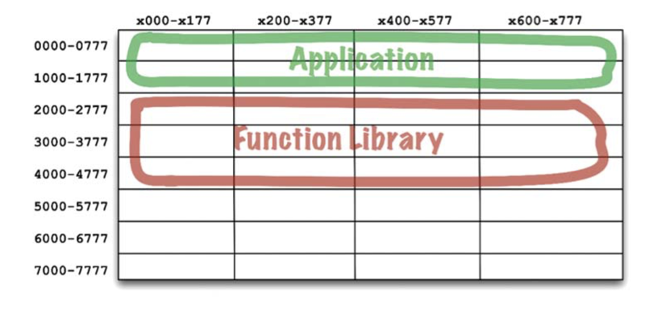
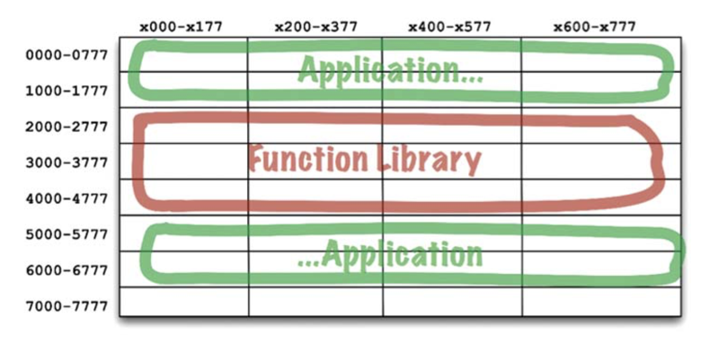

# Part IV Component Principles

If the SOLID principles tell us how to arrange the bricks into walls and rooms, then the component principles tell us how to arrange the rooms into buildings. Large software systems, like large buildings, are built out of smaller components.

In Part IV, we will discuss what software components are, which elements should compose them, and how they should be composed together into systems.

组件构建原则

大型软件系统的构建过程与建筑物修建很类似，都是由一个个小组件组成的。所以，如果说 SOLID 原则是用于指导我们如何将砖块砌成墙与房间的，那么组件构建原则就是用来指导我们如何将这些房间组合成房子的。

在第 4 部分中，我们会详细讨论软件组件是什么，它们由什么元素构成，以及如何利用组件来构建系统。

# 1201. Components

## Conclusion

These dynamically linked files, which can be plugged together at runtime, are the software components of our architectures. It has taken 50 years, but we have arrived at a place where component plugin architecture can be the casual default as opposed to the herculean effort it once was.

我们常常会在程序运行时插入某些动态链接文件，这些动态链接文件所使用的就是软件架构中的组件概念。在经历了 50 年的演进之后，组件化的插件式架构已经成为我们习以为常的软件构建形式了。

## 12.0

Components are the units of deployment. They are the smallest entities that can be deployed as part of a system. In Java, they are jar files. In Ruby, they are gem files. In .Net, they are DLLs. In compiled languages, they are aggregations of binary files. In interpreted languages, they are aggregations of source files. In all languages, they are the granule of deployment.

Components can be linked together into a single executable. Or they can be aggregated together into a single archive, such as a .war file. Or they can be independently deployed as separate dynamically loaded plugins, such as.jar or .dll or .exe files. Regardless of how they are eventually deployed, well-designed components always retain the ability to be independently deployable and, therefore, independently developable.

组件是软件的部署单元，是整个软件系统在部署过程中可以独立完成部署的最小实体。例如，对于 Java 来说，它的组件是 jar 文件。而在 Ruby 中，它们是 gem 文件。在 .Net 中，它们则是 DLL 文件。总而言之，在编译运行语言中，组件是一组二进制文件的集合。而在解释运行语言中，组件则是一组源代码文件的集合。无论采用什么编程语言来开发软件，组件都是该软件在部署过程中的最小单元。

我们可以将多个组件链接成一个独立可执行文件，也可以将它们汇总成类似 .war 文件这样的部署单元，又或者，组件也可以被打包成 .jar、.dll 或者 .exe 文件，并以可动态加载的插件形式来独立部署。但无论采用哪种部署形式，设计良好的组件都应该永远保持可被独立部署的特性，这同时也意味着这些组件应该可以被单独开发。

## 12.1 A Brief History of Components

In the early years of software development, programmers controlled the memory location and layout of their programs. One of the first lines of code in a program would be the origin statement, which declared the address at which the program was to be loaded.

Consider the following simple PDP-8 program. It consists of a subroutine named GETSTR that inputs a string from the keyboard and saves it in a buffer. It also has a little unit test program to exercise GETSTR.

Note the *200 command at the start of this program. It tells the compiler to generate code that will be loaded at address 2008.

This kind of programming is a foreign concept for most programmers today. They rarely have to think about where a program is loaded in the memory of the computer. But in the early days, this was one of the first decisions a programmer needed to make. In those days, programs were not relocatable.

How did you access a library function in those olden days? The preceding code illustrates the approach used. Programmers included the source code of the library functions with their application code, and compiled them all as a single program. [1] Libraries were kept in source, not in binary.

The problem with this approach was that, during this era, devices were slow and memory was expensive and, therefore, limited. Compilers needed to make several passes over the source code, but memory was too limited to keep all the source code resident. Consequently, the compiler had to read in the source code several times using the slow devices.

This took a long time — and the larger your function library, the longer the compiler took. Compiling a large program could take hours.

To shorten the compile times, programmers separated the source code of the function library from the applications. They compiled the function library separately and loaded the binary at a known address — say, 20008. They created a symbol table for the function library and compiled that with their application code. When they wanted to run an application, they would load the binary function library, [2] and then load the application. Memory looked like the layout shown in Figure 12.1.

Figure 12.1  Early memory layout

This worked fine so long as the application could fit between addresses 00008 and 17778. But soon applications grew to be larger than the space allotted for them. At that point, programmers had to split their applications into two address segments, jumping around the function library (Figure 12.2).

Figure 12.2  Splitting the application into two address segments

Obviously, this was not a sustainable situation. As programmers added more functions to the function library, it exceeded its bounds, and they had to allocate more space for it (in this example, near 70008). This fragmentation of programs and libraries necessarily continued as computer memory grew.

Clearly, something had to be done.

1 My first employer kept several dozen decks of the subroutine library source code on a shelf. When you wrote a new program, you simply grabbed one of those decks and slapped it onto the end of your deck.

2 Actually, most of those old machines used core memory, which did not get erased when you powered the computer down. We often left the function library loaded for days at a time.

组件发展史

在早期的软件开发中，程序员可以完全掌控自己编写的程序所处的内存地址和存放格式。在那时，程序中的第一条语句被称为起源（origin）语句，它的作用是声明该程序应该被加载到的内存位置。

例如下面这段简单的 PDP-8 程序。该程序中包含一段名为 GETSTR 的子程序，作用是从键盘上读取一个字符串，并将其存入缓冲区。同时，该程序中还包含一段用于测试 GETSTR 功能的单元测试。

首先，程序开头的 * 200 命令告诉编译器生成后的代码应该加载到内存地址为 200（八进制）的位置。

当然，上面这种编程方式如今应该已经很少见了，因为现在的程序员一般不需要考虑程序要加载的内存地址。但这的确是早期程序员们在编程初期就要做的一个重要决策，因为当时的程序基本不能被重定位（relocate）。

那么，当时是如何调用库函数呢？上述代码演示了具体调用过程。程序员们需要将所有要调用的库函数源代码包含到自己的程序代码中，然后再进行整体编译。库函数文件都是以源代码而非二进制的形式保存的。

在那个年代，存储设备十分缓慢，而内存则非常昂贵，也非常有限。编译器在编译程序的过程中需要数次遍历整个源代码。由于内存非常有限，驻留所有的源代码是不现实的，编译器只能多次从缓慢的存储设备中读取源代码。

这样做是十分耗时的  —  —  库函数越多，编译就越慢。大型程序的编译过程经常需要几个小时。

为了缩短编译时间，程序员们改将库函数的源代码单独编译。而库函数的源代码在单独编译后会被加载到一个指定位置，比如地址 2000（八进制）。然后，编译器会针对该库文件创建一个符号表（symbol table），并将其和应用程序代码编译在一起。当程序运行时，它会先加载二进制形式的库文件，再加载编译过的应用程序，其内存布局如图 12.1 所示。

当然，只要应用程序的代码能够完全存放在地址 0000～1777（八进制）内，这种组织方式就没有任何问题。但是，应用程序代码的大小很快就会超出这个范围。为了解决这个问题，程序员们必须将应用程序代码切分成两个不同的地址段，以跳过库函数存放的内存范围（具体如图 12.2 所示）。

图 12.2 将应用程序内存地址切分成两段

很显然，这种方案也是不可持续的。因为随着函数库中函数的增加，它的大小也随之增加，我们同样也需要为此划分新的区域，譬如在上述例子中，我们需要在 7000（八进制）左右的位置往后追加地址空间。这样一来，程序和函数库的碎片化程度会随着计算机内存的增加而不断增加。

显而易见，这个问题必须要有一个解决方案。

## 12.2 Relocatability

The solution was relocatable binaries. The idea behind them was very simple. The compiler was changed to output binary code that could be relocated in memory by a smart loader. The loader would be told where to load the relocatable code. The relocatable code was instrumented with flags that told the loader which parts of the loaded data had to be altered to be loaded at the selected address. Usually this just meant adding the starting address to any memory reference addresses in the binary.

Now the programmer could tell the loader where to load the function library, and where to load the application. In fact, the loader would accept several binary inputs and simply load them in memory one right after the other, relocating them as it loaded them. This allowed programmers to load only those functions that they needed.

The compiler was also changed to emit the names of the functions as metadata in the relocatable binary. If a program called a library function, the compiler would emit that name as an external reference. If a program defined a library function, the compiler would emit that name as an external definition. Then the loader could link the external references to the external definitions once it had determined where it had loaded those definitions.

And the linking loader was born.

重定位技术

该解决方案就是生成可重定位的二进制文件。其背后的原理非常简单，即程序员修改编译器输出文件的二进制格式，使其可以由一个智能加载器加载到任意内存位置。当然，这需要我们在加载器启动时为这些文件指定要加载到的内存地址，而且可重定位的代码中还包含了一些记号，加载器将其加载到指定位置时会修改这些记号对应的地址值。一般来说，这个过程只不过就是将二进制文件中包含的内存地址都按照其加载到的内存基础位置进行递增。

这样一来，程序员们就可以用加载器来调整函数库及应用程序的位置了。事实上，这种加载器还可以接受多个二进制文件的输入，并按顺序在内存中加载它们，再逐个进行重定位。这样，程序员们就可以只加载他们实际会用到的函数了。

除此之外，程序员们还对编译器做了另外一个修改，就是在可重定位二进制文件中将函数名输出为元数据并存储起来。这样一来，如果一段程序调用了某个库函数，编译器就会将这个函数的名字输出为外部引用（external reference），而将库函数的定义输出为外部定义（external definition）。加载器在加载完程序后，会将外部引用和外部定义链接（link）起来。

这就是链接加载器（linking loader）的由来。

## 12.3 Linkers

The linking loader allowed programmers to divide their programs up onto separately compilable and loadable segments. This worked well when relatively small programs were being linked with relatively small libraries. However, in the late 1960s and early 1970s, programmers got more ambitious, and their programs got a lot bigger.

Eventually, the linking loaders were too slow to tolerate. Function libraries were stored on slow devices such a magnetic tape. Even the disks, back then, were quite slow. Using these relatively slow devices, the linking loaders had to read dozens, if not hundreds, of binary libraries to resolve the external references. As programs grew larger and larger, and more library functions accumulated in libraries, a linking loader could take more than an hour just to load the program.

Eventually, the loading and the linking were separated into two phases. Programmers took the slow part — the part that did that linking — and put it into a separate application called the linker. The output of the linker was a linked relocatable that a relocating loader could load very quickly. This allowed programmers to prepare an executable using the slow linker, but then they could load it quickly, at any time.

Then came the 1980s. Programmers were working in C or some other high-level language. As their ambitions grew, so did their programs. Programs that numbered hundreds of thousands of lines of code were not unusual.

Source modules were compiled from .c files into .o files, and then fed into the linker to create executable files that could be quickly loaded. Compiling each individual module was relatively fast, but compiling all the modules took a bit of time. The linker would then take even more time. Turnaround had again grown to an hour or more in many cases.

It seemed as if programmers were doomed to endlessly chase their tails. Throughout the 1960s, 1970s, and 1980s, all the changes made to speed up workflow were thwarted by programmers' ambitions, and the size of the programs they wrote. They could not seem to escape from the hour-long turnaround times. Loading time remained fast, but compile-link times were the bottleneck.

We were, of course, experiencing Murphy's law of program size:

Programs will grow to fill all available compile and link time.

But Murphy was not the only contender in town. Along came Moore, [3] and in the late 1980s, the two battled it out. Moore won that battle. Disks started to shrink and got significantly faster. Computer memory started to get so ridiculously cheap that much of the data on disk could be cached in RAM. Computer clock rates increased from 1 MHz to 100 MHz.

By the mid-1990s, the time spent linking had begun to shrink faster than our ambitions could make programs grow. In many cases, link time decreased to a matter of seconds. For small jobs, the idea of a linking loader became feasible again.

This was the era of Active-X, shared libraries, and the beginnings of .jar files. Computers and devices had gotten so fast that we could, once again, do the linking at load time. We could link together several .jar files, or several shared libraries in a matter of seconds, and execute the resulting program. And so the component plugin architecture was born.

Today we routinely ship .jar files or DLLs or shared libraries as plugins to existing applications. If you want to create a mod to Minecraft, for example, you simply include your custom .jar files in a certain folder. If you want to plug Resharper into Visual Studio, you simply include the appropriate DLLs.

3 Moore's law: Computer speed, memory, and density double every 18 months. This law held from the 1950s to 2000, but then, at least for clock rates, stopped cold.

链接器

链接加载器让程序员们可以将程序切分成多个可被分别编译、加载的程序段。在程序规模较小、外部链接也较少的情况下，这个方案一直都很好用。然而在 20 世纪 60 年代末期到 70 年代初期的那段时间里，程序的规模突然有了大幅的增长，情况就有所不同了。

显然在这种情况下，链接加载器的处理过程实在是太慢了。且不说函数库当时还存储在磁带卷这样的低速存储设备上，即使是存储在磁盘上，其存取速度也是很慢的。毕竟，链接加载器在加载处理过程中必须要读取几十个甚至几百个二进制库文件来解析外部引用。因此随着程序规模的扩大，以及函数库中函数的累积，链接加载器的加载过程经常会出现需要一个多小时才能完成的情况。

最后，程序员们只能将加载过程和链接过程也进行分离。他们将耗时较长的部分  —  —  链接部分  —  —  放到了一个单独的程序中去进行，这个程序就是所谓的链接器（linker）。链接器的输出是一个已经完成了外部链接的、可以重定位的二进制文件，这种文件可以由一个支持重定位的加载器迅速加载到内存中。这使得程序员可以用缓慢的链接器生产出可以很快进行多次加载的可执行文件。

时间继续推移到了 20 世纪 80 年代，程序员们在那时已经用上了 C 这样的高级编程语言，程序的规模也得到了进一步的扩大，源代码行数超过几十万行在当时已经是很普遍的事了。

于是，源代码模块会从 .c 文件被编译成 .o 文件，然后再由链接器创建出可被快速加载的可执行文件。那时，虽然编译每个单独模块的速度相对较快，但所有模块的累计编译时间较长，链接过程则耗时更久，整个修改编译周期经常会超过数个小时。

有时候，程序员们看上去似乎就是一直不停地在原地打转。从 20 世纪 60 年代一直到 80 年代，他们所有为提供编译速度所做的努力都被不断增长的程序规模抵消了。程序员好像永远也脱离不了长达几个小时的修改编译周期。程序加载的速度一直都很快，但是其编译和链接的过程也一直是整个开发过程的瓶颈。

这被我们称为程序规模上的墨菲定律：

程序的规模会一直不断地增长下去，直到将有限的编译和链接时间填满为止。

除了墨菲定律，我们还有摩尔定律。在 20 世纪 80 年代，两个定律一直在互相较量，最终以摩尔定律获胜告终。因为磁盘的物理尺寸一直在不断缩小，速度在不断提高，同时内存的造价也一直在不断降低，以至于大部分存放在磁盘上的数据都可以被缓存在内存中了。而计算机时钟频率则从 1MHz 上升到了 100MHz。

到了 20 世纪 90 年代中期，链接速度的提升速度已经远远超过了程序规模的增长速度。在大部分情况下，程序链接的时间已经降低到秒级。这对一些小程序来说，即使使用链接加载器也是可以接受的了。

与此同时，编程领域中还诞生了 Active-X、共享库、.jar 文件等组件形式。由于计算与存储速度的大幅提高，我们又可以在加载过程中进行实时链接了，链接几个 .jar 文件或是共享库文件通常只需要几秒钟时间，由此，插件化架构也就随之诞生了。

如今，我们用 .jar 文件、DLL 文件和共享库方式来部署应用的插件已经非常司空见惯了。如果现在我们想要给 Minecraft 增加一个模块，只需要将 .jar 文件放到一个指定的目录中即可。同样的，如果你想给 Visual Studio 增加 Resharper 插件，也只需要安装对应的 DLL 文件即可。