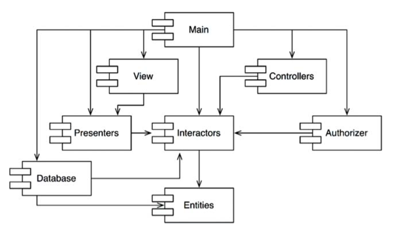
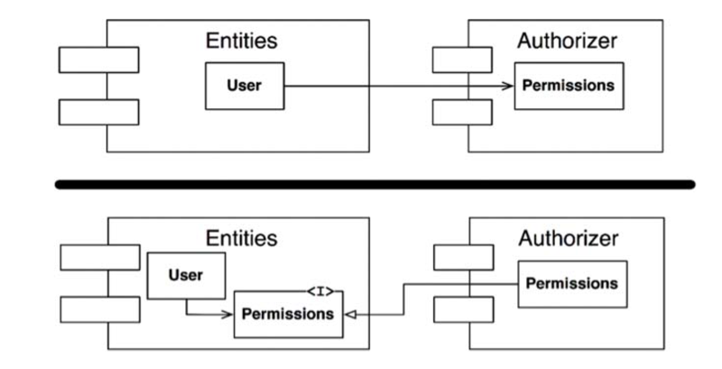
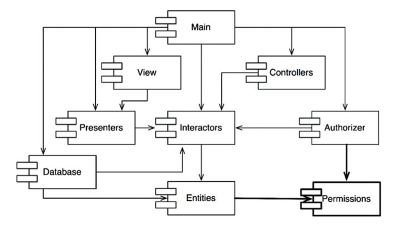
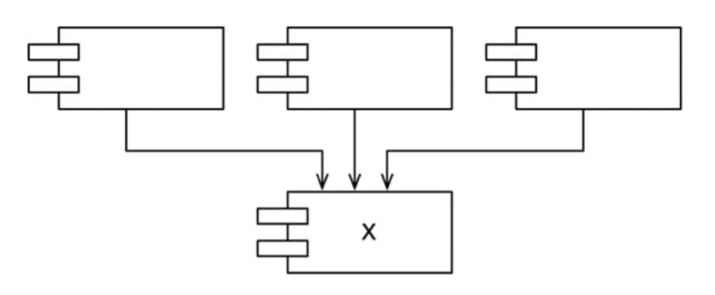
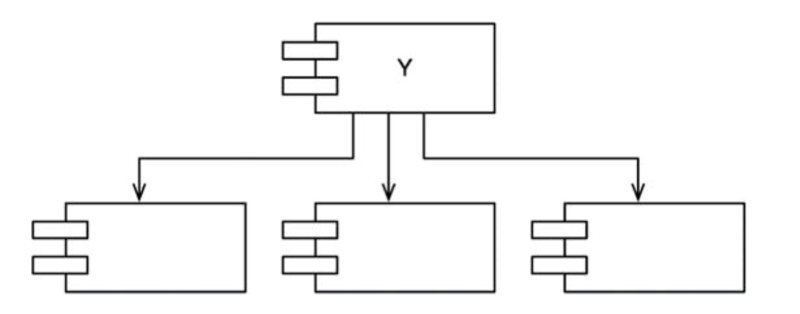
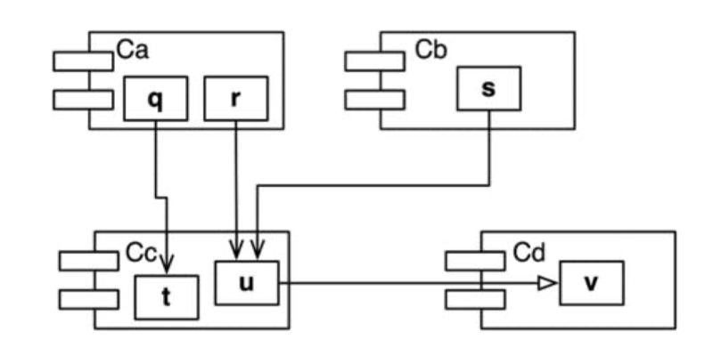
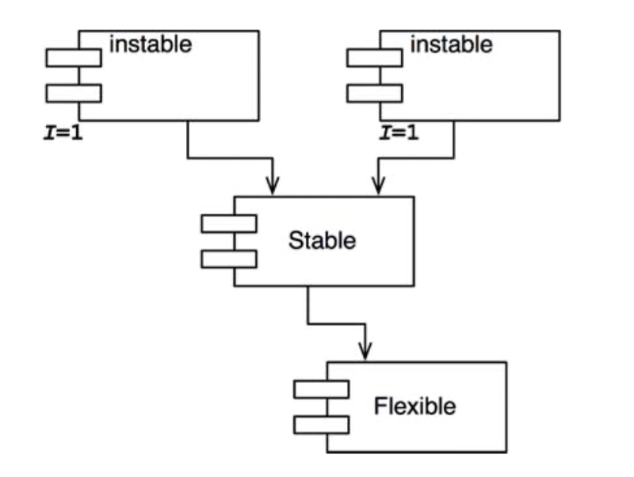
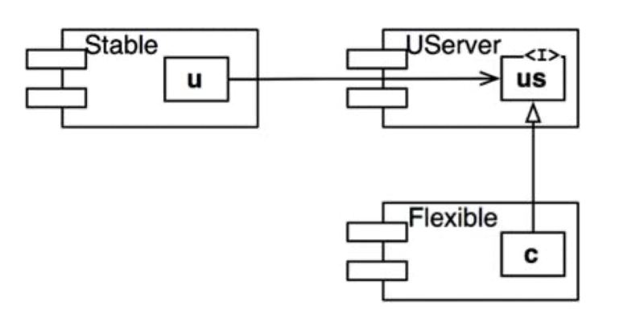
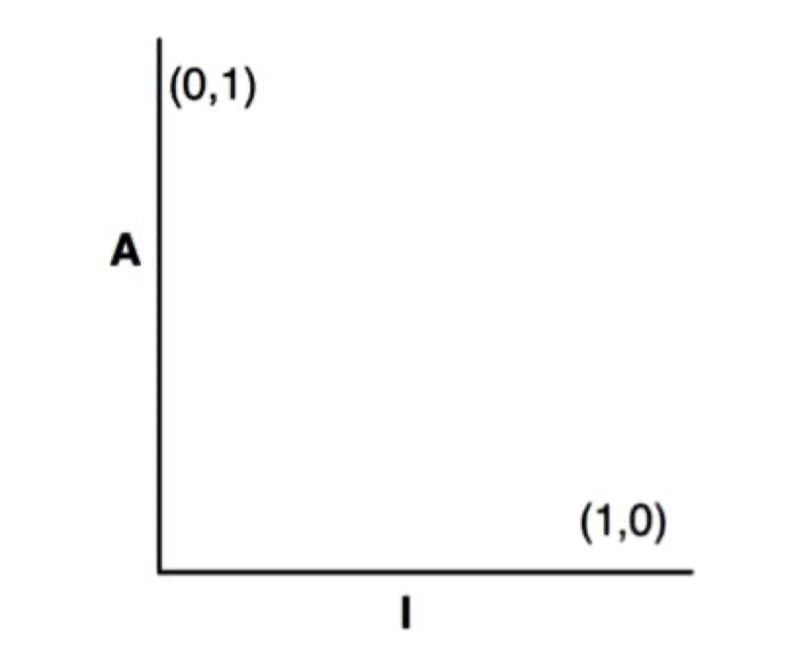
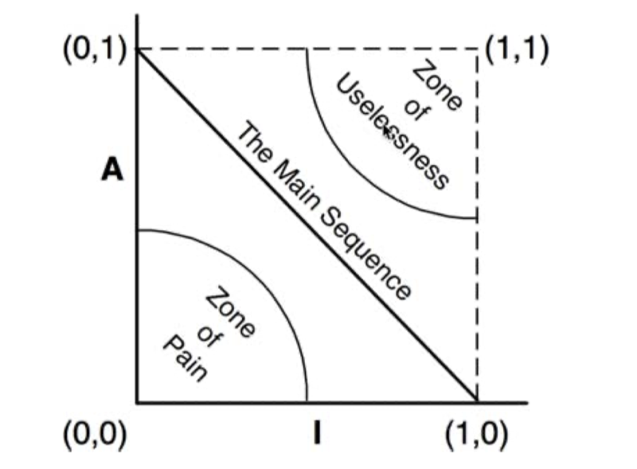

# 1401. Component Coupling

## Conclusion

The dependency management metrics described in this chapter measure the conformance of a design to a pattern of dependency and abstraction that I think is a「good」pattern. Experience has shown that certain dependencies are good and others are bad. This pattern reflects that experience. However, a metric is not a god; it is merely a measurement against an arbitrary standard. These metrics are imperfect, at best, but it is my hope that you find them useful.

本章介绍了各种可用于依赖关系管理的指标，它们可以被用来量化分析某个系统设计与「优秀」设计模式之间的契合度。根据以往的经验，组件之间有些依赖关系是好的，有些依赖关系则是不好的，这些经验最后都会体现在这个设计模式中。当然，指标并不等同于真理，它只是对我们所定义标准的一个衡量。这些指标肯定是不完美的，但是我希望它们对读者有价值。

## 14.0

The next three principles deal with the relationships between components. Here again we will run into the tension between develop-ability and logical design. The forces that impinge upon the architecture of a component structure are technical, political, and volatile.

组件耦合

接下来要讨论的三条原则主要关注的是组件之间的关系。在这些原则中，我们同样会面临着研发能力和逻辑设计之间的冲突。毕竟，影响组件结构的不仅有技术水平和公司内部政治斗争这两个因素，其结构本身更是不断变化的。

## 14.1 The Acyclic Dependencies Principle

Allow no cycles in the component dependency graph.

Have you ever worked all day, gotten some stuff working, and then gone home, only to arrive the next morning to find that your stuff no longer works? Why doesn't it work? Because somebody stayed later than you and changed something you depend on! I call this「the morning after syndrome.」

The「morning after syndrome」occurs in development environments where many developers are modifying the same source files. In relatively small projects with just a few developers, it isn't too big a problem. But as the size of the project and the development team grow, the mornings after can get pretty nightmarish. It is not uncommon for weeks to go by without the team being able to build a stable version of the project. Instead, everyone keeps on changing and changing their code trying to make it work with the last changes that someone else made.

Over the last several decades, two solutions to this problem have evolved, both of which came from the telecommunications industry. The first is「the weekly build,」and the second is the Acyclic Dependencies Principle (ADP).

2『一觉醒来综合征的两个解决方案，做一张主题卡片。（2021-5-13）』—— 已完成

无依赖环原则

组件依赖关系图中不应该出现环。

我们一定都有过这样的经历：当你花了一整天的时间，好不容易搞定了一段代码，第二天上班时却发现这段代码莫名其妙地又不能工作了。这通常是因为有人在你走后修改了你所依赖的某个组件。我给这种情况起了个名字 ——「一觉醒来综合征」。

这种综合征的主要病因是多个程序员同时修改了同一个源代码文件。虽然在规模相对较小、人员较少的项目中，这种问题或许并不严重，但是随着项目的增长，研发人员的增加，这种每天早上刚上班时都要经历一遍的痛苦就会越来越多。甚至会严重到让有的团队在长达数周的时间内都不能发布一个稳定的项目版本，因为每个人都在不停地修改自己的代码，以适应其他人所提交的变更。

在过去几十年中，针对这个问题逐渐演化出了两种解决方案，它们都来自电信行业。第一种是「每周构建」，第二种是「无依赖环原则」（ADP）。

### 14.1.1 The Weekly Build

The weekly build used to be common in medium-sized projects. It works like this: All the developers ignore each other for the first four days of the week. They all work on private copies of the code, and don't worry about integrating their work on a collective basis. Then, on Friday, they integrate all their changes and build the system.

This approach has the wonderful advantage of allowing the developers to live in an isolated world for four days out of five. The disadvantage, of course, is the large integration penalty that is paid on Friday.

Unfortunately, as the project grows, it becomes less feasible to finish integrating the project on Friday. The integration burden grows until it starts to overflow into Saturday. A few such Saturdays are enough to convince the developers that integration should really begin on Thursday — and so the start of integration slowly creeps toward the middle of the week.

As the duty cycle of development versus integration decreases, the efficiency of the team decreases, too. Eventually this situation becomes so frustrating that the developers, or the project managers, declare that the schedule should be changed to a biweekly build. This suffices for a time, but the integration time continues to grow with project size.

Eventually, this scenario leads to a crisis. To maintain efficiency, the build schedule has to be continually lengthened — but lengthening the build schedule increases project risks. Integration and testing become increasingly harder to do, and the team loses the benefit of rapid feedback.

每周构建

每周构建方案是中型项目中很常见的一种管理手段。其具体做法如下：在每周的前四天中，让所有的程序员在自己的私有库上工作，忽略其他人的修改，也不考虑互相之间的集成问题；然后在每周五要求所有人将自己所做的变更提交，进行统一构建。

上述方案确实可以让程序员们每周都有四天的时间放手干活。然而一到星期五，所有人都必须要花费大量的精力来处理前四天留下来的问题。

而且更不幸的是，随着项目越来越大，每周五的集成工作会越来越难以按时完成。而随着集成任务越来越重，周六的加班也会变得越来越频繁。经历过几次这样的加班之后，就会有人提出应该将集成任务提前到星期四开始，就这样一步一步地，集成工作慢慢地就要占用掉差不多半周的时间。

事实上，这个问题最终还会造成更大的麻烦。因为如果我们想要保持高效率的开发，就不能频繁地进行构建操作，但是如果我们减少了构建次数，延长了项目被构建的时间间隔，又会影响到该项目的质量，增大它的风险。整个项目会变得越来越难以构建与测试，团队反馈周期会越来越长，研发质量自然也会越来越差。

### 14.1.2 Eliminating Dependency Cycles

The solution to this problem is to partition the development environment into releasable components. The components become units of work that can be the responsibility of a single developer, or a team of developers. When developers get a component working, they release it for use by the other developers. They give it a release number and move it into a directory for other teams to use. They then continue to modify their component in their own private areas. Everyone else uses the released version.

As new releases of a component are made available, other teams can decide whether they will immediately adopt the new release. If they decide not to, they simply continue using the old release. Once they decide that they are ready, they begin to use the new release.

Thus no team is at the mercy of the others. Changes made to one component do not need to have an immediate affect on other teams. Each team can decide for itself when to adapt its own components to new releases of the components. Moreover, integration happens in small increments. There is no single point in time when all developers must come together and integrate everything they are doing.

This is a very simple and rational process, and it is widely used. To make it work successfully, however, you must manage the dependency structure of the components. There can be no cycles. If there are cycles in the dependency structure, then the「morning after syndrome」cannot be avoided.

Consider the component diagram in Figure 14.1. It shows a rather typical structure of components assembled into an application. The function of this application is unimportant for the purpose of this example. What is important is the dependency structure of the components. Notice that this structure is a directed graph. The components are the nodes, and the dependency relationships are the directed edges.

Figure 14.1 Typical component diagram

Notice one more thing: Regardless of which component you begin at, it is impossible to follow the dependency relationships and wind up back at that component. This structure has no cycles. It is a directed acyclic graph (DAG).

Now consider what happens when the team responsible for Presenters makes a new release of their component. It is easy to find out who is affected by this release; you just follow the dependency arrows backward. Thus View and Main will both be affected. The developers currently working on those components will have to decide when they should integrate their work with the new release of Presenters.

Notice also that when Main is released, it has utterly no effect on any of the other components in the system. They don't know about Main, and they don't care when it changes. This is nice. It means that the impact of releasing Main is relatively small.

When the developers working on the Presenters component would like to run a test of that component, they just need to build their version of Presenters with the versions of the Interactors and Entities components that they are currently using. None of the other components in the system need be involved. This is nice. It means that the developers working on Presenters have relatively little work to do to set up a test, and that they have relatively few variables to consider.

When it is time to release the whole system, the process proceeds from the bottom up. First the Entities component is compiled, tested, and released. Then the same is done for Database and Interactors. These components are followed by Presenters, View, Controllers, and then Authorizer. Main goes last. This process is very clear and easy to deal with. We know how to build the system because we understand the dependencies between its parts.

消除循环依赖

对于上述情景，我们的解决办法是将研发项目划分为一些可单独发布的组件，这些组件可以交由单人或者某一组程序员来独立完成。当有人或团队完成某个组件的某个版本时，他们就会通过发布机制通知其他程序员，并给该组件打一个版本号，放入一个共享目录。这样一来，每个人都可以依赖于这些组件公开发布的版本来进行开发，而组件开发者则可以继续去修改自己的私有版本。

每当一个组件发布新版本时，其他依赖这个组件的团队都可以自主决定是否立即采用新版本。若不采用，该团队可以选择继续使用旧版组件，直到他们准备好采用新版本为止。

这样就不会出现团队之间相互依赖的情况了。任何一个组件上的变更都不会立刻影响到其他团队。每个团队都可以自主决定是否立即集成自己所依赖组件的新版本。更重要的是，这种方法使我们的集成工作能以一种小型渐进的方式来进行。程序员们再也不需要集中在一起，统一集成相互的变更了。

如你所见，上述整个过程既简单又很符合逻辑，因而得到了各个研发团队的广泛采用。但是，如果想要成功推广这个开发流程，就必须控制好组件之间的依赖结构，绝对不能允许该结构中存在着循环依赖关系。如果某项目结构中存在着循环依赖关系，那么「一觉醒来综合征」将是不可避免的。

下面让我们来看看图 14.1，该图展示了一个典型应用程序的组件结构。当然，这个应用程序的具体功能与我们要讨论的无关，真正重要的是其组件之间的依赖结构。我们应该可以注意到，该组件依赖结构所呈现的是一个有向图，图中的每个节点都是一个项目组件，依赖关系就是有向图中的边。

更重要的是，不管我们从该图中的哪个节点开始，都不能沿着这些代表了依赖关系的边最终走回到起始点。也就是说，这种结构中不存在环，我们称这种结构为有向无环图（Directed Acyclic Graph，简写为 DAG）。

现在，如果负责 Presenters 组件的团队需要发布一个新版本，我们就应该很容易判断出哪些组件会受这个变更的影响 —— 只需要按其依赖关系反向追溯即可。显然在图 14.1 中，View 和 Main 是同时会被影响的两个组件。这两个组件的研发团队需要决定是否采用 Presenters 组件的新版本。

另外值得注意的是，当 Main 组件发布新版本时，它对系统中的其他组件根本就没有影响，既没有一个组件依赖于 Main，也就没有人需要关心 Main 组件上发生的变更。这太好了，至少表示我们在发布 Main 的新版本时，可以不必考虑它对整个项目微乎其微的影响。

当 Presenters 组件的程序员们需要进行一次测试时，他们只需要将对应版本的 Presenters 和 Interactors 及 Entities 的当前版本一起构建并测试即可，其他组件不需要做任何修改。这可以让编写 Presenters 组件的程序员们在编写测试时考虑更少的变量，工作量更小。

当我们需要发布整个系统时，可以让整个过程从下至上来进行。具体来说就是，首先对 Entities 组件进行编译、测试、发布。随后是 Database 和 Interactors 这两个组件。再紧随其后的是 Presenters、View、Controllers，以及 Authorizer 四个组件。最后是 Main 组件。这样一来，整个流程会非常清晰，也很容易。只要我们了解系统各部分之间的依赖关系，构建整套系统就会变得很容易。

### 14.1.3 The Effect of a Cycle in the Component Dependency Graph

Suppose that a new requirement forces us to change one of the classes in Entities such that it makes use of a class in Authorizer. For example, let's say that the User class in Entities uses the Permissions class in Authorizer. This creates a dependency cycle, as shown in Figure 14.2.

This cycle creates some immediate problems. For example, the developers working on the Database component know that to release it, the component must be compatible with Entities. However, with the cycle in place, the Database component must now also be compatible with Authorizer. But Authorizer depends on Interactors. This makes Database much more difficult to release. Entities, Authorizer, and Interactors have, in effect, become one large component — which means that all of the developers working on any of those components will experience the dreaded「morning after syndrome.」They will be stepping all over one another because they must all use exactly the same release of one another's components.

Figure 14.2  A dependency cycle

But this is just part of the trouble. Consider what happens when we want to test the Entities component. To our chagrin, we find that we must build and integrate with Authorizer and Interactors. This level of coupling between components is troubling, if not intolerable.

You may have wondered why you have to include so many different libraries, and so much of everybody else's stuff, just to run a simple unit test of one of your classes. If you investigate the matter a bit, you will probably discover that there are cycles in the dependency graph. Such cycles make it very difficult to isolate components. Unit testing and releasing become very difficult and error prone. In addition, build issues grow geometrically with the number of modules.

1-2『这里的信息太受启发了，为啥形成依赖闭合的多个组件难改？形成闭合意味着这几个组件可以作为一个「整体」，作为一个整体的话，每次就得同步、同版本。多个组件依赖闭环形成大组件难改的原因，做一张主题主题卡片。（2021-05-14）』—— 已完成

Moreover, when there are cycles in the dependency graph, it can be very difficult to work out the order in which you must build the components. Indeed, there probably is no correct order. This can lead to some very nasty problems in languages like Java that read their declarations from compiled binary files.

循环依赖在组件依赖图中的影响

假设某个新需求使我们修改了 Entities 组件中的某个类，而这个类又依赖于 Authorizer 组件中的某个类。例如，Entities 组件中的 User 类使用了 Authorizer 组件中的 Permissions 类。这就形成了一个循环依赖关系，如图 14.2 所示。

图 14.2：循环依赖

这种循环依赖立刻就会给我们的项目带来麻烦。例如，当 Database 组件的程序员需要发布新版本时，他们需要与 Entities 组件进行集成。但现在由于出现了循环依赖，Database 组件就必须也要与 Authorizer 组件兼容，而 Authorizer 组件又依赖于 Interactors 组件。这样一来，Database 组件的发布就会变得非常困难。在这里，Entities、Authorizer 及 Interactors 这三个组件事实上被合并成了一个更大的组件。这些组件的程序员现在会互相形成干扰，因为他们在开发中都必须使用完全相同的组件版本。

这还只是问题的冰山一角，请想象一下我们在测试 Entities 组件时会发生什么？情况会让人触目惊心，我们会发现自己必须将 Authorizer 和 Interactors 集成到一起测试。即使这不是不能容忍的事，但至少这些组件之间的耦合度也是非常令人不安的。

很显然，这样一个小小的测试必须要依赖大量的库就是因为其组件结构依赖图中存在的这个循环依赖。这种循环依赖会使得组件的独立维护工作变得十分困难。不仅如此，单元测试和发布流程也都会变得非常困难，并且很容易出错。此外，项目在构建中出现的问题会随着组件数量的增多而呈现出几何级数的增长。

所以，当组件结构依赖图中存在循环依赖时，想要按正确的顺序构建组件几乎是不可能的。这种依赖关系将会在 Java 这种需要在编译好的二级制文件中读取声明信息的语言中导致一些非常棘手的问题。

### 14.1.4 Breaking  the  Cycle

It is always possible to break a cycle of components and reinstate the dependency graph as a DAG. There are two primary mechanisms for doing so:

1 Apply the Dependency Inversion Principle (DIP). In the case in Figure 14.3, we could create an interface that has the methods that User needs. We could then put that interface into Entities and inherit it into Authorizer. This inverts the dependency between Entities and Authorizer, thereby breaking the cycle.

Figure 14.3  Inverting the dependency between Entities and Authorizer

2 Create a new component that both Entities and Authorizer depend on. Move the class(es) that they both depend on into that new component (Figure 14.4).

Figure 14.4 The new component that both Entities and Authorizer depend on

打破循环依赖

当然，我们可以打破这些组件中的循环依赖，并将其依赖图转化为 DAG。目前有以下两种主要机制可以做到这件事情。

1、应用依赖反转原则（DIP）：在图 14.3 中，我们可以创建一个 User 类需要使用的接口，然后将这个接口放入 Entities 组件，并在 Authorizer 组件中继承它。这样就将 Entities 与 Authorizer 之间的依赖关系反转了，自然也就打破了循环依赖关系。

图 14.3：将 Entities 与 Authorizer 之间的依赖关系反转

2、创建一个新的组件，并让 Entities 与 Authorize 这两个组件都依赖于它。将现有的这两个组件中互相依赖的类全部放入新组件（如图 14.4 所示）。

图 14.4：让 Entities 与 Authorizer 共同依赖于一个新组件

### 14.1.5 The 「Jitters」

The second solution implies that the component structure is volatile in the presence of changing requirements. Indeed, as the application grows, the component dependency structure jitters and grows. Thus the dependency structure must always be monitored for cycles. When cycles occur, they must be broken somehow. Sometimes this will mean creating new components, making the dependency structure grow.

「抖动」

当然，采用第二种解决方案也意味着在需求变更时，项目的组件结构也要随之变更。确实是这样的，随着应用程序的不断演进，其组件结构也会不停地抖动和扩张。因此，我们必须要持续地监控项目中的循环依赖关系。当循环依赖出现时，必须以某种方式消除它们。为此，我们有时候不可避免地需要创建新的组件，而使整个组件结构变得更大。

## 14.2 Top-Down Design

The issues we have discussed so far lead to an inescapable conclusion: The component structure cannot be designed from the top down. It is not one of the first things about the system that is designed, but rather evolves as the system grows and changes.

Some readers may find this point to be counterintuitive. We have come to expect that large-grained decompositions, like components, will also be high-level functional decompositions.

When we see a large-grained grouping such as a component dependency structure, we believe that the components ought to somehow represent the functions of the system. Yet this does not seem to be an attribute of component dependency diagrams.

In fact, component dependency diagrams have very little do to with describing the function of the application. Instead, they are a map to the buildability and maintainability of the application. This is why they aren't designed at the beginning of the project. There is no software to build or maintain, so there is no need for a build and maintenance map. But as more and more modules accumulate in the early stages of implementation and design, there is a growing need to manage the dependencies so that the project can be developed without the「morning after syndrome.」Moreover, we want to keep changes as localized as possible, so we start paying attention to the SRP and CCP and collocate classes that are likely to change together.

One of the overriding concerns with this dependency structure is the isolation of volatility. We don't want components that change frequently and for capricious reasons to affect components that otherwise ought to be stable. For example, we don't want cosmetic changes to the GUI to have an impact on our business rules. We don't want the addition or modification of reports to have an impact on our highest-level policies. Consequently, the component dependency graph is created and molded by architects to protect stable high-value components from volatile components.

As the application continues to grow, we start to become concerned about creating reusable elements. At this point, the CRP begins to influence the composition of the components. Finally, as cycles appear, the ADP is applied and the component dependency graph jitters and grows.

If we tried to design the component dependency structure before we designed any classes, we would likely fail rather badly. We would not know much about common closure, we would be unaware of any reusable elements, and we would almost certainly create components that produced dependency cycles. Thus the component dependency structure grows and evolves with the logical design of the system.

自上而下的设计

根据上述讨论，我们可以得出一个无法逃避的结论：组件结构图是不可能自上而下被设计出来的。它必须随着软件系统的变化而变化和扩张，而不可能在系统构建的最初就被完美设计出来。

有些读者可能会觉得这个结论有些反直觉。人们通常会直观地认为，代表项目粗粒度的结构单元，也就是组件，应该与顶层设计中的功能单元是相对应的。

同样的，人们也普遍认为项目粗粒度的组件分组规则所产生的就是组件的依赖结构，也应该在某种程度上与项目的系统功能分解的结果相互对应。但是很明显，组件依赖关系图其实不具备这样的属性。

事实上，组件依赖结构图并不是用来描述应用程序功能的，它更像是应用程序在构建性与维护性方面的一张地图。这就是组件的依赖结构图不能在项目的开始阶段被设计出来的原因 —— 当时该项目还没有任何被构建和维护的需要，自然也就不需要一张地图来指引。然而，随着早期被设计并实现出来的模块越来越多，项目中就逐渐出现了要对组件依赖关系进行管理的需求，以此来预防「一觉醒来综合征」的爆发。除此之外，我们还希望将项目变更所影响的范围被限制得越小越好，因此需要应用单一职责原则（SRP）和共同闭包原则（CCP）来将经常同时被变更的类聚合在一起。

组件结构图中的一个重要目标是指导如何隔离频繁的变更。我们不希望那些频繁变更的组件影响到其他本来应该很稳定的组件，例如，我们通常不会希望无关紧要的 GUI 变更影响到业务逻辑组件；我们也不希望对报表的增删操作影响到其高阶策略。出于这样的考虑，软件架构师们才有必要设计并且铸造出一套组件依赖关系图来，以便将稳定的高价值组件与常变的组件隔离开，从而起到保护作用。

另外，随着应用程序的增长，创建可重用组件的需要也会逐渐重要起来。这时 CRP 又会开始影响组件的组成。最后当循环依赖出现时，随着无循环依赖原则（ADP）的应用，组件依赖关系会产生相应的抖动和扩张。

如果我们在设计具体类之前就来设计组件依赖关系，那么几乎是必然要失败的。因为在当下，我们对项目中的共同闭包一无所知，也不可能知道哪些组件可以复用，这样几乎一定会创造出循环依赖的组件。因此，组件依赖关系是必须要随着项目的逻辑设计一起扩张和演进的。

## 14.3 The Stable Dependencies Principle

Depend in the direction of stability.

Designs cannot be completely static. Some volatility is necessary if the design is to be maintained. By conforming to the Common Closure Principle (CCP), we create components that are sensitive to certain kinds of changes but immune to others. Some of these components are designed to be volatile. We expect them to change.

Any component that we expect to be volatile should not be depended on by a component that is difficult to change. Otherwise, the volatile component will also be difficult to change.

It is the perversity of software that a module that you have designed to be easy to change can be made difficult to change by someone else who simply hangs a dependency on it. Not a line of source code in your module need change, yet your module will suddenly become more challenging to change. By conforming to the Stable Dependencies Principle (SDP), we ensure that modules that are intended to be easy to change are not depended on by modules that are harder to change.

稳定依赖原则

依赖关系必须要指向更稳定的方向。

设计这件事不可能是完全静止的，如果我们要让一个设计是可维护的，那么其中某些部分就必须是可变的。通过遵守共同闭包原则（CCP），我们可以创造出对某些变更敏感，对其他变更不敏感的组件。这其中的一些组件在设计上就已经是考虑了易变性，预期它们会经常发生变更的。

任何一个我们预期会经常变更的组件都不应该被一个难于修改的组件所依赖，否则这个多变的组件也将会变得非常难以被修改。

这就是软件开发的困难之处，我们精心设计的一个容易被修改的组件很可能会由于别人的一条简单依赖而变得非常难以被修改。即使该模块中没有一行代码需要被修改，但是整个模块在被修改时所面临的挑战性也已经存在了。而通过遵守稳定依赖原则（SDP），我们就可以确保自己设计中那些容易变更的模块不会被那些难于修改的组件所依赖。

### 14.3.1 Stability

What is meant by「stability」? Stand a penny on its side. Is it stable in that position? You would likely say「no.」However, unless disturbed, it will remain in that position for a very long time. Thus stability has nothing directly to do with frequency of change. The penny is not changing, but it is difficult to think of it as stable.

Webster's Dictionary says that something is stable if it is「not easily moved.」Stability is related to the amount of work required to make a change. On the one hand, the standing penny is not stable because it requires very little work to topple it. On the other hand, a table is very stable because it takes a considerable amount of effort to turn it over.

How does this relate to software? Many factors may make a software component hard to change — for example, its size, complexity, and clarity, among other characteristics. We will ignore all those factors and focus on something different here. One sure way to make a software component difficult to change, is to make lots of other software components depend on it. A component with lots of incoming dependencies is very stable because it requires a great deal of work to reconcile any changes with all the dependent components.

The diagram in Figure 14.5 shows X, which is a stable component. Three components depend on X, so it has three good reasons not to change. We say that X is responsible to those three components. Conversely, X depends on nothing, so it has no external influence to make it change. We say it is independent.

Figure 14.5  X: a stable component

Figure 14.6 shows Y, which is a very unstable component. No other components depend on Y, so we say that it is irresponsible. Y also has three components that it depends on, so changes may come from three external sources. We say that Y is dependent.

Figure 14.6  Y: a very unstable component

稳定性

我们该如何定义「稳定性」呢？譬如说将一个硬币立起来放，你认为它会处于一个稳定的位置吗？当然不会。然而，除非受到外界因素干扰，否则硬币本身可以在这个位置保持相当长的一段时间。因此稳定性应该与变更的频繁度没有直接关系。但问题是硬币并没有倒，为什么我们却并不认为它是稳定的呢？

下面来看看 Webster 在线字典中的描述：稳定指的是「很难移动」。所以稳定性应该与变更所需的工作量有关。例如，硬币是不稳定的，因为只需要很小的动作就可以推倒它，而桌子则是非常稳定的，因为将它掀翻需要很大的动作。

但如果将这套理论关联到软件开发的问题上呢？软件组件的变更困难度与很多因素有关，例如代码的体量大小、复杂度、清晰度等。我们在这里会忽略这些因素，只集中讨论一个特别的因素 —— 让软件组件难于修改的一个最直接的办法就是让很多其他组件依赖于它。带有许多入向依赖关系的组件是非常稳定的，因为它的任何变更都需要应用到所有依赖它的组件上。

在图 14.5 中，X 是一个稳定的组件。因为有三个组件依赖着 X，所以 X 有三个不应该被修改的原因。这里就说 X 要对三个组件负责。另一方面，X 不依赖于任何组件，所以不会有任何原因导致它需要被变更，我们称它为「独立」组件。

下面再来看看图 14.6 中的 Y 组件，这是一个非常不稳定的组件。由于没有其他的组件依赖 Y，所以 Y 并不对任何组件负责。但因为 Y 同时依赖于三个组件，所以它的变更就可能由三个不同的源产生。这里就说 Y 是有依赖性的组件。

图 14.6：Y，一个非常不稳定的组件

### 14.3.2 Stability Metrics

How can we measure the stability of a component? One way is to count the number of dependencies that enter and leave that component. These counts will allow us to calculate the positional stability of the component.

1 Fan-in: Incoming dependencies. This metric identifies the number of classes outside this component that depend on classes within the component.

2 Fan-out: Outgoing depenencies. This metric identifies the number of classes inside this component that depend on classes outside the component.

3 I: Instability: I = Fan-out/(Fan-in + Fan-out). This metric has the range [0, 1]. I = 0 indicates a maximally stable component. I = 1 indicates a maximally unstable component.

The Fan-in and Fan-out metrics [1] are calculated by counting the number of classes outside the component in question that have dependencies with the classes inside the component in question. Consider the example in Figure 14.7.

Figure 14.7  Our example

Let's say we want to calculate the stability of the component Cc. We find that there are three classes outside Cc that depend on classes in Cc. Thus, Fan-in = 3. Moreover, there is one class outside Cc that classes in Cc depend on. Thus, Fan-out = 1 and I = 1/4.

In C++, these dependencies are typically represented by #include statements. Indeed, the I metric is easiest to calculate when you have organized your source code such that there is one class in each source file. In Java, the I metric can be calculated by counting import statements and qualified names.

When the I metric is equal to 1, it means that no other component depends on this component (Fan-in = 0), and this component depends on other components (Fan-out 7 0). This situation is as unstable as a component can get; it is irresponsible and dependent. Its lack of dependents gives the component no reason not to change, and the components that it depends on may give it ample reason to change.

In contrast, when the I metric is equal to 0, it means that the component is depended on by other components (Fan-in 7 0), but does not itself depend on any other components (Fan-out = 0). Such a component is responsible and independent. It is as stable as it can get. Its dependents make it hard to change the component, and its has no dependencies that might force it to change.

The SDP says that the I metric of a component should be larger than the I metrics of the components that it depends on. That is, I metrics should decrease in the direction of dependency.

1 In previous publications, I used the names Efferent and Afferent couplings (Ce and Ca) for Fan-out and Fan-in, respectively. That was just hubris on my part: I liked the metaphor of the central nervous system.

稳定性指标

那么，究竟该如何来量化一个组件的稳定性呢？其中一种方法是计算所有入和出的依赖关系。通过这种方法，我们就可以计算出一个组件的位置稳定性（positional stability）。

Fan-in：入向依赖，这个指标指代了组件外部类依赖于组件内部类的数量。

Fan-out：出向依赖，这个指标指代了组件内部类依赖于组件外部类的数量。

I：不稳定性，I=Fan-out/(Fan-in+Fan-out)。该指标的范围是 [0,1]，I=0 意味着组件是最稳定的，I=1 意味着组件是最不稳定的。

在这里，Fan-in 和 Fan-out 这两个指标是通过统计和组件内部类有依赖的组件外部类的数量来计算的，具体如图 14.7 所示。在这里，我们想要计算组件 Cc 的稳定性指标，可以观察到有 3 个类在 Cc 外部，它们都依赖于 Cc 内部的类，因此 Fan-in=3。此外，Cc 中的一个类也依赖于组件外部的类，因此 Fan-out=1，I=1/4。

在 C++ 中，这些依赖关系一般是通过 #include 语句来表达的。事实上，当每个源文件只包含一个类的时候，I 指标是最容易计算的。同样在 Java 中，I 指标也可以通过 Import 语句和全引用名字的数量来计算。

当 I 指标等于 1 时，说明没有组件依赖当前组件（Fan-in=0），同时该组件却依赖于其他组件（Fan-out>0）。这是组件最不稳定的一种情况，我们认为这种组件是「不负责的」（irresponsible）、「对外依赖的」（dependent）。由于这个组件没有被其他组件依赖，所以自然也就没有力量会干预它的变更，同时也因为该组件依赖于其他组件，所以就必然会经常需要变更。

相反，当 I=0 的时候，说明当前组件是其他组件所依赖的目标（Fan-in>0），同时其自身并不依赖任何其他组件（Fan-out=0）。我们通常认为这样的组件是「负责的」（responsibile）、「不对外依赖的」（independent）。这是组件最具稳定性的一种情况，其他组件对它的依赖关系会导致这个组件很难被变更，同时由于它没有对外依赖关系，所以不会有来自外部的变更理由。

稳定依赖原则（SDP）的要求是让每个组件的 I 指标都必须大于其所依赖组件的 I 指标。也就是说，组件结构依赖图中各组件的 I 指标必须要按其依赖关系方向递减。

Not All Components Should Be Stable

If all the components in a system were maximally stable, the system would be unchangeable. This is not a desirable situation. Indeed, we want to design our component structure so that some components are unstable and some are stable. The diagram in Figure 14.8 shows an ideal configuration for a system with three components.

The changeable components are on top and depend on the stable component at the bottom. Putting the unstable components at the top of the diagram is a useful convention because any arrow that points up is violating the SDP (and, as we shall see later, the ADP).

Figure 14.8  An ideal configuration for a system with three components

The diagram in Figure 14.9 shows how the SDP can be violated.

Figure 14.9  SDP violation

Flexible is a component that we have designed to be easy to change. We want Flexible to be unstable. However, some developer, working in the component named Stable, has hung a dependency on Flexible. This violates the SDP because the I metric for Stable is much smaller than the I metric for Flexible. As a result, Flexible will no longer be easy to change. A change to Flexible will force us to deal with Stable and all its dependents.

To fix this problem, we somehow have to break the dependence of Stable on Flexible. Why does this dependency exist? Let's assume that there is a class C within Flexible that another class U within Stable needs to use (Figure 14.10).

Figure 14.10  U within Stable uses C within Flexible

We can fix this by employing the DIP. We create an interface class called US and put it in a component named UServer. We make sure that this interface declares all the methods that U needs to use. We then make C implement this interface as shown in Figure 14.11. This breaks the dependency of Stable on Flexible, and forces both components to depend on UServer. UServer is very stable (I = 0), and Flexible retains its necessary instability (I = 1). All the dependencies now flow in the direction of decreasing I.

Figure 14.11  C implements the interface class US

并不是所有组件都应该是稳定的

如果一个系统中的所有组件都处于最高稳定性状态，那么系统就一定无法再进行变更了，这显然不是我们想要的。事实上，我们设计组件架构图的目的就是要决定应该让哪些组件稳定，让哪些组件不稳定。譬如在图 14.8 中，我们所示范的就是一个具有三个组件的系统的理想配置。

在该系统组件结构图中，可变更的组件位于顶层，同时依赖于底层的稳定组件。将不稳定组件放在该结构图的顶层是很有用的，因为这样我们就可以很容易地找出箭头向上的依赖关系，而这些关系是违反 SDP（以及后面将会讨论的 ADP）的。

图 14.8：一个具有三个组件的系统的理想配置

下面再通过图 14.9 来看看违反 SDP 的情况：

图 14.9：违反 SDP 的情况

在图 14.9 中，Flexible 是在设计中要确保其易于变更的组件，因此我们会希望 Flexible 是不稳定的。然而，Stable 组件的开发人员却引入了对 Flexible 组件的依赖。这种情况就违反了 SDP，因为 Stable 组件的 I 指标要远小于 Flexible 的 I 指标。这将导致 Flexible 组件的变更难度大大增加，因为对 Flexible 组件的任何修改都必须要考虑 Stable 组件及该组件自身存在的依赖关系。

如果想要修复这个问题，就必须要将 Stable 与 Flexible 这两个组件之间的依赖关系打破。为此，我们就需要了解这个依赖关系到底为什么会存在，这里假设是因为 Stable 组件中的某个类 U 需要使用 Flexible 组件中的一个类 C，如图 14.10 所示：

图 14.10：Stable 组件中的 U 使用了 Flexible 组件中的 C

我们可以利用 DIP 来修复这个问题。具体来说就是创造一个 UServer 组件，并在其中设置一个 US 接口类。然后，确保这个接口类中包含了所有 U 需要使用的函数，再让 C 实现这个接口，如图 14.11 所示。这样一来，我们就将从 Stable 到 Flexible 的这条依赖关系打破了，强迫这两个组件都依赖于 UServer。现在，UServer 组件会是非常稳定的（I=0），而 Flexibile 组件则会依然保持不稳定的状态（I=1），结构图中所有的依赖关系都流向 I 递减的方向了。

图 14.11：让 C 实现接口类 US

### 14.3.3 Abstract Components

You may find it strange that we would create a component — in this example, UService — that contains nothing but an interface. Such a component contains no executable code! It turns out, however, that this is a very common, and necessary, tactic when using statically typed languages like Java and C#. These abstract components are very stable and, therefore, are ideal targets for less stable components to depend on.

When using dynamically typed languages like Ruby and Python, these abstract components don't exist at all, nor do the dependencies that would have targeted them. Dependency structures in these languages are much simpler because dependency inversion does not require either the declaration or the inheritance of interfaces.

抽象组件

读者可能会觉得创造新组件（譬如上述例子中的 UService 组件，它其实只包含了一个接口类）这种做法挺奇怪的。因为这样的组件中几乎不包含任何可执行的代码！但事实上，这种做法在 C# 或者 Java 这种静态类型语言中是非常普遍的，而且也必须这样做。因为这些抽象组件通常会非常稳定，可以被那些相对不稳定的组件依赖。

而当我们使用 Ruby 和 Python 这种动态类型语言时，这些抽象接口事实上并不存在，因此也就没有对它们的依赖。动态类型语言中的依赖关系是非常简单的，因为其依赖反转的过程并不需要声明和继承接口。

## 14.4 The Stable Abstractions Principle

A component should be as abstract as it is stable.

稳定抽象原则

一个组件的抽象化程度应该与其稳定性保持一致。

### 14.4.1 Where Do We Put the High-Level Policy?

Some software in the system should not change very often. This software represents high-level architecture and policy decisions. We don't want these business and architectural decisions to be volatile. Thus the software that encapsulates the high-level policies of the system should be placed into stable components (I = 0). Unstable components (I = 1) should contain only the software that is volatile — software that we want to be able to quickly and easily change.

However, if the high-level policies are placed into stable components, then the source code that represents those policies will be difficult to change. This could make the overall architecture inflexible. How can a component that is maximally stable (I = 0) be flexible enough to withstand change? The answer is found in the OCP. This principle tells us that it is possible and desirable to create classes that are flexible enough to be extended without requiring modification. Which kind of classes conform to this principle? Abstract classes.

高阶策略应该放在哪里

在一个软件系统中，总有些部分是不应该经常发生变更的。这些部分通常用于表现该系统的高阶架构设计及一些策略相关的高阶决策。我们不想让这些业务决策和架构设计经常发生变更，因此这些代表了系统高阶策略的组件应该被放到稳定组件（I=0）中，而不稳定的组件（I=1）中应该只包含那些我们想要快速和方便修改的部分。

然而，如果我们将高阶策略放入稳定组件中，那么用于描述那些策略的源代码就很难被修改了。这可能会导致整个系统的架构设计难于被修改。如何才能让一个无限稳定的组件（I=0）接受变更呢？开闭原则（OCP）为我们提供了答案。这个原则告诉我们：创造一个足够灵活、能够被扩展，而且不需要修改的类是可能的，而这正是我们所需要的。哪一种类符合这个原则呢？答案是抽象类。

### 14.4.2 Introducing the Stable Abstractions Principle

The Stable Abstractions Principle (SAP) sets up a relationship between stability and abstractness. On the one hand, it says that a stable component should also be abstract so that its stability does not prevent it from being extended. On the other hand, it says that an unstable component should be concrete since it its instability allows the concrete code within it to be easily changed.

Thus, if a component is to be stable, it should consist of interfaces and abstract classes so that it can be extended. Stable components that are extensible are flexible and do not overly constrain the architecture.

The SAP and the SDP combined amount to the DIP for components. This is true because the SDP says that dependencies should run in the direction of stability, and the SAP says that stability implies abstraction. Thus dependencies run in the direction of  abstraction.

The DIP, however, is a principle that deals with classes — and with classes there are no shades of gray. Either a class is abstract or it is not. The combination of the SDP and the SAP deals with components, and allows that a component can be partially abstract and partially stable.

稳定抽象原则简介

稳定抽象原则（SAP）为组件的稳定性与它的抽象化程度建立了一种关联。一方面，该原则要求稳定的组件同时应该是抽象的，这样它的稳定性就不会影响到扩展性。另一方面，该原则也要求一个不稳定的组件应该包含具体的实现代码，这样它的不稳定性就可以通过具体的代码被轻易修改。

因此，如果一个组件想要成为稳定组件，那么它就应该由接口和抽象类组成，以便将来做扩展。如此，这些既稳定又便于扩展的组件可以被组合成既灵活又不会受到过度限制的架构。

将 SAP 与 SDP 这两个原则结合起来，就等于组件层次上的 DIP。因为 SDP 要求的是让依赖关系指向更稳定的方向，而 SAP 则告诉我们稳定性本身就隐含了对抽象化的要求，即依赖关系应该指向更抽象的方向。

然而，DIP 毕竟是与类这个层次有关的原则 —— 对类来说，设计是没有灰色地带的。一个类要么是抽象类，要么就不是。SDP 与 SAP 这对原则是应用在组件层面上的，我们要允许一个组件部分抽象，部分稳定。

### 14.4.3 Measuring Abstraction

The A metric is a measure of the abstractness of a component. Its value is simply the ratio of interfaces and abstract classes in a component to the total number of classes in the component.

1 Nc: The number of classes in the component. 

2 Na: The number of abstract classes and interfaces in the component. 

3 A: Abstractness. A = Na , Nc.

The A metric ranges from 0 to 1. A value of 0 implies that the component has no abstract classes at all. A value of 1 implies that the component contains nothing but abstract classes.

衡量抽象化程度

下面，假设 A 指标是对组件抽象化程度的一个衡量，它的值是组件中抽象类与接口所占的比例。那么：

·Nc：组件中类的数量。

·Na：组件中抽象类和接口的数量。

·A：抽象程度，A=Na÷Nc。

A 指标的取值范围是从 0 到 1，值为 0 代表组件中没有任何抽象类，值为 1 就意味着组件中只有抽象类。

### 14.4.4 The Main Sequence

We are now in a position to define the relationship between stability (I) and abstractness (A). To do so, we create a graph with A on the vertical axis and I on the horizontal axis (Figure 14.12). If we plot the two「good」kinds of components on this graph, we will find the components that are maximally stable and abstract at the upper left at (0, 1). The components that are maximally unstable and concrete are at the lower right at (1, 0).

Figure 14.12  The I/A graph

Not all components fall into one of these two positions, because components often have degrees of abstraction and stability. For example, it is very common for one abstract class to derive from another abstract class. The derivative is an abstraction that has a dependency. Thus, though it is maximally abstract, it will not be maximally stable. Its dependency will decrease its stability.

Since we cannot enforce a rule that all components sit at either (0, 1) or (1, 0), we must assume that there is a locus of points on the A/I graph that defines reasonable positions for components. We can infer what that locus is by finding the areas where components should not be — in other words, by determining the zones of exclusion (Figure 11.13).

Figure 14.13  Zones of exclusion

主序列

现在，我们可以来定义组件的稳定性 I 与其抽象化程度 A 之间的关系了，具体如图 14.12 所示。在该图中，纵轴为 A 值，横轴为 I 值。如果我们将两个「设计良好」的组件绘制在该图上，那么最稳定的、包含了无限抽象类的组件应该位于左上角（0,1），最不稳定的、最具体的组件应该位于右下角（1,0）。

当然，不可能所有的组件都能处于这两个位置上，因为组件通常都有各自的稳定程度和抽象化程度。例如一个抽象类有时会衍生于另一个抽象类，这种情况是很常见的，而这个衍生过程就意味着某种依赖关系的产生。因此，虽然该组件是全抽象的，但它并不是完全稳定的，上述依赖关系降低了它的稳定程度。

既然不能强制要求所有的组件都处于（0,1）和（1,0）这两个位置上，那么就必须假设 A/I 图上存在着一个合理组件的区间。而这个区间应该可以通过排除法推导出来，也就是说，我们可以先找出那些组件不应该处于的位置（请参考图 14.13）。

图 14.13：排除区

The Zone of Pain

Consider a component in the area of (0, 0). This is a highly stable and concrete component. Such a component is not desirable because it is rigid. It cannot be extended because it is not abstract, and it is very difficult to change because of its stability. Thus we do not normally expect to see well-designed components sitting near (0, 0). The area around (0, 0) is a zone of exclusion called the Zone of  Pain.

Some software entities do, in fact, fall within the Zone of Pain. An example would be a database schema. Database schemas are notoriously volatile, extremely concrete, and highly depended on. This is one reason why the interface between OO applications and databases is so difficult to manage, and why schema updates are generally painful.

Another example of software that sits near the area of (0, 0) is a concrete utility library. Although such a library has an I metric of 1, it may actually be nonvolatile. Consider the String component, for example. Even though all the classes within it are concrete, it is so commonly used that changing it would create chaos. Therefore String is nonvolatile.

Nonvolatile components are harmless in the (0, 0) zone since they are not likely to be changed. For that reason, it is only volatile software components that are problematic in the Zone of Pain. The more volatile a component in the Zone of Pain, the more「painful」it is. Indeed, we might consider volatility to be a third axis of the graph. With this understanding, Figure 14.13 shows only the most painful plane, where volatility = 1.

痛苦区

在图 14.13 中，假设某个组件处于（0,0）位置，那么它应该是一个非常稳定但也非常具体的组件。这样的组件在设计上是不佳的，因为它很难被修改，这意味着该组件不能被扩展。这样一来，因为这个组件不是抽象的，而且它又由于稳定性的原因变得特别难以被修改，我们并不希望一个设计良好的组件贴近这个区域，因此（0,0）周围的这个区域被我们称为痛苦区（zone of pain）。

当然，有些软件组件确实会处于这个区域中，这方面的一个典型案例就是数据库的表结构（schema）。它在可变性上可谓臭名昭著，但是它同时又非常具体，并被非常多的组件依赖。这就是面向对象应用程序与数据库之间的接口这么难以管理，以及每次更新数据库的过程都那么痛苦的原因。

另一个会处于这个区域的典型软件组件是工具型类库。虽然这种类库的 I 指标为 1，但事实上通常是不可变的。例如 String 组件，虽然其中所有的类都是具体的，但由于它被使用得太过普遍，任何修改都会造成大范围的混乱，因此 String 组件只能是不可变的。

不可变组件落在（0,0）这一区域中是无害的，因为它们不太可能会发生变更。正因为如此，只有多变的软件组件落在痛苦区中才会造成麻烦，而且组件的多变性越强，造成的麻烦就会越大。其实，我们应该将多变性作为图 14.13 的第三个轴，这时图 14.13 所展示的便是多变性 = 1 时的情况，也就是最痛苦的切面。

The Zone of Uselessness

Consider a component near (1, 1). This location is undesirable because it is maximally abstract, yet has no dependents. Such components are useless. Thus this area is called the Zone of  Uselessness.

The software entities that inhabit this region are a kind of detritus. They are often leftover abstract classes that no one ever implemented. We find them in systems from time to time, sitting in the code base, unused.

A component that has a position deep within the Zone of Uselessness must contain a significant fraction of such entities. Clearly, the presence of such useless entities is undesirable.

无用区

现在我们来看看靠近（1,1）这一位置点的组件。该位置上的组件不会是我们想要的，因为这些组件通常是无限抽象的，但是没有被其他组件依赖，这样的组件往往无法使用。因此我们将这个区域称为无用区。

对于这个区域中的软件组件来说，其源码或者类中的设计问题通常是由于历史原因造成的。例如我们常常会在系统的某个角落里看到某个没有人实现的抽象类，它们一直静静地躺在那里，没有人使用。

同样的，落在无用区中的组件也一定会包含大量的无用代码。很明显，这类组件也不是我们想要的。

### 14.4.5 Avoiding the Zones of Exclusion

It seems clear that our most volatile components should be kept as far from both zones of exclusion as possible. The locus of points that are maximally distant from each zone is the line that connects (1, 0) and (0, 1). I call this line the Main Sequence.2

A component that sits on the Main Sequence is not「too abstract」for its stability, nor is it「too unstable」for its abstractness. It is neither useless nor particularly painful. It is depended on to the extent that it is abstract, and it depends on others to the extent that it is concrete.

The most desirable position for a component is at one of the two endpoints of the Main Sequence. Good architects strive to position the majority of their components at those endpoints. However, in my experience, some small fraction of the components in a large system are neither perfectly abstract nor perfectly stable. Those components have the best characteristics if they are on, or close, to the Main Sequence.

避开这两个区域

很明显，最多变的组件应该离上述两个区域越远越好。在图 14.13 中，我们可以将距离两个区域最远的点连成一条线，即从（1,0）连接到（0,1）。我将这条线称为主序列线（mainsequence）。坐落于主序列线上的组件不会为了追求稳定性而被设计得「太过抽象」，也不会为了避免抽象化而被设计得「太过不稳定」。这样的组件既不会特别难以被修改，又可以实现足够的功能。对于这些组件来说，通常会有足够多的组件依赖于它们，这使得它们会具有一定程度的抽象，同时它们也依赖了足够多的其他组件，这又使得它一定会包含很多具体实现。

在整条主序列线上，组件所能处于最优的位置是线的两端。一个优秀的软件架构师应该争取将自己设计的大部分组件尽可能地推向这两个位置。然而，以我的个人经验来说，大型系统中的组件不可能做到完全抽象，也不可能做到完全稳定。所以我们只要追求让这些组件位于主序列线上，或者贴近这条线即可。

### 14.4.6 Distance from the Main Sequence

This leads us to our last metric. If it is desirable for components to be on, or close, to the Main Sequence, then we can create a metric that measures how far away a component is from this ideal.

D3: Distance. D = |A+I-1| . The range of this metric is [0, 1]. A value of 0 indicates that the component is directly on the Main Sequence. A value of 1 indicates that the component is as far away as possible from the Main Sequence.

Given this metric, a design can be analyzed for its overall conformance to the Main Sequence. The D metric for each component can be calculated. Any component that has a D value that is not near zero can be reexamined and restructured.

Statistical analysis of a design is also possible. We can calculate the mean and variance of all the D metrics for the components within a design. We would expect a conforming design to have a mean and variance that are close to zero. The variance can be used to establish「control limits」so as to identify components that are「exceptional」in comparison to all the others.

In the scatterplot in Figure 14.14, we see that the bulk of the components lie along the Main Sequence, but some of them are more than one standard deviation (Z = 1) away from the mean. These aberrant components are worth examining more closely. For some reason, they are either very abstract with few dependents or very concrete with many dependents.

Figure 14.14  Scatterplot of the components

Another way to use the metrics is to plot the D metric of each component over time. The graph in Figure 14.15 is a mock-up of such a plot. You can see

that some strange dependencies have been creeping into the Payroll component over the last few releases. The plot shows a control threshold at D = 0.1. The R2.1 point has exceeded this control limit, so it would be worth our while to find out why this component is so far from the main sequence.

Figure 14.15  Plot of D for a single component over time

2 The author begs the reader's indulgence for the arrogance of borrowing such an important term from astronomy.

3 In previous publications, I called this metric D¿. I see no reason to continue that practice.

离主序列线的距离

接下来介绍最后一个指标：如果让组件位于或者靠近主序列是可取的目标，那么我们就可以创建一个指标来衡量一个组件距离最佳位置的距离。

·D 指标：距离 D=|A+I-1|，该指标的取值范围是 [0,1]。值为 0 意味着组件是直接位于主序列线上的，值为 1 则意味着组件在距离主序列最远的位置。

通过计算每个组件的 D 指标，就可以量化一个系统设计与主序列的契合程度了。另外，我们也可以用 D 指标大于 0 多少来指导组件的重构与重新设计。

除此之外，通过计算设计中所有组件的 D 指标的平均值和方差，我们还可以用统计学的方法来量化分析一个系统设计。对于一个良好的系统设计来说，D 指标的平均值和方差都应该接近于 0。其中，方差还可以被当作组件的「达标红线」来使用，我们可以通过它找出系统设计中那些不合常规的组件。

在图 14.14 中，我们可以看到大部分的组件都位于主序列附近，但是有些组件处于平均值的标准差（Z=1）以外。这些组件值得被重点分析，它们要么过于抽象但依赖不足，要么过于具体而被依赖得太多。

D 指标的另外一种用法是按时间来跟踪每个组件的值，下面用图 14.15 来做一个示范。在该图中可以看到，Payroll 组件在最近几次发布中累积了一些意外的对外依赖。图中的 D=0.1 是组件的达标红线，R2.1 这个值已经超出了红线范围，这就告诉我们现在值得花一些精力来找出这个组件偏离主序列线的原因了。

图 14.15：针对单组件的 D 值时间趋势图