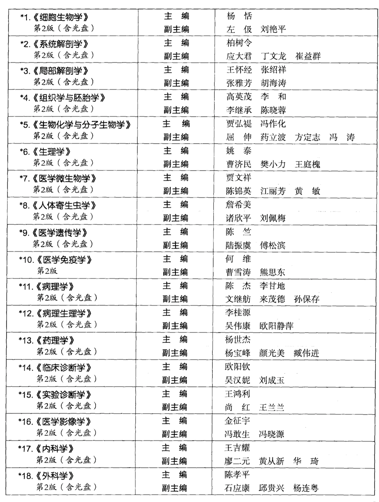

## 二版出版明

全国高等学校八年制临床医学专业规划教材自 2005 年出版以来，得到了教育部、卫生部等主管部门的认可，以及医学院校广大师生的好评。为了进一步满足教学改革与实践不断推进，以及医学科学不断发展的需要，全国高等医药教材建设研究会和卫生部教材办公室在吴阶平、裘法祖、吴孟超、陈灏珠和刘德培院士等的亲切关怀和支持下于 2009 年启动了该套教材第二轮的修订工作。

第二轮修订过程中仍坚持「精品战略，质量第一的原则，从精英教育的特点、医学模式的转变、信息社会的发展、国内外教材的对比等角度出发，在注重「三基、五性」的基础上，从内容到形式都更新、「更深、更精」，为培养高素质、高水平、富有临床实践和科学创新能力的医学博士服务」的编写宗旨，并根据使用过程中的反馈意见与建议，在第一轮的基础上力求做到：学科体系更加完善，增加了《临床流行病学》、《肿瘤学》、《生物信息学》、《实验动物学》《医学科学研究导论》和《医学伦理学》；相关学科的交又与协调更为完善，比如《生物化学》与《医学分子生物学》合并为《生物化学与分子生物学》；内容的选材与框架体系的设计更加注重启发性，强调学生创新能力的培养，并适当给学生留下了思维分析、判断、探索的空间；教材的配套更加健全；装帧设计更为精美。

该套书在修订过程中，得到了广大医学院校的大力支持，作者均来自各学科临床、科研、教学第一线，具有丰富临床、教学、科研和写作经验的优秀专家，作者队伍覆盖了目前国内所有开办临床医学专业八年制及七年制的院校。修订后的第二版仍以全国高等学校临床医学专业八年制及七年制师生为主要目标读者，并可作为研究生、住院医师等相关人员的参考用书。

全套教材共 37 种，其中 36 种于 2010 年 8 月出版，1 种将于 2010 年年底出版。

## 九年制前版序言

五年来，在大家的热情呵护下，我们共同见证了八年制临床医学教材一一这个新生命的诞生与茁壮成长。如今，第二版教材与大家见面，怀纳第一版之精华而不张扬，吞吐众学者之智慧而不狂放，正如医学精英人才所应具备的气质与神韵。在继承中发展，新生才能越发耀眼；切时代之脉搏，思维才能永领潮头。第二版教材已然跨入新的成长阶段，心中唯党欣喜和慰藉。

回想第一版教材面世之后，得到了各方众多好评，这充分说明了：这套教材将生命科学信息化、网络化以及学科高度交叉、渗透的特点融于一身，同时切合了环境一社会ー心理ー工程一生物医学模式的转变，诠释了以人为本、协调发展的战略思想。另外，编委构成的权威性和代表性、内容选择、编排体系、印刷装帧质量等，令广大师生耳目一新，爱不释卷。诚然，第一版教材也并非十全十美，比如有的学科仍以介绍知识为主，启发性不强，对学生难以起到点石成金、抛砖引玉的作用，不利于学生创新思维能力的培养；有的学科、章节之间有重复现象，略显冗余，不够干练。另外，随着学科的进展，部分疾病的临床分类、治疗等内容已略显滞后，亟待最新的研究成果加入其中，充实完善。

鉴此，第一版教材的修订工作便提上日程。此次修订，比当初第一版的编纂过程更为艰辛和严谨，从编者的谨慎遴选到教材内容的反复推敲、字斟句酌，可谓精益求精、力臻完美，经过数轮探讨、分析、总结、归纳、整理，第二版教材终于更富于内涵、更具有生命力地与广大师生们见面了。

注重医学学科内涵的延伸与发展，同时兼顾学科的交又与融合是第二版教材的一大亮点此次修订不仅在第一版的基础上增加了《临床流行病学》、《肿瘤学》、《生物信息学》、《实验动物学》、《医学科学研究导论》和《医学伦理学》，同时还合并了《生物化学》与《医学分子生物学》。通过主编顶层设计，相邻学科主编、副主编协调与磋商，互审编写提纲，以及交叉互宙稿件等措施，相当程度上实现了突出中心、合理交叉、避免简单重复的要求。

强调启发性以及创新意识、创新思维和创新能力的培养是第二版教材的另一大特色。除了坚持「三基」（基础理论、基本知识和基本技能）和「五性」（思想性、科学性、先进性、启发性和适用性），更注重激发学生的思维，让他们成为自己头脑的主人，批判地看待事物，辩证地对待知识，创造性地预见未来。同时，这版教材也特别注重与五年制教材、研究生教材、专科医师培训教材以及参考书的区别与联系。

八年制医学教材的第一版是我国医学教育史上的重要创举，相信修订后的第二版将不负我国医学教育改革的使命和重任，为培养高层次的具有综合素质和发展潜能的医药卫生人才做出更大的贡献。诚然，修订过程虽然力求完美，但纰漏与瑕疵在所难免，冀望各位领导、同道及师生不吝赐教，以便于这套教材能够与时俱进，不断完善。

是为序。

## 前言

全国高等学校 8 年制临床医学专业规划教材《药理学》第 2 版的编写工作，在来自全国 21 所医学院校的药理学专家的大力支持和共同努力下，历经十个月的时间，已顺利完成。

本书在第 1 版的基础上，凝练「三基」（基本理论、基本知识、基本技能）「五性」（先进性、科学性、思想性、适用性、启发性），以高标准及严密的方法，用清晰的逻辑，简练的语言，做到了对药物作用机制、新靶点及新理论再深一点；在新药、药物的新用途及相关安全性方面再新一点，对各篇中的概论及临床应用等更精一些。

对全书进行全面分析研究，整体结构进一步优化，对章、节的设计及内容做了调整。在作用于中枢神经系统的药物一篇中，以附录的形式编入中枢兴奋药，同时将局部麻醉药与全身麻醉药合为章，安排在此篇中；将原第三篇作用于内分泌系统的药物，整体改为第六篇；将原来归类在作用于循环系统及血液系统的药物一篇中的利尿药与脱水药一章列入第五篇作用于内脏系统的药物中；抗病毒药物单设一章；有关抗寄生虫病药物仅设一章；各章未单列药物的用法和用量。书中涉及的药物剂量用法及注意事项等仅供参考，临床用药时务必严格依据药品说明书使用。

在本次改版中，略增加了药理学专业英文词汇，为进一步加强专业英语学习，建议阅读英文原版书和相关英文专著等。为有利于理解和记忆，本书采用选择性套色，如专业术语、概念、药名（中、英文）重点内容、图表的关键部位进行套色印刷。同时在本教材的配套光盘中，编入了重点、难点和练习题，供学习参考。

本书主要的参考书是：

1、杨世杰。药理学，北京：人民卫生出版社。2005；

2、Goodman& Gilman's. The Phamacolocal Basic of Therapeutics, 11th ed. 2006；

3、kazungs. Basic and Clinical Pharmacology. 10th. Ed. 2007；

4、Rang, Dale. Rittan Flower. Pharmacology. 6th.2007；

5、同时还参考了中华人民共和国药典《临床用药须知》（2005）等。

本教材可作为临床医学 7 年制、8 年制教学的教科书，也可作为临床、预防及口腔等医药学专业参考书。本版教材的编写工作，在各参编院校的大力支持下，在各位编委的积极工作、认真负责、鼎力相助下，如期高质量地完成。在此，向特邀撰写麻醉药一章的戴体俊教授表示衷心感谢。

在本书的审稿编辑过程中，吉林大学药理学系的石卓教授、关凤英老师承担了大量具体的编审工作，本专业的各位教师及博、硕士研究生为本书的修稿、校对及编辑等做了许多工作，在此向他们表示感谢。在此付梓之际，深感粗疏之处在所难免，敬请药理学前辈、同行专家及同学们赐教和指正。

杨世杰 杨宝峰 颜光美 臧伟进

2010 年 5 月

