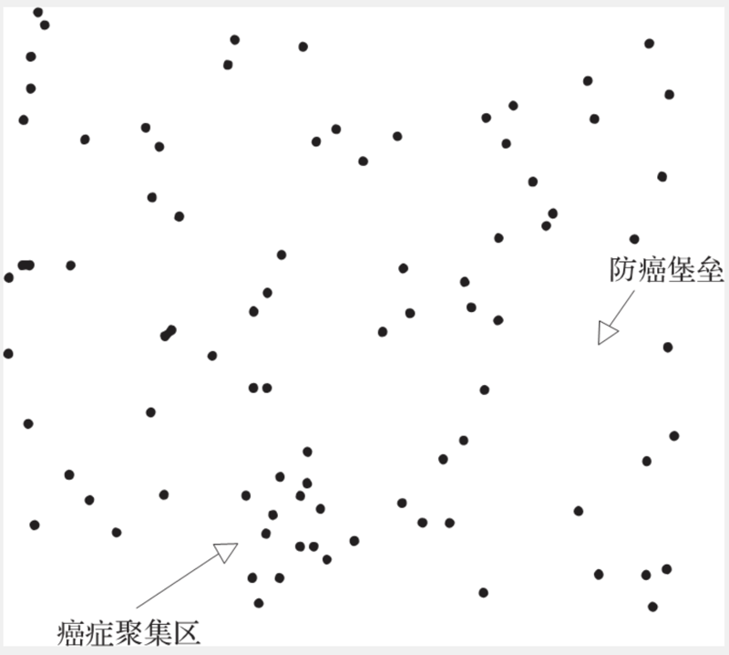

# 1101. 德克萨斯神枪手

奇斯威克是西伦敦一个美丽富饶的郊区，其境内的泰晤士河是著名赛艇比赛的一部分赛道。牛津和剑桥之间具有传奇色彩的年度赛艇比赛将终点设在奇斯威克桥附近。奇斯威克还培养出了小说家 E. M. 福斯特（E. M. Forster）、毕沙罗画家家族、摇滚乐手皮特·汤森（Pete Townshend）、女演员海伦·米伦（Helen Mirren）以及伦敦最大、最古老的啤酒厂 —— 如今以「伦敦之巅」闻名的富勒啤酒厂。

第二次世界大战期间，这个宁静的田园小镇遭到了多枚德国炸弹的袭击，包括 1944 年 9 月 8 日星期五晚 7 点之前毫无预兆的一枚炸弹。斯泰夫利路学校 64 岁的管理员罗伯特·斯塔布斯（Robert Stubbs）一边穿越学校的运动场，一边思考一些杂务以及即将到来的降雨。突然，他被抛到了 6 米以外的草地上。当他站起来的时候，他发现被震飞的不仅仅是他的身体。到处都是残骸和碎石。路旁的许多树木被击倒，甚至被炸成碎片。斯泰夫利路的房屋有着 22 厘米厚的墙壁，但是仍然有 11 幢房屋被毁，还有 27 幢房屋遭到严重破坏，无法居住。一名士兵死在了拜访女友的路上。一个三岁的孩子死在婴儿床上，因为爆炸吸走了她肺部的空气。一名妇女在倒塌的房屋中遇难。还有 17 人在倒塌的房屋中严重受伤。要不是许多人在那个夏天由于担心受到此类袭击而撤离奇斯威克，伤亡人数还会进一步增长。

一位目击者表示，当时的声音听上去就像煤气总管爆炸一样。一位政府官员也表示，这完全有可能是煤气总管爆炸。这种说法成了官方的解释。奇怪的是，奇斯威克爆炸发生 15 秒以后，伦敦另一个地区发生了另一起「煤气总管爆炸」。市民产生了怀疑，并用嘲讽的口气将类似爆炸称为「飞行的煤气管道」。他们的怀疑是有道理的。英国政府最终承认，奇斯威克遭到了从德占荷兰发射的 V-2 火箭的袭击。

V-2 火箭重 8000 磅，飞行速度为每秒 900 米，对地面的冲击相当于 50 辆以每秒 96 公里的速度前进的、重达 100 吨的火车头。落地以后，火箭的弹头发生爆炸，在斯泰夫利路形成了一个 9 米宽、3 米深的弹坑。冲击波为 400 米范围内的一切事物带来了沉重的打击。

在二战最后阶段，德国军队向伦敦发射了数千枚 V-1 和 V-2。V-1 是 7.5 米长的无人飞机，用内部陀螺仪控制飞行路径。这些飞机以每小时 480 公里的速度前进，同时发出嘎嘎声。从德国占领的法国发射场地到伦敦，它们需要飞行大约 30 分钟。飞机搭载了一个小型风车装置。当飞机向伦敦飞行时，这个装置可以根据风车的转动次数估计 V-1 前进的距离。经过预先设置的转动次数以后，V-1 将会朝着地面大角度俯冲下去。

V-2 是最早的远程战斗火箭和最早抵达外层空间的火箭。这种火箭以每小时超过 4800 公里的速度飞行，几分钟就能抵达伦敦。由于 V-2 的飞行速度是音速的 4 倍，而且飞行高度超过 80 公里，因此它们几乎无法用战斗机或高射炮拦截。每枚火箭携带一吨弹头，能够毁掉 400 米范围内的一切事物。

从 1944 年 6 月到 1945 年 3 月，伦敦遭到了 2419 枚 V-1 和 517 枚 V-2 的袭击。V-1 在伦敦上空飞行时会发出「嘟嘟嘟」的单调声音，可以提醒人们炸弹来了。而且，最初的 V-1 存在设计缺陷，向地面俯冲时会关掉发动机。伦敦人知道，当「嘟嘟嘟」的声音停止时，他们就要寻找藏身之处了。同 V-1 相比，V-2 更加可怕，因为它的飞行速度高于音速，而且不会在袭击之前发出提醒。更加怪异的是，在火箭袭击地面以后，人们才会听到火箭俯冲时发出的呼啸之声。呼啸声结束后，人们还会听到上层大气的音爆，仿佛时光出现了逆转。先是巨大的爆炸声，然后是来自天空的、震耳欲聋的呼啸声，然后是呼啸声的起始地点传来的音爆。

在人们星期日做礼拜的时候，一枚 V-1 击中了威灵顿兵营的卫兵教堂。这个教堂是一座雄伟的建筑，拥有加固的屋顶。不过，炸弹仍然炸飞了屋顶，将巨大的建筑劈成两半，导致 119 人丧生，141 人受伤。还有一枚 V-2 击中了伦敦一家沃尔沃斯商店。整个建筑被彻底摧毁，变成了商店地下室里的一堆碎石。168 名购物者丧生，其中一些人死于爆炸的冲击波，一些人死于建筑的倒塌。当炸弹降落在居民区时，整个街区都可能被摧毁。所有袭击导致数万人死伤，数百万住宅、办公室、工厂被毁。平民精神状态受到的影响也许更加严重。不管是去教堂，还是去购物，或是待在家里看电视，哪里都是不安全的。超过一百万人离开伦敦。

虽然 V-1 和 V-2 造成了巨大的破坏，但它们的准确率非常有限。例如，V-1 的风车系统很容易被风干扰，因为风会使风车加速或者减速。德国人将 V-1 对准伦敦塔桥，但是只要 V-1 降落在伦敦范围内，他们就会感到满意。实际上，数百枚飞弹落在了田野和海洋里，没有造成任何破坏。

不过，许多伦敦人相信，德国人对准了某些街区。一些区域似乎存在炸弹聚集现象，另一些区域则很少被炸弹袭击。这意味着德国人瞄准了一些街区，避开了另一些街区。在寻找这些数据聚集现象的原因时，一些人提出，德国间谍可能生活在德国人没有轰炸的区域。他们轻率地认为，如果存在某种模式，那么它一定拥有某种原因。实际上，这是不一定的。

即使是随机数据，也会出现聚集现象。我将一枚 25 美分硬币抛了 10 次，下面是我得到的结果：

```
背面 正面 正面 背面 背面 正面 正面 正面 正面 正面
```

在这个小实验的后半段，5 个正面聚集在了一起。发生了什么事情？我是否改变了我所面对的方向，或者坐在了另一把椅子上？不。没有发生任何特别或不同寻常的事情。当我们看到数据聚集时，我们自然而然地认为发生了某种特别的事情 —— 这些正面（或背面）成串出现是有原因的。实际上，这是没有原因的。即使是完全随机的抛硬币实验，也会出现数据的聚集。如果你不相信，你可以抛十次硬币。即使每次抛掷是完全随机的，你也有 47% 的概率得到至少四个连续正面或连续背面。

随机投掷的炸弹落点也是同样的道理。一些区域会出现炸弹的聚集，另一些区域不会出现炸弹，这是无法避免的事情。英国统计学家 R. D. 克拉克（R. D. Clarke）对南伦敦一个区域的数据进行了分析，这个区域受到了 537 枚炸弹的袭击。他将这个区域分成 576 个一平方公里的正方形，然后统计落在每个正方形里的炸弹数量。接着，他将炸弹分布与 537 枚炸弹随机降落在南伦敦时的分布期望进行了比较。表 11.1 显示了他的发现。

表 11.1 随机降落的炸弹

| 正方形里的炸弹数量 | 正方形里的预期数量 | 正方形里的实际数量 |
| --- | --- | --- |
| 0 | 227 | 229 |
| 1 | 211 | 211 |
| 2 | 98 | 93 |
| 3 | 31 | 35 |
| 4 | 7 | 7 |
| 5 及以上 | 2 | 1 |
| 总计 | 576 | 576 |

1-3『

数据基本符合泊松分布。在「刘嘉的概率论」专栏里「0305泊松分布：打开统计推断的大门」，最后的思考题：二战时德军轰炸伦敦，如果你是一个数学家，怎么通过分析炸弹落点判断德军是有针对性的轰炸，还是完全没有情报的随机轰炸呢？

这里的数据正好完美给其做数据案例，算了下基本符合，是随机分布的。个人目前感觉刘嘉是看了这本书的案例，想到的课后思考题。

我们把问题再抽象一下，这一类问题其实是 —— 当我们知道了一个随机事件发生的整体概率，也知道这个随机事件发生的概率符合正态分布之后，那么在某一段时间或者空间间隔内，这个随机事件发生的次数的概率分布是什么呢？再说一遍，不是求解整体发生率，而是求发生次数的概率。概率学家已经有了工具来对付这种问题，这个工具就是泊松分布。为什么是这个怪怪的名字呢？因为这个分布是大数学家泊松发现的，所以叫泊松分布。

我们先来看看泊松分布的公式 —— 

```
P(X=k) = (λ^k/k!)e^(-λ)
```

其中，e 为已知数学常量，k 为事件发生次数，λ 为单位时间内事件的平均发生次数。

对数学语言不熟悉的同学见到这个公式，会本能地心生厌恶，至少是拒绝的。其实，如果搞一个最美数学公式排行榜，泊松分布公式肯定能进前十名。当然，理解数学公式的美，和理解现代艺术的美一样，都需要一点背景知识。泊松分布的公式用语言表达就是：随机事件发生 k 次的概率，等于 lambda 的 k 次方除以 k 的阶乘，再乘以自然底数 e 的负 lambda 次方。

是不是已经晕了？不要着急，多看看上面的公式你就有感觉了。重点是要理解这个公式背后的思想。这里只有 3 个字母 —— 1）自然底数 e：这是数学常量，是已知的；2）k：就是随机事件发生的次数。在大暴雨的案例中，k 可以是 1 次大暴雨、2 次大暴雨、3 次大暴雨等等。3）lambda：是整体概率与要求解问题匹配之后对应的数值，这个数值是跟我们的问题联动变化的。在大暴雨的案例中，整体概率是 50 年 1 次，也就是 1/50。如果我们想知道接下来 50 年这个时间段暴雨次数的概率分布，那 lambda 就是 1。如果想知道 100 年，那 lambda 就是 1/50 乘以 100，相应的就变成了 2。要是想知道 5 年呢？1/50 乘以 5，这个数值就是 0.1。

就按「接下来 50 年」来计算吧，这时候 lambda 取值为 1。

K = 0，就是接下来的 50 年，1 次大暴雨都不发生的概率是多少？代入公式一算，答案是 37%。

K = 1，就是接下来的 50 年，发生 1 次大暴雨的概率是多少？代入公式一算，答案也是 37%。

K = 2，就是接下来的 50 年，发生 2 次大暴雨的概率。代入公式一算，答案是 18%。

其实，我们更关心的是，接下来 50 年发生 2 次和 2 次以上「五十年一遇」的大暴雨的概率是多少。就是用 1 减去发生 0 次的概率和发生 1 次的概率，1 减去 37%，再减去 37%，答案是 26%。也就是说，在「五十年一遇」的整体概率下，在接下来 50 年里发生 2 次或 2 次以上大暴雨的概率是 26%。所以在比较短的时间内发生 2 次这种「五十年一遇」的大暴雨，可能并不是什么小概率事件。仅仅用 2 次大暴雨就否认市政部门的解释，是证据不足的。

作者回复：简单的说，德军轰炸了 100 次，每次轰炸一个区域。我观测到的现象是有些地方被轰炸了好几次，有些地方没有被轰炸到。我想看看德军是不是有些轰炸是有目的的轰炸，还是整体都是随机的。那么把伦敦分为 100 个区域（平均分格子），那么每个格子被轰炸到的概率就是 1/100，这时候统计被轰炸 1 次，被轰炸 2 次或者多次的区域的个数，看看是不是符合泊松分布，也就是看看没被轰炸到的格子是不是大概 37 个，轰炸到 1 次的格子是不是 37 个，轰炸到 2 次的格子是不是 18 个，等等，如果基本符合泊松分布，那就代表这个区域所有的格子大体上保持着随机性，轰炸就是一个随机的过程，没有特别的「重点目标」。

如果你发现被轰炸到 1 次、2 次、3 次等等的格子的数量异常的少或者异常的多，不服从泊松分布，那就说明有些区域是重点区域，那些被轰炸两三次的目标也许就是德军获知情报的目标。真实计算的时候，划分区域格子的大小、和平均一次空袭轰炸的范围有关系，一个格子要能覆盖一次空袭的范围，然后根据空袭规模大小做一些加权的处理，然后就可以了。

』

如果炸弹是随机降落的，预计将会有 227 个正方形不会受到炸弹袭击。实际上，229 个正方形躲过了攻击。类似地，我们预计 211 个正方形拥有一枚炸弹；实际上，221 个正方形拥有一枚炸弹。总体而言，观测到的分布与随机轰炸的预期结果非常类似。在随机轰炸的情况下，实际差异和观测到的差异一样大甚至更大的可能性是 95%。这些观测到的炸弹聚集绝对没有任何意义。它们与炸弹随机降落时的预期相符。即使是完全随机的数据也会出现数据聚集现象，因此我们没有必要根据这种现象徒劳地寻找异想天开的解释。遗憾的是，人们很难抗拒「每一种模式一定有原因」这一想法的诱惑。

### 11.1 癌症聚集恐慌

20 世纪 70 年代，失业的流行病学家南希·韦特海默（Nancy Wertheimer）开车在丹佛市穿行，寻找 19 岁之前死于癌症的人生活过的家庭。她在寻找这些家庭的某种共同点 —— 尽管她并不知道这种共同点是什么。她发现，许多癌症受害者的家庭靠近大型输电线。她的生活伴侣、物理学家埃德·利珀（Ed Leeper）带着她开车在丹佛市穿行，测量每个家庭与不同类型的电线和变压器之间的距离，并对电磁场的强度做出假设，以估计电磁场（EMF）的辐射量。他们对没有儿童癌症受害者的丹佛家庭样本进行了同样的估计。他们承认，他们并不了解输电线可能导致癌症的原因，但他们仍然总结说，生活在大型输电线附近的孩子患癌的风险将提高一到两倍。

他们发表的报告以及一些可怕的故事引发了全国范围的恐慌。一个自杀的人曾经生活在输电线附近。一些不再下蛋的母鸡生活在输电线附近。一个名叫保罗·布罗德（Paul Brodeur）的新闻工作者在《纽约客》上撰写了三篇文章，指出康涅狄格州吉尔福德市一个发电厂附近的居民之中出现了异常众多的癌症病例，加州弗雷斯诺市输电线附近一所小学的员工也出现了 15 个癌症病例。布罗德将这些文章做了些许修改，放在了一本书中，书名是《输电线大揭秘：公用事业公司和政府如何试图隐瞒电磁场带来的癌症风险》。他提出了不祥的警告：「由于暴露在输电线磁场之中，数千名毫不知情的儿童和成人将受到癌症的袭击，其中许多人将毫无必要地夭折。」

随之而来的全民疯狂为咨询师、研究员、律师和小型设备制造商带来了利润丰厚的业务，包括制造允许人们在家里测量电磁场的高斯计（电磁场读数较高的房间将被仅仅用于存储物资）。

和前面一样，问题在于，即使是随机数据，也可能存在聚集现象。即使癌症在人群中的分布是随机的，癌症受害者也存在地理聚集的可能性。为了说明这一点，我设计了一座虚拟城市，城市里的一万名居民生活在间隔均匀的住宅里，每个人有 1% 的患癌可能性。（我忽略了人们生活在家庭里以及癌症与年龄有关的事实。）我通过计算机模拟抛硬币的方式决定癌症受害者在这座虚拟城市里的分布。图 11.1 显示了我所得到的癌症地图。白色区域没有癌症受害者。

2『即使是随机数据，也可能存在聚集现象，这是「德克萨斯神枪手」谬误的一种形式。前面炸弹随机轰炸的数据同样也是有聚集现象的。做一张主题卡片。（2021-02-14）』

地图下方显然存在一个癌症聚集区。如果这是真实的城市，那么当我们开车在这些人居住的街区行驶时，我们一定能够找到某种特别的东西。也许，城市的少年棒球联合会球场坐落在附近。现在，如果我们将这些球场附近的居民患癌率与远离球场的居民患癌率进行比较，你觉得会有什么结果？球场附近将拥有更高的患癌率，这说明生活在少年棒球联合会球场附近会导致癌症。拆掉这些球场！

图 11.1 还显示了一个防癌堡垒，即无人患癌的一个城市区域。如果我们在这个没有癌症的街区行驶，我们一定会找到某种不同寻常的事物。也许，城市的水塔坐落在附近。现在，如果我们将水塔附近的居民患癌率与远离水塔的居民患癌率进行比较，水塔附近的患癌率当然会更低一些。这就是我们一开始在这片街区进行寻找的原因 —— 这里没有人患癌。



图 11.1 癌症地图

我们对少年棒球联合会球场附近和水塔附近的推理存在同样的问题。如果我们根据数据编造理论（少年棒球联合会球场导致癌症，水塔预防癌症），那么这些数据当然会支持这种理论！它怎么会不支持呢？我们会编造出一种与数据不符的理论吗？当然不会。根据创建理论时使用的数据来检验这种理论的做法是不公平的。我们需要新的数据。在新数据面前，这种理论也应当成立。

有时，数据聚集的确非常重要。1976 年夏天，在由一群退伍军人组成的宾州美国军团的年度会议上，一种神秘肺病袭击了 182 人，并导致 29 人死亡。经过大量侦察工作，科学家发现了导致这些人患上肺炎（现在叫做军团病）的，由空气传播的细菌。这些科学家还发现了比疾病最初爆发时使用的抗生素更加有效的抗生素。

对于军团病，人们根据数据聚集得到一种理论，并用新数据对其进行检验。如果没有理论和新数据，我们所拥有的仅仅是数据聚集而已。韦特海默和利珀发现的癌症受害者聚集是「德克萨斯神枪手」谬误的一种形式。在最初的版本中，一个没有射击技能的人用一把枪向谷仓的一面墙射出大量子弹，然后在弹孔最多的位置画上靶心。即使癌症的地理分布是完全随机的，也会出现巧合性的聚集 —— 就像 100 次随机射击的弹孔会出现随机聚集一样。要想进行有效的统计检验，研究人员应当首先画出靶子，然后发射子弹 —— 首先论证输电线可能导致癌症的原因，然后比较有输电线和没有输电线的街区发生癌症的频率。

1-2『这里的「德克萨斯神枪手」谬误，先「射击」再「画靶子」。算是解答了自己之前迷惑很久的难题。为啥一些科学研究符合零假设检验（P 值小于 5%），还是不靠谱。那些 Paper 完全是先做大量实验（先射击），再从这些实验里挑选对自己有用的数据样本（再画靶子）。这里的信息补充进主题卡片「即使是随机数据，也可能存在聚集现象」。（2021-02-14）』

韦特海默和利珀这项研究的另一个问题是，他们对电磁场辐射量的估计可能会受到他们对研究结果预期的影响。有偏估计很容易将非常小的风险率提高一两倍。要想进行科学的研究，应当让中立的观测者在不知道哪些住宅有癌症受害者、哪些住宅没有癌症受害者的情况下对电磁场的辐射量进行估计。

在韦特海默和利珀的报告发表以后，玛丽亚·费克廷（Maria Fey-chting）和安德斯·阿尔鲍姆（Anders Ahlbom）开展了一项更加严格的输电线电磁场研究，他们找出了生活在高压输电线 300 米范围内的瑞典家庭。他们不是估测电磁场辐射量，而是使用详细的瑞典公用设施记录计算这些人 25 年来每年接受的电磁场辐射。经过对数据的细致分析，费克廷和阿尔鲍姆的结论是，接受辐射量最大的孩子患上儿童白血病的可能性是没有受到辐射的孩子的 4 倍。

费克廷和阿尔鲍姆的研究体现了另一种形式的德克萨斯神枪手谬误。冒牌神枪手不是先射击，再在最密集的区域画上靶心，而是向许多目标射出许多子弹。然后，他找到自己所击中的一个目标，用油灰盖住其他弹孔，然后刷掉一切痕迹，只留下他所击中的目标。

费克廷和阿尔鲍姆的研究考虑了多种癌症、多个年龄群体、多种电磁场衡量标准以及划分「无辐射」「轻度辐射」「中度辐射」和「重度辐射」的多个阈值，从而创造出了数百个目标。他们计算了将近 800 种风险率，然后选择了儿童白血病。如果输电线完全是良性的，那么一些风险率将仅仅由于运气不佳而高于其他风险率。其他一些风险率将远低于平均水平。费克廷和阿尔鲍姆自然会选择报告最高的风险率，不去提及其他风险率。他们掩盖了没有命中的目标。

这种神枪手谬误形式也叫费曼陷阱，是以诺贝尔奖获得者理查德·费曼（Richard Feynman）的名字命名的。我们将在 13 章再次提到他。费曼请加州理工学院的学生计算他在走出教室时在停车场里看到的第一辆车拥有某个特定牌照（比如 8NSR261）的概率。加州理工学院的学生非常聪明，他们假设牌照中的每个数字和字母是相互独立的，然后迅速计算出了 8NSR261 的概率。他们的答案是 1.76 亿分之一。当他们得到答案时，费曼说，正确的概率是 1，因为他刚才在路上看到了这个牌照。如果某件可能性极低的事情已经发生，那么它就不再是小概率事件了。

不过，研究人员一直在做同样的事情。在考察数据之后预测数据的形式是很容易的，也是没有意义的。在我们的输电线例子中，在观测儿童白血病以后预测儿童白血病的做法是没有说服力的。当人们根据数据发明某种理论时，如果这种理论没有合理的基础，没有得到新数据的检验，那么这种证据是无法令人信服的。神枪手应当仅仅画出一个目标，而且应当在开枪之前而不是之后画出这个目标。

输电线理论是否拥有任何依据？科学家对电磁场非常了解，但是没有任何合理的理论能够证明输电线电磁场会导致癌症。这种电磁场的能量远远低于月光的能量，其磁场能量比地磁场还要弱。此外，费克廷和阿尔鲍姆在癌症得到诊断的那一年发现了癌症与儿童电磁场辐射量之间的相关性，但他们没有发现诊断一年前、五年前或者十年前癌症与儿童电磁场辐射量之间的相关性，尽管癌症症状的出现通常需要几年时间。最后，如果输电线电磁场与癌症之间存在联系，那么受到更高剂量辐射的人应当拥有更高的风险率，这与事实不符。他们自己的数据与他们的理论相矛盾。

这项瑞典研究得到新数据的证实了吗？没有。例如，覆盖英格兰、苏格兰和威尔士儿童的《英国儿童癌症研究》发现，接受电磁场辐射量较多的儿童患上白血病或其他癌症的可能性要小一些，尽管这种差异的观测值不具有统计说服力。此外，在这项瑞典研究公开后，人们对啮齿动物进行了一些实验研究，发现比输电线生成的电磁场大得多的电磁场对死亡率、癌症发病率、免疫系统、繁殖力和出生异常没有影响。

在权衡理论观点和经验性证据之后，美国国家科学院认为输电线不是一种公共健康威胁，没有必要资助进一步的研究，更不要说拆除输电线了。美国的一份顶级医学期刊同意这种观点，认为我们应当停止将研究资源浪费在这个问题上。就连瑞典那项研究的一位共同作者也做出了让步，认为没有必要进行进一步的研究，除非某种理论能够解释电磁场导致癌症的原因。

1999 年，《纽约客》发表了一篇题为《癌症聚集的迷思》的文章，含蓄地批判了保罗·布罗之前撰写的文章。

### 如何轻松识破一本正经地胡说八道

数据聚集现象无处不在，甚至存在于随机数据之中。想要寻找某种解释的人一定会找到一种解释。不过，某种理论与数据聚集现象相符并不是一种具有说服力的证据。人们发现的解释需要言之有理，而且需要得到新数据的检验。类似地，向足够多的目标发射足够多的子弹的人一定会击中某个目标。对数百种理论进行检验的人一定会发现至少支持一种理论的证据。这种证据不具有说服力，除非理论是合理的，而且能够得到新数据的证实。

如果你听到某些数据支持某种理论，那么在你相信之前，请回答两个问题。首先，这种理论是否合理？如果不合理，不要轻易相信胡言乱语是合乎情理的。其次，房子里是否存在一位德克萨斯神枪手？宣传这种理论的人在提出理论之前是否查看了数据？他是否在选定他所宣传的理论之前对数百种理论进行了检验？如果你看到了冒烟的枪口，不要急于做出判断，应当等待这种理论接受其他数据的检验。