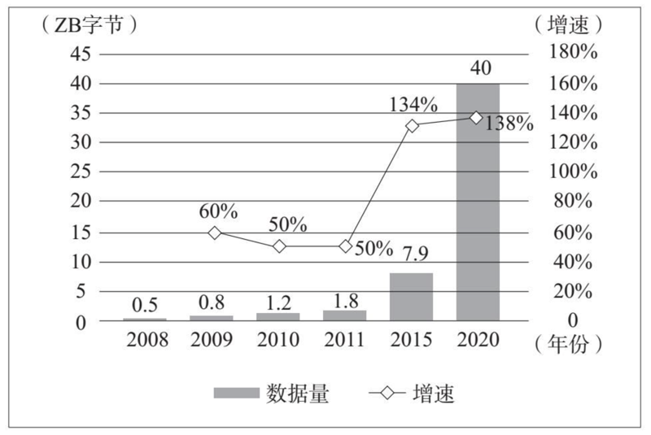
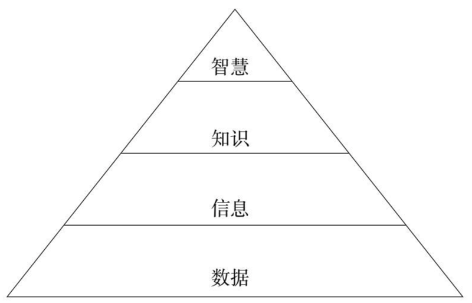

# 0101. AI 思维是时代机遇

理论上…… 假如有这么一台计算机，能存储世界上所有的事实，同时拥有完美的程序，能以数学方式表达世界所有不同部分之间的所有关系，我们就能完美地预见未来。

—《原则》—

人工智能的概念自 1956 年的达特茅斯会议诞生至今，曾经受到万众瞩目，也曾陷入低谷，黯淡无光。互联网、虚拟现实、增强现实、区块链等新技术如雨后春笋般不断涌现，但千帆过尽，人工智能仍然安如磐石，屹立不倒。2016 年人工智能机器人 AlphaGo 战胜韩国九段围棋国手李世石之后，人工智能强势进入大众视野。近年来，中、美、英、俄等越来越多的国家将人工智能的发展上升到国家发展战略和规划，各行各业也都想利用人工智能抢占先机、推陈出新，而普通人的生活也因为人工智能的点缀而愈加便捷和丰富，把不可能变成可能。

万物皆可人工智能的时代已经到来，如果不想淹没在来势汹涌的人工智能浪潮里，墨守成规、故步自封显然是行不通的，只能拥抱未来，提升认知，获得助力。但是，你真的了解人工智能吗？你知道人工智能是如何与商业碰撞迸发出火花的吗？你知道人工智能如何从数据中产生价值的吗？理解事物，就要抓住其核心理念。AI 思维就是人工智能的核心理念。那么首先，我们要从「道」的层面理解 AI 思维内在逻辑和价值，从 AI 思维的角度，理解人工智能。

## 1.1 大赚 1 000 亿美元的秘密

如果你读过《从 0 到 1》这本书，应该对 PayPal 这个公司有所了解 —— 硅谷创投教父、PayPal 创始人彼得·蒂尔便是这本书的作者。另外，PayPal 黑帮（PayPal Mafi a）的说法也由来已久。2002 年的时候，eBay（亿贝）以 15 亿美元的价格收购了 PayPal，当时 PayPal 公司的许多重要员工纷纷选择创业，自立门户。PayPal 也因此成为硅谷史上创业者群体最多的一家公司，这些人被称为 PayPal 黑帮。黑帮成员们创建了领英（LinkedIn）、YouTube（优兔）、Yelp（美国最大点评网站）、Space X（太空探索技术公司）和特斯拉（Tesla）等多家大名鼎鼎的公司，有着十分强大的社会影响力。

PayPal 是美国一家提供在线支付服务的公司。马云当年受 PayPal 的启发，创立了支付宝。PayPal 近几年市值的增幅非常显著，远高于同期纽交所和纳斯达克的增幅。PayPal 公司 2015 年的市值接近 400 亿美元，到 2019 年上半年市值增加至 3 倍多，已经快 1 300 亿美元了 —— 这个体量的市值，在美股互联网公司里位居前十。

PayPal 能如此快速发展起来，很大程度上是得益于人工智能系统提供的强大动力。我在 2012 年初加入 PayPal 公司，负责建立了 PayPal 全球数据科学平台。当时 PayPal 对数据的加工和利用还相对比较滞后，不能跟谷歌这样的搜索引擎公司相提并论。值得庆幸的是，在 2012 年，PayPal 公司把营销、广告、数字化方向的人工智能团队收拢在一起，整合构建了在硅谷都颇有影响力的 PayPal 数据科学部。而后，数据科学部经过数年的努力，在 PayPal 用户端内容的个性化呈现、为商家定制的「千人千面」广告推荐，以及在核心产品体验的提升上，全都通过人工智能进行了系统性的升级改造。

当时，虽然 PayPal 在全世界大多数国家和地区都有用户，可最大的市场还是在美国，但是美国国内的用户数已经非常饱和，短时间内无法再有太大的增量。既然开发新用户的难度很大，PayPal 决定另辟蹊径，那就是增加每位用户的交易额。为了增加用户的交易额，PayPal 数据科学部的任务就是为 PayPal 所有的用户精准推荐商家和商品。

理想情况下，PayPal 想知道用户在每一个时间点可能会有哪些需求：比如为了周五晚上聚会，你打算到日用品网站购买些派对用品；或者周日中午，你会想去餐厅吃一顿大餐。有了关于这些需求的预测后，通过定向推荐全渠道精准的广告，PayPal 可以把消费者和最能打动他们的产品或服务连接在一起，从而提高每位用户的消费金额，实现巨大的增量商业价值。

知易行难，PayPal 用了两年多的时间，才成功地建立了自己的人工智能平台。这个平台主要由消费者动机预测引擎、精准推荐引擎以及优化客户生命周期的最佳行动引擎构成，而这几个引擎均部署在大数据平台之上，跟海量的底层数据衔接，面对动态的业务需求能够自动地构建解决方案。

其中，动机预测引擎通过人工智能，预测用户在某一个时间点的行为，包括点击广告、兑现优惠券、购买商品等；精准推荐引擎连接用户和他可能感兴趣的商家或商品，做出恰当的推荐；最佳行动引擎则通过人工智能优化在每一个时间点，商家采用什么样的策略，能够最有效地提升用户的价值。三个引擎相互结合，就有了精准理解消费者行为的能力，就像找到打开宝库的「芝麻开门」，把最恰当的商品和商家服务送到消费者面前。

人工智能平台为 PayPal 带来了成倍的交易增长速度。通过人工智能的精准预测、推荐和优化，PayPal 的营销活动平均响应率提升了 2-3 倍，部分营销活动的点击率和兑现率超过 5 倍，总体投资回报率（ROI）也得到大幅提升，对公司基本面产生很大的影响。但是，通常来说，人工智能对公司的影响并不一定立刻体现，而是随着时间的推移，逐步释放出来。当人工智能平台已经有一定的规模以后，所带来的业务加速的增量会变得更大。2014 年底，PayPal 实现了 19.4 亿美元的利润，比 2012 年底提升了近 30%；2015 年的利润甚至超过了母公司 eBay。随后 PayPal 从 eBay 剥离，单独上市，至今市值已经增长了数倍。

2018 年我接受第一财经的采访，发表过一篇访谈文章《最好的数据科学家，就是把自己给「干掉」》。为什么数据科学家要把自己「干掉」呢？人工智能提升业绩依赖的主要是平台，而不是仅仅靠几位优秀的数据科学家。当然，搭建一个平台需要专业而尽职的团队，但是落地投产以后，优秀的人工智能平台可以独立运行，而不再依赖于某位数据科学家本身。换句话说，人工智能平台就像给机械化的工厂装上了一个「大脑」，在保持高生产效率的情况下，还能千人千面地提供个性化的产品服务，这就是人工智能平台化的魅力所在，也是数据科学家被「干掉」的原因所在。如果一个企业已经形成了人工智能平台化的运营方式 —— 正如 PayPal 对用户的人工智能精准推荐体系，可以实时对全球的三亿用户进行智能推荐，这套体系是可以持续发挥价值的，并且随着时间的推移，用户的黏性越来越强，数据的积累越来越多，这个价值会释放得更加厉害。

2-3『

[最好的数据科学家，就是把自己给「干掉」 | 数据科学 50 人·丁磊](https://www.yicai.com/news/5433619.html)

消化吸收作为本书的附件，「附件0101最好的数据科学家就是把自己给干掉.md」。（2021-02-20）

』——已完成

现今很多人使用的今日头条、抖音也有内容推荐系统，它们推荐的内容确实是有黏性的。随着用户的使用，积累和沉淀的数据越来越多，平台内容的推荐也就越来越精准，这样就会赢得更多用户的青睐。所以，在以人工智能为核心的智能经济里，只要在恰当的方向上建立了相应的人工智能平台和体系，人工智能就会通过不断的学习形成正向的反馈。正向反馈对应的是业绩更加快速的增长，最终形成一个极具规模的叠加效应，而不是简单的线性增长。这样的叠加效应，依赖于人工智能平台本身的演化，并随着时间的推移产出更多的增量价值。

### 1.1.1 利己也利竞争对手

亿客行是全球最大的在线旅游公司之一，业务遍及全球，2007 年通过与艺龙的合作正式进入中国市场。在人工智能的支持下，亿客行在广告变现领域满载而归。2010 年时，亿客行的广告营收在 1 亿美元左右，这个数字对于行业巨头来说不是特别大。2011 年，我帮亿客行开发了一套人工智能系统。这套系统上线以后，亿客行的广告营收获得了大幅度的提升。在这个过程中，亿客行坚持了一件事情：通过人工智能系统预测用户在网站上产生购买行为的概率，也就是预测一个访客在网站上转化为交易用户的概率。

人工智能具体预测什么事情呢？如果用户打开亿客行网站或者在手机 App（应用程序）上搜索一个行程，比如从北京到洛杉矶的航班，亿客行的人工智能系统可以实时地预测这个用户的真正行为目标和意图。系统在用户点击「搜索」按钮的这一瞬间触发几百个用户相关的行为数据维度的分析，非常迅速地产出预测结果，通常在几十毫秒内完成。如果这个用户真正要购票的话，人工智能不会给你弹出广告，免得打扰用户，干扰即将发生的交易；如果用户只是试探性查询，只是想要对比下不同网站的购票价格，人工智能就会给用户弹出竞争性的广告。

什么是竞争性的广告呢？这些广告主本身并没有入驻亿客行，所以这些竞争性广告相当于是从站外引入的。正因为这些站外商家和本网站主营内容相似，对于想要比价或者试探性查询的客户来说，这类广告是具有高意向性的广告，广告的点击率远高于平均水平，所以这类竞争性广告的卖价比一般的展示性广告，也就是我们经常在网站页面上看到的横幅广告也要高很多。这个模式成立的关键点在于，亿客行通过人工智能预测引擎，可以很准确地预测出来亿客行网站的某个访客是真正来购票的，还是只是来亿客行对比下价格，对比完就离开，到别的网站去买票的。

这个预测引擎搭建完成以后，它的直接效果是把大量不购买的网站流量做了广告的变现。有统计数据表明，这类不购买的用户占了总访客数的 97%。用户既然来网站只是看看，并不购买，那么，网站给用户推荐一个相关类型广告，用户只要点击了广告，广告主就会给网站付费。同时，预测引擎也做到了完备的风险控制，否则如果用户真来网站上购买产品，而网站给用户推荐了竞争性的广告，对网站来说就会造成亏损。

用户如果真的打算去国外游玩，在亿客行上搜游玩行程，多半看不到这种竞争性广告，因为亿客行的广告策略不允许降低网站本身的交易额。但是如果用户只是搜着玩儿，或者看完价格以后要到别的旅游网站或者航空公司去购票，用户多半会看到这类竞争性的广告，而用户的每次广告点击都会给亿客行带来收入。

亿客行的人工智能系统能够预测出来哪些人会购买，哪些人不会买，从而做到精准的广告推荐，这样既增加了额外的广告收益，又控制了潜在的对网站本身交易的风险。由于人工智能对每位访客的意图做出了准确的预测，这套人工智能广告系统在 2011 年上线之后，亿客行的广告营收稳步增长，到 2018 年已经超过 10 亿美元。

亿客行部署的人工智能预测引擎，是人工智能商业化一个早期的实践，后来这个系统的延伸版用在更多的在线交易场景下，也被美国风险投资商经纬创投、红点创投等国际知名风投公司所追捧。通过人工智能的精准预测，网站实时了解到用户的真正意图，把更恰当的内容呈现给用户，从而做到网站经营者、广告主和用户的多方共赢。

### 1.1.2 BAT 做金融的秘密武器

人工智能在金融领域中也大有可为。举一个例子，假如一个人刚踏入社会，参加工作时间很短，每个月收入不高。如果他去银行申请贷款，会得到什么样的答复呢？因为收入太低，银行没有很多流水记录，贷款申请会被拒绝，这很可能是当前银行基于现有数据做出的决定。

但是，让我们换一个视角来看，同样是这个人，在大数据的棱镜下，他经常参加网络课程和社会福利活动，爱好音乐和阅读，喜欢软件开发的交流。如果给这么一个人审批，作为金融机构的审批人员，会不会批准他的申请呢？在这种视角下，金融机构很有可能会给他提供一些信贷服务，因为他的兴趣爱好广泛，行为健康向上。虽然在金融领域没有强大的数据支持，但是他在社交和专业活动等方面正面且稳定的行为，可以作为金融机构审批信贷的参照依据。金融行业审批贷款的趋势是使用更多种类的非金融属性数据，通过人工智能来解读这些数据，使其能预测一个人的信用和风险水平，从而服务金融机构的风险控制需求。

如何通过人工智能深度分析大数据并在金融场景下使用，是一批想进入金融领域的互联网公司面临的问题。在阿里和腾讯都投身金融业务之后，百度在 2015 年才姗姗来迟，正式开发金融业务。当时百度的金融业务并不被业界所看好，一个很重要的原因是，虽然百度有很多关于互联网用户的行为数据，却不像消费数据那样与金融有强相关性，怎样通过这些看似与金融无关的数据去开展金融业务，是百度进入金融行业时亟须解决的一大难题。百度想到的是，通过人工智能将二者联系起来。

2016 年初，百度高层找到我，希望我帮助百度在信贷场景用好人工智能。也就是说，通过人工智能去精准预测用户在金融上的表现。所谓金融上的表现，通俗来讲，就是一个用户借了钱后有多大的可能性会逾期不还。如果用户还钱概率很高，那么这个信贷业务就能够赚钱。但是如果逾期不还的人数较多，那这个业务就肯定要赔。我需要帮助百度解决的问题，就是用人工智能预测用户借款后会不会按时还钱。

举一个具体例子，如果某位小企业主的公司出现了经营问题，他想找金融机构申请一笔个人贷款，那这笔贷款对金融机构来说风险很高，因为他很可能逾期不还。通过借款人的行为数据可以分析得知，贷款是大概率用作个人的流转，还是要用作企业经营。这是两类不同类型的借款，借款人如果打着个人借款的幌子去填企业的坑，对金融机构来说风险相当高。在这种场景下，人工智能通过对大量行为数据和金融表现数据的分析，可以得出相应的结论，因而对这些人来说，如果他们来申请个人贷款，金融机构就应该拒贷，不把钱借给他。此外，还有很多在金融上有重要意义的数据，例如，借款人是一个日常生活稳定的人，还是一个居无定所的人。通过人工智能的深度分析，借款人的不同行为在金融上都对应了不同的逾期和风险概率，这些概率成为金融决策规则的一部分，帮助金融机构更安全地提供信贷服务，同时扩大放贷规模。虽然人工智能做出的预测不可能百分之百地准确，但是我们已经可以实现非常高的准确率，这对金融业务的开展仍然有相当大的帮助。

当时我估算过，风险控制上的预测准确率每提升 1 个点，带来的增额收入接近 1 亿元。基于这样一个人工智能风险管理体系，在控制风险的情况下，把流量逐渐打开用于金融业务，度小满金融（原百度金融）与金融机构合作的资产规模不断增长，在一年左右的时间里累计发放贷款超过 3 800 亿元，为 50 多家银行合作伙伴创造了近 100 亿的利息收入，真正让人工智能赚钱，且风险可控。

BAT 即百度、阿里巴巴、腾讯。

### 1.1.3 传统金融机构的人工智能转型

人工智能的一个重要意义在于它能帮助各行各业转型升级。例如对于银行而言，如何能够低成本精准获客是一大痛点。截至 2018 年末，我国商业银行机构数量已经达到了 4 000 家以上，其中国有大型商业银行 5 家、邮储银行 1 家、股份制商业银行 12 家、城市商业银行 134 家、住房储蓄银行 1 家、民营银行 17 家、农村商业银行 1 262 家、农村合作银行 33 家、农村信用社 965 家、村镇银行 1 562 家、外资法人银行 39 家，银行间的同业竞争十分激烈。而互联网金融公司的兴起无疑更增加了银行拓展客户与业务增长的难度。互联网金融平台以效率高、体验好吸引客户，银行如果止步不前，不注重提高用户体验，由此造成的客户流失可能会越来越明显。

另一方面，随着商业银行不良贷款率的居高不下，信用卡业务、贷款业务的风险控制也成为银行关注重点。根据银保监会发布的银行业主要监管指标数据，2019 年一季度末，商业银行不良贷款余额 2.16 万亿元，较上年末增加 957 亿元，不良贷款率为 1.80%。随着银行业务扩张、客户下沉，客户的金融属性越发稀疏，贷款业务的风险控制也成为痛点。

2018 年，我参与领导了百度与中国农业银行的「金融大脑」项目，在客户画像、精准营销、信用评价、风险监控、智能投顾和智能客服等方面为农业银行提供人工智能服务，从营销、风控到运营、决策，全领域为农业银行的智能化转型赋能。

金融大脑平台是农业银行的核心人工智能系统，以它为核心的人工智能金融平台解决方案，为农业银行打造了全领域的人工智能能力体系，这在业内是首举。金融大脑平台包括感知引擎和思维引擎两大服务引擎，实现统一的智能服务，在大范围多场景下集成了人工智能核心技术。感知引擎和思维引擎就像人的左脑和右脑，让计算机程序像人一样不但能看、听、说，还能针对外部环境的变化做出最优的决策，帮助农业银行更好地开展金融业务。其中，感知引擎可以进行人脸识别、活体识别、OCR（光学字符识别）、语音识别、自然语言处理、语音合成，在保证银行业务安全可靠的同时，不断提升用户的体验。思维引擎则基于机器学习，在营销和风控的核心业务领域，帮助农业银行在快速变化的市场环境中高效、准确地做出决策，提升业务效果。

作为农业银行人工智能的核心系统，金融大脑为智能应用提供人工智能基础能力的支撑。在智能营销领域，思维引擎构建精准营销模型库，实现多渠道协同的智能化系统营销，助力信用卡年新增发卡连续突破 1 000 万张。智能推荐营销响应率达到自然增长的 4 倍有余，单次营销活动可为行内节约营销费用 1 000 万元以上。举个例子，对于银行机构来说，一个通常的广告推送渠道就是发短信。整天收到来自不同银行的各种各样的短信，用户会十分反感，因此对于银行而言，短信一定要发得精准。短信发得不精准会导致两个结果，一是用户被骚扰了，可能会退订短信，或者对银行产生负面的认知；二是发送短信也有成本，虽然单条短信价格很低，但是随着量级的上升，成本也会变得可观。在中国农业银行，我们通过对大量过往用户行为习惯的分析，建立了精准的营销响应模型。这个模型可以帮助我们发现哪些用户看到营销短信之后，会产生积极的行为和反馈。这些产生响应的用户才是营销活动应该选取的目标用户。这样基于人工智能的营销让短信只发送给高意图人群，不会打扰其他用户，降低了营销成本。

在智能风控领域，农业银行的信用分模型和反欺诈模型提供的服务，实现了实时、精准的智能化风控，有效防控了风险。其中，信用分模型可以预测识别出风险客户，比如在自助申请和自动审批的网贷产品「网捷贷」准入场景中识别出 92% 的不良客户。反欺诈模型在日均 7 000 万笔的掌银（掌上银行）交易过程中，可提供毫秒级响应的实时监控，每天平均预警交易可达 1 万笔，有效地保障了交易安全。

以上讲述了 4 个我亲身参与的行业巨头的案例，其中既有比较传统的银行业，通过人工智能实现成功转型；也有互联网科技业，通过人工智能大规模增加效益。无论在传统行业还是在新兴产业，数据和人工智能都产出了史无前例的商业价值。当然，从数据到价值的跃变涉及方方面面的许多环节，需要相互配合、相互衔接，无论哪个环节出现问题不能有效解决，都会阻碍最终价值的产生，不少人工智能项目也因此以失败告终。我在多年的行业实践过程中，总结出一套行之有效的人工智能方法论 —— AI 思维 —— 来解决这些问题。这几个案例只是一个铺垫，算是了解 AI 思维的热身环节，后面我们会从概念到实操等各个角度，以及金融、零售等多个行业，具体详细地阐释根据多年行业经验凝练而成的 AI 思维。

## 1.2 寻找你的「阿尔法」

世界的变化越来越快，10 年前的许多知识已经被贴上了「落后」的标签；10 年前毫不费力空手套白狼的赚钱思维，现在却不再行之有效。我们总在抱怨这个时代的趋势变幻莫测，难以把握，却没有人静下心来寻找问题的根源。其实，问题的根源正在于我们的认知。人类的认知是有局限性的，不仅受到个人知识背景和社会经历的影响，更受制于自身的喜忌偏好。书本上的知识是权威的，但更新太慢，实际操作价值较低。他人的经验看起来颇有一番道理，但每个人的情况不同，别人的经验在你身上也许就失效了。世界变化这么快，我们怎样才能不停地刷新认知呢？

大多数人可能会选择去上编程课或者英语补习班，或者在知识付费的时代中多学几门网课，多加几个「知识星球」，以达到「刷新认知」的目的。但是问题在于，如此获得的知识，大多是碎片化的。也许会有人去读 MBA（工商管理硕士），但动辄百万的学费让许多人望而生畏。很多方式是在原本平庸的思维里机械地填充信息，并不会使我们的认知产生质的变化。

要从质的层面去做认知提升，不仅要提升认知能力，还应该转化思维模式。而我们要谈的 AI 思维，是一种时代前沿的思维模式，也许能够为你提供一种新的路径。AI 思维可以在一定程度上解决我们的认知局限性的问题，帮助我们进行认知升级。它不同于目前很多人对人工智能的认知，他们眼中的人工智能等同于机器人、无人驾驶、人脸识别或者语音识别等，但这只是人工智能的具体应用，只是人工智能的冰山一角。我们要阐述的是 AI 思维，可以说是人工智能的真正精髓，是人工智能冰山的内核，它能够帮助我们找到自身真正的优势，获得真正展现我们个体主动策略优势的超额收益，从而使我们的生活和事业蒸蒸日上。

2『上面的信息补充进主题卡片「AI 思维」里去。（2021-02-20）』——已完成

### 1.2.1 赫布理论：人脑学习的机制

1-3『看到赫布感觉好亲切，在「王立铭的生物科学五十讲」专栏里知道这位大牛了，从底层上解释了我们学习的原理（神经元的频繁联系）。（2021-02-20）』

AI 思维与人脑思维有些相似，为了让你更好地理解，首先，我们需要知道人脑的学习机制。在各类经验学习的过程中，无论是视觉、听觉，还是更复杂的决策，人脑都有着它独特的思维机制。

为了研究总结大脑的思维机制，加拿大生理心理学家唐纳德·赫布在 1949 年提出了赫布理论。赫布理论表明，人脑中有许多神经元，前一个神经元通过突触 —— 一个连接不同神经元的结构 —— 持续向后一个神经元产生刺激。在这样的情况下，两个神经元之间的传递效能增加，形成细胞回路；如果这种刺激持续重复，突触传递的效能不断增加，人脑就记住了这两个事物之间存在的联系。比方说，我们在上学的时候，打铃就代表要上课或者下课，也就是说当铃声响起时，一个神经元被激发，而同一时间出现的上课或下课的场景会激发附近的一个神经元，经过多次这样的刺激之后，它们之间的联系会被默认下来，这就是人脑的学习机制。这种学习模式又称作「赫布型学习」，人无时无刻不在接触新的事物，建立事物之间的联系和规律，人的大脑也是无时无刻不在进行着赫布型学习。

2『赫布型学习，做一张术语卡片。（2021-02-20）』——已完成

宏观上，人们从经验中受到刺激时，人脑就学习到了事物之间的相关性，从而总结出相关的规律。如图 1-1 所示，经验改变了人脑的回路，通过习得的规律，我们可以快速分类新的问题，从而形成判断乃至做出决策。所以，人类对新问题的判断，来自过往的经验。

图 1-1 人类习得规律示意图

有人估计过，人脑通过神经元的激活来阅读理解信息的速度是每天 1MB（兆字节）左右。然而，信息的产生速度至少是每天 2.5EB 。所以，人脑通过神经元的激活来处理信息的速度，远远跟不上新信息产生的速度。换言之，我们的认知是有限的，如果你还是以每天 1MB 的速度来处理信息、解读这个世界，那么注定跟不上这个不断更新的时代步伐。

1EB = 1 024PB = 1 048 576TB = 1 099 511 627 776MB。

### 1.2.2 羊群效应

人脑不但处理信息的速度非常有限，而且常常不经思考便追随大众的想法。经济学里有一个专门描述经济个体从众跟风心理的名词 —— 羊群效应，将人类与羊群遇事的反应相类比。羊虽然看起来也是成群结队，但是十分散乱，最常看到的就是它们毫无目的地左冲右撞。然而在羊群之中，一旦有一只羊先行，其他的羊也会不假思索地跟随，也不管前面是否有狼或者身旁是否有更好的草。反观人类自身，羊群效应所导致的盲从行为往往会让人陷入骗局或遭到失败。每个人的认知都有局限性，做出的判断有可能是不准确的。那么，在羊群效应下的人盲目相信别人的认知，跟随别人的做法，做出来的判断不准确的可能性更大，也不能为其带来收益或者规避风险。

人类的群居性使得与他人的交互成为人类生存的前提。因此，人的认知必然受他人的影响。相应地，人的大脑在处理信息时，会或多或少地受到外部环境的影响。这种影响有时是有意识的，有时是无意识的，往往使得人的认知缺乏客观性，甚至不由自主地从众，得出与周围多数人一致的结论。此外，人的认知还受到自身能力的限制。这种能力一方面体现于人的记忆力，也就是说，成为我们认知的信息基础能有多少；另一方面则体现于已有的技能和工具，以及它们在多大程度上能为我们的认知过程提供服务。

正是因为人类的认知存在这些无法避免的问题，思维方法才显得愈加重要。我们的思维决定了我们的认知过程，决定了我们如何从历史经验中形成对当前事物的看法和对未来的预判。我们每天都面临着许多决策：在哪安家落户，和谁共度余生，如何出类拔萃…… 小的决策也许会影响你一天的心情，大的决策则会影响几年甚至是一生的生活质量。一种好的思维能最大限度地把我们的认知能力从束缚中解放出来，帮助我们做出最优的决策，而 AI 思维正是这样一种能够解放我们认知能力的强大思维。

### 1.2.3 AI 思维

如前所述，过往的经验确实能帮助我们做决策，尤其当我们不得不基于模糊的信息进行判断时，经验能发挥巨大的作用。然而，在信息爆炸、算法决策高度发达的今天，光靠以往经验做判断、做决策的思维模式已经显现出弊端，掌握着大量数据和科学决策工具的人，早已成为你前面的领跑者。落后于时代的思维，带来的是慢于时代发展的速度，其产生的收益必定比他人低，而且会越来越低。

本质上，人工智能模拟的是人脑，但又不同于人脑。AI 思维是从数据产生模型，如果遇到新的输入，人工智能就能通过模型做出准确的预测。AI 思维与人脑思维的相似点在于，AI 思维也是通过对过往的分析习得规律，得出结论，但是 AI 思维分析过往数据的过程是不同的。

那么数据是什么？数据是人类经验的数字化形式。如图 1-2 所示，就像人从经验中获得规律一样，人工智能能够根据数据形成模型。一旦遇到新场景的输入，模型就能做出判断、产生预测。人工智能的这种思维能够充分利用数据，尽量减少主观臆断，以我们想达到的目标为中心，挖掘规律，形成模型，运用模型，产生预测。人工智能就好比一个可预知未来的水晶球，掌握了 AI 思维，你就可以做出科学意义上最佳的决策，产出前所未有的收益。

2『上面的信息补充进主题卡片「AI 思维」里去。（2021-02-20）』——已完成

图 1-2 人工智能习得规律示意图

就像过去的互联网思维一样，在互联网出现之前，一个人只能与周围的几十个人产生联系，而有了互联网之后，与世界各地任何人、无数人产生联系成为可能。而人工智能出现之前，人只能借助过往经验或者周遭环境等有限的信息做出判断；而借助人工智能，人们能够发现和挖掘无数的相关信息和数据来做预测和决策，而做出最优决策也是 AI 思维的一大特点。从广义上来看，人工智能具有感知、认知和决策的能力。决策就是通过上述模式而产生的，比如在股市中，人工智能可以根据历史数据生成模型，然后来指导股市决策。人工智能的感知和认知功能包括感知图像、理解语言、识别语义信息等，它的逻辑和股市决策是一样的，也是一种预测，只是预测的目标不一样。例如，人工智能在进行人脸识别时，也是根据许多人脸数据生成模型，然后遇到一个新的人脸数据，这个模型就能判断出它是否是特定的那个人脸。

在商业世界里有一个名词阿尔法（alpha）收益。经常买基金的朋友应该都知道，阿尔法收益是相对于贝塔（beta）收益而言的，贝塔收益是一种基准收益，而阿尔法收益是在贝塔收益期望之上的超额收益，是积极操作所带来的投资回报。就好比我们理财一样，央行的基准活期年利率是 0.35%，就是说我们有 1 万元放在银行存活期，一年可以赚到 35 元，而央行年利率提高 0.1%，我们就多赚 10 元钱，这个就类似于贝塔收益。但是我们用这 1 万元钱去买余额宝、理财通、股票，投资房产，可能收益翻倍，这个多出来的收益，就是我们积极操作所带来的阿尔法收益。1% 的阿尔法就意味着比市场带来的投资回报多了 1%。毋庸置疑，无论在哪个市场，你都希望能跑赢它，都希望能找到属于自己的正向阿尔法。AI 思维的作用就在于它能带着你的认知更上一层楼，赋予你跑赢大盘、产生高阿尔法的能力。

相较于人脑 1MB 的处理速度，人工智能可以用任意高的算力为你工作，而且不分昼夜，不知疲劳。人工智能的能力和速度，足以帮助我们寻找到梦寐以求的阿尔法。有了人工智能，你还担心跟不上时代变迁的步伐吗？

### 1.2.4 股市：智能投顾发现阿尔法

传统上，一个金融分析师配一个程序员，就是量化交易在金融公司的常规形式。分析师出策略，程序员把策略转写为代码，输入到交易程序里。但问题在于，策略是分析师自己设计的，它实际上还是一种主观策略。如果在量化交易中投入人工智能，就能使机器自己通过历史数据生成策略模型，进而预测将来的走势，从而寻找金融市场的阿尔法。现在很多的智能投顾，就是通过这样的模式来运作的。

那么让我们来看一下，人工智能是如何在投资顾问领域创造出价值的。英仕曼集团是全球最大的对冲基金公司之一，它从 2014 年就开始使用智能投顾进行自动交易决策，并且获得了巨大收益。2015 年 8 月，美元暴跌，全球股市暴跌，引发大量抛售。但英仕曼的智能投顾在此之前就洞察了市场，并迅速从下跌中获利。而在美国股市下跌约 3% 后，该系统又发现了买入的机会，重新回到市场。人工智能参与决策，为英仕曼集团规模最大的一只基金贡献了大约一半的利润。通过 AI 思维，英仕曼集团在动荡的股票市场中跑赢了其他公司，产出了大量的阿尔法。

那为什么英仕曼集团依靠人工智能就能够在惨烈的股市中杀出重围并大量获利呢？具体来说，传统的金融投资还是要靠策略分析师这样的专业人士来做判断，但是由于人固有的认知局限性和经验的限制性，在面对一些大的变动时，也会出现不知所措的情况，这时做出的判断往往有一定的主观性。但人工智能具有强大的计算能力和信息分析处理能力，能够快速准确地分析金融资产在历史上的表现数据和各种外部环境等各种因素，例如宏观经济、就业情况、社媒舆情等，然后根据分析结果预测金融资产的未来表现，从而避免金融分析师决策的主观性和局限性。

### 1.2.5 房市：美国房产网站 Zillow 股价两年涨七倍的秘密

杜甫诗云：「安得广厦千万间，大庇天下寒士俱欢颜。」中国人自古以来就讲究安土重迁，对房子钟情千年。不论经济发展如何波动，房价不但居高不下，还一路水涨船高。不论别的行业发展如何不景气，人们对于买房的热情毫不衰减。房子对于人们的重要性不言而喻，房子是人生的一笔重要投资这件事也毋庸置疑。所以，选房和买房也要寻找房屋市场的阿尔法。

在买卖双方的房地产交易市场上，什么东西是最重要的？毫无疑问是全面而准确的房产信息。在传统的房地产中介业中，由于房主不清楚自己房屋的市场价值，买主也不是很了解理想房屋的实际价值，房屋买卖市场的买家和卖家都一头雾水，十分茫然。中介公司便利用这种信息不对称从中抽取丰厚的佣金。这种情况持续了多年，直到 2006 年，一家房产网站 Zillow 横空出世，在美国一上线便引发了轰动。因为它提供的房屋价值评估业务，解决了房屋买卖市场这种信息不对称的问题，并给予客户充分的知情权，这在一定程度上颠覆了传统的中介业。

Zillow 的房屋价值评估业务是凭借其自行研发的人工智能系统建立起来的，其具体运作过程如下：利用 Zillow 上的房屋估值系统 Zestimate，可以了解到房屋的地理位置、建筑面积、卧室数量、卫生间数量、房屋照片、周边环境等多维度的数据，再结合类似房屋的价值范围、历史价格、价格折扣、价值波动等数据，通过人工智能模型，计算出房屋目前的市值以及未来的升值空间。对于房主来说，他们可以清楚自己房屋的估值，对于自己的房屋有一个合理的定价和预期，而对于买家来说，他们也能够以合适的价格买到称心如意的房屋，形成共赢的局面。

目前，Zillow 公司已经运用这些模型为超过 1 亿个美国房屋提供了房屋估值。《华尔街日报》曾将 Zillow 的估价和美国 1 000 个房屋的实际售价进行比较，结果显示，两者的中值偏差为 7.8%，接近于 Zillow 自己估算的 7.2%。这就是 AI 思维的一个实例，从中我们也能看到人工智能的优势，不仅可以处理大量复杂、凌乱、看似没有规律的数据，也可以避免一些人为的主观因素，做出客观的最佳决策。

### 1.2.6 婚事：约会和恋爱的科学决策

柏拉图说过，每个人都被上帝分成了两半，被分开的人太多了，我们很难找到正确的另一半，但是我们仍然想找寻到称心如意的人生伴侣。有人相信缘分，但如果每天宅在家里，社交圈不大，可挑选的范围也必然受限。随着互联网的发展，人们的交流渠道拓宽了，又出现了新的交友方式 —— 在线约会。新事物的产生又伴随着新的问题。互联网时代在线约会的核心问题在于可挑选的对象太多，用户常常不知道谁是对的人，不知道到底该从何开始。这时，为了帮助用户更好地找到称心如意的对象，提供智能匹配就显得尤其重要。

以前提供这种匹配服务的是传统的媒婆，但是媒婆手里的单身人士数量是有限的，也就是说，她的用户数量很少，所以她可以对这些用户的信息了如指掌，可以轻松地对这些用户的信息进行评估，然后给每个人提供一个最佳匹配。然而，当我们处理数百万的用户信息时，在一个超大的候选库里选择最佳的约会对象时，人工的判断就显得不现实，而且也不那么准确了。因此，在数据大爆发的现在进行婚配，我们十分需要借助 AI 思维来为用户找到最有可能的匹配。

美国的婚恋网站 eHarmony 开发了一种基于人工智能的智能匹配系统来解决这些问题。那智能匹配是什么呢？简单来说，就是通过掌握的约会人的信息来评估不同人之间的约会相容性，从而建立起相应的匹配。你可能会对「约会相容性」这个词有疑问，约会相容性指的是约会双方的相似度以及二者相互接纳的满意程度。建立在约会相容性基础上的匹配约会，有最大的可能性获得成功，并获得长期的满意度。

那这个智能匹配系统是如何运行的呢？首先，根据相容性分级来减少潜在匹配池。相容性分级由用户提交的心理自测结果以及年龄、所在地等构成，若用户之间出现年龄意向不符合或者所在地相隔太远等情况，就会从彼此的匹配池中删除，为以后的匹配削减一些不必要的信息。其次，基于文本、图像和其他维度的统计数据等，通过人工智能生成潜在人选之间的相容性。最后，相容性低的人就会被筛选掉，相容性高的人就会被匹配到一起，这样就可以为每位用户找到最佳的约会人选。婚恋行业大量的数据表明，即使在婚恋这个看似非常主观的领域，人工智能也能为它服务的人群带来阿尔法。

也许你以为自己不可能摆脱「羊群」，不敢与众不同；也许你以为自己只能成为一波又一波的「韭菜」，面对股市一片红海畏缩不前；也许你以为自己打拼半生，也买不到一套合适的心爱的房子；也许你以为你终其一生也找不到属于自己的合适伴侣，只能随随便便找个人将就。但看完这本书你会知道，这些都是你的「以为」，都是你认知的局限性。或许，在五年前、十年前，这些「你以为」是真的，但现在，有了人工智能，有了 AI 思维，我们就能突破认知的天花板，跟上时代的步伐，找到属于自己的阿尔法。

## 1.3 AI 思维的核心价值

文字出现以前，人们结绳记事。这种不够清晰的记载方式使人们对宇宙和世界的认知一直停滞不前。后来，人们发明了文字，世界开始清亮，宇宙不再混沌，人类的思维逐渐变得清晰。从这层意义上说，人工智能和文字一样，都是承载和提升思维的工具。文字推动原始社会走向文明，AI 思维赋予现代社会更多发展的可能性。

基于人工智能的个性化学习方案让你在短时间内掌握更多需要的知识，基于人工智能的智能匹配社交帮你更容易找到灵魂伴侣，基于人工智能的房屋评价系统让买房不再是糊涂的选择，基于人工智能的战略规划让国家的发展充满了更多的可能性。可以说，AI 思维是这样一种「修身齐家治国平天下」的思维方法。要想掌握 AI 思维，需要了解的事情有很多。我们不妨先从 AI 思维的要素开始，开启这段新的旅程。

### 1.3.1 AI 思维的要素

人工智能早在 1956 年美国的达特茅斯会议上就被提出，但直到 2016 年，才开始被大众熟知，近几年才开始被普遍运用在社会生活中的各行各业。这是为什么呢？原因在于，以前很多人工智能所必需的要素还没有发展起来。随着互联网的普及，人们对于人工智能的研究更加深入，这几年这些要素有了突飞猛进的发展。那么，AI 思维得以实现，需要依赖于哪些要素呢？

2『 AI 思维的要素，做一张主题卡片。（2021-02-20）』——已完成

第一个要素就是大数据。

我们处在一个数据井喷的年代，无论是企业业务环节产生的数据，还是个人移动设备里面的数据，信息量都非常大，并且这个数据量在近几年呈爆炸式增长。如图 1-3 所示，根据智研咨询发布的《2017-2023 年中国大数据应用行业市场全景调查及未来前景预测研究报告》，全球数据总量的年增长率将维持在 50% 左右；并预测，到 2020 年，全球的数据总量将达到 40ZB（1ZB = 1 万亿 GB）。我们想想 20 年以前，个人计算机里面的数据可能只有区区几十兆，而现在的数据都是以 TB 或者 PB 作为单位的数量级。我们知道 AI 思维建立在对数据学习的基础上，数据越多，人工智能学会的东西越多，人工智能做出的判断决策就越准确，越具有实用性。所以说，大数据的形成是 AI 思维的一个要素。

图 1-3 全球数据总量统计图

第二个要素是模型。

我们的大脑由许多神经网络连接而成，每天能帮助我们做各种各样的决策。早期的人工智能模型包括人工神经网络，它本质上是对大脑，也就是我们自有神经网络的模拟。这种模型在 20 世纪 80 年代就已经被发明出来了，它能够帮助我们从数据中提炼出知识。而今我们在人工神经网络的基础上有了更深的研究，产生了一系列的深度学习模型，其实可以把深度学习模型理解为传统的神经网络模型的加强版。一般的人工智能模型随着数据量的增加，预测效果会提升，但很快达到瓶颈。而深度学习的预测效果随着数据量的增加，会持续提升。

深度学习强大的学习能力决定了它能够更好地模拟人类大脑的运算机制，它最擅长的是理解和识别图像、视频、声音、文本这样的数据。通过对图像进行深度学习，它实现了人脸识别，比如支付宝刷脸支付；通过对声音的深度学习，实现了音频自动转换为文字，比如讯飞听见能够一键录音转文字；通过对文本的深度学习，人工智能已经能够独立创作，比如微软的人工智能机器人小冰出版了原创诗集《阳光失了玻璃窗》。

深度学习不但能为人工智能提供技术支撑，其发展也为人工智能在各个领域的应用提供了无限的可能。ImageNet 是计算机视觉领域很著名的一个图像识别竞赛，是该领域的「奥赛」。很多专家、学者都会参与，微软、谷歌、百度等科技公司也是该比赛中的佼佼者。在 ImageNet 竞赛中，随着深度学习的发展，图像识别能力有了很大的提升，从 2010 年到 2015 年这 5 年间，错误率从 30% 左右缩减到 5%。5% 的错误率已经基本上匹配了人对图像识别的错误率，这促进了人工智能在更为广阔的图像识别领域的应用。除了图像识别以外，语音识别的发展也依赖于深度学习。20 世纪 50 年代，第一个语音识别系统 Andry 只能够识别 10 个英文数字；而现在，深度学习助力语音识别，应用于市场上的语音识别系统对普通话的识别准确率高达 95%，百度、搜狗、讯飞的语音识别的错误率维持在 3%，比人类识别语音 5.7% 的错误率更低，这为人工智能在语音识别的各个领域展开布局提供了强有力的支持。所以说，深度学习的不断发展也促进了人工智能应用的不断普及。

第三个要素是算力。

AI 思维的实现需要很强的计算能力的支撑。我们想到计算能力，首先想到的可能是电脑、手机等智能设备，它们能提供一部分算力。对我们做人工智能来说，这样的算力是不够的。我们需要一个大规模的计算机集群，需要成百台上千台计算机连接在一起，进行大规模的运算。谷歌 X 实验室推出的谷歌大脑就是将 16 000 台计算机的处理器连接在一起，这样强大的算力使其具有强大的自主学习能力，成为全球最大的人工智能大脑之一。

除了计算机集群，算力还需要 GPU 的架构。GPU 全称是 Graphics Processing Unit，就是我们常说的图形处理器，是一种专门在电脑和移动设备上进行图像运算工作的微处理器。与之相对应的是 CPU，即中央处理器，其功能主要是解释计算机指令以及处理计算机软件中的数据。GPU 的架构有别于传统 CPU 的架构，能够很好地支持深度学习模型的运算。你可能对 GPU 这个名称很陌生，其实你可能早已接触过它。如果你是一名电子游戏爱好者，不管你玩王者荣耀还是和平精英，都需要 GPU 的支持来实现游戏中人物的移动及其他图像变换。GPU 现在已经发展到了第四代，它提供的强大算力能够支撑人工智能的开展以及落地。

强大算力的加持，使人工智能有了更为广阔的发展空间。例如，2019 年 8 月，人类在强大算力的支持下首次成功重建了果蝇大脑神经元的 3D 模型。果蝇一直以来都是生物学领域公认的研究动物，但为什么一直到 2019 年才建出第一个果蝇大脑神经元的 3D 模型呢？因为果蝇的大脑有 10 万多个神经元，要想建立一个完整的 3D 模型，需要强大的算力支持，而这个条件是先前并不具备的。2019 年，在谷歌、剑桥大学以及霍华德·修斯医学研究所的合作下，研究人员将果蝇的大脑切割成 7 042 个 40 纳米的超薄切片，并用透射电子显微镜生成切片的图像。这些图像像素高达 40 万亿以上，数量共计 2 100 万张。数千块谷歌开发的深度学习加速芯片 Cloud TPU（Tensor Processing Unit）为这些图片数据的处理提供了算力，最终才生成了人类历史上第一个果蝇大脑神经元的 3D 模型。

第四个要素是业务模式。

我们知道，人工智能要落地，必须在一个场景中去实践它。例如，在金融领域，传统上我们的银行机构只对征信良好的用户发放贷款，而征信记录不良的用户就得不到相应的贷款服务。单纯使用人力去判断一个用户的信用是件费时费力的事情，工作效率极其低下。但通过人工智能，我们能在很短的时间内对用户的信用状况进行分析和判断，决定是否向其提供贷款服务。这样不但减轻了银行工作人员的工作负担，还提高了工作效率。基于人工智能迅速准确且不知疲倦的特点，它还能为更多更大的用户人群提供贷款服务，扩大业务范围。基于这些人的大数据，通过人工智能模型和算力，还能对用户的信用状况进行分级，不但能够判断是否提供贷款，还能判断向这个用户提供多少金额最合适。人工智能为金融机构的工作提供了参考依据，这就是一种基于人工智能的业务模式。实际上，这样的商业模式，把传统的银行和金融机构的业务模式推广到了更大的用户群，帮助我们实现了普惠金融的理想。当然，除此之外，人工智能还能运用在更多的领域，还有更多的创新业务模式。正是因为有了这些创新业务模式，人工智能才能顺利地在各行各业落地，帮助企业产出价值。

如前所述，AI 思维的基础在于数据，而核心在于模型，实现在于算力，应用在于业务模式。只有大数据、模型、算力、业务模式这四个要素同时存在，并行发展，人工智能的价值才能得以体现，AI 思维才算完整。这是从具体要素角度对 AI 思维的阐述，下面我们从认识论的角度展开对 AI 思维价值的理解。

### 1.3.2 DIKW 金字塔

认识论是关于知识来源和知识判断的理论，认识论将人们的认识过程定义为 DIKW 金字塔，认为认识分为四个层次，如图 1-4 所示，最底下一层是数据（data），数据上面是信息（information），信息上面是知识（knowledge），知识再上面是智慧（wisdom）。DIKW 金字塔的名字就是取了每一层的首字母组合而成的。在 DIKW 金字塔中，越靠下的层级包含的内容就越多，每往上一层，内容就比下一层更加凝练，更富有价值。原始数据虽然数量庞大，但有用的信息全都淹没其中。信息是由数据加工处理而成，信息在实践中被升华提炼产生了知识，而智慧又是对知识的凝聚总结，它是金字塔的塔尖，能够长久地影响人类。

图 1-4 DIKW 金字塔示意图

需要强调的是，所谓信息，指的是根据业务需求处理好的有特定意义的数据。从数据到信息的转换是传统信息处理中比较专注的领域，通过数据库系统和数据处理软件，把相对粗糙的数据转化为信息。而从数据和信息到知识，是 AI 思维所涉及的领域，这个转化过程与数据库运算不同，因为它不是机械的数据规整和变换，而是通过人工智能完成的，是认识层面一个巨大的跃迁。

AI 思维的关键在于生成知识。你可能会问，人工智能为什么产生的是「知识」呢？首先我们要知道，知识就是人类对物质世界以及精神世界探索的结果总和，也就是对规律的总结。我们在前面讲过，AI 思维中的模型可以类比人脑思维中的规律，也就是说，模型体现出来的就是知识本身。随着数据源源不断地更新，模型体现出的知识也会不断刷新，针对新的输入产生预测，为我们的决策提供支持。

著名统计学家拉瑟福德·罗杰斯（Rutherford Rogers）曾说过：「我们被淹没在信息中，急切需要知识。」互联网的发展使我们突破了时间和空间的限制，能够获得来自世界各地的信息。但在信息爆炸的今天，我们对信息的获取是呈平方数增长的，在获取大量信息的同时，我们无法辨别哪些信息是对的，哪些信息是有用的，产生了深深的「知识焦虑」。而现在人工智能做的就是把大量无序的信息变成有用的知识，缓解人们的「知识焦虑」。

### 1.3.3 AI 思维带来认知化革命

在当代，数据是一种重要资产。数据反映了事物的原理和规律，当你找到它的规律后，就可以去预测未来的事情。如果将数据比作原油，那么人工智能就是从原油中提炼各种高价值产品的加工厂，它的重要性可见一斑。从数据中发现知识、洞察和规律，这本身不是一个新的概念，几百年前就有过这样的实践 —— 譬如说，开普勒从几百页关于天体位置的数据中，提炼并总结出了天体运动的三定律，至今仍被使用。现在，在 AI 思维的帮助下，我们借助大规模计算的方法，从海量的数据中自动地学习知识和规律。那么，从实际应用的角度出发，作为一个数据驱动的决策框架，AI 思维都带来了哪些价值？

2『 AI 思维带来的三个价值，做一张主题卡片。（2021-02-20）』——已完成

首先，数据驱动的人工智能框架可以带来个性化的体验。人工智能可以根据用户的历史浏览记录、成交记录对用户的喜好建立模型，得出各商品或内容和用户喜好的相近程度，并把相近程度排行最高的商品或内容推荐给用户。例如，当我们进入一些购物网站，可能会发现许多这样个性化的体验，若你之前购买过衣服，它可能会给你推荐其他的搭配商品，若你之前购买过图书，它可能会给你推送同类型书单。数据驱动下的人工智能框架带来的个性化体验让网站不再千篇一律，网站给出的每一条推荐都是根据用户需求调整和优化后得出的，真正实现了千人千面的精准体验。对于用户来说，这样省去了他们检索的时间，还更加符合他们的需求，带来了更好的用户体验，对于网站来说，这样可以提高网站的浏览量、点击率，还能提高商品的销量。此外，人工智能带来的这种个性化体验也能为我们的生活提供更多的便利，带来更多的幸福感，例如现在的智能家居系统，可以提供自动控温等贴心服务，提升了家居的安全性、便利性、舒适性，并且环保节能，让你感觉到这就是最适合你的，为你量身定做的家。

其次，数据驱动的人工智能框架可以带来细粒度的行业策略。行业策略细粒度意味着企业的经营会更加精细化。例如，企业可以把一个产品的目标客户群简单地划分为一定年龄范围的男性或女性，但这样的客户群划分显然没有针对性。利用数据驱动的人工智能框架进行目标客户群划分，得到的结果更加详细，比如我们不仅可以考虑基于年龄、性别这样的因素，还可以交叉考虑包含更多维度，例如兴趣爱好、行为习惯等的目标客户群，从而得到细粒度的营销策略。以视频软件芒果 TV 为例，为了提高视频的点击率，芒果 TV 运用人工智能来判断向用户推送视频的类型和内容。比如，追求放松娱乐的白领一族会收到《快乐大本营》的相关推送，喜爱烧脑解密的年轻人群会看到《明星大侦探》的相关广告。而随着用户观看视频数量的上升，人工智能的推送方案也会更加个性化，细化到满足每一个用户的需求。与传统方式相比，人工智能提供的细粒度视频推送方案为芒果 TV 提高了 30% 的点击率，真正实现了精细化运营。

最后，数据驱动的人工智能框架可以带来知识和洞察。我们去学校或者从经验中可以学习到知识，而数据驱动的人工智能框架可以赋予我们持续高效地从数据中学习知识、挖掘洞察的能力。这些知识和洞察可能不是列在教科书上的条条框框，但却一定是从数据中实时地、最大体量同时也是最有效获取的，并能够运用于业务实践中。例如美国哈佛大学地球与行星科学系的布伦丹·米德（Brendan Meade）教授团队通过深度学习分析了来自世界各地的地震数据集，发现了余震发生的规律，在此基础上开发了一套能够预测余震的智能系统。这套系统为避免余震二次伤害，顺利进行灾后救援和恢复工作提供了很大的帮助。

AI 思维不是捷径，但它却可以帮你更加快速地抓住事情的本质，找出用户的需求，洞察世事的发展，进行准确的预测，产出更大的价值。这是科学探索的目标动力，也是人类实践的追求所在。

著名的科技思想家凯文·凯利（Kevin Kelly）说人工智能是认知化。如果说电力化带来了人工的动力，那么认知化带来了人工的智能。大量的实践表明，在感知方面，包括视觉、听觉、语言理解等，人工智能可以接近人脑。前文已经提到过，现在的图像识别错误率已经控制在 5%，基本和人脑识别错误率持平；在专业决策方面，在海量数据的支持下，人工智能甚至可以超越人脑。例如，在金融风控领域，通过人工智能输出模型的 KS 值（通常用来衡量风险识别有效性的一个指标），可以做到 40-50% 甚至更高，有效地控制住风险。基于人工智能的快速信贷审批，效果可以超越传统的人工方法。在传统出版业，一个编辑编辑一本书至少需要一个月的时间，但全球最大的中文期刊网龙源期刊开发了一个人工智能编辑平台「知识树」，它是一个能够根据定义内容自动编辑图书的智能系统，可以在一天之内完成一本图书的编辑工作，极大地提高了图书编辑工作的效率，缩短了图书出版的周期。

AI 思维是一种「数据驱动决策」的思维，它不怂恿你去追逐虚无缥缈的白日梦，而是教你学会用数据筹码四两拨千斤。不论你研究的是什么领域，从事的是什么职业，通过 AI 思维，你都能从数据中理出头绪，更加快速、直接、准确地预测出研究对象的行为或者结果。绳锯木断，水滴石穿，掌握了以小博大的 AI 思维，你不但是一个梦想家，也能成为一个真正创造价值的实干家。