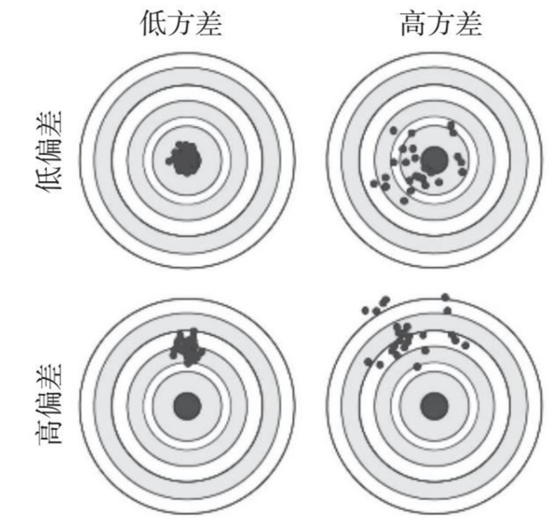
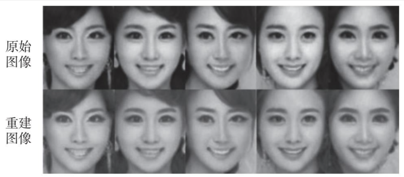
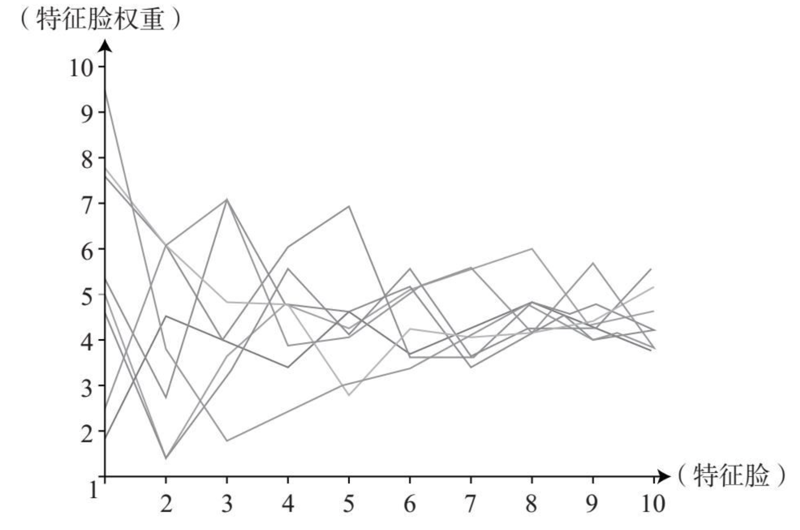
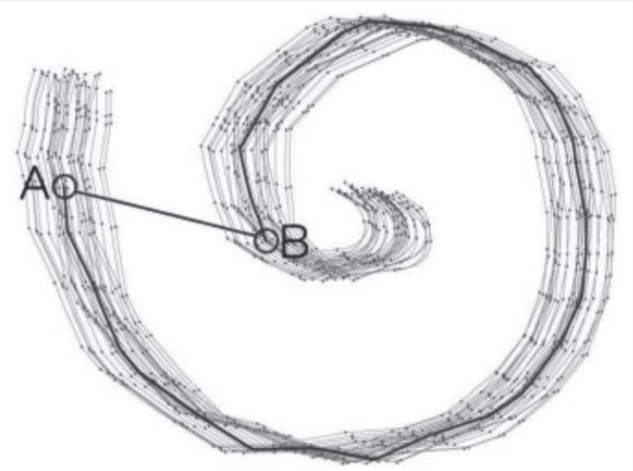
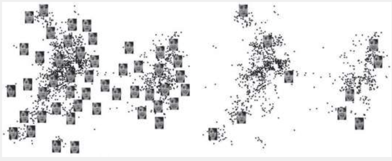

# 0201. AI 思维的底层逻辑

当爱因斯坦说「上帝不掷骰子」的时候，他错了。鉴于黑洞给予我们的暗示，上帝不仅掷骰子，而且往往将骰子掷到我们看不见的地方以迷惑我们。

—《时间简史》—

本章旨在讲清楚 AI 思维中的「法」，即法则和规律，也就是从数学规律的角度，阐述 AI 思维的底层逻辑。AI 思维，尤其是其核心 —— 模型，是在数学和统计算法基础上发展起来的，必然受到数学和统计规律的制约。只有理解了这些制约，才能理解人工智能与生俱来的局限性，只有了解了这些局限性，我们才能扬长避短地使用 AI 思维，更好地享受人工智能给我们带来的实际价值。无论在日常生活还是在商业活动中，我们知道，从来就没有解决一切问题的「银弹」，任何事情都不能一蹴而就。社会对人工智能不切实际的预期，多半来自对其底层逻辑的一知半解。很多时候大家没有听说过，也无暇去理解人工智能实用性背后的法则。并且，在众多的商业包装下，人们越来越多地去追捧短平快的「成果」和高流量的媒体曝光，而不去关注支撑应用的基础性逻辑。这种「知其然而不知其所以然」的做法，不会带来长远的发展，所以，在深入讲述 AI 思维的「术」和「器」之前，我们必须先来理解它的底层逻辑，任何想运用 AI 思维解决实际问题的人都应该知晓并从中获得启发。

## 2.1 模型的泛化能力

首先，我们来回顾一下 AI 思维。AI 思维能够帮助我们捕捉数据的本质特征，根据数据的特征形成模型。在新场景中针对新的输入信息，模型就能做出判断、产生预测。模型使用的一大类场景是分类，也就是预测新的输入所对应的类别。那么，什么是分类呢？如果我们手里有一张照片，你要做的是判断这种张照片里是否有动物出现，你通过眼睛获得了这张照片的视觉特征，这时，你的大脑已经下意识地做出了一个判断、一个分类。这个问题的回答结果就只能是「有」或者「没有」，这是一种分类，叫作二分类问题。

但是并不是所有的分类都可以用是与否这样一分为二的判断来解决，还有很多东西需要人们去分辨它属于多种类别中的哪一类。我们还是拿这张照片举例。当你已经判断出这张照片里有一只小动物后，你还需要判断这是一只什么动物。你会根据这只动物的体型、体毛、耳朵、眼睛、嘴巴等特征，判断它是猫、狗、兔子，还是其他什么动物。这也是一种分类，叫作多分类问题。

在日常生活中，我们每个人都避免不了和他人对话，我们要说，要表达，也要聆听、理解他人的话。其实我们识别对话中的声音信号，从中提取所说的字和词语，也是一个分类的过程。商务印书馆的《现代汉语词典》是目前较权威的大型现代汉语词典，第 7 版收录的词将近 7 万条，其中包括了字、词、短语、熟语、成语等。也就是说，在我们聆听的时候，为了理解这些声音信号的意义，我们的大脑都在将它们中的片段分类成这些字或词之一，这就是一个多分类的过程。但是有的时候，我们也会混淆一些读音比较相近的词，比如说「建议」和「坚毅」、「升起」和「盛气」，这说明人脑的分类也不是完美无瑕的。

我们的视觉要对看见的东西进行分类，我们的听觉要对听见的东西进行分类，我们的味觉要对尝到的东西进行分类…… 感官的分类可以帮助我们更加完整地认识这个世界。可见，对外界事物的分类能力是人们认知的重要组成部分，可以说，每时每刻我们都在对现实世界中的输入信号做出分类，分类的准确与否直接影响我们生活和工作中决策的质量和效果。

正如人一样，分类也是人工智能进行感知和认知的重要工具。在机场部署的人工智能模型可以识别出通过安检的人是否和证件上的照片一致，刷脸打卡的人工智能模型也在很多机构运用起来，无须戴工卡便可知道人的身份，许多手机的刷脸支付功能可以识别出你是否是该手机的主人来决定是否支付，极大地提高了资金的安全性。在语音识别领域，主流的人工智能识别模型对常见词语输入分类的准确率已超过 97%。除了感知图像、声音领域，人工智能模型的分类还可以用在更多的场景，做出人类都难以达到的准确预测。例如，在营销领域，人工智能模型需要预测客户的喜好度和倾向性等，相当于对未知客户行为的分类。在金融信贷领域，人工智能模型能对客户的风险进行评级，也就是对客户将来风险度的预测，从而将客户分为高风险和低风险客户，并辅以不同的策略。可以说，通过分类，许多常见的问题都可以在人工智能的分类框架下进行考虑。

### 2.1.1 分类模型的数学基础

向量指一个同时具有大小和方向，且满足平行四边形法则的几何对象，如图 2-1 所示。简单地说，向量是有序的数字列表。人工智能中用到的数据一般是以向量的形式表示的。按一定的次序排列在一起的变量 (x1, x2 … xn)，依次表示事物的各种特征。举个例子，我们打算用过去一年在服装、饮食、住房、出行、健身、娱乐、美容、奢侈品这 8 个类别的消费金额来研究一个人的消费习惯。那么，这 8 个数字构成了一个八维的向量：(x1, x2, x3, x4, x5, x6, x7, x8)，其中每一个变量对应了一个类别的消费金额。不同类型的人，上述向量的数值也不同，美食爱好者的 x2 有比较高的数值，高消费地区的租房客的 x3 会比较高，注重外貌容颜的人 x7 比较高……

图 2-1 向量示意图

这里面的每一个变量叫作向量的一个维度，人工智能中的向量也常被叫作特征向量，因为它描述了事物的特征。要注意的是，向量中变量是按照一定顺序排列的，顺序变了，向量也就变了。我们举例的向量只有八维，是一个简化的例子，在现实中，人工智能处理的向量通常是高维的，在商业应用中可以达到上百维、上千维甚至更多，在处理基因数据时，可以达到百万维以上。正因为人工智能可以理解高维度的向量，而不是像人脑一样只能分析少数几个变量，所以人工智能会给我们带来更深入、更有效的知识和洞察。

在数学上，分类要做的是，将一个预测函数作用在个体的特征向量上，得到想要的输出结果。如前所述，人工智能中个体的数据是以向量形式来表示的。以图片识别为例，为了识别图片中的物体种类，首先我们要建立一个预测函数 f ，预测函数 f 作用在图片的特征向量 x 上，得到一个类别 f(x)，比如说「小猫」「小狗」或者「兔子」。当然，在现实中的图片识别应用中，人工智能可以识别出任意类别物体的图片。

这个看似简单的过程其实是非常强大和灵活的，基本上所有人工智能分类的过程都可以抽象成这样，其中预测的目标是跟具体业务相关、需要提前获知的信息。就像之前提到的亿客行案例一样，网站需要预测一个访客的价值高低。如果我们可以准确地识别一个访客是否具有高购买的可能性，并将其应用于电商领域，根据访客价值定制营销策略，就能取得优秀的阿尔法。

让我们来看看如何设计高价值用户预测的分类模型。首先，我们需要收集历史上具有高价值或者低价值客户的标记，以及各自行为的特征向量。这个分类问题的目标是将任何一个新的访客分为两类之一。所谓高价值、低价值就是看客户一定时间里在网站的购买额度，超过一定金额的定为高价值客户，反之则是低价值客户。这样，我们有了模型训练所需的数据集，可以根据这些数据训练的模型预测一个网站访客价值的高低，即使之前他没有在网站上消费过。既然这个模型的作用这么大，那么我们接下来就具体看一下，它是如何被训练出来的，又是如何进行预测的。

### 2.1.2 模型的训练和预测

在人工智能领域，机器学习是产生模型的途径和方法论。和我们的学习一样，分类问题的机器学习框架也分为训练和预测这两个最基本的环节。

2『模型的训练和预测，做一张术语卡片。（2021-02-21）』——已完成

训练环节中需要给定一个训练集，通过训练集中的标记样本 `{{x1,y1}, ..., {xn,yn}}` 训练出一个预测函数 f，也就是我们的预测模型。标记样本是由第 1 个到第 N 个输入数据 x 以及与其相对应的输出数据 y 组成的。在预测环节中，我们要对在训练环节中形成的预测模型输入一个新样本 x，使用 f 输出预测值 y = f(x)。需要注意的是，在训练环节中，由于样本是给定的，所以样本的标记是已知的，但在预测环节中，使用的都是新数据，所以样本的标记是未知的。

任何分类模型都要经过这两个环节。在训练环节中，机器通过分析训练集学习模型，发现其中的规律，并以预测模型 f 的形式产出。在预测环节中，碰到新的样本，即使模型先前没有见过这个样本，仍然能够输出相应的分类。正如人的思维方法是从经验中学习规律，人工智能通过训练环节从数据中学习模型。训练环节使用了何种模型，以及模型训练的质量，决定了模型的有效性，其中最重要的指标是模型在新样本上的预测效果。

如果一个模型能够对新样本进行有效的预测，就可以在实际使用中产生效益。比如，一个模型成功地预测了某位用户购买某款商品的概率为 80%，那么商家可以积极地向该用户推送自家的该商品，用户经常接收到自己喜欢的商品的信息，下单的概率也会有所上升。成功地预测出用户是否会购买，帮助商家提高销量，这样的模型才是有实际意义的。

### 2.1.3 泛化能力是模型的核心

一个模型能带来多大的价值，取决于模型预测的准确率有多高。而模型预测的准确率又依赖于模型的泛化能力（generalization ability）。也就是说，在一定程度上，模型的泛化能力决定了一个模型最终能迸发出多大的能量。那么泛化能力到底是什么呢？

2『模型的泛化能力，做一张主题卡片。（2021-02-21）』——已完成

泛化能力是用来描述模型对新样本的预测能力的。我们在日常生活中也称之为举一反三或学以致用的能力。机器学习的目的是学到隐含在数据背后的规律，对具有同一规律、训练集以外的数据，模型也能给出合适的预测。这就是泛化能力的表现。

泛化能力体现了模型智能水平的高低，如果一个模型只在训练数据上能准确地分类，作用是很小的，因为这充其量是模型「记住」了各种输入和对应的类别，在新的场景中没有办法做出准确预测。

在进一步讲泛化之前，我想先讲一个故事。我有一对情侣朋友，女生是一个中国姑娘，叫郭霓禾，男生是英国人，叫安德费汀。郭霓禾是一个牙科医生，她诊病的程序十分烦琐，一个简单的牙疼，她会给病人量体温、测视力、检查血压，有时甚至还要检查心电图，除此之外，她还会询问病人一些无关的信息，比如身高、体重以及最近吃过什么。她饱读各种医学类书籍，还研究过各种偏方，最后再结合她的临床经验，总结出一些独特的治病规律。如果一个新的病人的所有指标符合她总结出来的规律，她才能判断这个人的患病情况，如果情况不符合，她就无法做出判断。比如有一次一个病人牙疼，经过检查和询问，她发现这个病人体温 37℃，视力 0.8，身高 1.7 米，体重 70 千克，是在吃了西红柿之后智齿开始发炎。于是她就总结出一个体温 37℃、视力 0.8、身高 1.7 米、体重 70 千克的人会在吃了西红柿之后引发智齿发炎的规律。刚刚好，安德费汀也符合这几个条件，有一次安德费汀智齿也发炎了，但因为安德费汀没有吃西红柿，郭霓禾认为他不符合自己总结出的规律，诊断安德费汀的牙疼不是因为智齿发炎引起的。而安德费汀是一个股票投资分析师，对于自己的经验和能力十分自信，他认为凭借自己的经验，只需要看一下股票的走势，就可以判断一只股票到底是应该买入还是卖出。他根本不考虑政策、大盘环境、主力资金进出等变化因素，每天只看一下电脑屏幕上股票的涨跌状况就做决定。这样的判断显然十分不科学，导致了他的大部分积蓄都被套牢在股市。

郭霓禾和安德费汀两个人都各有特点。郭霓禾对待事情很认真，看事情很全面，但是由于她顾及的事情太多太细，有时可能会过度重视一些无关紧要的特质，总结出一些没有作用的规律，比如那些奇怪的指标与智齿发炎其实并没有关系，只是那个病人刚好在智齿发炎前是那样的身体状态，刚好吃了西红柿，这样过度关注无关因素反而妨碍了病因的评估。安德费汀则正好相反，他看事情太片面，没有综合考虑影响股市涨跌的因素，导致他的判断和股市的实际情况产生了很大的偏差，成为被迫割肉那一批人。

故事讲完了，我想告诉你，郭霓禾和安德费汀其实都是我虚构的朋友，他们的名字其实就是过拟合（overfitting）与欠拟合（underfitting）的谐音。过拟合和欠拟合是两类统计学现象，有这两种现象的模型，不具备良好的泛化能力。

在统计模型中，由于模型太过复杂而拟合了训练样本中的噪声，以至于输出的结果与真实值相差很大，就像郭霓禾诊断病人一样，这就是过拟合。欠拟合则刚好相反，是由于模型过于简单，以至于得到的模型难以拟合训练数据，就像安德费汀没有考虑到影响股市的其他因素，而导致判断错误。

我们总是希望在机器学习训练时，机器学习模型能在新样本上有很好的表现。过拟合时，模型过于复杂，把训练样本学得过分好了，就很可能把一些训练样本自身的特性当成所有潜在样本的共性。这样一来，模型的泛化性能就下降了。欠拟合时，模型又过于简单，无法很好地学到训练样本的一般性质，所以不论在训练数据还是预测数据中，表现都很差。

过拟合就是过多学习了一些不必要的数据特征。比如你的模型需要区分男人和女人，模型学习了训练样本中所有男人和女人的特征。如果训练样本中的女人刚好都穿了红色的衣服，过拟合的模型就可能会把穿红色衣服作为区分男人和女人的一个特征。我们都知道，穿什么颜色的衣服并不能作为区分人的一个特征，这时模型学习的这个特征就属于过度学习。过度学习不仅毫无作用，甚至还会对模型的预测结果产生误导，比如出现了一个新的预测样本，是一个穿红色衣服的男人，模型很有可能会根据他穿了红色衣服这个特征就把他识别为女人。

欠拟合与过拟合正好相反，它对于训练样本的特征学习得不够充分，导致训练出来的模型不能很好地进行预测。而且，由于欠拟合的模型没能很好地捕捉到数据特征，它不但不能对新的样本数据进行预测，在训练集中的样本数据时表现也不是很好。比如你要参加一场考试，考试前做了许多模拟题，发现有一些知识点你还不明白，在模拟题中你有部分题目做不出来，这就是没有很好地掌握训练样本的规律。当你要对新样本进行预测时，也就是当你去参加这场考试时，考试结果也不会很好。不论是过拟合还是欠拟合，都会使模型不能很好地输出预测结果，所以，在机器学习中，这两种现象都是需要极力避免的。

图 2-2 形象地展示了拟合的几种情况。我们有一些数据样本，大致呈二次函数形式，可以看出，用二次函数来做拟合最合适的是图 2-2 中间的图像。但是如果我们不采用二次函数呢？比如，我们用线性的函数来拟合它，我们可以得到如图 2-2 中左图的直线，这显然没有很好地拟合训练样本数据，更不用说预测数据了。我们用高次函数来拟合，可能会得到如图 2-2 右图那样的曲线，显然，这并不是我们想要的模型，它把个别数据的偶然偏离也当成了共性，而过度拟合了进去。

1-3『过度拟合：把个别数据的偶然偏离当作共性。想到了「随机性」无处不在，那个数据里的随机性不是规律，应该剔除掉。（2021-02-21）』

图 2-2 函数拟合示意图

通常，解决欠拟合的方法包括：1）增加新特征，也可以考虑加入特征各种形式的组合，来增大模型可操作的空间；2）尝试非线性模型，比如非线性支持向量机（SVM）、决策树、深度神经网络（DNN）等模型。

解决过拟合的方法包括：1）交叉检验，即拿出大部分样本进行模型训练，留小部分样本用模型进行预测，并通过调节这小部分样本上的预测误差来得到较优的模型参数；2）特征选择，从已有特征中选择部分特征以减少模型所用特征数；3）正则化，即为原始模型引入额外信息来限制模型的复杂度；4）增加训练数据在一定程度上可以避免过拟合。

真正的泛化能力需要回避过拟合和欠拟合，一个好的模型必须真正把握数据的底层规律，既不比数据本身复杂，也不比数据本身简单。人工智能行业的趋势是要用越来越复杂的模型来尝试做出更好的泛化效果，这需要我们更加谨慎地看待：如果训练数据量不够多，或者并不支持复杂的模型假设，那么，很有可能我们只是在过拟合，而不是在产出优质可泛化的模型。什么样的模型既不过拟合，也不欠拟合，是运用 AI 思维时需要考虑的核心问题。

## 2.2 方差和偏差的权衡

我想大家都听说过差不多先生的故事。差不多先生做什么事情都是马马虎虎，差不多就好，但是最后差不多先生就因为这差一点的「差不多」害死了自己。我想，谁都不想「差一点」，包括人工智能。当机器学习建立了一个模型，当然希望这个模型有很好的预测效果，但是很多时候我们发现，这个模型还是差一点，它在预测方面会出现或多或少的问题。而这个「差一点」的问题很多时候是出在「偏差」和「方差」这两个方面。并且在实践中我们发现，这个「差一点」是可以弥补的，只要权衡好偏差和方差之间的关系，就能够帮助我们更好地运用 AI 思维解读数据。那么，什么是偏差，什么是方差呢？我们如何才能权衡好偏差和方差之间的关系呢？

### 2.2.1 偏差和方差概述

在机器学习中，机器从训练数据中学习到模型。任何有监督的机器学习的目标都是在给定训练数据的情况下，对输入变量和输出变量之间的映射关系（下文称为「真实函数」）进行最佳估算。既然是估算，肯定就会有误差。通常，机器学习的预测误差可分为三部分：偏差、方差以及不可减少的误差。其中，不可减少的误差是无论采用什么模型都不可能被减少的误差，因为这种误差是由未知变量引起的。比如一个预测用户是否会买车的模型能根据用户的收入、职业、年龄、家庭状况等一系列数据进行预测，但是这个预测不一定完全精准。因为一个用户是否会买车不只会受这些变量的影响，还会受生活方式等的影响，而像生活方式这样的变量通常是不可知的，因此这种误差是不可减少的，但是，偏差和方差是可以通过机器学习模型进行影响的。

2『偏差和方差，做一张术语卡片。（2021-02-21）』——已完成

偏差描述的是在使用不同的训练数据时，预测值的平均值与真实值之间的差距，即模型本身的精准度，反映的是模型本身的拟合能力。偏差的产生是因为为了使真实函数更容易学习，而对模型的假设做了简化。偏差高意味着模型是欠拟合的。

方差衡量的是在使用不同的训练数据时，真实函数的估算值所改变的量，也就是预测值的波动情况，它反映的是模型的稳定性。方差的产生是因为为了使模型的预测结果更加符合真实数据，而对模型提出了更加复杂的假设。方差高意味着模型是过拟合的。

下面我们用一个更直观的例子来说明一下偏差和方差。假如有一个视力不好的人想要学习射击，那么他不管练习多少次，也不能打中靶心。但是如果这个人的视力很好，对环境的敏感度很高，瞄准时还能考虑到风速、风向等环境因素，那么经过训练后，他就很容易打中靶心。如果我们此时给他换一个环境，而他不能迅速适应这个环境的话，他的射击也不会有之前那样高的命中率。

在这个例子中，靶心代表的是真实值，若这个人视力不好，他的拟合能力相对而言就不高，无论怎么练习都不能很好地命中靶心，也就是预测值和真实值之间存在差距，产生了偏差。假如这个人视力没有问题，而且他能够根据环境因素来改变射击的方式以此来提高命中靶心的概率，也就是为了使输出更好地符合真实值，而提出了更多的条件假设，但是他又没有完全掌握这种方式，环境一发生变化他的命中率就会下降，这就说明了提出的假设越多，稳定性就越低，就越容易产生方差。

在图 2-3 中，第一行的两个靶，射击的痕迹都十分靠近靶心，说明其拟合能力比较好，也就是偏差小；第一列的两个靶，射击的痕迹都十分集中，这说明其稳定性非常好，也就是方差小。

图 2-3 偏差与方差示意图

1-2『这图看起来好直观，一下子弄明白了偏差和方差的概念。作者丁磊的「功力」确实深，很庆幸在老俞的知识城邦里看到这本书的信息，错过这本书是个很大的损失。丁磊，做一张人名卡片。（2021-02-21）』——未完成

在数学领域有一个概念叫作「参数」。在研究问题时，我们经常会在模型中引入一些变量来描述数据的变化，这些变量就是参数。一般来说，在机器学习中，参数化的模型会有相对较高的偏差，这样它们学习起来很快，也更容易理解，但是高偏差就意味着它对模型做了很多的假设，在训练过程中，不是每个数据都可以完美拟合，因此，这个模型就不那么灵活。反之，如果这个模型对真实函数提出的假设很少，那么这个模型的偏差就很低，几乎能拟合每一个数据，但是这样的模型近乎一种对数据的记录，预测性能就不足了。低偏差机器学习模型的例子包括：决策树、K-最近邻和支持向量机。高偏差机器学习模型的例子包括：线性回归、线性判别分析和逻辑回归。

用机器学习模型是通过训练数据来对真实函数进行估算，模型或多或少都会产生一定的方差。理想情况是，训练数据集的改变对真实函数的估算结果不会产生很大影响，这意味着该模型能够很好地计算出输入和输出变量之间隐藏的底层映射。如果模型的方差过高，训练数据对其产生的具体影响明显，那么训练的细节就会较大地影响到描述映射函数的具体参数。如果模型的方差较低，训练数据对其产生的具体影响很小，那么训练的细节对描述映射函数的具体参数的影响也会很小。

### 2.2.2 泛化误差：偏差和方差的权衡

任何有监督的机器学习模型的目标都是做到低偏差和低方差，也就是说该模型应达到很好的预测性能。但是在机器学习中，偏差和方差二者又不可兼得，偏差减少必将增加方差，方差减少必将增加偏差。造成这种现象的原因是，当我们想要尽量减少模型的偏差时，我们就会尽可能多地保证模型在训练样本上的准确度，但是这样学习出的模型就会过度拟合，反而降低了其预测能力，增加了模型的不确定性，也就是方差增加了；相反，我们在追求模型的低方差时，会增加许多对模型的假设和限制，虽然这提高了模型的稳定性，但是忽视了拟合程度，偏差也随之提高了。所以为了模型能够拥有更好的预测能力，我们需要权衡偏差和方差的关系。

2『这里的信息补充进术语卡片「偏差和方差」里。（2021-02-21）』——已完成

我们通过在具体情况下选择模型的复杂度来达到偏差和方差的权衡，寻找这个权衡的过程就叫作泛化误差的优化。研究发现，模型的泛化误差可以通过偏差的平方、方差以及不可减少的误差相加而得出：

$$模型的泛化误差 = 偏差^2 + 方差 + 不可减少的误差$$

模型的泛化误差还可以通过更加形象的方式来表示，如图 2-4 所示，随着模型复杂程度的上升，模型的偏差越小，方差越大，图 2-4 中最上方的那条线，表示的就是模型的泛化误差。我们要找的方差和偏差的最佳权衡点就是图中虚线所在之处，此时模型的复杂程度处于最佳状态，模型的泛化能力最好。

图 2-4 模型的泛化误差示意图

我们从图 2-4 中可以很容易地发现，偏差和方差之间是存在冲突的。虽然大多数情况下，我们不能计算实际的偏差和方差项，但是对偏差和方差的把握为模型预测性能的优化提供了思维框架。

### 2.2.3 模型的复杂度：VC 维度

前面我们讲到，模型的偏差和方差与模型的复杂度是有关系的。模型的偏差会随着模型复杂度的上升而下降，而模型的方差会随着模型复杂度的上升而上升。那我们是怎么来定义和量化一个模型的复杂度的呢？为了定义和量化一个模型的复杂度，我们引入一个新的概念：VC 维度（Vapnik-Chervonenkis Dimension）。VC 维度是根据提出者统计学家弗拉基米尔·万普尼克（Vladimir Vapnik）和数学家亚历克塞·泽范兰杰斯（Alexey Chervonenkis）的名字来命名的。

2『VC 维度是描述一个模型复杂度的方法，做一张术语卡片。（2021-02-21）』——已完成

大自然的智慧是无穷的，它赋予我们聪慧的大脑，也在冥冥之中提示我们寻找规律，让我们首先从大自然的角度来理解 VC 维度。海豚经过训练可以打乒乓球、钻火圈，被称为世界上最聪明的动物，海豚大脑的重量占海豚体重的 1.7%。平时我们总会用「蠢萌」这个词来形容的狗，它的大脑重量仅占它体重的 0.8%。经过对多种动物大脑重量占它体重比例的研究以及这些动物日常表现的观察，科学家们提出，大脑重量占体重的比重越大的动物越聪明。人类大脑的重量占人体重的 2.1%，是地球上所有生物中占比最大的，这也充分证明了上述观点。大脑占的比重越大，说明脑细胞相对就越多，也就是大脑的复杂度越高。如果从 VC 维度的角度来看，大脑的 VC 维度越高，就越聪明。

接下来，让我们从理论的角度来了解一下 VC 维度。首先我们需要了解一下分类器。分类是 AI 思维考虑的重要问题：比如我们要将顾客分为高购买价值和低购买价值两类，以此来决定我们的精准营销方案。在人工智能中，这些数据的分类是通过分类器进行的，而分类器的复杂程度取决于它能够准确分类的数据的多少。假如现在要用分类器为一组数据点分类，那么这种分类器的 VC 维度的定义就是：对于每个可能的数据点的标记，单个分类器可最多分类的数据点个数。但是需要注意的是，这里有一个隐含条件，就是不要求对在同一直线上的点分类。比如：如图 2-5 中前三张图所示，在二维空间上，一个线性分类器的 VC 维度是 3，因为它可以对任意三个点进行准确分类，无论它们如何排列。但是如图 2-5 中第四张图所示，单个线性分类器无法对四个点进行准确分类，即使它们不共线。

图 2-5 二维空间线性分类器示意图

如果要判断分类器的 VC 维度就要看它能够对几个不共线的点进行分类。通过上述图片所示，我们可以直观地看出来，二维空间中单个线性分类器可以分类的最大数量是 3，所以这种线性分类器的 VC 维度是 3。而随着分类器能准确分类数据的增多，VC 维度也会相应地增加。因此，VC 维度是描述模型复杂程度的一种方法。

VC 维度是反映泛化误差与训练误差关系的重要指标，正如以下公式所示：

$$泛化误差 ≤ 训练误差 + \sqrt{\frac{8}{N}ln(\frac{4(2N)^d}{δ})}$$

其中 N 指的是训练样本数量，d 指的就是 VC 维度，δ 指的是一个概率相关的参数。虽然这个公式看似十分复杂，但是仅从数量关系的角度看，VC 维度与泛化误差和训练误差的差值呈现正相关，VC 维度越大，泛化误差和训练误差的差值就越大。而我们现在已经知道了 VC 维度代表的就是模型的复杂度，所以模型的复杂度与泛化误差和训练误差的差值也呈现这样一个正相关关系。那么，模型 VC 维度的法则在现实中有什么意义呢？

首先我们要知道，VC 维度并不是越大越好，但是根据上述公式可以发现，训练样本的数量位于分母位置，VC 维度位于分子位置，如果分子分母的数量同时扩大，也就是说训练样本数量和 VC 维度同时扩大，泛化误差和训练误差的差值可能并不会发生显著改变。换言之，如果在训练样本的数量越来越多的情况下，提升 VC 维度，也就是使用更加复杂的模型可能是一个更加合理的选择。所以，模型 VC 维度的大小是要根据训练数据的多少来进行选择的。只有选择了合适的 VC 维度模型，人工智能才能产出实际价值，为各行各业提供优质的服务。

1『获取到了一个关键信息：模型的复杂度要根据训练数据量的大小来选择，数据量大的时候模型复杂度选高点不会过度拟合，选择合适的模型复杂度特别重要。（2021-02-21）』

我们现在使用的人工智能都是经过了漫长的发展才达到现在可以普遍应用的水平，例如语音识别从 1952 年就已经出现了，但当时的语音识别建立在一个数据量很小的基础上，所以当时它只能识别出 10 个英文数字的发音，虽然这是语音识别的开端，具有划时代的意义，但它也确实不能进入应用阶段。随着语音识别马不停蹄地发展，训练语料库越来越大，相应地，语音识别模型的 VC 维度也在不断升高，随之而来的是语音识别的错误率也越来越低。目前，主流智能语音识别的准确率已经超过 97%，比通常人工转录的准确率还要高。

我们之前提到过的图像识别领域的「奥赛」ImageNet 比赛也反映出这样的趋势。从 2000 年开始，每年冠军参赛模型的 VC 维度都在不断上升，与之相对应的，冠军模型识别图片的错误率在不断下降，在这背后，冠军模型面对的其实是数据量越来越大的现状。不论是在语音识别、图像识别还是在其他人工智能应用上，都体现了这个规律：几十年前，数据量很小，人工智能技术刚刚起步，模型不需要很高的 VC 维度来处理数据，所以当时建立的一些模型都很简单。但随着时代的发展，数据量的增加，为更好地解决层出不穷且越来越复杂的问题，提供更优质的服务，近几年新建立的模型都呈现出 VC 维度越来越高、复杂程度越来越高的趋势。

与此同时，各种新兴行业也通过 VC 维度的提升有了新的发展。2019 年 8 月 2 日，腾讯人工智能实验室研发的人工智能系统叫作绝悟，它在王者荣耀世界冠军杯中战胜了职业选手，证明了现在的人工智能也可达到电竞职业玩家的水平。8 月 3 日，绝悟在中国国际数码互动娱乐展览会（ChinaJoy）上参与的 504 场 1 对 1 人机对战中，获胜率为 99.8%，输掉的那一场是输给了国内最顶尖的专业玩家。绝悟之所以能取得如此高的胜率，正是因为选择了具有合适 VC 维度的模型。

这些年，中国电竞在世界级比赛中也获得了不俗的成绩：2018 年雅加达亚运会电子竞技表演赛中斩获 2 金 1 银、「英雄联盟」S8 全球总决赛捧得冠军奖杯。这说明中国电竞业正在逐步崛起，电竞职业选手的能力也逐渐逼近世界水平。这时如果发明出电竞人工智能，也会希望它达到世界级水平。但是，电竞人工智能所要面临的问题是十分复杂的。以王者荣耀为例，它作为一个团队作战游戏，双方每方 5 位参与者要在英雄搭配、技能应用、路径调换及团队协作等方面面临大量、持续而且即时的选择，其操作可能性高达 $10^{20 000}$ 种。因此，绝悟在训练过程中选择的是 VC 维度极高的深度强化学习模型。在短短半个月的训练周期内，绝悟每天的训练强度相当于人类训练 440 年的量。与此同时，绝悟在训练中用了 384 块 GPU。在这样高等级算力的支持下，VC 维度高的模型的训练下，绝悟的电子竞技能力直线上升，达到了世界级电子竞技选手的水平。

「权衡」二字出自南朝刘勰的《文心雕龙》：「权衡损益，斟酌浓淡。」古人早已告诉我们，要懂得权衡才能找到处理事情的最佳方法。通过权衡偏差和方差平衡模型的复杂程度和稳定程度，找到最合适的模型；通过权衡各种条件，找到最合适的 VC 维度，这样打造出来的模型才是真正能解决问题的模型。弱水三千只取一瓢饮，虽然选择很多，我们只要最合适的那一个。这和 AI 思维是一脉相承的，通过权衡各种复杂条件做出最佳的决策，不但可以帮助我们解决各种复杂的商业问题，还能使我们在激烈的行业竞争中脱颖而出。

## 2.3 相关性和因果性

伏尔泰说过：「雪崩的时候，没有一片雪花是无辜的。」那雪山是随着片片雪花的飘落而崩塌，还是因为那场忽降的大雪而崩塌？笛卡儿说过：「我思故我在。」那我们是随着思考而越发感觉到自己的存在，还是真的因为我们在思考才有了自身的存在？骆驼到底是随着稻草的增多而被压垮，还是因为最后一根稻草太沉而倒下？关于相关性和因果性的思考一直以来都存在，机器学习模型发现的便是输入变量和预测目标之间的相关性。相关性不同于因果性，因果性对应的是传统科学研究的范畴，相关性则是 AI 思维所关注的理念。相关性对于我们研究许多变量因子之间的相互关系有着很大的帮助。

事实上，将两个一起出现的事物关联起来是人类与生俱来的学习能力。比如说，人都怕衰老，因为衰老意味着生命的流逝；人们到了一定年纪就会喜欢照镜子，去看是不是自己脸上哪个区域又出现了皱纹，或者白发是不是又增多了，因为白发和皱纹是衰老的迹象，这对于大部分人来说可能都不是个好消息。我们一看到脸上有皱纹、头上有白发，就知道人开始进入衰老期，其实就是因为我们将皱纹、白发与衰老建立起了联系，根据这个联系在脑海中反映出它们之间的相关性。但是，从科学角度来说，并不是「皱纹」「白发」带来了人体的衰老，它们只是衰老的表象，人体衰老的根本原因在于细胞代谢能力的降低。也就是说，皱纹和衰老之间并不存在因果性，仅仅是内涵及外在表现形式的一种相关性。

人体是一个复杂的存在，除了会经受自然衰老以外，还会生各种各样的疾病。在流行病学领域，相关性也比因果性常见得多。例如，最近很多上班族觉得自己气血不足，所以在他们中间流行起了「泡枸杞、吃红枣」的养生法。这是为什么呢？难道就因为上班族每天都得对着电脑、手机十几个小时，又恰恰显出了气色差、无力等贫血迹象，就能说明是辐射引起的贫血吗？这些社交媒体制造的类似焦虑言论背后，其实埋着将相关性歪曲为因果性的雷。虽然不排除某种性质的贫血跟电子产品的辐射有一定关联，但贫血和人们使用电子产品的比例并不能断定两者之间的因果性。

实际上，白领群体的「贫血」概率与机体的运动代谢下降和饮食结构的不合理有关。白领群体长时间坐在工位上，对着电脑、手机，身体代谢变慢，血气调动不起来，这才导致了医学上的贫血现象。此外，上班族工作压力大、饮食不规律，忽略了机体基础营养的正常补给，长年累月，影响身体机能的修复，这也是引起气血不调的原因之一。所以，如果将此类的表述换成「随着全球气温升高，贫血人群的数量也在急速上升」，同样也能推出「全球温度升高容易引起贫血」的结论，这显然十分荒谬。

虽然相关性没有因果性来得一针见血，但是相关性能一定程度地揭露问题所在。作为内在问题的一种肉眼可见的表征，相关性自有它的用武之地；至于如何应用，我们会在后面的内容中进行更详细的阐述。现在让我们先来看一下相关性与因果性的定义。

### 2.3.1 什么是相关性

相传，如果南美洲亚马孙河流域热带雨林中的一只蝴蝶慵懒地扇动几下翅膀，可能会在两周之后导致美国得克萨斯州刮起一场铺天盖地的龙卷风 —— 如果一定要说这两件事之间存在关系的话，那这个关系也是微乎其微的。

那么，如何衡量相关性的程度呢？我们可以定义相关系数，规定相关系数的取值范围在 -1 到 1 之间，两个事物之间的相关系数越接近 0，就表明两者的相关性越低。对比双方数据时，如果一方数据往高走的时候，另一方数据也在上升，就说明二者正相关，它们的相关系数在 0 与 1 之间。如果一方数据往高走的时候，另一方数据下降，那么二者为负相关，相关系数在 -1 与 0 之间。相关系数的绝对值越大，相关性越强。相关系数越接近于 0，相关性越弱。

举个例子，负相关性就好比饮食健康程度和生病次数之间的关系。一般来说，饮食健康程度越高，生病次数就越少，即饮食健康程度和生病次数是负相关的。不相关（相关系数为 0）的数据，看起来就是一组均匀的数据点，没有什么明显的趋势。当然也有正相关的例子。譬如多年未见的朋友比小时候长得更加高大、健壮了，体重也重得多。身高和体重之间就是一种正相关的关系。一般来说，身高每长高一厘米，体重也会相应地有所增加。

但是在运用相关性进行分析的时候要十分注意。国外有个网站 Spurious Correlations，讲的是虚假的相关性。这个网站上列了许多啼笑皆非的例子，这些例子中的每一对数据看似都有很高的相关性，实际上却不存在任何合理的解释。比如说，有人发现在某些年份，美国在科技领域投入的资金和上吊自杀人数，相关系数高达 99.79%。这其实体现的就是一种虚假的相关性，真正具有相关性的两者要有一个关联的基点。就这个例子而言，人们并不会因为美国在科技领域投入多少，就去考虑上吊自杀的事情，所以两者不存在一个关联的基点，也就不存在真正的相关性。网站上列举的另一个虚假相关性的例子 —— 人均芝士消耗量和新增土木工程博士数，相关系数高达 95.86%。95.86% 表面上代表着非常高的相关性，但实际上，两者之间并没有合理的联系。造成如此高的相关系数的原因也许只是随着时间推移，社会发展，各项指标正好同步变大而已。所以在使用相关性概念的时候，我们也要考虑两个变量内在的联系和可解释性，单纯的相关系数可能没有意义。

### 2.3.2 什么是因果性

证明因果，首先要证明两个事件有关联。这种关联一般来说是一种常见的现象，比如一些老人喜欢说的「爱笑的人都很善良」，「满脸愁容、精神颓废的人都很苦命」，「筋络粗壮的都很奔波」，等等，是根据一种静止表象来推测动态发展倾向。虽然关联现象不一定意味着因果关系，但认识到或者察觉到它，却是一个很好的起点。如果某两个事件显示出一定的相关性，往往会引起研究者的注意，吸引他们去发掘其中可能存在的因果关系。

从日常生活到严谨的科学实验室，想要证明事件之间有无关联或密切程度的方法有很多。就像前面说的，从统计学的角度，能够通过数据分析看出两个事件之间是否存在正相关和负相关的关系，如果不存在关联就不存在因果，因为关联关系是因果关系的基础。当确定两个事件之间存在关联后，我们再进一步分析两个事件之间的细节规律，建立起一个假设，即它们之间发生的先后关系的推测。想要验证这个推测，首先可以预设是某一事件导致的另一事件，这个结论成立的两个条件是：第一，一个事件发生在另一个事件之前；第二，前一个事件的出现能预测另一个事件的出现。

1-2『这里的「因果性」是目前看到的，解释最清晰的，做一张术语卡片。（2021-02-21）』

因果关系的链条是单一的。上述条件只是证明了两者之间存在链条，我们还要进一步检验事件之间链条的单一性，也就是排除掉其他可能的混淆变量。所谓混淆变量，就是发生在前一事件以外的其他事件导致了后一个事件的发生，这就违反了因果关系链条的单一性，这个因果关系就不是那么明确地能够成立了，需要再往深一步去挖掘其真实的因果关系链条。比如，在众所周知的狐假虎威的故事当中，每一次狐狸出现，森林里的动物们都十分害怕，四散而逃，但是动物们逃走并不是因为狐狸，而是因为狐狸的身后跟着百兽之王老虎。在这个故事中，老虎就是那个混淆变量，狐狸出现与动物们逃跑之间并不存在链条的单一性，也就是因果关系并不成立。

去掉混淆变量的常见方法是设计实验组和对照组。实验组，就是在这一组样本中对某一因素做处理。对照组，就是不做任何处理，直接放置，然后观察两组现象的差别。要证明因果，就是需要实验组出现预设的现象，而对照组不出现预设现象。如果实验组因为做了某一因素的处理而出现预设现象，对照组未做任何处理而没有出现预设现象，就能证明某一因素的改变导致了预设现象的出现，而没有这一改变就不能导致相应现象出现。

例如，最近喝各种养生茶变得流行起来，有些人喜欢清淡的，有些人接受不了苦味，有些人却偏偏喜欢特别苦的。如果我们想要知道是哪一种原料导致了茶的苦味，就可以进行一次对照实验。例如，我们的推测是里面的苦菊导致了苦味，那么我们需要泡两杯茶，一杯花果茶的茶包原料不变，照常加水泡开；将另一杯花果茶的茶包原料里的苦菊挑拣出来，再加水泡开。如果品尝后发现前一杯茶带有苦味，而后一杯茶没有苦味，则验证了我们的推测是正确的，即苦菊是导致这杯茶带苦味的原因，苦菊与茶的苦味之间的因果性成立。当然，我们还可以做更多推测，比如考察是哪种材料导致了奇怪的味道，等等。

### 2.3.3 相关性大于因果性

在日常工作生活中，我们更需要关注相关性，而不是强求因果关系，也就是说，只需要知道「是什么」，而不总是需要知道「为什么」。这能使人跳过洼地，快速地获取结果。这种思维方式推翻了自古以来人们更加注重因果关系的惯例，使我们理解现实和做出决定的最基本方式受到挑战。但是不破不立，破而后立，相关性的思维方式也让一切事物变得看起来很简单。AI 思维从数据中训练出模型，但它从不思考为什么这样做，这让模型训练变得简单直接，体现出相关性思维的特点。

从传统的因果性思维转向相关性思维是 AI 思维最突出的一个特点，传统的因果性思维是说我们一定要找到一个原因，推出一个结果来。而基于 AI 思维的预测没有必要找到原因，不需要证明这个事件和那个事件之间有一个必然、先后关联发生的因果规律。在相关性思维中，如果出现了某些迹象，数据统计的高概率会显示出相应的结果。那么，当我们发现这些迹象时，需要做的就是根据这些迹象去预测结果，做出决策。这和以前的思维方式不一样，和传统科学的思维不一样。虽然同样基于数据，但是传统科学要求找到准确的因果关系。

但是，在这个纷乱复杂的社会关系里面，充满了差异性，不同的人在不同的时间节点可能会为了不同的原因去做一件同样的事情。比如，有的人觉得紫外线太强怕被晒黑，有的人觉得阳光刺眼，有的人觉得雨季要到了，这时他们都可能会买一把伞。不论中间的思考过程有多曲折，各自的理解如何大相径庭，他们最终都指向同一个结果。其实，我们在很多时候，最终为的也不过是这个结果罢了，所以在这期间耗费过多的精力去寻找里面的因果关系并非那么必要，毕竟在这个节奏如此快的社会，等你从头到尾都想得一清二楚的时候，这个事情可能早就不值得办了。

所以人工智能时代的思维更像「action!」（行动指令）、「reaction!」（立刻反应）这样一种直线思维。也就是说，你听到或者看到一个明显的指令或者迹象，你不需要去追究太多，只需要按惯例做出反应就可以。只要我发出这个口令，就一定能够得到一个既定的、预期内的回应，这就可以了。就像在运送快递时，如果有玻璃制品这样易碎的物品，快递盒子外面一般会有「易碎物品，小心轻放」的提示。看到这个提示，快递员不需要知道盒子里面是什么物品，也不需要知道它为什么易碎，他只需要在送快递过程中做到小心轻放，不让盒子中的物品破碎就可以了。

全世界的商界人士都在高呼人工智能时代来临的优势：早在很久以前，商家就明白了相关性销售的精髓。比如，商家很容易根据你买东西的数量知道你家有多少人吃饭，你是单身还是一大家子。将牛肉干等一些简便的下酒食品与各种酒品摆在一起，也能很大程度地提升销售业绩，因为很多时候这些关联是更契合人性的。比如，你只喝酒，难免肠胃寡淡，根据人体自然需求，会需要同时补充一些重口味的小吃。喝酒就是为了爽快，谁会为了几块钱的小吃而折损了喝酒的享受呢？抓住了这些关联也就抓住了人性，从而能实现高销售。数据透露出来的信息有时确实能起到出人意料的效果。比如，下雨或者高温暴晒的时候，往往订外卖的人数会激增，这时候在办公区附近的餐馆都会提前做好「备战模式」，例如提前预备好外卖餐盒、准备好外卖常点的菜品，这些老板不需要去考虑究竟是因为下雨、暴晒的时候大家觉得出门麻烦而选择订外卖，还是因为这种天气下大家心情不好而选择点外卖，他只需要根据天气变化采取相关行动就可以。

这些例子共同说明了一个道理：用相关性思维方式来思考问题、解决问题的做法值得关注。寻找原因在以前被视为理所当然，但是大数据推翻了这个论断。过去寻找原因的信念正在被更为实用的相关性所取代。随之而来产生了一个值得思考的问题：在探求因果关系转变为注重相关关系的过程中，我们怎样才能既不损坏奠定社会繁荣和人类进步的因果推理基石，又能真正推动社会的进步呢？需要强调的是，转向相关性，并不是要抛弃因果关系这块科学基石，而是通过相关性更加快速直接地解决问题。

在当今这个信息化的时代，只要能够得到充足的数据，加之用高效的 AI 思维寻找到相关性信息，就可以预测用户的行为，为企业做出准确决策提供支撑。比如，金融行业非常注重风险的把控，以往我们识别金融风险最常用的方式就是查看客户的过往征信记录，寻找各种渠道去打探对方的信誉。这个过程不但耗时、费力，还未必能够保证信息全面。

有了人工智能加持之后，金融机构就可以通过数据建立模型，识别出客户相关的异常行为以及异常关系，为金融决策提供广泛、确切的有效信息。在这个领域中，人工智能能够帮助解决金融信用体系中的关键问题。那么人工智能是如何在这个过程中发挥作用的呢？首先需要构建人工智能模型，然后通过模型实现特征分析，进而根据模型的输出判断异常。比如说现在我们要判断是否给某个客户贷款。为了解决这个问题，金融机构就要对该客户以往的行为进行分析。如果金融机构通过人工智能分析发现，这个客户曾经多次逾期还款，收入不稳定、工作情况变动大，那么这就意味着他不是一个很好的贷款对象，因为财务状况不稳定与出现财务问题之间有很大的相关性，放贷给他可能会影响到钱款的正常收回，导致出现损失。相反，如果客户过往的财务状况稳定，并且有着合理的发展规划，就说明他是一个值得信赖的客户。向这样的客户贷款，风险较低，相对安心。

尽管在过往，这些工作也能通过人工粗略地进行，但是由于细枝末节的信息不计其数，而人力始终是有限的，在这种情况下，人工的分析自然容易出现疏漏。此外，人工耗时长，对于金融这个看重时效性的行业来说，是一个重大的弱点。相比之下，人工智能通过自身的模型学习，能够在短时间内就发现隐患，使得应对决策能够正确有效地实施。所以，在商业社会里，「action!」「reaction!」的行为模式是更为合理，也是适用更广的。细究其中，你会发现，事实上所有事件的处理方式都在遵循相关性原则，无论你把事情考虑得多么周全，仍然可能出现问题；在应急的当下，你也一定是运用了相关性来处理绝大部分问题。而且根据人们使用的情况来说，在生活的方方面面，它都饶有成效。有时候，相关性可能就是人们所说的「下意识」，看到或者听到某些事物，条件反射地设想出下一秒产生的结果，下意识地为这个结果做出反应。

哲学上讲，联系是指一切事物、现象、过程及其内部诸要素之间的相互影响、相互作用和相互制约，也就是说，万物之间都是存在相关性的。也许你没有意识到相关性的存在，但就像你看到打雷就知道要下雨一样，人们无时无刻不在使用着相关性思维。相关性这种通过分析不同事件之间的联系，由起点直接到终点的思维方式，是 AI 思维能够快速准确地进行预测的内在逻辑。物有本末，事有始终，掌握了相关性，你就能事半功倍地得到想要的结果。

2『这一小节的信息感触很大，相关性大于因果性，做一张主题卡片。（2021-02-21）』——已完成

## 2.4 数据的规律性

我们已经知道，人工智能的发展和应用离不开大数据的支撑。但是大数据意味着数据的数量越来越庞大，质量越来越难保证，真实性越来越难判断。对于人脑来说，随着数据的不断增加和积累，要在铺天盖地且良莠不齐的数据中找到我们所需要的那一份信息，无异于大海捞针；但对于人工智能来说，这并不是什么难事。我们不禁好奇，人工智能到底是如何办到的呢？

从表面上来看，我们所接触的信息是杂乱的、无序的，但是事物之间的联系是普遍的。例如世上万物形态各异，但是组成这些物体的元素都是相同的，也就是化学元素周期表中的一百多种元素；世界上没有完全一样的两个人，但是我们的染色体数量同样都是 23 对。人工智能要处理的数据同样也是这样，我们通过深入分析和研究，就会发现数据和数据之间是存在共通规律的。

对于数据来说，这种本质的规律性可以反映在数据内在的几何结构上。这个几何结构并不是我们日常生活中所常见的，而是存在于一个更加复杂的空间，复杂到可能有些超出我们的直观想象。例如我们都知道一张照片是由许多像素点组成的，当我们随手拍了一张 1920×2560 像素的自拍时，这些像素间便互相组合形成不同的维度。也就是说，这张照片所对应的数据就是由 4 915 200 个维度组成的，即使我们的肉眼只能看到一张平面的照片。人工智能处理和理解的数据，其实都是高维的；我们将这些数据所在的空间称为高维空间。要想掌握数据的内在规律性，就要先对高维空间进行了解。

1『可以理解，这个分辨率是 500W 个像素点，每个像素点对应于一个属性维度，一个维度其实有 0-255 个色号还有亮度、明度等信息。（2021-02-21）』

### 2.4.1 高维空间的几何学

我们一般会认为我们生活在三维的立体世界中，但很多物理科学家认为，空间不只有三个维度，并对空间维度的相关问题争论不休。

爱因斯坦在他的《相对论》中提出，整个世界是由时间和空间组成的，时间就是第四维。时间作为一个坐标，确立了三维空间在一维的时间轴上的排列。世界著名理论物理学家丽莎·蓝道尔教授在一次核裂变实验中发现少量粒子突然凭空消失了。她推断这些粒子可能去了我们看不到的「五维空间」。英国著名物理学家霍金在物理学和宇宙学领域同样具有高度权威。霍金在给出宇宙模型时提出，只用四个维度来描述宇宙是不够的，粒子、星球运动、宇宙引力等现象都不能用四维来很好地解释。他提出，至少要用十一个未知数才能将宇宙描述清楚，也就是说，宇宙至少是由十一个维度组成的。虽然我们感受不到如此多的维度，但这并不代表它们不存在。就像我们听不到超声波，看不见紫外线一样，我们感受不到的那些维度只是蜷缩隐藏起来了而已。

平时我们最多只能感受到时间和空间，如此玄幻的多维度可能会让你疑惑。简单来说，任何一级低维空间都是高一级空间的横截面，例如，一维的线是二维的平面的横截面。也就是说，任何一维空间除被本维空间的特有维度确立外，还以横截面的形式在高一维空间中有所体现，如图 2-6 所示，如以宽为轴移动一维的线，就形成了二维的平面。理论上，生活在三维世界的我们完全有可能以时间为轴进入四维世界，也就是我们通常说的打开了「时空隧道」。

图 2-6 一维至四维空间示意图

物理领域高维空间的提出帮我们打开了探索这个高深莫测的世界的大门；相应地，人工智能领域中也存在高维空间。人工智能处理的数据涉及各个领域，这些数据都可以被看成空间里的一个个点。不同的数据点所在的高维空间，也就是数学中的欧氏空间。

对一个给定的欧氏空间来说，它的维度是确定的：N 维欧氏空间有 N 个独立的维度。欧氏空间给我们提供了高维空间的坐标系和距离的概念，任何数据在欧氏空间都是以向量的形式存在的。人工智能分析的每一条数据，都可以在欧氏空间中转换到给定维度的坐标系里，对应到欧氏空间中的某一个点。基于这样的结构，我们就可以精准地刻画我们想要描述和理解的个体。人工智能就是这样准确快速地在海量的数据中表示出我们感兴趣的那一份信息的。

虽然欧氏空间通常是高维空间，但当我们分析数据内部结构的特点时，就会发现，数据的内部存在一定的规律性，并且这些规律性可以被用来解释为什么「美女」都长得很像，以及动画片是怎么生成的。接下来，让我们一起来了解数据内部到底有什么样的规律。

### 2.4.2 线性规律：佳丽的特征脸

图 2-7 是多位参加「韩国小姐」选美比赛的佳丽的照片。这些佳丽面容都十分秀丽，我们细看会发现每一位佳丽长得都不一样，但总体来看又十分相像。由于这场比赛发生于整容业十分发达的韩国，很多人表示这些佳丽仿佛是多胞胎一样，也有不少人在质疑她们是出自同一条整容流水线的同时，又纷纷感叹被称为亚洲四大「邪术」之一的韩国整容技术的高度一致性。

为了更好地理解这些佳丽脸部存在的规律，我们对这些佳丽的脸部图像做了处理，形成了她们的特征脸。特征脸是反映这些佳丽脸部主要变化特征的一组「模板」。为了更加直观地反映出这些佳丽长相的相似性，我们又从这些佳丽的特征脸中挑选了其中十张，如图 2-8 所示，这十张特征脸包括了这些佳丽脸部图像的主要变化。

图 2-7 佳丽照片样例

图 2-8 佳丽照片产生的特征脸

显然，每位佳丽的脸都有和特征脸不同的地方。接下来，我们要对每个人的脸部做重建。重建就是把一个佳丽的脸投影到特征脸，然后再线性组合起来，这样就得到了重建之后的佳丽的脸。如图 2-9 所示，上面一行是原始图像，下面一行是原始图像投影到上述特征脸后的重建图像，通过对比我们可以发现，对应的上下两图之间的误差其实很小。

图 2-9 佳丽照片的原始图像和重建图像

然后我们将每张佳丽的脸部图像投影到特征脸上，分析出这些脸部图像在特征空间中是怎样分布的。图 2-10 表示的是对于这些佳丽的脸部图像，不同特征脸所对应的权重，从中我们可以看到，大部分特征差异都集中在前几个特征脸上。也就是说，前几个特征脸捕捉了佳丽脸部特征绝大部分的变化。

通过上述分析，我们可以看出，这些佳丽在外貌上是有规律可循的。这个规律就是，不论她们在外貌上各有什么样的特征，但是如果把她们的外貌投影到一个平面，也就是我们所说的线性空间中，她们的外貌基本上在特征脸构成的线性空间上都能找到很好的表示。

这种基于数据的线性规律的「特征脸」，在我们的日常生活中有着广泛的应用。比如在一些重大考试中，传统的人工核验身份证和准考证费时费力，而且很容易出错。针对这个问题，有人发明了一套基于人脸数据的线性规律的考场人脸识别系统。这套系统是要核验考生和二代身份证上的人是否一致，所以要提前提取考生的面部图像信息，对二代身份证上的照片进行预处理。在保证照片大小、考生面部位置一致的基础上，拿这些图像生成这些考生的特征脸，并将其定义为一个面部空间。在此之后，将考生的面部图像全部投影到面部空间上，计算出每一个人脸图像在该空间上的相关分布位置。经过这样的处理，我们就可以用这套系统进行人脸识别了：只需要将待识别的人脸图像投影到这组特征脸上进行对比，就可以知道该人脸是否是人脸库中的人脸。

图 2-10 特征脸权重折线图

数据的线性规律源于数学上在线性空间的投影，它去除了数据中不重要、不显著或者没有用的信息，只保留最本质、所有数据共同拥有的特征，所以投影后形成的数据比原始数据更简洁，更具有普遍性。不论是选美小姐的特征脸，还是考生的特征脸，都是依赖于这类图像数据的内在线性规律性，将信息尽可能地简化，降低了数据处理的复杂性，更好地把握数据的本质特点。

### 2.4.3 非线性规律：流形学习

前面讲了数据的线性规律，我们再来讲一下数据的非线性规律。什么叫作数据的非线性规律？我们这里用一个直观的例子来说明一下。如图 2-11 所示，这幅图叫作「瑞士卷」。我们所生活的三维空间是一个平坦的欧氏空间；瑞士卷与我们所生活的三维空间不同，它是一个曲面。

与我们日常所见的平面相比，曲面有很多不同的特点。譬如，我们在图 2-11 所展示的瑞士卷上取两个点：A 和 B，如果要从 A 点到 B 点，直观上，我们所要经过的路线应该是两点之间那条弯曲的线，而不是像在三维空间中简单地通过 A 点到 B 点之间的直线过去。数学上，流形是局部具有欧氏空间性质的空间，它能够帮助我们更好地理解数据中「曲面」的概念。人工智能对非线性结构的研究认为，数据的非线性规律实际上是由一个低维流形映射到高维空间所产生的。一些高维中的数据会产生维度上的冗余，实际上这些数据用一个比较低的维度就能表示了。例如这个三维的瑞士卷，其本质是三维空间中的二维流形。

图 2-11 瑞士卷示意图

通过上述对瑞士卷的描述，我们就很容易理解，非线性规律并不是存在于平面之中，而是在曲面上。发现数据的非线性规律的方法叫作「流形学习」。流形学习是在著名的科学杂志《科学》（ Science ）中被提出来的，引起了人工智能界的极大关注。它假设数据均匀采样于一个高维欧氏空间中的低维流形，即从高维数据中恢复低维流形结构，并求出相应的映射关系，以实现数据的智能分析或者数据可视化。

流形学习可以用于研究人脸数据。例如，我们从已有的人脸数据库中选择一些人脸图像。经过流形学习分析，就会发现这些人脸图像由于拍摄角度、光线或者是表情姿势的不同，呈现出不同的特征。如图 2-12 左边的图所示，每幅图像对应空间中的一个点。为了让可视化结果更加明确，图 2-12 右边的图中简化保留了十幅最有代表性的图像。

图 2-12 人脸高维空间示意图

对上图仔细分析我们可以发现，这些代表性的面部图像显示在空间的不同部分。人脸图像被分割成两部分。左侧部分包括闭着嘴的面部图像，右侧部分包括张口的面部图像。这是因为在我们的面部图像被投射到更低维的空间时，图像中的相邻点在低维空间中更近，图像中的远点在低维空间中更远，所以形成了我们现在看到的排列顺序。经过观察我们可以发现，这些图像是按照人脸的表情和姿势来分布的，这就是隐藏于其中的分布规律。通过这个实验，我们发现了这些人脸图像所构成的流形，那些在线性空间表示不了的姿势和表情，在人脸的非线性结构之中都可以表示出来。

近年来，准确地刻画人体动作成为多个领域的研究热点。而随着人工智能的兴起和发展，越来越多的人开始从全新的角度理解人体动作，例如根据人体动作数据的非线性规律来建立人体动作模型。利用数据的非线性结构来建立动作模型有广泛的实用性，例如用于动作识别或者动画生成。下面我们就从这两个方面来了解非线性规律下的人体动作模型。

人体动作识别是计算机视觉领域的一个重要问题。比如说，在体育或者医疗场景下经常需要准确地识别出人体的动作。以前如果想要对人体动作进行精准的识别，需要用多个摄像机或从多个视角拍摄记录人体动作。虽然这样生成的模型可以识别出人体的动作，但这一般是在实验室环境中进行的，过程繁复，效率低下。随着流形学习的发展，人们开始尝试通过人体动作的非线性规律来构建动作模型。通过这种方式来建立动作模型，仅用一个摄像机拍摄即可，然后通过流形学习方法对拍摄的视频进行分析，利用动作数据的非线性流形结构来形成动作模型。这样生成的动作模型，对于站立、转身和行走等十三种动作类型的识别错误率仅在 1% 左右，可以在自然环境下应用，比如可以用于识别比赛中运动员或者医院中病人的动作。

下面再来了解用于动画生成的人体动作模型，它可以帮助动画师生成自然流畅的动画人物的运动过程，让角色动画的创作过程变得更加便捷。传统动画制作分为两种，一种是逐帧动画，需要动画师一帧一帧地进行绘画制作，虽然效果真实细腻，但是制作时间极长，制作负担很大，最终输出的文件量也很大；另一种是补间动画，需要通过计算机自动补帧来生成动画，虽然减轻了工作负担，但是生成的人物动作会出现不自然不连贯的现象。近年来基于流形的动作模型越发成熟，可以将动画制作置于流形空间中，而不是用传统动画制作的方式进行。根据这个思路，需要自动学习在非线性流形中的大量人物动作数据，这样形成的动作模型就可以用来自动合成动画。如图 2-13 所示，动画师如果想要生成人物在某条弯曲的道路上奔跑或行走的动画，可以直接通过调取关于奔跑或行走的流形数据，轻松生成真实自然的人物动画序列。

图 2-13 人物动画序列示意图

对于佳丽来说，特征脸揭示了她们脸部图片数据的线性规律；对于人体动作而言，非线性结构提供了更好地运用相应数据的框架。但需要特别注意的一点是，不论是具有线性规律的数据还是具有非线性规律的数据，都是具有许多维度的高维数据，要想找到这些数据的规律，都需要将其投射到更低的维度。这个更低维度预先是不确定的，我们通过人工智能模型的分析和处理，最终在恰当的低维度空间里更好地表示了数据内在的结构。

天不言而四时行，地不语而百物生，天地万物都有其运行的规律。本节讨论的数据内在的规律性是 AI 思维的底层逻辑之一，也是基于几何结构的人工智能模型形成的基础。理解这些规律，可以帮助我们更好地理解数据本身，帮助我们在使用人工智能时「知其然」更「知其所以然」，构筑一个更加完整的 AI 思维体系。