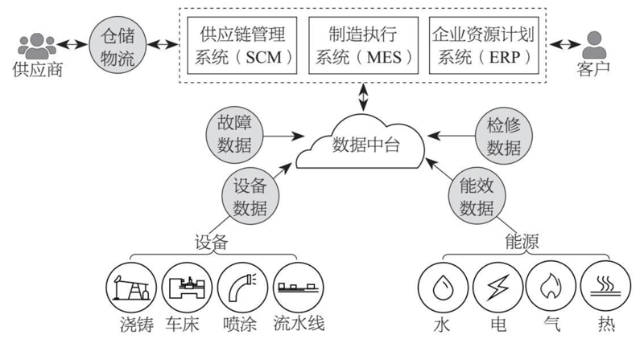
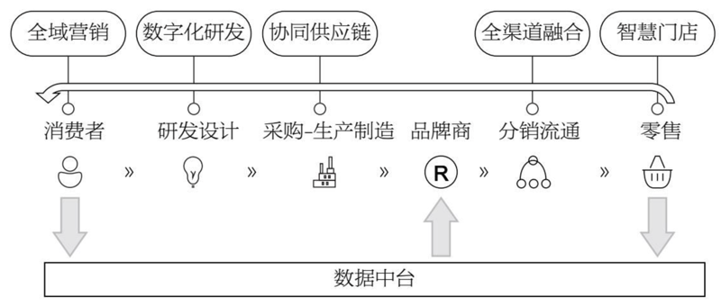
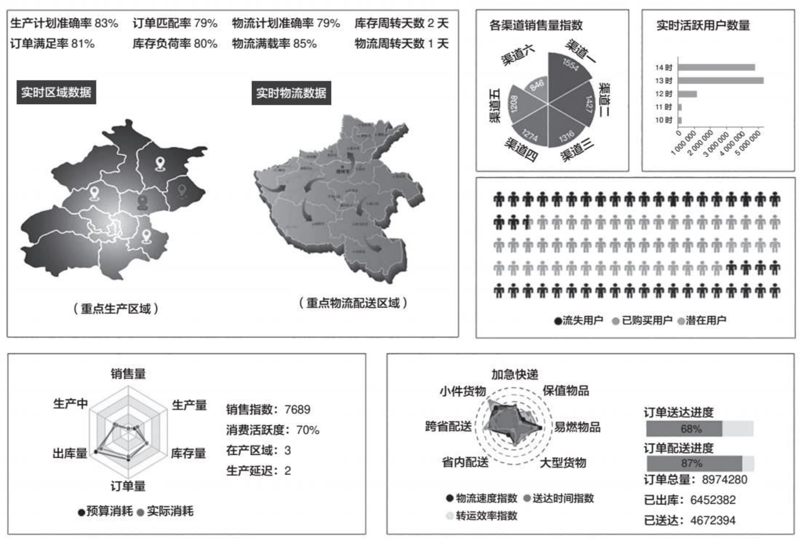
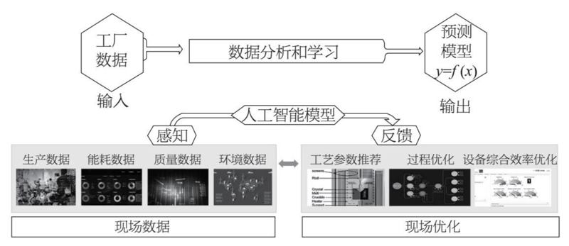
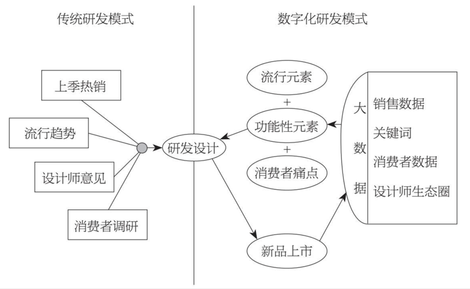
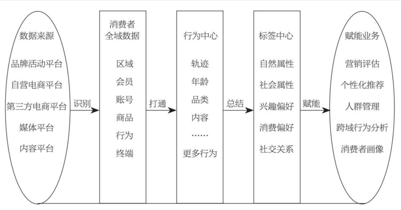

# 0501. 数字化赋能

人类用知识的活动去了解事物，用实践的活动去改变事物；用前者去掌握宇宙，用后者去创造宇宙。

— 意大利哲学家 克罗齐 —

前面几章主要介绍了 AI 思维的底层逻辑和操作方法。学以致用，本章开始，我们将切入到「用」的层面，聚焦于人工智能是如何运用于具体业务场景之中，赋能于各行各业以及方便人们的日常生活的。数字化赋能将是贯穿整章的基础概念。数字化就是 AI 思维在具体业务场景中落地的基础，因为 AI 思维运用于生产制造或商业活动之中，要实现智能化，最终做出决策需要数据的支持和驱动，而数字化恰好提供了 AI 思维决策所需要的数据基础，在此之上人工智能才能发挥其应有之义。

所以本章将会以数字化赋能为切入点，从企业如何打通数据来进行剖析，结合商业案例，让你更为真实地感知和了解 AI 思维是如何在具体业务场景中汲取营养、发挥作用的。数字化转型已经势不可当，数字化赋能也不是天马行空、赚取噱头的暗黑发明。在数字化时代中，数据就是产生价值的原油，我们所提到的案例也都是已经实实在在落地，并成功产生了预期效果的行业应用实例。通过这一章，我们会更加深刻地感知到发生在每一个人身边的数字化和智能化变革，理解实际的人工智能在具体业务场景下的工作和价值，在一定程度上也能达到为各位读者「祛魅」的目的。

## 5.1 行业数字化是大势所趋

近年来，从互联网经济到数字经济转型的大幕已经拉开，数字经济成为不断被提及的热词。2017 年 3 月，数字经济首次被写入政府工作报告，要促进深化大数据、人工智能等研发应用…… 壮大数字经济。数字经济的核心就是数字化，即数据成为驱动商业模式和商业决策的核心力量。从全球竞争格局和行业演变进程来看，数字化驱动产业的时代已经到来，无论是在制造环节还是零售环节，中国、美国甚至全球趋势都是越来越向智能制造和智慧零售方向发展，行业数字化转型已经势不可当，并带来了商业模式的革命性变革。

行业数字化转型的核心在于数据驱动，即业务流程数字化，数据成为核心生产要素和战略资产。美国政府认为，大数据是「未来的新石油」，是「陆权、海权、空权之外的另一种国家核心资产」。数据是产业进行全方位的数字化升级的源动力，业务的实施、发展和创新都离不开数据的支撑，与此同时，数据还为经济发展提供新的活力和动力。

行业数字化发展的趋势主要体现在三个方面：第一，新融合。大数据、云计算、物联网的发展和应用，导致数据爆发式增长，并且通过技术将底层数据打通融合，与具体业务场景的融合也越来越紧密。第二，新市场。随着数据的应用，互联网不断升级换代，电子商务、工业互联网、互联网金融、国际市场等新市场形成，企业也不断创新，发掘新的市场方向。第三，新应用。智能终端、智慧生产、智能制造、智慧零售等新的行业模式不断更新，并在实际业务中落地，「智能 +」为各行各业升级赋能。行业的数字化转型不仅为企业提供了创新和发展的方向，也极大地促进了消费增长，增加了市场的活跃程度，为经济增长带来了巨大的助力。

### 5.1.1 数字化的技术壁垒和解决方案

企业顺应数字化的大趋势是必然选择，但是首先遇到的关键问题是攻破数字化的技术壁垒，即如何做好数据的打通（data onboarding），这也是数字化的基础工作。过去的数据世界存在着许多技术困境，如果没有做好数据打通，就容易出现各种问题，影响业务的效率和创新。

第一，企业在业务中会产生大量的数据，这些海量数据关联复杂，而且专业性强、维度多。如果将这些数据杂乱无章地存放在数据仓库中，即使是调取和利用其中的部分数据，都需要花费很长的时间，降低了业务效率。

第二，在企业内部，关键数据总是会散落在业务系统的各处，甚至导致对一个用户在各个阶段的需求没有全局的把握。不同部门为满足各自对应的业务需求，往往会建立不同的数据库，导致数据难以整合，形成数据孤岛。在业务开发和运行的时候，不同的部门或者项目组往往不能统一协作处理数据，以致对数据重复开发，影响业务的整体效果和效率。

第三，企业基于数据开发业务应用时，需要对数据进行处理和维护，然后综合分析。但是，目前企业中数据开发和维护的人员配置很少，甚至没有，大量数据十分混乱，无法直接使用，从而导致在企业决策时调取数据困难，难以挖掘数据之间的关联，制约了决策的科学性。

如果不能对企业后台的数据进行较高的整合和处理，在分析生产制造和零售各环节时就会缺乏数据支撑，在业务实施中就会缺乏数据指导和优化，导致企业库存失衡，运营成本提高，最终导致客户流失和利润低迷。

这确实是企业数字化之前企业运行的现实状况。因此，在企业数字化转型中亟须着手做的就是将所有数据打通，将散落在生产制造和零售阶段的数据汇总，集中进行处理和利用。数据打通可以通过企业的数据中台完成。数据中台是企业获取、整合、存储、加工和利用数据的综合平台，连接了数据后台与业务前台，实现了企业内部数据的开放和共享，帮助我们沿着生产制造和零售环节打通了数据。

也就是说，在数据中台上的数据不再是散乱的，而是经过收集、整合和处理的数据，并且在中台架构之上会有一系列的系统，比如零售管理、智能算法、调拨管理和会员管理等。数据中台上可以进行数据处理，它将数据抽象成服务，再提供给前台。所以数据中台相比于数据库系统来说，不仅要获取、整合和存储数据，也要对数据进行加工和利用，进一步探索数据的内在价值以及数据如何对业务产生价值。因此，数据中台向业务前台提供的是可以直接为业务所使用的服务，更贴近业务前台。换言之，可以说数据中台所提供的服务都是围绕数据而来的，在数据和业务系统之间形成了闭环。同时，数据中台整合了后台的数据资源，通过加工和提炼，提升了数据质量和可用性，使得数据成为可以产生价值的数据资产，有利于快速、稳定地向前台提供服务，实现业务创新和发展。

当前国内外企业都越来越倾向于实现数据层面的一体化，已经有不少公司搭建了自己的数据中台，这是企业解决数字化转型的一个思路和逻辑。但是数据中台本身也是动态的，它连通了企业的各个部门和业务的全过程，协同各方、服务各方，其上的数据和提供的数据服务也可以根据企业业务的发展而不断地进行调整。大型企业打通方方面面的数据，将各业务阶段的所有数据均整合在一个平台上，需要极大的人力资源、技术手段和设备支撑，其难度之大可想而知。在具体的业务环境下，企业可以根据自身的情况，在生产制造和零售环节分别进行数据的全链路打通，如有需要再将生产制造和零售数据整合，提供相应的服务，反馈并驱动新一轮的业务发展。

### 5.1.2 生产制造数据打通

如前所述，数字化赋能首先要做好数据打通工作。在生产制造环节，我们需要将机器、设备、生产线、人、车辆、渠道、物流等物理形态，通过数据进行表现与加工，将不同格式的零散数据进行有效的打通与整合，建立标准规范的数据仓库，最终构建一个赋能生产制造全流程的数字化环境，实现数据的互联互通，从而挖掘数据的核心价值。

图 5-1 数字化赋能生产制造全链路示意图

如图 5-1，在生产制造环节的全链路上，从供应商到仓储物流乃至客户都有相应的管理系统，包括供应链管理（Supply Chain Management）系统、制造执行系统（Manufacturing Execution System）、企业资源计划（Enterprise Resource Planning）系统。我们要将这些系统数据打通在一起，才能做到生产制造环节全链路数据的打通。从原料供应商到客户的管理系统将会被集成在一个数据中台上，而这个数据中台会连接各方面的数据，包括企业设备数据、能效数据、故障数据和检修数据等。只有将这些数据统一汇总在这一个数据中台上，并且嫁接现有的供应链管理系统、制造执行系统、企业资源计划系统，才能将生产制造环节的方方面面打通，为数字化转型打好基础。

### 5.1.3 零售数据打通

如图 5-2，在数字化转型的背景下，企业零售环节的主要节点包括：针对消费者的全域营销，针对研发设计的数字化研发，针对采购、生产制造等环节的协同供应链，针对分销流通的全渠道融合和针对零售部分的智慧门店等。这些节点构成以消费者运营为核心的全域新零售。零售环节的全链路数据打通，就是要采集和链接以上节点的全链路数据，对业务目标进行深度优化。

图 5-2 数字化赋能零售全链路示意图

零售的全链路大致可以分划成三个部分，即消费者端、供应链端和零售端，在全链路的各个环节都可以进行数据打通，从而实现数字化赋能，具体而言：在消费者端，要对消费者进行全域的把握，消费者端包括全域营销、会员行为分析、忠诚度、付费偏好、内容运营等。其中，全域营销指的是在新零售体系下，以消费者运营为核心，以数据为原料，实现全链路、全媒体和全渠道的一种营销方法。全域营销的出现使营销过程越来越可视化，不再出现断层，从而实现零售全链路的精细化运营。例如家电品牌戴森通过全域营销，全面打通消费者数据，进行精准营销，2017 年「双 11」之后，无论是消费者的数量，还是单个消费者贡献的价值，都有了显著提升。

供应链是指产品生产制造和流通过程中所涉及的原材料供应商、生产商、分销商、零售商以及最终消费者等成员组成的网络结构。供应链端主要是价格、仓储、配送上的优化，具体包括价格分析、仓储规划、配送优化、销售预测等。供应链端能够打通从原材料到最终消费的环节，它有很多可优化的地方，其中的重要一环是针对销售的预测，也即对门店或区域的产品销售进行预测。销售预测是供应链的核心，因为产品供应链应该以市场需求为导向，而销售预测能够很好地体现出市场目前需要哪一种产品，需要多少。销售预测是每个企业都应该关注的事情，因为只有做好了销售预测，才能实现其与供应链的完美共舞。例如，华北地区的知名连锁超市 —— 物美超市，就是根据大数据分析下的销售预测进行备货和人力调度安排的。相比以前的传统模式，它的商品缺货率从 17% 降至 10% 以下，库存周转天数从 27 天下降至 17 天。

在零售端，线下门店可以通过软硬件集成的方法采集数据，在智能选品、智能进货、经营分析、营销分析、库存分析、导购管理等具体环节都可以通过数字化赋能，提升经营效益。以智能选品为例，以往线下店铺进货都是根据经验来选品，这样的商品更新速度慢，而且不一定完全符合自己店铺的风格以及消费者的需要。现在我们通过数字化手段，能够很好地解决这个问题。譬如，我们可以根据店铺位置、周边人群等信息为零售门店个性化地进行选品，帮助门店更好地卖货，降低缺品率和无效库存，用更少的成本获得更高的经营效益。

### 5.1.4 数字化和智能化相辅相成

数据中台是数字化架构中的基石，它将所有在生产制造和零售环节中的数据整合在一起。借助数据中台，企业管理者能够深刻把握各个环节的经营状况，科学、合理地制定策略。当企业各个环节的数据打通了之后，线上销售数据和线下销售数据均可以作为了解用户需求量的依据，真正实现生产销售一体化、线上线下双调节的理想状态。

以前，工厂制造的产品可能会卖不出去，在渠道中也可能不具备溢价能力，最终导致货积压在工厂里。现在的趋势是：借助数据中台，企业能够改变传统的销售模式，逐渐由渠道推动转为以客户为中心的打通价值链的运作模式。基于数据中台里打通的数据，企业可以知道客户的需求有多大，具体的需求是怎样的，并据此安排供应链和生产制造环节。通过数据中台，各个业务环节都能有所提升，实现增量收益。在数据中台发挥效果的过程中，企业能够借助 AI 思维实现进一步提升和优化。

我们已经知道，数据中台是实现数据打通和企业数字化的关键，打通数据后，人工智能就可以为企业做出优秀决策提供依据。「数据 + 人工智能」可以赋能更多的业务应用，因此，企业构建 AI 中台是十分必要的。在数据中台的支撑下，通过 AI 中台进行人工智能模型构建，不断演化和迭代，有利于向业务前台提供更加便捷和有价值的服务，加速从数据到价值的过程。数据中台为 AI 中台的应用提供了支撑，所以数据中台和 AI 中台是相辅相成的。

当然，AI 中台的建立也需要一个过程。因为，人工智能在任何企业的落地都是逐渐迭代的过程，包括世界 500 强在内的多数企业在运用人工智能时，都会在单点上先寻找业务落地的可能性和结合点，比如在工艺参数优化、会员运营管理、积分体系设计等业务领域率先尝试。当相应的人工智能应用在业务中产生了价值后，企业就会深入到更大范围的业务场景中。人工智能在企业的落地实践只有达到了一定的规模，才能从单点式的应用发展形成一个比较完备的 AI 中台，再进一步服务和赋能更多的业务场景。AI 中台这个人工智能大脑处理的数据越来越多，它和数据中台的联系就越来越紧密，并且在很多场景下，AI 中台还可以发挥自己特有的作用，驱动数据中台的形成、发育和完善。

具体来说，企业在业务应用中挑选出人工智能最能够产出价值的单点场景，随后考虑在这一单点上人工智能落地所需要涉及的数据，并在数据中台调取和使用相关的数据。如果数据中台上找不到这些数据，就会促成数据中台的扩建和完善，人工智能应用和从中产生的数据又可以和数据中台相互哺育和赋能。通常来说，不应该等到数据中台打通全局数据之后才升级应用人工智能，因为行业竞争是十分激烈的，等到那个时候可能为时已晚。正确的做法是选择业务上的单点场景进行人工智能落地，从而驱动整个数据体系的打通。

如图 5-3，它表示的是在全链路中数据中台与 AI 中台各自所处的位置。数据中台将来自数据后台的原始数据进行分析和处理，最后将打通的数据传递给业务前台；业务前台产生的数据最后也会再回到数据后台中，形成反馈的闭环，实现生产制造和零售环节的数据连通。数据中台和 AI 中台之间最良性的架构应该是逐渐演化的过程，这同时也是人工智能大脑学习发育的过程。人工智能在企业发挥作用的前提是对企业业务全流程的充分理解和掌握，所以必须获得全链路打通的数据。AI 中台通过打通的数据，在模型的加工下，形成决策。这样一来，人工智能应用也会驱动数据中台的构建。同时，AI 中台通过模型计算出的数据可以再次回到数据中台之上，不断循环和加工，并提供给业务前台使用。在实践过程中，为了让人工智能顺利落地，企业应当花费充足的时间与精力去思考和规划 AI 中台及数据中台的搭建。在这之前，可能大部分企业都没有这个需求，如果单纯靠人工进行工作，并不需要打通所有的数据，并且人工也没有能力去分析所有的数据。所以，企业的数据中台在人工智能需求的驱动下会越来越完善。

数字化与智能化相辅相成，数据中台和 AI 中台相互促进，共同发展。没有数据中台就没有 AI 中台的用武之地，有了 AI 中台就能产生进一步优化的业务结果，这时候企业管理者也就更有动力继续深化和提升数字化的进程。从这个意义上来说，人工智能也是企业升级的工具，可以推动企业内部的基础设施建设。由于数据打通和中台构建会产生较高的成本，所以企业实现数字化基础设施的升级不应该由技术层面驱动，而应该由具体业务场景的需求来带动。数据打通以及中台构建完成之后，就能够帮助企业提升业务场景的效益，产生增量的价值，最终也能够支持数字化基础设施持续的升级和改造。

图 5-3 数据中台与 AI 中台关系示意图

### 5.1.5 数据可视化平台

我们生活在一个充满了数据的世界里，但面对纷繁复杂的数据，我们经常感到无所适从。「得数据者得天下」的说法此起彼伏，但要通过数据的整理和分析来获得一个准确的结论并非那么容易。我们的大脑对视觉信息的处理要优先于文本信息，所以我们越来越倾向于利用可视化的形式将数据表示出来。数据可视化就是借助图形化手段，清晰有效地传达信息，以此帮助人们更好地理解数据。例如，我们早已习惯通过卫星云图来了解天气状况，也需要借助柱状图、饼状图等来汇报工作进度。而商业活动涉及的数据量非常庞大，数据之间的关系错综复杂，更加需要一个专门的数据可视化平台来直观地展现各项业务指标。

数据可视化平台要实现的是全链路数据的可视化。它具有两方面的作用：一是通过可视化的统计图表等形式呈现，让数据变得更直观；二是提供全域视野，打通不同类别、不同时间、不同地域、不同环节的数据，综合呈现。正是因为我们在数据中台上完成了每一个节点所产生的数据的收集、记录和连通工作，并将其与数据终端连接，实现了远程实时监控，可视化平台才能够像一个镜头一般，跟踪掌握整个流程中每一个节点上事物的状态和变化。

图 5-4 数据可视化平台示意图

图 5-4 是一个服装电商的产销协同数据可视化平台示意图。这家电商覆盖的销售范围很广，有线上线下的销售渠道。从可视化的角度来说，在生产、物流和消费端，我们能够利用产销协同大屏监控非常直观地得到一些数据，比如生产端的生产计划准确率、订单匹配率、订单满足率和库存荷载率等；物流端的物流计划准确率、库存周转天数、物流满载率和物流周转天数等。这让我们能够相对轻松地将整体运营数据了然于胸，以便对具体的操作事务做出及时调整。比如当发现库存周转天数有增多的迹象时（这可能意味着有滞销的潜在隐患），我们可以从生产端开始，马上调整相应产品的产出量，也可以进一步去查看物流端是否出现了怠慢的问题，或者在消费者端相应地推出一些促销活动，等等。这些数据的即时呈现，能够在很大程度上为企业降低风险，减少损失。

在用户端，通过可视化平台也可以非常直观地看到活跃用户、流失用户、已购买用户、潜在用户等的数据，这些数据在各个环节的运作过程中都能够清晰展示出来，并进一步指导企业做出精细化决策。比如像促销活动，我们只知道要在哪个节点做促销活动是不够的，我们还需要了解这个促销活动什么时候做、做哪些、怎么做等一系列问题。要想做到数字化落地，就必须要把这些问题具体化。而用户端的这些数据可以为我们提供帮助。比如，根据可视化平台提供的近期每天使用人数，我们可以知道哪天属于淡期、哪天属于旺期，以及这些日子的特征，是周末、月末，还是都是工作日，我们从中选取适当的时候来做精准促销，提升业绩。

数据可视化可以避免出现盲人摸象的情况，数据可视化平台呈现出的全域数据视野，为探寻业务运作的各项问题提供了机会和助力。对于企业决策者来说，他们肯定更愿意看到可视化的数据模式。当然这些可视化的前提假设和实现手段是已经有了打通的数据，然后才可以做到上面所说的可视化呈现。

数据中台提供了数据的获取、整合、存储、加工和利用的服务，让我们能够更好地认识数据和使用数据，这种服务是任何业务场景都需要的。而 AI 中台提供的是更加具有创造性和个性化的服务，通过人工智能模型发现不同场景中的精准需求，提供业务创新的机会，从而实现业务增长。因此，数据中台和 AI 中台是适用于业务发展不同阶段的基础设施，数据中台为 AI 中台提供了基础和养料，AI 中台的需求也会反过来促进数据中台的成熟。相应地，数字化与智能化也是企业发展的不同阶段，二者并没有严格的界限区分，数字化和智能化融合发展，相互促进，相辅相成。最后，通过数据可视化平台，我们可以更加直观全面地了解到商业活动中每个环节的状况和发展态势，这样在进行决策时就能更加有的放矢。

## 5.2 工业赋能：数字化的物理世界

18 世纪末，蒸汽机的出现使人们进入工业 1.0 时代；20 世纪初，电力的大规模应用使整个世界进入工业 2.0 时代；20 世纪 70 年代，电子技术、信息技术以及工业机器人的广泛应用推动世界进入工业 3.0 时代；现在，随着物联网、大数据和人工智能的融合应用，我们已经进入了工业 4.0 时代。在新一代技术革命浪潮中，数字化趋势已经势不可当。我们需要利用数字化技术促进产业变革，尤其是通过人工智能的应用创建具有适应性、高资源效率和更加人性化的新一代智能工厂。在这样的背景下，不仅需要将工业所处的物理世界数字化，数字化的目标还需要反作用于物理世界，驱动物理世界，改变物理世界。

1-3『突然想到瓦特的生命线：1736-1818，82 岁。（2021-02-28）』

数字化反作用于物理世界的第一步就是将物理世界抽象成标准化的数据集合，这是物理世界向数字世界转化的基础。这一步可以借助物联网（Internet of Things，简称 IoT）完成。物联网，顾名思义，就是「万物相连的互联网」，是将各种信息传感设备与互联网结合起来的网络，它可以在任何时间、任何地点将能够独立发挥作用的物体连接在一起，实现互联互通。所以物联网的核心和基础仍然是互联网，它只不过是在互联网基础上进行了延展，扩展到了任何物品与设备之间。物联网上涵盖了大量的数据，各设备相互连接并且不断地进行数据交换。将物联网上的数据经过数据采集、数据分析和数据处理后，我们再把这些数据存储在标准化数据集合里，物理世界的抽象过渡就基本完成了。

但仅仅完成数据的抽象是远远不够的，工业 4.0 时代要做到数字化驱动物理世界并改变物理世界。因此，这里我们要引入一个概念 —— CPS（Cyber-Physical Systems），即信息物理融合系统。这是一个综合计算、网络和物理环境的复杂系统，它将计算、通信与控制深深地嵌入物理过程，使之与物理过程密切互动，实现了计算进程和物理进程的统一，从而给物理系统添加了新的能力。信息物理融合系统包括了很多智能系统，通过建立物理世界数据的人工智能模型，在数据采集输入后，系统可以进行管理、操作和预测，从而把相应的决策和洞察再反馈到物理世界。

2-3『信息物理融合系统（CPS），在之前研读的有关「智慧工厂」多篇论文里看到。做一张术语卡片。（2021-02-28）』——已完成

所以，CPS 紧密连接了物理世界和数据计算，通过计算进程和物理进程相互影响的反馈循环，实现深度融合和实时交互来增加或扩展新的功能，达到实时监督或者控制物理世界的目的。也就是说，CPS 不但可以看作工业数据的集合地，而且同时将这些数据进行机器学习或深度学习，建立起物理世界的数据模型，并且基于这些数据模型产生智能预测和决策，从而最优化地驱动和改变物理世界。

总体来说，物理世界的数字化过程首先要有数据，然后通过 IoT 打通生产制造环节将数据整合在一起，再通过建立相应的人工智能模型，进一步理解整个生产制造过程，比如其中的某一个步骤需要怎么调控参数，怎么优化生产制造的目标，从而形成最优化的决策，实现效果的提升。其中，CPS 不仅可以实现针对物理世界的实时计算，还可以通过数字世界建立的模型将操控指令反馈到物理世界，驱动物理世界的调控和改变。

### 5.2.1 工业数字化赋能实现路线图

我们已经明确了工业数字化的总体目标：不但要将工业所处的物理世界数字化，而且还要将数字化反作用于物理世界，驱动和改变物理世界。如图 5-5 所示，工业数字化赋能的实现可以分为五个阶段：试点连接、全面连接、数据洞察、业务优化和链路集成。

2『工业数字化赋能的 5 个阶段，做一张主题卡片。（2021-02-28）』——已完成

图 5-5 工业数字化赋能阶段示意图

在试点连接阶段中，要完成试点工业设备连接、数据采集集成、设备故障收集和设备性能分析等，这是最简单的数据收集，可以在单点上完成。此后进入全面连接阶段，把所有生产设备、检测设备和客户反馈等相关数据通过 IoT 和其他手段收集到数据中台上，完成大规模数据的采集和全链路数据打通。

下一阶段就是在数据基础上，搭建初步的 CPS，形成完整架构，进行数据洞察分析。在这一阶段中，通过收集的全链路数据，建立人工智能模型，进行设备故障诊断、故障预测、可靠性分析、寿命预测和质量分析等。接下来继续完善 CPS，根据预测性结果，进行业务优化，对整个工业生产链路做出相应的资产性能优化、维护策略优化、备件库存优化和产品性能优化等。业务优化阶段完成后，进入链路集成阶段，实现上下游信息和流程的集成、资源的共享，完成从生产型企业向服务型企业的转型。这也是企业成为数字化领导者的实现路线。整个过程从分步连接数据，到数据洞察、迭代和扩展，再到链路集成和整合优化业务流程，最终形成业务模式的创新。

通过工业数字化赋能的路线图，我们可以更形象地理解智能生产制造的各个阶段 —— 从试点连接阶段，进阶到在 IoT 平台上连接更多设备和节点，对数据进行全面洞察，做出预测，从而优化业务目标，更好地提升产能、降低能耗、降低故障率等。工业生产的指标都可以通过数字化的方法进行优化，最终形成整个链路上的集成，向智能制造方向过渡和发展。

在工业数字化赋能的路线图中，要实现数字化赋能，最重要任务之一就是建立人工智能模型，也就是建立相关输入因素数据 x 及目标值 y 之间的相关函数关系。如图 5-6，模型的作用就是在获得相关输入因素数据（例如生产数据、能耗数据、质量数据和环境数据等）以及和生产目标相关的输出值后，对这些数据进行学习，进而通过人工智能产生因素数据和目标值对应关系的模型。在实际生产过程中，工厂将各生产过程中感知到的数据导入生成的模型，根据输出的结果完成决策和反馈，实现工艺参数推荐、过程优化和设备综合效率优化，最终实现预期的生产目标，如提升优良率、降低成本、提升效率或是节省能源等。

图 5-6 工业数字化赋能运作流程示意图

所以简单地说，工业数字化赋能的核心是提供全链路人工智能模型服务，通过分析工艺参数和关键指标之间的关系，进一步预测生产制造环节的关键指标，再根据预测结果完成相应的操控决策和反馈的闭环，最终为企业带来良品率提升、能耗降低和效益增加等效果。数字化赋能的过程完成之后，操作人员在生产制造中每一个环节需要关注的重点、操控的参数等，就都可以被科学地预测和制定。这样就可以做到生产制造环节的数字化赋能和优化。

以上的数字化赋能主要是针对生产制造而言的。虽然生产制造和零售是业务中两大不同的环节，但这一数字化赋能的方法论是通用的。也就是说，在数字化系统建立起来后，只要设定了业务目标，我们就能通过学习输入和输出之间的相关性进行预测性判断。至于如何操控系统参数，如何调整业务流程等，对于生产制造和零售环节的应用来说是异曲同工的。

### 5.2.2 国内智能工业案例

工业，在我们大部分人的眼中，就是一些与钢筋水泥打交道的产业，并且一直被划分在传统行业的范畴内。早期，行业内甚至流传着「工业不需要互联网」的言论。但随着技术的完善和落实，数字化、智能化系统越来越多地在车间中投入使用并取得了较好的运作效果。此时，「工业不需要互联网」的言论开始出现崩塌的迹象，「工业大脑」逐步在各地工业企业中广泛应用，不断攻占工业制造的各个领域。

通过数据的全链路打通和人工智能模型计算，智能工业可以深入到各行各业，达到赋能工业的目的。这样的例子比比皆是：在汽车行业，基于人工智能视觉处理的汽车工件合格性检测系统已成功在汽车零部件制造企业得到应用，有效地提高了汽车工件不良品检测效率；在烟叶行业的分级应用中，按照烟叶分级的国家标准，针对不同地域提供烟叶分级模型，可以有效地降低烟草公司人力成本，实现高效高质的分类。

智能工业可以运用到工业流程的各个环节，例如，在对产品的质量检测中，通过训练多层神经网络模型，可以对物体表面的缺陷进行大小、位置、形状的检测。在不规则缺陷检测方面，智能工业的准确率与传统模式相比有了明显的提升，譬如通过深度学习训练 LED（发光二极管）芯片缺陷识别及分类模型，能够有效提升产品质量和检测效率。再比如，光伏的电子发光检测应用通过数字化和智能化手段支持单晶和多晶暗域、黑边、黑角、各种隐裂等十数种缺陷识别，全面提升了缺陷分类准确率。

人工智能在工业领域成功落地的案例有很多，华菱星马就是其中的一例。华菱星马是一家重型卡车、重型专用车的生产商，在全国汽车生产领域占据着重要地位，其节能环保大功率发动机智能工厂项目已获批国家制造业互联网融合试点示范项目，其汽车生产的智能水平目前国内领先。华菱星马通过对工厂进行数字化、智能化的改造升级，建立起了多种智能化信息系统平台并进行相应集成，从产品的设计开发、生产、销售直到服务的全生命周期中，对各种数据进行采集和分析，真正实现了产品生产的数字化和智能化。

在发动机质量控制方面，华菱星马通过多种系统平台和技术手段实现了数字化赋能。在进行数据采集的同时，华菱星马还兼顾设备运行状态和质量管理的监控以及控制功能，统筹协调由多台全自动在线测量机和几十套装配辅助设备等组成的发动机生产线。如果接到生产订单，系统可以直接将订单信息及物料清单传递到生产线进行生产。在生产过程中还能记录产品的质量信息以及其他重要数据，形成完整的产品信息档案，搭建产品质量数据库，生成产品质量报表，以便在产品进入市场后进行产品质量追溯。

在提升服务质量方面，华菱星马基于现有的车联网系统平台研发了出一套智能服务系统「智慧华菱」。该系统借助人工智能，可以统计出自定义区域内车辆的通过次数，分析出车厂服务站的覆盖能力；其远程车况诊断功能，可以实时把控车辆的车速、转速、档位、里程、油耗、平均油耗、小时油耗、运行时间等，让用户对车辆的运行状态了如指掌，并且为预测性维护提供了有效数据支撑。对以上数据进行分析，也可以反作用于生产决策，对产品设计和性能提升起到积极的作用。

工业数字化除了应用于产品生产线上之外，对于优化产品质量也起到了举足轻重的作用。例如，天合光能作为全球最大的光伏组件供应商，电池片是其重点供应的组件。但有一段时间，天合光能在电池片的质量优化方面遇到了问题。他们尝试了多种方法，最终通过工业大脑平台解决了这个问题。工业大脑平台基于大数据，结合了人工智能以及工业领域的专业知识，在提高产品良品率、优化产品生产过程等方面发挥着很大的作用。该平台搜集了天合光能电池片从接收订单到产品生产完成全过程的所有数据，并进行了深度分析，再结合业务智能算法平台识别出生产过程中对电池片质量产生关键影响的重要环节，针对这些环节提出优化方案，进而在实际生产过程中不断调节该优化方案，直至达到电池片的质量优化目标。在工业大脑平台的帮助下，天合光能的电池片生产良品率提高了 5%，对天合光能产品整体质量的提升都起到了有效的促进作用。

从 20 世纪 70 年代开始，能源就和人口、粮食、资源以及环境一起被列为当今世界面临的五大问题。能源短缺会给人们的工作生活带来很大不便。而且，随着工业的发展，人们对于能源数量和质量的要求越来越高，加剧了能源短缺的问题。此外，能源使用过程中排放污水、废气等污染环境的问题也日益凸显。基于数字化的智能工业能在节约资源、提高资源利用率、防治环境污染等方面大有可为。

例如，三众能源就利用人工智能为全球累计降碳 70 多万吨，累计节约电量将近 60 万千瓦时。三众能源是一家综合型的能源科技公司，响应国家可持续发展战略号召，为节能减排的重灾区 —— 工业，提供人工智能帮助。三众能源研发的人工智能节能产品应用在燃气锅炉、空气源热泵、空调等大型能源系统上，能够很好地实现节能减排。人工智能节能产品的具体运行过程如下：首先，通过数据采集器，实时采集能源设备的运行状态、环境参数以及用户偏好等各种数据；然后，对这些数据进行人工智能分析，及时调整、控制能源设备的运行，达到节能减排的效果。

这套人工智能系统，应用在中铁建工集团开发建设的商业建筑里，为其提供了能源、电力的精细化管理服务。首先，通过对室内外环境的感知数据和住户对温度的需求数据的分析，人工智能能够对提供热能的空气源热泵进行自动调节，真正实现了按需供能。这样既节约了电能，又一举两得地减少了二氧化碳的排放。其人工智能节能产品可以保证供暖数据实时上传，并具有故障远程报警和定位等功能，如果出现问题可以及时发现。即使在无人值守的夜间，人工智能也可以根据数据自动调整出相应的解决方案。最终，这套系统取得了良好的节能减排效果，一年之内为该商业建筑节约了电能 70 多万千瓦时、减少了二氧化碳排放量 80 多万千克，在电力方面总计为其节约成本 85 万元。

### 5.2.3 国外智能工业案例

数字化为处于工业 4.0 时代的企业带来了无数的机遇与选择，基于数字化的人工智能推动打通生产流程，使企业能够高效节能地运作并做出更加准确有效的决策。所以数字化对于新工业时代的发展是一个决定性的存在，是实现工业 4.0 的基础和最重要的步骤，也是衡量企业业界水平的一大标准。除了国内的案例外，国外的工业数字化运用也早已如火如荼。

世界五百强公司之一、美国最大的电力公司杜克能源通过多样化的能源组合（如火电、风电、核电等），为用户提供包括电力供应、能源服务和能源运输等在内的多种服务，但与此同时，杜克能源还存在着厂房老化、发电厂运行效率低下、预测性维护能力不足等问题。杜克能源在其系统中已经具备了预测性维护措施，但这项措施有 80% 的过程是在采集数据，仅有 20% 用于分析，这就导致了杜克能源无法准确地预测系统问题。为改变这一现状，杜克能源将数据打通，并使用人工智能进行深度分析，对预测性维护系统和设备管理进行升级改造，实现了 60 个以上电厂的智能监测，使得杜克能源通过预测所避免的损失达 3 000 万美元 —— 这个金额早已远远高于项目成本。

巴西盖尔道集团是世界知名的钢铁制造商，在全球拥有超过 35 000 名员工。面对高能耗的钢铁生产过程以及高昂的人力成本支出，严格控制设备成本和维护设备的能力对盖尔道集团的盈利至关重要。仅在巴西，盖尔道集团就有 11 家工厂生产钢材，每年都需要巨额的费用去维护。即使是出现一个小小的设备故障，每小时也将造成上万美元的损失。在复杂的钢铁制造环节及多地区的场景下，盖尔道集团通过使用工业物联网，将集团所有生产设备的数据进行采集分析，实现了各类设备运行及故障情况的监控，即使是最轻微的异常也会被捕获到。同时，盖尔道集团还通过人工智能模型，识别出设备各类潜在的故障，并及时预警及采取相应行动。通过数字化和人工智能的手段，盖尔道集团一项原本计划 18 个月实现投资回报的项目，实际缩减到了 8 个月；同时在 6 个月内，盖尔道集团成功预测了 2 个严重故障，避免了对生产过程造成的重大影响。

在全球的智能应用里，视觉检测也是比较普及的一个应用。视觉检测已经在工业自动化系统里应用很长一段时间了，其涉及的领域遍布各行各业：仪表板的智能集成测试、汽车车身的检测、纸币印刷质量的检测和流水线生产检测等。视觉监测在这些领域中都起到了采集产品数据、提高生产效率和控制产品质量的作用。例如烟草行业就需要这样一款可以对工业生产线进行质量检测的机器视觉软件。传统的机器视觉检测的都是一些规则的产品，而这款软件能够应用于一些比较复杂、难以分类的产品的质量检测，比如说烟草的异物剔除和质量检测等。基于深度学习，软件首先对烟草产品进行图像采集，之后进行分析计算，最终再进行检测，大大提高了烟草产品质检的准确率，与人工质检相比，还大幅提高了工作效率。

如果说数字化转型是整个时代的机遇与挑战，那么数字化赋能就是企业抓住机遇和迎接挑战的重要本领。通过数字化、智能化的手段，企业的各个环节都被连接在了一起，各个方面都被赋能，既节省了生产成本，又提升了整体运营效率。AI 思维就是这样一种全面的思维，使我们在认识事物时能够做到面面俱到、统筹分析，做出正确决策。实现数字化赋能，必不可少地要经历这样一个过程：深入全面地采集数据，将物理世界数字化后，通过模型进行深入的数据分析，得出相应结论再在物理世界中进行应用，最终实现全面的工业赋能。数据是 AI 思维的基础，业务模式是 AI 思维的应用，数字化将二者串联起来，使 AI 思维真正能够在业务场景中落地。

## 5.3 零售赋能：智能产品定位和营销

生产制造和零售是商业运作的两个大环节。我们对生产制造环节，可能不太熟悉，接下来要说的零售环节则非常贴近我们的日常生活，其中的数字化赋能实际落地案例也比比皆是。比如，最近你正想买衣服，浏览的网页似乎有「读心术」一般，恰好呈现给你放在购物车里好久的衣服；或者夏天天气热，你正想去海边度假时，手机里的推送刚好就是泳衣、泳裤和各种潜水装备的广告，而且都还是你一贯喜欢的风格。其实，这些事情都是智慧零售的应用成果，智慧零售可以通过数字化赋能手段进行提升。

在零售环节，数字化赋能大有用武之地。首先是智能产品定位，即依靠大数据预测消费者诉求和潮流趋势，从而实现产品创新。也许你会有点疑惑，产品创新不是企业一直都在做的事情吗，那么智慧零售所做的产品创新又有什么不一样呢？为了解答这个问题，我们先来看看产品的创新模式。图 5-7 就是一个产品创新模式示意图，左边为传统研发模式，右边为数字化研发模式。

图 5-7 产品创新的传统和数字化研发模式对比示意图

传统的产品研发模式主要依赖于主观判断。传统产品研发设计主要依靠的是一种「经验主义」，比如参考上一季热销产品的反馈数据，上一季如果卖得好，下一季则继续按这个风格研发。或者，传统产品的研发设计还可以通过搜集、参考同类型产品中的流行商品的主要特征进行，但这种学习太浮于表面，很难做到真正的产品创新，画虎不成反类犬，更像东拼西凑的结合体，适得其反。此外，还有一种路径是根据设计师的个人意见来决定产品的最终形态，但很多时候，设计师的审美与消费者的审美是存在很大鸿沟的，这就使得产品难以与消费者的需求匹配。所以有时设计师们也非常苦恼，无法把握潮流，不知道消费者的诉求所在。当然，更实际的做法则是进行消费者调研，采取定性的调研来辅助设计，但是消费者调研成本高、耗时长，而且很难保证这些消费者是否是潜在消费者或者典型消费者，在信息反馈质量和样本数量上都有一定的局限性，同样会犯以点概面的错误。偌大的市场中，消费者的需求各有不同而且日新月异，个体的喜好早已无法代表整个市场的热度，传统研发模式潜在的痛点已经浮出水面：企业难以把握潮流趋势以及消费者诉求，研发出来的新产品无法完全满足消费者的诉求，从而导致消费者对品牌的忠诚度降低。

相比于传统的主观研发模式，数字化的产品研发模式则是通过客观的定量数据来反映市场趋势，将销售数据打通，通过数据洞察综合分析产品特征和消费者需求，再做出研发设计决策。因此，数字化的研发模式不再是过去的经验主义和局部主义，其基础和关键是最大程度上囊括所有市场数据。分析的数据范围，包括销售数据、关键词、消费者数据和设计师生态圈。销售数据，就是具体产品所在品类的整体销售数据，包括品类各品牌销售情况、品类明星单品等全方位数据。关键词是指将搜索引擎、社交网络和电商平台评论中的关键词，需要对其进行归纳。消费者数据就是消费者相关的数据，包括消费者群体画像、消费场景数据和消费习惯数据等。设计师生态圈则是由设计理念、设计产品、交流学习以及作品展示等各种内容组成的，在设计师的生态圈中出现的高频元素也是数字化产品研发模式的重要参考数据。在收集完上述一系列数据之后，可以在数据中台上进行打通，判断出相关产品的流行元素、功能性指标和消费者痛点，并借此指导新品的研发设计。新品上市后，随即产生的一系列相关数据会再反哺到数据中台上，为下一轮的新品研发做指导。这样，数据化研发模式整个体系形成正向循环，类似春泥一般，叶落成肥，滋养大地，又反哺出下一个花季。

以宝洁的产品研发为例，根据品牌多年积累下来的相关销售数据，总结分析产品触达的不同种族、跨年龄段消费者的规律和特征，宝洁研发部门抓住了很多消费者需求特性，如亚洲女性除了要面对松弛、皱纹等衰老问题外，面部轮廓逐渐横向外扩也是影响面容的一大问题。这是消费者的痛点，也就是研发部门的努力方向。根据这个发现，宝洁推出新品 ——OLAY 小脸精华，从感官上让消费者显得更年轻。经过这次的针对性研发，宝洁当季度中国区销量增长 30%，电商销售额上涨 80%，打了一场漂亮的数据战。

### 5.3.1 全域洞察

我们刚刚说到，数字化的产品研发需要基于消费者数据，数据越多，就越能精准地反映出来消费者需求和市场趋势，所以数据的广度是智慧零售中的一个关键问题。那么数据到底要多广呢？这就涉及「全域洞察」的概念。

全域洞察是消费者洞察的一种实现形式。所谓洞察就是深度理解，消费者洞察就是通过数据理解消费者，抓住消费者的真实需求，这是面向消费者营销的核心。图 5-8 是全域洞察的示意图。全域洞察的数据来源主要有品牌的活动平台、自营和第三方电商平台、媒体平台以及各种内部平台。

图 5-8 全域洞察示意图

洞察关注的消费者维度包括所在区域、会员、账号、商品、行为和终端等全域数据，将这些数据围绕消费者进行打通，将同一消费者的数据汇集到一起。数据整合后，我们将会对消费者的关键信息进行提取，例如轨迹、年龄、品类和内容等，构成行为中心。行为中心里面聚合了各个业务领域中消费者的行为，包括主体、时间、行为、内容及行为度量。最后，根据这些信息归纳总结出个性化标签，例如消费者的自然属性、社会属性、兴趣偏好和消费偏好，形成标签中心。与此同时，标签中心中还包括社交关系，即消费者之间的关系网络。数据的整合、处理和标签化是消费者全域洞察的核心过程，它可以在数据中台上完成。

消费者洞察可以赋能实际业务，例如营销评估、个性化推荐、人群管理、跨域行为分析以及消费者画像。比如个性化推荐，当我们真正做到对消费者的真实洞察后，我们就能知道不同的个体消费者有哪些独特的产品需求，从而有的放矢地进行高精准的产品推荐，直击目标，百发百中。相比于之前模糊认知下的乱投放、放乱箭，全域洞察下的个性化推荐效果自然更加显著，效率也有所提高。例如，中国移动开发的智能推荐平台就可以通过消费者洞察，精准地实现对消费者的个性化推荐。该平台通过数据分析出消费者的需求和偏好，根据这些信息不断调整模型参数，提高了推荐的准确率。目前，中国移动的客户端以及阅读、视频等频道通过该平台的赋能，真正实现了针对不同消费者千人千面的个性化推荐。

### 5.3.2 全域营销

全域营销指的是利用数据和数字化工具，进行以消费者运营为核心的智能营销。传统的营销方式推荐的可能不是消费者真正需要的，或者由于推荐流程过于冗长，等到消费者真正了解产品时，他已经不需要了。而全域营销以消费者的需求为核心，它的目的就是提升消费者在全渠道的消费体验，从而达到消费者与品牌关系全链路的精细化运营，为商家的营销和品牌建设赋能。全域营销分为三个方面：全域策略、全域传播和全域运营。

全域策略，是在策略层面做到洞察人群的价值，发现相应机会点，以达到高效创新。这里主要挖掘消费者的自然属性数据和品牌多源数据，将这些数据融合，为企业构建消费者画像体系，以此制定相应的人群策略。比如一个公司知道它的消费者大部分是年龄 30 岁到 40 岁的女性城市白领，那么根据这个属性，针对这类人群的相应特点和消费习惯，就可以更准确地进行相应的广告话术和用语包装等营销策略调整。

全域传播包括两个方面：在认知层面对消费者的曝光触达，在兴趣层面与消费者增进关系，因而它需要对消费者数据有更多认知，需要进阶到对数据的深入洞察分析。一方面，经由营销活动沉淀，完成对消费者画像的数据整合和分析；另一方面，通过消费者洞察实现全链路消费者行为及流转分析 —— 因为从消费者第一次接触商品开始，到他实现购买或转向其他商品为止，这条链路上的很多关键节点甚至是转折，都是需要分析的。这些关键点可以是某个促销活动页面，因为这可以说明这种促销活动页面是能够引起这位消费者的关注和兴趣的；也可以是消费者浏览商品评论的行为，因为这说明这位消费者更为看重口碑；又或者是他的搜索行为，因为如果他搜索的基本都是名牌，那么我们就可以推知品牌的声誉可能对他更有吸引力。我们需要根据之前的数据，推导出什么样的人对什么样的营销活动更加敏感、更加关注，了解消费者的兴趣点所在，最终达到传播效果。

全域运营，包括侧重于忠诚层面的消费者运营、侧重于购买层面的店铺运营等，都可以通过相应数据进行增值服务和激活。相比于策略和传播，运营更偏向于消费者价值的最终落地。知道了在哪个传播节点、用怎样的话术能够触动消费者之后，我们要将这些内容进行整合落地。当我们知道网站消费者或门店消费者的人群画像后，我们在每一次的营销活动中都可以正确把握消费者的特点，从而增加营销运营活动的成功率。比如，都市白领喜欢通过新奇有趣的网文来认识新产品并产生购买冲动，且对品牌有着执着的追求，那么我们的运营就可以突出「大牌」「火热」「打卡」这些宣传文字，并且将发布宣传渠道侧重于网文传播，实现精准运营。

我们再对全域营销的这三点进行回溯：策略层面需要洞察人群的价值，创新机会点；传播领域要精准触达和曝光，精准增加和消费者之间的关系；运营领域，无论是店铺运营还是消费者运营，线上线下运营领域都要结合对消费者的认知，进行全域的精准营销优化。当然其基础还是以消费者为中心，打通整个营销数据。下面我们将策略、传播和运营三点结合起来，举两个成功运营的案例，以便读者全面认知。一是商场的运营，以华润五彩城的获客率提升为例；二是房地产的运作，以金茂府的销售量猛涨为例。

华润五彩城是北京地区集时尚购物、生活配套、餐饮、娱乐、文化和运动为一体的多功能、多主题大型区域性商场。华润五彩城通过对商场消费者各维度的大数据进行分析，了解到消费者在各时间点的交互情况，并据此策划营销活动。比如在某一个时间点，华润五彩城的人群种类和分布都有哪些特征，抓住这些特征定点地进行相应的商家和产品的推荐。经过数据分析发现，华润五彩城的受众已经具有从过去的家庭客群转变为以年轻人消费为主的态势，并且 90 后、95 后消费者占比都分别接近 20%，而 40 岁以下的消费者占比也达到了 70% 左右。也就是说，年轻群体已经成为商城的消费主力。从这个认知出发，华润五彩城形成了从宣发到触达再到消费的全面数据闭环，并对商城的规划做出调整：将商城从餐饮儿童驱动型风格转变为时尚中产家庭综合型运作模式，增加轻奢、化妆品和时尚配饰等商铺的比重，并举办各类触达活动，例如联合天猫做「双 11 快闪店」、打造「积分 ETC」功能、品牌活动、会员专属优惠日和会员沙龙这些新潮的活动形式。通过消费者洞察，华润五彩城对广告投放方式进行了改良，实现了广告的精准投放，通过其不断攀升的客流量和车流量，我们也能看出消费者洞察的巨大作用，其在 2018 年的销售额超过了 18 亿元，更是证明了这一事实。这也体现了在数据的支撑下，全域营销可以促进企业的发展，带来更大的效益。

对于房地产商来说，基于楼盘以及目标受众分布的商圈大数据分析，可以产生客群洞察和精准营销的决策方案，实现房地产行业消费者数字化管理，其精准营销效果可显著提升。通过数字化赋能的手段，依托大数据对不同场景下消费者需求的强大理解能力，房地产行业可以提升多场景分析和决策的能力。

例如著名的房地产品牌金茂府就是智能营销的积极实践者。金茂府通过楼盘和目标消费者大数据分析提供精准营销方案。对于房地产行业来说，对人群的定位特别重要。无论是开发一个楼盘还是楼盘的销售和运营，都需要知道潜在消费者所在以及他们有哪些需求和爱好。打通整套数据之后可以对营销客群进行深度洞察和精准营销。这样一来，金茂府就能更懂得消费者的需求，比如在消费升级的浪潮下，金茂府通过大数据分析发现，住宅的消费群体除了一些基本的住房需求外，开始更加关注住房的观赏性，对小区的美化和绿化有很高的要求，所以金茂府十分注重外部自然环境的美化，绿化率达到 30%。在实现了相关新品定位落地后，其营销渠道也开始通过数字化赋能打通数据体系，进行深度营销洞察，在洞察的基础上再进行精准分析，形成具有品牌特色的营销文案，精准投放到目标消费人群那里。在房地产市场经历了一段时间的消沉的大背景下，金茂府却运用数字化赋能不断扩大自己的市场，成功进驻了华北、华东、华南、华中和西南 5 大区域。由此看来，或许数字化赋能是房地产转型的一大关键。

通过数字化的深度运用和赋能，不仅商场营销和房地产营销能够实现显著的收益提升，其他行业也是如此。经由数字化赋能，行业内可以实现对全域数据的认知和分析，从而洞察消费者的价值点，找到营销的创新点以及以往营销过程中存在的问题，最终优化产品定位和营销运营。通过上述案例我们可以知道，数字化赋能是对整个行业的赋能，它可以为行业带来许多积极的改变。

大数据时代下，数字化赋能是企业在竞争激烈的市场中站稳脚跟的必经之路。用不好体量庞大的消费者数据，它们就是一堆不产生任何意义的乱码；用得好，它们就是企业生根发芽的基石，是价值难以估量的企业资产。数字化赋能提供的就是为企业化数据为效益的智慧，它将这一智慧嵌入产供销的每一个环节之中，为整个商业链路提速增效。它适用于各行各业，最终也将是全球商业未来发展的大趋势。数据是 AI 思维的基础，所以数字化赋能也为 AI 思维的落地夯实了基础。