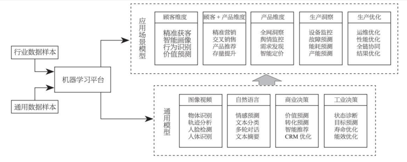
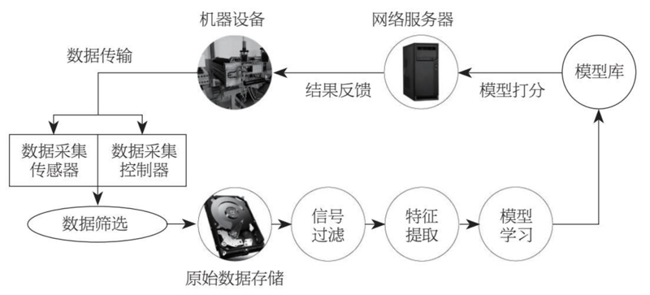
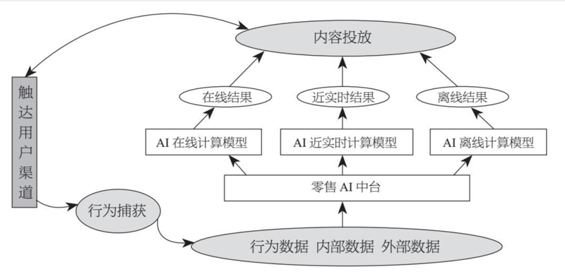

# 0601. 企业级 AI 中台

虽然我一直和你说要追求卓越，要实现最后的 1%，但是这并不意味着我们不可以接受部分改进。很多时候，一个完美的结果需要完成很多改进，而不会一步到位。

—《态度》—

知行合一，学以致用，本章还是从「用」的角度展开，阐述人工智能如何在实际的业务场景中落地，并为企业创造价值的。本章先从人工智能治理的困境入手，引出 AI 中台的重要性和必要性。通过对工业 AI 中台以及零售 AI 中台的案例分析，你会真正了解 AI 中台是如何发挥作用，为企业赋能的。

我们在前面讲过人工智能决策引擎运行的全过程，包括对历史数据的特征处理、机器学习、模型评估、模型生产以及模型监控。读完本章之后你会发现，正是因为有了 AI 中台的存在，人工智能决策引擎才得以在企业实现落地。大量生产制造和零售环节的案例既证明了 AI 中台可以解决人工智能落地过程中管理难、利用难、可靠性低的痛点，也表明了 AI 思维是一套从理论到实践一脉相承的完整方法论。

## 6.1 美好而混乱：AI 治理的困境

回顾之前，企业将生产制造环节和零售环节的数据收集起来，在数据中台上进行打通，在具体的业务线层面会产生人工智能应用的需求点。无论是生产制造领域还是零售领域，都会逐步在单点上建立起相应的人工智能应用。但随着人工智能应用落地数量增加，人工智能模型就会出现零散而混乱的状况，企业在管理和利用这些人工智能模型时就会面临一些需要解决的痛点。

第一个痛点是管理难。从生产制造到零售，如果每一个业务环节都通过人工智能进行升级，可想而知，产生的人工智能模型数量是非常大的，而且会分布在不同的业务部门中，显得零散而混乱。那么如何管理这些不计其数的人工智能模型呢？现有的人工或者传统的信息管理手段似乎都不能有效地完成任务，所以对人工智能模型的管理是企业在智能化过程中形成的一个新的需求和领域。

第二个痛点是利用难。对很多企业来说，利用人工智能模型进行业务洞察和优化，存在相当大的壁垒和障碍。因为人工智能应用不像传统的应用软件，它涉及核心的业务决策，所以必须用专门的手段管理、监控和持续优化，若缺少人工智能专用的系统和平台，则很难发挥其价值。

第三个痛点是可靠性低。人工智能模型在管理不当的情况下非常容易出错，而且较之传统的数据分析更为复杂，出错的可能性相对大很多。单点式的人工智能模型散乱在生产制造和零售环节的各个业务节点中，无法确保输出结果的可靠性，从而无法驱动企业实现数字化智能决策，也就无法驱动相应业务的提升。

这些痛点都是围绕业务而生的。当人工智能逐渐深入到业务之中后，散落的人工智能应用会越来越多，这时候，不但数据可能凌乱地分散在各个平台上，形成数据孤岛，人工智能模型也会非常混乱，甚至管理人工智能模型本身也会成为业务痛点，因此必须通过一套标准化流程来应对和优化整个人工智能模型生产过程中所涉及的各个环节，构建一套相对标准化的、可延伸的，并在企业内可发挥价值的 AI 中台，来统筹管理所有散乱的人工智能模型和应用，并驱动其不断优化和迭代。

我在 PayPal 工作的时候，需要同时管理几百组不同的人工智能模型，这些模型分别对应了不同的场景预测，比如有一系列预测用户行为的模型，也有各种预测商家价值和风险的模型，而且每过一段时间，这些模型又会用新的数据刷新。在没有系统化使用 AI 中台之前，由于人工智能模型的混乱出现了很多问题，比如预测模型和应用场景没有最佳匹配，因此它不能恰如其分地给出满意的预测，最终在实际业务中不能够带来任何提升。发现是人工智能混乱引发的问题后，我带领团队开始构建 AI 中台，用平台化的模式管理这些模型，最终人工智能混乱的问题得以解决。对于软件怎么开发和管理，已经有很多成熟的方法论，而对于人工智能怎么治理，则可以通过平台化的方法论，在数据中台上进一步构建 AI 中台，为如何把人工智能模型更有效地管理起来提供了一些方向性的思路。

AI 中台就是为企业提供整合化和规模化智能服务的基础设施，它依附于数据中台之上，在企业里实现人工智能决策引擎。也就是说，AI 中台是在产供销全流程数据基础上进行模型建构，从而实现精准决策，使价值落地的。例如，从零售角度来说，用户的相关数据会留存在搜索渠道、社交渠道、电商渠道、线下渠道和客服触点里，我们在这些打通的数据基础上，构建 AI 中台能力，服务更多应用，而不仅仅局限在单点上的人工智能模型。当模型的数量达到一定规模后，我们可以通过 AI 中台提升人工智能模型运作的效率。所以，当企业数据打通之后，构建 AI 中台能够进一步提升和优化业务目标，实现增量的价值。

因此，AI 中台是在数据中台之上的延伸，如果说数据中台是对直接业务需求的响应，提供的是基础的服务，那么 AI 中台的作用就是实现业务的创造性发展。一方面，AI 中台实现的前提是基于数据中台的全链路数据打通；另一方面，数据中台和 AI 中台相辅相成，可以提供个性化的服务，智能驱动业务发展，甚至能够创造新的业务模式。所以说，数据中台不是数据分析利用的终点，而是业务创新的起点。通过 AI 中台和数据中台的整合，企业可以快速、规模化地利用 AI 思维创造价值。

### 6.1.1 机器学习平台

机器学习（包括深度学习）是人工智能发挥作用的核心，因此 AI 中台的核心就是机器学习平台，其中包括一套成熟的机器学习流程运作，涵盖从数据出发进行特征处理、样本调节、模型训练、模型参数调优、模型验证和提供预测服务的各个步骤。图 6-1 对机器学习平台做了梳理，机器学习平台的输入包括客户数据、行为数据、交易数据、机器数据、生产数据等，需要预测的目标也都会输入到平台上，经过以下各个流程的加工：

图 6-1 机器学习平台示意图

第一步，通过对原始数据的提取与融合，形成结构化的、后续步骤可以操作的数据。

第二步，通过数据特征向量化，将结构化的数据转换为特征向量。

第三步，对特征向量进行缩放和归一化处理，这些对特征数值的调节能够优化后续人工智能模型的效果。

第四步，通过特征选择和降维，降低特征向量的维度，形成建模样本。维度过高会对后续模型训练产生影响。

第五步，通过各种统计采样方法对建模样本进行样本调节，生成均衡样本。均衡的样本有利于产生优质的模型。

第六步，根据均衡样本进行模型选择和训练，产生初级模型。

第七步，利用网格搜索、随机搜索等方式对初级模型进行模型参数调优，形成优化模型。

第八步，将优化模型进行模型验证，合格后输出模型至模型仓库。

第九步，利用输出模型进行预测服务，给出预测分数。预测通常是以打分形式体现，无论多么复杂的人工智能应用，都是通过复杂的流程，最终输出对事件、流程或个体的打分。这个打分既可以是实时打分也可以是批量打分，既可以是在线的，也可以是离线的。获得预测分数后，根据分数产生针对实际业务的决策。

1-2『这里的机器学习平台启发很大，设计流数据一体化平台可以按照这个方向走。做一张主题卡片。（2021-02-28）』——已完成

在实践中，人们通过对中台上已经打通的大量生产制造和零售环节的数据进行复杂的处理，对大量的数据实现深入的人工智能分析，最终达到指导和优化决策的目的。无论是生产制造环节的预测还是零售环节的预测，通过上述平台都可以实现标准化的管理。有了这套体系后，开发新的人工智能应用的时候就不需要重新开发框架，而是利用这个平台在每一个环节上通过简单的配置和脚本进行定制。对于实际应用来说，如果让每一位开发人员修改平台本身，就会容易出错，所以，只有把整套平台尽可能地固化下来才是最优的，在统一的环境下用一套完备的平台治理人工智能模型，降低它本身带来风险的可能性，这样也有利于企业人工智能体系的迭代和发展。综上所述，在人工智能已经有一定应用空间以后，企业适合建立一个以机器学习平台为核心的 AI 中台，这样可以确保人工智能模型之后的延伸和发展具有可靠性和易管理性。

### 6.1.2 从机器学习到应用定制

刚刚我们谈到了 AI 中台的核心是从数据到预测的机器学习平台，就像数据中台里打通的数据一样，机器学习和深度学习模型是 AI 中台重要的部分，如图 6-2 所示，下面我们来看一下各种不同的模型是如何架构和产出的。

各种通用数据在数据中台上汇总和融合，为 AI 中台的运作提供了通用数据样本。在 AI 中台中，当通用数据样本输入后，就可以在机器学习平台上进行建模，生成通用模型，例如图像视频、自然语言、商业决策和工业决策领域的通用模型，来解决通常所见的预测问题。具体而言，图像视频领域的通用模型包括物体识别、轨迹分析、人脸检测和人体识别等；自然语言领域的通用模型包括情感预测、多轮对话、文本分类和文本摘要等；商业决策领域的通用模型包括价值预测、转化预测、智能推荐和 CRM 优化等；工业决策领域的通用模型包括状态诊断、目标预测、寿命优化和能效优化等。因为机器学习和深度学习具有反馈和自学习的功能，中台上的模型训练用到的数据越多，形成的通用模型效果也就越好。但是，通用模型的建立主要是依据大量通用样本数据，所以通用模型本身对于具体场景的应用而言不是最佳的，没办法做到十分精准的千人千面。就像穿衣服，上学时候的校服或者工作时候的职业装都能够套在每个人身上，但对于个体来说一定不是最好看、最合适或者最舒服的，每个人的体形、性格和喜好不同，应该有更精准的、定制化的穿衣解决方案。

图 6-2 定制化模型体系示意图

AI 中台的最终目的是对企业的决策产生影响，因此仅仅局限于通用模型层面是不够的，机器学习平台还需要包括应用定制模块，产出应用场景模型，提升跨场景应用效果。虽然通用模型在一定程度上是可以跨场景的，但由于对行业和具体应用场景的认识不够深入，效果不够理想。例如，在物体识别领域，通用的物体识别模型是用大量数据进行训练而成的，但还是没法识别新的物体种类，这就涉及场景定制化，需要根据行业样本建立起应用场景定制模型。以箱包品牌为例，在此之前，虽然可能已经有了通用的箱包物体识别模型，但还是没法识别特定品牌款式的箱包，因为每个品牌都有品牌特有的箱包设计，例如简单的公文包、优雅的手提包，可以是方的也可以是圆的，可以是金属的也可以是帆布的，没有相应的数据就没办法进行最佳的识别。在这种情况下，也需要通过场景定制开发，形成场景定制模型。人工智能的最佳实现路径并不是单独开发一个识别具体款式箱包的专有模型，而是要先有基础的物体识别能力，再把个体品牌的具体模型引入。比如在通用模型的基础上，通过某个箱包品牌提供的箱包样本，进行深入迭代，就可以识别个性化的品牌了。

因此，通过行业数据的输入进行迭代以后，通用模型进行进一步学习和演化，能够解决商业场景的具体问题，也就形成了应用场景模型，具有了相应的商用价值。应用场景模型有很多，例如，在顾客维度包括精准获客、智能画像、行为识别和价值预测等；在产品维度包括全网洞察、舆情监控、需求发现和智能定价等；在顾客加产品维度包括精准营销、交叉销售、产品推荐和存量提升等；在生产洞察维度包括设备监控、故障预测、能耗预测和产能预测等；在生产优化维度包括运维优化、性能优化、全链协同和结果优化等。这些行业场景下应用的具体问题都可以通过应用场景模型进行恰当的决策。

从通用模型到应用场景模型是一个迭代递进的关系，一般不可能仅通过少量训练样本就产生这样的场景化能力，而是需要很多通用层面模型能力的沉淀，然后才能在具体的业务场景下定制开发出特定的模型解决方案。在生产制造和零售领域，随着模型学习的发展，一般会沉淀出效果良好的基础模型，它未必适应每一个具体的业务场景，但通过整合具体场景的数据进行学习，可以定制化生成最适合场景的一系列模型。

总结一下，AI 中台的核心就是机器学习平台，既能够产生通用的模型组合，也能够产生具体场景的行业应用模型。具体来说，就是通过大量数据的沉淀和打通，形成通用模型，再通过行业样本训练，形成智能程度更高、为场景定制化的模型，模型运算的数据再回到平台里不断优化和迭代，最终提升平台的整体效果，满足业务需求。

### 6.1.3 搭建 AI 中台

经常有企业想通过调取腾讯或者百度人工智能接口的能力来搭建自己的 AI 中台，这样可行吗？我的答案是可行，但由于百度和腾讯并不清楚和理解企业所需要的具体应用场景，所以这里得到的是通用模型。这些模型可以作为最终模型的出发点，产出初步效果，然后必须要结合场景深度优化，在通用模型基础上融合行业样本，迭代出新的模型，最终形成生产制造或零售领域里一系列定制的专属模型，帮助企业实现商业化落地。很多企业的人工智能创新在这一步停滞不前，因为它们倾向于调用腾讯或百度之类的人工智能接口，而这些接口不是定制优化的，所以运用起来就会发现很多问题不能得到妥善处理。

在实际应用中我们也发现，通用的人工智能自动问答系统在银行应用中只能做到 60% 左右的准确率，然而通过定制化模型，我们能达到接近 90% 的准确率。为什么能提升 30% 左右的效果？正是因为我们对其进行了定制化处理，所以效果远优于通用模型。如果没有定制专属的模型，企业就只能调用外部人工智能接口，而外部人工智能接口只能提供一些基础功能，很难满足行业的个性化运营需求。

感知类的能力平台也是如此。在语音识别领域中，通用接口的语音识别能力一般只限于普通话，在麦克风离说话者口部很近的情况下，能达到 95% 以上的语音识别效果；但只要说话者说的是普通话以外的语种，例如四川话，语音识别的效果就会大幅下降，因为通用接口一般无法识别普通话以外的定制化内容。那么，要识别四川话该怎么办？那就得拿大量四川话样本对其进行模型训练。这就需要很多定制化的开发，而不是仅仅使用通用平台能力。

从以上可以看到，一方面，AI 中台能够对散乱的单点人工智能模型进行整合和管理，保证人工智能模型有条不紊地运作；另一方面，在 AI 中台的定制化模型体系中，各个环节层层相连，在通用模型基础上，迭代场景专属模型，最终经由 AI 中台、机器学习和深度学习赋能，优化预测效果，实现应用场景下的最佳决策。前者能够保证人工智能模型正常运作，后者则能进一步让人工智能模型在场景中落地，这些都说明了建立 AI 中台的必要性和 AI 中台能够产出的实际效果。无论是生产制造环节还是零售环节，在产供销链路的每个节点里，AI 中台都能嵌入其中并实现深度赋能，充分发挥人工智能模型的价值，优化决策和效益。

AI 中台在企业中实现了人工智能决策引擎，以打通的数据为养料，帮助业务前台做出决策。AI 思维存在的意义是指导我们更好地工作和生活，AI 中台就是 AI 思维转化为实践的实现载体。AI 中台的基础框架部分上面已经进行了讲解，所以我们现在应该解决的问题是在实际的应用过程中 AI 中台是如何发挥作用、如何对各项业务进行深度赋能以及如何帮助企业实现效益的提升的。后面我们会通过对不同领域的具体案例进行剖析，找到这些问题的答案，这样一来，我们一方面能够清楚地了解 AI 中台的操作流程，另一方面也能更加了解在生产制造和零售环节中 AI 中台的运用现状。

## 6.2 以生产目标为核心，提升智能制造水平

人工智能领域权威学者吴恩达在 2018 年工业互联网峰会上说过：「人工智能是新电能，一百年来，电能为很多企业带来了大量的改变，今天人工智能也会为这些企业带来一样的改变。」更有人说，是人工智能带来了第四次工业革命。「革命」就意味着颠覆，AI 中台就是人工智能颠覆时代的发电机。下面就让我们一起来了解，AI 中台是如何在历史的洪流中推动工业向前发展的。

在工业领域，生产制造是最重要的环节。生产制造的目标是提质、增效、降本和减存，这也是 AI 中台优化工业生产环节的目标。首先我们需要知道，AI 中台要发挥作用，通常需要先收集生产制造过程中各种各样的数据。企业的数据仓库里，存储了大量数据，包括原料、采购、生产、渠道和销售等各环节的数据，然后通过数据中台将数据打通。AI 中台要做的就是对这些打通的数据进行学习，生成定制化模型，对工艺、损耗和良品率等进行监控和诊断，得出生产制造环节相应的预测。最后，依据输出的决策进行反馈，在优化质量、降低成本、增加效能和减少库存等方面做出优化，实现生产制造的智能化转型。接下来，就让我们来详细了解 AI 中台在生产制造环节是如何具体应用的。

### 6.2.1 工业 AI 中台总体架构

工业 AI 中台就是 AI 中台在生产制造环节的具体应用，其总体架构如图 6-3 所示，包括数据采集、数据筛选、信号过滤、特征提取、模型学习和结果反馈六大模块，具体流程包括以下步骤：

图 6-3 工业 AI 中台示意图

第一步，数据采集：通过数据采集控制器和数据采集传感器从机器设备上取得相应数据。

第二步，数据筛选：因为生产制造环节产生的数据非常多，所以需要对原始数据进行一定的筛选。

第三步，信号过滤：对数据进行信号过滤，一般包括数据清洗、信号同步和信号分割等操作。

第四步，特征提取：对过滤完毕的数据进行特征提取，例如对机器特征、原料特征以及时间和频率域特征等的提取。

第五步，模型学习：将提取的特征数据通过机器学习实现性能预测、能耗预测和故障预测等功能。

第六步，结果反馈：最终由模型输出的控制参数反馈到机器设备上，从而操控机器设备，实现智能优化。

2『这里的工业 AI 中台架构，补充进主题卡「机器学习平台」。（2021-02-28）』——已完成

这是生产制造环节中 AI 中台的典型架构。传统上，生产制造的参数仅凭操作工人的经验决定，有时甚至是工人一时兴起拍脑袋决定的，控制水平很大程度上取决于人的主观判断和操作水平，非常不稳定。有时候一不小心操作过头或者是疏忽大意了，都会影响最终的生产效果。而人工智能不仅可以解决这些问题，满足生产制造的需求，还能够降低成本，提升效益。在生产制造过程中，可以采集到大量数据，收集可观测的变量。能够观测的变量可能会达到成百上千个，通过感应和采集这些变量，在工业 AI 中台之上进行加工和分析。然后，要明确优化目标和优化手段，比如目标是提升生产效率，还是降低原料消耗，常用的优化手段是调节控制参数。可以说，工业 AI 中台在生产制造领域的核心应用之一就是调节控制参数，并且反馈到相应设备上，从而实现既定的优化目标。

例如，在生产过程中，产生的气体温度和浓度都会有一个理想范围，可以通过人工智能进行预测和优化控制。也就是说，人工智能模型可以根据每个时间点的状态，指导具体的控制决策。再例如，国家对工厂有环保和废气排放方面的限制要求，工厂利用石灰对废气进行脱硫，可以通过 AI 中台精准控制某一个时间点该放多少石灰原料，从而优化运营效率，降低原料消耗。

### 6.2.2 工业 AI 中台应用场景

在工业领域运用人工智能的先进性和重要性已为大多数企业首肯，从应用场景维度分析，降低成本、提高效率的需求是推动目前工业企业运用人工智能的最大动力。工业 AI 中台在工厂中发挥作用的前提是将工厂内部的机器设备连接在一起。然后，人工智能就可以分析联网上传的所有数据，优化生产制造的各个环节。目前人工智能与生产制造的融合场景主要可分为以下几类：生产优化、智能质检、生产设备的预测性维护以及供应链管理。

生产优化是指，基于生产线的大量数据，人工智能可以优化生产工艺，提升产品品质。具体来说，就是将生产制造端的各类数据打通，并在工业 AI 中台上进行分析，形成资源最优利用的方案组合，提升产品合格率和产品生产效率等。另外，在很多环境中，工厂都希望利用人工智能来降低成本，提高生产效率，从而提升企业竞争力。人工智能通过数据筛选和学习，甚至可以让机器成为自动优化的系统。例如，在钢铁厂中，通过 AI 中台对当前生产数据和历史数据进行连续分析和学习，实时调整生产制造系统的参数。目前，一些钢铁厂已经通过人工智能实现熔炉的自动优化设置，通过自动分析生产材料构成，识别稳定工艺条件的最低温度，从而降低整体的能耗。

智能质检是指通过人工智能测定产品质量并判断产品是否合格，能够有效地为产品质量把关。智能质检不但要对产品本身的质量进行检测，还要对生产制造环境的质量进行监测，而这一切都要通过人工智能进行。人工智能视觉系统能够利用图像识别发现缺陷以及产品功能的偏差，并且系统本身可以根据大量数据持续学习，其性能会随着时间推移而逐步改善。例如欧洲科研机构研发的一款 3D 机器视觉机器人就可以对工业生产制造的全过程进行智能质检。该机器人具有仿真人眼功能，可以根据多张 2D 图片生成 3D 图像，这样就可以准确检测空间上的质量问题，例如体积以及磨损问题。而且，该机器人的反应速度可达每秒传输 4 000 帧，完全实现在线检测，大大提高了检测的效率。

预测性维护是指在工业生产制造过程中，基于过程数据，通过人工智能预知可能的失效模式而进行的维护活动。预测性维护是人工智能应用于工业生产制造领域的重要切入点，它可以预防机器故障、加强工作场所安全，提升产品质量。德勤公司曾指出：不合理的维护策略会导致工厂产能降低 5%~20%，工业企业每年由于意外停机造成的损失高达 500 亿美元。而基于人工智能的预测性维护，可以在设备出现问题之前就分析得到出现问题的概率，比如，工厂中的数控机床运行一段时间后就需要更换刀具，工业 AI 中台通过持续学习，分析工厂内的机器和部件产生的数据，可以预知刀具损坏的时间，从而提前准备好更换的配件，并安排在最近的一次维护时更换刀具，这样可以避免出现故障。

GE（通用电气）董事长兼 CEO（首席执行官）杰夫·伊梅尔特曾说过：「工业互联网是变革的最大机遇，超越了消费级互联网，是连接人、数据和机器的开放、全球性网络。」GE 的工业互联网平台 Predix 早在 2015 年就每天监控和分析大约 1 000 万个传感器发回的 5 000 万条左右的数据，监测和展示所有设备的实时运行状态、健康状态和运行绩效，并根据这些数据进行人工智能建模分析，预测设备故障并执行故障诊断，采取主动措施规避故障风险。具体来说，首先收集设备基础数据、物理模型和其他相关信息，然后建立具有故障检测功能的人工智能模型，对重要子系统及零部件数据进行分析，并把它部署到实际生产制造系统中，实现人工智能的落实。

供应链管理方面包含了许多不同的工作，指对整个供应链系统进行计划、协调、操作、控制和优化的过程。人工智能可以帮助企业管理和协调供应链涉及的各个流程，并将这些流程与客户流程和供应商流程综合起来，根据各自不同的需求，整合做出最佳的决策。企业通过 AI 中台管理供应链，可以更加智能地响应生产制造中需求的变化情况，因此，供应链也是 AI 中台能够赋能提升的重要环节。人工智能在处理由供应链产生的海量数据方面的能力已然超越了人类。一些企业利用机器学习将仓库、企业资源计划（ERP）系统与客户洞察的数据连通起来，然后应用 AI 中台的具体模型来处理和分析数据、生成预测，从而改进供应链，实现了从「开始」到「结束」的完整供应链的智能化。另外，AI 中台的应用能够提高原材料供应的转移效率，这对于管理制造多种定制产品的复杂过程来说是必不可少的。例如，AI 中台会利用物流数据，比如材料进出的数据、库存量和零件的周转率等，来促进仓库自主优化运营，例如建议将低需求的零件转移到更远的地方，将高需求的零件放到可以更快获取的附近区域。同时，在工厂和仓库内运输物品的无人车，在 AI 中台的引导下，会结合人工智能的视觉感知能力，实时调整车辆路线，从而实现最优的运营效率。

### 6.2.3 工业 AI 中台应用案例

工业 AI 中台能够应用于工业生产制造的方方面面，随着人工智能的不断发展以及在生产制造环节的不断深入，在工业产业中应用 AI 中台的场景和进展也会愈加复杂。上面我们已经谈到，AI 中台在工业中的适用场景包括生产优化、智能质检、生产设备的预测性维护以及供应链管理。提升生产效益是企业的核心目标，保障产品质量是企业的立足之本。下面我们来看看 AI 中台在生产优化和智能质检这两个应用场景里面的具体运用案例。

河南鑫磊集团是一家综合性煤炭企业，其在生产中也同样面临企业运营成本高、生产效率低的问题。在煤炭行业中，把不同种类原料煤按适当的比例配合起来的配煤工序占到了生产成本的 80% 以上，如果仅靠人工计算确定原料配方，不仅可用参数有限，而且由于人工操控难以保证精准，所以容易造成不必要的资源浪费，成品质量也很难形成统一的标准。鑫磊集团向人工智能寻求解决方案。在实际生产过程中，通过采集和输入各种原料煤库存、计划配煤量、炉温和结焦时间等数据，鑫磊集团借助人工智能，优化了各种原料煤的配比，找到了最优配置，降低了原材料的无谓损耗，每年至少节省成本约 3 000 万元。

国内最大的轮胎制造企业中策橡胶也通过人工智能对橡胶的生产过程进行了优化。中策橡胶在产品研发、生产以及质量检验等环节都积累了大量的数据，将数据打通之后，人工智能模型可以根据打通后的数据优化生产过程。例如，橡胶为企业的主要生产原料，不同的产地、批次等因素都会对橡胶的质量产生影响。人工智能模型可以迅速分析这些影响因素，得出将某几个产地的橡胶组合在一起会使生产质量达到最优，形成资源最优利用的方案。通过人工智能的优化，中策橡胶在降低生产成本的同时，还显著地提高了产品质量，产品合格率最高提升了 5%。

国际上也有许多运用人工智能优化制造的成功案例。例如，为全球用户提供存储器产品的知名硬盘厂商西部数据公司（Western Digital Corp）就利用人工智能优化测试设备节省了资金支出。对于硬盘制造行业来说，最大的开支之一就是测试设备。因为硬盘制造的任何一道工艺出错都可能导致生产的集成电路不合格，拉低良品率，导致不必要的经济损失，所以测试环节贯穿在集成电路生产制造的整个流程中。在基于卷积神经网络的人工智能模型的帮助下，硬盘制造的测试流程得以优化，也因此节约了数亿美元，这对市值在 200 亿美元左右的西部数据公司来说，是相当大的一笔资金。

作为深圳地区 LCD（液晶显示器）工业领域的标杆性企业，华星光电在智能质检方面取得了显著的成果。为了满足用户的需求，华星光电需要在较短的时间内交付出高质量的产品，但是在运营过程中发现，耗时的质量检验阻碍了生产制造速度的提升。质量检验是整个制造流程中极为重要的部分，如果不能在交付前发现瑕疵，就会导致产品退货和返工，为此需要付出高昂代价，也会对产品声誉造成损害。于是，华星光电将人工智能引入工厂，打造了生产线图片库。这个图片库里的图片分为两类，一类为合格产品的图片，另外一类是存在各种不同缺陷的产品的图片。然后，华星光电根据这些图片开始训练人工智能模型。在实际工厂中，超高清相机在检验点拍摄产品图像，人工智能模型将实时拍摄的图像与数据库中的缺陷图像进行快速比对和分类，并发送至云端供检验人员检查评估。华星光电利用智能视觉检测加速目视检查流程，通过将产品图像与缺陷图像库进行比对，实现了智能、更快速、更准确的产品瑕疵检测。经过人工智能的优化，检查流程能够实现在数毫秒内完成单个产品分析和检测，缩短了检验交付周期，在削减了生产制造成本的同时，提高了运营的赢利性。

### 6.2.4 工业 AI 中台「三步走」策略

从上述案例可以知晓，要让人工智能在企业实际运用中落地，各工业企业首先要找到着手点，从人工智能应用到 AI 中台还需要一个过程，可以采取「三步走」的策略。

第一步，评估现在，寻找着手点。首先要对企业各项业务的现状进行评估，从自身的业务痛点和人工智能成熟度出发，对自身工厂的各方面运转情况进行健康检查和审视，将自身企业的现状与行业平均水平进行比较，找到自身需要通过人工智能改造以有所提升的业务领域，例如资源消耗是不是合理、运转速度够不够快、操作是否稳定准确等。

第二步，引入人工智能单点式用例。根据各项业务的实际情况，确定优先引入人工智能的单点式用例。企业的利益相关者可以将人工智能用例清单与企业各项业务存在的痛点进行比对，深入研讨优先通过人工智能解决哪项痛点，并制定相符的方案，这部分需要考虑到业务的复杂度、基础条件的完备程度、数据的打通情况及引入人工智能所要付出的相关成本，再综合确定人工智能的优先用例。

第三步，人工智能模型测试与拓展。对人工智能模型进行测试与解决方案拓展，选择工厂内的特定场景测试人工智能用例，然后根据输出效果迅速地对人工智能模型进行多次迭代和改进试点方案设计，单个业务线实现优化后，为了发挥人工智能的全部潜能，应该在公司全范围实施人工智能，实现生产制造环节全方位的优化提升。将人工智能融合进各项业务领域，这时工业 AI 中台才初见其形，然后通过对 AI 中台的不断优化和迭代，最终形成统一支持和优化业务的 AI 中台。

历史的车轮滚滚向前，人工智能的浪潮以迅雷不及掩耳之势席卷全球，将工业从 3.0 时代带入了 4.0 时代。从宏观上看，从现有的传统生产制造模式到人工智能模式的转变，也许将是一个完全颠覆性的改变 —— 因为从生产制造到供应链，再到销售和售后体系，人工智能可以实现全链路的覆盖和提升。从微观上看，对于企业来说，AI 中台之下的智能生产制造可以更好地优化生产、减少浪费和提高效率。从数据角度看，人工智能可以为工业的远大前景赋能，波士顿咨询就曾在《工业 4.0—— 未来生产力与制造业发展前景》的报告中预测，人工智能将为中国工业的生产效率带来 15%~25% 的提升，额外创造附加值 4 万亿～6 万亿元人民币。人工智能对工业的改造将是不可阻挡的一个大趋势，在新技术层出不穷的当代社会，人工智能的强大动力有增无减。对于工业来说，拥抱人工智能成为最理所当然的选择。

## 6.3 以消费者为核心，赋能智慧新零售

上一节说的人工智能赋能生产制造是以生产目标为核心，而这一节里要说的赋能新零售则是以消费者为核心。赋能新零售之所以以消费者为核心，是因为所有的零售活动都是围绕着消费者进行的，人是消费关系的核心，零售中的数据也都是和消费者以及消费行为有关的数据，消费者是人工智能赋能零售业的重要入口。

随着电子商务的兴起，零售行业发生了天翻地覆的变化，从传统的门店零售转向电商网站零售，消费者足不出户就可以买到心仪的产品，人工智能的出现又推动零售业向前进了一步，智慧零售应运而生。智慧零售的要义就是改变传统的零售方式，根据消费数据预测消费者的需求，做到个性化推荐和销售，甚至通过大数据和人工智能预测消费者行为，从而影响产品研发和生产。

人工智能赋能新零售的基本思想是通过数据指导零售行为，这里的数据就是企业所打通的消费数据。企业一般会运用一系列业务系统管理消费行为，如 ERP、CRM、DMP（数据管理平台）等，这些系统几乎涵盖了产品从生产到被消费过程中的所有数据，例如业务数据、客户数据、交易数据、竞品数据、外部数据和消费者全链路行为数据等。然后，数据中台通过数据清洗和加工将它们融合打通。

进而，由 AI 中台提供的图像识别、语义分析和智能决策等功能，可以实现以消费者为核心的智能应用，其中包括根据多方数据进行消费者人群画像、根据消费记录进行消费者价值预测、根据消费偏好进行个性化推荐、根据忠诚度进行忠诚奖励、根据店铺位置和所处社区进行智能选品以及根据消费者需求进行销售预测等。这些智能应用最终会通过各类业务终端，比如 App、各大电商平台、社交应用和自助终端等，与消费者产生关联。所以，从零售各业务环节来看，人工智能能够对消费者、门店、导购、运营、市场、生产、品牌和设计等相关方的行为产生影响。

总结一下，人工赋能新零售是以消费者为核心，也就是说在零售环节中，AI 中台要通过海量数据识别和分析消费者各种各样的动机和行为，针对消费者进行个性化服务，以达到增加销售的目的。所以人工智能赋能可以更好地理解消费者、服务消费者和赋能消费者，让消费者在最短时间内，通过最佳手段获取最高契合度的产品信息，从而增加零售的转化效率。

### 6.3.1 智能消费者管理全流程架构

在零售中要做到对消费者的个性化推荐，首先要做的就是了解消费者，即分清哪些是目标消费者以及目标消费者的需求等，这可以在智能客户管理体系中得以实现。智能客户管理体系的核心是零售 AI 中台，零售 AI 中台通过运用人工智能模型，对消费者数据进行机器学习或深度学习，从而预测出消费者的购买意向、购买力、触达方式和风险等，目的是锁定目标消费者，为创造个性化体验做好准备。

首先需要大量的消费者数据，例如电商、社区、客服、媒体和线下等各渠道获取的数据。具体来说数据的获取可以分为线上、线下两个方向。线上的触点有 App 端、微信端、电话端、短信端、广告端和媒体端等，线下的触点包括商超的售卖、户外广告和运营活动等。这些触点都会产生相应的数据，比如消费者属性数据、媒体数据、行为数据、点击数据和购买数据等，线上数据和线下数据相互补充形成数据闭环。然后需要对这些数据清洗、打通和融合，再进行初步的数据处理。这时，我们就可以在零售 AI 中台上进行建模和预测。

图 6-4 以零售 AI 中台为核心的智能客户管理体系示意图

如图 6-4 所示，零售 AI 中台通过人工智能模型预测内容主要分为几个部分：

第一，意向预测，即预测消费者购买意向，预测消费者是否有购买的意向和对其意向商品进行排序。例如一个消费者花费很长时间查看同一类商品的信息，并将其中的几件收藏以及加入购物车，说明这个消费者有购买这类商品的意向。

第二，价值预测，即预测消费者购买力，判断消费者是高价值还是低价值客户，对消费者的购买力进行预测分析。比如通过消费者的购买记录，对消费者的购买力进行分类，如果一个消费者经常购买奢侈品，则其可以被分类为高消费人群。价值预测不一定基于购买数据，通过消费者在线上、线下的其他行为，也可以推知其价值。

第三，交互预测，即评估触达方式和手段，通过分析消费者行为习惯来选择最优触达方式，比如电话、广告或者短信。例如，有的消费者非常排斥电话营销，根据相关数据预测这类消费者可能会拒绝接听，那么通过电话与这群消费者接触的方式就不太合适，可以选择线上广告等其他渠道触达。每个人有自己的交互方式，我们要理解并满足他们的偏好，实现有效的触达，促成购买，这也是对交互方式的一种决策优化。

第四，风险预测，即预测消费者的潜在风险概率、欺诈可能性或潜在损失金额。例如，阿里巴巴开发的「八卦盾」工具，依托于人工智能实时检测淘宝平台上的黄牛扫货以及恶意退款、恶意攻击、敲诈勒索等恶意订单行为。如果检测到上述行为，商家可以向平台申诉，系统就可以主动拦截订单并进行预警，降低了交易的风险，营造了一个公平可信的电商交易环境。

零售 AI 中台通过数据对消费者进行全面的预测和分析，目的是找到潜在的客户并确定相应的营销策略。在营销过程中又将产生数据，并回流到数据中台和 AI 中台。通过零售 AI 中台最终可以实现全链路智能洞察。无论身处哪个行业之中，只要面向的是消费者，其生命周期管理都具有比较标准的模式，无外乎是潜客转化、新客互动、客户运营、存量提升、流失预防和流失激活等过程。在整个生命周期里，零售 AI 中台需要在每一个环节都对客户的意向、价值、交互方式和相应风险进行预测，从而优化业务决策。在这个过程中，有大量的人工智能模型在发挥作用。零售 AI 中台将这些人工智能模型都汇总在一起，实现真正的线上、线下打通，赋能零售运作的各个环节，从而增加消费者的购买概率，增加消费者和商家的黏性，最终提高消费者的贡献值。如果每一位消费者的贡献值都增加了，企业总体的收益一定也会增加。

现在要开发一个新的客户，成本是非常高的，一般要付出几百元甚至更多的成本才能让一个金融或者教育领域的潜在客户成为企业的付费客户，如果付出了高昂的成本最终却没有实现价值，会给公司带来很大亏损。例如，企业想要增加新客户，如果考虑是从搜索引擎或者朋友圈引入，首先应当预测客户对产品的购买意向和潜在价值有多大，然后再去付出相应成本的投放。另外，因为对客户进行维护管理也需要成本，对于原先已有的客户，即存量客户，也要关心他们对企业的价值有多大。如果一个存量客户的预测价值较高，则需要通过各种方式经常沟通，给予他们相应的权益，进而维持和提升客户的价值。如果一个客户在某个环节上已经失去活性，不采取相应措施的话，客户就会流失，这时就需要通过营销手段对客户进行激活，防止客户真正流失。

### 6.3.2 个性化体验平台

个性化体验平台支撑了给消费者推荐个性化内容的任务。当消费者数据在零售 AI 中台进行了多角度的预测后，消费者就拥有了很多数字化的标签维度，再通过个性化体验平台，就可以做到真正意义上「千人千面」式的个性化营销和推荐，给消费者带来最精准、最恰当的消费体验。

图 6-5 智能个性化推荐数据准备的三种模式示意图

如图 6-5 所示，根据智能个性化推荐数据准备的情况，个性化体验平台的推荐方式分为以下三种模式。

第一种推荐模式是实时的个性化投放，即基于人工智能的在线计算模型，对数据进行在线学习，实时得出结果。其中的含义包括两个角度：一是利用了实时的信息，二是实时计算反馈离线和近实时数据库中没有的结果。实时的个性化投放一般是针对线上推荐而言的，通过互联网，信息才能被快速地收集和学习，并迅速做出预测和反馈。不同用户访问网站时，需要看到个性化的、与自己需求相匹配的产品或广告内容。这类场景需要实时的个性化推荐，用户一点击进入网站就要按照他的需求生成新的内容，这样才会吸引用户的注意力，对用户的决定产生影响。其中的延时不能超过百毫秒级，否则就会让用户觉得太慢了，难以吸引用户的注意力。例如，在一个外卖订餐 App 上向用户推荐餐厅必须是实时的，因为针对用户显示附近的菜品和餐馆，对用户来说才是有意义的，不然送餐时间过长，用户一般不会选择。因此，当用户打开 App 或者输入一个地址时，就要求 App 能够立刻做出反馈，呈现实时个性化的结果。首先，需要根据定位信息，发现用户现位于哪个商圈，该商圈里的菜品和餐馆种类是已知的，这些都存在于数据库中。如果发现预先准备好的推荐菜品和餐馆都不在这个商圈里，就需要利用零售 AI 中台实时进行计算得到新的合适的推荐，随即内容投放模块会将相应的内容触达用户，最终，用户实时地得到了菜品和餐馆的推荐列表。

第二种推荐模式是离线的后台个性化投放，利用人工智能模型对数据进行离线计算，把个性化的结果存储到相应数据库中，下次用户上线时可以看到。这些个性化的推荐不需要是实时的，也就是说，推荐内容可以在后台进行运算和决策，频率也不需要太高，比如说可以每天或每周迭代一次。例如，用户在电商网站上购买了婴儿奶粉，则零售 AI 中台可以预测出该用户对于母婴产品的需求较高，是母婴产品方面的高价值人群，因此在该用户后续使用的过程中，可以推荐宝宝辅食、宝宝玩具等产品。显然，这一个性化的内容投放不需要是实时的，推送频率也不用特别高。因此，可以把用户相关数据存储到相应的离线数据库中，用户下次上线就可以看到。每次打开外卖订餐 App，首页的内容就是通过这样的方式呈现出来的：首先，将对应每个类别的用户的菜品和餐馆推荐列表在后台通过人工智能计算出来，然后存储在数据库中，当用户打开 App 输入其想要的菜品或餐馆时，内容投放模块随即查询数据库，再由数据库返回预先准备好的推荐列表，呈现给用户。

第三种推荐模式是近实时的个性化投放，这是介于在线实时投放和离线后台投放之间的投放模式，不需要立刻做出个性化的推荐体验，但也不能延时太久。近实时个性化投放需要当场计算反馈离线数据库中没有的结果，但对时效性的要求没有实时的个性化投放那么高。因此，这种推荐模式可以理解为实时投放和离线投放的折中状态。例如，用户在浏览外卖订餐 App 的页面时可以进行选择，对不同的菜品或者餐馆表示喜欢或不喜欢。用户的反馈信息会被人工智能捕捉到，回流到零售 AI 中台进行学习，根据打分情况，更新外卖的推荐列表。当用户重新返回页面浏览相关的信息时，用户将获得实时的体验，App 会推送用户喜欢的菜品和餐馆类型。近实时的个性化投放不像在线实时投放，能够让用户时时刻刻都能看到变化，也不像离线后台投放，要等后台的个性化数据刷新后才能看到变化，而是不知不觉中产生的变化，是一种「润物细无声」的变化。

实时的个性化投放、离线的后台个性化投放和近实时的个性化投放三种模式对应了不同的场景应用，根据对时效性要求的不同，这三种模式的搭配能充分满足用户个性化体验的需求。

### 6.3.3 个性化投放应用实例

根据中国电子商务协会发布的《中国电子商务发展报告 2018—2019》，2018 年中国电子商务交易总额高达 31.63 万亿元人民币，同比增长 8.5%。由此可见，电子商务领域发展得如火如荼，但是大量商家的进入使电商市场逐渐趋于饱和，即使电商领域的潜力无穷，没有核心竞争力的商家仍然会面临倒闭的风险。以往，满足消费者衣食住行的基本需求已经足以让商家成功立足，但现在，满足用户的个性化需求才是真正的核心竞争力。现在成功的电商品牌，无一不是依靠个性化投放留住用户，在用户、搜索、浏览、购买和支付等数据的基础上，进行实时、离线和近实时投放三方面的个性化业务，提升用户体验和平台的效益。

民以食为天，餐饮电商也在运用个性化投放来获得用户的青睐。饿了么是国内领先的专业网上订餐平台之一，在竞争激烈的餐饮行业中站稳了脚跟并做出了一番成绩。饿了么的核心竞争力正是在于，针对用户，它能提供精准的商家及美食匹配，满足用户的个性化饮食需求；针对商家，它能提供精准的流量，高效地带来用户和订单，并在商家的各个生命阶段为其提供个性化的发展方案。

事实上，用户的需求早已不是「千人千面」的问题了，同一个用户，在不同的时间、地点、季节和天气等不同消费场景下，需求是不同的，饿了么要面对的是「一人千面」的个性化难题。为了解决这个难题，饿了么首先基于对大数据的处理，进行实时数据分析以及用户画像；再通过机器学习，根据用户的位置、访问时间、搜索关键词等信息，对商家和菜品进行实时排序。也就是说，在不同的情况下，同一用户接收到的推荐内容是不一样的。比如在中午 12 点，用户的午饭时间，饭菜的排序会比较靠前，而在下午 3 点，用户的下午茶时间，饮料和小吃的排序则会更加靠前。为了给商家带来更多的有效流量，饿了么做出的努力是，离线进行商家菜品的口味、食材以及做法的标签化，通过这些标签训练人工智能模型，在实时搜索阶段，人工智能模型可以将搜索词与标签匹配，精准定位到某个商家的某个菜品。匹配的精准度越高，用户的下单率就越高，这样就为商家带来了大量的订单。在人工智能模型的帮助下，饿了么为用户和商家都提供了个性化投放服务，最终为饿了么平台自身赢得了数倍转化率的提升。

携程网是国内领先的综合性旅行服务网站，拥有数亿的用户数量和丰富的旅游产品。能够维护住数量如此多的用户群，携程网的秘诀同样在于个性化推荐。在携程网上，每天都有大量用户浏览和预订，并产生内容和相关数据，在海量的用户数据、内容数据和商品数据的基础上，携程网通过人工智能模型，形成符合细分需求的个性化定制解决方案，帮助用户进行旅行决策。比如，根据客户的出行目的、地点、价格偏好、对酒店设施的需求等维度的不同，有针对性地进行推荐。有的用户是为了商务工作，有的用户是为了休闲度假，他们的需求显然不一样。个性化推荐提升了用户的使用体验，还带动了一整条旅行线路的发展。据估计，基于人工智能的个性化推荐相较传统方法，每年为携程带来过亿元的营收增量。

在国际上，也有许多企业在积极运用个性化推荐，零售巨头塔吉特（Target）便是其中的一个代表。塔吉特公司是美国的第二大零售商，个性化营销在其发展过程中发挥了重要作用。塔吉特是通过其开发的 App——Cartwheel 来实现个性化营销的。该 App 会通过用户的购买记录、购买意向和浏览信息等分析预测用户的需求，进行个性化推荐。例如，根据数据分析发现某个用户喜欢电子产品，便可以针对性地围绕电子产品进行推送；如果发现这个用户近期多次浏览某件商品，就可以推送相关折扣信息，促成购买行为。个性化营销大大提高了用户的活跃度，为塔吉特的电商销售额带来了 50% 的年增长率。

妮维雅作为在全球市场占有一席之地的百年护肤品牌，也在积极运用个性化投放提升效益。妮维雅通过分析用户的购买记录和个人偏好等数据建立用户个性化推荐模型。不同的用户在妮维雅旗舰店的首页看到的信息是不同的，页面内容是根据每个用户需求和购买行为来决定的。比如，一个用户已经很久没有消费了，妮维雅就会通过在首页放置一些促销满减的活动内容来刺激该用户消费。经过这样的个性化投放，在为用户带去更加贴心、符合需求的购物体验的同时，妮维雅的销售转化率也提升了约 70%。

19 世纪美国零售巨头约翰·沃纳梅克有句著名的悲叹：「我知道在广告上的投资有一半是无用的，但问题是我不知道是哪一半。」约翰·沃纳梅克创立了美国第一家百货商店「沃纳梅克氏」，被认为是百货商店之父，同时他也是第一个投放现代广告的商人。在传统的广告营销中，至少有一半的投放是无效的，但在人工智能个性化投放落地后，这个问题得到了部分解决，因为个性化投放的转化率要比传统的广告高。

过去的传统广告是粗放式的广撒网模式，一个广告投放出去，可能有很多人都看到了，但这个广告能与多大比例的消费者需求契合则无法估算。这一方面是由于部分消费者本身并不需要这个产品，另一方面则是由于这个广告没有对应上这部分消费者的兴趣和喜好，无法激起他们的购买欲，所以转化率极低，这部分的广告投放就等同于浪费掉了。而有了个性化投放之后，传统广告营销的这两点弊端就能被很好地解决 —— 根据人工智能分析结果，了解每个消费者的实际产品需求，分别做好对应的产品推送；另外，根据人工智能了解消费者的兴趣点，根据不同的风格喜好推送不同类型的营销内容，相较于传统广告营销，实现个性化投放后，能够在很大程度上提升投放的转化率。

在商业高度发展的今天，个性化体验逐步成为零售领域的一把金钥匙，通过人工智能对大量消费人群的特性进行分析，有针对性地选用触达方式和进行产品推荐，既能使零售业实现资源优化配置，也能让消费者的需求获得满足、享受到更好的消费体验。人工智能赋能新零售，将数据合理利用并优化决策，完成个性化投放，以更低成本获取更高效益。