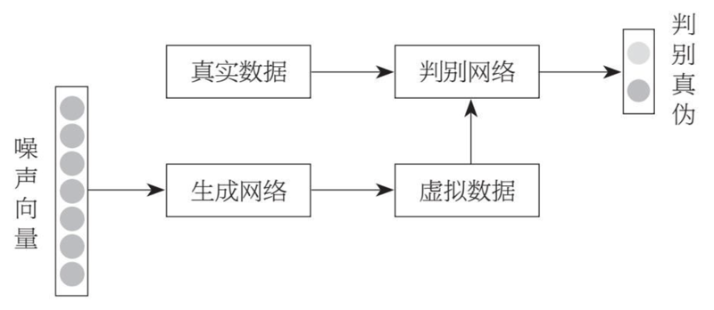
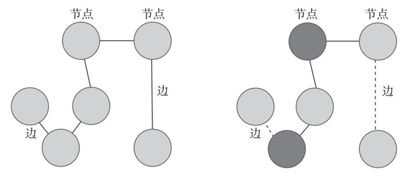
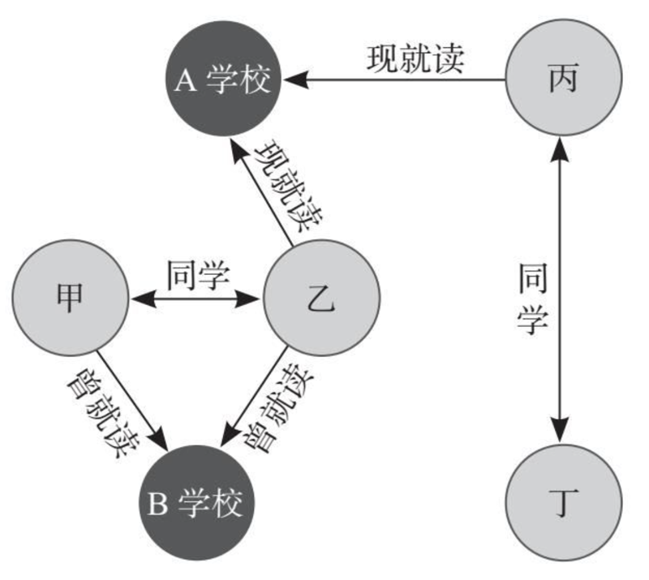

# 0801. AI 的挑战与对策

凡事总是盛极而衰，重要的是认清趋势转变，要点在于找出转折点。

— 乔治·索罗斯 —

在之前的内容里，既有高屋建瓴的人工智能原理探讨，更有各行各业的人工智能落地案例。但是，沉舟侧畔千帆过，病树前头万木春，一切新生事物的发展都不会一帆风顺，如同世间万物曲折前行的轨迹一般，AI 思维在前进的过程中也免不了有磕磕绊绊，不断地遇到挑战。但凡事都有两面性，在想方设法化解这些挑战的过程中，也相应地促进了人工智能的发展和落地。

「势」反映的是事物在发展过程中，一定会遇到阻碍和波动，但从这些变化之中能体现出事物的发展趋势和方向。在前面的章节中，我们已经对 AI 思维的道、法、术、器、用的五个方面展开了讲解，所以，在本书的最后一章，我们将从「势」的层面深入探讨人工智能在现阶段所面临的挑战和瓶颈，无论是在技术层面的、法律伦理层面的，还是人为因素层面的挑战，都让我们在认识到一定的局限性的同时，也更理性地看待周遭因为人工智能而正在发生的巨大变化。庆幸的是，到如今，这些挑战已有相对应的解决策略，成功应对这些挑战也能够产生不可估量的积极影响：一方面深化了人工智能的落地，另一方面，也让我们对人工智能的发展更具信心和期待。

## 8.1 AI 模型的挑战

人工智能发展至今已经走过了 60 多个年头，这期间经历了风风雨雨，有高潮也有低谷。每当人工智能的技术和应用取得核心进展时，人们都会对此产生非常大的兴趣，这也吸引了大量的资金投入，此时便是人工智能的高潮期。但另一方面，由于外界对人工智能的宣传报道较为单一，导致大家对人工智能的期望远远超过了目前技术所能达到的高度，而当大家发现花费了大量的资金、投入了大批精英人才却不能达到预期成果的时候，人工智能的低谷期就到了。

通过前几章的讲解你也了解到，人工智能离不开大数据、模型、算力、业务模式，这 4 点是 AI 思维成功实现的支柱因素。其中，模型是整个 AI 思维的核心，也是让数据奏效的强大引擎，如果没有模型，其他的因素都不能够在 AI 思维体系中起作用，也就无法实现人工智能对各方面的提升和赋能。但同时，模型在现实中的短板也给 AI 思维的进一步发展和普及带来了制约。那这些制约究竟是什么？我们下面就围绕模型面临的挑战进行探讨。

### 8.1.1 如何从无标注数据中学习

实现 AI 思维落地最重要的一环就是建立模型，但是通过机器学习或深度学习训练一个模型的前提是有大量经过人工标注的数据。例如在图像识别里面，通常来说，需要几十万到上百万人工标注的数据。在语音识别里，则需要成千上万个小时的人工标注语音数据。机器翻译则需要数千万的双语句对做训练。包括曾经一战成名的 AlphaGo，也是利用围棋高手们数千万步棋谱对局的记录进行模型训练的。

训练模型需要大量的人工进行标注，就意味着这需要花费很多人力和资金成本。很多时候，找专家进行数据标注费用非常昂贵。我们可以粗略评估标注数据的代价会有多高，以机器翻译为例：我们的目标是标注 1 000 万个句子，如果请人工进行翻译，假设一个句子的标注费用在 0.5 元，那么要完成这个标注 1 000 万个句子的目标要花费 500 万元，这个费用是相当高的。所以，如此大的数据标注成本，对于那些创业公司或者刚刚开始涉足人工智能领域的公司来说，是一件难以完成的事情。

另外，对于一些个性应用场景来说，很难找到大规模的标注数据，比如说疑难杂症的诊断，因为它既然被列入「疑难杂症」的范畴，一方面可能说明这类病症的患者病例较少，另一方面也说明医生对这类病症的了解并不全面，无论是哪个原因，最终导致的结果都是没有足够广泛的数据用来进行模型训练。

所以，人工智能领域的专家们开始思考，深度学习建模能不能去掉数据标注这个步骤，也就是探索如何从无标注的数据里面进行学习。这成为深度学习研究的一个前沿。就目前的研究工作来看，一条可行的解决路径是通过最近比较火的生成性对抗网络来实现。

首先，我们了解一下什么是生成性对抗网络。生成性对抗网络简称 GAN，是非监督式学习的一种方法，即通过让两个神经网络相互博弈的方式进行学习，一个是生成网络，另一个是判别网络。生成网络从潜在空间中随机取样作为输入，如图 8-1 所示，将噪声向量发送给生成网络，生成网络将这个噪声向量转换为虚拟数据，其输出结果需要尽量模仿训练集中的真实样本，再将虚拟数据发送到判别网络进行分类。而判别网络的输入则为真实样本和生成网络的输出结果，其主要的工作是将生成网络的输出与真实样本分辨开来。两个网络相互对抗、不断调整参数，最终达到生成网络的输出结果与真实样本无二。

图 8-1 GAN 网络架构示意图

通俗来说，GAN 的工作原理类似于这样的场景：一个男生试图拍出摄影师级别的照片，而一个女生以挑剔的眼光找出照片的瑕疵。这个过程是男生先拍出一些照片，然后女生分辨出男生拍的照片与摄影师级别的照片的区别。男生再根据反馈改进自己的拍摄技术和方法，拍出一些新的照片，女生再对这些新照片继续提出修改意见，直到达到均衡状态 —— 女生再无法分辨出两者的区别。

所以，GAN 能够从多个角度学习到海量无标注数据的特性，从而使得从无标注数据中挑选出来的可用数据与人工标注数据之间存在很强的互补特性。这就类似于，以往的模型没有规律判别功能，需要标注员将输入数据打上标签后，模型才开始进行学习；而通过 GAN，机器能够自发学习输入数据的规律，自动对新的数据进行判别和分类，从而实现无标注数据的学习。

从无标注的数据进行学习是非常重要的一个问题，它对人工智能在各领域的实际应用也起到了相当大的作用。过去的标注数据十分有限，这导致我们无法有效地运用深度学习，从而延缓了人工智能落地的步伐。而如今，如果我们能够跳过数据标注这个步骤，从无标注的数据进行学习，那么越来越多的实际应用场景都能够嵌入深度学习，很多问题也就迎刃而解了。

### 8.1.2 如何把数据和知识结合起来

近年来，深度学习的发展取得了巨大的进步，甚至改变了整个人工智能领域的发展方向。深度学习通过在海量的数据上构建大规模的神经网络，这些神经网络经过训练后可以在很多领域有很出色的表现，如语音识别、图像识别和自然语言处理等领域。深度学习的特点是不再需要人为建立结构化的知识表示体系，知识经过海量信息训练后直接融合在网络中，这使得经典的知识表示和逻辑推理等思想在人工智能领域的作用逐步弱化。

然而，深度学习终究不能解决人工智能领域的所有问题，学习产生了模型也不代表模型能够真正理解所处理的数据，模型也无法进行深层的推理和思考。实际上，基于知识的规则推理系统能够动态学习规则，而且能在多项规则的关联作用下进行复杂的推理，挖掘信息间的深层联系，这是深度学习目前难以做到的。虽然基于知识体系的方法由于目前难以构建大规模的知识系统，限制了其在实际场景中达到理想的效果，但如何把数据和知识结合起来仍是值得深入研究的问题。

知识图谱可以将数据和知识有效地结合在一起。那什么是知识图谱呢？可能在外界看来，知识图谱是在 2012 年的时候由谷歌公司提出来的一个新概念，但事实上却并非如此，知识图谱这个概念其实由来已久。从 20 世纪 70 年代出现的「专家系统」，到万维网之父蒂姆·伯纳斯 - 李（Tim Berners-Lee）提出的「语义网」和「链接数据」，都是知识图谱的前身。知识图谱主要研究的是客观世界各种概念之间的关系，近年来发展迅速，产生了在智能医疗和自适应教育等领域的落地应用。

从本质上来看，知识图谱是语义网络的知识库；从实际应用的角度来看，可以将知识图谱简化理解成多关系图。我们通常用图里的节点来代表实体，用图里的边来代表两个节点间的关系。实体指的是现实世界中的事物，比如人、地址或机构等，关系则表示的是不同实体之间的某种联系，例如，人 - 站在 - 高台，「人」和「高台」是实体，而「站在」则代表了人和高台这两个实体间的关系。在不同的图里，节点和边也会不同。如图 8-2 所示，一般的图是由节点和边构成，但这些图通常只包含一种类型的节点和边，而多关系图则包含多种类型的节点和多种类型的边。图中，不同类型的节点和边用不同的颜色和样式来进行标记和区分。

图 8-2 一般的图与多关系图对比示意图

在现实世界中，很多场景都非常适合用知识图谱来表达。以社交网络图谱举例，如图 8-3 所示，社交网络里包含「人」「学校」这样的实体。人和人、人和学校之间存在多种可能的关系，例如甲和乙是「同学」的关系。乙和 A 学校是「现就读」的关系，乙和 B 学校是「曾就读」的关系。丙和丁是「同学」的关系，丙和 A 学校是「现就读」的关系。如果继续拓展下去，每个人都有许多同学，同学们又来自不同的学校。这张社交网络图谱就包含了很多信息，又把这些信息通过节点和边的形式表现得非常清楚。

图 8-3 社交网络图谱示意图

只有当知识图谱构建完成之后，才能应用到实际的业务之中。一个构建完成的知识图谱相当于是一个知识库，这就解释了为什么它可以回答用户搜索的问题。比如在百度搜索引擎里输入「阿里巴巴的创始人是谁」，我们直接就能得到答案 ——「马云」。这是因为在系统层面上已经构建完成了知识图谱，在这个知识图谱中包含了关于「阿里巴巴」和「马云」的实体以及两者之间关系的知识库。所以，当我们进行搜索的时候，就可以通过关键词提取类似「阿里巴巴」「马云」「创始人」的词汇以及这些词汇在知识库里的匹配，获得最终答案。这种搜索方式与传统的搜索引擎是迥然不同的，如果用户在传统的搜索引擎上进行检索，返回的是网页，还需要用户自己来筛选和过滤信息，然后才能获得最终答案。

知识图谱的出现是为了理清不同概念之间的关系，所涉及的数据量通常较大，所以知识图谱的构建是一项错综复杂的巨大工程。从整体来看，我们将知识图谱的构建分为知识获取、知识融合、知识验证和知识应用这四个步骤。

第一步是知识获取，主要是从不同来源和结构的数据中获取知识。那么，这些知识是从哪里获取的呢？垂直领域的知识图谱数据来源主要有两种渠道：一方面是业务本身的数据，这指的是以结构化的方式存储的公司内部数据库表，只需要简单预处理就可以进行输入；另一方面是互联网上公开的数据，这类非结构化的数据通常包含了文本、图像、音频和视频等信息，一般需要借助人工智能提取出结构化信息之后才能进行输入。

第二步是知识融合，各个来源获取的信息往往是分散和异构的，具有冗余、高噪音、不确定、非完备的特点，仅仅依靠数据清洗并不能解决这些问题，而是需要进行融合和后续的验证工作，将不同来源不同结构的数据融合成统一的知识图谱，以保证知识的一致性。这步的主要工作是对获取的数据进行实体识别和关系抽取，然后融合构建数据之间的关联，包括实体对齐、属性对齐、冲突消解和规范化等。

第三步是知识验证，即对数据进行补全、纠错、更新，一方面，可以确保知识图谱的一致性和准确性；另一方面，知识图谱的构建是持续动态的，当引入新知识后，需要对新知识进行验证。如果新知识与旧知识间有冲突，那么就需要判断：是原有的知识错了，还是新的知识有问题？如果新知识是正确的，那么就要进行相关实体和关系的更新。

第四步是知识应用，主要是根据知识图谱提供的信息，推理得到更多隐含的知识、隐含的关系、隐含的社区和知识间关联的路径等。这样，通过知识图谱可以产生大量的智能应用，如专家系统、推荐系统、语义搜索和智能问答等。其中，基于知识图谱的智能问答系统可以提供用户所需的信息与知识，一般是以一问一答的形式来精准回答用户的问题。比如说，电商领域的智能问答系统可以辅助人工客服回答一些常见的问题。这样既能在第一时间对用户的问题做出反馈，提升用户体验，又能减轻人工客服的工作量，减少人力成本。

### 8.1.3 可解释的 AI 模型

在过去的十几年里，人工智能在各个领域都有成功落地的案例，像我们之前谈到的金融领域的农业银行、零售领域的塔吉特、工业领域的杜克能源等，都通过人工智能提升了自己的效益。但在实践的过程中我们发现，现在仍然有很多企业对人工智能持一种怀疑的态度：人工智能系统做出的决策是否真的值得信任呢？这是我们在推广人工智能应用过程中经常遇到的质疑，也是人工智能在企业落地需要攻克的下一个难关。

在现实的业务中，如果人们要做一个决策，是需要在企业中达成共识的，而相关的人员也要通过定期的审查，来解释他们的决策。这样，既能够保证所做决策可以有效地提高整体业务水平，也能够保证决策在整个企业中顺利进行。不难理解，在决策制定过程中，信任机制中存在着一个关键因素：如何为自己的想法或者做法阐述出一个合理的解释？

人工智能也一样，模型的有效性同样会受到当前无法向人们解释其决策的限制。当人工智能根据模型和分析做出决策后，企业会有各种疑问和担忧，比如说「为什么要这样做？」，「什么时候能够实现？」。但这时人工智能并不能人性化地给出回答。这就催生了人工智能的新兴分支，称为「可解释的人工智能」（XAI），即建立一套新的或改进的机器学习机制，生成可解释的模型，结合有效的解释方法，使得用户能够理解、一定程度地信任并有效地管理人工智能。

XAI 的关键在于：解释人工智能所做出的每一个决策背后的逻辑，都是合理的、可追踪的和可理解的。这里包含三个关键维度：首先，是合理的，即能够理解每个人工智能做出预测的背后推理，整个决策过程中人工智能的思考流程和逻辑是如何的。其次，是可追踪的，即从数据的特点到模型的逻辑，追踪预测过程的能力。最后，是可理解的，即完全理解做出决策所基于的人工智能模型，包括为什么要选择这样一个模型，这个模型如何建立起来的以及能够实现的结果是什么等。

在了解了 XAI 的基本原则后，具体该如何操作呢？XAI 是如何对人工智能模型进行解释的呢？其实 XAI 解释人工智能模型的方法有很多，比如说，在模型建立前对数据进行解读。我们都知道人工智能模型建立在大量历史数据的基础上，所以理解数据对于人工智能模型的可解释性具有重大意义。对数据的理解可以通过一些数据预处理和数据可视化的方法来实现，对其进行解读的关键在于全面地展示数据分布的特点。这一方法可以使建模过程中可能面临的问题都充分地暴露出来，从而帮助我们选择一种最合理的模型来获得可能达到的最优解。再比如，建立本身就可以被解释的人工智能模型。不同的人工智能模型的可解释性是不一样的。在实践中，如果我们选择本身就易解释的人工智能模型，就从根本上解决了问题。常见易解释的人工智能模型有决策树模型、线性分类模型和线性回归模型等。

针对比较复杂的人工智能模型，我们以卷积神经网络为例来具体来说明 XAI 是如何对深度学习模型进行解释的。曾有研究者利用反卷积的相关思想，实现特征可视化，来帮助我们理解卷积神经网络的每一层究竟学到了什么东西。我们已经知道卷积神经网络的识别过程是由卷积、池化等步骤组成的，而如果想要深入了解一个卷积神经网络的逻辑，我们就需要经过反池化、反卷积这样的逆过程。通过这样的逆过程，我们就可以比较清晰地了解到卷积神经网络是如何进行分类和识别的，也就可以实现人工智能模型的合理性、可追踪性和可理解性。

XAI 除了可以解决模型的可解释问题之外，还具有更深层的裨益，例如：一方面，因为 XAI 提供的解释有助于找到数据和特征分析中的问题，所以 XAI 能够帮助改善人工智能模型的性能。当人工智能模型的判断逻辑易于解释时，我们就能够发现整个过程中的缺失，从而找到改良它的方法。

另一方面，XAI 可以帮助人们确认人工智能判断的合理性，从而更快地部署基于人工智能的方案。决策不光是人工智能的核心，也是人类活动的关键，在进行重大决策的时候，我们既需要确保所做的决策是合情合理的，又需要知道它背后的理由，才能评估它是否值得参考。XAI 对于模型的解释提高了人们对人工智能的信心，帮助他们更加明智地决策以及果断地行动。

虽然人工智能模型面临的挑战很多，但所幸最终都有了相对应的解决方案。这其中包括：对于如何在不进行成本巨大的数据标注工作的情况下，还能实现深度学习的问题，我们可以通过生成性对抗网络进行自主学习来解决；针对如何能够把数据和知识有效地结合起来的问题，我们可以通过构建知识图谱来解决；关于如何更好地解释人工智能模型的问题，我们讨论了可解释的人工智能。

无论是哪个挑战，业内都已经有了相关的研究结果，并且实证有效。但这些挑战都值得更进一步地进行研究，找到更好的解决方式，最终使人工智能可以更好地为人所用。而且随着人工智能更长远的发展以及它的深度运用，以后还会有更多复杂的问题出现，就像长夜漫漫，凛冬将至，高峰之下必有低谷。但是我们知道，冬天到了，春天也就不再遥远，人工智能也在不断的挑战中日趋完善。

## 8.2 AI 的伦理和法律挑战

虽然人工智能还处在发展的初期，但它已经展现出了巨大的颠覆力，不仅在一定程度上方便了我们的日常生活，也对传统行业模式产生了一定的改变，促进了智能化经济的发展，社会正经历着从「互联网 +」到「人工智能 +」的转变。在我们享受人工智能红利的同时，也会感受到技术带来的危险，包括隐私和数据泄露的问题、机器与人的关系问题等，就像狄更斯所言：「这是最好的时代，也是最坏的时代。」随着人工智能的进一步普及，它所带来的伦理和法律问题也将越来越突出。积极关注并回应人工智能带来的伦理和法律挑战，能够促进民生福祉改善，推进行业健康发展，在新一轮技术革命中掌握主动权。

### 8.2.1 AI 的伦理挑战和应对

人工智能模拟的是人脑，但它又不同于人脑。人工智能在学习和决策的时候，虽然缺乏人脑的主动和细致，但也有其自身的优势，比如它可以在短时间内学习大量的数据，工作速度高于人类，长时间工作不知疲惫，并且可以做出最优决策等。人工智能促使社会发生着新的改变，形成新的行业和产业形态，也由此创造出巨大的经济价值和社会财富。人类在享受人工智能带来的便利的同时，也会产生担忧，一旦机器有了思维，那机器能够变成人吗？人类会被人工智能取代吗？我们在利用机器解放自身的同时，也会产生危机感，一方面我们要利用工具，另一方面我们又害怕被工具取代，丧失了人类对社会的控制。

控制论之父维纳在他的《人有人的用处》一书中曾做出了一个耸人听闻的结论：「这些机器的趋势是要在所有层面上取代人类，而非只是用机器能源和力量取代人类的能源和力量。很显然，这种新的取代将对我们的生活产生深远影响。」在 AlphaGo 打败围棋冠军李世石时，我们已经看到了人工智能的凌厉之处。当今很多电影大片和文学作品里面，也出现了机器人或者机器智能体超越人类的话题。关于机器人是否会背叛人类、人类是否会成为机器的仆人等话题的讨论此起彼伏，热度不减，甚至霍金都曾多次表达他对「人工智能可能导致人类毁灭」的担忧。硅谷「钢铁侠」埃隆·马斯克把车祸、飞机失事、毒品泛滥、食品问题和人工智能进行了对比，认为前四项东西至少没有对人类文明造成根本威胁，但是人工智能却从根本上威胁到了人类文明。

人类区别于其他动物最根本的属性在于长期进化而来的高级逻辑，人工智能与人类思维存在相似之处，人工智能的目的是让机器能够像人类一样思考，机器的自主性越来越强，所以人工智能的应用势必会带来伦理挑战。我们不禁要问，人工智能究竟能否产生自己的意识？人工智能真的会挑战人作为主体的根本地位吗？但从人工智能现在的发展情况来看，要对人工智能是否真的会导致人类毁灭这样的问题下结论还为时过早。当前我们所说的人工智能并不是我们脑海中的具有自由意志和行为能力的智能体，更多的是从数据中学习知识的工具，或者可以将人类从烦琐、枯燥、重复的工作中解放出来，或者可以将优秀的经验不受时空限制地应用。不过人工智能的出现确实带来了伦理方面的挑战。

人工智能伦理挑战中最主要的问题就是人工智能与人类的关系问题。这一伦理问题的根源还是在于人工智能和人类思维有相似之处，人工智能模拟了类似于人的神经元网络，可以像人脑一样进行学习，并做出思考。如果可以将人类接触的各种信息和经验转化成数字和符号，再加上强大的数据分析能力，那我们就可以完整地模拟出人脑的功能，机器与人类的差别就会越来越小。所以我们一直以来担心的机器人对人类的挑战，其实是人工智能对人类思维逻辑的挑战，也就是具有了思维的机器对人类主体地位的挑战。

2016 年，欧盟委员会下的法律事务委员会就曾提交动议，要求赋予最先进的自动化机器人「电子人」的身份定位，除给予「特定的权利和义务」外，还建议对智能自动化机器人进行登记，以便为其注册进行纳税、缴费和领取养老金的账号。如果该项法律动议获得通过，无疑会动摇传统的法律体系，法律上主体和客体之间这种不可逾越的鸿沟现在正发生动摇。这在我们看来无疑是荒谬的，一个由人类制造出来的机器，竟然在法律上要享有和人类同等的权利。

在机器的身份定位发生动摇的同时，也出现过机器对人造成伤害的事件。比如说，20 世纪 80 年代，日本就曾经发生过在作业现场工业机器将工人置入机器压死的事件。2007 年，因为医疗外科手术机器人对病人造成烧伤、切割伤以及感染的事件频发，美国食品药品监督管理局收到超过 200 份投诉。那么这些事件，是机器人创造者的技术漏洞，还是机器人管理者的疏忽？机器人本身需要对侵害人的行为负责吗？再比如在最近讨论很热的无人驾驶问题中，「人工智能 + 无人驾驶」颠覆了以往的人车关系和车车关系，驾驶汽车的不再是人，而是智能驾驶系统，那么在出现交通事故时，该如何判断机器系统是主观上的「故意」还是「过失」呢？可以让智能驾驶系统承担交通事故中的民事赔偿责任吗？

智能机器人的本质是机器，但它也有人的属性。虽然在目前技术的发展水平下，人工智能代替人类听起来像是天方夜谭，并且人工智能本身的发展距离人类智慧也很遥远，但是未雨绸缪才能防患于未然，我们必须提前讨论人工智能的伦理问题。与此同时，人工智能相关法律的制定也需要考虑伦理的范畴，对人工智能的伦理的研究也早于法律规定。

随着对于人工智能伦理问题探讨的深入，越来越多的国家和地区开始重视对人工智能伦理的研究。例如，欧洲机器人研究网络（EURON）制定了《机器人伦理学路线图》，韩国工商能源部发布了《机器人伦理宪章》，日本组织专家团队起草了《下一代机器人安全问题指引方针》，美国国家科学基金会和美国航天局为对「机器人伦理学」进行研究设立了专项基金。此外，许多机构也在强化人工智能专家在人工智能伦理规范方面的责任，例如谷歌设立了「人工智能研究伦理委员会」。在我国，2017 年 7 月，国务院发布了《新一代人工智能发展规划》，将发展人工智能确定为国家战略的同时，提出「制定促进人工智能发展的法律法规和伦理规范」，「加强人工智能相关法律、伦理和社会问题研究，建立保障人工智能健康发展的法律法规和伦理道德框架」。对人工智能伦理的讨论，不仅可以在一定程度上指导行业健康、可持续的发展，也可以在必要的时候，转化为法律规范，实现道德的法律化。

2017 年 1 月，主题为「有益的人工智能」（Benefi cial AI）的会议在美国加利福尼亚州的阿西洛马召开。会议提出了「阿西洛马人工智能原则」，明确人工智能研究的目标不应该是建立无向的智能，而应该是创造有益的智能。并且该会议还呼吁，在发展人工智能的过程中全世界都应该严格遵守这些原则，共同保障人类未来的利益和安全。

2017 年 12 月，电气和电子工程师学会（IEEE）发布《人工智能设计的伦理准则（第二版）》，进一步完善了人工智能伦理的内涵，包括一般原则、价值嵌入、研究和设计的伦理方法、通用人工智能（AGI，artifi cial general intelligence）和超级人工智能（ASI，artifi cial super intelligence）的安全、个人数据、自主武器、经济和人道主义问题、法律、情感计算、教育和知悉的政策、经典伦理问题、混合现实、福祉指标这 13 个方面。

微软在 2018 年出版了《未来计算》（ The Future Computed ）一书，其中提出了人工智能开发的六大原则：公平、可靠和安全、隐私和保障、包容、透明、责任。清华大学人工智能与安全项目组提出了六条准则：福祉原则、安全原则、共享原则、和平原则、法治原则、合作原则。这些准则之间有相似之处，对人工智能的伦理问题，可以说达成了基本的共识。

欧盟委员会指出，「可信赖的人工智能」应该有三个必不可少的要素：一是合法，应该遵守所有适用的法律法规；二是合乎伦理，应该尊重伦理和价值观；三是安全可靠，应该避免因技术不足而造成无意的伤害。欧盟人工智能伦理高级专家组提出了人工智能伦理准则，列出了「可信赖人工智能」应满足以下七个关键条件：人的能动性和监督机制、技术的可靠性和安全性、隐私和数据管理、透明度、包容性、社会和环境福祉、问责机制。国际计算机学会下属的美国公共政策委员会发布文件，提出了关于算法透明和可责性的七条原则：意识、获取和救济、责任制、解释、数据来源、可审查性、验证和测试。

2019 年 6 月，国家新一代人工智能治理专业委员会发布了我国第一组人工智能治理原则《新一代人工智能治理原则―发展负责任的人工智能》，提出了人工智能治理的框架和行动指南。治理原则中重点强调了「发展负责任的人工智能」这一主题，提出了和谐友好、公平公正、包容共享、尊重隐私、安全可控、共担责任、开放协作、敏捷治理这八条原则。

应对人工智能对伦理的挑战，首先要树立的一个原则就是「以人为中心」，以人类的根本利益为中心，我们要解决的不是人工智能和人类平起平坐的甚至超越的问题，我们要解决的是如何利用人工智能来补充人类思维的问题。人类制造工具，而工具让我们走得更远，让人类从繁重的任务中解放出来。人工智能是需要以人的需求为出发点的，保障人类的利益发展和安全，兼顾技术和行业的发展，即人工智能是「为了人和人类的人工智能」，不应该是可以取代人或者对人有害的技术。

「以人为中心」这一原则可以通过「技术 + 责任」的路径来实现，在技术上不要一味地追求机器的自主性，而是在人工智能和人类思维之间实现对接，并将人类的价值观嵌入人工智能，通过技术标准、产品标准等指导技术在具体场景下的应用和发展，确保技术是安全的、透明的、可追溯的。在责任方面，要明确人工智能的责任主体，同时加强监督，并建立起可归责的责任体系。

腾讯董事会主席马化腾在 2018 年世界人工智能大会上提出，人工智能应该做到「四可」，即「可知」、「可控」、「可用」和「可靠」（ARCC：Available, Reliable, Comprehensible and Controllable），他在 2019 年世界人工智能大会上再次重复了这一点。随着人工智能技术更加广泛深入的应用，人工智能伦理指导和人工智能治理也更加紧迫，这也需要多方面的协同配合，共同探索人工智能的发展方向，实现科技向善。

### 8.2.2 AI 应用中的个人信息保护

随着人工智能的发展，新的产业形态和商业模式不断涌现。智能革命使得新技术推动生产力快速发展，在技术上对数据的获取和运算更加方便，相应地，对法律领域也提出了新的挑战和要求，其中比较突出的问题就体现在个人信息保护方面。

过去，大数据的概念还没有建立，政府作为社会管理者收集公民个人信息的主要用途便是社会管理和社会服务。但随着大数据和智能时代的来临，越来越多的企业，特别是电商网站、品牌公司和广告公司等都建立起了自己的数据库，利用各种方式收集数据，再利用人工智能模型对数据进行分类和分析，进行智能营销。电商可以了解到我们的商品搜索记录和购买偏好，外卖订餐和出行叫车软件可以定位我们的所在位置和每天的生活轨迹。毫不夸张地说，我们整个人都暴露在了互联网之上。现在大型互联网公司的价值，除了在于其开发的产品和服务以外，也在于其掌握的大量数据。未来的竞争是人工智能的竞争，其根本还在于数据战，谁拥有了大量的数据，谁就在市场竞争中占据了主动。所以，越来越多的技术应用到了大数据的收集当中，那么个人信息安全问题也就引起了越来越多的关注。在个人和数据管理者的博弈之中，个人是处于劣势地位的，个人信息保护的问题也会愈演愈烈。

人工智能和数据是分不开的。在大数据的时代，可以说涉及人的数据是最多的，其中包括人本身的身份信息、特征信息和行为信息等。这些个人信息很多涉及人的隐私。个人信息这个词有时候也被叫作个人资料或者个人数据，在我国，目前对个人信息这个概念的内涵和外延并没有一致的解释，但从司法实践来看，对个人信息的认定采取的是紧缩的态度，也就是将能够确认人身份的信息判定是个人信息，比如姓名、身份证号和电话号码等，而像网站浏览记录等不能直接判断人身份的信息就不能被划在个人信息的范围之内。但是随着技术的发展，人们逐渐能够做到将个人在网络空间上各种零星细碎的信息拼凑出完整的、足以反映其人格的关键信息。所以，目前对个人信息的认定也出现了放宽的趋势，即将人的特征和行为等间接的个人数据也划在个人信息的范围之内。

人是商业活动的主体，涉及人的数据是可以进行经济价值转化的，这正是大数据革命的核心，并且也会推动人工智能的应用和发展。一方面，我们要保护个人信息，不能非法采集和使用，另一方面，我们也不能让个人数据与市场活动绝缘，人为地阻断数据的经济价值，这不利于市场经济和技术的发展。并且，个人信息和个人隐私具有不同的性质和功能。个人隐私的要义在于保密，即不暴露，若有侵害则事后救济。而个人信息其实是一些已经是公之于众的，并且具有一些权利和财产的属性的信息，其权利的重点在于控制与利用。所以在人工智能时代，如果将个人信息进行了合法、合理的采集和使用，可以做到个人和商业的双赢。对个人信息的保护不仅仅是对法律规则的挑战，也包含经济因素和社会利益的考量，是一个价值衡量的问题。

针对个人信息保护，目前世界上已经有超过 100 个国家或地区制定了专门的个人信息保护法，尤其是西方的发达国家。在美国，个人信息保护是在隐私保护的范畴内，以行业自律为主，通过行业分散的规范和事后救济来实现。欧盟则是通过立法，凭借法律的强制约束力对个人信息给予相应的保护，从互联网行业对个人信息的获取途径、方式、运用和目的等各方面进行规范。我国的个人信息保护还在起步阶段，各方多次呼吁要制定专门的个人信息保护法，确立个人信息权，但具体法律法规仍未出台。

目前我国对个人信息保护的法律规定并不完善。《民法通则》仅从原则上规定了要对公民的个人信息进行保护。2017 年 6 月 1 日正式施行的我国首部网络安全的专门性立法《网络安全法》规定了网络运营商收集、使用公民个人信息的目的必须明确，而且应当获得个人信息主体的同意，也就是说目前我国对于个人信息采集的做法是「目的 + 知情」，收集公民个人信息的目的需要是合法、明确、正当且必要的，并且其目的必须在信息收集时已经明确，事后不能有冲突或者不兼容。个人信息收集的目的、方式和范围必须是透明的且需要征得信息提供者同意。信息收集者需要履行披露义务，收集后的信息在持有阶段必须确保信息的安全，对于个人信息的利用不得违反法律规定。《网络安全法》的重点不仅在于个人信息本身或者是对个人信息的保护，更多的是在于对个人信息的控制者和处理者的规制，包括个人信息的控制者和处理者对公民个人信息的收集、使用、加工和传输等行为。

但是，互联网对个人信息的收集、转化到使用等这些操作常常被用户所忽略。并且目前互联网对用户是普遍免费的，其赢利模式不是向用户收费，而是向第三方收费，也就是通过互联网广告赢利，例如世界最大的社交网站脸书，其收入的 98% 来自广告的精准投放。所以目前互联网的模式就是「免费 + 广告 + 增值」，其第一步就是扩大浏览并且获取个人信息。有些时候如果不注册、不提供个人信息，就无法享受服务，而我们也会以牺牲个人信息为代价，换取网络的服务和便利。所以互联网普遍免费的模式并不是真正的免费，而是以我们的个人信息为交换，供互联网服务商使用。并且，互联网模式对个人信息的保护并不充分，它往往虚化个人信息获取的同意规则，例如将同意规则掩埋在大量的信息中，或者默认选择同意等。2018 年新年的支付宝年度账单事件就是一个典型案例。大家在晒支付宝账单和年度关键词的时候，不知不觉又签了一个「服务协议」—— 支付宝个人年度账单首页有一行特别小的字：「我同意《芝麻服务协议》」，且页面上已帮你选择好了「同意」，默认选项允许支付宝收集用户信息包括在第三方保存的信息。查看年度账单和《芝麻服务协议》没有关联性，即使选择取消同意，人们依然能够看到年度账单；但如果没注意到，默认同意了这个协议，就意味着允许支付宝收集个人信息。所以，在收集个人信息时，不仅应该要求经营者做到必要的明示提醒义务，而且对于用户而言，也应该审慎为之，不然稍不注意信息就会泄露。

在互联网普遍免费的模式下，有人建议可以在用户选择服务时给用户一个选择的机会，即将选择权交给用户，如果选择免费服务模式，即享有普通的个人信息保护，如果采取付费的模式，则享有一个更高的信息保护层级。对于个人信息的采集和利用可以根据用户个性化的选择和付费情况，采取不同程度的保护力度。但是，这个改变在目前的互联网模式下推行存在难度。还是应该明确信息提供者、信息存储者和使用者以及系统开发者的责任，强化企业保护用户隐私的意识和责任，加强监督管理，防患于未然，并且建立健全完善的争端解决机制，让个人有寻求救济的途径。对于个人信息的保护不是一味地避免个人信息的获取和利用，也不是为了商业目的而牺牲个人权益，而是需要在个人信息的保护和正当的商业活动中寻求一个平衡。只有这样，才能获得双赢的局面。

爱因斯坦曾说过：「技术本身没有道德性，使用技术的人的道德能力决定了技术改变世界的方向和可能性。」技术的发展会产生新的社会关系，或使得现有的社会关系产生变化，影响甚至改变人类的某些生活方式及思维方式。技术的发展促使人们对于自然、社会和人本身以及之间关系认识的不断加深，也促进了法律内容的更新。伦理道德和法律是社会规范最主要的两种存在形式，伦理道德前置，可以激励和规范技术的发展，法律后置，可以抑制技术的负面的影响，提供有效的救济途径。无论是伦理道德还是法律，其规制的意义都在于引导和规范技术健康、可持续的发展，为人类创造福祉。

## 8.3 AI 落地的人为因素

前面我们探讨了人工智能模型和伦理法规的挑战，最后，我们论述一下影响人工智能落地的人为因素。人工智能，因人而诞生；AI 思维，最终也由人来实现。人工智能与人类息息相关，也因人而异。对于不同的人，人工智能所带来的改变可能完全不一样。同样地，对于人工智能，如果是由不同的人来实现，结果也会完全不同。人工智能是以服务人类为核心，完全围绕人类展开的，所以人为因素在其落地过程中发挥了极其重要的作用。

人工智能时代，人与人工智能关系的话题讨论一直热度不断，从科幻大片里人工智能试图与人类产生感情，到现实生活中人工智能人才的短缺，我们一直在思考、在探索。随着各个行业智能化水平的提高、人类对人工智能的依赖程度的上升，到底有哪些人会与人工智能直接接触？人工智能又赋予了哪些人专业的帮助和思想的灵光呢？下面我们就来具体介绍一下，在人工智能实际运营过程中，人类都涉及了哪些角色以及承担了哪些相应的职责。

### 8.3.1 AI 落地中的角色分工

第一，企业决策者，例如企业的 CEO 及其他高层管理者。无论在什么时代，企业决策者的思维方式和管理方法，对这个企业的发展和未来都起着举足轻重的作用。他们的目标是用更少的资源产生更高的收益。人工智能作为一个热点方向，会吸引决策者的注意，而有远见的决策者，更是会在人工智能上投入资源。

企业决策者需要在战略上支持人工智能应用。战略的支持包括资源的倾斜、给予足量的时间等，需要按照人工智能的规律来推进项目。一些企业决策者并不了解人工智能的发展规律，执行任何项目都把时间限定为三个月 —— 无论是开发网站还是研发人工智能都是三个月，这显然违背了人工智能的规律。当然，并不是说研发人工智能一定是慢活，而是说要根据需要以及规律办事，不能一概而论。

第二，业务负责人，即直接负责一项业务的经理。业务负责人的思维方式和工作能力直接影响着所在部门的办事效率和工作业绩。他们没有企业决策者的权限大，但更加了解某个具体的业务，有执行层面的话语权。

业务负责人往往需要达成一定的业务目标，而时刻关注时代发展方向的业务负责人会了解到人工智能的先进性，会更加关注人工智能如何在企业落地，并且相信人工智能有助于实现他的目标。我合作过的优秀的业务负责人都有比较开放的心态，乐于接受人工智能这一新事物并能够与更大的团队一起分享成果。

第三，人工智能科学家，即受过专门训练并精通人工智能模型的专家，是不可多得的人才，人工智能在各个领域的落地实践离不开他们的专业能力。他们不仅需要熟悉人工智能的应用框架，精通并实践人工智能模型，而且要理解人工智能落地过程中需要分析和研究的数据，并具备足够的工程能力来分析和处理所涉及的数据。与此同时，他们也要对数据的业务价值有较深入的认识。所以说人工智能科学家并不等同于实验室里的科学家，他们既要了解数据，也要熟悉业务。

第四，数据工程师，即提取和处理数据的工程人员，他们直接管理、操作人工智能所需要的数据资源。数据工程师负责提供人工智能所需的数据支持，能够有效地满足人工智能科学家提出的数据需求。他们将人工智能与企业数据资源连接，是人工智能能够实现落地的关键一环。数据工程师最重要的特质是可靠、可依赖，不会因为自己管理了数据就偏私，只有这样才能高效地支持人工智能落地。

以军队为例，在一个军队里面，决策者是元帅，组织队伍去攻打堡垒。军队里的业务负责人是司令，带领着一批人马就朝堡垒前进了。人工智能科学家角色就是参谋长，他有着熟练的作战技术，但是他最终能否按照司令的作战策略率军出征，要看参谋长和司令，也就是人工智能科学家和业务负责人之间的配合程度。优秀的业务负责人和人工智能科学家，也就是司令和参谋长，需要相互磨合和理解，让业务与技术相匹配，发挥出最大的价值。在人工智能落地的过程中，参谋长不能过分许诺，司令也需要给足时间和空间，这样两者才能合作顺利，逐步解决各种问题。在双方合作出现问题时，也会因为彼此都有一个共同的理想，所以坚持走下去，共同实现业务目标。数据工程师在整个军队中的角色，则像参谋长的左膀右臂，没他们的话，参谋长的战斗力会大打折扣，打不了仗。

一直以来都存在这样一个问题，人工智能在企业落地可以没有企业决策者的支持吗？答案当然是否定的。如果缺少了高层的支持，人工智能很容易落地失败。但因此武断地认为只要企业决策者支持人工智能落地，过程就一定会比较顺利，也不完全正确。比如说，刚参加工作的时候，我作为人工智能科学家负责了一个人工智能落地项目。当时，公司领导非常支持这个项目，初步的发展也很理想，但到了项目需要使用大量数据的阶段，数据库的负责人（即前面所说的第四种角色）并不十分配合我的项目，既不支持人工智能所需的大数据提取工作，也不肯协助处理工程上的问题。起初，我由于无法独立处理大规模数据、无法驾驭复杂软件系统等问题，导致了项目的延误，但后来我痛定思痛，通过加强自身的工程能力，灵活构建程序，按照人工智能的需求去处理大量的数据，解决了这一阶段的问题。最终，这个项目成功收尾，人工智能在业务中发挥了巨大作用，直接帮助公司获得一轮巨额的融资。

除此之外，人工智能科学家的培养也是业界比较关注的话题，之前我也针对此问题写过相关文章进行详细的讨论。在我看来，人工智能科学家最重要的一个素质就是对数字的高敏感度。人工智能的开发和应用软件开发极为不同，应用软件开发过程只需要满足需求就可以了，程序和数据的错误可以在后期检验中发现，但人工智能模型里的错误在后期是难以发现的。如果让错误存留在系统里，对业务的负面影响会很大，所以人工智能科学家需要对数字十分敏感，保证人工智能系统处理的数据是准确无误的。其次，人工智能科学家也需要具备一定的工程能力，能够针对不同的模型快速进行实验。无论业务和专业的侧重点在哪里，对于人工智能科学家来说，基本的工程能力必不可少，只有这样才能保证人工智能成为业务提升的驱动力。

上面我们描述了在人工智能落地中所需的四种角色：企业决策者、业务负责人、人工智能科学家和数据工程师。这四种角色都有各自的特点，相辅相成，互为补充，在人工智能落地的过程中都承担了重要的责任。可以说，在整个人工智能项目中，这四类角色都是功不可没、缺一不可的。

### 8.3.2 AI 落地中的第五个角色 —— AI 产品经理

在现实情况中，实际的业务需求和人工智能模型之间存在巨大的鸿沟，双方没法有效地沟通，而在大多数机构中，也缺少能够有效地将业务需要翻译为人工智能需求的人员，这直接导致人工智能落地进展缓慢。所以，从这种情况来看，仅有刚才说的四种角色的人员组合，并不完备，我们还需要一个人工智能产品经理的角色。

按照通常的定义，产品经理能够将业务的需要翻译为对技术实现的需求。例如，现在要开发一个酒店的网站，产品经理会根据酒店的业务逻辑设计出网站的原型，像介绍页面、登录页面、订单页面等，并能够生成需求文档、对接具体开发网站程序的工程师。这种将业务需要翻译为人工智能需求的职位就是人工智能产品经理，而人工智能产品经理的缺席，会导致人工智能落地进展缓慢。既然说人工智能产品经理是促进人工智能落地的关键，下面就着重分析一下人工智能产品经理的角色。

如果在军队中，人工智能产品经理能够将司令的需要翻译成参谋长可以执行的工作，他们也许就不会有争执了。在抗战时期的战役里常常有这样的一个场景：参谋长认为自己指挥军队乘胜追击是正确的事情，但在司令看来，这却是莽撞的。优秀的产品经理可以在两者间做好有效沟通，一方面跟司令解释参谋长做的是符合战术逻辑又有助于战争的决定，另一方面跟参谋长也明确每场战役的目标，让他不因鲁莽而犯错。可想而知，如果军队中有这样一个产品经理角色，司令就不用整天大发雷霆来惩罚参谋长了。

然而一直以来，兼具深厚的人工智能专业背景和强大的产品思维能力的人才非常难得。比如说目前大多数新生代的人工智能专业人士都喜欢用深度学习去解决各种场景中的问题，但仅从人工智能模型的角度出发，很多场景问题是难以解决的，反而是传统方法更有效果。所以，合格的人工智能产品经理既要具备 AI 思维，也要了解行业，还要掌握机器学习和深度学习等人工智能领域的知识，这样多个方面的能力素养叠加起来，才能更好地解决市场所面临的问题，做出实用的人工智能产品。

我时常听闻一些互联网行业的产品经理将自己不懂的知识称为技术内容，这个观点对人工智能产品经理来说是十分不妥的。就像在工业革命的早期，如果你不了解蒸汽机的基本原理，你就不能做火车的产品经理；同样，如果你不具备 AI 思维，不了解人工智能解决问题的基本思路和框架，也难以胜任人工智能产品经理。出于这样的考虑，我们对人工智能产品经理知识的要求，既不会过多地涉及技术细节，也不会放过对产品形成有决定性的技术内容。对于一个合格的人工智能产品经理来说，我们主要看他是否掌握 AI 思维的核心要素，是否理解解决实际问题的 AI 炼金术，是否熟悉人工智能决策引擎的原理，并能够在 AI 思维的框架下逐步了解重要的人工智能概念。只有具备了人工智能视角、能够以数据和模型的方法论解决复杂问题的产品经理，才可以独当一面、解决业务难题，成为人工智能时代最需要的一类人。

### 8.3.3 AI 产品经理究竟在干什么？

我们前面说了人工智能产品经理的基本定位，那么从更深层的能力需求来看，人工智能产品经理都要做些什么呢？下面我们将产品经理的日常工作分解开来具体阐述。

产品经理是产品开发团队的主导人，需要从用户角度出发，协调研发、市场、销售等部门，对产品进行优化。具体来说，就是了解用户需求，负责产品功能定义、规划和设计，保证产品开发工作顺利开展。除此之外，还要对用户的新需求、竞争产品的信息进行收集和分析，研究产品的发展趋势等。

而人工智能产品经理是产品经理中的一个具体垂直分类，将负责的产品范围聚焦在人工智能领域。作为产品开发团队的主导人，人工智能产品经理的主要职责是寻找用户需求和人工智能能力的交集。例如，人工智能产品经理离用户更近，善于发掘和分析用户以及市场的需求；同时，他们也知道人工智能能够解决什么样的问题，能够根据实际需求设计理想的模型训练集和预测集，同时为模型提供评估指标。那么，相应地，人工智能科学家和数据工程师依据这些需求和指标，获取所需的数据集，开发并迭代出与需求相符的人工智能产品。比较人工智能产品经理和传统产品经理，可以看到二者区别主要在于，是否具有利用对数据和人工智能的理解，在动态业务中迭代产品的思维。

我们要明确的是人工智能产品经理的本质还是产品经理，所以其最核心的工作依然是找到用户需求，专注于提高产品价值。人工智能最终是解决问题的工具，它能够解决什么需求、如何更好地解决需求，都是人工智能产品经理日常需要考虑的问题，这其中最关键的问题就是要考虑如何促进人工智能更好更快地落地。在多数应用场景中，人工智能产品经理需要做的是把行业内的需求转化成人工智能实现层面的问题；在这其中，人工智能产品经理掌握的是数据，需要人工智能输出的是预测和决策。从人工智能落地的整个流程来看，人工智能产品经理不仅要了解数据的内涵，还要知道如何探索数据。例如，要实现某项业务的人工智能落地，人工智能产品经理要知道所需收集的数据内容及形式是什么、如何正确地理解数据并反馈到实际产品中。在开始进行产品设计时，人工智能产品经理还要基于业务需求确定人工智能产品的效果是提升营销响应，还是优化生产效率等，根据这些定下基础的模型框架。

在人工智能产品领域，数据越具有时效性、越具体，建立起的人工智能模型便越优良，所以在人工智能落地的全过程中，产品的完成并不是项目的终点，人工智能模型还需要在使用中进行动态的迭代和优化，以期能更好地服务用户。对人工智能产品经理来说，在人工智能产品完成后还需要进行持续的数据收集，通过产品的不断使用能够获得更多、更深入的数据进行人工智能模型训练，使得人工智能产品可以越来越准确和深入地解决问题。

同时，人工智能产品本身还具有很大的不确定性，人们无法像传统产品一样直观地了解到人工智能产品到底是什么，对它的智能水平的了解也十分模糊。这样就很容易出现用户对人工智能产品的预期很高，但产品并不能够完全满足用户需求的情况，或者出现用户提了太多超出产品功能的要求却没有得到正向反馈的情况。这些情况的出现会导致用户的心理落差很大，无法客观地评价人工智能产品。因此，人工智能产品经理在设计人工智能产品时，要注意对用户期望的把握。

基于人工智能产品开发的内在逻辑，人工智能产品经理的演化主要体现在三个阶段 —— 第一个阶段，数据收集和管理阶段；第二个阶段，产品开发阶段；第三个阶段，产品落地阶段。在这三个阶段演化的过程中，也需要面对人工智能落地中的各种挑战。下面我们对这三个阶段进行具体分析。

在数据收集和管理阶段，高质量的数据是人工智能实现的基础，这个阶段人工智能产品经理最重要的工作就是进行数据的收集和管理。无论是在实现层面还是市场层面，人工智能产品经理只有先把数据管理做好，才能让数据发挥出价值，创造出真实契合市场需求的人工智能产品。数据管理里有很多具体内容，例如数据标准管理、数据质量管理、数据集成和关联等。此外，在本阶段还有一个重点是数据安全与隐私保护。数据安全是指系统中的数据受到保护，不因偶尔或者恶意的原因而遭到破坏、更改和泄露。数据的运用可能涉及相关主体的隐私问题，所以人工智能产品经理要具有保护数据隐私的意识，对保护数据隐私的措施有一定的敏感性。

人工智能落地的第二个阶段是人工智能产品开发。在这一阶段，人工智能产品经理要创造适用于行业的人工智能产品，从用户需求出发，切实找到行业痛点，通过对人工智能的理解，找到用人工智能解决难题的方式，然后抓住行业痛点和人工智能的结合点设计人工智能产品。真实有效的人工智能产品诞生后，能够实现用户体验和业务效果的大幅度提升，或是人工成本的大幅度降低，甚至能够颠覆行业现状。

人工智能落地的第三个阶段是产品落地，这时人工智能产品经理也应该以类似业务负责人的身份去考虑实际的落地问题。一位十分优秀的人工智能产品经理不仅要引导产品的发展，还要引导业务的发展。他既要是一个优秀的执行者，还要是一个项目和团队的管理者。他需要具备敏锐的洞察力，既能准确抓住用户心理，又能精研产品细节，最终打磨出惊艳的人工智能产品。在人工智能时代，只有把产品做到市场上的极致，不断进行产品突破，才能实现价值。

从整体来看，人工智能产品现在还处于起步的阶段，人工智能产品经理在人工智能产品开发中的经验也都并不丰富。在实践过程中，遇到的很多问题现在也都没有比较确定和成熟的方法论，缺少解决方案或经验总结，很多问题还寄希望于通过人工智能的不断发展和探索来解决。与此同时，人工智能本身的边界和能力也正在飞速发展中，人工智能产品经理需要及时跟上时代发展的步伐，对自己的工作做出调整。

可能有人会问：「人工智能崛起后，世界还会好吗？」答案是肯定的。既然这个时代已然或者终将是人工智能的时代，我们就更加需要戳破虚高的泡沫，每个人都建立起一个客观理性的 AI 思维来面对这个新时代，并期待能够以这种 AI 思维去关照整个社会的发展，感受新生事物的脉搏，让自己过得更好，也能够看到整个世界变得更好。