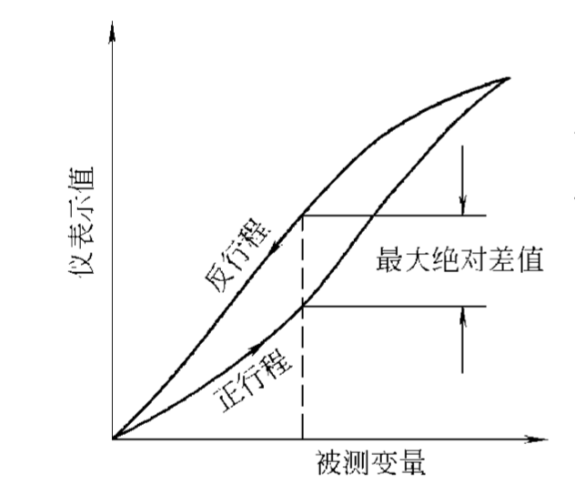
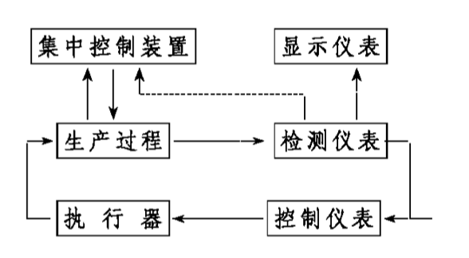
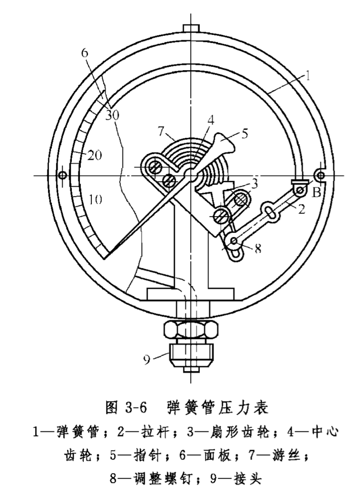
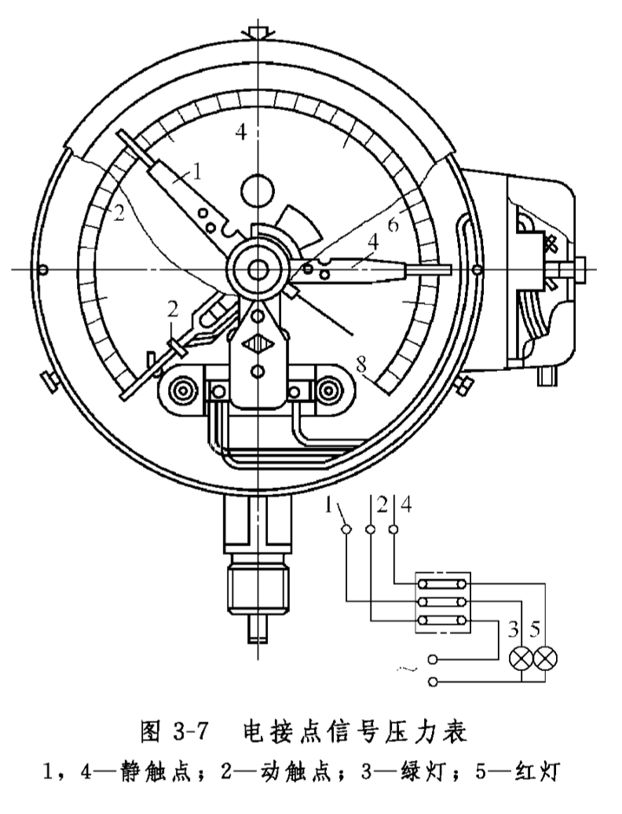
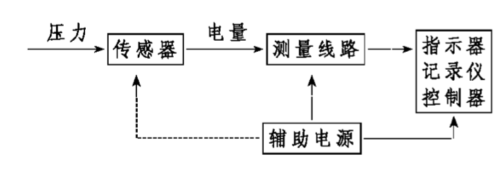
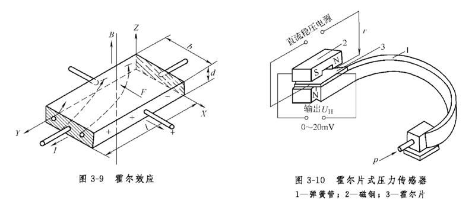
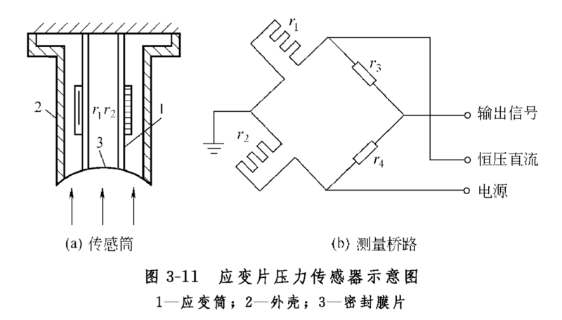
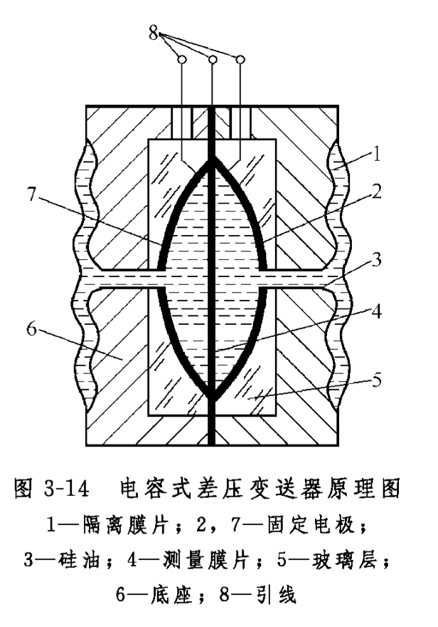
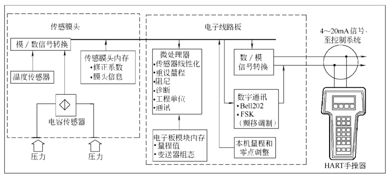
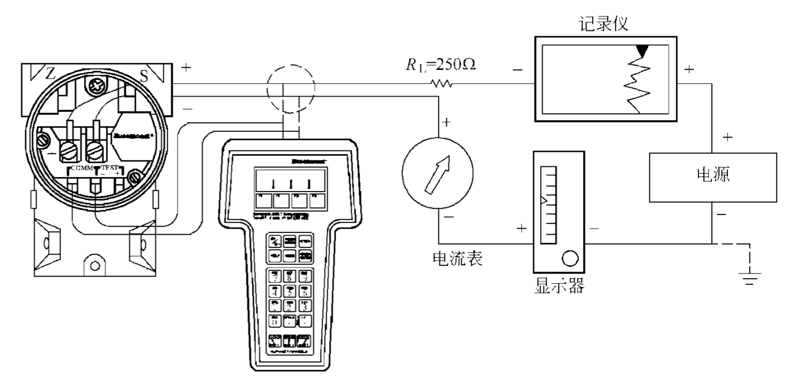

## 0301. 检测仪表与传感器01

在工业生产过程中，为了正确地指导生产操作、保证生产安全、提高产品质量和实现生产过程自动化，一项必不可少的工作是准确而及时地检测出生产过程中的各个有关参数，例如压力、流量、物位及温度等。用来检测这些参数的技术工具称为检测仪表。用来将这些参数转换为一定的便于传送的信号（例如电信号或气压信号）的仪表通常称为传感器。当传感器的输出为单元组合仪表中规定的标准信号时，通常称为变送器。本章将主要介绍有关压、流量、物位、温度等参数的检测方法、检测仪表及相应的传感器或变送器。

### 3.1 概述

#### 3.1.1 测量过程与测量误差

在生产过程中需要测量的参数是多种多样的，相应的检测方法及仪表的结构原理也各不相同，但从测量过程的实质来看，却都有相同之处。测量过程在实质上都是将被测参数与其相应的测量单位进行比较的过程，而测量仪表就是实现这种比较的工具。各种测量仪表不论采用哪一种原理，它们都是要将被测参数经过一次或多次的信号能量的转换，最后获得一种便于测量的信号能量形式，并由指针位移或数字形式显示出来。例如各种炉温的测量，常常是利用热电偶的热电效应，把被测温度转换成直流毫伏信号（电能），然后变为毫伏测量仪表上的指针位移，并与温度标尺相比较而显示出被测温度的数值。

在测量过程中，由于所使用的测量工具本身不够准确，观测者的主观性和周围环境的影响等等，使得测量的结果不可能绝对准确。由仪表读得的被测值与被测量真值之间，总是存在一定的差距，这一差距就称为测量误差。测量误差通常有两种表示方法，即绝对误差和相对误差。

绝对误差在理论上是指仪表指示值 xi 和被测量的真值 x1 之间的差值，可表示为：`Δ = xi - xt`。所谓真值是指被测物理量客观存在的真实数值，它是无法得到的理论值。因此，所谓测量仪表在其标尺范围内各点读数的绝对误差，一般是指用被校表（精确度较低）和标准表（精确度较高）同时对同一被测量进行测量所得到的两个读数之差，可用下式表示：`Δ = x - x0`。式中，Δ 为绝对误差；x 为被校表的读数值；x0 为标准表的读数值。

测量误差还可以用相对误差来表示。相对误差等于某一点的绝对误差 Δ 与标准表在这点的指示值 x0 之比。可表示为：`y = Δ/x0`，式中 y 为仪表在 x 处的相对误差。

2『仪表的绝对误差和相对误差，做一张术语卡片。』——已完成

#### 3.1.2 仪表的性能指标

一台仪表性能的优劣，在工程上可用如下指标来衡量。

1、精确度（称精度）。

任何测量过程都存在一定的误差，因此使用测量仪表时必须知道该仪表的精确程度，以便估计测量结果与真实值的差距，即估计测量值的误差大小。

前面已经提到，仪表的测量误差可以用绝对误差 Δ 来表示。但是，必须指出，仪表的绝对误差在测量范围内的各点上是不相同的。因此，常说的「绝对误差」指的是绝对误差中的最大值 Δmax。

事实上，仪表的精确度不仅与绝对误差有关，而且还与仪表的测量范围有关。例如，两台测量范围不同的仪表，如果它们的绝对误差相等的话，测量范围大的仪表精确度较测量范围小的为高。因此，工业上经常将绝对误差折合成仪表测量范围的百分数表示，称为相对百分误差 δ，即：

```
δ  = [Δmax/(测量范围上限值-测量范围下限值)]×100%
```

仪表的测量范围上限值与下限值之差，称为该仪表的量程。根据仪表的使用要求，规定一个在正常情况下允许的最大误差，这个允许的最大误差就叫允许误差。允许误差一般用相对百分误差来表示，即某一台仪表的允许误差是指在规定的正常情况下允许的相对百分误差的最大值，即：

```
δ（允） = ±[仪表允许的最大绝对误差值/(测量范围上限值-测量范围下限值)]×100%
```

仪表的 δ（允）越大，表示它的精确度越低；反之，仪表的 δ（允）先越小，表示仪表的精确度越高。

事实上，国家就是利用这一办法来统一规定仪表的精确度（精度）等级的。将仪表的允许相对百分误差去掉「±」号及「%」号，便可以用来确定仪表的精确度等级。目前，我国生产的仪表常用的精确度等级有 0.005、0.02、0.05、0.1、0.2、0.4、0.5、1.0、1.5、2.5、4.0 等。如果某台测温仪表的允许误差为 ±1.5%，则认为该仪表的精确度等级符合 1.5 级。为了进一步说明如何确定仪表的精确度等级，下面举两个例子。

2『仪表的精度及精度等级，做一张术语卡片。』——已完成

例 1 某台测温仪表的测温范围为 200-700℃，校验该表时得到的最大绝对误差为 +4℃，试确定该仪表的精度等级。

解：该仪表的相对百分误差为 `δ = +[4/（700-200）]×100% = +0.8%`。如果将该仪表的去掉「+」号与「%」号，其数值为 0.8。由于国家规定的精度等级中没有 0.8 级仪表，同时，该仪表的误差超过了 0.5 级仪表所允许的最大误差，所以，这台测温仪表的精度等级为 1.0 级。

1『算出来的精度，往上去取精度等级。（2021-01-10）』

例 2 某台测温仪表的测温范围为 0-1000℃。根据工艺要求，温度指示值的误差不允许超过 ± 7℃，试问应如何选择仪表的精度等级才能满足以上要求？

解根据工艺上的要求，仪表的允许误差为 `δ（允）= ±[7/（1000-0）]×100% = ±0.7%`。如果将仪表的允许误差去掉「±」号与「%」号，其数值介于 0.5-1.0 之间，如果选择精度等级为 1.0 级的仪表，其允许的误差为 ±1.0%，超过了工艺上允许的数值，故应选择 0.5 级仪表才能满足工艺要求。

由以上两个例子可以看出，根据仪表校验数据来确定仪表精度等级和根据工艺要求来选择仪表精度等级，情况是不一样的。根据仪表校验数据来确定仪表精度等时，仪表的允许误差应该大于（至少等于）仪表校验所得的相对百分误差；根据工艺要求来选择仪表精度等级时，仪表的允许误差应该小于（至多等于）工艺上所允许的最大相对百分误差。

仪表的精度等级是衡量仪表质量优劣的重要指标之一。精度等级数值越小，就表征该仪表的精确度等级越高，也说明该仪表的精确度越高。0.05 级以上的仪表，常用来作为标准表；工业现场用的测量仪表，其精度大多是 0.5 级以下的。仪表的精度等级一般可用不同的符号形式标志在仪表面板上，如 XXXX 等。

2、变差。

变差是指在外界条件不变的情况下，用同一仪表对被测量在仪表全部测量范围内进行正反行程（即被测参数逐浙由小到大和逐由大到小）测量时，被测量值正行和反行所得到的两条特性曲线之间的最大偏差，如图 3-1 所示。



图 3-1 测量仪表的变差

造成变差的原因很多，例如传动机构间存在的间隙和摩擦力、弹性元件的弹性滞后等等。变差的大小，用在同一被测参数值下，正反行程间仪表指示值的最大绝对差值与仪表量程之比的百分数表示，即：

```
变差  = ±[最大绝对误差值/(测量范围上限值-测量范围下限值)]×100%
```

必须注意，仪表的变差不能超出仪表的允许误差，否则，应及时检修。

2『仪表的变差，做一张术语卡片。』——已完成

3、灵敏度与灵敏限。

仪表指针的线位移或角位移，与引起这个位移的被测参数变化量之比值称为仪表的灵敏度，用公式表示如下：

```
S = Δα/Δx 
```

式中，S 为仪表的灵敏度；Δα 为指针的线位移或角位移；Δx 为引起Δa 所需的被测参数变化量。所以仪表的灵敏度，在数值上就等于单位被测参数变化量所引起的仪表指针移动的距离（或转角）。

所谓仪表的灵敏限，是指能引起仪表指针发生动作的被测参数的最小变化量。通常仪表灵敏的数值应不大于仪表允许绝对误差的一半。

值得注意的是，上述指标仅适用于指针式仪表。在数字式仪表中，往往用分辨力来表示仪表灵敏度（或灵敏限）的大小。

2『仪表的灵敏度与灵敏限，做一张术语卡片。』——已完成

4、分辨力。

对于数字式仪表，分辨力是指数字显示器的最末位数字间隔所代表的被测参数变化量。如数字电压表显示器末位一个数字所代表的输入电压值。显然，不同量程的分辨力是不同的，相应于最低量程的分辨力称为该表的最高分辨力，也叫灵敏度。通常以最高分辨力作为数字电压表的分辨力指标。例如，某表的最低量程是 0-1.0000V，五位数字显示，末位个数字的等效电压为 10μV，便可说该表的分辨力为 10μV。

当数字式仪表的灵敏度用它与量程的相对值表示时，便是分辨率。分辨率与仪表的有效数字位数有关，如一台仪表的有效数字位数为三位，其分辨率便为千分之一。

2『仪表的分辨力，做一张术语卡片。』——已完成

5、线性度。

线性度是表征线性刻度仪表的输出量与输入量的实际校准曲线与理论直线的吻合程度。如图 3-2 所示。通常总是希望测量仪表的输出与输入之间呈线性关系。因为在线性情况下，模拟式仪表的刻度就可以做成均匀刻度，而数字式仪表就可以不必采取线性化措施。

线性度通常用实际测得的输入-输出特性曲线（称为校准曲线）与理论直线之间的最大偏差与测量仪表量程之比的百分数表示，即：

```
δf = [Δfmax/仪表量程]×100% 
```

式中，δf 为线性度（又称非线性误差）；Δfmx 为校准曲线对于理论直线的最大偏差（以仪表示值的单位计算）。

2『仪表的线性度，做一张术语卡片。』——已完成

6、反应时间。

当用仪表对被测量进行测量时，被测量突然变化以后，仪表指示值总是要经过一段时间后才能准确地显示出来。反应时间就是用来衡量仪表能不能尽快反映出参数变化的品质指标。反应时间长，说明仪表需要较长时间才能给出准确的指示值，那就不宜用来测量变化频繁的参数。因为在这种情况下，当仪表尚未准确显示出被测值时，参数本身却早已改变了，使仪表始终指示不出参数瞬时值的真实情况。所以，仪表反应时间的长短，实际上反映了仪表动杰特性的好坏。

仪表的反应时间有不同的表示方法。当输入信号突然变化一个数值后，输出信号将由原始值逐渐变化到新的稳态值。仪表的输出信号（即指示值）由开始变化到新稳态值的 63.2% 所用的时间，可用来表示反应时间，也有用变化到新稳态值的 95% 所用的时间来表示反应时间的。

2『仪表的反应时间，做一张术语卡片。』——已完成

#### 3.1.3 工业仪表的分类

工业仪表种类繁多，结构形式各异，根据不同的原则，可以进行相应的分类。

1、按仪表使用的能源分类。

按使用的能源来分，工业自动化仪表可以分为气动仪表、电动仪表和液动仪表。目前工业上常用的为电动仪表。电动仪表是以电为能源，信号之间联系比较方便，适宜于远距离传送和集中控制；便于与计算机联用；现在电动仪表可以做到防火、防爆，更有利于电动仪表的安全使用。但电动仪表一般结构较复杂；易受温度、湿度、电磁场、放射性等环境影响。

2、按信息的获得、传递、反映和处理的过程分类。

从工业自动化仪表在信息传递过程中的作用不同，可以分为五大类。



图 3-3 各类仪表的作用

1）检测仪表。检测仪表的主要作用是获取信息，并进行适当的转换。在生产过程中检测仪表主要用来测量某些工艺参数，如温度、压力、流量、物位以及物料的成分、物性等，并将被测参数的大小成比例地转换成电的信号（电压、电流、频率等）或气压信号。

2）显示仪表。显示仪表的作用是将由检测仪表获得的信息显示出来，包括各种模拟量、数字量的指示仪、记录仪和积算器，以及工业电电视、图像显示器等。

3）集中控制装置。包括各种巡回检测仪、巡回控制仪、程序控制仪、数据处理机、电子计算机以及仪表控制盘和操作台等。

4）控制仪表。控制仪表可以根据需要对输入信号进行各种运算，例如放大、积分、微分等。控制仪表包括各种电动、气动的控制器以及用来代替模拟控制仪表的微处理机等。

5）执行器。执行器可以接受控制仪表的输出信号或直接来自操作人员的指令，对生产过程进行操作或控制。执行器包括各种气动、电动、液动执行机构和控制阀。

上述各类仪表在信息传递过程中的关系可以用图 3-3 来表示。

3、按仪表的组成形式分类。

1）基地式仪表。这类仪表的特点是将测量、显示、控制等各部分集中组装在一个表壳里，形成一个整体。这种仪表比较适于在现场做就地检测和控制，但不能实现多种参数的集中显示与控制。这在一定程度上限制了基地式仪表的应用范围。

2）单元组合仪表。将对参数的测量及其变送、显示、控制等各部分，分别制成能独立工作的单元仪表（筒称单元，例如变送单元、显示单元、控制单元等）。这些单元之间以统一的标准信号互相联系，可以根据不同要求，方便地将各单元任意组合成各种控制系统，适用性和灵活性都很好。

化工生产中的单元组合仪表有电动单元组合仪表和气动单元组合仪表两种。国产的电动单元组合仪表以「电」、「单」、「组」三字的汉语拼音字头为代号，筒称 DDZ 仪表；同样气动单元组合仪表筒称 QDZ 仪表。

本章将介绍几个主要工艺参数的检测方法及仪表。显示仪表、控制仪表及执行器将分别在第四、五、六章中介绍。

### 3.2 压力检测及仪表

工业生产中，所谓压力是指由气体或液体均匀垂直地作用于单位面积上的力。在工业生产过程中，压力是重要的操作参数之一。特别是在化工、炼油等生产过程中，经常会遇到压力和真空度的测量，其中包括比大气压力高很多的高压、超高压和比大气压力低很多的真空度的测量。如高压聚乙烯，要在 150MPa 或更高压力下进行聚合；氢气和气合成氨气时，要在 15MPa 或 32MPa 的压力下进行反应；而炼油厂减压蒸馏，则要在比大气压低很多的真空下进行。如果压カ不符合要求，不仅会影响生产效率，降低产品质量，有时还会造成严重的生产事故。此外，压力测量的意义还不局限于它自身，有些其他参数的测量，如物位、流量等往往是通过测量压力或差压来进行的，即测出了压力或差压，便可确定物位或流量。

#### 3.2.1 压力单位及测压仪表

由于压力是指均匀垂直地作用在单位面积上的力，故可用下式表示：`p = F/S`。式中，p 表示压カ；F 表示垂直作用カ；S 表示受力面积。

根据国际单位制（代号为 SI）规定，压力的单位为帕斯卡，简称帕（Pa），1 帕为 1 牛顿每平方米，即：`1 Pa = 1 N/m^2`。帕所表示的压力较小，工程上经常使用兆帕（MPa）。帕与兆帕之间的关系为：`1 MPa = 1x10^6 Pa`。


表 3-1 各种压力单位换算表

过去使用的压力单位比较多，根据 1984 年 2 月 27 日国务院「关于在我国统一实行法定计量单位的命令」的规定，这些单位将不再使用。但为了使大家了解国际单位制中的压力单位（Pa 或 MPa）与过去的单位之间的关系，下面给出几种单位之间的换算关系表 3-1。在压力测量中，常有表压、绝对压力、负压或真空度之分，其关系见图 3-4。


图 3-4 绝对压力、表压、负压（真空度）的关系

工程上所用的压力指示值，大多为表压（绝对压力计的指示值除外）。表压是绝对压力和大气压力之差。当被测压力低于大气压力时，一般用负压或真空度来表示它是大气压力与绝对压力之差。因为各种工艺设备和测量仪表通常是处于大气之中，本身就承受着大气压。所以，工程上经常用表压或真空度来表示压カ的大小。以后所提到的压力，除特别说明外，均指表压或真空度。

测量压力或真空度的仪表很多，按照其转换原理的不同，大致可分为四大类。

1、液柱式压力计。它是根据流体静力学原理，将被测压力转换成液柱高度进行测量的。按其结构形式的不同，有 U 形管压カ计、单管压カ计和斜管压力计等。这类压力计结构筒单、使用方便，但其精度受工作液的毛细管作用、密度及视差等因素的影响，测量范围较窄，一般用来测量较低压力、真空度或压力差。

2、弹性式压力计。它是将被测压力转换成弹性元件变形的位移进行测量的。例如弹簧管压力计、波纹管压力计及膜式压力计等。

3、电气式压力计。它是通过机械和电气元件将被测压力转换成电量（如电压、电流、频率等）来进行测量的仪表，例如各种压力传感器和压力变送器。

1『我们仪表专业选型里，就地的基本是弹性式压力计，远传的是电气式压力计。（2021-01-10）』

4、活塞式压力计。它是根据水压机液体传送压力的原理，将被测压力转换成活塞上所加平衡砝码的质量来进行测量的。它的测量精度很高，允许误差可小到 0.05%-0.02%。但结构较复杂，价格较贵。一般作为标准型压力测量仪器，来检验其他类型的压力计。

2『压力表按转换压力分类，4 大类。做一张数据信息卡片。』——已完成

#### 3.2.2 弹性式压力计

弹性式压力计是利用各种形式的弹性元件，在被测介质压力的作用下，使弹性元件受压后产生弹性变形的原理而制成的测压仪表。这种仪表具有结简单、使用可靠、读数清晰、牢固可靠、价格低廉、测量范围宽以及有足够的精度等优点。若增加附加装置，如记录机构、电气变换装置、控制元件等，则可以实现压力的记录、远传、信号报警、自动控制等。弹性式压力计可以用来测量几百帕到数千兆帕范围内的压力，因此在工业上是应用最为广泛的一种测压仪表。

1、弹性元件。

弹性元件是一种筒易可靠的测压敏感元件。当测压范围不同时，所用的弹性元件也不一样，常用的几种弹性元件的结构如图 3-5 所示。


图 3-5 弹性元件示意图

1）弹簧管式弹性元件。弹簧管式弹性元件的测压范围较宽，可测量高达 1000MPa 的压力。单圈弹管是弯成圆弧形的金属管子，它的截面做成扁圆形或椭圆形，如图 3-5（a）所示。当通入压力 p 后，它的自由端就会产生位移。这种圈弹簣管自由端位移较小，因此能测量较高的压力。为了增加自由端的位移，可以制成多圈弹管，如图 3-5（b）所示。

2）薄膜式弹性元件。薄膜式弹性元件根据其结构不同还可以分为膜片与膜盒等。它的测压范围较弹簧管式的低。图 3-5（c）为膜片式弹性元件，它是由金属或非金属材料做成的具有弹性的一张膜片（有平膜片与波纹膜片两种形式），在压力作用下能产生变形。有时也可以由两张金属膜片沿周ロ对焊起来，成一薄壁盒子，内充液体（例如硅油），称为膜盒，如图 3-5（d）所示。

3）波纹管式弹性元件。波纹管式弹性元件是一个周围为波纹状的薄壁金属筒体，如图 3-5（e）所示。这种弹性元件易于变形，而且位移很大，常用于微压与低压的测量（一般不超过 1MPa）。

2、弹簧管压力表。

弹管压力表的测量范围极广，品种规格繁多。按其所使用的测压元件不同，可有单圈弹簣管压力表与多圈弹簧管压力表。按其用途不同，除普通弹簧管压力表外，还有耐腐蚀的氨用压表、禁油的氧气压力表等。它们的外形与结构基本上是相同的，只是所用的材料有所不同。弹簣管压力表的结构原理如图 3-6 所示。



弹簧管 1 是压力表的测量元件。图中所示为单圈弹簧管，它是一根弯成 270° 圆弧的椭圆截面的空心金属管子。管子的自由端 B 封闭，管子的另一端固定在接头 9 上。当通入被测的压力 p 后由于椭圆形截面在压力的作用下，将趋于圆形，而弯成圆弧形的弹簧管也随之产生向外挺直的扩张变形。由于变形，使弹簧管的自由端 B 产生位移。输入压力 p 越大，产生的变形也越大。由于输入压与弹管自由端 B 的位移成正比，所以只要测得 B 点的位移量，就能反映压力 p 的大小，这就是弹簧管压力表的基本测量原理。

弹簣管自由端 B 的位移量一般很小，直接显示有困难，所以必须通过放大机构才能指示出来。具体的放大过程如下：弹簣管自由端 B 的位移通过拉杆 2（见图 3-6）使扇形齿轮 3 作逆时针偏转，于是指针 5 通过同轴的中心齿轮 4 的带动而作顺时针偏转，在面板 6 的刻度标尺上显示出被测压力 p 的数值。由于弹簧管自由端的位移与被测压之间具有正比关系，因此弹簧管压力表的刻度标尺是线性的。

游丝 7 用来克服因扇形齿轮和中心齿轮间的传动间隙而产生的仪表变差。改变调整螺钉 8 的位置（即改变机械传动的放大系数），可以实现压力表量程的调整。

在化工生产过程中，常常需要把压力控制在某一范围内，即当压力低于或高于给定范围时，就会破坏正常工艺条件，甚至可能发生危险。这时就应采用带有报警或控制触点的压力表。将普通弹簧管压力表稍加变化，便可成为电接点信号压力表，它能在压力偏离给定范围时，及时发出信号，以提醒操作人员注意或通过中间继电器实现压力的自动控制。



图 3-7 是电接点信号压力表的结构和工作原理示意图。压力表指针上有动触点 2，表盘上另有两根可调节的指针，上面分别有静触点 1 和 4。当压力超过上限给定数值（此数值由静触点 4 的指针位置确定）时，动触点 2 和静触点 4 接触，红色信号灯 5 的电路被接通，使红灯发亮。若压力低到下限给定数值时，动触点 2 与静触点 1 接触，接通了绿色信号灯 3 的电路。静触点 1、4 的位置可根据需要灵活调节。

#### 3.2.3 电气式压力计

电气式压カ计是一种能将压力转换成电信号进行传输及显示的仪表。这种仪表的测量范较广，分别可测 7×10^(-5)Pa 至 5x10^2MPa 的压力，允许误差可至 0.2%。由于可以远距离传送信号，所以在工业生产过程中可以实现压力自动控制和报警，并可与工业控制机联用。

电气式压计一般由压力传感器、测量电路和信号处理装置所组成。常用的信号处理装置有指示仪、记录仪以及控制器、微处理机等。图 3-8 是电气式压力计的组成方框图。



图 3-8 电气式压力计组成方框图

压力传感器的作用是把压力信号检测出来，并转换成电信号进行输出，当输出的电信号能够被进一步变换为标准信号时，压力传感器又称为压力变送器。标准信号是指物理量的形式和数值范围都符合国际标准的信号。例如直流电流 4-20mA、空气压力 0.02-0.1MPa 都是当前通用的标准信号。我国还有一些变送器以直流电流 0-10mA 为输出信号。

下面简单介绍霍尔片式、应片式、压阻式压传感器和力矩平衡式压力变送器，电容式压力变送器。

1、霍尔片式压力传感器。

霍尔片式压力传感器是根据霍尔效应制成的，即利用霍尔元件将由压力所引起的弹性元件的位移转换成霍尔电勢，从而实现压力的测量。

霍尔片为一半导体（如锗）材料制成的薄片。如图 3-9 所示，在霍尔片的 Z 轴方向加磁感应强度为 B 的恒定磁场，在 Y 轴方向加一外电场（接入直流稳压电源），便有恒定电流沿 Y 轴方向通过。电子在霍尔片中运动（电子逆 Y 轴方向运动）时，由于受电磁力的作用，而使电子的运动轨道发生偏移，造成霍尔片的一个端面上有电子积累，另一个端面上正电荷过剩，于是在霍尔片的 X 轴方向上出现电位差，这一电位差称为霍尔电勢，这样一种物理现象就称为「霍尔效应」。

霍尔电的大小与半体材料、所通过的电流（一般称为控制电流）、磁感应强度以及霍尔片的几何尺寸等因素有关，可用下式表示。式中，UH 为霍尔电勢；RH 为霍尔常数，与霍尔片材料、几何形状有关；B 为磁感应强度；I 为控制电流的大小。由式（3-12）可知，霍尔电勢与磁感应强度和电流成正比。提高 B 和 I 值可大霍尔电势 UH，但两者都有一定限度，一般 I 为 3-20mA，B 约为几千高斯，所得的霍尔电勢 UH 约为几十毫伏数量级。

必须指出，导体也有霍尔效应，不过它们的霍尔电勢远比半导体的霍尔电勢小得多。如果选定了霍尔元件，并使电流保持恒定，则在非均匀磁场中，霍尔元件所处的位置不同，所受到的磁感应强度也将不同，这样就可得到与位移成比例的霍尔电，实现位移-电势的线性转换。

将霍尔元件与弹簧管配合，就组成了霍尔片式弹管压力传感器，如图 3-10 所示。被测压力由弹簧管 1 的固定端引入，弹簧管的自由端与霍尔片 3 相连接，在霍尔片的上、下方垂直安放两对磁极，使霍尔片处于两对磁极形成的非均匀磁场中。霍尔片的四个端面引出四根导线，其中与磁钢 2 相平行的两根导线和直流稳压电源相连接，另两根导线用来输出信号。



当被测压力引入后，在被测压力作用下，弹簧管自由端产生位移，因而改变了霍尔片在非均匀磁场中的位置，使所产生的霍尔电勢与被测压力成比例。利用这一电勢即可实现远距离显示和自动控制。

2、应变片式压力传感器。

应变片式压力传感器是利用电阻应变原理成的。电阻应变片有金属应变片（金属丝或金属箔）和半导体应变片两类。被测压力使应变片产生应变。当应变片产生压缩应变时，其阻值减小；当应变片产生拉伸应变时，其阻值增加。应变片阻值的变化，再通过桥式电路获得相应的毫伏级电势输出，并用毫伏计或其他记录仪表显示出被测压力，从而组成应变片式压力计。



图 3-11 是一种应变片式压カ传感器的原理图。应变筒 1 的上端与外壳 2 固定在一起，下端与不锈钢密封膜片 3 紧密接触，两片康铜丝应变片 r1 和 r2 用特殊胶合剂（缩醛胶等）贴紧在应变筒的外壁。r1 沿应变筒轴向贴放，作为测量片；r2 沿径向贴放，作为温度补偿片。应变片与筒体之间不发生相对滑动，并且保持电气绝缘。当被测压力作用于膜片而使应变筒作轴向受压变形时，沿轴向贴放的应变片 r1 也将产生轴向压缩应变 e1, 于是 r1 的阻值变小；而沿径向贴放的应变片 r2，由于本身受到横向压缩将引起纵向拉伸应变 e2，于是 r2 阻值变大。但是由于 e2 比 e1 要小，故实际上 r1 的减少量将比 r2 的增大量为大。

应变片 r1 和 r2 与两个固定电阻 r3 和 r4 组成桥式电路，如图 3-11（b）所示。由于 r1 和 r2 的阻值变化而使桥路失去平衡，从而获得不平衡电压 ΔU 作为传感器的输出信号，在桥路供给直流稳压电源最大为 10V 时，可得最大 ΔU 为 5mV 的输出。传感器的被测压力可达 25MPa。由于传感器的固有频率在 25000Hz 以上，故有较好的动态性能，适用于快速变化的压测量。传感器的非线性及滞后误差小于额定压力的 1%。

3、压阻式压力传感器。

压阻式压力传感器是利用单晶硅的压阻效应而构成，其工作原理如图 3-12 所示。采用单晶硅片为弹性元件，在单晶硅膜片上利用集成电路的工艺，在单晶硅的特定方向扩散一组等值电阻，并将电阻接成桥路，单晶硅片置于传感器腔内。当压力发生变化时，单晶硅产生应变，使直接扩散在上面的应变电阻产生与被测压力成比例的变化，再由桥式电路获得相应的电压输出信号。


压阻式压力传感器具有精度高、工作可靠、频率响应高、迟滞小、尺寸小、重量轻、结简单等特点，可以适应恶劣的环境条件下工作，便于实现显示数字化。压阻式压力传感器不仅可以用来测量压力，稍加改变，就可以用来测量差压、高度、速度、加速度等参数。

4、力矩平衡式压力变送器。

矩平衡式压变送器是一种典型的自平衡检测仪表，它利用负反馈的工作原理克服元件材料、加工工艺等不利因素的影响，使仪表具有较高的测量精度（一般为 0.5 级）、工作稳定可靠、线性好、不灵敏区小等一系列优点。下面以 DDZ-Ⅲ 型电动力矩平衡压力变送器为例加以介绍。

DDZ-Ⅲ 型系列为直流 24V 供电，输出 4-20mA（DC），两线制，本质安全防爆。图 3-13 是 DDZ-Ⅲ 型电动力矩平衡压力变送器的结构示意图。


被测压力 p 作用在测量膜片 1 上，通过膜片的有效面积转变成集中力 F，即 XXXX。式中，f 为膜片的有效面积。集中力 F 作用在主杠杆 3 的下端，使主杠杆以轴封膜片 2 为支点偏转，并将集中力 F 转换成对矢量机构 4 的作用力 F1，矢量机构以量程调整螺钉 5 为轴，将水平向右的力 F1 分解成连杆 6 向上的力 F2 和矢量角方向的 F3（消耗在支点上）。分力 F2 使副杠杆 7 以 O2 为支点逆时针转动，使与副杠杆刚性连接的检测片（術铁）8 靠近差动变压器 9，从而改变差动变压器原、副边绕组的磁耦合，使差动变压器副边绕组输出电压改变，经检测放大器 11 放大后转变成直流电流 I，此电流流过反馈动圈 10 时，产生电磁反馈力 Ff 施加于副杠杆的下端，使副杠杆以 O2 为支点顺时针转动。当反力矩与在 F2 作用下副杠杆的驱动力矩互相平衡时，检测放大器有一个确定的对应输出电流 I0，它与被测压か成正比。

该变送器是按力矩平衡原理工作的。根据主、副杠杆的平衡条件可以推导出被测压力 p 与输出信号 I0 的关系。当主杠杆平衡时，应有：XXXX。

1『此处的很多公式及推理详见原文。』

当变送器的结构及电磁特性确定后，K 为一常数。式（3-20）说明当矢量机构的角度 0 确定后，变送器的输出电流 I。与输入压力 p 成对应关系。

如图 3-13 所示，调节量程调整螺钉 5，可改变矢量机构的夹角 θ，从而能连续改变两杠杆间的传动比，也就是能调整变送器的量程。通常，矢量角 θ 可以在 4°-15° 之间调整，tanθ 变化约 4 倍，因而相应的量程也可以改变 4 倍。调节弹 12 的张力，可起到调整零点的作用。

如果将以上压力变送器的测压弹性元件稍加改变，就可以用来连续测量差压或绝对压里，其工作原理基本上是一样的。

5、电容式压力变送器。

20 世纪 70 年代初由美国最先投放市场的电容变送器，是一种开环检测仪表，具有结构简单、过载能力强、可靠性好、测量精度高、体积小、重量轻、使用方便等一系列优点，目前已成为最受欢迎的压力、差压变送器。其输出信号也是标准的 4-20mA（DC）电流信号

电容式压力变送器是先将压力的变化转换为电容量的变化，然后进行测量的。在工业生产过程中，差压变送器的应用数量多于压力变送器，因此，以下按差压变送器介绍，其实两者的原理和结基本上相同。

1-2『我们目前选用的压力变送器应该都是电容式压力变送器，待确认。（2021-01-10）』



图 3-14 是电容式差压变送器的原理图，将左右对称的不锈钢底座的外侧加工成环状波纹沟槽，并焊上波纹隔离膜片。基座内侧有玻璃层，基座和玻璃层中央有孔道相通。玻璃层内表面磨成凹球面，球面上镀有金属膜，此金属膜层有导线通往外部，构成电容的左右固定极板。在两个固定极板之间是弹性材料制成的测量膜片，作为电容的中央动极板。在测量膜片两侧的空腔中充满硅油。

当被测压力 p1、p2 分别加于左右两侧的隔离膜片时，通过硅油将差压传递到测量膜片上，使其向压力小的一侧弯曲变形，引起中央动极板与两边固定电极间的距离发生变化，因而两电极的电容量不再相等，而是一个增大、另一个减小，电容的变化量通过引线传至测量电路，通过测量电路的检测和放大，输出一个 4-20mA 的直流电信号。

电容式差压变送器的结构可以有效地保护测量膜片，当差压过大并超过允许测量范围时，测量膜片将平滑地贴靠在玻璃凹球面上，因此不易损坏，过載后的恢复特性很好，这样大大提高了过載承受能力。与力矩平衡式相比，电容式没有杠杆传动机构，因而尺寸紧奏，密封性与抗振性好，测量精度相应提高，可达 0.2 级。

#### 3.2.4 智能型压力变送器

随着集成电路的广泛应用，其性能不断提高，成本大幅度降低，使得微处理器在各个领域中的应用十分普遍。智能型压力或差压变送器就是在普通压力或差压传感器的基础上增加微处理器电路而形成的智能检测仪表。例如，用带有温度补偿的电容传感器与微处理器相结合，构成精度为 0.1 级的压力或差压变送器，其量程范围为 100:1，时间常数在 0-36 间可调，通过手持通信器，可对 1500m 之内的现场变送器进行工作参数的设定、量程调整以及向变送器加入信息数据。

智能型变送器的特点是可进行远程通信。利用手持通信器，可对现场变送器进行各种运行参数的选择和标定；其精确度高，使用与维护方便。通过编制各种程序，使变送器具有自修正、自补偿、自诊断及错误方式告警等多种功能，因而提高了变送器的精确度，简化了调整、校准与维护过程，促使变送器与计算机、控制系统直接对话。

下面以美国费希尔-罗斯蒙特公司（Fisher-Rosemount）的 3051C 型智能差压变送器为例，对其工作原理作简单介绍。3051C 型智能差压变送器包括变送器和 275 型手持通信器。变送器由传感膜头和电子线路板组成，图 3-15 为其原理方框图。



被测介质压力通过电容传感器转换为与之成正比的差动电容信号。传感膜头还同时进行温度的测量，用于补偿温度变化的影响。上述电容和温度信号通过 A/D 转换器转换为数字信号，输入到电子线路板模块。

在工厂的特性化过程中，所有的传感器都经受了整个工作范围内的压力与温度循环测试。根据测试数据所得到的修正系数，都贮存在传感膜头的内存中，从而可保证变送器在运行过程中能精确地进行信号修正。电子线路板模块接收来自传感膜头的数字输入信号和修正系数，然后对信号加以修正与线性化。电子线路板模块的输出部分将数字信号转换成 4-20mA DC 电流信号，并与手持通信器进行通信。

在电子线路板模块的永久性 EEPRON 存储器中存有变送器的组态数据，当遇到意外停电，其中数据仍然保存，所以恢复供电之后，变送器能立即工作。数字通信格式符合 HART 协议，该协议使用了工业标准 Bell 202 频移调制（FSK）技术。通过在 4-20mA DC 输出信号上叠加高频信号来完成远程通信。罗斯蒙特公司采用这技术，能在不影响回路完整性的情况下实现同时通信和输出。

3051C 型智能差压变送器所用的手持通信器为 275 型，其上带有鍵盘及液晶显示器。它可以接在现场变送器的信号端子上，就地设定或检测，也可以在远离现场的控制室中，接在某个变送器的信号线上进行远程设定及检测。为了便于通信，信号回路必须有不小于 250Ω 的负載电阻。其连接示意图见图 3-16 所示。



手持通信器能够实现下列功能。

1、组态。组态可分为两部分。首先，设定变送器的工作参数，包括测量范围、线性或平方根输出、阻尼时间常数、工程单位选择；其次，可向变送器输入信息性数据，以便对变送器进行识别与物理描述，包括给变送器指定工位号、描述符等。

2、测量范围的变更。当需要更改测量范围时，不需到现场调整。

3、变送器的校准。包括零点和量程的校准。

4、自诊断。3051C 型变送器可进行连续自诊断。当出现问题时，变送器将激活用户选定的模拟输出报警。手持通信器可以询问变送器，确定问题所在。变送器向手持通信器输出特定的信息，以识别问题，从而可以快速地进行维修。

由于智能型差压变送器有好的总体性能及长期稳定工作能力，所以每五年才需校验一次。智能型差压变送器与手持通信器结合使用，可远离生产现场，尤其是危险或不易到达的地方，给变送器的运行和维护带来了极大的方便。

#### 3.2.5 压力计的选用及安装

正确地选用及安装是保证压力计在生产过程中发挥应有作用的重要环节。

1、压力计的选用。

压力计的选用应根据工艺生产过程对压力测量的要求，结合其他各方面的情况，加以全面的考虑和具体的分析。选用压力计和选用其他仪表一样，一般应该考虑以下几个方面的问题。

1）仪表类型的选用。仪表类型的选用必须满足工艺生产的要求。例如是否需要远传、自动记录或报警；被测介质的物理化学性能（诸如腐蚀性、温度高低、黏度大小、脏污程度、易燃易爆性能等）是否对测量仪表提出特殊要求；现场环境条件（诸如高温、电磁场、振动及现场安装条件等）对仪表类型有否特殊要求等等。总之，根据工艺要求正确选用仪表类型是保证仪表正常工作及安全生产的重要前提。

例如普通压力计的弹簣管多采用铜合金，高压的也有采用碳钢的，而氨用压力计弹簧管的材料却都采用碳钢，不允许采用铜合金。因为氨气对铜的腐蚀极强，所以普通压力计用于氨气压力测量时很快就要损坏。

氧气压计与普通压力计在结构和材质上完全相同，只是氧用压力计禁油。因为油进入氧气系统易引起爆炸。所用氧气压力计在校验时，不能像普通压力计那样采用变压器油作为工作介质，并且氧气压力计在存放中要严格避免接触油污。如果必须采用现有的带油污的压计测量氧气压力时，使用前必须用四氯化碳反复清洗，认真检查直到无油污时为止。

2『几个特殊介质压力表选型的注意事项。做一张信息数据卡片。』——已完成

2）仪表测量范围的确定。

仪表的测量范围是指该仪表可按规定的精确度对被测量进行测量的范围，它是根据操作中需要测量的参数的大小来确定的。

在测量压力时，为了延长仪表使用寿命，避免弹性元件因受力过大而损坏，压力计的上限值应该高于工艺生产中可能的最大压力值。根据「化工自控设计技术规定」，在测量稳定压力时，最大工作压力不应超过测量上限值的 2/3；测量脉动压力时，最大工作压力不应超 过测量上限值的 1/2；测量髙压压时，最大工作压力不应超过测量上限值的 3/5。

为了保证测量值的准确度，所测的压力值不能太接近于仪表的下限值，亦即仪表的量程不能选得太大，一般被测压力的最小值不低于仪表满量程的 1/3 为宜。

根据被测参数的最大值和最小值计算出仪表的上、下限后，还不能以此数值直接作为仪表的测量范。因为仪表标尺的极限值不是任意取一个数字都可以的，它是由国家主管部门用规程或标准规定了的。因此，选用仪表的标尺极限值时，也只能采用相应的规程或标准中的数值（一般可在相应的产品目录中找到）。

3）仪表精度级的选取。

仪表精度是根据工艺生产上所允许的最大测量误差来确定的。一般来说，所选用的仪表越精密，则测量结果越精确、可靠。但不能认为选用的仪表精度越髙越好，因为越精密的仪表，一般价格越贵，操作和维护越费事。因此，在满足工艺要求的前提下，应尽可能选用精度较低、价廉耐用的仪表。下面通过一个例子来说明压力表的选用。

例 3 某台往复式压缩机的出口压范国为 25-28MPa，测量误差不得大于 1MPa。工艺上要求就地观察，并能髙低限报警，试正确选用一台压力表，指出型号、精度与测量范围。

解：由于往复式压缩机的出口压力脉动较大，所以选择仪表的上限值为： `p1 = pmax x 2 = 56 MPa`。

根据就地观察及能进行高低限报警的要求，由本章附录一，可查得选用 YX-150 型电接点压力表，测量范为 0-60MPa。由于 `25/60 > 1/3`，故被测压力的最小值不低于满量程的 1/3，这是允许的。

另外，根据测量误差的要求，可算得允许误差为：`1/(60-0) = 1.67%`。所以，精度等级为 1.5 级的仪表完全可以满足误差要求。

至此，可以确定，选择的压力表为 YX-150 型电接点压力表，测量范围为 0-60MPa，精度等级为 1.5 级。

2『压力表的选型以及安装，做一张主题卡片。』——已完成

2、压力计的安装。

压力计的安装正确与否，直接影响到测量结果的准确性和压力计的使用寿命。

1）测压点的选择。所选择的测压点应能反映被测压力的真实大小。为此，必须注意以下几点。

1.1）要选在被测介质直线流动的管段部分，不要选在管路拐弯、分叉、死角或其他易形成漩涡的地方。

1.2）测量流动介质的压力时，应使取压点与流动方向垂直，取压管内端面与生产设备连接处的内壁应保持平齐，不应有凸出物或毛刺。

1.3）测量液体压力时，取压点应在管道下部，使导压管内不积存气体；测量气体压力时，取压点应在管道上方，使导压管内不积存液体。

2）导压管铺设。

2.1）导压管粗细要合适，一般内径为 6-10mm，长度应尽可能短，最长不得超过 50m，以减少压力指示的迟缓。如超过 50m，应选用能远距离传送的压力计。

2.2）导压管水平安装时应保证有 1:10-1:20 的倾斜度，以利于积存于其中之液体（或气体）的排出。

2.3）当被测介质易冷凝或冻结时，必须加设保温伴热管线。

2.4）取压口到压力计之间应装有切断阀，以备检修压力计时使用。切断阀应装设在靠近取压口的地方。

3）压力计的安装。

3.1）压力计应安装在易观察和检修的地方。

3.2）安装地点应力求避免振动和高温影响。

3.3）测量蒸汽压力时，应加装凝液管，以防止高温蒸汽直接与测压元件接触，见图 3-17（a）；对于有腐蚀性介质的压力测量，应加装有中性介质的隔离罐，图 3-17（b）表示了被测介质密度 ρ2 大于和小于隔离液密度 ρ1 的两种情况。

总之，针对被测介质的不同性质（高温低温、腐蚀、脏污、结晶、沉淀、黏稠等），要采取相应的防热、防腐、防冻、防堵等措施。

3.4）压力计的连接处，应根据被测压力的高低和介质性质，选择适当的材料，作为密封垫片，以防泄漏。

3.5）当被测压力较小，而压力计与取压口又不在同一高度时，对由此高度而引起的测量误差应按 `Δ= ±Hρg` 进行修正。式中 H 为高度差，ρ 为导压管中介质的密度，g 为重力加速度。

3.6）为安全起见，测量高压的压力计除选用有通气孔的外，安装时表壳应向墙壁或无人通过之处，以防发生意外。

3『

隔膜压力表

### 01

隔膜压力由隔膜隔离器与通用型压力仪表组成一个系统的隔膜表。隔膜压力表与设备连接方式主要有螺纹连接和法兰连接及卫生卡箍式等。表适用于测量强腐蚀、高温、高粘度、易结晶、易凝固、有固体浮游物的介质压力以及必须避免测量介质直接进入通用型压力仪表和防止沉淀物积聚且易清洗的场合。

#### 01. 工作原理

隔膜压力表的工作原理如图 1 所示，隔膜压力表由隔膜隔离器与通用型压力表组成一个系统的压力表，通过专用设备将弹簧管抽成真空，并充入灌冲液，用膜片将其密封隔离，当被测介质的压力 P 作用于隔膜片，使之发生变形，压缩内部填充的工作液，使工作液形成一个与 P 相当的 △P，借助工作液的传导使压力仪表中的弹性原件（弹簧管）的自由端产生相应弹性形变位移，再按与之相配的压力仪表工作原理显示出被测压力值。

1-2『通过上面的这段信息总算弄明白了隔膜压力表的原理。基本原理跟普通压力表一模一样，只是多个一个隔离系统（密封液和隔离膜片），被测量的工作介质不直接进入弹簧管，压力作用于隔离膜片上，隔离膜片再作用于密封液，密封液再作用于弹性元件（比如弹簧管）发生形变。隔膜压力表，做一张术语卡片。（2021-01-11）』——已完成

隔膜压力表的温度特性：由于隔膜压力表系统由填充了密封液作为传递压力的介质，则由于密封液的温度膨胀系数，使压力仪表随受压部温度升高而指示也升高，其温度影响量与密封体膨胀系数、隔膜刚度及受压温度有关，尤其对于低量程的压力仪器的影响更为明显。一般受压部温度误差规定不大于 0.1%/度，所以隔膜压力表总的温度影响量，一般是由通用型仪表温度影响量与隔膜装置受压部温度影响量两者之和。

#### 02. 隔膜压力表的校验

隔膜压力表在安装之前必须先仔细对型号、膜片材料、测量范围，检验膜片有无碰伤；在无压力时，压力仪表指示是否在零位，同时找出原因，重新调校，校验合格后，才能使用。校验隔膜压力表的步骤和校验常规压力表一样，再次就不再重复，主要注意以下几点：

1、校验之前首先根据被校隔膜压力表的隔膜装置型号，准备与之相匹配的接头，以便在通用的压力校验使用，隔膜压力表的隔膜装置一般都是法兰式的，根据法兰的大小型号准备相匹配的受压接头，可以在现场现找相应的法兰和通用压力表接头来加工，这也是最直接、便捷的办法。

2、在固定被校隔膜压力表在标准校验台的过程中要注意：轻拿轻放，千万别碰伤隔膜片，当用扳手旋转被校隔膜压力表时，扳手必须卡住在隔膜装置的连接螺母上，而不是卡在通用压力表上，因为仪表上的通用压力表与隔膜装置是一个密封系统不得随意拆卸或者更换别种压力表，以免系统内部填充的工作液外泄，而影响使用性能甚至报废，特别是刚刚参加工作的新学员，在校验隔膜压力表之前，这条必须交代清楚。

3、结果处理：在升压过程中，与标准表比较，如果超差，先检查是否漏油、密封等问题，如出现漏油、密封不好则只能返厂处理或者报废；如果不是以上情况那么可以取下指示针，重新定指示针，长期经验是定针时一般选在量程的 1/2 处重新定针比较合理；如果还超差，则只能降级使用或者报废。

#### 03. 隔膜压力表的应用

在使用安装隔膜压力表之前，务必先弄清被监测介质的特性，因为隔膜压力表是专为特种介质设计的，当监测一般气体、水和油液压力时，可选用一般压力表，当监测硝酸、磷酸、强碱压力时，可选用不锈钢压力表，但当被监测介质有很强腐蚀性比如：盐酸、湿氯气、二氯化铁；有很高的粘度比如：乳胶；易结晶比如：盐水；易凝固比如：热沥青；有固态浮游物比如：污水，选用以上压力表是不行的，因为 SUS316 不锈钢管会被盐酸腐蚀，沥青和污水的浮游物也会将压力表的导压孔堵塞，而使压力表失去使用功能。由于隔膜压力表有隔膜膜片，它可以阻止高粘度、易结晶、易凝固的介质流入导压孔内，保证压力表读数能正常体现被测介质的压力。

隔膜压力表在使用过程中要注意几点：1）隔膜压力表安装位置必须与压力表使用说明书注意事项中安装位置相对应。2）压力表应按被测介质的性质来选择合适的接口形式、膜片材料、垫片材料，使用在有强烈机械振动和介质压力脉动的场合，要求配用抗震型压力表。在带压投运压力表时，应缓慢、均匀打开一次阀门。

#### 04. 故障原因分析

1、当有压力时，指针无指示。

出现这种故障的原因，一般都是指针和中心齿轮轴的连接部位由于强烈的震动而造成了松动，受压后的弹簧管位移不能带动指针偏转。其次是弹簧管中的硅油漏失太多，压力无法传递。

2、测量压力不准，低端有压力指示变化，压力升高则指针不变化。

出现这种故障的原因是，弹簧管中的硅油有少部分的流失，使空气进入，因气体可以压缩，故当压力增大时，指针指示的压力不准或不动作。

3、在测压的过程中，指针呈跳跃变化。

这种故障往往发生在隔膜压力表处于震动较大的场合（如泵的出口压力），由于压力的波动变化，指针也随之来回摆动，致使压力表芯的中心齿轮严重磨损，中心齿轮和扇形齿轮吻合不好，因而造成了指针呈跳跃性变化。对指针的跳跃故障处理，可用小什锦锉和废钢锯条对磨损的中心齿轮部位进行锉刮修复。当指针的轴孔变大时，可用小榔头轻敲，使之收缩至指针能和中心齿轮轴紧密结合。

### 02

机械压力表中的弹性敏感元件随着压力的变化而产生弹性变形。机械压力表采用弹簧管（波登管），膜片，膜盒及波纹管等敏感元件并按此分类。所测量的压力一般视为相对压力。一般相对点选为大气压力。弹性元件在介质压力作用下产生的弹性变形，通过压力表的齿轮传动机构放大，压力表就会显示出相对于大气压的相对值（或高或低）。在测量范围内的压力值由指针显示，刻度盘的指示范围一般做成 270 度。

隔膜压力表与普通压力表的不同之处在于，用普通压力表测量压力时，被测量的工作介质是直接进入弹簧管内的，而用隔膜压力表测量时，被测量的工作介质不能进入弹簧管内。隔膜压力表与被测量的介质不直接接触，而普通压力表要和介质直接接触。所以，隔膜压力表可以用来测量一些有腐蚀性的介质。

隔膜压力表的好处：1）制造弹簧管的管材常用的是黄铜管、锡青铜、1Cr18Ni9 不锈钢管、SUS316 不锈钢管。而作为其他耐各种腐蚀的材料，如 304、316、钛、钽、哈氏合金、蒙乃尔合金、四氟等管材由于使用有限采购不易，但是用来制作膜片的带材，采购起来则容易的多。2）作为测量高粘度，易结晶、易凝固介质的压力时，由于有膜片的隔离作用，能保证仪表的正常要求。

普通压力表用以测量无腐蚀性液体气体等压力的表，隔膜压力表一般可以用在以下两个方面：1）测量有耐腐蚀液体气体要求的场合测压（被测量的介质有腐蚀性，不同的腐蚀性介质要采用不同的隔膜材料，如 304、316、钛、钽、哈氏合金、蒙乃尔合金、四氟等）。2）食品卫生要求，由于普通压力表测量压力时被测介质在压力表内部不流动，容易重复污染。隔膜压力表采用间接测量结构，隔膜在被测介质压力作用下产生变形，密封液被压，形成一个相当于 P 的压力，传导至压力似表，显示被测介质压力值。适用于测量粘度大、易结晶、腐蚀性大、温度较高的液体、气体或颗粒状固体介质的压力。隔离膜片有多种材料，以适应各种不同腐蚀性介质。

为什么隔膜压力表在高温下（50-70）出现指针跳动、不回零？答：如果出现这种情况，可能是这块隔膜压力表坏了，不锈钢隔膜体和表体使用环境温度是 40-70 度，那么使用的介质温度在 300 度以内就可以，对于隔膜表来说可以在隔膜体和表体之间加设散热器。指针出现跳动，还要根据具体情况要表，不回零有可能是隔膜体的膜片顶了。

』