## 0301. 检测仪表与传感器02

### 3.3 流量检测及仪表

#### 3.3.1 概述

在化工和炼油生产过程中，为了有效地进行生产操作和控制，经常需要测量生产过程中各种介质（液体、气体和蒸汽等）的流量，以便为生产操作和控制提供依据。同时，为了进行经济核算，经常需要知道在一段时间（如一班、一天等）内流过的介质总量。所以，介质流量是控制生产过程达到优质高产和安全生产以及进行经济核算所必需的一个重要参数。

一般所讲的流量大小是指单位时间内流过管道某一截面的流体数量的大小，即瞬时流量。而在某一段时间内流过管道的流体流量的总和，即瞬时流量在某一段时间内的累计值，称为总量。

流量和总量，可以用质量表示，也可以用体积表示。单位时间内流过的流体以质量表示的称为质量流量，常用符号 M 表示。以体积表示的称为体积流量，常用符号 Q 表示。若流体的密度是 ρ，则体积流量与质量流量之间的关系是：`M = Qρ` 或 `Q = M/ρ`。如以 t 表示时间，则流量和总量之间的关系是：`Q = ∫Qdt` 和 `M =  ∫Mdt`。

测量流体流量的仪表一般叫流量计；测量流体总量的仪表常称为计量表。然而两者并不是截然划分的，在流量计上配以累积机构，也可以读出总量。

1『第一次知道了流量表和流量计的区别。（2021-01-16）』

常用的流量单位有吨每小时（t/h）、千克每小时（kg/h）、千克每秒（kg/s）、立方米每小 时（m3/h）、升每小时（L/h）、升每分（L/min）等。测量流量的方法很多，其测量原理和所应用的仪表结构形式各不相同。目前有许多流量测量的分类方法，本书仅举一种大致的分类法，简介如下。

1、速度式流量计。这是一种以测量流体在管道内的流速作为测量依据来计算流量的仪表。例如差压式流量计、转子流量计、电磁流量计、涡轮流量计、堰式流量计等。

2、容积式流量计。这是一种以单位时间内所排出的流体的固定容积的数目作为测量依据来计算流量的仪表。例如椭圆齿轮流量计、活塞式流量计等。

3、质量流量计。这是一种以测量流体流过的质量 M 为依据的流量计。质量流量计分直接式和间接式两种。直接式质量流量计直接测量质量流量。例如量热式、角动量式、陀螺式和科里奥利力式等质量流量计。间接式质量流量计是用密度与容积流量经过运算求得质量流量的。质量流量计具有测量精度不受流体的温度、压力、黏度等变化影响的优点，是一种发展中的流量测量仪表。

2『流量计按原理分类，做一张主题卡片。』——未完成

下面主要介绍差压式流量计和转子流量计，并简述几种其他类型的流量计。

#### 3.3.2 差压式流量计

差压式（也称节流式）流量计是基于流体流动的节流原理，利用流体流经节流装置时产生的压力差而实现流量测量的。它是目前生产中测量流量最成熟，最常用的方法之一。通常是由能将被测流量转换成压差信号的节流装置和能将此压差转换成对应的流量值显示出来的差压计以及显示仪表所组成。在单元组合仪表中，由节流装置产生的压差信号，经常通过差压变送器转换成相应的标准信号（电的或气的），以供显示、记录或控制用。

1、节流现象与流量基本方程式。

1.1）节流现象。流体在有节流装置的管道中流动时，在节流装置前后的管壁处，流体的静压力产生差异的现象称为节流现象。

节流装置包括节流件和取压装置，节流件是能使管道中的流体产生局部收缩的元件，应用最广泛的是孔板，其次是喷嘴、文丘里管等。下面以孔板为例说明节流现象。

具有一定能量的流体，才可能在管道中形成流动状态。流动流体的能量有两种形式，即静压能和动能。流体由于有压力而具有静压能，又由于流体有流动速度而具有动能。这两种形式的能量在一定的条件下可以互相转化。但是，根据能量守恒定律，流体所具有的静压能和动能，再加上克服流动阻力的能量损失，在没有外加能量的情况下，其总和是不变的。

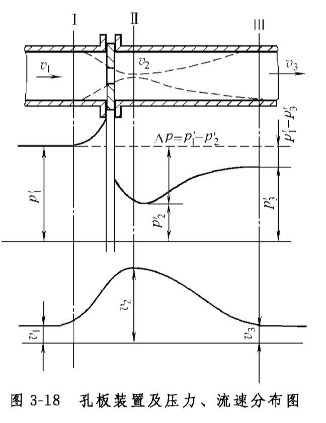

图 3-18 表示在孔板前后流体的速度与压力的分布情况。流体在管道截面 I 前，以一定的流速流动。此时静压力为 `p'1`。在接近节流装置时，由于遇到节流装置的阻挡，使靠近管壁处的流体受到节流装置的阻挡作用最大，因而使一部分动能转换为静压能，出现了节流装置入口端面靠近管壁处的流体静压力升高，并且比管道中心处的压力要大，即在节流装置入口端面处产生一径向压差。这一径向压差使流体产生径向附加速度，从而使靠近管壁处的流体质点的流向就与管道中心轴线相倾斜，形成了流束的收缩运动。由于惯性作用，流束的最小截面并不在孔板的孔处，而是经过孔板后仍继续收缩，到截面 Ⅱ 处达到最小，这时流速最大，达到 v2，随后流束又逐扩大，至截面 Ⅲ 后完全复原，流速便降低到原来的数值，即 `v3 = v1`。

由于节流装置造成流的局部收缩，使流体的流速发生变化，即动能发生变化。与此同时，表征流体静压能的静压力也要变化。在 I 截面，流体具有静压力 `p'1`。到达截面 Ⅱ，流速增加到最大值，静压力就降低到最小值 `p'2`，而后又随着流束的恢复而逐渐恢复。由于在孔板端面处，流通截面突然缩小与扩大，使流体形成局部涡流，要消耗一部分能量，同时流体流经孔板时，要克服摩擦力，所以流体的静压カ不能恢复到原来的数值 `p'1`，而产生了压力损失 `δ = p'1 - p'3`。

节流装置前流体压カ较高，称为正压，常以 `+` 标志；节流装置后流体压力较低，称为负压（注意不要与真空混淆），常以 `-` 标志。节流装置前后压差的大小与流量有关。管道中流动的流体流量越大，在节流装置前后产生的压差也越大，我们只要测出孔板前后两侧压差的大小，即可表示流量的大小，这就是节流装置测量流量的基本原理。

值得注意的是：要准确地测量出截面 I 与截面 Ⅱ 处的压力 `p'1`、`p'2` 是有困难的，这是因为产生最低静压力 `p'2` 的截面 Ⅱ 的位置随着流速的不同会改变的，事先根本无法确定。因此实际上是在孔板前后的管壁上选择两个固定的取压点，来测量流体在节流装置前后的压力变化的。因而所测得的压差与流量之间的关系，与测压点及测压方式的选择是紧密相关的。

2）流量基本方程式。流量基本方程式是阐明流量与压差之间定量关系的基本流量公式。它是根据流体力学中的伯努利方程和流体连续性方程式推导而得的，即：

『此处公式详见原文。』

式中：

α —— 流量系数，它与节流装置的结构形式、取压方式、孔口截面积与管道截面积之比 m、雷诺数 Re、孔口边缘锐度、管壁粗糙度等因素有关。

ε —— 膨胀校正系数，它与孔板前后压力的相对变化量、介质的等熵指数、孔口截面积与管道截面积之比等因素有关。应用时可查阅有关手册而得。但对不可压缩的液体来说，常取 `ε = 1`。

F0 —— 节流装置的开孔截面积。

Δp 一一 节流装置前后实际测得的压力差节。

ρ1 —— 流装置前的流体密度。

由流量基本方程式可以看出，要知道流量与压差的确切关系，关键在于 α 的取值。是一个受许多因素影响的综合性参数，对于标准节流装置，其值可从在有关手册中查出；对于非标准节流装置，其值要由实验方法确定。所以，在进行节流装置的设计计算时，是针对特定条件，选择一个 α 值来计算的。计算的结果只能应用在一定条件下。一旦条件改变（例如节流装置形式、尺寸、取压方式、工艺条件等等的改变），就不能随意套用，必另行计算。例如，按小负荷情况下计算的孔板，用来测量大负荷时流体的流量，就会引起较大的误差，必须加以必要的修正。

由流量基本方程式还可以看出，流量与压力差 Δp 的平方根成正比。所以，用这种流量计测量流量时，如果不加开方器，流量标尺刻度是不均匀的。起始部分的刻度很密，后来逐淅变疏。因此，在用差压法测量流量时，被测流量值不应接近于仪表的下限值，否则误差将会很大。

1-2『这里获取了一个关键知识点，对于压差式流量计，被测的流量值不应该接近仪表量程的下限值。做一张信息数据卡片。』——已完成

2、标准节流装置。

差压式流量计，由于使用历史长久，已经积累了丰富的实践经验和完整的实验资料。因此，国内外已把最常用的节流装置、孔板、喷嘴、文丘里管等标准化并称为「标准节流装置」。标准化的具体内容包括节流装置的结构、尺寸、加工要求、取压方法、使用条件等。例如，标准孔板对尺寸和公差、粗糙度等都有详细规定。如图 3-19 所示，其中 d/D 应在 0.2-0.8 之间；最小孔径应不小于 12.5mm；直孔部分的厚度 `h = (0.005-0.02)D`；总厚度 `H < 0.05D`；锥面的斜角 `a = 30-45°` 等等，需要时可参阅设计手册。

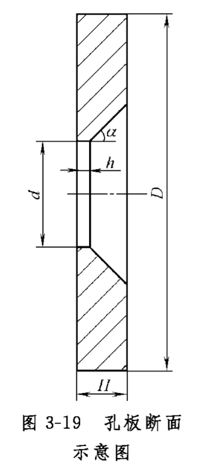

由基本流量方程式可知，节流件前后的差压 `p1 - p2` 是计算流量的关鍵数据，因此取压方法相当重要。我国国家规定的标准节流装置取压方法为两种，即角接取压法和法兰取压法。标准孔板采用角接取压法和法兰取压法，标准喷嘴为角接取压法。所谓角接取压法，就是在孔板（或喷嘴）前后两端面与管壁的夹角处取压。角接取压方法可以通过环室或单独钻孔结构来实现。环室取压结构如图 3-20（a）所示，它是在管道法兰 1 的直线段处，利用左右对称的环室 2 将孔板 3 夹在中间，环室与孔板端面间留有狭窄的缝隙，再由导压管将环室内的压力 p1 和 p2 引出。

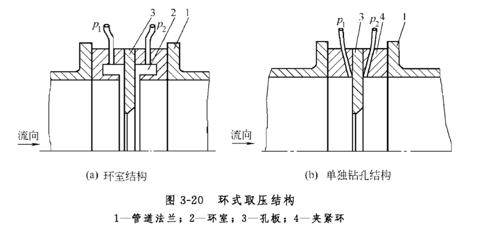

单独钻孔结构则是在前后夹紧环 4 上直接钻孔将压引出，如图 3-20（b）所示。对于孔板，环室取压用在工作压力即管道中流体的压力为 6.4MPa 以下，管道直径 D 在 50-520mm 之间；而单独钻孔取压用在工作压力为 2.5MPa 以下，D 在 50-1000mm 之间。

环室取压法能得到较好的测量精度，但是加工制造和安装要求严格，如果由于加工和现场安装条件的限制，达不到预定的要求时，其测量精度仍难保证。所以，在现场使用时，为了加工和安装方便，有时不用环室而用单独钻孔取压，特别是对大口径管道。

标准孔板应用广泛，它具有结构单、安装方便的特点，适用于大流量的测量。

孔板最大的缺点是流体经过孔板后压力损失大，当工艺管道上不允许有较大的压力损失时，便不宣采用。标准喷嘴和标准文丘里管的压力损失较孔板小，但结构比较复杂，不易加工。实际上，在一般场合下，仍多数采用孔板。

标准节流装置仅适用于测量管道直径大于 50mm，雷诺数在 10^4-10^5 以上的流体，而且流体应当清洁，充满全部管道，不发生相变。此外，为保证流体在节流装置前后为稳定的流动状态，在节流装置的上、下游必须配置一定长度的直管段。

节流装置将管道中流体流量的大小转换为相应的差压大小，但这个差压信号还必须由导压管引出，并传递到相应的差压计，以便显示出流量的数值。差压计有很多种形式，例如 U 形管差压计、双波纹管差压计、膜盒式差压计等，但这些仪表均为就地指示型仪表。事实上工业生产过程中的流量测量及控制多半是采用差压变送器，将差压信号转换为统一的标准信号，以利于远传，并与单元组合仪表中的其他单元相连接，这样便于集中显示及控制。差压变送器的结构和工作原理与压力变送器基本上是一样的，在第二节中介绍的矩平衡式、电容式差压变送器都能使用。

3、差压式流量计的测量误差。

差压式流量计的应用是非常广泛的。但是，在现场实际应用时，往往具有比较大的测量误差，有的甚至高达 10%-20%（应当指出，造成这么大的误差实际上完全是由于使用不当引起的，而不是仪表本身的测量误差）。特别是在采用差压式流量计作为工艺生产过程中物料的计量，进行经济核算和测取物料衡算数据时，这一矛盾更显得突出。然而在只要求流量相对值的场合下，对流量指示值与真实值之间的偏差往往不被注意，但是事实上误差却是客观存在的。因此，必须引起注意的是：不仅需要合理的选型、准确的设计计算和加工制造，更要注意正确的安装、维护和符合使用条件等，才能保证差压式流量计有足够的实际测量精度。

下面列举一些造成测量误差的原因，以便在应用中注意，并予以适当解决。

3.1）被测流体工作状态的变动。如果实际使用时被测流体的工作状态（温度、压力、湿度等）以及相应的流体重度、黏度、雷诺数等参数数值，与设计计算时有所变动，则会造成原来由差压计算得到的流量值与实际的流量值之间有较大的误差。为了消除这种误差，必须按新的工艺条件重新进行设计计算，或者将所测的数值加以必要的修正。

3.2）节流装置安装不正确。节流装置安装不正确，也是引起差压式流量计测量误差的重要原因之一。在安装节流装置时，特别要注意节流装置的安装方向。一般地说，节流装置露出部分所标注的「+」号一侧，应当是流体的入方向。当用孔板作为节流装置时，应使流体从孔板 90° 锐口的一侧流入。另外，节流装置除了必须按相应的规程正确安装外，在使用中，要保持节流装置的清洁。如在节流装置处有沉淀、结焦、堵塞等现象，也会引起较大的测量误差，必须及时清洗。

3.3）孔板入口边缘的磨损。节流装置使用日久，特别是在被测介质夹杂有固体颗粒等机械物情况下，或者由于化学腐蚀，都会造成节流装置的几何形状和尺寸的变化。对于使用广泛的孔板来说，它的入口边缘的尖锐度会由于冲击、磨损和腐蚀而变钝。这样，在相等数量的流体经过时所产生的压差 Δp 将变小，从而引起仪表指示值偏低。故应注意检査、维修必要时应换用新的孔板。

3.4）导压管安装不正确，或有堵塞、渗漏现象。导压管要正确地安装，防止堵塞与渗漏，否则会引起较大的测量误差。对于不同的被测介质，导压管的安装亦有不同的要求，下面结合几类具体情况来讨论。

3.4.1）测量液体的流量时，应该使两根导压管内都充满同样的液体而无气泡，以使两根导压管内的液体密度相等。这样，由两根导压管内液柱所附加在差压计正、负压室的压力可以互相抵消。为了使导压管内没有气泡，必须做到以下几点。

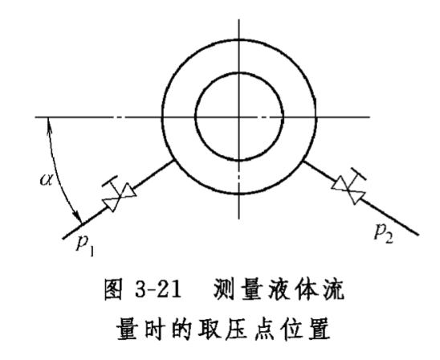

a）取压点应该位于节流装置的下半部，与水平线夹角 a 应为 0°-45°，如图 3-21 所示（如果从底部引出，液体中夹带的固体杂质会沉积在引压管内，引起堵塞，亦属不宜）。

b）引压导管最好垂直向下，如条件不许可，导压管亦应下倾一定的坡度（至少 1:20-1:10），使气泡易于排出。

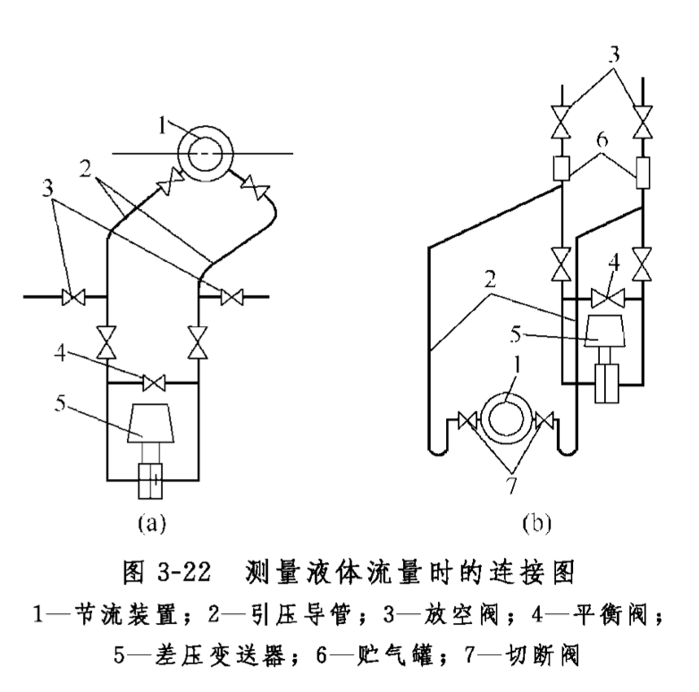

c）在引压导管的管路中，应有排气的装置。如果差压计只能装在节流装置之上时，则需加装贮气罐，如图 3-22 中的贮气罐 6 与放空阀 3。这样，即使有少量气泡，对差压 Δp 的测量仍无影响。

3.4.2）测量气体流量时，上述的这些基本原则仍然适用。尽管在引压导管的连接方式上有些不同，其目的仍是要保持两根导管内流体的密度相等。为此，必须使管内不积聚气体中可能夹带的液体，具体措施如下。

a）取压点应在节流装置的上半部。

b）引压导管最好垂直向上，至少亦应向上倾斜一定的坡度，以使引压导管中不滞留液体。

c）如果差压计必须装在节流装置之下，则需加装贮液罐和排放阀，如图 3-23 所示。

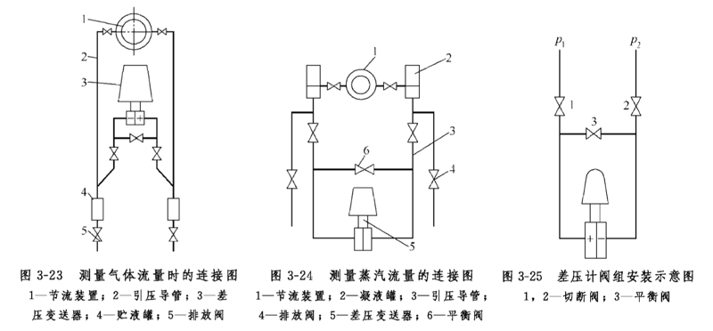

3.4.3）测量蒸汽的流量时，要实现上述的基本原则，必须解决蒸汽冷凝液的等液位问题，以消除冷凝液液位的高低对测量精度的影响。

最常用的接法见图 3-24 所示。取压点从节流装置的水平位置接出，并分别安装凝液罐 2。这样，两根导压管内都充满了冷凝液，而且液位一样高，从而实现了差压 Δp 的准确测量。自凝液罐至差压计的接法与测量液体流量时相同。

3.5）差压计安装或使用不正确。差压计或差压变送器安装或使用不正确也会引起测量误差。

由引压导管接至差压计或变送器前，必须安装切断阀 1、2 和平衡阀 3，成三阀组，如图 3-25 所示。我们知道，差压计是用来测量差压 Δp 的，但如果两切断阀不能同时开闭时，就会造成差压计单向受很大的静压力，有时会使仪表产生附加误差，严重时会使仪表损坏。为了防止差压计单向受很大的静压，必须正确使用平衡阀。在启用差压计时，应先开平衡阀 3，使正、负压室连通，受压相同，然后再打开切断阀 1、2，最后再关闭平衡阀 3，差压计即可投入运行。差压计需要停用时，应先打开平衡阀，然后再关闭切断阀 1、2。

当切断阀 1、2 关闭时，打开平衡阀 3，便可进行仪表的零点校验。

测量腐蚀性（或因易疑固不适宜直接进入差压计）的介质流量时，必须采取隔离措施。最常用的方法是用某种与被测介质不互溶且不起化学变化的中性液体作为隔离液，同时起传递压力的作用。当隔离液的密度 1 大于或小于被测介质密度时，隔离分别采用图 3-26 所示的两种形式。

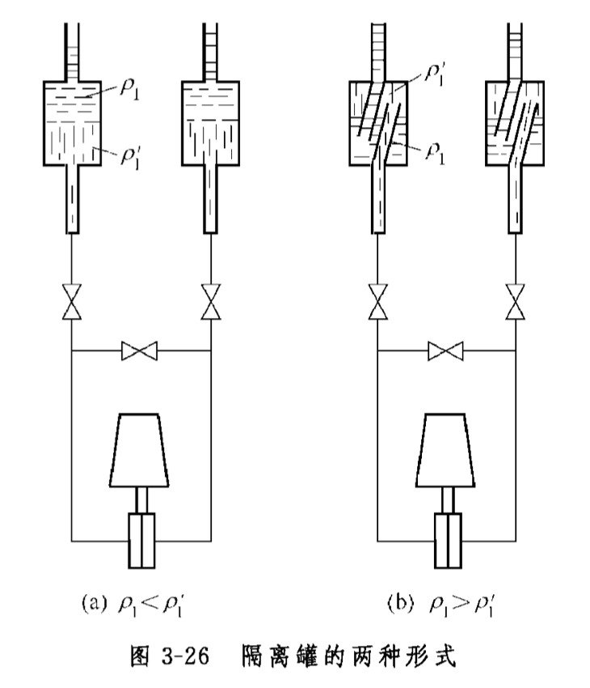

#### 3.3.3 转子流量计

在工业生产中经常遇到小流量的测量，因其流体的流速低，这就要求测量仪表有较高的灵敏度，才能保证一定的精度。节流装置对管径小于 50mm、低雷诺数的流体的测量精度是不高的。而转子流量计则特别适宜于测量管径 50mm 以下管道的流量，测量的流量可小到每小时几升。

1、工作原理。

转子流量计与前面所讲的差压式流量计在工作原理上是不相同的。差压式流量计，是在节流面积（如孔板流通面积）不变的条件下，以差压变化来反映流量的大小。而转子流量计，却是以压降不变，利用节流面积的变化来测量流量的大小，即转子流量计采用的是恒压降、变节流面积的流量测量方法。


图 3-27 是指示式转子流量计的原理图，它基本上由两个部分组成，一个是由下往上逐淅扩大的锥形管（通常用玻璃制成，锥度为 40'-3°）；另一个是放在锥形管内可自由运动的转子。工作时，被测流体（气体或液体）由锥形管下端进入，沿着锥形管向上运动，流过转子与锥形管之间的环隙，再从锥形管上端流出。当流体流过锥形管时，位于锥形管中的转子受到向上的一个力，使转子浮起。当这个力正好等于漫没在流体里的转子重力（即等于转子重量减去流体对转子的浮力）时，则作用在转子上的上下两个力达到平衡，此时转子就停浮在一定的高度上。假如被测流体的流量突然由小变大时，作用在转子上的向上的力就加大。因为转子在流体中受的重力是不变的，即作用在转子上的向下力是不变的，所以转子就上升。由于转子在锥形管中位置的升高，造成转子与锥形管间的环隙增大，即流通面积增大。随着环隙的增大，流过此环隙的流体流速变慢，因而，流体作用在转子上的向上力也就变小。当流体作用在转子上的力再次等于转子在流体中的重力时，转子又稳定在一个新的高度上。这样，转子在锥形管中的平衡位置的高低与被测介质的流量大小相对应。如果在形管外沿其高度刻上对应的流量值，那么根据转子平衡位置的高低就可以直接读出流量的大小。这就是转子流量计测量流量的基本原理。

转子流量计中转子的平衡条件是：

```
V(ρt-ρf)g = (p1-p2)A
```

式中，V 为转子的体积；ρt 为转子材料的密度；ρf 为被测流体的密度；p1、p2 分别为转子前后流体的压力；A 为转子的最大横截面积；g 为重力加速度。

由于在测量过程中，V、ρt、ρf、A、g 均为常数，所以由式可知，`(p1-p2)` 也应为常数。这就是说，在转子流量计中，流体的压降是固定不变的。所以，转子流量计是以定压降变节流面积法测量流量的。这正好与差压法测量流量的情况相反，差压法测量流量时，压差是变化的，而节流面积却是不变的。

由式（3-25）可得：

『公式详见原书。』

在 Δp 一定的情况下，流过转子流量计的流量和转子与锥形管间环面积 F0 有关。由于锥形管由下往上逐淅扩大，所以 F0 是与转子浮起的高度有关的。这样，根据转子浮起的高度就可以判断被测介质的流量大小，可用下式表示：

『公式详见原书。』

式中，ψ 为仪表常数；h 为转子浮起的高度。

将式（3-26）代入以上两式，分别得到：

『公式详见原书。』

其他符号的意义同前所述。

2、电远传式转子流量计。

以上所讲的指示式转子流量计，只适用于就地指示。电远传式转子流量计可以将反映流量大小的转子高度 h 转换为电信号，适合于远传，进行显示或记录。

LZD 系列电远传式转子流量计主要由流量变送及电动显示两部分组成。

2.1）流量变送部分 LZD 系列电远传式转子流量计是用差动变压器进行流量变送的。差动变压器的结构与原理如图 3-28 所示。它由铁芯、线圈以及骨架组成。线圈骨架分成长度相等的两段，初级线圈均匀地密绕在骨架的内层，并使两个线圈同相串联相接；次级线圈分别均匀地密绕在两段骨架的外层，并将两个线圈反相串联相接。

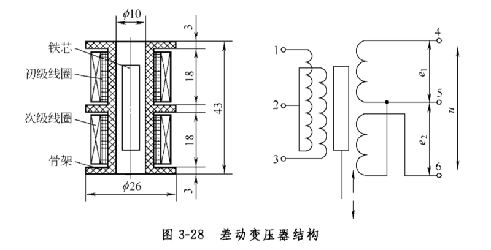

当铁芯处在差动变压器两段线圈的中间位置时，初级激磁线圈激励的磁力线穿过上、下两个次级线圈的数目相同，因而两个匝数相等的次级线圈中产生的感应电 e1、e2 相等。

由于两个次级线圈系反相串联，所以 e1、e2 相互抵消，从而输出端 4、6 之间总电为零。即：`u = e1 - e2`。

当铁芯向上移动时，由于铁芯改变了两段线圈中初、次级的耦合情，使磁力线通过上段线圈的数目增加，通过下段线圈的磁力线数目减少，因而上段次级线圈产生的感应电势比下段次级线圈产生的感应电势大，即 `e1> e2`，于是 4、6 两端输出的总电势 `u = e1 - e2 > 0`。当铁芯向下移动时，情况与上移正好相反，即输出的总电势 `u = e1 - e2 < 0`。无论哪种情况，都把这个输出的总电势称为不平衡电势，它的大小和相位由铁芯相对于线圈中心移动的距离和方向来决定。

若将转子流量计的转子与差动变压器的铁芯连接起来，使转子随流量变化的运动带动铁芯一起运动，那么，就可以将流量的大小转换成输出感应电势的大小，这就是电远传转子流量计的转换原理。

2.2）电动显示部分图 3-29 是 LZD 系列电远传转子流量计的原理图。当被测介质流量变化时，引起转子停浮的高度发生变化；转子通过连杆带动发送的差动变压器 T1 中的铁芯上下移动。当流量增加时，铁芯向上移动，变压器 T1 的次級绕组输出一不平衡电势，进入电子放大器。放大后的信号一方面通过可逆电机带动显示机构动作；另一方面通过凸轮带动接收的差动变压器 T2 中的铁芯向上移动。使 T2 的次级绕组也产生个不平衡电势。由于 T1、T2 的次级绕组是反向串联的，因此由 T2 产生的不平衡电势去抵消 T1 产生的不平衡电势，一直到进入放大器的电压为零后，T2 中的铁芯便停留在相应的位置上，这时显示机构的指示值便可以表示被测流量的大小了。

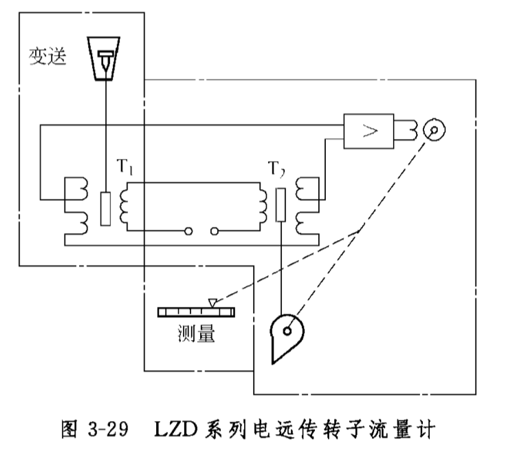

3、转子流量计的指示值修正。

转子流量计是一种非标准化仪表，在大多数情下，可按照实际被测介质进行刻度。但仪表厂为了便于成批生产，是在工业基准状态（20℃、0.10133MPa）下用水或空气进行刻度的，即转子流量计的流量标尺上的刻度值，对用于测量液体来讲是代表 20℃ 时水的流量值，对用于测量气体来讲则是代表 20℃、0.10133MPa 压カ下空气的流量值。所以，在实际使用时，如果被测介质的密度和工作状态不同，必须对流量指示值按照实际被测介质的密度、温度、压力等参数的具体情况进行修正。

3.1）液体流量测量时的修正。测量液体的转子流量计，由于制造厂是在常温（20℃）下用水标定的，根据式（3-30）可写为：

『公式详见原书。』

式中，Q0 为用水标定时的刻度流量；ρw 为水的密度。其他符号同式（3-30）。

如果使用时被测介质不是水，则由于密度的不同必须对流量刻度进行修正或重新标定。对一般液体介质来说，当温度和压力改变时，对密度影响不大。如果被测介质的黏度与水的黏度相差不大（不超过 0.03Pa·s），可近似认为 Φ 是常数，则有：

『公式详见原书。』

式中，Qf 表示密度为 ρf 的被测介质实际流量。式（3-31）与式（3-32）相除，整理后得：

『公式详见原书。』

式中，KQ 为体积流量密度修正系数。同理可导得质量流量的修正公式为：

式中，KM 为质量流量密度修正系数；Mf 为流过仪表的被测介质的实际质量流量。

当采用耐酸不锈钢作为转子材料时，ρt = 7.9g/cm3，水的密度 ρw = 1g/cm3，代入式（3-34）与式（3-36）得：

当介质密度变化时，密度修正系数 KQ、KM 的数值见表 3-2。现举例说明上述修正公式的应用。

表 3-2 密度修正系数表


例 4 现用一只以水标定的转子流量计来测量苯的流量，知转子材料为不锈钢，ρt = 7.9g/cm3，苯的密度为 ρf = 0.83g/cm3。试问流量计读数为 3.6L/s 时，苯的实际流量是多少？

解由式（3-37）计算或由表 3-2 可查得：KQ = 0.9。将此值代入式（3-33），得：

```
Qf = (1/KQ)xQ0 = (1/0.9)x3.6 = 4 L/s。
```

即苯的实际流量为 4L/s。

3.2）气体流量测定时的修正。对于气体介质流量值的修正，除了被测介质的密度不同以外，被测介质的工作压力和温度的影响也较显著，因此对密度、工作压力和温度均需进行修正。

转子流量计用来测量气体时，制造厂是在工业基准状态（293K、0.10133MPa 绝对压力）下用空气进行标定的。对于非空气介质在不同于上述基准状态下测量时，要进行校正。当已知仪表显示刻度 Q0，要计算实际的工作介质流量时，可按下式修正。

『公式详见原书。』

值得注意的是，由式（3-39）计算得到的 Q1 是被测介质在单位时间（小时）内流过转子流量计的标准状态下的容积数（标准立方米），而不是被测介质在实际工作状态下的容积流量。这是因为气体计量时，一般用标准立方米计，而不用实际工作状态下的容积数来计。下面也用具体例子来说明（3-39）式的应用。

例 5 某厂用转子流量计来测量温度为 27℃，表压为 0.16MPa 的空气流量，间转子流 量计读数为 38Nm3/h 时，空气的实际流量是多少？

将上列数据代入（3-39）式，便可得：

即这时空气的流量为 60.3Nm3/h。

3.3）蒸汽流量测量时的换算。转子流量计用来测量水蒸气流量时，若将蒸汽流量换算为水流量，可按式（3-35）计算。若转子材料为不锈钢，P=7.9g/cm3，则有

『公式详见原书。』

式中，Q0 为水流量，L/h；ρf 为蒸汽密度，kg/m3；Mf 为蒸汽流量，kg/h。

由上式可以看出，若已知某饱和蒸汽（温度不超过 200℃）流量值时，可从上式换算成相应的水流量值，然后按转子流量计规格选择合遁口径的仪表。

#### 3.3.4 椭圆齿轮流量计

椭圆齿轮流量计是属于容积式流量计的一种。它对被测流体的黏度变化不敏感，特别适合于测量高黏度的流体（例如重油、聚乙烯醇、树脂等），甚至糊状物的流量。

1、工作原理。

椭圆齿轮流量计的测量部分是由两个相互啮合的椭圆形齿轮 A 和 B、轴及壳体组成。椭圆齿轮与壳体之间形成测量室，如图 3-30 所示。

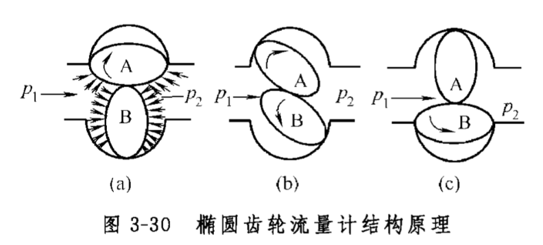

当流体流过椭圆齿轮流量计时，由于要克服阻力将会引起阻力损失，从而使进口侧压力 p1 大于出口侧压力 p2，在此压カ差的作用下，产生作用力矩使椭圆齿轮连续转动。在图 3 30（a）所示的位置时，由于 `p1  > p2`，在 p1 和 p2 的作用下所产生的合力矩使 A 轮顺时针方向转动。这时 A 为主动轮，B 为从动轮。在图 3-30（b）上所示为中间位置，根据力的分析可知，此时 A 轮与 B 轮均为主动轮。当继续转至 3-30（c）所示位置时，p1 和 p2 作用在 A 轮上的合力矩为零，作用在 B 轮上的合力矩使 B 轮作逆时针方向转动，并把已吸入的半月形容积内的介质排出出口，这时 B 轮为主动轮，A 轮为从动轮，与图 3-30（a）所示情况刚好相反。

如此往复循环，A 轮和 B 轮互相交替地由一个带动另一个转动，并把被测介质以半月形容积为单位一次一次地由进ロ排至出ロ。显然，图 3-30（a）、（b）、（c）所示，仅仅表示椭圆齿轮转动了 1/4 周的情况，而其所排出的被测介质为一个半月形容积。所以，椭圆齿轮每转一周所排出的被测介质量为半月形容积的 4 倍。故通过椭圆齿轮流量计的体积流量 Q 为：

```
Q = 4nV0
```

式中，m 为椭圆齿轮的旋转速度；V0 为半月形测量室容积。由式（3-42）可知，在椭圆齿轮流量计的半月形容积 V0 已定的条件下，只要测出椭圆齿轮的转速 n，便可知道被测介质的流量。

椭圆齿轮流量计的流量信号（即转速 n）的显示，有就地显示和远传显示两种。配以定的传动机构及积算机构，就可记录或指示被测介质的总量。

2、使用特点。

由于椭圆齿轮流量计是基于容积式测量原理的，与流体的黏度等性质无关。因此，特别适用于高黏度介质的流量测量。测量精度较高，压力损失较小，安装使用也较方便。但是，在使用时要特别注意被测介质中不能含有固体颗粒，更不能夹杂机械物，否则会引起齿轮磨损以至损坏。为此，椭圆齿轮流量计的入口端必须加装过滤器。另外，楠圆齿轮流量计的使用温度有一定范围，温度过高，就有使齿轮发生卡死的可能。

椭圆齿轮流量计的结构复杂，加工制造较为困难，因而成本较高。如果因使用不当或使用时间过久，发生泄漏现象，就会引起较大的测量误差。

#### 3.3.5 涡轮流量计

在流体流动的管道内，安装一个可以自由转动的叶轮，当流体通过叶轮时，流体的动能使叶轮旋转。流体的流速越高，动能就越大，叶轮转速也就越高。在规定的流量范围和一定的流体黏度下，转速与流速成线性关系。因此，测出叶轮的转速或转数，就可确定流过管道的流体流量或总量。日常生活中使用的某些自来水表、油量计等，都是利用这种原理制成的，这种仪表称为速度式仪表。涡轮流量计正是利用相同的原理，在结构上加以改进后制成的。

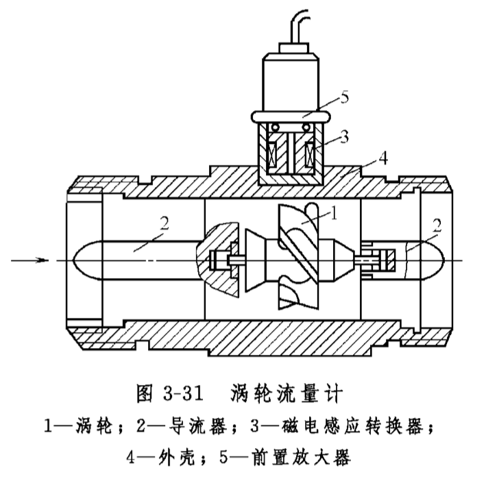

图 3-31 是涡轮流量计的结构示意图，它主要由下列几部分组成。1）涡轮 1 是用高导磁系数的不锈钢材料制成，叶轮芯上装有螺旋形叶片，流体作用于叶片上使之转动。2）导流器 2 是用以稳定流体的流向和支承叶轮的。3）磁电感应转换器 3 是由线圈和磁钢组成，用以将叶轮的转速转换成相应的电信号，以供给前置放大器 5 进行放大。4）整个涡轮流量计安装在外壳 4 上，外壳 4 是由非导磁的不锈钢制成，两端与流体管道相连接。

涡轮流量计的工作过程如下。当流体通过涡轮叶片与管道之间的间隙时，由于叶片前后的压差产生的力推动叶片，使涡轮旋转。在涡轮旋转的同时，高导磁性的涡轮就周期性地扫过磁钢，使磁路的磁阻发生周期性的变化，线圈中的磁通量也跟着发生周期性的变化，线圈中便感应出交流电信号。交变电信号的频率与涡轮的转速成正比，也即与流量成正比。这个电信号经前置放大器放大后，送往电子计数器或电子频率计，以累积或指示流量。

涡轮流量计安装方便，磁电感应转换器与叶片间不需密封和齿轮传动机构，因而测量精度高，可耐高压，静压可达 50MPa。由于基于磁电感应转换原理，故反应快，可测脉动流量。输出信号为电频率信号，便于远传，不受扰。

涡轮流量计的涡轮容易磨损，被测介质中不应带机械杂质，否则会影响测量精度和损坏机件。因此，一般应加过滤器。安装时，必须保证前后有一定的直管段，以使流向比较稳定。一般入ロ直管段的长度取管道内径的 10 倍以上，出ロ取 5 倍以上。

3『注意，涡轮流量计的安装要求，管道需要前 10 后 5，跟以前累积的工程设计知识关联上了。（2021-01-17）』

#### 3.3.6 电磁流量计

在流量测量中，当被测介质是具有导电性的液体介质时，可以应用电磁感应的方法来测量流量。电磁流量计的特点是能够测量酸、碱、盐溶液以及含有固体颗粒（例如泥浆）或纤维液体的流量。

电磁流量计通常由变送器和转换器两部分组成。被测介质的流量经变送器变换成感应电势后，再经转换器把电势信号转换成统一的 0-10mA 直流信号作为输出，以便进行指示、记录或与电动单元组合仪表配套使用。

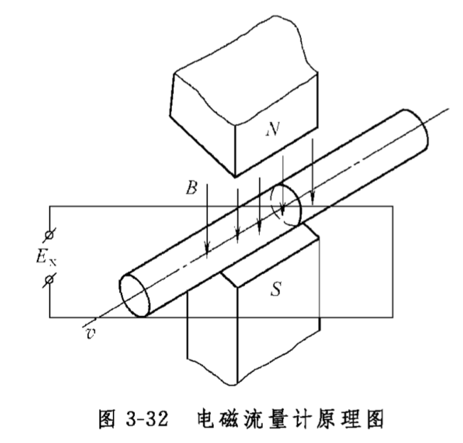

电磁流量计变送部分的原理图如图 3-32 所示。在段用非导磁材料制成的管道外面，安装有一对磁极和 S，用以产生磁场。当导电液体流过管道时，因流体切割磁力线而产生了感应电势（根据发电机原理）。此感应电势由与磁极成垂直方向的两个电极引出。当磁感应强度不变，管道直径一定时，这个感应电势的大小仅与流体的流速有关，而与其他因素无关。将这个感应电势经过放大、转换、传送给显示仪表，就能在显示仪表上读出流量来。

感应电势的方向由右手定则判断，其大小由下式决定：`Ex = K'BDv`。

式中，Ex 为感应电势；K' 为比例系数；B 为磁感应强度；D 为管道直径，即垂直切割磁力线的导体长度；v 为垂直于磁力线方向的液体速度。体积流量 Q 与流速的关系为：`Q = (1/4)πD^2v`。

将式（3-44）代入式（3-43），便得：

『公式详见原书。』

K 称为仪表常数，在磁感应强度 B、管道直径 D 确定不变后，K 就是一个常数，这时感应电势的大小与体积流量之间具有线性关系，因而仪表具有均匀刻度。

为了避免磁力线被测量导管的管壁短路，并使测量管在磁场中尽可能地降低涡流损耗，测量导管应由非导磁的高阻材料制成。

电磁流量计的测量导管内无可动部件或突出于管内的部件，因而压力损失很小。在采取防腐衬里的条件下，可以用于测量各种腐蚀性液体的流量，也可以用来测量含有颗粒、悬浮物等液体的流量。此外，其输出信号与流量之间的关系不受液体的物理性质（例如温度、压、黏度等）变化和流动状态的影响。对流量变化反应速度快，故可用来测量脉动流量。

电磁流量计只能用来测量导电液体的流量，其导电率要求不小于水的导电率。不能测量气体、蒸汽及石油制品等的流量。由于液体中所感应出的电势数值很小，所以要引入高放大倍数的放大器，由此而造成测量系统很复杂、成本高，并且很容易受外界电磁场干扰的影响，在使用不恰当时会大大地影响仪表的精度。在使用中要注意维护，防止电极与管道间绝缘的破坏。安装时要远离一切磁源（例如大功率电机、变压器等）。不能有振动。

#### 3.3.7 漩涡流量计

漩涡流量计又称涡街流量计。它可以用来测量各种管道中的液体、气体和蒸汽的流量，是目前工业控制、能源计量及节能管理中常用的新型流量仪表。

漩涡流量计的特点是精确度高、测量范围宽、没有运动部件、无机械磨损、维护方便、压力损失小、节能效果明显。

漩涡流量计是利用有规则的漩涡剥离现象来测量流体流量的仪表。在流体中垂直插入个非流线型的柱状物（圆柱或三角柱）作为漩涡发生体，如图 3-33 所示。当雷诺数达到一定的数值时，会在柱状物的下游处产生如图所示的两列平行状，并且上下交替出现的漩涡，因为这些漩涡有如街道旁的路灯，故有「涡街」之称，又因此现象首先被卡曼（Karman）发现，也称作「卡曼涡街」。当两列漩涡之间的距离 h 和同列的两漩涡之间的距离 L 之比能 满足 `h/L = 0.281` 时，则所产生的涡街是稳定的。


由圆柱体形成的卡曼漩涡，其单侧漩涡产生的频率为：`f = St x v/d`。

式中，f 为单侧漩涡产生的频率，Hz；v 为流体平均流速，m/s；d 为圆柱体直径，m；St 为斯特劳哈尔（Strouhal）系数（当雷诺数 `Re = 5x10^2-15×10^4` 时，`St = 0.2`）。由上式可知，当 St 近似为常数时，漩涡产生的频率 f 与流体的平均流速成正比，测得 f 即可求得体积流量 Q。

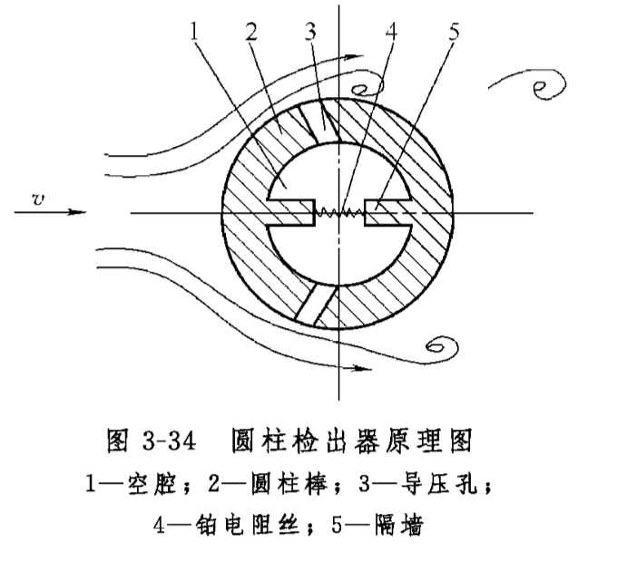

漩涡频率的检测方法有许多种，例如热敏检测法、电容检测法、应检测法、超声检测法等，这些方法无非是利用漩涡的局部压力、密度、流速等的变化作用于敏感元件，产生周期性电信号，再经放大整形，得到方波脉冲。图 3-34 所示的是种热敏检测法。它采用铂电阻丝作为漩涡频率的转换元件。在圆柱形发生体上有一段空腔（检测器），被隔墙分成两部分。在隔墙中央有一小孔，小孔上装有根被加热了的细铂丝。在产生漩涡的一侧，流速降低，静压升高，于是在有漩涡的一侧和无漩涡的一侧之间产生静压差。流体从空腔上的导压孔进入，向未产生漩涡的一侧流出。流体在空腔内流动时将铂丝上的热量带走，铂丝温度下降，导致其电阻值减小。由于漩涡是交替地出现在柱状物的两侧，所以铂热电阻丝阻值的变化也是交替的，且阻值变化的频率与漩涡产生的频率相对应，故可通过测量铂丝阻值变化的频率来推算流量。

铂丝阻值的变化频率，采用一个不平衡电桥进行转换、放大和整形，再变换成 0-10mA 或 4-20mA 直流电流信号输出，供显示，累积流量或进行自动控制。

#### 3.3.8 质量流量计

前面介绍的各种流量计均为测量体积流量的仪表，一般来说可以满足流量测量的要求。但是，有时人们更关心的是测量流过流体的质量是多少。这是因为物料平衡、热平衡以及贮存、经济核算等都需要知道介质的质量。所以，在测量工作中，常常要将已测出的体积流量乘以介质的密度，换算成质量流量。由于介质密度受温度、压力、黏度等许多因素的影响，气体尤为突出，这些因素往往会给测量结果带来较大的误差。质量流量计能够直接得到质量流量，这就能从根本上提高测量精度，省去了繁琐的换算和修正。

质量流量计大致可分为两大类：一类是直接式质量流量计，即直接检测流体的质量流量；另一类是间接式或推导式质量流量计，这类流量计是通过体积流量计和密度计的组合来测量质量流量。

1、直接式质量流量计。

直接式质量流量计的形式很多，有量热式、角动量式、差压式以及科氏力式等。下面介绍其中的一种 —— 科里奥利质量流量计，简称科氏力流量计。

这种流量计的测量原理是基于流体在振动管中流动时，将产生与质量流量成正比的科里奥利力。图 3-35 是一种 U 形管式科氏力流量计的示意图。


U 形管的两个开口端固定，流体从一端流入，由另一端流出。在 U 形管顶端装有电磁装置，激发 U 形管以 O-O 为轴，按固有的频率振动，振动方向垂直于 U 形管所在平面。U 形管内的流体在沿管道流动的同时又随管道做垂直运动，此时流体就会产生 —— 科里奥利加速度，并以科里奥利力反作用于 U 形管。由于流体在 U 形管两侧的流动方向相反，因此作用于 U 形管两侧的科氏大小相等方向相反，于是形成一个作用矩。U 形管在该力矩的作用下将发生扭曲，扭曲的角度与通过 U 形管的流体质量流量成正比。如果在 U 形管两侧中心平面处安装两个电磁传感器测出 U 形管扭转角度的大小，就可以得到所测的质量流量 M，其关系式为：

『公式详见原书。』

式中，θ 为扭转角；Ks 为扭转弹性系数；w 为振动角速度；r 为 U 形管跨度半径。

科氏力质量流量计的特点是能够直接测量质量流量，不受流体物性（密度、黏度等）的影响，测量精度高；测量值不受管道内流场影响，没有上、下游直管段长度的要求；可测各种非牛顿流体以及黏滞和含微粒的浆液。但是它的阻力损失较大，零点不稳定以及管路振动会影响测量精度。

2、间接式质量流量计。

这类仪表是由测量体积流量的仪表与测量密度的仪表配合，再用运算器将两表的测量结果加以适当的运算，间接得出质量流量。

2.1）测量体积流量 Q 的仪表与密度计配合。这种测量方法如图 3-36 所示。测量体积流量的仪表可采用涡轮流量计、电磁流量计、容积式流量计和漩涡流量计等。如图 3-36 所示，满轮沆流量计的输出信号 y 正比于 Q，密度计的输出信号 x 正比于 ρ，通过运算器进行乘法运算，即得质量流量：`xy = KρQ`。

式中，K 为系数。


2.2）测量 ρQ^2 的仪表与密度计配合。能够测量 Q^2 的仪表有差压式流量计、靶式流量计和动压测量管等。如图 3-37 所示，由孔板两端取出的压差 Δp 与 ρQ^2 成正比。差压变送器的输出信号 y 正比于 ρQ^2，密度计的输出信号 x 正比于 ρ，两信号通过运算器相乘再开方，即得质量流量。

2.3）测量 ρQ^2 的仪表与测量 Q 的仪表配合。这种测量方法如图 3-38 所示。测量 ρQ^2 的仪表输出的信号 x，除以测量 Q 的仪表输出信号 y，即得质量流量：

『公式详见原书。』

式中，K 为系数。


流量计的种类很多，除了以上介绍的几种流量计图 3-38 差压流量计与涡轮流量计配合外，还有许多类型的流量计，例如靶式流量计、堰式流量计等。随着工业生产自动化水平的提高，许多新的流量测量方法也日益被人们重视和采用，例如超声波、激光、X - 射线及核磁共振等逐渐应用到业生产中，成为目前较新的流量测量技术。

### 3.4 物位检测及仪表

#### 3.4.1 概述

在容器中液体介质的高低称为液位，容器中固体或颗粒状物质的堆积高度称为料位。测量液位的仪表称为液位计，测量料位的仪表称为料位计，而测量两种密度不同液体介质的分界面的仪表称为界面计。上述三种仪表统称为物位仪表。物位测量在现代工业生产自动化中具有重要的地位。随着现代化工业设备规模的扩大和集中管理，特别是计算机投入运行以后，物位的测量和远传更显得重要了。

通过物位的测量，可以正确获知容器设备中所储物质的体积或质量；监视或控制容器内的介质物位，使它保持在一定的工艺要求的高度，或对它的上、下限位置进行报警，以及根据物位来连续监视或调节容器中流入与流出物料的平衡。所以，一般测量物位有两种目的，种是对物位测量的绝对值要求非常准确，借以确定容器或贮存库中的原料、辅料、半成品或成品的数量；另一种是对物位测量的相对值要求非常准确，要能迅速正确反映某一特定水准面上的物料相对变化，用以连续控制生产工艺过程，即利用物位仪表进行监视和控制。

物位测量对安全生产关系十分密切。例如合成氨生产中铜洗塔塔底的液位控制塔底液位过高，精炼气就会带液，导致合成塔触中毒；反之，如果液位过低时，会失去液封作用，发生高压气冲入再生系统，造成严重事故。

工业生产中对物位仪表的要求多种多样，主要的有精度、量程、经济和安全可靠等方面。其中首要的是安全可靠。测量物位仪表的种类很多。按其工作原理主要有下列几种类型

1、直读式物位仪表。这类仪表中主要有玻璃管液位计、玻璃板液位计等。

2、差压式物位仪表。它又可分为压力式物位仪表和差压式物位仪表，利用液柱或物料堆积对某定点产生压力的原理而工作。

3、浮力式物位仪表。利用浮子（或称沉筒）高度随液位变化而改变或液体对浸沉于液体中的浮子的浮力随液位高度而变化的原理工作。它又可分为浮子带钢丝绳或钢带的、浮球带杠杆的和沉筒式的几种。

4、电磁式物位仪表。使物位的变化转换为一些电量的变化，通过测出这些电量的变化来测知物位。它可以分为电阻式（即电极式）、电容式和电感式物位仪表等。还有利用压磁效应工作的物位仪表。

5、核辐射式物位仪表。利用核辐射透过物料时，其强度随物质层的厚度而变化的原理而工作的，目前应用较多的是 y 射线。

6、声波式物位仪表。由于物位的变化引起声阻抗的变化、声波的遮断和声波反射距离的不同，测出这些变化就可测知物位。所以声波式物位仪表可以根据它的工作原理分为声波遮断式、反射式和阻尼式。

7、光学式物位仪表。利用物位对光波的遮断和反射原理工作，它利用的光源可以有普通白炽灯光或激光等。

此外，还有一些其他形式的物位仪表，下面重点介绍差压式液位计，并筒单介绍几种其他类型的物位测量仪表。

#### 3.4.2 差压式液位变送器

利用差压或压力变送器可以很方便地测量液位，且能输出标准的电流或气压信号，有关变送器的原理及结构已在第二节里介绍，此处只着重讨论其应用。

1、工作原理。

差压式液位变送器，是利用容器内的液位改变时，由液柱产生的静压也相应变化的原理而工作的，如图 3-39 所示。


将差压变送器的一端接液相，另一端接气相。设容器上部空间为干燥气体，其压力为 p，则：

```
p1 = p + ρgH
p2 = p
```

因此可得：`Δp = p1 - p2 = ρgH`。

式中，H 为液位高度；ρ 为介质密度；g 为重カ加速度；p1，p2 分别为差压变送器正负压室的压力。通常，被测介质的密度是已知的。差压变送器测得的差压与液位高度成正比。这样就把测量液位高度转换为测量差压的问题了。

当被测容器是敞口的，气相压カ为大气压时，只需将差压变送器的负压室通大气即可。若不需要远传信号，也可以在容器底部安装压力表，如图 3-40 所示，根据压力か与液位 H 成正比的关系，可直接在压力表上按液位进行刻度。

2、零点迁移问题。

在使用差压变送器测量液位时，一般来说，其压差 Δp 与液位高度 H 之间有如下关系：`Δp = ρgH`。

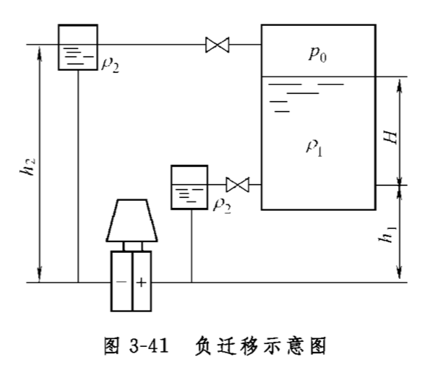

这就属于一般的「无迁移」情况。当 `H = 0` 时，作用在正、负压室的压力是相等的。但是在实际应用中，往往 H 与 Δp 之间的对应关系不那么简单。例如图 3-41 所示，为防止容器内液体和气体进入变送器而造成管线堵塞或腐蚀，并保持负压室的液柱高度恒定，在变送器正、负压室与取压点之间分别装有隔离罐，并充以隔离液。若被测介质密度为，隔离液密度为 ρ2（通常 ρ2 > ρ1），这时正、负压室的压力分别为：

『公式详见原书。』

正、负压室间的压差为：

『公式详见原书。』

式中，Δp 为变送器正、负压室的压差；H 为被测液位的高度；h1 为正压室隔离罐液位到变送器的高度；h2 为负压室隔离罐液位到变送器的高度。

将式（3-57）与式（3-54）相比较，就知道这时压差减少了 `(h2 - h1)ρ2g` 一项，也就是说，当 H = 0 时，`Δp = -(h2 - h1)ρ2g`，对比无迁移情况，相当于在负压室多了一项压カ，其固定数值为 `(h2 - h1)ρ2g`。假定采用的是 DDZ-Ⅲ 型差压变送器，其输出范为 4-20mA 的电流信号。在无迁移时，H = 0，Δp = 0，这时变送器的输出 I0 = 4mA，H = Hnax，Δp = Δpmax，这时变送器的输出 I0 = 20mA。

但是有迁移时，根据式（3-57）可知，由于有固定差压的存在，当 H = 0 时，变送器的输入小于 0，其输出必定小于 4mA；当 H = Hax 时变送器的输入小于 Δmax，其输出必定小于 20mA。为了使仪表的输出能正确反映出液位的数值，也就是使液位的零值与满量程能与变送器输出的上、下限值相对应，必须设法抵消固定压差 `(h2 - h1)ρ2g` 的作用，使得当 H = 0 时，变送器的输出仍然回到 4mA，而当 H = Hmax 时，变送器的输出能为 20mA。采用零点迁移的办法就能够达到此目的，即调节仪表上约迁移弹簧，以抵消固定压差 `(h2 - h1)ρ2g` 的作用。

这里迁移弹的作用，其实质是改变变送器的零点。迁移和调零都是使变送器输出的起始值与被测量起始点相对应，只不过零点调整量通常较小，而零点迁移量则比较大。

迁移同时改变了测量范围的上、下限，相当于测量范的平移，它不改变量程的大小。例如，某差压变送器的测量范围为 0-5000Pa，当压差由 0 变化到 5000Pa 时，变送器的输出将由 4mA 变化到 20mA，这是无迁移的情况，如图 3-42 中曲线 a 所示。当有迁移时，假定固定压差为 `(h2 - h1)ρ2g = 2000Pa`，那么 H = 0 时，根据式（3-57）有 `Δp = -(h2 - h1)ρ2g = -2000Pa`，这时变送器的输出应为 4mA，H 为最大时，`Δp = ρ1gH -(h2 - h1)ρ2g = 5000 - 3000 = 2000Pa`，这时变送器输出应为 20mA，如图 3-42 中曲线 b 所示。也就是说，Δp 从 -2000Pa 到 3000Pa 变化时，变送器的输出应从 4mA 变化到 20mA。它维持原来的量程（5000Pa）大小不变，只是向负方向迁移了一个固定压差值（2000Pa）。这种情称之为负迁移。

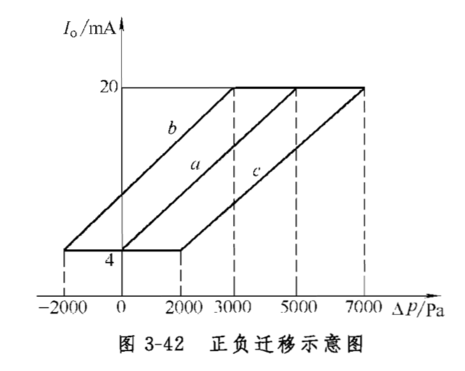

由于工作条件的不同，有时会出现正迁移的情况，如图 3-43 所示，如果 p0 = 0，经过分析可以知道，当 H = 0 时，正压室多了一项附加压力 ρhg，或者说 H = 0 时，Δp = hρg，这时变送器输出应为 4mA，画出此时变送器输出和输入压差之间的关系，就如同图 3-42 中曲线 c 所示。

3、用法兰式差压变送器测量液位。

为了解决测量具有腐蚀性或含有结晶颗粒以及黏度大、易凝固等液体液位时引压管线被腐蚀、被堵塞的问题，应使用在导压管入口处加隔离膜盒的法兰式差压变送器，如图 3-44 所示。作为敏感元件的测量头 1（金属膜盒），经毛细管 2 与变送器 3 的测量室相通。在膜盒、毛细管和测量室所组成的封闭系统内充有硅油，作为传压介质，并使被测介质不进入毛细管与变送器，以免堵塞。

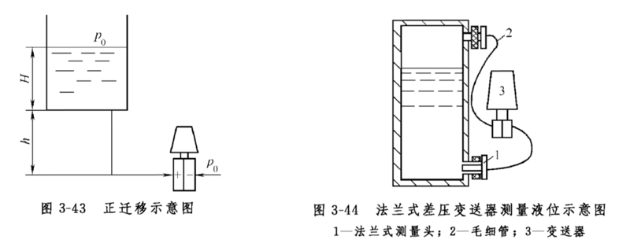

法兰式差压变送器按其结构形式又分为单法兰式及双法兰式两种。容器与变送器间只需一个法兰将管路接通的称为单法兰差压变送器，而对于上端和大气隔绝的闭口容器，因上部空间与大气压力多半不等，必须采用两个法兰分别将液相和气相压力导至差压变送器，如图 3-44 所示，这就是双法兰差压变送器。

#### 3.4.3 电容式物位传感器

1、测量原理。

在电容器的极板之间，充以不同介质时，电容量的大小也有所不同。因此，可通过测量电容量的变化来检测液位、料位和两种不同液体的分界面。

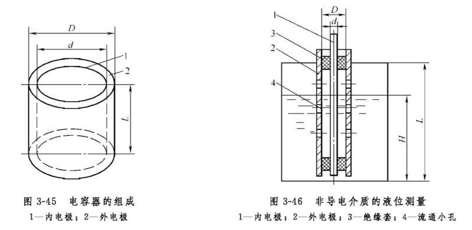

图 3-45 是由两个同轴圆柱极板 1、2 组成的电容器，在两圆筒间充以介电系数为 e 的介质时，则两圆筒间的电容量表达式为：

『公式详见原书。』

式中，L 为两极板相互遮盖部分的长度；d、D 为圆筒形内电极的外径和外电极的内径；e 为中间介质的介电常数。

所以，当 D 和 d 一定时，电容量 C 的大小与极板的长度 L 和介质的介电常数 e 的乘积成比例。这样，将电容传感器（探头）插入被测物料中，电极漫入物料中的深度随物位高低变化，必然引起其电容量的变化，从而可检测出物位。

2、液位的检测。

对非导电介质液位测量的电容式液位传感器原理如图 3-46 所示。它由内电极 1 和一个与它相绝缘的同轴金属套筒做的外电极 2 所组成，外电极 2 上开很多小孔 4，使介质能流进电极之间，内外电极用绝缘套 3 绝缘。当液位为零时，仪表调整零点（或在某一起始液位调零也可以），其零点的电容为：

『公式详见原书。』

式中，ε0 为空气介电系数；D、d 分别为外电极内径及内电极外径。

当液位上升为 H 时，电容量变为：

『公式详见原书。』

电容量的变化为：

『公式详见原书。』

因此，电容量的变化与液位高度 H 成正比。式（3-60）中的 Ki 为比例系数。Ki 中包含（`ε-ε0`），也就是说，这个方法是利用被测介质的介电系数 ε 与空气介电系数 ε0 不等的原理工作的。`ε-ε0` 值越大，仪表越灵敏实际上与电容器两极间的距离有关，D 与 d 越接近，即两极间距离越小，仪表灵敏度越高。

上述电容式液位计在结构上稍加改变以后，也可以用来测量导电介质的液位。

3、料位的检测。

用电容法可以测量固体块状颗粒体及粉料的料位。由于固体间损较大，容易「滞留」，所以一般不用双电极式电极。可用电极棒及容器壁组成电容器的两极来测量非导电固体料位。


图 3-47 所示为用金属电极棒插入容器来测量料位的示意图。它的电容量变化与料位升降的关系为：

『公式详见原书。』

式中，D、d 分别为容器的内径和电极的外径；ε、ε0 分别为物料和空气的介电系数。

电容物位计的传感部分结构单、使用方便。但由于电容变化量不大，要精确测量，就需借助于较复杂的电子线路才能实现。此外，还应注意介质浓度、温度变化时，其介电系数也要发生变化这一情况，以便及时调整仪表，达到预想的测量目的。

#### 3.4.4 核辐射物位计

放射性同位素的辐射线射入一定厚度的介质时，部分粒子因克服阻 カ与碰撞动能消耗被吸收，另一部分粒子则透过介质。射线的透射强度呈指数规律衰减，其关系为：

『公式详见原书。』

式中，μ 为介质对放射线的吸收系数；H 为介质层的厚度；I 为穿过介质后的射线强度。

不同介质吸收射线的能力是不一样的。一般说来，固体吸收能力最强，液体次之，气体则最弱。当放射源已经选定，被测的介质不变时，则 I0 与 μ 都是常数，根据式（3-63），只要测定通过介质后的射线强度 I，介质的厚度 H 就知道了。介质层的厚度，在这里指的是液位或料位的高度，这就是放射线检测物位法。

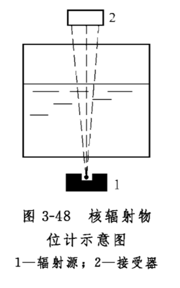

图 3-48 是核辐射物位计的原理示意图。辐射源 1 射出强度为 I0 的射线，接受器 2 用来检测透过介质后的射线强度，再配以显示仪表就可以指示物位的高低了。

这种物位仪表由于核辐射线的突出特点，能够透过钢板等各种物质，因而可以完全不接触被测物质，适用于高温、高压容器、强腐蚀、剧毒、有爆炸性、黏滞性、易结晶或沸腾状态的介质的物位测量，还可以测量高温融熔金属的液位。由于核辐射线特性不受温度、湿度、压力、电磁场等影响，所以可在高温、烟雾、尘埃、强光及强电磁场等环境下工作。但由于放射线对人体有害，它的剂量要加以严格控制，所以使用范围受到些限制。

#### 3.4.5 称重式液罐计量仪

在石油、化工部门，有许多大型贮罐，由于高度与直径都很大，即使液位变化 1 2mm，就会有几百公斤到几吨的差别，所以液位的测量要求很精确。同时，液体（例如油品）的密度会随温度发生较大的变化，而大型容器由于体积很大，各处温度很不均匀，因此即使液位（即体积）测得很准，也反映不了罐中真实的质量储量有多少。利用称重式液罐计量仪，就能基本上解决上述问题。

称重仪是根据天平原理设计的。它的原理图示于图 3-49。顶压カか 1 与罐底压力か 2 分别引至下波纹管 1 和上波纹管 2。两波纹管的有效面积 A1 相等，差压引入两波纹管，产生总的作用力，作用于杠杆系统，使杠杆失去平衡，于是通过发讯器、控制器、接通电机线路，使可逆电机旋转，并通过丝杠 6 带动砝码 5 移动，直至由砝码作用于杠杆的力矩与测量力（由压差引起）作用于杠杆的力矩平衡时，电机才停止转动。下面推导在杠杆系统平衡时砝码离支点的距离 L2 与液罐中总的质量储量之间的关系。

杠杆平衡时，有：`(p2 - p1)A1L1 = MgL2`。式中，M 为砝码质量；g 为重力加速度；L1、L2 为杠杆臂长；A1 为纹波管有效面积。

『公式详见原书。』

式中，为被测介质密度；K 为仪表常数。如果液罐是均匀截面，其截面积为 A，于是液罐内总的液体储量 M0 为：

『公式详见原书。』

将式（3-67）代入式（3-65），得：

『公式详见原书。』

因此，砝码离支点的距离 L2 与液罐单位面积储量成正比。如果液罐的横截面积 A 为常数，则可得：

『公式详见原书。』

由此可见，L2 与液罐内介质的总质量储量 M0 成比例，而与介质密度无关。如果储罐横截面积随高度而变化，一般是预先制好表格，根据砝码位移量 L2 就可以查得储存液体的质量。由于砝码移动距离与丝杠转动圈数成比例，丝杠转动时，经减速带动编码盘 8 转动，因此编码盘的位置与砝码位置是对应的，编码盘发出编码信号到显示仪表，经译码和逻辑运算后用数字显示出来。

由于称重仪是按天平平衡原理工作的，因此具有很高的精度和灵敏度。当罐内液体受组分、温度等影响，密度变化时，并不影响仪表的测量精度。该仪表可以用数字直接显示，显示醒目，并便于与计算机联用，进行数据处理或进行控制。