# 0301. 检测仪表与传感器03

## 3.5 温度检测及仪表

温度是表征物体冷热程度的物理量。是各种工业生产和科学实验中最普遍而重要的操作参数。除此之外，在现代化的农业和医学中也是不可缺少的。

在化工生产中，温度的测量与控制有着重要的作用。众所周知，任何一种化工生产过程都伴随着物质的物理和化学性质的改变，都必然有能量的交换和转化，其中最普遍的交换形式是熱交换形式。因此，化工生产的各种工艺过程都是在一定的温度下进行的。例如精馏塔的精馏过程中，对精馏塔的进料温度、塔温度和塔釜温度都必须按照工艺要求分别控制在定数值上。又如 N2 和 H2 合成 NH3 的反应，在触媒存在的条件下，反应的温度是 500℃。否则产品不合格，严重时还会发生事故。因此说，温度的测量与控制是保证化学反应过程正常进行与安全运行的重要环节。

### 3.5.1 温度检测方法

温度不能直接测量，只能借助于冷热不同物体之间的热交换，以及物体的某些物理性质随冷热程度不同而变化的特性来加以间接测量。

任意两个冷热程度不同的物体相接触，必然要发生热交换现象，热量将由受热程度高的物体传到受熱程度低的物体，直到两物体的冷热程度完全一致，即达到热平衡状态为止。利用这一原理，就可以选择某一物体同被测物体相接触，并进行熱交换，当两者达到热平衡状态时，选择物体与被测物体温度相等。于是，可以通过测量选择物体的某一物理量（如液体的体积、导体的电量等），便可以定量地给出被测物体的温度数值。以上就是接触测温法。也可以利用热射原理，来进行非接触测温。

温度测量范围甚广，有的处于接近绝对零度的低温，有的要在几千度的高温下进行，这样宽的测量范围，需用各种不同的测温方法和测温仪表。若按使用的测量范围分，常把测量 600℃ 以上的测温仪表称为高温计，把测量 600℃ 以下的测温仪表称为温度计。若按用途分可分为标准仪表、实用仪表。若按工作原理分，则分为膨胀式温度计、压力式温度计、热电偶温度计、电阻温度计和辐射高温计五类。若按测量方式分，则可分为接触式与非接触式两大类。前者测温元件直接与被测介质接触，这样可以使被测介质与测温元件进行充分地热交换，而达到测温目的；后者测温元件与被测介质不相接触，通过辐射或对流实现热交换来达到测温的目的。现按测量方式分类见表 3-3 所示。

表 3-3 常用温度计的种类及优缺点

1『这张表重点研读。（2021-01-14）』

先简单介绍几种温度计。

1、膨胀式温度计。

膨胀式温度计是基于物体受热时体积膨胀的性质而制成的。玻璃管温度计属于液体膨胀式温度计，双金属温度计属于固体膨胀式温度计。

双金属温度计中的感温元件是用两片线膨胀系数不同的金属片叠焊在一起而制成的。双金属片受热后，由于两金属片的膨胀长度不同而产生弯曲，如图 3-50 所示。温度越高产生的线膨胀长度差就越大，因而引起弯曲的角度就越大，双金属温度计就是基于这一原理而制成的，它是用双金属片制成螺旋形感温元件，外加金属保护套管，当温度变化时，螺旋的自由端便围绕着中心轴旋转，同时带动指针在刻度盘上指示出相应的温度数值。


图 3-51 是一种双金属温度信号器的示意图。当温度变化时，双金属片 1 产生弯曲，且与调节螺钉相接触，使电路接通，信号灯 4 便发亮。如以继电器代替信号灯便可以用来控制热源（如电热丝）而成为两位式温度控制器。温度的控制范围可通过改变调节螺钉 2 与双金属片 1 之间的距离来调整。若以电铃代替信号灯便可以作为另一种双金属温度信号报警器。

2、压力式温度计。

应用压力随温度的变化来测温的仪表叫压力式温度计。它是根据在封闭系统中的液体、气体或低沸点液体的饱和蒸汽受熱后体积膨胀或压力变化这一原理而制成的，并用压力表来测量这种变化，从而测得温度。

压力式温度计的构造如图 3-52 所示。它主要由以下三部分组成。

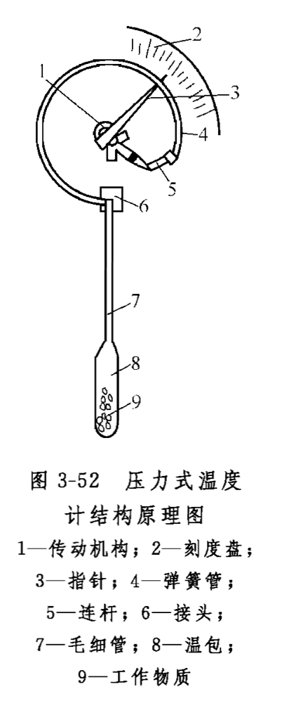

1）温包。它是直接与被测介质相接触来感受温度变化的元件。因此要求它具有高的强度，小的膨胀系数，高的热导率以及抗腐蚀等性能。根据所充工作物质和被测介质的不同，温包可用铜合金、钢或不锈钢来制造。

2）毛细管。它是用铜或钢等材料冷拉成的无缝圆管，用来传递压的变化。其外径为 1.2-5mm，内径为 0.15-0.5mm。如果它的直径越细，长度越长，则传递压力的滞后现象就越严重。也就是说，温度计对被测温度的反应越迟钝。然而，在同样的长度下毛细管越细，仪表的精度就越高。毛细管容易被破坏，折断，因此，必须加以保护。对不经常弯曲的毛细管可用金属软管做保护套管。

3）弹簧管（或盘簧管）。它是一般压力表用的弹性元件。

3、辐射式高温计。

辐射式高温计是基于物体热辐射作用来测量温度的仪表。目前，它已被广泛地用来测量高于 800℃ 的温度。在化工生产中，使用最多的是利用热电偶和热电阻这两种感温元件来测量温度。下面就主要介绍热电偶温度计和热电阻温度计。

### 3.5.2 热电偶温度计

热电偶温度计是以热电效应为基础的测温仪表。它的测量范围很广、结构筒单、使用方便、测温准确可靠，便于信号的远传、自动记录和集中控制，因而在化工生产中应用极为普遍。

热电偶温度计是由三部分组成：热电偶（感温元件）；测量仪表（毫伏计或电位差计）；连接热电偶和测量仪表的导线（补偿导线及铜导线）。图 3-53 是热电偶温度计最简单测温系统的示意图。

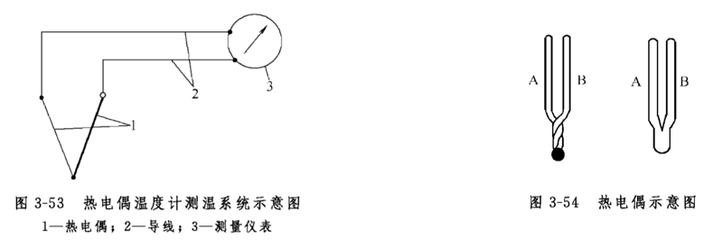

1、热电偶。

热电偶是工业上最常用的一种测温元件（感温元件）。它是由两种不同材料的导体 A 和 B 焊接而成，如图 3-54 所示。焊接的一端插入被测介质中，感受到被测温度，称为热电偶的工作端或热端，另一端与导线连接，称为冷端或自由端。导体 A、B 称为热电极。

1）热电现象及测温原理。先用一个简单的实验，来建立对热电偶热电现象的感性认识。取两根不同材料的金属导线 A 和 B，将其两端焊在一起，这样就组成了一个闭合回路。如将其一端加热，就是使其接点 1 处的温度 t 高于接点 2 处的温度 t0，那么在此闭合回路中就有热电势产生，如图 3-55（a）所示。如果在此回路中串接一只直流毫伏计（将金属 B 断开接入毫伏计，或者在两金属线的 t0 接头处断开接入毫伏计均可），如图 3-55（b）、（c）所示，就可见到毫伏计中有电势指示，这种现象就称为热电现象。

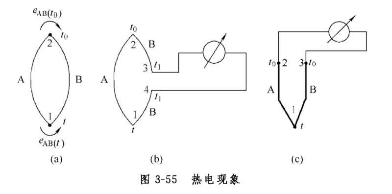

下面就分析一下为什么会产生热电势呢？从物理学中知道，两种不同的金属，它们的自由电子密度是不同的。也就是说，两金属中每单位体积内的自由电子数是不同的。假设金属 A 中的自由电子密度大于金属 B 中的自由电子密度，按古典电子理论，金属 A 的电子密度大，其压强也大。正因为这样，当两种金属相接触时，在两种金属的交界处，电子从 A 扩散到 B 多于从 B 扩散到 A。而原来自由电子处于金属 A 这个统一体时，统一体是呈中性不带电的，当自由电子越过接触面迁移后，金属 A 就因失去电子而带正电，金属 B 则因得到电子而带负电。但这种扩散迁移是不会无限制地进行的。因为迁移的结果就在两金属的接触面两侧形成了一个偶电层，这一偶电层的电场方向由 A 指向 B，它的作用是阻止自由电子进一步扩散的。

这就是说，由于电子密度的不平衡而引起扩散运动，扩散的结果产生了静电场，这静电场的存在又成为扩散运动的阻力，这两者是互相对立的。开始的时候，扩散运动占优势，随着扩散的进行，静电场的作用就加强，反而使电子沿反方向运动。结果当扩散进行到一定程度时，压强差的作用与静电场的作用相互抵消，扩散与反扩散建立了暫时的平衡。图 3-56（a）表示两金属接触面上将发生方向相反，大小不等的电子流，使金属 B 中逐淅地积聚过剩电子，并引起逐淅增大的由 A 指向 B 的静电场及电勢差 eAB，图 3-56（b）表示电子流达到动平衡时的情况。这时的接触电势差，仅和两金属的材料及接触点的温度有关，温度越高，金属中的自由电子就越活跃，由 A 迁移到 B 的自由电子就越多，致使接触面处所产生的电场强度也增加，因而接触电动势也增高。由于这个电势大小，在热电偶材料确定后只和温度有关，故称为热电势，记作 `eAB(t)`，注脚 A 表示正极金属，注脚 B 表示负极金属，如果下标次序改为 BA，则 e 前面的符号亦应相应的改变，即 `eAB(t)=-eBA(t)`。

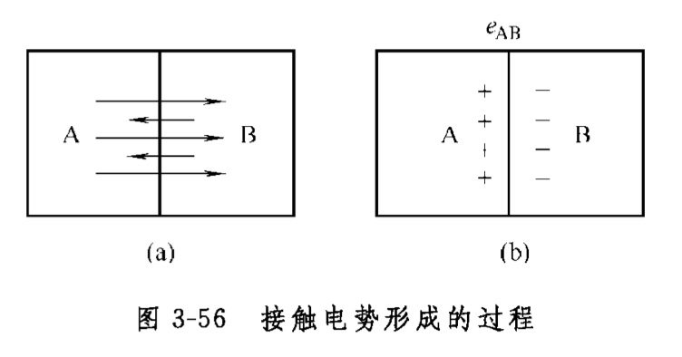

若把导体的另一端也闭合，形成闭合回路，则在两接点处就形成了两个方向相反的热电势，如图 3-57 所示。

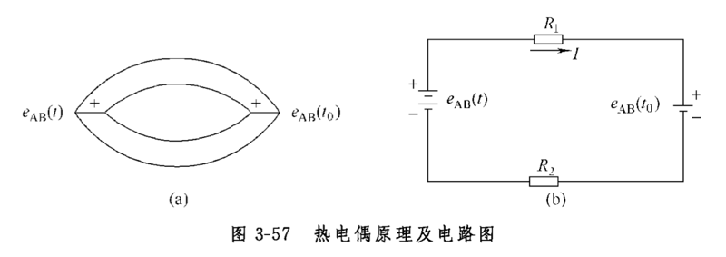

图 3-57（a）表示两金属的接点温度不同，设 `t > t0`，由于两金属的接点温度不同，就产生了两个大小不等、方向相反的热电势 `eAB(t)` 和 `eAB(t0)`。必须注意，对于同一金属 A（或 B），由于其两端温度不同，自由电子具有的动能不同，也会产生一个相应的电动势，这个电动势称为温差电勢。但由于温差电势远小于接触热电势，因此常常把它忽略不计。这样，就可以用图 3-57（b）作为图 3-57（a）的等效电路，R1、R2 为热偶丝的等效电阻，在此闭合回路中总的热电势 `E(t,t0)` 应为：

```
E(t,t0) = eAB(t) - eAB(t0)
或者
E(t,t0) = eAB(t) + eAB(t0)
```

也就是说，热电勢 `E(t,t0)` 等于热电偶两接点热电势的代数和。当 A、B 材料固定后，热电势是接点温度 t 和 t0 的函数之差。如果一端温度 t0 保持不变，即 `eAB(t0)` 为常数，则热电势 `E(t,t0)` 就成为温度 t 的单值函数了，而和热电偶的长短及直径无关。这样，只要测出热电势的大小，就能判断测温点温度的高低，这就是利用热电现象来测温的原理。

必须注意，如果组成热电偶回路的两种导体材料相同，则无论两接点温度如何，闭合回路的总热电势为零；如果热电偶两接点温度相同，尽管两导体材料不同，闭合回路的总热电势也为零；热电偶产生的热电势除了与两接点处的温度有关外，还与热电极的材料有关。也就是说不同热电极材料制成的热电偶在相同温度下产生的热电势是不同的。可以从附录二至附录四中查到。

2）插入第三种导线的问题。利用热电偶测量温度时，必须要用某些仪表来测量热电势的数值，如图 3-58 所示。而测量仪表往往要远离测温点，这就要接入连接导线 C，这样就在 AB 所组成的热电偶回路中加入了第三种导线，而第三种导线的接入又构成了新的接点，如图 3-58（a）中点 3 和点 4，图 3-58（b）中的点 2 和点 3，这样引入第三种导线会不会影响热电偶的热电势呢？

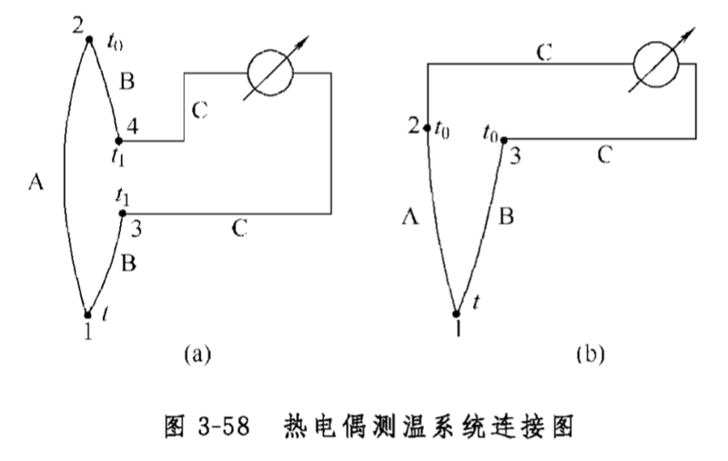

先来分析图 3-58（a）所示的电路，3、4 接点温度相同（等于 t1），故总的热电势为：

1『此处公式省略，详见原书。』

这和式（3-71）相同，可见总的热电勢与没有接入第三种导线一样。

再来分析图 3-58（b）电路，在这电路中的 2、3 接点温度相同且等于 t0，那么电路的总热电势为：

1『此处公式省略，详见原书。』

根据能量守恒原理可知，多种金属组成的闭合回路内，尽管它们材料不同，只要各接点温度相等，则此闭合回路内的总电勢等于零。若将 A、B、C 三种金属丝组成一个闭合回路各接点温度相同（都等于 t0），则回路内的总热电勢等于零。即：

1『此处公式省略，详见原书。』

结果也和式（3-71）相同，可见也与没有接入第三种导线的热电势一样。

这就说明在热电偶回路中接入第三种金属导线对原热电偶所产生的热电势数值并无影响。不过必须保证引入线两端的温度相同。同理，如果回路中串入更多种导线，只要引入线两端温度相同，也不影响电偶所产生的热电势数值。

3）常用热电偶的种类。理论上任意两种金属材料都可以组成热电偶。但实际情况并非如此，对它们还必须进行严格的选择。工业上对热电极材料应满足以下要求：a）温度每增加 1℃ 时所能产生的热电势要大，而且热电势与温度应尽可能成线性关系；b）物理稳定性要高，即在测温范围内其热电性质不随时间而变化，以保证与其配套使用的温度计测量的准确性；c）化学稳定性要高，即在高温下不被氧化和腐蚀；d）材料组织要均匀，要有韧性，便于加工成丝；e）复现性好（用同种成分材料制成的热电偶，其热电特性均相同的性质称复现性），这样便于成批生产，而且在应用上也可保证良好的互换性。

但是，要全面满足以上要求是有困难的。目前在国际上被公认的比较好的热电极材料只有几种，这些材料是经过精选而且标准化了的，它们分别被应用在各温度范围内，测量效果良好。现把工业上最常用的（已标准化）几种热电偶介绍如下。

3.1）铂铑 30 - 铂铑 6 热电偶（也称双铂铑热电偶）。此种热电偶（分度号为 B）以铂铑 30 丝为正极，铂铑 6 丝为负极；其测量范围为 300-1600℃，短期可测 1800℃。其热电特性在高温下更为稳定，适于在氧化性和中性介质中使用。但它产生的热电势小；价格贵。在低温时热电势极小，因此当冷端温度在 40℃ 以下范围使用时，一般可不需要进行冷端温度修正。

3.2）铂铑 10 - 铂热电偶。在铂铑 10 - 铂热电偶（分度号为 S）中，铂铑 10 丝为正极，纯铂丝为负极；测量范围为 20-1300℃，在良好的使用环境下可短期测量 1600℃；适于在氧化性或中性介质中使用。其优点是耐高温，不易氧化；有较好的化学稳定性；具有较高测量精度，可用于精密温度测量和作基准电偶。

3.3）镍铬-镍硅（镍铬-镍铝）热电偶。该热电偶（分度号为 K）中镍铬为正极，镍硅（镍铝）为负极；测量范围为 -50-1000℃，短期可测量 1200℃；在氧化性和中性介质中使用，500℃ 以下低温范围内，也可用于还原性介质中测量。此种热电偶其热电势大，线性好，测温范围较宽，造价低，因而应用很广。

镍铬镍铝热电偶与镍铬-镍硅电偶的热电特性几乎完全一致。但是，镍铝合金在高温下易氧化变质，引起热电特性变化。镍硅合金在抗氧化及热电勢稳定性方面都比镍铝合金好。目前，我国基本上已用镍铬-镍硅热电偶取代了镍铬-镍铝热电偶。

3.4）镍铬-考铜热电偶。该熱电偶（分度号为 XK）中镍铬为正极，考铜为负极；适宜于还原性或中性介质中使用；测量范围为 -50-600℃，短期可测 800℃；这种热电偶的热电较大，比镍铬-镍硅热电偶高一倍左右；价格便宜。它的缺点是测温上限不高。在不少情况下不能适应。另外，考铜合金易氧化变质，由于材料的质地坚硬而不易得到均匀的线径。此种热电偶将被国际所淘汏。国内用镍铬-铜镍（分度号为 E）热电偶取代此热电偶。

各种热电偶热电势与温度的 一一 对应关系都可以从标准数据表中査到，这种表称为热电偶的分度表。附录二、三、四就是几种常用熱电偶的分度表，而与某分度表所对应的该热电偶，用它的分度号表示。

此外，用于各种特殊用途的热电偶还很多。如红外线接收热电偶；用于 2000℃ 高温测量的钨热电偶；用于超低温测量的镍铬-金铁熱电偶；非金属熱电偶等。

现将我国已定型生产的几种热电偶列表 3-4 比较如下。

2『此处表格待手打。（2021-01-16）』

4）热电偶的结构。热电偶广泛地应用在各种条件下的温度测量。根据它的用途和安装位置不同，各种熱电偶的外形是极不相同的。按结构形式分有普通型、铠装型、表面型和快速型四种。

4.1）普通型热电偶主要由热电极、绝缘管、保护套管和接线盒等主要部分组成。如图 3-59 所示。

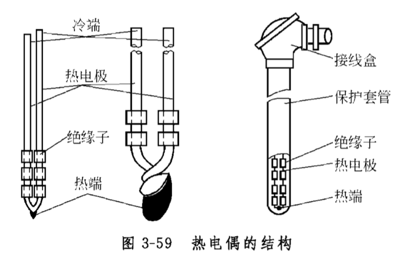

热电极是组成热电偶的两根热偶丝。正负热电极的材料见表 3-4，热电极的直径由材料的价格、机械强度、电导率以及热电偶的用途和测量范围等决定。贵金属的热电极大多采用直径为 0.3-0.65mm 的细丝，普通金属电极丝的直径一般为 0.5-3.2mm。其长度由安装条件及插入深度而定，一般为 350-2000mm。

绝缘管（又称绝缘子）用于防止两根热电极短路。材料的选用由使用温度范围而定常用绝缘材料见表 3-5 所示。它的结构形式通常有单孔管、双孔管及四孔管等。

保护套管是套在热电极、绝缘子的外边，其作用是保护热电极不受化学腐蚀和机械损伤。保护套管材料的选择一般根据测温范围、插入深度以及测温的时间常数等因素来决定。对保护套管材料的要求是：耐高温、耐腐蚀、能承受温度的剧变、有良好的气密性和具有高的热导系数。其结构一般有螺纹式和法兰式两种。常用保护套管的材料见表 3-6 所示。

2『此处表格待手打。（2021-01-16）』

接线盒是供热电极和补偿导线连接之用的。它通常用铝合金制成，一般分为普通式和密封式两种。为了防止灰尘和有害气体进入热电偶保护套管内，接线盒的出线孔和盖子均用垫片和垫圈加以密封。接线盒内用于连接热电极和补偿导线的螺丝必须固紧。以免产生较大的接触电阻而影响测量的准确度。

4.2）铠装热电偶。由金属套管、绝缘材料（氧化镁粉）、热电偶丝一起经过复合拉伸成型，然后将端部偶丝焊接成光滑球状结构。工作端有露头型、接壳型、绝缘型三种。其外径为 1-8mm，还可小到 0.2mm，长度可为 50m。

铠装热电偶具有反应速度快、使用方便、可弯曲、气密性好、不怕振、耐高压等优点，是目前使用较多并正在推广的一种结构。

4.3）表面型热电偶。常用的结构形式是利用真空镀膜法将两电极材料蒸镀在绝缘基底上的薄膜电偶，专门用来测量物体表面温度的一种特殊热电偶，其特点：反应速度极快、热惯性极小。

4.4）快速热电偶。它是测量高温熔融物体一种专用热电偶，整个热偶元件的尺寸很小，称为消耗式热电偶。

热电偶的结构形式可根据它的用途和安装位置来确定。在热电偶选型时，要注意三个方面：热电极的材料；保护套管的结构，材料及耐压强度；保护套管的插入深度。

2、补偿导线的选用。

由热电偶测温原理知道，只有当热电偶冷端温度保持不变时，热电势才是被测温度的单值函数。在实际应用时，由于热电偶的工作端（热端）与冷端离得很近，而且冷端又暴露在空间，容易受到周围环境温度波动的影响，因而冷端温度难以保持恒定。为了使热电偶的冷端温度保持恒定，当然可以把热电偶做得很长，使冷端远离工作端，但是，这样做要多消耗许多贵重的金属材料，是不经济的。

解决这个问题的方法是采用一种专用导线，将热电偶的冷端延伸出来，如图 3-60 所示。这种专用导线称为「补偿导线」。它也是由两种不同性质的金属材料制成，在一定温度范围内（0-100℃）与所连接的热电偶具有相同的热电特性，其材料又是廉价金属。不同热电偶所用的补偿导线也不同，对于镍铬考铜等一类用廉价金属制成的热电偶，则可用其本身材料作补偿导线。

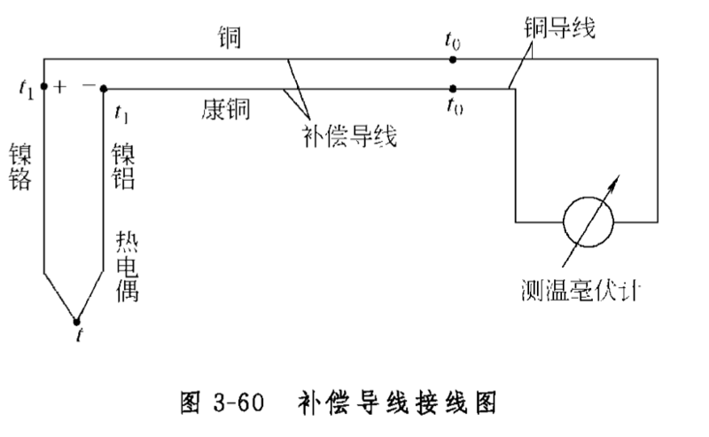

在使用热电偶补偿导线时，要注意型号相配，各种型号热电偶所配用的补偿导线的材料列于表 3-7。极性不能接错，热电偶的正、负极分别与补偿导线的正、负极相接；热电偶与补偿导线连接端所处的温度不应超过 100℃。

3、冷端温度的补偿。

采用补偿导线后，把热电偶的冷端从温度较高和不稳定的地方，延伸到温度较低和比较稳定的操作室内，但冷端温度还不是 0℃。而业上常用的各种热电偶的温度-热电势关系曲线是在冷端温度保持为 0℃ 的情况下得到的，与它配套使用的仪表也是根据这一关系曲线进行刻度的。由于操作室的温度往往高于 0℃，而且是不恒定的，这时，热电偶所产生的热电势必然偏小。且测量值也随着冷端温度变化而变化，这样测量结果就会产生误差。因此，在应用热电偶测温时，只有将冷端温度保持为 0℃，或者是进行一定的修正オ能得出准确的测量结果。这样做，就称为热电偶的冷端温度补偿。一般采用下述几种方法。

1）冷端温度保持为 0℃ 的方法。保持冷端温度为 0℃ 的方法，如图 3-61 所示。把热电偶的两个冷端分别插入盛有绝缘油的试管中，然后放入装有冰水混合物的容器中，这种方法多数用在实验室中。

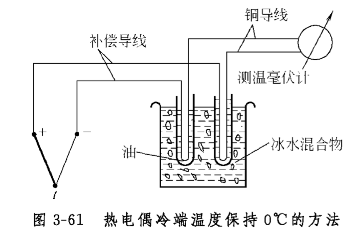

2）冷端温度修正方法。在实际生产中，冷端温度往往不是 0℃，而是某一温度 t1，这就引起测量误差。因此，必须对冷端温度进行修正。

例如，某一设备的实际温度为 t，其冷端温度 t1，这时测得的热电勢为 `E(t,t1)`。为求得实际 t 的温度，可利用下式进行修正，即：

1『此处公式省略，详见原书。』

由此可知，冷端温度的修正方法是把测得的热电勢 `E(t,t1)`，加上热端为室温 t1，冷端为 0℃ 时的热电偶的热电 `E(t1,0)`，才能得到实际温度下的热电势 `E(t,0)`。

例 6 用镍铬-铜镍熱电偶冽量某加热炉的温度。测得的热电勢 `E(t,t1) = 66982μV`，而自由端的温度 `t1 = 30℃`，求被测的实际温度。

解由附录三可以查得：

1『此处公式省略，详见原书。』

再査附录三可以査得 66982μV 对应的温度为 900℃。

由于热电偶所产生的热电势与温度之间的关系都是非线性的（当然各种热电偶的非线性程度不同），因此在自由端的温度不为零时，将所测得热电势对应的温度值加上自由端的温度，并不等于实际的被测温度。如在上例中，测得的热电为 66982μV，由附录三可査得对应温度为 876.6℃，如果再加上自由端温度 30℃，则为 906.6℃，这与实际被测温度有定误差。其实际热电勢与温度之间的非线性程度越严重，则误差就越大。

应当指出，用计算的方法来修正冷端温度，是指冷端温度内恒定值时对测温的影响。该方法只适用于实验室或临时测温，在连续测量中显然是不实用的。

3）校正仪表零点法。一般仪表未工作时指针应指在零位上（机械零点）。若采用测温元件为热电偶时，要使测温时指示值不偏低，可预先将仪表指针调整到相当于室温的数值上（这是因为将补偿导线一直引入到显示仪表的输入端，这时仪表的输入接线端子所处的室温就是该熱电偶的冷端温度）。此法比较简单，故在工业上也经常应用。但必须明确指出，这种方法由于室温也在经常变化，所以只能在测温要求不太高的场合下应用。

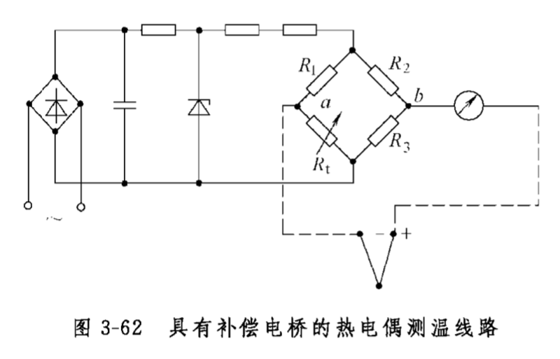

4）补偿电桥法。补偿电桥法是利用不平衡电桥产生的电勢，来补偿热电偶因冷端温度变化而引起的电勢变化值，如图 3-62 所示。不平衡电桥（又称补偿电桥或冷端温度补偿器）由 R1、R2、R3（锰铜丝绕制）和 R（铜丝绕制）四个桥臂和稳压电源所组成串联在热电偶测量回路中。为了使热电偶的冷端与电阻 R 感受相同的温度，所以必须把 R 与热电偶的冷端放在一起。电桥通常在 20℃ 时处于平衡，即 `R1= R2 = R3 = Rt20`，此时，对角线 a、b 两点电位相等，即 Ub=0，电桥对仪表的读数无影响。当周围环境髙于 20℃ 时，热电偶因冷端温度升高而使热电勢减弱。而与此同时，电桥中 R1、R2、R3 的电阻值不随温度而变化，铜电阻 R 却随温度增加而增加，于是电桥不再平衡，这时，使 a 点电位高于 b 点电位，在对角线 a、b 间输出一个不平衡电压 Ub，并与热电偶的热电势相叠加，一起送入测量仪表。如适当选择桥臂电阻和电流的数值，可以使电桥产生的不平衡电压 Uab 正好补偿由于冷端温度变化而引起的热电勢变化值，仪表即可指示出正确的温度。

应当指出，由于电桥是在 20℃ 时平衡的，所以采用这种补偿电桥时须把仪表的机械零位预先调到 20℃ 处。如果补偿电桥是在 0℃ 时平衡设计的（DDZ-Ⅱ 型温度变送器中的补偿电桥），则仪表零位应调在 0℃ 处。

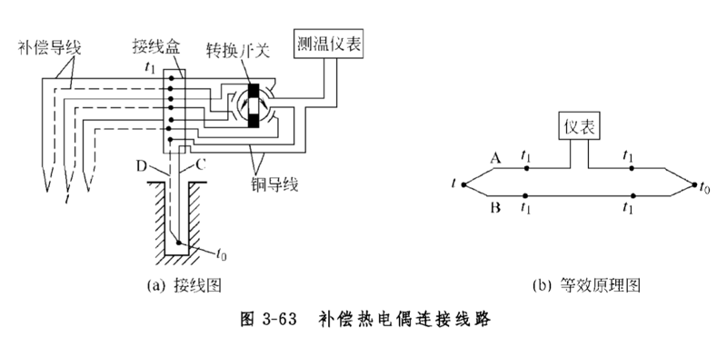

5）补偿热电偶法。在实际生产中，为了节省补偿导线和投资费用，常用多支热电偶而配用一台测温仪表，其接线如图 3-63 所示。转换开关（切换开关）用来实现多点间歇测量 CD 是补偿热电偶，它的热电极材料可以与测量热电偶相同，也可以是测量热电偶的补偿导线，设置补偿热电偶是为了使多支电偶的冷端温度保持恒定。为达到此目的，将一支补偿热电偶的工作端插入 2-3m 的地下或放在其他恒温器中，使其温度恒定为 t0。而它的冷端与多支热电偶的冷端都接在温度为 t1 的同一个接线盒中。这时测温仪表的指示值则为 `E(t,t0)` 所对应的温度，而不受接线盒处温度 t1 变化的影响。

与热电偶配套的显示仪表在第四章中详细介绍。

### 3.5.3 热电阻温度计

上面介绍的热电偶温度计，其感受温度的一次元件是热电偶，这类仪表一般适用于测量 500℃ 以上的较高温度。对于在 500℃ 以下的中、低温，利用热电偶进行测量就不一定恰当。

首先，在中、低温区热电偶输出的热电势很小（査附录可知），这样小的热电勢，对电位差计的放大器和抗干扰措施要求都很高，否则就测量不准，仪表维修也困难；其次，在较低的温度区域，冷端温度的变化和环境温度的变化所引起的相对误差就显得很突出，而不易得到全补偿。所以在中、低温区，一般是使用热电阻温度计来进行温度的测量较为适宜。

热电阻温度计是由热电阻（感温元件），显示仪表（不平衡电桥或平衡电桥）以及连接导线所组成。如图 3-64 所示。值得注意的是连接导线采用三线制接法。

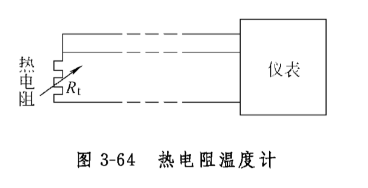

热电阻是热电阻温度计的测温（感温）元件。是这种温度计的最主要部分，是金属体。

1、测温原理。

热电阻温度计是利用金属导体的电阻值随温度变化而变化的特性（电阻温度效应）来进行温度测量的。对于呈线性特性的电阻来说，其电阻值与温度关系如下式：

1『此处公式省略，详见原书。』

式中，Rt 是温度为 t℃ 时的电阻值；Rt0 是温度为（通常为 0℃）时的电阻值；α 是电阻温度系数；Δt 是温度的变化值；ΔRt 是电阻值的变化量。

可见，由于温度的变化，导致了金属导体电阻的变化。这样只要设法测出电阻值的变化，就可达到温度测量的目的。

由此可知，热电阻温度计与热电偶温度计的测量原理是不相同的。热电阻温度计是把温度的变化通过测温元件 一一 热电阻转换为电阻值的变化来测量温度的；而电偶温度计则把温度的变化通过测温元件 一一 热电偶转化为热电势的变化来测量温度的。

热电阻温度计适用于测量 -200~+500℃ 范围内液体、气体、蒸汽及固体表面的温度。它与热电偶温度计一样，也是有远传、自动记录和实现多点测量等优点。另外热电阻的输出信号大，测量准确。

2、工业常用热电阻。

虽然大多数金属导体的电阻值随温度的变化而变化，但是它们并不都能作为测温用的热电阻。作为热电阻的材料一般要求是：1）电阻温度系数、电阻率要大；2）热容量要小；3）在整个测温范围内，应具有稳定的物理、化学性质和良好的复制性；4）电阻值随温度的变化关系，最好呈线性。

但是，要完全符合上述要求的热电阻材料实际上是有困难的。根据具体情况，目前应用最广泛的热电阻材料是铂和铜。

2.1）铂电阻。金属铂易于提纯，在氧化性介质中，甚至在高温下其物理、化学性质都非常稳定。但在还原性介质中，特别是在高温下很容易被沾污，使铂丝变脆，并改变了其电阻与温度间的关系。因此，要特别注意保护。

在 0-650℃ 的温度范围内，铂电阻与温度的关系为：

1『此处公式省略，详见原书。』

式中，Rt 是温度为 t℃ 时的电阻值；R0 是温度为 0℃ 时的电阻值。A、B、C 是常数，由实验求得：`A = 3.950×10^-3/℃`，`B = -5.850x10^-7/(℃)^2`，`C = -4.22×10^-2/(℃)^3`。要确定 Rt-t 的关系时，首先要确定 R0 的大小，不同的 Rt0，则 Rt-t 的关系也不同。这种 Rt-t 的关系称为分度表，用分度号来表示。

工业上常用的铂电阻有两种，一种是 `R0 = 10Ω`，对应的分度号为 Pt10。另一种是 `R0 = 100Ω`，对应的分度号为 Pt100（见附录五）。

2.2）铜电阻。金属铜易加工提纯，价格便宜；它的电阻温度系数很大，且电阻与温度呈线性关系；在测温范围为 -50~+150℃ 内，具有很好的稳定性。其缺点是温度超过 150℃ 后易被氧化，氧化后失去良好的线性特性；另外，由于铜的电阻率小（一般为 `0.017 Ω·mm^2/m`），为了要绕得一定的电阻值，铜电阻丝必须较细，长度也要较长，这样铜电阻体就较大，机械强度也降低。

在 -50~+150℃的范围内，铜电阻与温度的关系是线性的。即：

1『此处公式省略，详见原书。』

式中，α 为铜的电阻温度系数（4.25x10^-3/℃）。其他符号同式（3-79）所示。

工业上用的铜电阻有两种，一种是 `R0 = 50Ω`，对应的分度号为 Cu50（见附录六）。另种是 `R0 = 100Ω`，对应的分度号为 Cu100（见附录七）。

3、热电阻的结构。

热电阻的结构形式有普通型热电阻、铠装热电阻和薄膜电阻三种。

3.1）普通型热电阻。主要由电阻体、保护套管和接线盒等主要部件所组成。其中保护套管和接线盒与热电偶的基本相同。下面就介绍一下电阻体的结构。

将电阻丝绕制（采用双线无感绕法）在具有定形状的支架上，这个整体便称为电阻体。电阻体要求做得体积小，而且受热膨胀时，电阻丝应该不产生附加应力。目前，用来绕制电阻丝的支架一般有三种构造形式：平板形、圆柱形和螺旋形，如图 3-65 所示。一般地说，平板支架作为铂电阻体的支架，圆柱形支架作为铜电阻体的支架，而螺旋形支架是作为标准或实验室用的电阻体的支架。

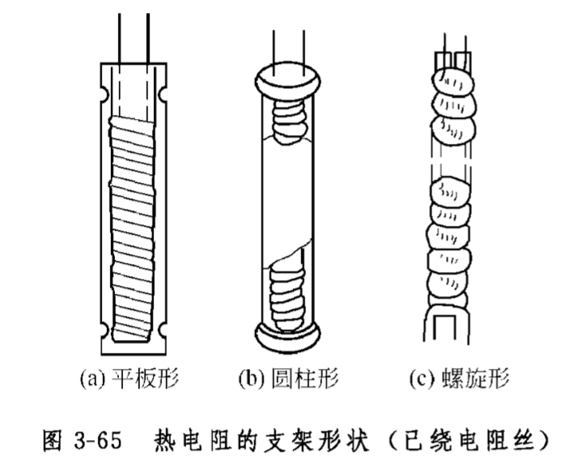

2.2）铠装热电阻。将电阻体预先拉制成型并与绝缘材料和保护套管连成一体。这种热电阻体积小、抗震性强、可弯曲、热惯性小、使用寿命长。

2.3）薄膜热电阻。它是将熱电阻材料通过真空镀膜法，直接蒸镀到绝缘基底上。这种热电阻的体积很小、热惯性也小、灵敏度高。

### 3.5.4 电动温度变送器

DBW 型温度（温差）变送器是 DDZ-Ⅲ 系列电动单元组合式检测调节仪表中的一个主要单元。它与各种类型的热电偶、热电阻配套使用，将温度或两点间的温差转换成 4-20mA 和 1-5V 的统一标准信号；又可与具有毫伏输出的各种变送器配合，使其转换成 4-20mA 和 1-5V 的统一输出信号。然后，它和显示单元、控制单元配合，实现对温度或温差及其他各种参数进行显示、控制。

DDZⅢ 型的温度变送器与 DDZ-I 型的温度变送器进行比较，它具有以下几个主要特点。1）线路上采用了安全火花型防爆措施，因而可以实现对危险场合中的温度或毫伏信号测量。2）在热电偶和热电阻的温度变送器中采用了线性化机构，从而使变送器的输出信号和被测温度间呈线性关系。3）在线路中，由于使用了集成电略，这样使该变送器具有良好的可靠性、稳定性等各种技术性能。

温度变送器是安装在控制室内的一种架装式仪表，它有三种类型，即热电偶温度变送器、热电阻温度变送器和直流毫伏变送器。在化工生产中，使用最多的是热电偶温度变送器和热电阻温度变送器。

1、热电偶温度变送器。

热电偶温度变送器与热电偶配套使用，将温度转换成 4-20mA 和 1-5V 的统一标准信号。然后与显示仪表或控制仪表配合实现对温度的显示或控制。热电偶温度变送器的结大体上可分为三大部分：输入桥路、放大电路及反馈电路。如图 3-66 所示。


1.1）输入电桥。图 3-67 是热电侷温度变送器的输入回路，在形式上很像电桥，故常称为输入电桥，它的作用是：冷端温度补偿、调整零点。

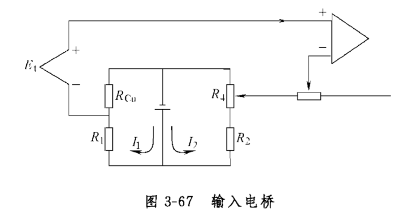

电桥中的 Rcu 电阻是用铜线绕制的，它与热电偶的冷端安装在一起。当冷端温度变化时，Rcu 的电阻随温度的变化也变化，使电桥的两端产生一个附加电压。此电压与热电勢 Et 串联相加，只要 Rcu 值选择适当，便可补偿冷端温度变化引起电勢 Et 减少的值。应当注意的是，由于热电偶的温度特性是非线性的，而铜电阻的特性却接近线性，这样就不可能取得完全补偿。但在实际应用中，由于冷端温度变化不大，这样的补偿也是可以的。

电桥的电源是稳压电源，R1 和 R2 都是高值电阻，这样就可以使电桥的电流 I1 和 I2 为恒定值。电阻 R4 是可调电阻，电流 I2 流过可调电阻 R4 产生电压，它与热电勢 E 及 Rcu 产生的电势串联，这样不仅可以抵消 Rcu 电阻上的起始电压，还可自由地改变电桥输出的零点。在 DDZ-Ⅲ 型温度变送器中，输出标准信号范围是 4-20mA。因此，在熱电势为 0 时，应由输入桥路提供满幅输入电压的 20%，建立输出的起点。

综上所述，输入电桥主要起两个作用：热电偶冷端温度补偿、零点调整。

1.2）反馈电路。在 DDZⅢ 型的温度变送器中，为了使变送器的输出信号直接与被测温度成线性关系，以便显示及控制，特别是便于和计算机配合，所以在温度变送器中的反馈回路加入线性化电路，对热电偶的非线性给予修正。因为电偶产生的热电势太小，这样就不宜于在输入电路中修正，而采取非线性反馈电路进行修正。如图 3-68 所示。当温度较高时，热电偶灵敏度偏高的区域，使负反馈作用强一些，这样以反馈电路的非线性补偿熱电偶的非线性，故可获得输出电流 I0 与温度 t 成线性关系。值得注意的是，这种具有线性化机构的温度变送器在进行量程变换时，其反馈的非线性特性必须作相应的调整。


1.3）放大电路。由于热电偶产生的热电势数值很小，一般只有几十或十几毫伏，因此将它经过多级放大后才能变换为高电平输出。近年来由于集成运算放大器的出现，温度变送器采用了特殊的低漂移、高增益集成运算放大器。又因为测量元件和传输线上经常会受到各种干扰，故温度变送器中的放大器还必须具有较强的抗干扰措施。集成运算放大器输出是电压信号，而放大电路中功率放大器的作用是把运算放大器输出的电压信号，转换成具有一定负载能力的电流输出信号。同时，通过电流互感器实现输入回路和输出回路的隔离。

2、热电阻温度变送器。

热电阻温度变送器它与熱电阻配套使用，将温度转换成 4-20mA 和 1-5V 的统一标准信号。然后与显示仪表或控制仪表配合，实现对温度的显示或控制。热电阻温度变送器的结构大体上也可分为三大部分：输入电桥、放大电路及反馈电路。如图 69 所示。和热电偶温度变送器比较，放大电路是通用的，只是输入电桥和反馈电路不同。


热电阻温度变送器的输入电桥实质上是一个不平衡电桥。热电阻被接入其中一个桥臂，当受温度变化引起热电阻阻值发生改变后，电桥就输出一个不平衡电压信号，此电压信号通过放大电路和反馈电路，便可以得到一个与输入信号呈线性函数关系的输出电流 I0。

### 3.5.5 一体化温度变送器

所谓一体化温度变送器，是指将变送器模块安装在测温元件接线盒或专用接线盒内的一种温度变送器。其变送器模块和测温元件形成一个整体，可以直接安装在被测工艺设备上，输出为统一标准信号。这种变送器具有体积小、质量轻、现场安装方便等优点，因而在工业生产中得到广泛应用。


一体化温度变送器，由测温元件和变送器模块两部分构成，其结构框图如图 3-70 所示。变送器模块把测温元件的输出信号 Et 或 R 转换成为统一标准信号，主要是 4-20mA 的直流电流信号。

由于一体化温度变送器直接安装在现场，在一般情况下变送器模块内部集成电路的正常工作温度为 20~+80℃，超过这一范围，电子器件的性能会发生变化，变送器将不能正常工作，因此在使用中应特别注意变送器模块所处的环境温度。

一体化温度变送器品种较多，其变送器模块大多数以一片专用变送器芯片为主，外接少量元器件构成，常用的变送器芯片有 AD693、XTR101、XTR103、IXR100 等。下面以 AD693 构成的一体化热电偶温度变送器为例进行介绍。

AD693 构成的热电侷温度变送器的电路原理如图 3-71 所示，它由热电偶、输入电路和 AD693 等组成。

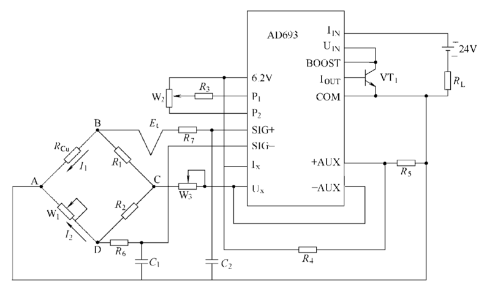

图 3-71 中输入电路是一个冷端温度补偿电桥，B、D 是电桥的输出端，与 AD693 的输入端相连。Rcu 为铜补偿电阻，通过改变电位器 W1 的阻值则可以调整变送器的零点。W2 和 R3 起调整放大器转换系数的作用，即起到了量程调整的作用。

AD693 的输入信号 Ui 为热电偶所产生的热电势 Et 与电桥的输出信号 UBD 的代数和，如果设 AD693 的转换系数为 K，可得变送器输出与输入之间的关系为:

1『此处公式省略，详见原书。』

从式（3-83）可以看出：1）变送器的输出电流 I0 与热电偶的热电勢 Et 成正比关系；2）Rcu 阻值随温度而变，合理选择 Rcu 的数值可使 Rcu 随温度变化而引起的 I1Rcu 变化量近似等于热电偶因冷端温度变化所引起的热电勢 Et 的变化值，两者互相抵消。

### 3.5.6 智能式温度变送器

智能式温度变送器有采用 HART 协议通信方式，也有采用现场总线通信方式，前者技术比较成熱，产品的种类也比较多；后者的产品近几年才间世，国内尚处于研究开发阶段下面以 SMART 公司的 TT302 温度变送器为例加以介绍。TT302 温度变送器是一种符合 FF 通信协议的现场总线智能仪表，它可以与各种热电偶或热电阻配合使用测量温度，具有量程范围宽、精度高、环境温度和振动影响小、抗干扰能力强、质量轻以及安装维护方便等优点。TT302 温度变送器主要由硬件部分和软件部分两部分构成。

1、TT302 温度变送器的硬件构成。

TT302 温度变送器的硬件构成原理框图如图 3-72 所示，在结构上它由输入板、主电路板和液晶显示器组成。


1.1）输入板输入板包括多路转换器、信号调理电路、A/D 转换器和隔离部分，其作用是将输入信号转换为二进制的数字信号，传送给 CPU，并实现输入板与主电略板的隔离。输入板上的环境温度传感器用于热电偶的冷端温度补偿。

1.2）主电路板主电路板包括微处理器系统、通信控制器、信号整形电路、本机调整部分和电源部分，它是变送器的核心部件。

1.3）液晶显示器液晶显示器是一个微功耗的显示器，可以显示四位半数字和五位字母，用于接收 CPU 的数据并加以显示。

2、TT302 温度变送器的软件构成。

TT302 温度变送器的软件分为系统程序和功能模块两大部分。系统程序使变送器各硬件电路能正常工作并实现所规定的功能，同时完成各组成部分之间的管理。功能模块提供了各种功能，用户可以选择所需要的功能模块以实现用户所要求的功能。

TT302 等一类智能式温度变送器还有很多其他功能，用户可以通过上位管理计算机或挂接在现场总线通信电缆上的手持式组态器，对变送器进行远程组，调用或删除功能模块；对于带有液晶显示的变送器，也可以使用磁性编程工具对变送器进行本地调整。

TT302 温度变送器还具有控制功能，其软件中提供了多种与控制功能有关的功能模块，用户通过组态，可以实现所要求的控制策略。

### 3.5.7 测温元件的安装

接触式测温仪表所测得的温度都是由测温（感温）元件来决定的。在正确选择测温元件和二次仪表之后，如不注意测温元件的正确安装，那么，测量精度仍得不到保证。工业上般是按下列要求进行安装的。

1、测温元件的安装要求。

1.1）在测量管道温度时，应保证测温元件与流体充分接触，以减少测量误差。因此，要求安装时测温元件应迎着被测介质流向插入，至少须与被测介质正交（成 90°），切勿与被测介质形成顺流。如图 3-73 所示。

1『温度测量元件的插入方向与介质的流向必须逆流或者正交，整个安装事项，做一张信息数据卡片。』——已完成


1.2）测温元件的感温点应处于管道中流速最大处。一般来说，热电偶、铂电阻、铜电阻保护套管的末端应分别越过流束中心线 5-10mm、50-70mm、25-30mm。

1.3）测温元件应有足够的插入深度，以减小测量误差。为此，测温元件应斜插安装或在弯头处安装，如图 3-74 所示。


1.4）若工艺管道过小（直径小于 80mm），安装测温元件处应接装扩大管如图 3-75 所示。


1.5）热电偶、热电阻的接线盒面盖应向上，以避免雨水或其他液体、脏物进入接线盒中影响测量，如图 3-76 所示。

1.6）为了防止热量散失，测温元件应插在有保温层的管道或设备处。

1.7）测温元件安装在负压管道中时，必须保证其密封性，以防外界冷空气进入，使读数降低。

2、布线要求。

2.1）按照规定的型号配用电偶的补偿导线，注意热电偶的正、负极与补偿导线的正负极相连接，不要接错。

2.2）电阻的线路电阻一定要符合所配二次仪表的要求。

2.3）为了保护连接导线与补偿导线不受外来的机械损伤，应把连接导线或补偿导线穿入钢管内或走槽板。

2.4）导线应尽量避免有接头。应有良好的绝缘。禁止与交流输电线合用一根穿线管，以免引起感应。

2.5）导线应尽量避开交流动力电线。

2.6）补偿导线不应有中间接头，否则应加装接线盒。另外，最好与其他导线分开敷设。

## 3.6 现代检测技术与传感器的发展

### 3.6.1 软测量技术的发展

随着现代工业过程对控制、计量、节能增效和运行可靠性等要求的不断提高，现代过程检测的内涵和外延较之以往均有很大的深化和拓展。单纯依据流量、温度、压力和液位等常规过程参数的测量信息往往不能完全满足工艺操作和控制的要求，很多控制系统需要获取诸如成分、物性乃至反映过程的多维时空分布信息（例如化学反应器内的介质浓度及其分布等），才能实现更有效的过程控制、优化控制、故障诊断、状态监测等功能。虽然过程检测技术发展至今已有长足的进步，但在实际工业过程中仍存在许多无法或难以用传感器或过程检测仪表进行直接测量的重要过程参数。

一般解决工业过程的测量要求有两条途径：一是沿袭传统的检测技术发展思路，通过研制新型的过程测量仪表，以硬件形式实现过程参数的直接在线测量；另一就是采用间接测量的思路，利用易于获取的其他测量信息，通过计算来实现被检测量的估计。「软测量技术」（Soft-Sensing Technique）正是第二种思想的集中体现。

1-2『这里达到测量目的的两种手段总结的到位，有感触，软测量技术，做一张术语卡片。同时去相关的 Paper。（2021-01-16）』——未完成

软测量技术也称为软仪表技术（Soft Sensor Technique）。概括地讲，就是利用易测过程变量（常称为辅助变量或二次变量，例如工业过程中容易获取的压力、温度等过程参数），依据这些易测过程变量与难以直接测量的待测过程变量（常称为主导变量，例如精馏塔中的各种组分浓度等）之间的数学关系（软测量模型），通过各种数学计算和估计方法，实现对待测过程变量的测量。

软测量技术作为一个概括性的科学术语被提出并得到了快速发展，始于 20 世纪 80 年代中后期。经过多年的发展，目前已建立了不少构造软仪表的理论和方法，软测量技术也已经在许多实际工业装置上得到了成功的应用。

通常，软测量技术可分为机理建模、回归分析、状态估计、模式识别、人工神经网络模糊数学、过程层析成像、相关分析和现代非线性信息处理技术等九种。相对而言，前六种软测量技术的研究较为深入，在过程控制和检测中有更多成功的应用。

### 3.6.2 现代传感器技术的发展

现代传感器技术发展的显著特征是：研究新材料，开发利用新功能，使传感器多功能化、微型化、集成化、数字化、智能化。

1、新材料、新功能的开发，新加工技术的使用。

传感器材料是传感技术的重要基础。因此，开发新型功能材料是发展传感技术的关键。半导体材料和半导体技术使传感器技术跃上了一个新合阶。半导体材料与工艺不仅使经典传感器焕然一新，而且发展了许多基于半导体材料的热电、光电特性及种关众多的化学传感器等新型传感器。如各种红外、光电器件（探测器）、热电器件（如热电偶）、热释电器件、气体传感器、离子传感器、生物传感器等。半导体光、热探测器具有高灵敏度、高精度、非接触的特点，由此发展了红外传感器、激光传感器、光纤传感器等现代传感器。以硅为基体的许多半导体材料易于微型化、集成化、多功能化和智能化，工艺技术成熟，因此应用最广也最具开拓性，是今后一个相当长的时间内研究和开发的重要材料之一。

被称为「最有希望的敏感材料」的是陶瓷材料和有机材料。近年来功能陶瓷材料发展很快，在气敏、热敏、光敏传感器中得到广泛的应用。目前已经能够按照人为设计的配方，制造出所要求性能的功能材料。陶瓷敏感材料种类繁多，应用广泛，极有发展潜力，常用的有半导体陶瓷、压电陶瓷、热释电陶瓷、离子导电陶瓷、超导陶瓷和铁氧体等。半体陶瓷是传感器应用的主要材料，其中尤以热敏、湿敏和气敏最为突出。高分子有机敏感材料是近几年人们极为关注的具有应用潜力的新型敏感材料，可制成热敏、光敏、气敏湿敏、力敏、离子敏和生物敏等元件。高分子有机敏感材料及其复合材料将以其独特的性能在各类敏感材料中占有重要的地位。生物活性物质（如酶、抗体、激素）和生物敏感材料（如微生物、组织切片）对生物体内化学成分具有敏感功能，且噪声低、选择性好，灵敏度高。

检测元件的性能除由其材料决定外，还与其加工技术有关，采用新的加工技术，如集成技术、薄膜技术、硅微机械加工技术、离子注入技术、静电封接技术等，能制作出质地均匀、性能稳定、可靠性高、体积小、重量轻、成本低、易集成化的检测元件。

2、多维、多功能化的传感器。

目前的传感器主要是用来测量一个点的参数，但应用时往往需要测量一条线上或一个面上的参数，因此需要相应地研究二维乃至三维的传感器。将检测元件和放大电路、运算电路等利用 IC 技术制作在同一芯片或制成混合式的传感器。实现从点到一维、二维、三维空间图像的检出。在某些场合，希望能在某一点同时测得两个参数，甚至更多的参数，因此要求能有测量多参数的传感器。气体传感器在多功能方面的进步最具有代表性。例如，一种能够同时测量四种气体的多功能传感器，共有六个不同材料制成的敏感部分，它们对被测的四种气体虽均有响应，但其响应的灵敏度却有很大差别，根据其从不同敏感部分的输出差异即可测出被测气体的浓度。

3、微型化、集成化、数值化和智能化。

微电子技术的迅速发展使得传感器的微型化和集成化成为可能，而与微处理器的结合形成新一代的智能传感器，是传感器发展的一种新的趋。智能传感器是一种带有微处理器兼有检测信息和信息处理功能的传感器。智能传感器通常具有自校零、自标定、自校正、自补偿功能；能够自动采集数据，并对数据进行预处理；能够自动进行检验。自选量程、自寻故障；具有数据存储、记忆与信息处理功能；具有双向通讯、标准化数字输出或者符号输出功能；具有判断、决策处理功能。其主要特点是：高精度，高可靠性和高稳定性，高信噪比与高分辨力，强自适应性以及低的价格性能比。可见，智能化是现代化新型传感器的一个必然发展趋势。

4、新型网络传感器的发展。

作为现代信息技术三大核心技术之一的传感器技术，从诞生到现在，已经经历了从「聋亚传感器」（Dumb Sensor）、「智能传感器」（Smart Sensor）到「网络化传感器」（Net worked Sensor）的发展历程。传统的传感器是模拟仪器仪表或模拟计算机时代的产物。它的设计指导思想是把外部信息变换成模拟电压或电流信号，它输出幅值小，灵敏度低，而且功能单一，因而被人们称为「聋哑传感器」。随着时代的进步，传统的传感器已经不能满足现代工农业生产甚至战争的需求，尤其 20 世纪 70 年代以来，计算机技术、微电子技术、光电子技术获得迅猛发展，加工工艺逐步成熱，新型的敏感材料不断被开发，特别是单片机的广泛使用使得传感器的性能越来越好、功能越来越强，智能化程度也越来越高，实现了数字化的通讯，具有数字存储和处理、自检、自校准以及一定的通讯功能，工业控制系统中的控制单元中的某些功能已逐渐被集成入传感器中，形成了所谓「智能型传感器」。

近几年来，工业控制系统继模拟仪表控制系统、集中式数字控制系统、分布式控制系统之后，基于各种现场总线标准的分布式测量和控制系统 DMCS（Distributed Measurement and Control System）得到了广泛的应用。目前在 DMCS 中所采用的控制总线网络多种多样，千差万别，内部结构、通信接口、通信协议各不相同。比较有影响的现场总线有 Foun dation Fieldbus（FF）、Lon Works、Profibus、HART、CAN、Upline 等。目前许多新型传感器已经不再需要数据采集和变送系统的转换，而直接具有符合上述总线标准的接口，可以直接连接在工业控制系统的总线上使用，这样就极大地提高了整个系统的性能、筒化了系统的复杂程度并降低了成本。可以说这类传感器已经具有相当强的网络通讯功能，可以将其称为「具有网络功能的智能传感器」，但由于每种总线标准都有自已规定的协议格式，只适合各自的领域应用，相互之间互不兼容，从而给系统的扩展及维护等带来不利影响。对于传感器生产商而言，由于市场上存在大量的控制网络和通信协议，要开发出所有控制网络都支持的传感器是不现实的。

图 3-77 是一种网络传感器的连接图。它是采用 RCM2200 模块，配合 Dynamic C 集成开发环境，利用其内嵌的 TCP/IP 协议機开发出的一种简单实用的网络传感器。


测量所用的敏感元件通过信号调整电路将所测数输送到 RCM2200 的 I/O ロ，模块在读取数据并经过一定的判断和处理后一方面可以通过外围电路直接输出报警和控制信号，另一方面也可以通过以太网口将数据发布到网络中去。该传感器可以直接与集线器相连接，并通过集线器与上位工控机连接构成一个完整的测控以太网络。