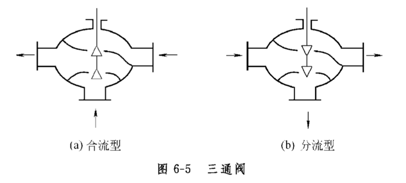
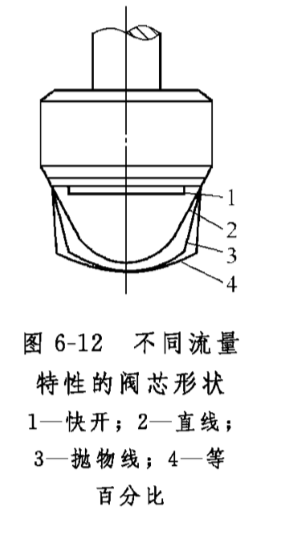
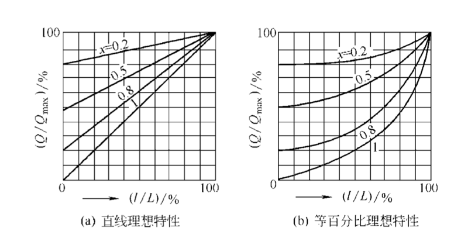
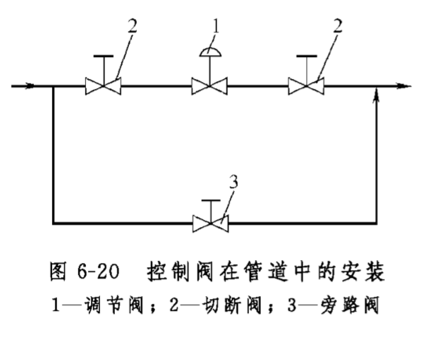
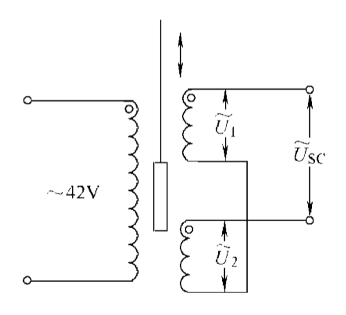
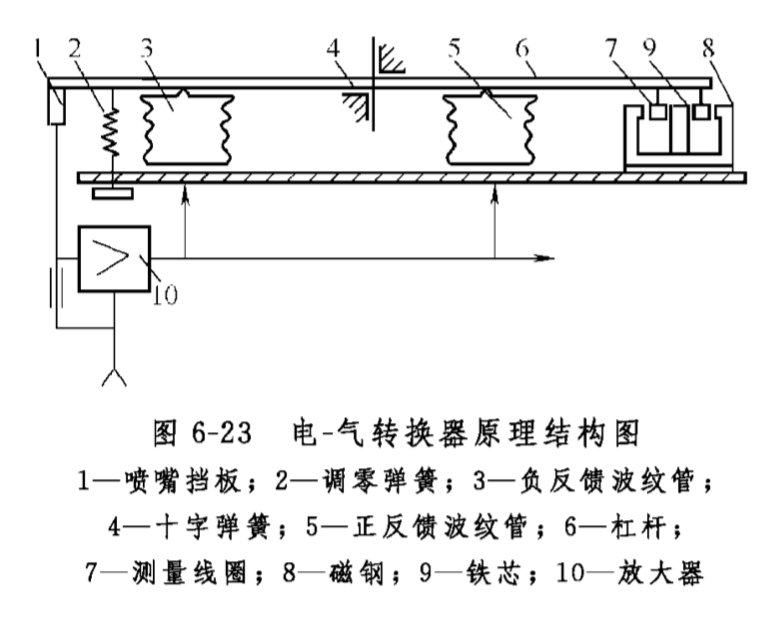
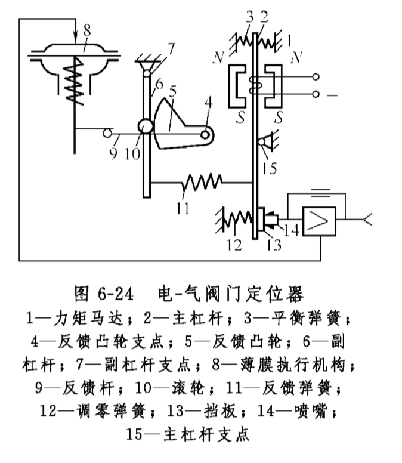

# 0601. 执行器

## 习题与思考题

1、气动执行器主要由哪两部分组成？各起什么作用？

2、试问控制阀的结构有哪些主要类型？各使用在什么场合？

3、为什么说双座阀产生的不平衡力比单座阀的小？

4、试分别说明什么叫控钊阀的流量特性和理想流量特性？常用的控制理想流量特性有哪些？

5、为什么说等百分比特性又叫对数特性？与线性特性比较起来它有什么优点？

6、什么叫控制阀的工作流量特性？

7、什么叫控制阀的可调范围？在串、并联管道中可调范围为什么会变化？

1『产生问华雷的问题：控制阀的可调范围，哪些因素会对其产生影响。（2021-06-10）』

8、什么是串联管道中的阻力比 s? s 值的变化为什么会使理想流量特性发生畸变？

9、什么是并联管道中的分流比 x？试说明 x 值对控制阀流量特性的影响。

10、如果控制阀的旁路流量较大，会出现什么情况？

11、什么叫气动挑行器的气开式与气关式？其选择原则是什么？

12、要想将一台气开阀改为气关阀，可采取什么措施？

13、什么是控制阀的流量系数 Kv？如何选择控制阀的口径？

14、试述电气转换器的用途与工作原理。

15、试述电-气阀门定位器的基本原理与工作过程。

16、电-气阀门定位器有什么用途？

17、控制阀的日常维护要注意什么？

18、电动执行器有哪几种类型？各使用在什么场合？

19、电动执行器的反馈信号是如何得到的？试简述差动变压器将位移转换为电信号的基本原理。

20、数字阀有哪些特点？

21、什么是智能控制阀？它的智能主要体现在哪些方面？

## 6.0

执行器是自动控制系统中的一个重要组成部分。它的作用是接收控制器送来的控制信号，改变被控介质的流量，从而将被控变量维持在所要求的数值上或一定的范围内。

执行器按其能源形式可分为气动、电动、液动三大类。气动执行器用压缩空气作为能源，其特点是结构筒单、动作可靠、平稳、输出推力较大、维修方便、防火防爆，而且价格较低，因此广泛地应用于化、炼油等生产过程中。它可以方便地与气动仪表配套使用。即使是采用电动仪表或计算机控制时，只要经过电一气转换器或电气阀门定位器将电信号转换为 0.02~0.1MPa 的标准气压信号，仍然可用气动执行器。电动执行器的能源取用方便，信号传递迅速，但由于它结构复杂、防爆性能差，故较少应用。液动执行器在化工、炼油等生产过程中基本上不使用。

## 6.1 气动执行器

气动执行器由执行机构和控制机构（阀）两部分组成。执行机构是执行器的推动装置，它按控制信号压力的大小产生相应的推力，推动控制机构动作，所以它是将信号压カ的大小转换为阀杆位移的装置。控制机构是执行器的控制部分，它直接与被控介质接触，控制流体的流量。所以它是将阀杆的位移转换为流过阀的流量的装置。

图 6-1 是一种常用气动执行器的示意图。气压信号由上部引入，作用在薄膜 1 上，推动阀杆 2 产生位移，改变了阀芯 3 与阀座 4 之间的流通面积从而达到了控制流量的目的。图中上半部为执行机构，下半部为控劁机构。

气动执行器有时还配备一定的辅助装置。常用的有阀门定位器和手轮机构。阀门定位器的作用是利用反原理来改善执行器的性能，使挑行器能按控制器的控制信号，实现准确的定位。手轮机的作用是当控制系统因停电、停气、控制器无输出或执行机构失灵时，利用它可以直接操纵控制阀，以维持生产的正常进行。

### 6.1.1 气动执行器的结构与分类

前面已经提到，气动执行器主要由挑行机构与控制机构两大部分组成。根据不同的使用要求，它们又可分为许多不同的形式，下面分别加以叙述。

1、行机构。

气动执行机构主要分为薄膜式和活塞式两种。其中薄膜式执行机构最为常用，它可以用作一般控制阀的推动装置组成气动薄膜式执行器，习惯上称为气动薄膜调节阀。它的结构简单、价格便宣、维修方便，应用广泛。

气动活塞式执行机构的推力较大，主要适用于大ロ径、高压降控制阀或蝶阀的推动装置。

除薄膜式和活塞式之外，还有长行程执行机构。它的行程长、转矩大，适于输出转角（0°-90°）和力矩，如用于蝶阀或风门的推动装置。

气动薄膜式执行机构有正作用和反作用两种形式。当来自控制器或阀门定位器的信号压力增大时，阀杆向下动作的叫正作用执行机构（ZMA 型）；当信号压力增大时，阀杆向上动作的叫反作用执行机构（ZMB 型）。正作用执行机构的信号压力是通入波纹膜片上方的薄膜气室；反作用执行机构的信号压力是通入波纹膜片下方的薄膜气室。通过更换个别零件，两者便能互相改装。

根据有无弹簧执行机构可分为有弹簧的及无弹簧的，有弹簧的薄膜式执行机最为常用，无弹簧的薄膜式执行机构常用于双位式控制。

有弹簧的薄膜式执行机构的输出位移与输入气压信号成比例关系。当信号压力（通常为 0.02-0.1MPa）通入薄膜气室时，在薄膜上产生一个推力，使阀杆移动并压缩弹簧，直至弹簣的反作用力与推力相平衡，推杆稳定在一个新的位置。信号压力越大，阀杆的位移量也越大。阀杆的位移即为执行机的直线输出位移，也称行程。行程规格有 10mm、16mm、25mm、40mm、60mm、100mm 等。

2、控制机构。

控制机构即控制阀，实际上是一个局部阻力可以改变的节流元件。通过阀杆上部与执行机构相连，下部与阀芯相连。由于阀芯在阀体内移动，改变了阀芯与阀座之间的流通面积，即改变了阀的阻力系数，被控介质的流量也就相应地改变，从而达到控制工艺参数的目的。

根据不同的使用要求，控制阀的结构形式很多，主要有以下几种。

1）直通单座控制阀。这种阀的阀体内只有一个阀芯与阀座，如图 6-2 所示。其特点是结构简单、泄漏量小，易于保证关闭，甚至完全切断。但是在压差大的时候，流体对阀芯上下作用的推力不平衡，这种不平衡力会影响阀芯的移动。因此这种阀一般应用在小口径、低压差的场合。

2）直通双座控制阀阀体内有两个阀芯和阀座，如图 6-3 所示。这是最常用的一种类型。由于流体流过的时候，作用在上、下两个阀芯上的推力方向相反而大小近于相等，可以互相抵消，所以不平衡力小。但是，由于加工的限制，上下两个阀芯阀座不易保证同时密闭，因此泄量较大。

根据阀芯与阀座的相对位置，这种阀可分为正作用式与反作用式（或称正装与反装）两种形式。当阀体直立，阀杆下移时，阀芯与阀座间的流通面积减小的称为正作用式，图 6-3 所示的为正作用式时的情况。如果将阀芯倒装，则当阀杆下移时，阀芯与阀座间流通面积增大，称为反作用式。

3）角形控制阀。角形阀的两个接管呈直角形，一般为底进侧出，如图 6-4 所示。这种阀的流路筒单、阻力较小，适用于现场管道要求直角连接，介质为高黏度、高压差和含有少量悬浮物和固体颗粒状的场合。

4）三通控制阀。三通阀共有三个出入与工艺管道连接。其流通方式有合流（两种介质混合成一路）型和分流（一种介质分成两路）型两种，分别如图 6-5（a）、（b）所示。这种阀可以用来代替两个直通阀，适用于配比控制与旁路控制。与直通阀相比，组成同样的系统时，可省掉一个二通阀和一个三通接管。

5）隔膜控制阀。它采用耐腐蚀里的阀体和隔膜，如图 6-6 所示。隔膜阀结构筒单、流阻小、流通能力比同口径的其他种类的阀要大。由于介质用隔膜与外界隔离，故无填料，介质也不会泄漏。这种阀耐腐蚀性强，适用于强酸、强碱、强腐蚀性介质的控制，也能用于高黏度及悬浮颗粒状介质的控制。

选用隔膜阀时，应注意执行机构须有足够的推力。一般隔膜阀直径大于 D100mm 时，均采用活塞式执行机构。由于受衬里材料性质的限制，这种阀的使用温度宜在 150℃ 以下，压カ在 1MPa 以下。

6）蝶阀又名翻板阀，如图 6-7 所示。蝶阀具有结构筒单、重量轻、价格便宜、流阻极小的优点，但泄漏量大，适用于大口径、大流量、低压差的场合，也可以用于含少量纤维或悬浮颗粒状介质的控制。

7）球阀。球阀的阀芯与阀体都呈球形体，转动阀芯使之与阀体处于不同的相对位置时，就具有不同的流通面积，以达到流量控制的目的，如图 6-8 所示。

球阀阀芯有「V」形和「O」形两种开口形式，分别如图 6-9（a）、（b）所示。O 形球阀的节流元件是带圆孔的球形体，转动球体可起控制和切断的作用，常用于双位式控制。V 形球阀的节流元件是 V 形缺口球形体，转动球心使 V 形缺口起节流和剪切的作用，适用于高黏度和污秽介质的控制。

9）笼式阀。又名套筒型控制阀，它的阀体与一般的直通单座阀相似，如图 6-11 所示。笼式阀内有一个圆柱形套筒（笼子）。套筒壁上有一个或几个不同形状的孔（窗口），利用套筒导向，阀芯在套筒内上下移动，由于这种移动改变了笼子的节流孔面积，就形成了各种特性并实现流量控制。笼式阀的可调比大、振动小、不平衡力小、结枘筒单、套筒互换性好更换不同的套筒（窗口形状不同）即可得到不同的流量特性，阀内部件所受的汽蚀小、噪声小，是一种性能优良的阀，特适用于要求低噪声及压差较大的场合，但不适用高温、高黏度及含有固体颗粒的流体。

除以上所介绍的阀以外，还有一些特殊的控制阀。例如小流量阀适用于小流量的精密控制，超高压阀适用于高静压、高压差的场合。

### 6.1.2 控制阀的流量特性

控制阀的流量特性是指被控介质流过阀门的相对流量与阀门的相对开度（相对位移）间的关系，即：

$$\frac{Q}{Qmax} = f(\frac{l}{L})$$

式中，相对流量 Q/Qmax 是控制阀某一开度时流量 Q 与全开时流量 Qmax 之比。相对开度 l/L 是控制阀某一开度行程与全开行程 L 之比。

一般来说，改变控制阀阀芯与阀座间的流通截面积，便可控制流量。但实际上还有多种因素影响，例如在节流面积改变的同时还发生阀前后压差的变化，而这又将引起流量变化。为了便于分析，先假定阀前后压差固定，然后再引申到真实情况，于是有理想流量特性与工作流量特性之分。

2『控制阀的流量特性，做一张术语卡片。（2021-06-10）』—— 已完成

1、控制阀的理想流量特性。

在不考虑控制阀前后压差变化时得到的流量特性称为理想流量特性，它取决于阀芯的形状（图 6-12），主要有直线、等百分比（对数）、拋物线及快开等几种。

1）直线流量特性。直线流量特性是指控制阀的相对流量与相对开度成直线关系，即单位位移变化所引起的流量变化是常数。用数学式表示为：

式中，K 为常数，即控制阀的放大系数。将式（6-2）积分可得：

式中，C 为积分常数。边界条件为：l=0 时，Q=Qmin (Qmin 为控制阀能控制的最小流量）；l=L 时 Q=Qmax。把边界条件代入式（6-3），可分别得：

式中，R 为控制阀所能控制的最大流量 Qmax 与最小流量 Qmin 的比值，称为控制阀的可调范围或可调比。

2『控制阀的可调范围，做一张术语卡片。（2021-06-10）』—— 已完成

值得指出的是，Qmin 并不等于控制阀全关时的泄漏量，一般它是 Qmax 的 2-4%。国产控制阀理想可调范围 R 为 30（这是对于直通单座、直通座、角形阀和阀体分离阀而言的。隔膜阀的可调范围为 10）。

将式（6-4）代入式（6-3），可得：

式（6-5）表明 Q/Qmax 与 l/L 之间呈线性关系，在直角坐标上是一条直线（如图 6-13 中直线 2 所示）。要注意的是当可调比 R 不同时，特性曲线在纵坐标上的起点是不同的。当 R=30，l/L=0 时，Q/Qmax=0.33。为便于分析和计算，假设 R=∞，即特性曲线以坐标原点为起点，这时当位移变化 10% 所引起的流量变化总是 10%。但流量变化的相对值是不同的，以行程的 10%、50% 及 80% 三点为例，若位移变化量都为 10%，则：

在 10% 时，流量变化的相对值为：

(20-10)/10×100%=100%

在 50% 时，流量变化的相对值为：

(60-50)/50×100%=20%

在 80% 时，流量变化的相对值为：

(90-80)/80×100%=12.5%

可见，在流量小时，流量变化的相对值大；在流量大时，流量变化的相对值小。也就是说，当阀门在小开度时控制作用太强；而在大开度时控制作用太弱，这是不利于控制系统的正常运行的。从控制系统来讲，当系统处于小负荷时（原始流量较小），要克服外界干扰的影响，希望控制阀动作所引起的流量变化量不要太大，以免控制作用太强产生超调，甚至发生振满；当系统处于大负荷时，要克服外界干扰的影响，希望控制阀动作所引起的流量变化量要大一些，以免控制作用微弱而使控制不够灵敏。直线流量特性不能满足以上要求。

2）等百分比（对数）流量特性。等百分比流量特性是指单位相对行程变化所引起的相对流量变化与此点的相对流量成正比关系，即控制阀的放大系数随相对流量的增加而增大。用数学式表示为：

将式（6-6) 积分得：

将前述边界条件代入，可得：

相对开度与相对流量成对数关系。曲线斜率（图 6-13 中曲线 4 所示）即放大系数随行程的增大而增大。在同样的行程变化值下，流量小时，流量变化小，控制平稳缓和；流量大时，流量变化大，控制灵敏有效。

3）拋物线流量特性。

Q/Qmax 与 l/L 之间成抛物线关系，在直角坐标上为一条抛物线，它介于直线及对数曲线之间。数学表达式为：

4）快开特性。这种流量特性在开度较小时就有较大流量，随开度的增大，流量很快就达到最大，故称为快开特性。快开特性的阀芯形式是平板形的，适用于迅速启闭的切断阀或双位控制系统。

2、控制阀的工作流量特性。

在实际生产中，控制阀前后压差总是变化的，这时的流量特性称为工作流量特性。

1）串联管道的工作流量特性。以图 6-14 所示串联系统为例来讨论，系统总压差 △p 等于管路系统（除控制阀外的全部设备和管道的各局部阻カ之和）的压差 △p2 与控制阀的压差 △p1 之和（图 6-15）。以 s 表示控制阀全开时阀上压差与系统总压差（即系统中最大流量时动力损失总和）之比。以 Qmax 表示管道阻カ等于零时控制阀的全开流量，此时阀上压差为系统总压差。于是可得串联管道以 Qmax 作参比值的工作流量特性，如图 6-16 所示。

图中 s=1 时，管道阻力损失为零，系统总压差全降在阀上，工作特性与理想特性一致。随着 s 值的减小，直线特性淅趋近于快开特性，等百分比特性淅淅接近于直线特性。所以，在实际使用中，一般希望 s 值不低于 0.3-0.5。

在现场使用中，如控制阀选得过大或生产在低负荷状态，控制阀将工作在小开度。有时，为了使控制阀有一定的开度而把工艺阀门关小些以增加管道阻力，使流过控制阀的流量降低，这样，s 值下降，使流量特性畸变，控制质量恶化。

2）并联管道的工作流量特性。控制阀一般都装有旁路，以便手动操作和维护。当生产量提高或控制阀选小了时，只好将旁路阀打开一些，此时控制阀的理想流量特性就改变成为工作特性。

图 6-17 表示并联管道时的情况。显然这时管的总流量 Q 是控制阀流量 Q1 与旁路流量 Q2 之和，即 Q=Q1+Q2。

若以 x 代表并联管道时控制阀全开时的流量 Q1max 与总管最大流量 Qmax 之比，可以得到在压差 △p 为一定时，而 x 为不同数值时的工作流量性，如图 6-18 所示。图中纵坐标流量以总管最大流量 Qmax 为参比值。

图 6-18 并联管道时控制的工作特性

由图可见，当 x=1，即旁路阀关闭、Q2=0 时，控制阀的工作流量特性与它的理想流量特性相同。随着 x 值的减小，即旁路阀逐打开，虽然阀本身的流量特性变化不大，但可调范围大大降低了。控制阀关死，即 l/L=0 时，流量 Qmin 比控制阀本身的 Q1min 大得多。同时，在实际使用中总存在着串联管道阻力的影响，控制阀上的压差还会随流量的增加而降低，使可调范围下降得更多些，控制阀在工作过程中所能控制的流量变化范围更小，甚至几乎不起控制作用。所以，采用打开旁路阀的控制方案是不好的，一般认为旁路流量最多只能是总流量的百分之十几，即 x 值最小不低于 0.8。

综合上述串、并联管道的情况，可得如下结论。

① 串、并联管道都会使阀的理想流量特性发生畸变，串联管道的影响尤为严重。

② 串、并联管道都会使控制阀的可调范围降低，并联管道尤为严重。

③ 串联管道使系统总流量减少，并联管道使系统总流量增加。

④ 串、并联管道会使控制阀的放大系数减小，即输入信号变化引起的流量变化值臧少串联管道时控制阀若处于大开度，则 s 值降低对放大系数影响更为严重；并联管道时控制阀若处于小开度，则 x 值降低对放大系数影响更为严重。

### 6.1.3 控制阀的选择

气动薄膜控制阀选用得正确与否是很重要的。选用控制阀时，一般要根据被控介质的特点（温度、压、腐蚀性、黏度等）、控要求、安装地点等因素，参考各种类型控制阀的特点合理地选用。在具体选用时，一般应考虑下列几个主要方面的问题

2『控制阀的选择原则，做一张主题卡片。（2021-06-11）』—— 已完成

1、控制阀结构与特性的选择。

控制阀的结构形式主要根据工艺条件，如温度、压力及介质的物理、化学特性（如腐蚀性、黏度等）来选择。例如强腐蚀介质可采用隔膜阀、高温介质可选用带翅形散热片的结构形式。

控制阀的结构形式确定以后，还需确定控制阀的流量特性（即阀芯的形状）。一般是先按控制系统的特点来选择阀的希望流量特性，然后再考虑工艺配管情况来选择相应的理想流量特性。使控制阀安装在具体的管道系统中，畸变后的工作流量特性能满足控制系统对它的要求。目前使用比较多的是等百分比流量特性。

2、气开式与气关式的选择。

气动执行器有气开式与气关式两种形式。有压力信号时阀关、无信号压力时阀开的为气关式。反之，为气开式。由于执行机构有正、反作用，控制阀（具有双导向阀芯的）也有正、反作用。因此气动行器的气关或气开即由此组合而成。如图 6-19 和表 6-1 所示。

1-2『气开气关之前自己很容易弄混淆，就牢记一点，有气的时候开 => 气开阀。气开气关阀做一张术语卡片。（2021-06-11）』—— 已完成

图 6-1 组合方式图

表 6-1 组合方式

| 序号 | 执行机构 | 控制阀 | 气动执行器 |
| --- | --- | --- | --- |
| a | 正 | 正 | 气关（正） |
| b | 正 | 反 | 气开（反） |
| c | 反 | 正 | 气开（反） |
| d | 反 | 反 | 气关（正） |

气开、气关的选择主要从工艺生产上安全要求出发。考虑原则是：信号压力中断时，应保证设备和操作人员的安全。如果阀处于打开位置时危害性小，则应选用气关式，以使气源系统发生故障，气源中断时，阀门能自动打开，保证安全。反之阀处于关闭时危害性小，则应选用气开阀。例如，加熱炉的燃料气或燃料油应采用气开式控制阀，即当信号中断时应切断进炉燃料，以免炉温过高造成事故。又如控制进入设备易燃气体的控制阀，应选用气开式，以防爆炸，若介质为易结晶物料，则选用气关式，以防堵塞。

3、控制阀口径的选择。

控制阀口径选择得合适与否将会直接影响控制效果。口径选择得过小，会使流经控制阀的介质达不到所需要的最大流量。在大的干扰情况下，系统会因介质流量（即操纵变量的数值）的不足而失控，因而使控制效果变差，此时若企图通过开大旁路阀来弥补介质流量的不足，则会使阀的流量特性产生畸变；口径选择得过大，不仅会浪费设备投资，而且会使控制阀经常处于小开度工作，控制性能也会变差，容易使控制系统变得不稳定。

控制阀的口径选择是由控制阀流量系数 Kv 值决定的。流量系数 Kv 的定义为：当阀两端压差为 100kPa，流体密度为 1g/cm3，阀全开时，流经控制阀的流体流量（以 m3/h 表 示）。例如，某一控制阀在全开时，当阀两端压差为 100kPa，如果流经阀的水流量为 40m3/h，则该控制阀的流量系数 K 值为 40。

1-2『第一次知道阀门 Kv 的概念是在霍尼韦尔实习做动态模拟时，通过调整阀门的 Kv 这个参数数值，达到自己想要的 P/F 组合。阀门流量系数 Kv 做一张术语卡片。（2021-06-11）』—— 已完成

控制阀的流量系数 Kv 表示控制阀容量的大小，是表示控制阀流通能力的参数。因此，控制阀流量系数 Kv 亦可称控制阀的流通能力。

对于不可压缩的流体，且阀前后压差 p1-p2 不太大（即流体为非阻塞流）时，其流量系数 Kv 的计算公式为：

$$Kv = 10Q\sqrt{\frac{ρ}{p1-p2}}$$

密度单位 g/cm3

压力单位 kPa

流量单位 m3/h

从式（6-8）可以看出，如果控制阀前后压差 p1-p2 保持为 100kPa，阀全开时流经阀的水（ρ=1g/cm3）流量 Q 即为该阀的 Kv 值。

1『借助上面阀门全开水的流量的例子（即定义），可以降低记忆计算公式的阻力，哈哈。（2021-06-11）』

因此，控制阀口径的选择实质上就是根据特定的工艺条件（即给定的介质流量、阀前后的压差以及介质的物性参数等）进行 Kv 值的计算，然后按控制阀生产厂家的产品目录，选出相应的控制阀口径，使得通过控制阀的流量满足工艺要求的最大流量且留有一定的裕量，但裕量不宜过大。

3『上面的信息联想到今天华雷培训控制阀相关知识的场景，结束时俞洪明补充「调节阀=阻力元件」，调节阀的本质是通过认为控制阻力降来达到控制流量的目的，那么阻力降如何来？阀门压差、介质的物性以及流量三个核心元素。那么就跟上面的这段信息对应上了，这个三个核心元素的「结合体」其实对应于阀门的「流量系数」。（2021-06-11）』

Kv 值的计算与介质的特性、流动的状态等因素有关，具体计算时请参考有关计算手册或应用相应的计算机软件。

### 6.1.4 气动执行器的安装和维护

气动执行器的正确安装和维护，是保证它能发挥应有效用的重要一环。对气动执行器的安装和维护，一般应注意下列几个问题：

2『气动执行器的安装、维护，做一张信息数据卡片。（2021-06-11）』—— 已完成

1、为便于维护检修，气动执行器应安装在靠近地面或楼板的地方。当装有阀门定位器或手轮机构时，更应保证观察、调整和操作的方便。手轮机构的作用是：在开停车或事故情况下，可以用它来直接人工操作控制阀，而不用气压驱动。

2、气动执行器应安装在环境温度不高于 +60℃ 和不低于 -40℃ 的地方，并应远离振动较大的设备。为了避免膜片受热老化，控制阀的上膜盖与载热管道或设备之间的距离应大于 200mm。

3、阀的公称通径与管道公称通径不同时，两者之间应加一段异径管。

4、气动执行器应该是正立垂直安装于水平管道上。特殊情况下需要水平或倾斜安装时，除小ロ径阀外，一般应加支撑。即使正立垂直安装，当阀的自重较大和有振动场合时，也应加支撑。

5、通过控制阀的流体方向在阀体上有箭头标明，不能装反，正如孔板不能反装一样。

6、控制阀前后一般要各装一只切断阀，以便修理时拆下控制阀。考虑到控制阀发生故障或维修时，不影响工艺生产的继续进行，一般应装旁略阀，如图 6-20 所示。

7、控制阀安装前，应对管路进行清洗，排去污物和焊渣。安装后还应再次对管路和阀门进行清洗，并检査阀门与管道连接处的密封性能。当初次通入介质时，应使阀门处于全开位置以免杂质卡住。

8、在日常使用中，要对控制阀经常维护和定期检修。应注意填料的密封情和阀杆上下移动的情况是否良好，气路接头及膜片有否漏气等。检修时重点检查部位有阀体内壁、阀座、阀芯、膜片及密封圈、密封填料等。

## 6.2 电动执行器

电动执行器与气动执行器一样，是控制系统中的一个重要部分。它接收来自控制器的 0-10mA 或 4-20mA 的直流电流信号，并将其转换成相应的角位移或直行程位移，去操纵阀门、挡板等控制机构，以实现自动控制。

电动执行器有角行程、直行程和多转式等类型。角行程电动执行机构以电动机为动力元件，将输入的直流电流信号转换为相应的角位移（0°-90°），这种执行机构适用于操纵蝶阀、挡板之类的旋转式控制阀。直行程执行机构接收输入的直流电流信号后，使电动机转动，然后经减速器减速并转换为直线位移输出，去操纵单座、双座、三通等各种控制阀和其他直线式控制机构。多转式电动执行机构主要用来开启和关闭闸阀、截止阀等多转式阀门，由于它的电机功率比较大，最大的有几十千瓦，一般多用作就地操作和遥控。

几种类型的电动执行机构在电气原理上基本上是相同的，只是减速器不一样。以下简单介绍一下角行程的电动行机构。

图 6-21 角行程执行机构的组成示意图

角行程电动执行机构主要由伺服放大器、伺服电动机、减速器、位置发送器和操纵器组成，如图 6-21 所示。其工作过程大致如下：伺服放大器将由控制器来的输入信号与位置反馈信号进行比较，当无信号输入时，由于位置反馈信号也为零，放大器无输出，电机不转；如有信号输入，且与反馈信号比较产生偏差，使放大器有足够的输出功率，驱动伺服电动机，经速后使减速器的输出轴转动，直到与输出轴相连的位置发送器的输出电流与输入信号相等为止。此时输出轴就稳定在与该输入信号相对应的转角位置上，实现了输入电流信号与输出转角的转换。

位置发送器是能将执行机输出轴的位移转变为 0-10mA DC（或 4-20mA DC）反馈信号的装置，它的主要部分是差动变压器，其原理如图 6-22 所示。

在差动变压器的原边加一交流稳压电源后，其副边分别会感应出交流电压 U1、U2，由于两副边绕组匝数相等，故感应电压 Usc 的大小将取决于铁芯的位置。

芯的位置是与执行机构输出轴的位置相对应的。当铁芯在中间位置时，因两副边绕组的磁路对称，故在任一瞬间穿过两副边绕组的磁通都相等，因而感应电压 U1=U2。但因两绕组反向串联，它们所产生的电压互相抵消，因而输出电压 Usc 等于零。

当铁芯自中间位置有一向上的位移时，使磁路对两绕组不对称，这时上边绕组中交变磁通的幅值将大于下面绕组中交変磁通的幅值，两绕组中的感应电压将是 U1>U2，因而有输出电压 Usc=U1-U2 产生。反之，当铁芯下移时，两电压的关系将是 U2>U1，此时输出电压的相位与上述相反，其大小为 Usc=U2-U1。

信号 Usc 经过整流、滤波电路可以得到 0-10mA 的直流电流信号，它的大小与执行机构输出位移相对应。这个信号被反馈到伺服放大器的输入端，以与输入信号相比较。

电动执行机构不仅可与控制器配合实现自动控制，还可通过操纵器实现控制系统的自动控制和手动控制的相互切换。当操纵器的切换开关置于手动操作位置时，由正、反操作按钮直接控制电机的电源，以实现执行机构输出轴的正转或反转，进行邊控手动操作。

## 6.3 电-气转换器及电-气阀门定位器

在实际系统中，电与气两种信号常是混合使用的，这样可以取长补短。因而有各种电-气转换器及气-电转换器把电信号（0-10mA DC 或 4-20mA DC）与气信号（0.02-0.1MPa）进行转换。电-气转换器可以把电动变送器来的电信号变为气信号，送到气动控制器或气动显示仪表；也可把电动控制器的输出信号变为气信号去驱动气动控制阀，此时常用电-气阀门定位器，它具有电-气转换器和气动阀门定位器两种作用。

### 6.3.1 电气转换器

电-气转换器的结构原理如图 6-23 所示，它按力矩平衡原理工作。当直流电流信号通入置于恒定磁场里的测量线圈中时，所产生的磁通与磁钢在空气隙中的磁通相互作用而产生个向上的电磁（即测量）。由于线圈固定在杠杆上，使杠杆绕十字簧片偏转，于是装在杠杆另一端的挡板靠近喷嘴，使其背压升高，经过放大器功率放大后，一方面输出，一方面反馈到正、负两个波纹管，建立起与测量力矩相平衡的反馈力矩。于是输出信号（0.02-0.1MPa）就与线圈电流成一一对应的关系。

由于负反馈力矩比线圈产生的测量力矩大得多，因而设置了正反馈波纹管，负反馈力矩减去正反馈力矩后的差就是反馈力矩。调零弹用来调节输出气压的初始值。如果输出气压变化的范围不对，可调永久磁钢的分磁螺钉。

### 6.3.2 电-气阀门定位器

电-气阀门定位器一方面具有电一气转换器的作用，可用电动控制器输出的 0-10mA DC 或 4-20mA DC 信号去操纵气动执行机构；另一方面还具有气动阀门定位器的作用，可以使阀门位置按控制器送来的信号准确定位（即输入信号与阀门位置呈一一对应关系）。同时，改变图 6-24 中反馈凸轮 5 的形状或安装位置，还可以改变控制阀的流量特性和实现正、反作用（即输出信号可以随输入信号的增加而增加，也可以随输入信号的增加而减少）。

配薄膜执行机构的电-气阀门定位器的动作原理如图 6-24 所示，它是按力矩平衡原理工作的。当信号电流通入力矩马达 1 的线圈时，它与永久磁钢作用后，对主杠杆产生一个力矩，于是挡板靠近喷嘴，经放大器放大后，送入薄膜气室使杠杆向下移动，并带动反馈杆绕其支点 4 转动，连在同一轴上的反凸轮也做逆时针方向转动，通过滚轮使副杠杆绕其支点偏转，拉伸反馈弹。当反弹簣对主杠杆的拉力与力矩马达作用在主杠杆上的力两者力矩平衡时，仪表达到平衡状态，此时，一定的信号电流就对应于一定的阀门位置。

## 6.4 数字阀与智能控制阀

随着计算机控制系统的发展，为了能够直接接收数字信号，执行器出现了与之适应的新品种，数字阀和智能控制阀就是其中两例，下面筒单介绍一下它们的功能与特点。

### 6.4.1 数字阀

数字阀是一种位式的数字执行器，由一系列并联安装而且按二进制排列的阀门所组成。图 6-25 表示一个 8 位数字阀的控制原理。数字阀体内有一系列开闭式的流孔，它们按照二进制顺序排列。例如对这个数字阀，每个流孔的流量按 2$^0$、2$^1$、2$^2$、2$^3$、2$^4$、2$^5$、2$^6$、2$^7$ 来设计，如果所有流孔关闭，则流量为 0，如果流孔全部开启，则流量为 255（流量单位），分辨率为 1（流量单位）。因此数字阀能在很大的范围内（如 8 位数字阀调节范围为 1-255）精密控制流量。数字阀的开度按步进式变化，每步大小随位数的增加而减小。

数字阀主要由流孔、阀体和行机三部分组成。每一个流孔都有自已的阀芯和阀座。执行机构可以用电磁线圈，也可以用装有弹簧的活塞执行机枘。

数字阀有以下特点。

1、高分辨率。数字阀位数越高，分辨率越高。8 位、10 位的分辨率比模拟式控制阀高得多。

2、高精度。每个流孔都装有预先校正流量特性的喷管和文丘里管，精度很高，尤其适合小流量控制。

3、反应速度快，关闭特性好。

4、直接与计算机相连。数字阀能直接接收计算机的并行二进制数码信号，有直接将数字信号转换成阀开度的功能。因此数字阀能用于直接由计算机控制的系统中。

5、没有滞后、线性好、噪声小。

但是数字阀结构复杂、部件多、价格贵。此外由于过于敏感，导致输送给数字阀的控制信号稍有错误，就会造成控制错误，使被控流量大大高于或低于所要求的量。

### 6.4.2 智能控制阀

智能控制阀是近年来迅速发展的执行器，集常规仪表的检测、控制、执行等作用于身，具有智能化的控制、显示、诊断、保护和通信功能，是以控制阀为主体，将许多部件组装在一起的一体化结构。智能控制阀的智能主要体现在以下几个方面。

1、控制智能。除了一般的执行器控制功能外，还可以按照一定的控制规律动作。此外还配有压力、温度和位置参数的传感器，可对流量、压力、温度、位置等参数进行控制。

2、通信智能。智能控制阀采用数字通信方式与主控制室保持联络，主计算机可以直接对挑行器发出动作指令。智能控制阀还允许远程检测、整定、修改参数或算法等。

3、诊断智能。智能控阀安装在现场，但都有自诊新功能，能根据配合使用的各种传感器通过微机分析判断故障情，及时采取措施并报警。

目前智能控制阀已经用于现场总线控制系统中。