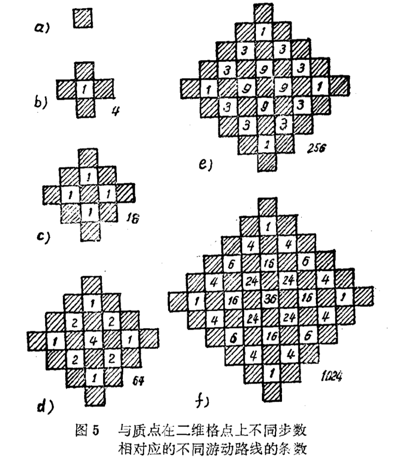
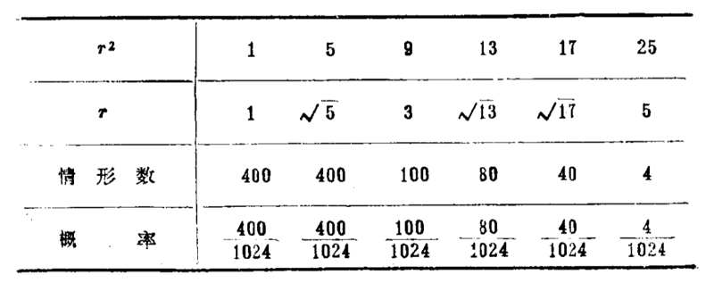

# 0101. 概率概念的组合定义法

## 1.1 排列

两个字母 A 和 B 的顺序有两种不同排法：

```
AB BA
```

三个字母 A、B 和 C 排成一列，共有六种不同排法：

```
ABC ACB

BAC BCA

CAB CBA
```

四个字母 A、B、C 和 D 排成一列，总共有 24 种不同排法：

```
ABCD BACD CABD DABC

ABDC BADC CADB DACB

ACBD BCAD CBAD DBAC

A CDB BCDA CBDA DBCA

ADBC BDAC CDAB DCAB

ADCB BDCA CDBA DCBA
```

把十个不同字母排成一列，总共有多少不同排法呢？逐个列举一切可能的排法是困难的。我们希望有一种回答上述问题的一般规则，换句话说，建立一个公式，以便可以立即求出个不同字母一切可能排法的总数。人们通常用 n!（即 n 后面缀以惊叹号）来表示各种排法总数。这里，! 读作「n 的阶乘」。现在来求这个阶乘数。由上面列举的二、三和四个字母切可能的排法，可见：

1『原来是现有阶乘的定义，排列的总数量，然后再去找阶乘的具体公式。（2021-02-16）』

对于给定的任一自然数 n，把个不同字母排成一列的每种排法叫做一个排列。当然，可以用数字或任意元素代替字母进行排列。四个元素的排列数等于 `4! = 24`。一般，n 个元素的排列数等于 n！，其次，令：`1! = 1`。（一个元素无须与其它元素「排列」。由一个元素只能构成唯一一列，而该元素是它的首项）。这样，有：

由可见，n 个不同元素的一切可能的排列等于前个自然数之积。

我们证明这一命题。事实上，假设有 n 个不同元素那么其中任何一个元素都可以排在第一位，这样有 n 种不同情形。对于其中的每一种情形，其余 n-1 个元素总共可以用 (n-1)! 不同方法进行排列。由此可见，n 个元素总共有：

$$n! = (n-1)!n$$

种不同排列。由 (2) 式依次得：

```
2! = 1!·2 = 1·2

3! = 2!·3 = 1·2·3

4! = 3!·4 = 1·2·3·4

5! = 4!·5 = 1·2·3·4·5

......
```

熟悉数学归纳法的读者已经注意到，利用数学归纳法进行严格的推导，即可由 (2) 式导出 (1) 式。现在已经很容易算出十个字母的排列数。

## 1.2 概率

把 C、C、E、E、I、N、S 等七个字母分别写在七张同样的卡片上，并且将卡片放入同一匣中。现在从匣中随意张一张地将卡片取出，并将其按取到的顺序排成一列。假设排列结果恰好拼成一个英文单词：SCIENCE（科学）。

要问：在多大程度上应认为这样的结果是奇怪的，甚至怀疑是一种魔术？为便于说明问题，我们给七个字母编号

```
1234567

CCEEINS
```

可以用 `7! = 5040` 种不同方法把它们进行排列。在这 5040 种排列中，SCIENCE 一词出现在如下四个排列中：

```
7153624 
SCIENCE

7253614
 SCIENCE

7154623 
SCIENCE

7254613
SCIENCE
```

这时，说明在各种可能情形的总数（5040) 中，有 4 种情形有利于我们所关心的事件（取出的卡片恰好排成 SCIENCE 词）。在类似的问题中，有利于某事件的情形的个数与各种情形的总数之比称做该事件的概率。在上面的例子中，SCENCE 一词出现的概率为：`p = 4/5040 ≈ 0.00079`。

这个概率显然很小，而我们所考察的事件「恰好构成英文单词 SCIENCE」出现的可能性确实很小。我们在下面将会看到，这里算出的概率有如下实际含义：如果多次重复本节开始所描绘的抽卡片试验，则我们所关心的事件（恰好构成 SCIENCE）在 1260 次试验中大约出现一次。

假如对四个字母 D、D、E、E 作类似的计算那么就会发现，四个字母随意排列恰好构成英文单词 DEED（行动）的概率等于：`4/4! = 1/6`。其余五个字母列：DDEE DEDE EDED EDDE EEDD 中的每个字母列出现的概率也都是 1/6。如果将这四个字母多次重复进行随意排列，则上面的六种字母列中的每一种出现的次数大致各占总数的 1/6。

## 1.3 等可能情形

首先以掷色子为例来说明问题。色子（又称骰子）是一种游戏用具，为ー小正方体，其各面分别刻有 1、2、3、4、5、6 个点，两枚色子同时掷，两枚色子掷出的点数之和可能等于从 2 到 12 的 11 个数中的任何一个。读者也许会认为，这里总共有 11 种情形，因此每种情形出现的概率是 1/11。然而并非如此。例如，多次重复掷两枚色子的试验就会发现，两枚色子掷出的点数之和等于 7 远比等于 12 的机会多。这是显而易见的，因为只有在两枚色子都掷出 6 个点的唯一种情形下，其和才等于 12。

然而却有六种情形使两枚色子掷出的点数之和等于 7，即 `1+6 = 2+5 = 3+4 = 4+3 = 5+2 = 6+1 = 7`。这里在两个数的和式中，第一项表示第一枚色子掷出的点数而第二项表示第二枚色子掷出的点数，因此 1+6 和 6+1（2+5 和 5+2 以及 3+4 和 4+3）分别表示点数之和为 7 的两种不同情形。

为计算相应的概率，必须考虑 36 种不同情形，其中每种情形决定于第一枚色子和第二枚色子掷出的点数：

```
(1,1) (1,2) (1,3) (1,4) (1,5) (1,6) 
(2,1) (2,2) (2,3) (2,4) (2,5) (2,6) 
(3,1) (3,2) (3,3) (3,4) (3,5) (3,6) 
(4,1) (4,2) (4,3) (44) (4,5) (4,6) 
(5,1) (5,2) (5,3) (5,4) (5,5) (5,6) 
(6,1) (6,2) (6,3) (6,4) (6,5) (6,6) 
```

自然认为这 36 种情形是等可能的。经验表明，假如色子的形状是一个正立方体，而且由均匀的材料制成，掷的方法适当（例如，掷前把两枚色子放在玻璃杯中反复摇动），那么在多次重复掷的过程中，这 36 种情形出现的机会大致相同。

对于两枚色子掷的点数之和，有（请读者自己验证），详见表 1。

我们现在给出更确切的定义：有利于某事件的情形数与一切等可能情形的总数之比，叫做该事件的概率。究竟什么样的情形可认为是等可能的，不是数学问题。例如，假设色子形状方正、材料均匀、掷的方式得当，那么各种点数出现的条件都相同两枚色子 36 种点数的组合显然也是等可能的。

把试验的一切可能的结局划分为两两不相容的等可能情形 [1]，是十分微妙的，这里给出的概率的定义称做古典型的。往往需要用概率的另外一个定义 ー一 统计定义，来代替古典型定义。但是在最初学习概率论时，首先应确认古典型定义。从纯数学的观点上看，这里并不存在任何「不严格性」，关于这点在第二章将作较详细说明。

1 我们称两种情形为互不相容的，如果它们不可能同时出现。—— 译者注

## 1.4 布朗运动和平面上的游动问题

绝不是只有在游戏中、掷色子和玩牌时才需要计算概率，诸如气体运动学、溶解在液体中的物质的扩散理论，以及悬浮在液体中的物质微粒不规则运动（即布朗运动）理论都是以概率论为基础的。

概率论可以解释，为什么个别分子的运动是毫无秩序的不规则的，而大量分子总体运动却表现出明显的、简单的规律性。

个别分子的不规则运动和大量分子总体的有规律性的运动，二者之间关系的试验研究的可能性，随着布朗运动的发现而出现了。植物学家布朗（Brown）1827 年发现了一种奇怪的现象，这种现象后来被称做布朗运动。布朗在显镜下观察悬浮在水中的花粉时，发现悬浮在水中的花粉微粒处在连续不断的不规则运动中。甚至在尽力排除可能引起这种运动的外来影响（例如排除由于水温分布不均匀而产生的水平的运动……等）的情况下，这种不规则运动仍不能停止。很快就发现这种运动是悬浮在液体中的任何充分小的微粒的共同性质。这种运动的强度只依赖于液体的温度、粘度和微粒的大小（温度越高、粘度越小、微粒越小，运动的强度也就越高）。每一分子沿各自的轨道运动，而且开始十分接近的分子很快就会散开（当然有时也会偶尔再次相遇）。

图 1 中的点（根据佩林的著名试验）标出悬浮在水中的微粒每隔 30 秒的位置，并把这些点按时间顺序依次连接，实际上微粒的游动轨道还要素乱得多。

图 2 是三个微粒游动轨道的示意图。这三个微粒的初始位置十分接近，然而它们的轨道却完全不同。假如向附在小玻璃片上的薄薄的一层水上滴上一滴墨水，那么就会观测到大量微粒的布朗运动。用肉眼观察无法看到个别微粒的轨道墨迹将圆形逐渐向外扩散，而且越接近中心墨迹越深，越靠近边缘墨迹越浅。


图 3 是大量微粒扩散情况的示意图：这些微粒从接近于初始点（标有记号「+」处）的小区域出发作布朗运动，经一段时间后各占据图上墨点所标的位置。

以 t 表示作布朗运动的大量微粒自初始点出发后所度过的时间，d 表示以初始点为中心且含一半数量微粒的圆的直径（图 3）。观察结果表明，直经近似地与时间的平方根成正比，即：

$$d = k\sqrt{t}$$

这种规律性可以用概率论的工具从理论上证明。这一事实的证明已超出本书的范围。但是由于直径的增长并不是与时间 t 成正比（就像微粒自初始点出发后运动的速度和方向保持不变的情形那样），而是要慢得多，因此我们是容易理解上述事实的。

由质点在画有方格的平面上的游动这种简化模型，就可以观察到微粒作布朗运动的基本特点。无论是研究更为复杂的现象，还是重大的科学研究，都要借助于这种简化模型。

现在假设，被观察的质点从它最初所处的方格出发，向相邻的四个方格之一移动。例如经过八步，它的移动路线（轨道）有图 4 所示的形状。



质点从初始格（图 5, a）出发后，经过一步可以进入四个相邻格之一，进入每格的途径只有一条（图 5, b）。经过两步：1）可以返回初始格，共有四种不同途径（第一步从初始格进到四个相邻格之一，第二步由所到格返回初始格）；2）进入与初始格对顶的四个格之一，显然对于每个对顶格都有两条途径；3）进入较远的四个格之一，每种情形有唯一直线途径（图 5, c）。这样，质点在前两步中总共有 16 条可能的移动路线（途径）。

$$4·1 + 4·2 + 4·1 = 16$$

1『这里想了好一会才弄明白，求的是走两步有多少种可能路线。分 3 个情况：1）第 1 步往四面的 4 个格子走一步，第 2 路原路退回来，共 4 个路线。2）第 1 步往四面的 4 个格子走一步，第 2 步既可以左转也可以右转，此时共 `4·2 = 8` 个路线。3）第 1 步往四面的 4 个格子走一步，第 2 步径直往对面的格子里走，共 4 个路线。』

图 5 中（d）质点前三步移动情况的示意图，这时各种可能的移动路线总共有 64 条。

$$4·1 + 8·3 + 4·9 = 64$$

图 5 中（e）和（f）分别为质点前四步和前五步移动情况的示意图，容易看出，质点微粒前步中各种可能路线的总数为：

| 步数 | 0 | 1 | 2 | 3 | 4 | 5 | ...|
| --- | --- | --- | --- | --- | --- | --- | --- |
| 总路线数 | 1 | 4 | 16 | 64 | 256 | 1024 | ... |

假设方格的边长为 h，质点总是处在格的中心，它总是沿直线从一点移向另一点。那么，质点由初始位置起经 t 步所能移动的距离不会大于 th。当 t = 5 时，在 1024 种情形的四种情形下，质点的终点到起点的距离等于 5h，多数情形下终点到起点的距离比 th 小得多。例如，当 t=5 时，在 400 种情形下（即在近 40% 的情形下）终点到起点的距离等于 h，而在另 400 种情形下终点到起点的距离为：

$$\sqrt{3}h ≈ 1.73h$$

只有在其余 20% 多一点的情形下终点到起点的距离才比较大。

现在假设对于任何给定的步数，所有的路线都是等可能的。那么由图 5 中所标的数除以 4，即可得到经 t 步之后微粒进到相应格中的概率。若以 r 表示到初始格中心（起点）的距离，则当 t = 5 时，有：



当 t = 2 时，有：


现在计算 r^2 的加权平均值 r2（以「情形数」为权），当 t = 2 时：

$$r^2 = \frac{8×2+4×4}{16} = 2$$

当 t = 5 时，r^2 = 5。

可以证明，这里对于任意 t，有 r^2 = t。距离平方 r^2 的平均值 r^2 的平方根（在统计学中叫做标准偏差，简称标准差）等于 $\sqrt{t}$。

对该问题的讨论就此结束。我们只想指出图 5 的（f）与图 3 十分相似。结果表明，如果假设个别质点游动相互独立（「独立试验」的确切含义将在下面介绍），则上面描绘的随机游动模型十分符合观察结果。

## 1.5 直线上的游动帕斯卡三角形

现在研究更为简单的游动问题：直线上的游动。假设质点沿铅直线上下游动：每经一步质点向上或者向下移动长（步长）的一段距离，水平轴上标步长，图 6 是反映了质点游动的特点易见，在此问题中，质点在步中一切可能移动方式的总数等于 2 图 7 中计算了质点经步到达不同位置（到达不同高度）的一切可能方式的总数


类似的试验可以由特制的装置一高尔登（Galtcr）钉板实现，图 8 是这种装置的示意图。从入口接连装入许多小金属球。小球碰到装置的第一个尖端后，从左侧或者从右侧滑过，然后接触裝置的第二个尖端，依此类推。假如装置完全对称，那么从左还是从右侧滑过是完全随机的，因此全部 2 种情形都是等可能的（对于图 6 所示的情形 t=5）。假如装入钉板的金属小球的数量相当大，就会发现，落进钉板下部各格子的小

球的比率与计算出来的落入各格子的概率基本相等

在考察了描绘随机性的物理机制的仪器之后，现在从数学上进行考察

我们把图 7 中的数据列成一张表

表的构成规律十分明显：表心第 0 列和对角线上的数都等于 1, 而其余每个位置上的数等于该数上面的数与它的左上角数之和。例如

56=21+35,28=7+21.

也可以把图 7 的数字列成另一种格式的表：表向左、右无限延伸，在表的空位处填上 0. 这样表的前几行为

前一表表心数字构成的基本规则，（从第一行起）完全毫无例

外地适用于新表

现在以 C 表示位于第 m 行与第列交叉处的数字。那么表心数字的构成规则可以表示为

C=C=+CM-1 (1) 表中第 0 行的数字需要特别给出，令

1, 若 m=0,

C=0, 若不然

这样的表（指第一表）叫做帕斯卡（Pasca1) 三角形

现在回到质点在直线上的游动问题，但是改变一下原来的提法。假设质点沿水平直线游动：每经一秒，质点要么向右移动一步（步长固定不变），要么原地不动易见秒内质点最多向右移动步。假设质点每次向右移动一步还是原地不动二者是等可能的。问质点在秒之内移动的最可能步数如？当严充分大时，质点在严秒内移动 0 步和移动步这两种极端情形出现的可能性甚小

基于以上的论述，现在容易证明，质点在前秒内恰好移动 m 次的概率等于

(2)

对于ル = 1,23,4,8,16 和 32, 图 9 分别给出了函数 P（）的图形，其中横坐标轴有意使用了越来越小的长度单

即杨辉三角形。一译者注

米即可能性最大的移动步数。假如质点在 1 秒内移动 8 步的概率最大，那

么 8 步就是 16 秒内的最可能步数。一译者注。

质点在秒内的游动总共有 2 种等可能的情形，其中质点移动了 m 步

的恰好占 C。种。一译者注

位，且保持质点游动的最大幅度不变，纵坐标表示各种可能移动步数的概率（各图的纵坐标轴都采用相同的单位长度）

由图 9 和（2) 式，可见质点在秒内移动的最可能步数，都等于各种可能移动步数的平均值

至于说各种可能移动步数对平均移动步数的偏差，则随着的增大出现较大偏差的情形越来越少。例如，当れ = 4 时。由帕斯卡三角形的数据，可见

(01+1·4+2·6+3·4+4·1) =2

可以证明，在该问题中，移动步数对平均移动步数的标准

例如，在 = 1000 秒内，质点的平均移动步数为 5000 步，而对此平均步数标准偏差为 50 步。我们在这里已经接触概率论的一个重要结果一一大数定律关于大数定律将在第三章和第五章介绍

## 1.6 牛顿二项式

数 C 称做二项式系数，这一节说的是这些数在代数中的

般应用，既不涉及概率论，也不涉及游动问题。读者都熟悉下列公式

(a+b) °=1

(a+b)1=a+b

(a+b)2=a2+2ab+b2

(a+b) 3=a3+3a2b+3ab2+b が

提醒读者注意如下事实：这些公式的系数与帕斯卡三角形相应的行完全一致

现在计算

(a+b の) 4= (a+b) (a+b）为此只需将

(a+b) 8=a3+3a2b+3ab2+b 分别乘以和 b，然后逐项相加所得结果：

a4 + 3ab+3a2b2+ abs

ab+3a2b2+3ab3+b4

a4+4a3b+6a2b2+4ab3+b4

由此可见，此和式系数的算法与帕斯卡三角形的构成规则完全一致

因此，可以估计到在一般情形下，有

(a+b) "=a"+Caab+…+Ca""b+…+b. (1) 这种设想完全正确熟悉数学归纳法的读者，基于 §5 的等式（1) 可以给出上面公式的严格证明。公式（1) 称做牛二项式


## 1.7 二项式系数与组合数

从含れ个元素的集合中选取含个元素的子集之一切可能的取法，叫做れ个元素按个元素组合的组合数例如，从含四个元素的集合

FA, B, C, DH 可以选出六个各含两个元素的不同子集

A, B}, {A, C}, {A, D}

B, C}, {B, D}, {C, D}

结果表明个元素按个元素的组合数恰好等于帕斯卡三角形中相应的元素 C

利用 85 讨论的游动河题容易理解这一事实，例如，在此游动问题中，为确定质点在 4 秒内向右移动两步总共有多少不同方式，只需要确定从四个长 1 秒的时间段中，选出两个时问段的不同选法的个数。这样的选法总共有六种

基于 §5 的（1) 式，可以利用数学归纳法给出上述事实的一般证明

## 1.8 组合数的阶乘数表达式及

其在概率计算中的应用

组合数可以通过阶乘数表示为

m! (n-m)

该式可以用数学归纳法来证明。我们现在用另一种方法来直接证明（1) 式

对于从れ个元素中选出的任意 m 个元素，都有种不同方法用前个自然数

1,23

给它们编号，同时有（ー m）！种不同方法用自然数

L+1m れ + 2y…

给其余 - m 个元素编号。这样，与れ个元素中任意 m 个元素相应都有

m! (n-m)

种不同方法用自然数

给全部个元素编号。由于从れ个元素中任意选れ个元素共有 C 种不同选法。因此共有

Cm! (-m)!

种不同方法给全部个元素从 1 到编号。另一方面，个元素从 1 到编号不同编法的总数，显然等于 n 个元素的排列数

！。于是

Cmm! (N-m)! =ni,


从而（1) 式得证

作为记号，我们规定

那么（1) 式也适用于ル = 0 和 m=0 的情形

当和 m 较大时，可以利用阶乘数的对数表由公式（1) 求组合数 C（参见阶乘数的对数表或 §9 的斯特林公式）。

## 1.9 斯特林公式

斯特林（Stirling) 1730 年导出了阶乘数！之自然对数的无穷级数展开式：

Inn!! =ninn-n+Inn+Inv2

+ (1)

其中 s 可以具体地出来，例如

12 360

虽然这个级数是发散的，但是对于任何自然数 m，有

r!=mln ー n+n+n/2 ェ

S

+ (1)

Os

其中 0 <0 <1

我们只关心由该式导出的如下些关系式

Inn chinn (1)

lnn! =nln ー n+ (n) y

这里，f~g 表示 /g1, 而 f=g+O () 表示ー g / 有界公式（1) 比较粗略只能当作！的简单渐近表示式

我们现在给公式（2) 以简单直观的证明，在证明过程中将得到余项 O (n）的一个估计。由于

ln! =ln2+n3+…+1w

而 lnx 是上凸函数，故由图 10 可见 *,

差 mxx 大于 0, 小于画有明影的三角形的面积之，而此面积之和等于 n ル / 2. 现在算出积分

于是，得

mln ー n+1 <1n! <rln ー n+lnn+1

从而（2) 式得证

现在作为例子，对于 §5 末尾提到的问题，计算质点在

100 秒内恰好移动 50 步的概率，有

P 10 (50) C

1100

100 100 (50

利用对数进行计算，得