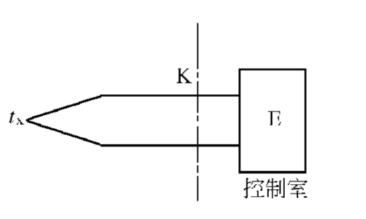

# 0300. 测量仪表与传感器

## 习题与思考题

1、什么叫测量过程？

2、何谓测量误差？测量误差的表示方法主要有哪两种？各是什么意义？

3、何谓仪表的相对百分误差和允许的相对百分误差？

4、何谓仪表的精度等级？

5、某一标尺为 0-1000℃ 的温度计出厂前经校验，其刻度标尺上的各点测量结果分别为：

求解：1）该温度计的最大绝对误差值；2）确定该温度计的精度等级。

6、如果有一台压力表，其测量范围为 0-10MPa，经校验得出下列数据：

表格

求解：1）求出该压力表的变差；2）问该压力表是否符合 1.0 级精度？

7、什么叫压カ？表压カ、绝对压カ、负压カ（真空度）之间有何关系？

8、为什么一般工业上的压力计做成测表压或真空度，而不做成测绝对压力的形式？

9、测压仪表有哪几类？各基于什么原理？

10、作为感受压力的弹性元件有哪几种？各有何特点？

11、弹管压力计的测压原理是什么？试述弹篑管压力计的主要组成及测压过程。

12、现有一压缩机气柜压力需要用电接点信号压力表控制在一定范围内，试画出控的原理线路图。

13、霍尔片式压力传感器是如何利用霍尔效应实现压力测量的？

14、应变片式与压阻式压力计各采用什么测压元件？

15、试筒述 DDZ-Ⅲ 型力矩平衡压力变送器的基本原理，它是如何实现负反馈作用的。

16、电容式压力传感器的工作原理是什么？有何特点？

17、试简述智能型变送器的组成及特点。

18、手持通信器在智能型变送器中起什么作用？

19、应变片式与压阻式压力计各采用什么测压元件？

20、电容式压力传感器的工作原理是什么？有何特点？

21、某压力表的测量范围为 0-1MPa，精度等级为 1 级，试问此压力表允许的最大绝对误差是多少？若用标准压力计来校验该压力表，在校验点为 0.5MPa 时，标准压力计上读数为 0.508MPa，试问被校压力表在这一点是否符合 1 级精度，为什么？

22、为什么测量仪表的测量范要根据测量大小来选取？选一台量程很大的仪表来测量很小的参数值有何问题？

23、如果某反应器最大压力为 0.8MPa，允许最大绝对误差为 0.01MPa。现用一台测量范围为 0-1.6MPa，精度为 1 级的压力表来进行测量，问能否符合艺上的误差要求？若采用一台量范围为 0-1.0MPa，精度为 1 级的压力表，问能符合误差要求吗？试说明其理由。

24、某台空压机的缓冲器，其工作压力范为 1.1-1.6MPa，工艺要求就地观察罐内压力，并要求测量结果的误差不得大于罐内压力的 ±5%，试选择一台合适的压力计（类型、测量范围、精度等级），并说明其理由。

25、某合成氨厂合成塔压力控制指标为 14MPa，要求误差不超过 0.4MPa，试选用一台就地指示的压力表（给出型号、测量范围、精度级）。

26、现有一合测量范围为 0-1.6MPa，精度为 1.5 级的普通弹簧管压力表，校验后，其结果为：

表格

试这合表合格否？它能否用于某空气贮罐的压力测量（该贮罐工作压力为 0.8-1.0MPa，测量的绝对误差不允许大于 0.05MPa）?

27、压力计安装要注意什么问题？

28、图 3-17（b）所示为什么能用来测量具有腐蚀性介质的压力？你能否设计另一种能隔离被测介质，防止腐蚀的测压方案？

29、试述化工生产中测量流量的意义、

30、什么叫节流现象？流体经节流装置时为什么会产生静压差？

31、试述差压式流量计测量流量的原理。并说明哪些因素对差压式流量计的流量测量有影响？

32、原来测量水的差压式流量计，现在用来测量相同测量范围的油的流量，读数是否正确？为什么？

33、什么叫标准节流装置？

34、为什么说转子流量计是定压降式流量计？而差压式流量计是变压降式流量计？

35、试述差动变压器传送位移量的基本原理。

36、试述电远传转子流量计的工作过程。它是依靠什么来平衡的？

37、当被测介质的密度、压力或温度变化时，转子流量计的指示值应如何修正？

38、用转子流量计来测气压为 0.65MPa、温度为 40℃ 的 CO2 气体的流量时，若已知流量计读数为 50L/s，求 CO2 的真实流量（已知 CO2 在标准状态时的密度为 1.977kg/m3）。

39、用水刻度的流量计，测量范围为 0-10L/min，转子用密度为 7920kg/m3 的不锈钢制成，若用来测量密度为 0.831kg/L 苯的流量，问测量范围为多少？若这时转子材料改为由密度为 2750kg/m3 的铝制成，这时用来测量水的流量及苯的流量，其测量范围各为多少？

40、椭圆齿轮流量计的工作原理是什么？为什么齿轮旋转一周能排出 4 个半月形容积的液体体积？

41、椭圆齿轮流量计的特点是什么？在使用中要注意什么问题？

42、涡轮流量计的工作原理及特点是什么？

43、电磁流量计的工作原理是什么？它对被测介质有什么要求？

44、试简述漩涡流量计的工作原理及其特点。

45、试简述漩涡频率的热敏检测法。

46、质量流量计有哪两大类。

47、试述物位测量的意义。

48、按工作原理不同，物位测量仪表有哪些主要类型？它们的工作原理各是什么？

49、差压式液位计的工作原理是什么？当测量有压容器的液位时，差压计的负压室为什么一定要与容器的气相相连接？

50、生产中欲连续测量液体的密度，根据已学的测量压力及液位的原理，试考虑一种利用差压原理来连续测量液体密度的方案。

51、有两种密度分别为 1、2 的液体，在容器中，它们的界面经常变化，试考能否利用差压变送器来连续测量其界面？测量界面时要注意什么问题？

52、什么是液位测量时的零点迁移问题？怎样进行迁移？其实质是什么？

53、正迁移和负迁移有什么不同？如何判断？

54、测量高温液体（指它的蒸汽在常温下要冷凝的情况）时，经常在负压管上装有冷凝罐（见图 3-78），问这时用差压变送器来测量液位时，要不要迁移？如要迁移，迁移量应如何考虑？

图 3-78 高温液体的液位测量

55、为什么要用法兰式差压变送器？

56、试述电容式物位计的工作原理。

57、试述核辐射物位计的特点及应用场合。

58、试述称重式液罐计量仪的工作原理及特点。

59、试述温度测量仪表的种类有哪些？各使用在什么场合？

60、热电偶的热电特性与哪些因素有关？

61、常用的热电偶有哪几种？所配用的补偿导线是什么？为什么要使用补偿导线？并说明使用补偿导线时要注意哪几点？

62、用热电偶测温时，为什么要进行冷端温度补偿？其冷端温度补偿的方法有哪几种？

63、试述热电偶温度计、热电阻温度计各包括哪些元件和仪表？输入、输出信号各是什么？

64、用 K 热电偶测某设备的温度，测得的热电勢为 20mV，冷端（室温）为 25℃，求设备的温度？如果改用 E 热电偶来测温，在相同的条件下，E 热电偶测得的热电勢为多少？

65、现用一支镍铬铜镍热电偶测某换器内的温度，其冷端温度为 30℃，显示仪表的机械零位在 0℃ 时，这时指示值为 400℃，则认为换热器内的温度为 430℃ 对不对？为什么？正确值为多少度？

66、测温系统如图 3-79 所示。请说出这是工业上用的哪种温度计？已知热电偶为 K，但错用与 E 配套的显示仪表，当仪表指示为 160℃ 时，请计算实际温度 tx 为多少度？（室温为 25℃)

67、试述热电阻测温原理？常用电阻的种类？R 各为多少？

68、热电偶的结构与热电阻的结构有什么异同之处？

69、用分度号 Pt100 铂电阻测温，在计算时错用了 Cu100 的分度表，査得的温度为 140℃，间实际温度为多少？

70、试述 DDZ-Ⅲ 型温度变送器的用途。

71、说明热电偶温度变送器、热电阻温度变送器的组成及主要异同点。

72、什么是一体化温度变送器？它有什么优点？

73、试述 AD693 构成的电偶温度变送器的基本组成。

74、试筒述 TT302 智能式温度变送器的主要特点及其基本组成。

75、试述测温元件的安装和布线的要求。

76、什么是软测量技术？

77、现代传感器技术发展的显著特征是什么？