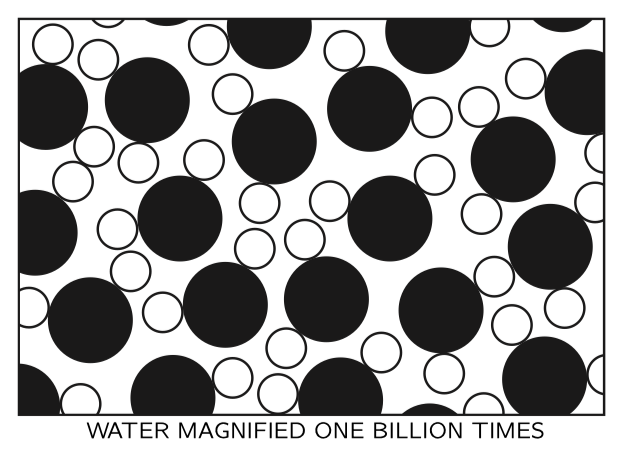
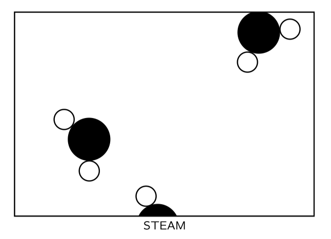
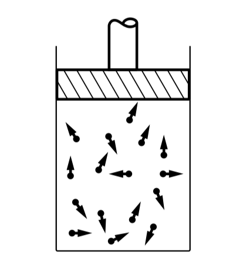
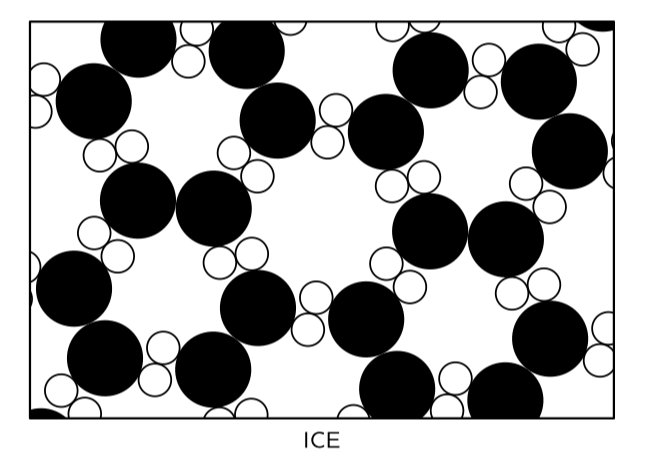
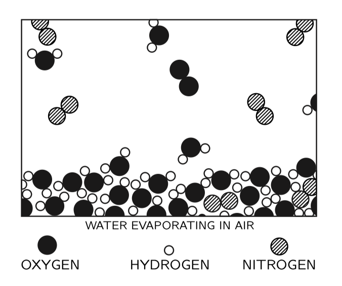
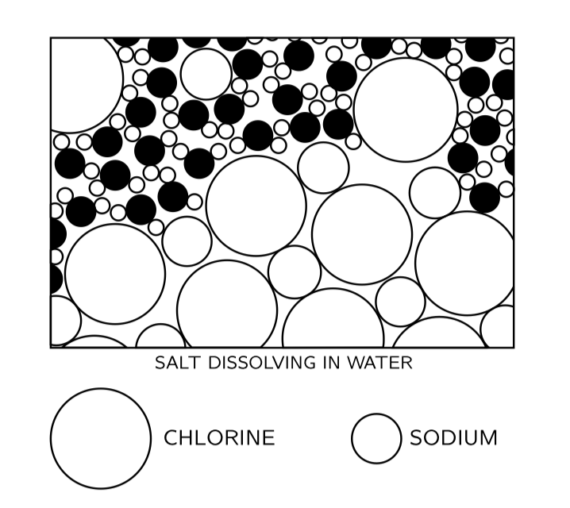
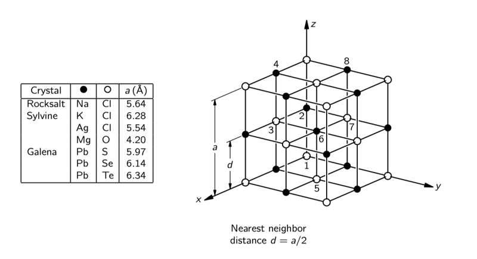
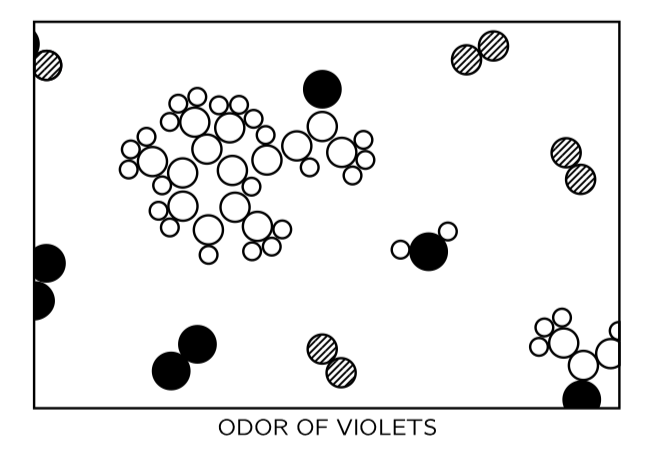
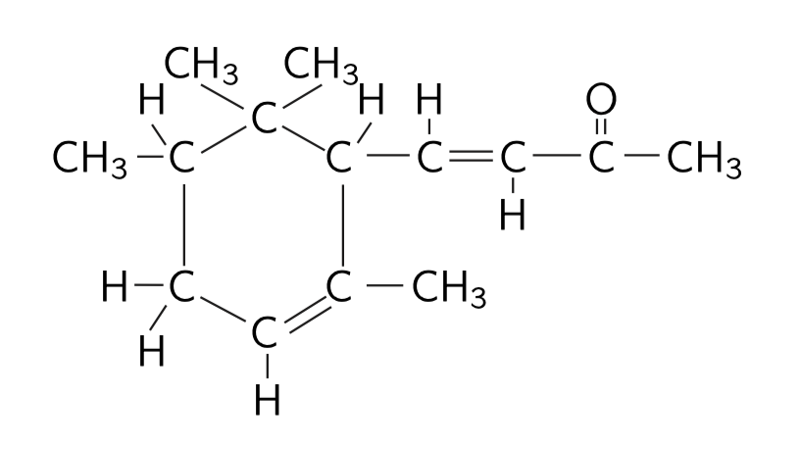

# 0101. Atoms in Motion

## 1.1 Introduction 

This two-year course in physics is presented from the point of view that you, the reader, are going to be a physicist. This is not necessarily the case of course, but that is what every professor in every subject assumes! If you are going to be a physicist, you will have a lot to study: two hundred years of the most rapidly developing field of knowledge that there is. So much knowledge, in fact, that you might think that you cannot learn all of it in four years, and truly you cannot; you will have to go to graduate school too!

Surprisingly enough, in spite of the tremendous amount of work that has been done for all this time it is possible to condense the enormous mass of results to a large extent — that is, to find laws which summarize all our knowledge. Even so, the laws are so hard to grasp that it is unfair to you to start exploring this tremendous subject without some kind of map or outline of the relationship of one part of the subject of science to another. Following these preliminary remarks, the first three chapters will therefore outline the relation of physics to the rest of the sciences, the relations of the sciences to each other, and the meaning of science, to help us develop a「feel」for the subject.

You might ask why we cannot teach physics by just giving the basic laws on page one and then showing how they work in all possible circumstances, as we do in Euclidean geometry, where we state the axioms and then make all sorts of deductions. (So, not satisfied to learn physics in four years, you want to learn it in four minutes?) We cannot do it in this way for two reasons. First, we do not yet know all the basic laws: there is an expanding frontier of ignorance. Second, the correct statement of the laws of physics involves some very unfamiliar ideas which require advanced mathematics for their description. Therefore, one needs a considerable amount of preparatory training even to learn what the words mean. No, it is not possible to do it that way. We can only do it piece by piece.

Each piece, or part, of the whole of nature is always merely an approximation to the complete truth, or the complete truth so far as we know it. In fact, everything we know is only some kind of approximation, because we know that we do not know all the laws as yet. Therefore, things must be learned only to be unlearned again or, more likely, to be corrected. The principle of science, the definition, almost, is the following: The test of all knowledge is experiment. Experiment is the sole judge of scientific「truth.」But what is the source of knowledge? Where do the laws that are to be tested come from? Experiment, itself, helps to produce these laws, in the sense that it gives us hints. But also needed is imagination to create from these hints the great generalizations — to guess at the wonderful, simple, but very strange patterns beneath them all, and then to experiment to check again whether we have made the right guess. This imagining process is so difficult that there is a division of labor in physics: there are theoretical physicists who imagine, deduce, and guess at new laws, but do not experiment; and then there are experimental physicists who experiment, imagine, deduce, and guess. We said that the laws of nature are approximate: that we first find the「wrong」ones, and then we find the「right」ones. Now, how can an experiment be「wrong」? First, in a trivial way: if something is wrong with the apparatus that you did not notice. But these things are easily fixed, and checked back and forth. So without snatching at such minor things, how can the results of an experiment be wrong? Only by being inaccurate. For example, the mass of an object never seems to change: a spinning top has the same weight as a still one. So a「law」was invented: mass is constant, independent of speed. That「law」is now found to be incorrect. Mass is found to increase with velocity, but appreciable increases require velocities near that of light. A true law is: if an object moves with a speed of less than one hundred miles a second the mass is constant to within one part in a million. In some such approximate form this is a correct law. So in practice one might think that the new law makes no significant difference. Well, yes and no. For ordinary speeds we can certainly forget it and use the simple constant-mass law as a good approximation. But for high speeds we are wrong, and the higher the speed, the more wrong we are.

Finally, and most interesting, philosophically we are completely wrong with the approximate law. Our entire picture of the world has to be altered even though the mass changes only by a little bit. This is a very peculiar thing about the philosophy, or the ideas, behind the laws. Even a very small effect sometimes requires profound changes in our ideas.

Now, what should we teach first? Should we teach the correct but unfamiliar law with its strange and difficult conceptual ideas, for example the theory of relativity, four-dimensional space-time, and so on? Or should we first teach the simple「constant-mass」law, which is only approximate, but does not involve such difficult ideas? The first is more exciting, more wonderful, and more fun, but the second is easier to get at first, and is a first step to a real understanding of the first idea. This point arises again and again in teaching physics. At different times we shall have to resolve it in different ways, but at each stage it is worth learning what is now known, how accurate it is, how it fits into everything else, and how it may be changed when we learn more.

Let us now proceed with our outline, or general map, of our understanding of science today (in particular, physics, but also of other sciences on the periphery), so that when we later concentrate on some particular point we will have some idea of the background, why that particular point is interesting, and how it fits into the big structure. So, what is our over-all picture of the world?

1-1 引言

这是一门两学年的物理课，我们开设这门课程是着眼于你们，读者们，将成为物理学工作者。当然，情况并非一定如此，但是每门学科的教授都是这样设想的：假如你打算成为个物理学工作者，就要学习很多东西；这是一个 200 年以来空前勃发展的知识领域。事实上，你会想到，这么多的知识是不可能在四年内学完的，确实不可能；你们还得到研究院去继续学习。

相当出人意外的是，尽管在这么长时间中做了极其大量的工作，但却有可能把这一大堆成果大大地加以浓缩。这就是说，找到一些概括我们所有知识的定律。不过，即使如此，掌握这些定律也是颇为困难的。因此，在你对科学的这部分与那部分题材之间的关系还没有一个大致的了解之前，就让你去钻研这个庞大的课题的话，就不公平了。根据这种法：前三章将略述物理学与其他科学的关系，各门学科之间的相互联系以及科学的含义，这有助于你们对本学科产生一种切身的感受。

你们可能会问，在讲欧几里德几何时，先是陈述公理，然后作出各种各样的推论，那为什么在讲授物理学时不能先直截了当地列出基本定律，然后再就一切可能的情况说明定律的应用呢？（这样一来，如果你不满足于要花四年时间来学习物理，那你是否打算在 4 分钟内学完它？）我们不能这样做是由于两个理由。第一，我们还不知道所有的基本定律：未知领域的边界在不断地扩展。第二，正确地叙述物理定律要涉及到一些非常陌生的概念，而叙述这些概念又要用到高等数学。因此，即使为了知道词的含义，也需要大量的预备性的训练的确，那样做是行不通的，我们只能一步一步地来。

大自然整体的每一部分始终只不过是对于整个真理一或者说，对于我们至今所了解的整个真理 一一 的逼近。实际上，人们知道的每件事都只是某种近似，因为我们懂得，到目前为止，我们确实还不知道所有的定律，因此，我们之所以需要学习一些东西，正是为了要抛弃以前的谬见，或者更可能的是为了改正以前的谬见。

科学的原则 —— 或者简直可称为科学的定义为：实验是一切知识的试金石。实验是科学「真理」的唯一鉴定者。但是什么是知识的源泉呢？那些要检验的定律又是从何而来的呢？从某种意义上说，实验为我们提供了种种线索，因此可以说是实验本身促成了这些定律的产生。但是，要从这些线索中作出重大的判断，还需要有丰富的想象力去对蕴藏在所有这些线索后面的令人惊讶、简单、而又非常奇特的图象进行猜测，然后，再用实验来验证我们的猜测究竟对不对。这个想象过程是很艰难的，因此在物理学中有所分工，理论物理学家进行想象、推演和猜测新的定律，但并不做实验；而实验物理学家则进行实验、想象、推演和猜测。

我们说过，自然的定律是近似的：起先我们找到的是「错」的定律，然后オ发现「对」的定律。那么，一个实验怎么可能是「错误」的呢？首先，通常是：仪器上有些毛病，而你又没有注意，但是这种问题是容易确定的，可以反复检查。如果不去纠缠在这种次要的问题上，那么实验的结果怎么可能是错误的呢？这只可能是由于不够精确罢了。

例如，一个物体的质量似乎是从来不变的：转动的陀螺与静止的陀螺一样重。结果就发现了一条「定律」：质量是个常数，与速率无关。然而现在发现这条「定律」却是不正确的。质量实际上随着速度的加大而增加，但是要速度接近于光速，才会显著增加。正确的定律是：如果一个物体的速率小于 100 海里 / 秒，那么它的质量的变化不超过百万分之一，在这种近似形式下，这就是一条正确的定律。因此，人们可能认为新的定律实际上并没有什么有意义的差别。当然，这可以说对，也可以说不对。对于一般的速率我们当然可以忘掉它，而用简单的质量守恒定律作为一种很好的近似。但是对于高速情况这就不正确了：速率越高，就越不正确。

最后，最有趣的是，就哲学上而言，使用近似的定律是完全错误的。纵然质量的变化只是一点点，我们的整个世界图景也得改变。这是有关在定律后面的哲学或基本观念的一件十分特殊的事。即使是极小的效应有时在我们的观念上也要引起深刻的变化。

那么，我们应该首先教什么呢？是否应先教那些正确的、陌生的定律以及有关的奇特而困难的观念，例如相对论，四维时空等等之类？还是应先教简单的「质量守恒」定律，即那条虽然只是近似的，但并不包含那种困难的观念的定律？前一条定律比较引人入胜，比较奇特和比较有趣，但是后一条定律在开姈时比较容易掌握，它是真正理解前一种观念的第一步。这个问题在物理教学中会一再出现，在不同的时候，我们将要用不同的方式去解决它。但是在每个阶段都值得去弄明白：我们现在所知道的是什么，它的正确性如何，它怎样适应其他各种事情，以及当我们进一步学习后它会有怎样的变化。

让我们按照我们所理解的当代科学（特别是物理学，但是也包括周围有关的其他科学）的轮廓继续讲下去，这样，当我们以后专门注意某些特殊问题时，就会对于背景情况有所了解 —— 为什么这些特殊问题是有趣的，它们又是怎样适应整体结构的。那么，我们世界的总体图象是怎样的呢？

## 1.2 Matter is made of atoms 

If, in some cataclysm, all of scientific knowledge were to be destroyed, and only one sentence passed on to the next generations of creatures, what statement would contain the most information in the fewest words? I believe it is the atomic hypothesis (or the atomic fact, or whatever you wish to call it) that all things are made of atoms — little particles that move around in perpetual motion, attracting each other when they are a little distance apart, but repelling upon being squeezed into one another. In that one sentence, you will see, there is an enormous amount of information about the world, if just a little imagination and thinking are applied. To illustrate the power of the atomic idea, suppose that we have a drop of water a quarter of an inch on the side. If we look at it very closely we see nothing but water — smooth, continuous water. Even if we magnify it with the best optical microscope available — roughly two thousand times — then the water drop will be roughly forty feet across, about as big as a large room, and if we looked rather closely, we would still see relatively smooth water — but here and there small football-shaped things swimming back and forth. Very interesting. These are paramecia. You may stop at this point and get so curious about the paramecia with their wiggling cilia and twisting bodies that you go no further, except perhaps to magnify the paramecia still more and see inside. 

Figure 1-1

This, of course, is a subject for biology, but for the present we pass on and look still more closely at the water material itself, magnifying it two thousand times again. Now the drop of water extends about fifteen miles across, and if we look very closely at it we see a kind of teeming, something which no longer has a smooth appearance — it looks something like a crowd at a football game as seen from a very great distance. In order to see what this teeming is about, we will magnify it another two hundred and fifty times and we will see something similar to what is shown in Fig. 1-1. This is a picture of water magnified a billion times, but idealized in several ways. In the first place, the particles are drawn in a simple manner with sharp edges, which is inaccurate. Secondly, for simplicity, they are sketched almost schematically in a two-dimensional arrangement, but of course they are moving around in three dimensions. Notice that there are two kinds of「blobs」or circles to represent the atoms of oxygen (black) and hydrogen (white), and that each oxygen has two hydrogens tied to it. (Each little group of an oxygen with its two hydrogens is called a molecule.) The picture is idealized further in that the real particles in nature are continually jiggling and bouncing, turning and twisting around one another. You will have to imagine this as a dynamic rather than a static picture. Another thing that cannot be illustrated in a drawing is the fact that the particles are「stuck together」 — that they attract each other, this one pulled by that one, etc. The whole group is「glued together,」so to speak. On the other hand, the particles do not squeeze through each other. If you try to squeeze two of them too close together, they repel.

The atoms are 1 or 2×10−8 cm in radius. Now 10−8 cm is called an angstrom (just as another name), so we say they are 1 or 2 angstroms (Å) in radius. Another way to remember their size is this: if an apple is magnified to the size of the earth, then the atoms in the apple are approximately the size of the original apple.

Now imagine this great drop of water with all of these jiggling particles stuck together and tagging along with each other. The water keeps its volume; it does not fall apart, because of the attraction of the molecules for each other. If the drop is on a slope, where it can move from one place to another, the water will flow, but it does not just disappear — things do not just fly apart — because of the molecular attraction. Now the jiggling motion is what we represent as heat: when we increase the temperature, we increase the motion. If we heat the water, the jiggling increases and the volume between the atoms increases, and if the heating continues there comes a time when the pull between the molecules is not enough to hold them together and they do fly apart and become separated from one another. Of course, this is how we manufacture steam out of water — by increasing the temperature; the particles fly apart because of the increased motion.

Figure 1-2 steam

In Fig. 1-2 we have a picture of steam. This picture of steam fails in one respect: at ordinary atmospheric pressure there certainly would not be as many as three water molecules in this figure. Most squares this size would contain none — but we accidentally have two and a half or three in the picture (just so it would not be completely blank). Now in the case of steam we see the characteristic molecules more clearly than in the case of water. For simplicity, the molecules are drawn so that there is a 120◦ angle between the hydrogen atoms. In actual fact the angle is 105◦30, and the distance between the center of a hydrogen and the center of the oxygen is 0.957 Å, so we know this molecule very well.

Let us see what some of the properties of steam vapor or any other gas are. The molecules, being separated from one another, will bounce against the walls. Imagine a room with a number of tennis balls (a hundred or so) bouncing around in perpetual motion. When they bombard the wall, this pushes the wall away.

Figure 1-3

(Of course we would have to push the wall back.) This means that the gas exerts a jittery force which our coarse senses (not being ourselves magnified a billion times) feel only as an average push. In order to confine a gas we must apply a pressure. Figure 1-3 shows a standard vessel for holding gases (used in all textbooks), a cylinder with a piston in it. Now, it makes no difference what the shapes of water molecules are, so for simplicity we shall draw them as tennis balls or little dots. These things are in perpetual motion in all directions. So many of them are hitting the top piston all the time that to keep it from being patiently knocked out of the tank by this continuous banging, we shall have to hold the piston down by a certain force, which we call the pressure (really, the pressure times the area is the force). Clearly, the force is proportional to the area, for if we increase the area but keep the number of molecules per cubic centimeter the same, we increase the number of collisions with the piston in the same proportion as the area was increased.

Now let us put twice as many molecules in this tank, so as to double the density, and let them have the same speed, i.e., the same temperature. Then, to a close approximation, the number of collisions will be doubled, and since each will be just as「energetic」as before, the pressure is proportional to the density. If we consider the true nature of the forces between the atoms, we would expect a slight decrease in pressure because of the attraction between the atoms, and a slight increase because of the finite volume they occupy. Nevertheless, to an excellent approximation, if the density is low enough that there are not many atoms, the pressure is proportional to the density.

We can also see something else: If we increase the temperature without changing the density of the gas, i.e., if we increase the speed of the atoms, what is going to happen to the pressure? Well, the atoms hit harder because they are moving faster, and in addition they hit more often, so the pressure increases. You see how simple the ideas of atomic theory are.

Let us consider another situation. Suppose that the piston moves inward, so that the atoms are slowly compressed into a smaller space. What happens when an atom hits the moving piston? Evidently it picks up speed from the collision. You can try it by bouncing a ping-pong ball from a forward-moving paddle, for example, and you will find that it comes off with more speed than that with which it struck. (Special example: if an atom happens to be standing still and the piston hits it, it will certainly move.) So the atoms are「hotter」when they come away from the piston than they were before they struck it. Therefore all the atoms which are in the vessel will have picked up speed. This means that when we compress a gas slowly, the temperature of the gas increases. So, under slow compression, a gas will increase in temperature, and under slow expansion it will decrease in temperature. We now return to our drop of water and look in another direction. Suppose that we decrease the temperature of our drop of water. Suppose that the jiggling of the molecules of the atoms in the water is steadily decreasing. We know that there are forces of attraction between the atoms, so that after a while they will not be able to jiggle so well. What will happen at very low temperatures is indicated in Fig. 1-4: the molecules lock into a new pattern which is ice. This particular schematic diagram of ice is wrong because it is in two dimensions, but it is right qualitatively. The interesting point is that the material has a definite place for every atom, and you can easily appreciate that if somehow or other we were to hold all the atoms at one end of the drop in a certain arrangement, each atom in a certain place, then because of the structure of interconnections, which is rigid, the other end miles away (at our magnified scale) will have a definite location. So if we hold a needle of ice at one end, the other end resists our pushing it aside, unlike the case of water, in which the structure is broken down because of the increased jiggling so that the atoms all move around in different ways. The difference between solids and liquids is, then, that in a solid the atoms are arranged in some kind of an array, called a crystalline array, and they do not have a random position at long distances; the position of the atoms on one side of the crystal is determined by that of other atoms millions of atoms away on the other side of the crystal. Figure 1-4 is an invented arrangement for ice, and although it contains many of the correct features of ice, it is not the true arrangement. One of the correct features is that there is a part of the symmetry that is hexagonal. You can see that if we turn the picture around an axis by 60◦, the picture returns to itself. So there is a symmetry in the ice which accounts for the six-sided appearance of snowflakes. Another thing we can see from Fig. 1-4 is why ice shrinks when it melts. The particular crystal pattern of ice shown here has many「holes」in it, as does the true ice structure. When the organization breaks down, these holes can be occupied by molecules. Most simple substances, with the exception of water and type metal, expand upon melting, because the atoms are closely packed in the solid crystal and upon melting need more room to jiggle around, but an open structure collapses, as in the case of water.

Figure 1-4

Now although ice has a「rigid」crystalline form, its temperature can change —  ice has heat. If we wish, we can change the amount of heat. What is the heat in the case of ice? The atoms are not standing still. They are jiggling and vibrating. So even though there is a definite order to the crystal — a definite structure — all of the atoms are vibrating「in place.」As we increase the temperature, they vibrate with greater and greater amplitude, until they shake themselves out of place. We call this melting. As we decrease the temperature, the vibration decreases and decreases until, at absolute zero, there is a minimum amount of vibration that the atoms can have, but not zero. This minimum amount of motion that atoms can have is not enough to melt a substance, with one exception: helium. Helium merely decreases the atomic motions as much as it can, but even at absolute zero there is still enough motion to keep it from freezing. Helium, even at absolute zero, does not freeze, unless the pressure is made so great as to make the atoms squash together. If we increase the pressure, we can make it solidify.

1-2 物质是原子构成的

假如由于某种大灾难，所有的科学知识都丢失了，只有一句话传给下一代，那么怎样才能用最少的词汇来表达最多的信息呢？我相信这句话是原子的假设（或者说原子的事实，无论你愿意怎样称呼都行）：所有的物体都是用原子构成的 一一 这些原子是一些小小的粒子，它们一直不停地运动着。当彼此略微离开时相互吸引，当彼此过于挤紧时又互相排斥。只要稍微想一下，你就会发现，在这一句话中包含了大量的有关世界的信息。

为了说明原子观念的重要作用，假设有一滴直径为 1/4 英寸的水滴，即使我们非常贴近地观察，也只能见到光滑的、连续的水，而没有任何其他东西。并且即使我们用最好的光学显微憶（大致可放大 2000 倍）把这滴水放大到 40 英尺左右（相当于个大房间那样大），然后再靠得相当近地去观察，我们所看到的仍然是比较光滑的水，不过到处有一些足球状的东西在来回游动，非常有趣。这些东西是草履虫，你们可能就到此为止，对草履虫以及它的摆动的纤毛和卷曲的身体感到十分好奇。也许除了把草履虫放得更大些，看看它的内部外，就不再进一步观察了。当然这是生物学的课题，但是现在我们继续观察下去，再把水放大 200 倍更接近地观察水这种物质本身。这时，水滴已放大到有 15 英里那样大了，如果你再十分贴近地观察，你将看到水中充满了某种不再具有光滑外表的东，而是有些象从远处看过去挤在足球场上的人群。为了能看出挤满的究竟是些什么东西，我们再把它放大 250 倍后就会看到某种类似于图 1-1 所示的情形。

这是放大了 10 亿倍的水的图象，但是在以下这几方面是理想化了的首先，各种粒子用简单的方式画成有明显的边缘，这是不精确的。其次，为了简便起见，把它们都画成二维的排列，实际上它们当然是在三维空间中运动的。注意在图中有两类「斑点」或圆，它们各表示氧原子（黑色）和氢原子（白色），而每个氧原子有两个氢原子和它联结在一起（一个氧原子与两个氢原子组成的一个小组称为一个分子）。图象中还有个被理想化的地方是自然界中的真实粒子总是在不停地跳动，彼此绕来绕去地转着，因而你必须把这幅画面想象成能动的而不是静止的。另一件不能在图上说明的事实是粒子为「粘在一起」的，它们彼此吸引着，这个被那个拉住等等，可以说，整个一群「胶合在一起」。另一方面，这些粒子也不是挤到一块儿，如果你把两个粒子挤得很紧，它们就互相推斥。

原子的半径约为 1-2x10^-8 厘米，10^-8 厘米现在称为 1A（这只是另一个名称），所以我们说原子的半径为 1-2A。另一个记住原子大小的方法是这样的：如果把苹果放大到地球那样大，那么苹果中的原子就差不多有原来的苹果那样大。

1-2『上面对原子尺寸的比喻真贴切，一下子有了感性认知，费曼 NB 就 NB 在这一点上，他总是能给你举一些很贴切的例子把高深的东西讲的特别通俗。做一张信息数据卡片。』——已完成

现在，想象这个大水滴是由所有这些跳动的粒子一个挨一个地「粘合」起来的，水能保持一定的体积而并不散开，因为它的分子彼此吸引。如果水滴在一个斜面上，它能从一个位置移动到另一个位置。水会流动，但是并不会消失 一一 它们并没有飞逝，因为分子之间有吸引力。这种跳动就是我们所说的热运动。当温度升高时这种运动就增强了。如果我们加热水滴，跳动就增加，原子之间的空隙也增大。如果继续加热到分子间的引力不足以将彼此拉住时，它们就分开来飞散了。当然，这正是我们从水制取水蒸气的方法 —— 提高温度。粒子由于运动的增强而飞散。

图 1-2 是一幅水蒸气的图象。这张水蒸气图象有一个不足之处：在通常的气压下在整个房间里只有少数几个分子。决不可能在这样一张图象中有三个以上的分子。在大多数情况下，这样大小的方块中可能连一个都不会有 一一 不过碰巧在这张图中有两个半或三个分子（只有这样图象才不会是完全空白的）。现在，比起水来，在水蒸气的情况下，我们可以更清楚地看到水所特有的分子。为了简单起见，将分子画成具有 120° 的夹角，实际上，这个角是 105°3'，氢原子中心与氧原子中心之间的距离是 0.957A。这样看来，我们对这个分子了解得很清楚了。

让我们来看一下，水蒸气或任何其他气体具有一些什么性质。这些气体分子是彼此分离的，它们打在墙上时，会反弹回来。设想在一个房间里有一些网球（100 个左右）不断地来回跳动，当它们打到墙上后，就将墙推离原位（当然，我们必须将墙推回去）。这意味着，气体施加一个「颤动」的力，而我们的粗糙的感官（并没有被我们自己放大十亿倍）只感到一个平均的推力。为了把气体限制在一定的范围之内，我们必须施加一个压力。图 1-3 是一个盛气体的标准容器（所有教科书中都有这种图），一个配有活塞的汽缸，由于不论水分子的形状如何，情况都是一样，因此为简单起见，我们把它们画成网球形状或者小黑点。这些东西沿着所有的方向不停地运动着。由于有这么多的气体分子一直在撞击顶端的活塞，因此要使活塞不被这不断的碰撞逐渐顶出来必须施加一定的力把活塞下去，这个力称为压力（实际上，是压强乘以面积）。很清楚，这个力正比于面积，因为如果我们增大面积而保持每立方厘米内的分子数不变的话，那么分子与活塞碰撞次数增加的比例与面积增加的比例是相同的。

现在，让我们在这个容器内放入两倍的分子，以使密度增加一，同时让它们具有同样的速度，即相同的温度。那么，作为一种很好的近似，碰撞的次数也将增加一倍，由于每次碰撞仍然和先前那样「有力」，压力就正比于密度。如果我们考虑到原子之间的力的真实性质，那么由于原子之间的吸引，可以预期压力略有减少；而由于原子也占有有限的体积，则可以预期压力略有增加。无论如何，作为一个很好的近似，如果原子较少，密度足够低，那么，压力正比于密度。

我们还可以看一下其他情况。如果提高温度而不改变气体密度，亦即只增加原子的速度，那么在压力上会出现什么情况？当然，原子将撞击得更剧烈一些，因为它们运动得更快一些，此外，它们的碰撞更频繁了，因此压力将增加，你们看，原子理论的概念是多么简单！

我们来考虑另一种情况，假定活塞向下移动，原子就慢慢地被压缩在一个较小的空间里。当原子碰到运动着的活塞时，会发生什么情况呢？很显然，原子由于碰撞而提高了速率，例如，你可以试一下乒乓球从一个朝前运动的球拍弹回来时的情况，你会发现弹回的速率比打到球拍上的速率更大些（一个特例是：如果一个原子恰好静止不动，那么在活塞碰上它以后，当然就运动了）。这样原子在弹离活塞时比碰上去之前更「热」。因此所有容器中的分子的速率都提高了。这意味着，当我们缓慢压缩气体时，气体的温度会升高。结果，在慢压缩时，气体的温度将升高；而在缓慢膨胀时，气体的温度将降低。

现在回到我们的那滴水上去，从另一个角度去观察一下。假定现在降低水滴的温度，并且假定水的原子、分子的跳动逐渐减小。我们知道在原子之间存在着引力，因而过一会儿，它们就不能再跳得那么厉害了。图 1-4 表示在很低的温度下会出现什么样的情况。这时分子连接成一种新的图象，这就是冰。这个特殊的冰的图象是不正确的，因为它只是二维的，但是它在定性上是正确的。有趣的一点是，对于每一个原子，都有它的确定位置。你们可以很容易地设想，如果我们用某种方式使冰粒一端的所有的原子按一定的方式排列，并让每个原子处在一定的位置上，那么由于互相连接的结构很牢固，几英里之外（在我们放大的比例下）的另一端也将有确定的位置。如果们抓住一根冰棍的一端，另一端就会阻止我们把它拉出去，这种情况不象水那样由于跳动加强以致所有的原子以种种方式到处跑来跑去，因而结构也就被破坏了。

固体与液体的差别就在于：在固体中，原子以某种称为晶体排列的方式排列着，即使在较长的距离上它们的位置也不能杂乱无章。晶体一端的原子位置取决于晶体另一端的与之相距千百万个原子的排列位置。图 1-4 是一种虚构的冰的排列状况，它虽然包括了冰的许多正确的特征，但并不是真实的排列情况。正确的特征之一是这里具有一种六边形的对称性。你们可以看到：如果把画面绕一根轴转动 120° 的话，它仍然回到原来的形状，因此，在冰里存在着一定的对称性，这说明为什么雪花具有六边形的外表。从图 1-4 中还可以看到为什么冰融解时会缩小。在这里列出的冰的晶体图样中有许多「孔」，真实的冰的结构也是如此，在排列打散后，这些孔就可以容纳分子。除水和活字合金外，许多简单的物质在融解时都要膨胀，因为在固体的晶体结构中，原子是密集堆积的，而当熔解时，需要有更多的空间供原子活动，但是开放结构则会倒坍，体积反而收缩了，就象水的情况那样。

虽然冰有一种「刚性的」结晶形态，它的温度也会变化 —— 冰也储存热量，如果我们愿意的语，就可以改变热量的储存。对冰来说，这种热量指的是什么呢？冰的原子并不是静止不动的，它们不断地摇晃着、振动着，所以虽然晶体存在着一种确定的次序 —— 一种确定的结构，所有的原子仍都「在适当的位置」上振动，当我们提高温度时，它们振动的幅度就越来越大，直到离开原来的位置为止。我们把这个过程称为熔解，当降低温度时，振动的幅度越来越小，直到绝对零度原子仍能有最低限度的振动，而不是停止振动。原子所具有的这种最低的振动不足以使物质熔解，只有一个例外，即氦。在温度降低时，原子的运动只是尽可能地弱，但即使在绝对零度时也有足够的运动使之不致于凝固，除非把压力加得这样大，以致将原子都挤在一起。如果我们提高压力，就可以使它凝固。

## 1.3 Atomic processes 

Figure 1-5

So much for the description of solids, liquids, and gases from the atomic point of view. However, the atomic hypothesis also describes processes, and so we shall now look at a number of processes from an atomic standpoint. The first process that we shall look at is associated with the surface of the water. What happens at the surface of the water? We shall now make the picture more complicated — and more realistic — by imagining that the surface is in air. Figure 1-5 shows the surface of water in air. We see the water molecules as before, forming a body of liquid water, but now we also see the surface of the water. Above the surface we find a number of things: First of all there are water molecules, as in steam. This is water vapor, which is always found above liquid water. (There is an equilibrium between the steam vapor and the water which will be described later.) In addition we find some other molecules — here two oxygen atoms stuck together by themselves, forming an oxygen molecule, there two nitrogen atoms also stuck together to make a nitrogen molecule. Air consists almost entirely of nitrogen, oxygen, some water vapor, and lesser amounts of carbon dioxide, argon, and other things. So above the water surface is the air, a gas, containing some water vapor. Now what is happening in this picture? The molecules in the water are always jiggling around. From time to time, one on the surface happens to be hit a little harder than usual, and gets knocked away. It is hard to see that happening in the picture because it is a still picture. But we can imagine that one molecule near the surface has just been hit and is flying out, or perhaps another one has been hit and is flying out. Thus, molecule by molecule, the water disappears — it evaporates. But if we close the vessel above, after a while we shall find a large number of molecules of water amongst the air molecules. From time to time, one of these vapor molecules comes flying down to the water and gets stuck again. So we see that what looks like a dead, uninteresting thing — a glass of water with a cover, that has been sitting there for perhaps twenty years — really contains a dynamic and interesting phenomenon which is going on all the time. To our eyes, our crude eyes, nothing is changing, but if we could see it a billion times magnified, we would see that from its own point of view it is always changing: molecules are leaving the surface, molecules are coming back.

Why do we see no change? Because just as many molecules are leaving as are coming back! In the long run「nothing happens.」If we then take the top of the vessel off and blow the moist air away, replacing it with dry air, then the number of molecules leaving is just the same as it was before, because this depends on the jiggling of the water, but the number coming back is greatly reduced because there are so many fewer water molecules above the water. Therefore there are more going out than coming in, and the water evaporates. Hence, if you wish to evaporate water turn on the fan!

Here is something else: Which molecules leave? When a molecule leaves it is due to an accidental, extra accumulation of a little bit more than ordinary energy, which it needs if it is to break away from the attractions of its neighbors. Therefore, since those that leave have more energy than the average, the ones that are left have less average motion than they had before. So the liquid gradually cools if it evaporates. Of course, when a molecule of vapor comes from the air to the water below there is a sudden great attraction as the molecule approaches the surface. This speeds up the incoming molecule and results in generation of heat. So when they leave they take away heat; when they come back they generate heat. Of course when there is no net evaporation the result is nothing — the water is not changing temperature. If we blow on the water so as to maintain a continuous preponderance in the number evaporating, then the water is cooled. Hence, blow on soup to cool it!

Of course you should realize that the processes just described are more complicated than we have indicated. Not only does the water go into the air, but also, from time to time, one of the oxygen or nitrogen molecules will come in and「get lost」in the mass of water molecules, and work its way into the water. Thus the air dissolves in the water; oxygen and nitrogen molecules will work their way into the water and the water will contain air. If we suddenly take the air away from the vessel, then the air molecules will leave more rapidly than they come in, and in doing so will make bubbles. This is very bad for divers, as you may know. Now we go on to another process. In Fig. 1-6 we see, from an atomic point of view, a solid dissolving in water. If we put a crystal of salt in the water, what will happen? Salt is a solid, a crystal, an organized arrangement of「salt atoms.」

Figure 1-6

Figure 1-7 is an illustration of the three-dimensional structure of common salt, sodium chloride. Strictly speaking, the crystal is not made of atoms, but of what we call ions. An ion is an atom which either has a few extra electrons or has lost a few electrons. In a salt crystal we find chlorine ions (chlorine atoms with an extra electron) and sodium ions (sodium atoms with one electron missing). The ions all stick together by electrical attraction in the solid salt, but when we put them in the water we find, because of the attractions of the negative oxygen and positive hydrogen for the ions, that some of the ions jiggle loose. In Fig. 1-6 we see a chlorine ion getting loose, and other atoms floating in the water in the form of ions. This picture was made with some care. Notice, for example, that the hydrogen ends of the water molecules are more likely to be near the chlorine ion,

Figure 1-7

while near the sodium ion we are more likely to find the oxygen end, because the sodium is positive and the oxygen end of the water is negative, and they attract electrically. Can we tell from this picture whether the salt is dissolving in water or crystallizing out of water? Of course we cannot tell, because while some of the atoms are leaving the crystal other atoms are rejoining it. The process is a dynamic one, just as in the case of evaporation, and it depends on whether there is more or less salt in the water than the amount needed for equilibrium. By equilibrium we mean that situation in which the rate at which atoms are leaving just matches the rate at which they are coming back. If there is almost no salt in the water, more atoms leave than return, and the salt dissolves. If, on the other hand, there are too many「salt atoms,」more return than leave, and the salt is crystallizing.

In passing, we mention that the concept of a molecule of a substance is only approximate and exists only for a certain class of substances. It is clear in the case of water that the three atoms are actually stuck together. It is not so clear in the case of sodium chloride in the solid. There is just an arrangement of sodium and chlorine ions in a cubic pattern. There is no natural way to group them as「molecules of salt.」

Returning to our discussion of solution and precipitation, if we increase the temperature of the salt solution, then the rate at which atoms are taken away is increased, and so is the rate at which atoms are brought back. It turns out to be very difficult, in general, to predict which way it is going to go, whether more or less of the solid will dissolve. Most substances dissolve more, but some substances dissolve less, as the temperature increases.

1-3 原子过程

关于从原子的观点来描固体、液体和气体，我们就讲到这里。然而原子的假设也可以描写过程，所以我们现在从原子的观点来考察一些过程。

我们要考察的第一个过程与水的表面有关。在水的表面有些什么情况呢？设想水的表面上是空气，现在我们来把图画得更复杂一些 —— 也更实际一些，如图 1-5 所示。我们看到，水分子仍然象先前那样，组成大量的水，但现在还看到水的表面。在水面上我们发现一些东西：首先，水面上有水的分子，这就是水的蒸气，在水面上总是有水蒸气的（在水蒸气与水之间存在着一种平衡，这种平衡我们以后再讲。) 此外，我们还发现一些别的分子：这里是两个氧原子彼此结合在一起组成一个氧分子，那里是两个氮原子结合在一起组成一个氮分子。空气几乎完全是由氮气、氧气、水蒸气组成的，此外还有少量的二氧化碳、氩气和其他一些气体。所以在水面上的是含有一些水蒸气的气体。那么，在这种情况下会发生什么事呢？

水里的分子不断地晃来晃去。有时，在水面上有个别分子碰巧受到比通常情况下更大的冲击而被「踢」出表面。因为图 1-5 是静止的画面，所以在图上难以看出所发生的。但是我们可以想象表面附近的某一个分子刚好受到碰撞而飞了出去，或者也许另一个分子也受到碰撞而飞了出去。分子一个接着一个地跑了出去，水就消失了 —— 蒸发了。但是如果把容器盖上，过了会儿就会发现在空气分子中有大量的水分子。水蒸气的分子不时地飞到水面，又回到水中。结果，我们看到那个看来死气沉沉的、无趣的事情 一一 一杯盖上的可能已放了二十年的水 —— 实在包含了一直生气勃勃而有趣的现象。对我们这双肉眼而言，看不出有任何变化，但是如果能放大十亿倍来看的话，我们就能发现情况一直在变化：一些分子离开水面，又些分子则回到了水面。

为什么我们看不出变化呢？因为有多少分子离开水面就会有多少分子回到水面！归根到底「没有任何事情发生」如果现在我们把容器盖打开，使潮湿的空气吹走而代之以干燥空气，那么离开水面的分子数还是如先前那样多，因为这只取决于水分子晃动的程度，但是回到水面的分子数则大大地滅少了，因为在水面上的水分子数已极其稀少。因此逸出水面的分子比进入水面的分子多，水就蒸发了。所以，如果你要使水蒸发的话，就打开风扇吧！

这里还有另一件事情：哪些分子会离开？一个分子能离开水面是由于它偶然比通常情况稍微多积累了一些能量，这样才能使它摆脱邻近分子的吸引。结果，由于离开水面的分子带走的能量比平均能量大，留在水中的分子的运动平均起来就比先前减弱。因此液体蒸发时会逐渐冷却。当然，当一个水蒸气分子从空气中跑向水面时，它一靠近水面就要突然受到一个很强的吸引。这就使它进入水中时具有更大的速度，结果就产生热量。所以当水分子离开水面时，它们带走了热量；而当它们回到水面时，则产生了热量。当然，如果不存在净的蒸发现象的话，什么结果也不会发生 —— 水的温度并不改变。如果我们向水面上吹风，使蒸发的分子数一直占优势，水就会冷却。因此，要使汤冷却就得不停地吹！

1-2『液体蒸发会导致冷却，费曼这个视角的解释太 NB 了，做一张信息数据卡片。』——已完成

当然，你们应当了解，刚才所说的那个过程实际上要比我们所指出的更为复杂。不仅水分子进入空气，不时还有氧分子或氮分子跑到水里，「消失」在一大堆水分子中，这样空气就溶解在水中了：氧和氮的分子进入水中，水里就含有空气。如果我们突然从容器中抽走空气，那么空气分子出来要比进去来得快，这样就形成了气泡，你们可能知道，这对潜水员是很不利的。

现在我们来考虑另一种过程。在图 1-6 中，我们从原子的观点来看固体在水中溶解。如果我们把结晶盐粒丢入水中，会出现什么情况呢？食盐是一种固体，也是一种晶体，并且是「食盐原子」的有规则的排列，图 1-7 是普通食盐 一一 氯化钠的三维结构图。严格地说，这种晶体不是用原子而是用我们所谓的离子构成的！离子就是带有额外电子的原子，或失去些电子的原子。在食盐晶体中我们发现了氯离子（带有一个额外电子的氯原子）和钠离子（失去一个电子的钠原子）。在固态食盐中，所有的离子都由于电的作用而吸引在一起，但是当我们把食盐投到水里后，就会发现，由于带负电的氧和带正电的氢对离子的引力，有一些离子离散了。

在图 1-6 中有一个氯离子松开来了，其他的原子则以离子的形式在水中浮动。这张图画得相当仔细。例如，注意水分子中的氢原子一端大多靠近氯离子，而在钠离子周围所见到的大多是氧原子的那一端，因为钠是正的，而水的氧原子一端是负的，它们之间有电的吸引。我们能不能从这幅图画中看出盐究竟是溶解于水中，还是从水中结晶出来？

当然，我们看不出来，因为当某些原子离开晶体时，另一些原子又重新聚集到晶体上。整个过程是个动态过程，犹如同蒸发的情况，它取决于水中的盐的含量是超过还是少于形成平衡所需要的数量。所谓平衡我们指的是这种情况，即原子离开晶体的比率正好与回到晶体的比率相同。假如在水中几乎没有什么盐，离开的原子就比回去的原子多，食盐就溶解。但另一方面，如果水里的「食盐原子」太多，那么回去的就多于离开的，食盐就结晶。

我们顺便说一下，物质的分子这个概念只是近似的，而且只是对某些种类的物质才有意义。很清楚，在水的情况下，三个原子彼此确实粘在一起，但是在固体的氯化钠情况下就不那么明确了。在氯化钠中钠离子和氯离子只是以立方体的形式排列。这里没有一种把它们自然分成「食盐分子」的方式。

1『分子的概念只是近似的，这句话醍醐灌顶，解答了之前的困惑，总觉得晶体、金属这个固体物质，用「分子说」解释不通。其实「分子说」只是一种不错的模型，不需要局限于物质都是由分子构成的，是个模型就尤其局限性，目前个人的理解分子论比较适用的是液体和气体。（2021-01-18）』

现在回到我们的溶解与淀积的讨论上。如果增加食盐溶液的温度，那么原子离开的比率就会增加，而原子回来的比率也会增加。结果是一般很难预言会朝哪一个方向发展，固体溶解得多一些还是少一些。当温度提高时，大多数物质更易溶解，但是某些物质则更不易溶解。

1-2『有更正了自己的一个错误观念，温度越低溶解度越大，对于绝大部分物质是对的，但有些物质却相反，记得以后留意收集那些特例。做一张反常识卡片。』——已完成

## 1.4 Chemical reactions 

In all of the processes which have been described so far, the atoms and the ions have not changed partners, but of course there are circumstances in which the atoms do change combinations, forming new molecules. This is illustrated in Fig. 1-8. A process in which the rearrangement of the atomic partners occurs is what we call a chemical reaction. The other processes so far described are called physical processes, but there is no sharp distinction between the two. (Nature does not care what we call it, she just keeps on doing it.) This figure is supposed to represent carbon burning in oxygen. In the case of oxygen, two oxygen atoms stick together very strongly. (Why do not three or even four stick together? That is one of the very peculiar characteristics of such atomic processes. Atoms are very special: they like certain particular partners, certain particular directions, and so on. It is the job of physics to analyze why each one wants what it wants. At any rate, two oxygen atoms form, saturated and happy, a molecule.)

Figure 1-8

The carbon atoms are supposed to be in a solid crystal (which could be graphite or diamond `*`). Now, for example, one of the oxygen molecules can come over to the carbon, and each atom can pick up a carbon atom and go flying off in a new combination — 「carbon-oxygen」 — which is a molecule of the gas called carbon monoxide. It is given the chemical name CO. It is very simple: the letters「CO」are practically a picture of that molecule. But carbon attracts oxygen much more than oxygen attracts oxygen or carbon attracts carbon. Therefore in this process the oxygen may arrive with only a little energy, but the oxygen and carbon will snap together with a tremendous vengeance and commotion, and everything near them will pick up the energy. A large amount of motion energy, kinetic energy, is thus generated. This of course is burning; we are getting heat from the combination of oxygen and carbon. The heat is ordinarily in the form of the molecular motion of the hot gas, but in certain circumstances it can be so enormous that it generates light. That is how one gets flames. In addition, the carbon monoxide is not quite satisfied. It is possible for it to attach another oxygen, so that we might have a much more complicated reaction in which the oxygen is combining with the carbon, while at the same time there happens to be a collision with a carbon monoxide molecule. One oxygen atom could attach itself to the CO and ultimately form a molecule, composed of one carbon and two oxygens, which is designated CO2 and called carbon dioxide. If we burn the carbon with very little oxygen in a very rapid reaction (for example, in an automobile engine, where the explosion is so fast that there is not time for it to make carbon dioxide) a considerable amount of carbon monoxide is formed. In many such rearrangements, a very large amount of energy is released, forming explosions, flames, etc., depending on the reactions. Chemists have studied these arrangements of the atoms, and found that every substance is some type of arrangement of atoms.

`*` One can burn a diamond in air.

To illustrate this idea, let us consider another example. If we go into a field of small violets, we know what「that smell」is. It is some kind of molecule, or arrangement of atoms, that has worked its way into our noses. First of all, how did it work its way in? That is rather easy. If the smell is some kind of molecule in the air, jiggling around and being knocked every which way, it might have accidentally worked its way into the nose. Certainly it has no particular desire to get into our nose. It is merely one helpless part of a jostling crowd of molecules, and in its aimless wanderings this particular chunk of matter happens to find itself in the nose.

Now chemists can take special molecules like the odor of violets, and analyze them and tell us the exact arrangement of the atoms in space. We know that the carbon dioxide molecule is straight and symmetrical: O — C — O. (That can be determined easily, too, by physical methods.) However, even for the vastly more complicated arrangements of atoms that there are in chemistry, one can, by a long, remarkable process of detective work, find the arrangements of the atoms. Figure 1-9 is a picture of the air in the neighborhood of a violet; again we find nitrogen and oxygen in the air, and water vapor. (Why is there water vapor? Because the violet is wet. All plants transpire.) However, we also see a「monster」composed of carbon atoms, hydrogen atoms, and oxygen atoms, which have picked a certain particular pattern in which to be arranged. It is a much more complicated arrangement than that of carbon dioxide; in fact, it is an enormously complicated arrangement. Unfortunately, we cannot picture all that is really known about it chemically, because the precise arrangement of all the atoms is actually known in three dimensions, while our picture is in only two dimensions. The six carbons which form a ring do not form a flat ring, but a kind of「puckered」ring. All of the angles and distances are known. So a chemical formula is merely a picture of such a molecule. When the chemist writes such a thing on the blackboard, he is trying to「draw,」roughly speaking, in two dimensions. For example, we see a「ring」of six carbons, and a「chain」of carbons hanging on the end, with an oxygen second from the end, three hydrogens tied to that carbon, two carbons and three hydrogens sticking up here, etc.

Figure 1-9

Fig. 1-10. The substance pictured is α-irone.

How does the chemist find what the arrangement is? He mixes bottles full of stuff together, and if it turns red, it tells him that it consists of one hydrogen and two carbons tied on here; if it turns blue, on the other hand, that is not the way it is at all. This is one of the most fantastic pieces of detective work that has ever been done — organic chemistry. To discover the arrangement of the atoms in these enormously complicated arrays the chemist looks at what happens when he mixes two different substances together. The physicist could never quite believe that the chemist knew what he was talking about when he described the arrangement of the atoms. For about twenty years it has been possible, in some cases, to look at such molecules (not quite as complicated as this one, but some which contain parts of it) by a physical method, and it has been possible to locate every atom, not by looking at colors, but by measuring where they are. And lo and behold!, the chemists are almost always correct.

It turns out, in fact, that in the odor of violets there are three slightly different molecules, which differ only in the arrangement of the hydrogen atoms.

One problem of chemistry is to name a substance, so that we will know what it is. Find a name for this shape! Not only must the name tell the shape, but it must also tell that here is an oxygen atom, there a hydrogen — exactly what and where each atom is. So we can appreciate that the chemical names must be complex in order to be complete. You see that the name of this thing in the more complete form that will tell you the structure of it is 4-(2, 2, 3, 6 tetramethyl-5-cyclohexenyl)-3-buten-2-one, and that tells you that this is the arrangement. We can appreciate the difficulties that the chemists have, and also appreciate the reason for such long names. It is not that they wish to be obscure, but they have an extremely difficult problem in trying to describe the molecules in words!

How do we know that there are atoms? By one of the tricks mentioned earlier: we make the hypothesis that there are atoms, and one after the other results come out the way we predict, as they ought to if things are made of atoms. There is also somewhat more direct evidence, a good example of which is the following: The atoms are so small that you cannot see them with a light microscope — in fact, not even with an electron microscope. (With a light microscope you can only see things which are much bigger.) Now if the atoms are always in motion, say in water, and we put a big ball of something in the water, a ball much bigger than the atoms, the ball will jiggle around — much as in a push ball game, where a great big ball is pushed around by a lot of people. The people are pushing in various directions, and the ball moves around the field in an irregular fashion. So, in the same way, the「large ball」will move because of the inequalities of the collisions on one side to the other, from one moment to the next. Therefore, if we look at very tiny particles (colloids) in water through an excellent microscope, we see a perpetual jiggling of the particles, which is the result of the bombardment of the atoms. This is called the Brownian motion. We can see further evidence for atoms in the structure of crystals. In many cases the structures deduced by x-ray analysis agree in their spatial「shapes」with the forms actually exhibited by crystals as they occur in nature. The angles between the various「faces」of a crystal agree, within seconds of arc, with angles deduced on the assumption that a crystal is made of many「layers」of atoms.

Everything is made of atoms. That is the key hypothesis. The most important hypothesis in all of biology, for example, is that everything that animals do, atoms do. In other words, there is nothing that living things do that cannot be understood from the point of view that they are made of atoms acting according to the laws of physics. This was not known from the beginning: it took some experimenting and theorizing to suggest this hypothesis, but now it is accepted, and it is the most useful theory for producing new ideas in the field of biology.

If a piece of steel or a piece of salt, consisting of atoms one next to the other, can have such interesting properties; if water — which is nothing but these little blobs, mile upon mile of the same thing over the earth — can form waves and foam, and make rushing noises and strange patterns as it runs over cement; if all of this, all the life of a stream of water, can be nothing but a pile of atoms, how much more is possible? If instead of arranging the atoms in some definite pattern, again and again repeated, on and on, or even forming little lumps of complexity like the odor of violets, we make an arrangement which is always different from place to place, with different kinds of atoms arranged in many ways, continually changing, not repeating, how much more marvelously is it possible that this thing might behave? Is it possible that that「thing」walking back and forth in front of you, talking to you, is a great glob of these atoms in a very complex arrangement, such that the sheer complexity of it staggers the imagination as to what it can do? When we say we are a pile of atoms, we do not mean we are merely a pile of atoms, because a pile of atoms which is not repeated from one to the other might well have the possibilities which you see before you in the mirror.

1-4 化学反应

到现在为止，在我们所描述的一切过程中，原子和离子的伙伴并没有变更，但是当然也有这种情况，原子的组合的确改变了，形成新的分子。图 1-8 就是说明这一情况的。在一个过程中如果原子的伙伴重新排列，我们就称之为化学反应。其他前面所描述的过程称为物理过程，但是二者之间并没有明显的界限。（大自然并不关心我们究竟如何去称呼，她只知道不断地进行工作。）图 1-8 表示碳在氧气中的燃烧，在氧气中，两个氧原子紧紧地吸引在一起。（为什么不是三个甚至四个吸引在一起？这是此类原子过程的一个很典型的特征。原子是非常特别的：它们喜欢一定的伙伴，一定的方向，等等。物理学的任务就是要分析每一个原子为什么想要它所希望要的东西。无论如何，两个氧原子形成了一个饱和的、适宜的分子。)

1『大自然并不关心我们究竟如何去称呼，她只知道不断地进行工作。这一句话又是醍醐灌顶，物理过程、化学过程只是人为的分类，方便我们区分概念而已，其实二者没啥明显的分界，都是那么自然而然发生着的。做一张金句卡片。』——已完成

这些碳原子应该处于固态晶体之中（可以是石墨，也可以是金刚石）。现在，比如说有一个氧分子跑到碳这边来，每个氧原子可以抓住一个碳原子而以一种新的组合 ——「碳-氧」—— 一起飞走，这就是所谓的一氧化碳气体分子，它的化学名称是 CO。这种气体分子很简单：字母「CO」实际上就是这个分子的一个画象。但是碳吸引氧的能力比氧吸引氧或者碳吸引碳的能力更大。因此在这个过程中氧原子可能在到达时只带有一点点能量，但是氧和碳的结合却是非常彻底而剧烈的，所有靠近它们的原子都吸收能量。于是就产生了大量的分子运动的能量 一一 动能。当然，这就是燃烧。我们从氧和碳的结合得到了热量。这种热量通常是以热气体的分子运动的形式存在的，但是在某些情况下，由于热量非常大而发出了光。这就是怎样产生火焰的过程。

此外，一氧化碳分子并不感到满足。它可能再缚住另一个氧原子，因此，可能出现远为复杂的反应：氧与碳会结合起来，同时偶而又与一氧化碳分子碰撞。于是一个氧原子可能结合到一个 CO 分子上，最终形成另一个分子，它包含一个碳原子和两个氧原子，称为二氧化碳，并以 CO2 表示。假如我们以很快的速度在很少的氧气中燃烧碳的话（例如，在汽车引擊中，爆炸是如此迅速，以致没有时间形成二氧化碳）就形成了大量的一氧化碳。在许多这种重新排列的过程中，大量的能量被释放出来，依反应条件的不同而形成爆炸、火焰等等。化学家研究了这些原子的排列情况，发现每一种物质都是某种类型的原子的排列。

为了说明这个概念，我们来考虑另一个例子。如果我们走到一个紫罗兰花圃里去，我们知道那是一种什么香气。这是某种分子或者说原子排列钻进了我们的鼻子。首先，这种分子是怎样钻进来的呢？这很容易。假如香气是飘浮在空气中的某种分子，它们就会到处晃动，四面八方地撞来撞去，很可能偶而钻进了我们的鼻子。肯定分子并不想特别进入我们的嗅觉器官。在挤成一堆的分子中，大家都无目的地到处徘徊，而碰巧有一些分子却发现自己原来已到达人的鼻子中了。

现在，化学家可以取一些像紫罗兰香气这样特殊的分子进行分析，然后告诉我们原子在空间的精确排列。我们知道二氧化碳分子的结构是简单而对称的：O-C-O（这也很容易用物理方法来确定，）然而，即使对化学中那些非常复杂的原子排列，人们也可以通过长期的、卓越的探索工作来查明其排列方式。图 1-9 是空气中紫罗兰香气图。我们再一次发现有氮、氧以及水蒸气（为什么这儿有水蒸气？因为紫罗兰是湿的。所有的植物都会蒸发水气。) 然而，我们还看到一个由碳原子、氧原子及氢原子组成的「怪物」，它也选择了一种特殊的排列形式。这种形式比二氧化碳的排列远为复杂；事实上，它是一种极为复杂的排列。遗憾的是，我们无法画出所有那些在化学上已确实知道的情况，因为所有的原子的精确排列都是三维的，而我们的画面只是二维的。六个碳原子组成了一个环，但它不是扁平的，而是一种「皱褶」的环。环的所有角度和间距都已知道，所以一个化学式只是这样的分子的一个画象。当一位化学家把它写在黑板上时，祖略地说，他是在二维空间里「画」图比如，我们见到六个碳原子组成的一个「环」，在一个端点还悬挂着一条碳「链」，链的第二个端点的碳上有一个氧原子，还有三个氢原子连在那个碳原子上，两个氢原子和三个碳原子竖在这儿，等等。

化学家是怎样发现这种排列的呢？他把几瓶东西混合起来，如果交红了，就说明，在某处有两个碳原子与一个氧原子联结在一起；如果变蓝了，就说明根本不是那么一回事。这是所做过的最奇妙的探索工作之 一一 有机化学。为了发现极其复杂的阵列中的原子排列，化学家观察两种不同的物质混合后究竟会发生什么事？当化学家描述原子的排列时，物理学家从来不怎么相信化学家了解他在谈论的是什么。大约在 20 年前就能在某些情况下用物理方法来研究这些分子的排列（不完全像我们这个分子那样复杂，只包括了它的一部分），而且能通过测量而不是观颜色来确定每个原子的位置，嗨！你瞧！化学家几乎总是正确的。

结果，实际上紫罗兰的香气里有三种略为不同的分子，其差别仅在于氢原子的排列不同。

化学的一个任务是给物质命名，从而使我们知道它是什么。给这种形状起个名字看看。这个名称不仅要表明形状，而且还要说出这里是一个氧原子，那里是一个氢原子 —— 确切地说出每个原子的名称和位置。所以我们可以设想，为了全面起见，化学名称一定是十分复杂的。你们看！这个东西的比较完整的名称是 4-(2, 2, 3, 6-四甲基-5-环己烯基)-3-丁烯-2-酮，它告诉你这样东西的结构，还告诉你这就是它的排列方式。我们可以意识到化学家所遇到的困难，也懂得这样长的命名的理由。化学家们并不想把名称搞得这样晦涩难解，但在试图用词汇来描写分子时，他们却遇到了非常棘手的问题！

图 1-10 是紫罗兰香 α 鸢尾酮香料的分子结构图

我们怎么知道存在着原子呢？可以用上面提到过的一种技巧：我们假设存在着原子，而一个又一个的结果与我们的预言相符合，如果事物真是由原子组成的话，它们就应当如此。此外，也多少有点更为直接的证据，下面就是一个很好的例子。

由于原子是如此之小，你用光学显微镜观察不到它，事实上，即使用电子显微镜也不行。（用光学显微镜，你们只能看到大得多的东西。) 要是原子一直在运动，比如水中的原子，那么如果我们把某种较大的球放到水中去，这个比原子大得多的球就会晃来晃去 一一 就像玩球时，一个很大的球被许多人打来打去一样。人们向各个方向推球，结果球在场地上作不规则的运动。同样，「大球」也将运动，因为它在各方面受到的碰撞不等，在各个时刻受到的碰撞也不等。因此，如果我们用很好的显微镜观察水中很小的粒子（胶粒），就能看到微粒在不停地跳动，这是原子碰撞的结果。这种运动称为布朗运动。

1『爱因斯坦在 1905 奇迹年里发表的论文之一。（2021-01-18）』

我们在晶体结构上也可看到进一步的证据。在许多情况下，由 X 射线分析推断出的结构在空间「形状」上与自然界中的晶体实际上显示出来的形状相符合。实际晶体的各个「面」之间的夹角，与从晶体是由多「层」原子构成的假设推断出来的角度之差在秒以下。

一切都由原子构成。这就是关键性的假设。例如，在整个生物学中最重要的假设是：动物所做的每件事都是原子做的。换句话说：没有一件生物所做的事不能从这些生物是用服从物理定律的运动原子组成的这个观点来加以理解。这在开始时并没有认识到：提出这种假设需要作一些实验与推理，但现在它已被接受了，它是在生物学领域内产生新观念的最有用的理论。

如果一块由一个挨一个的原子组成的钢或盐可以具有这种有趣的性质；如果水 一一 它只不过是些小滴，地球上到处都有 —— 可以形成波浪和泡沫，这些波浪冲向水泥堤岸时会产生冲击声和奇妙的浪花；如果一流细水永远只能是一堆原子，那么还会有什么呢？假设我们不是把原子排成确定的型式，再三重复，不断反复，或者甚至形成象紫罗兰香气那样复杂的东西，而是制造出一种各处都不相同的排列：不同的原子以不同的方式配置，不断改变，从不重复，那么事情会变得更加不可思议吗？—— 那个在你面前走来走去与你薴谈的东西可能是一大群排列得非常复杂的原子吗？这个东西的彻底复杂性可能动摇你对它产生一些什么想象吗？当我们说，我们是一堆原子，这并不意味着我们只是一堆原子，当你站在镜子前，你就能在镜子里看到，一堆并非简单地一个一个重复排列的原子所组成的东西将会具有如何丰寓而生动的内容！

`*` 金刚石在空气中也可以燃烧