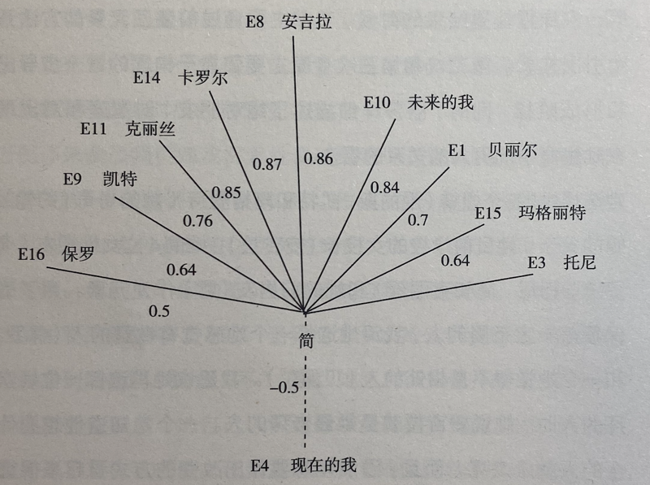

## 0601. 丽莎的转变过程

引言：人们很清楚，没有一个有关咨询过程的案例能够作为所有理论和实践讨论中众多问题的例证。但是，我们希望展示出一个来访者和咨询师是如何通过探索来访者的情景、她对事情看法的澄清（在意识的不同层次上）、早期实验、评估和进一步的行动计划而在一起工作的。个人构念心理学的理论框架，支配着特定干预措施的选择，其重要性会被强调（正如在前面的章节里，「我」指的是担任咨询师角色的作者 —— 一在这个特殊的案例中指的是佩吉）。

### 6.1 与丽莎的第一次相遇

1、自我转诊的原因。

丽莎打电话预约，说她从一个参加过一些我的讲座的朋友那里听说了个人构念咨询。她感觉她最近「停滞不前」，而且这一方法听起来正是她一直在苦苦寻找的帮助。我大概知道她提到的那个朋友（我的一位学生），我猜想他己经给丽莎关于凯利取向的一个相当公平的判断，所以丽莎可能已经有一些涉及她的事情的想法。

（当然，我还不知道，她如何依据她自己的需求构念她听到的内容。）我们确定了一个时间，即下周初，我们认为这对她来讲是一个机会，顺便看看她和我在一起时是否觉得舒服，是否愿意开始接受一系列的咨询。我在脑海里提醒自己要跟她保证，只要她的朋友没有提及，我和我的这位学生之间是不会有任何沟通的。

2、观测数据。

按照约定的时间，她迟到了两分钟，她对我的等待表示道歉，而当我邀请她坐下时她似乎是迟疑不决的。她个子瘦小，心情愉悦，穿戴整齐。讲述她的故事的时候，轻声细语，一开始还欲言又止而且经常脸红。很显然让她看着我是一件困难的事，虽然她时不时地会朝我瞄上一眼，看我对她所说的事情的反应。由于只是关注且不加批判地接受她不得不说的事情以及努力理解事情对她的意义，我的回应，无论是语言的还是非语言的，一定都打消了她的疑虑。只有在她似乎接下来不知道要说什么的时候我才会提问题，而我坐的位置，如果她想看的话是很容易看到我的脸的。但并不是每次她拾头看我的时候都会正对着我。她的紧张不安随着交谈的进行大大地缓和了。

3、来访者的故事。

丽莎与我的谈话从她是一个教师这个话题开始谈起，她已经工作五六年了。尽管在教室里面她很幸福，也很爱孩子们，但当她与其他工作人员在一起或在社交场合时，她通常感觉非常不自在。

我问她能否把这种感觉描述得更详细一些，她说她「非常非常害羞」「始终意识到自己」抑郁、孤独，「这一切有什么意义呢？」她显然是因为快要流出眼泪而感到难为情了，但是当我递给她一些面巾纸，并告诉她当事情太多时我们都需要哭出来，她没必要介意在这里表达她的不快后，她的心理负担卸下了。

接着，她描述了自己在学校的严重的恐慌，尤其是在学校的职工会议上。她发现自己会变得很紧张、出冷汗、不能看任何人并有种置身之外、冷眼旁观的感觉。（我之前看到过此类恐慌发作而体验到自我感丧失的报告，但是倾听其他表明她可能遭受比焦虑更为严重的事情的迹象明显很重要。）她从不在职工大会上讲话，而且如果她认为有可能被要求评论一个小孩，她就想要逃跑，但脚却不听使唤无法动弹。因为这些经历，她在培训的时候脱岗休息了一年，在她成为合格教师的第一年后离职，并在一两年前又回到了这个行业。

我评论道，她所经历的听起来非常的勇敢。她非常犹豫不决地说道，她认为她可能是一个好老师。她的大多数同事她都很喜欢，尽管她没有和任何一个人走得很近，尤其是她的班主任，她非常欣赏、羡慕她的自信。丽莎又想要放弃，但又不情愿为新事物作出改变，而且无法正面解释她离开的原因。她感觉她会让一个特别贫困的小孩失望，尤其是当她已经与那个小孩建立了一种特别温暖的关系。这也就意味着再次逃跑。

我问了丽莎其他的生活。她与其他女人合住一个单间，学生居多而且都比她年轻。她几乎不认识其他人，只有一个除外，卡罗是她最亲密的朋友。她还有其他几位朋友，而且与住在附近的她的三个姐妹中的一个关系非常近。偶尔，她会与她们一起出去，但晚上大部分时间都待在家里，为第二天的课作准备或是闭读。单单坐着与卡罗聊天谈话，她就觉得非常幸福。那样，她非常放松而且也对自己很有自信。我问她，与更加紧张的情况相比，这种感觉像什么？她很放松和开放，爱说话，聆听卡罗的快乐，可以笑着面对变化。

我知道，到目前为止丽莎都没有提及她的家人，我询问他们的情况。她告诉我，除了一个住在伦敦的姐姐，其他的人都住在苏格兰 —— 她的父亲、两个姐姐和一个兄弟。她的妈妈在她 12 岁的时候去世了。此时此刻，丽莎看向了别处，脸色绯红并陷入了沉默。

我轻轻地问她，她是否还记得那个时候。她说她不记得了。她感觉，她妈妈开始喝酒喝得非常厉害，在那之前，她迷迷糊糊了几年。

（这只是我们一次简单的初次会谈，我没有进一步探究这一明显具有威胁性的领域。）她认为，她父亲对孩子们的成长抚养负有更多的责任。他「细心照顾」着他们，确保他们衣食无忧，但在管理方面有严格的规则，而且「很遥远」。作为一个小孩，她曾被认为是一个「神经质」孩子而被当作婴儿对待，尽管她比在伦敦的妹妹要大 18 个月。她没有很多朋友，但在学校往往倾向于依赖一种特殊的关系。19 岁的时候，她离开了苏格兰，去接受教师资格培训。

她的生活里，还有她认为重要的其他方面吗？「是的 —— 男人！」我们为这突然愤怒的爆发发笑。但是，对她来说，这明显是一个最不开心的领域，我郑重地询问她，她的经历是什么。她与三个男人的关系遵循的是相似的模式。每一次，为了喜欢的男人，她都可以放奔一切，把自己全部奉献给他，直到她开始讨厌自己变成了「受气包」，而当她感觉到自己会被拒绝时她就会结束二人的关系。似乎每次她都预测到了灾难，而且每次她的预测都得到了验证（一个敌意的明显例子）。直到我问她，她并没有意识到，这些关系结束的时间，与她焦虑发作和事业突变的增加不谋而合。最后一个男人，直到她离开他的两个月之前，她还与他同住一个公寓。

4、原始草案。

当我们谈论了 40 分钟左右的时候，丽莎瞟了一眼表，脸再次红了。我说，我们还有至少 10 分钟时间，并问她希望从咨询中得到点什么。她知道她想要的：希望能更幸福一点，不要太警醒，更好地处理事情，做一名更好的老师，形成更好的人际关系，但「首先得理出个头绪」。她不知道的是如何着手处理这些事情。我问她为什么个人构念的方法吸引了她，她说她喜欢个人构念方法强调个人的观点和想法，即如果「你看待事物的方式对你并无帮助的话」，就可能会去改变。与我谈话她感觉很轻松，并想着手开始参加一系列咨询会谈。

她的朋友向她展示了她己经完成了的自我性格描述和评估积储格（详见第 4 章），丽莎对这二者都很感兴趣。我同意，它们在问题的精确预测方面很有帮助，更加清楚。我建议，我们再开展 4 次会面，这样可以让我们有多一些时间来探索：她是如何通过这些或其他一些程序来看待她自己和她的世界的，并能理解她可能涉及什么变化。接着，我给了她一些如何写自我性格描述的指示说明（详见第 4 章），她说她将在第一次会面之前发给我。

在我们走下台阶时，我告诉她我与儿童在一起工作非常快活，并非常期待能听到更多她给全班孩子上课的方法，像我，基本上每次见到他们中的一个都与他们的妈妈一起。以她对自己感到满意的为数不多的几个领域中的一个领域来结束我们的会谈，这看起来很重要。

### 6.2 咨询师的第一印象

像往常一样，我在会面后留了一些时间对我们的会谈进行回顾。我最初对她持有的印象是坐在那里，焦虑紧张，直到她发现我未带任何形式的评价，只是聆听并接受了她的诉说后，她才逐渐变得更轻松地坐在她的椅子上。我有一种强烈的感觉，她对向我敞开心扉仍感到胆战心惊，但由于受进取性的触动促使她告诉我这么多。这得有一个人，我觉得，是真的想要致力于解决她的困难尽管也担心她自身的不足。这项工作包含什么呢？我做了一些关于诸多因素的笔记，这些笔记本就应该牢记在心，而且可能对转变诊断有所帮助。（见第 3 章）

1、利用前语言构念的需要。

看起来丽莎是陷入了一种关系模式（与男性和女性），她因此变得非常依赖一个「最好的朋友」或是爱人。但是，她的敌意是如此这般强烈，以至于她势必处理不好人际关系。这种模式很可能仍保持在一种前语言的构念水平上，我们需要在某种情况下探索她早期与父母和兄弟姐妹的经历，从而发现她为什么不能成为可以成功处理人际关系的那类人。

然而，我猜测，从她说话的方式和当提到她父母时会脸红来看，当即会产生过多的威胁，的的确确不适合在探索性会面中进行尝试。此刻愤怒和剥夺的感受来势汹汹，却似乎被怀疑自己以后的人际关系所掩盖。然而，只有将这种经历带至更高的意识水平，她才能够自主地更广泛地分散她的依赖性，精心阐述她的核心角色。

不容置疑的是，她在员工会议上的焦虑体验与导致她人际关系破裂的政意有关联，这对更充分地探索它们的意义至关重要。是什么让她对这些日常事件如此难以构念呢？让这些经验与过去那些让她无助地去面对的经验之间的关联是什么呢？在这个阶段，我只能构念在她恐慌的强度方面的事情。

2、潜在运动的领域和进取性的迹象。

积极的兆头是她有一些潜在运动的标志和她积极处理问题的证据。尽管丽莎常常被看作是家里的婴儿，不过她仍离开家到伦敦参加教师培训。尽管她曾两次放弃她的事业，她仍然有勇气重新再尝试。把自己看作一名老师与看作一个小孩相比，是一个积极的指标，而与其他员工相比，她又缺乏相应的角色。她来咨询而不是放弃自己的工作，表明了一种真正「处理自己事情」的决心。得让她意识到，自己确确实实拥有一些资源，这将是发展某些核心角色的重构过程的主要推力。

3、受约束的领域。

此时此刻，丽莎似乎并不因自身的能力而将自己构念为一个成年人。作为老师她表现得很好，但在其他领域则是无可救药。作为爱人和朋友，她都以小孩似的方式进行交往。从她提及他人的情况看，看起来她对她自己如何在三个领域中生活，可能有一些较为浓缩的看法，并由此发现自己缺乏经验。正如她与很多年轻人一起，生活在一个房子里面的一个房间一样，这给了她一些证据，即自学生时代开始她便一事无成。她贫乏的社会生活和有限的兴趣必定增加了她的不足感和束缚感。

4、不同领域中使用的建构类型。

当丽莎说起她与孩子们的工作时，她对他们的知觉表现出了充分的识别力。然而，当她谈起老师们时，她的构念变得越来越紧张和狭隘：自然而然地，他们自信、聪明、人缘关系很好。社会情景对她来说，尤其是处在一个大群体中，被认为几乎完全可以从焦虑和威胁的角度来考虑，这也是他们对她持有的印象。有关她家庭的消，息焦点主要集中在依赖问题上，而关于她的评论则把她牢牢地置于构念两极中非偏爱一极，只有少数例外。我们可能需要在这些领域放松她的构念。但是，我不得不把她的构念涵容得更好，以发现这样做的手段方法。

记住这些印象，现在我需要在我们已经约定好的 4 次课程期间对支配她的人生观和她对事件构念的过程的重要主题进行更系统的探索。只有这样，才可能使第一次过渡性诊断的构想更加严密。

### 6.3 探索丽莎的世界

1、自我性格描述。

在我们再次见面之前，我从丽莎那里收到了以下一份人物速写。

丽莎今年 28 岁，是一名老师。她个子不高、微胖，并不协调，也并不是很有吸引力。她很敏感，很容易因人们所说的话而心烦。她不喜欢接受批评，在面临这种情形时具有很强的防御性。她并不喜欢让人们感到难堪或不高兴。惹人生气让她感到不安全。

她作出了许多关于如何做人和待人的决定，但是从来没有遵循过它们。她向人们倾诉太多，然后又会后悔。她发现告诉人们自己想要什么以及终止她不想做的事情是很困难的。她花费大量的时间向人们，尤其是那些她不熟悉的人道歉，为自己寻找借口。

她不喜欢向人们展示她个性中不好的一面，并试图向她的朋友们隐藏不好的一面。但有时候她会显示出她的自私，而她并没有意识到这点。

她是自我取向型的，但不是因为她认为她自己有多重要，而是因为她觉得人们无时无刻不在评价她。她很容易脸红 —— 在工作的同事们当中以及她不熟悉的人群中，她会恐慌，相比女人来讲，在男人中她也更容易恐慌。她喜欢通过自己的努力工作来让同事和同行们感到高兴。她工作的大部分时间她都很享受，但有时候，她会意识到自己的常识和观念并不是很好。

她在与她的亲密朋友相处时可以变得很快乐和有趣。她发现酒精可以让她在陌生人面前更放松、外向。

她对朋友很友善，也乐于助人。当他们对她的意见表现出欣赏和重视时她常常很高兴。她喜欢做一些有趣的事情，当人们需要她时她也很高兴。她有时候也会自我感觉良好，但这种时候很少见，而且取决于她当时生活中的很多其他事情。有时她喜欢自己单独一个人，但只是在熟悉的环境中。她不喜欢改变，这是当她正视自己、清晰地看到自己的不足时所呈现的状况。

2、丽莎自我性格描述的分析。

这一速写既验证了一些我的第一印象，也让我更加理解了她到底是如何看待她自己的。同时，它也触发了很多我需要记住的问题。

正如我们之前说的（见第 4 章），凯利建议我们通过查看开放和封闭的句子来开始我们对自我性格描述的分析。在这里，丽莎从解说她的年龄、职业和面貌开始 —— 她「不是很吸引人」。她以害怕改变和不足感结束。总而言之，从内到外，她对自己的评价并不高。

许多重要的主题开始出现。她有一种被评价的感觉。她希望能取悦别人，害怕招惹他们。这只是验证了她把自己构念成了一个不足的人。她做出很多决定但又不能够自始至终地遵守它们。（这适用于她接受的咨询吗？）她告诉人们很多关于自己的情况，但却想要隐藏自己个性当中不好的一面（可能她对给我讲述这么多也感到后悔了）。尽管能说一些有趣的讨人喜欢的事情，偶尔也会自我感觉良好，但在缺陷占据主流的情形下黯然失色。有趣的是，她很少愤然抨击同事会议。也许她只是在那一刻简单地将它们构念为象征着自己无助的一般感受，而无法进一步地详尽描述它们？

丽莎并不将自己置于一种特定的情景下或是将自己设定为某一特定角色，用「朋友」或「同行」称呼他人而不是用特定的人。这似乎是强调孤立感和我从她生活中感觉到的构念。第一次见面，她并没有提到她的家庭或她过去的生活和她说起的后面的关系。或者她主要关注的是她的现在，或者当她讲起她的过去时，在现阶段看起来可能因太恐惧而难以承受。她目前的世界观可以简化为她的缺点和他人对她的假想性回应。

当丽莎来参加我们四次探索性课程的第一堂课时，她马上就问她的「作品」我们是否已经收到了，「作品」的内容是否是我想要的。

我对她留出这么多时间让我浏览她的「作品」表示感谢，并说它很有用。我们又一起浏览了一遍她的自我性格描述，并对里面陈述的主要问题达成了一致。当我问上一次她告诉我那么多事情她是否感到后悔时，她说「不」，事后她感到很安全并重申了她当时表现出的宽慰感。她自己认识到她并没有提到她的家庭，并想知道她是不是应该去做。正如之前所料，她谈论她的父母时有一些害怕的感觉。我向她保证，不会给她任何压力，她解释说从很早的时候就有关于母亲温暖的回忆 —— 就好像是她已经完全清除了她母亲去世前那几年的记忆一样，那几年她都不是她自己，而且她显然不希望在这个阶段重新翻起那些令她感到伤心悲痛的记忆。事实上，后续的事件表明，很长一段时问，对于如何诉说她对她母亲的感受，她并没有作好心理准备。

3、一个评估积储格。

现在，我想要以更加结构化的方式探索丽莎构念的过程，所以我提出我们需要开始观察通常她是如何看待人们的以及如何看待她自己的，沿着凯利给他的来访者介绍的方格程序，第 4 章已有引用。丽莎对此非常热情，因为她的朋友已经向她展示过方格技术。在第一次课程快要结束的时候，我们主要通过前述三元素的方法开始引出构念。第二次和第三次会面主要致力于构念的进一步导出和形成阶梯，同时，丽莎详细描述了她对朋友、对家庭和对出现在她生命中的男人的关系的看法。

她选择她的 3 个姐妹（爱丽斯、凯特和玛格丽特）她的哥哥（约翰）她的父亲、她目前学校的女校长 (安吉拉）、她的 4 位女性朋友（卡罗尔、托尼、简和克丽丝）和她的前男友（雷） 作为元素。为了确保覆盖一定范围的人，我请她选择一个她感觉有歉意的人（保罗）和一个她觉得不易相处的人（贝丽尔）。我建议她再选择一位她崇拜的人时，她说安吉拉就是她最崇拜的人。一个她知道他想要什么的人就是杰克。而且，澄清她想要作出改变的方式看起来很重要，她同意包括「现在的我」和「想要成为的我」。一开始，她并不希望包括她的妈妈，后来在我的建议下才同意这样做，理由是假装她不存在似乎是错误的。

部分构念已通过前文所述的三元素法引导出来了，其中一些被用来形成阶梯。一到两个是从她的自我性格描述中抽取的，而且无须惊讶，其中一些在两种情景下都出现了。对构念进行七分制评分，丽莎没有困难，尽管她在给出负面评分时有些犹豫。她不喜欢评价人们，至多喜欢评价她自己，正如她自己所描述的那样。

通过第四次会面，我利用在第 4 章中简要介绍的希金博特姆和班尼斯特的 GAB 项目分析了积储格，我们可以看到，构念和元素都根据它们彼此的关联性分了组。

图 6.1 丽莎方格中的主要元素

图 6.1 展示了丽莎方格技术中主要的密切相关组中的元素或人。她很惊讶地发现「简」是作为一个主导元素出现的，因为她并不是丽莎认为的她最熟悉的朋友。我问她，「简」的出现是否表示其最显著的品质是这一组人的共同之处，这对她可能有用。可以看到的是，她的一些朋友、姐妹中的两个和她的女校长「安吉拉」与「末来的我」高度相关。（数据显示了这些元素与「简」之间的相关性）「现在的我」被认为与它们有着显著的不同。例如这里面的「现在的我」与「未来的我」之间，在生成沮丧的人们的积储格中发现了可观的距离。她在讲述她的故事的时候，以及在她的自我性格描述中所传达出来的孤立感在她的积储格中被显著表现出来。而且，丽莎对很多人的如此积极正面的构念看起来好像在起着贬低她自己的作用。

图 6.2 丽莎积储格中的主要构念

图 6.2 展示了丽莎积储格中构念的主要的组。其中最主要的一个构念，没有恒劲与持之以恒相对立，是包含大量与其高度相关的其他构念的一个构念，无论是正相关还是负相关。用心理学的术语来讲，丽莎认为，没有恒劲的人（那就是丽莎自己） 也就是那些自我取向的、害羞的、有缺陷的、谦卑的、对评价敏感的人，是漠不关心的、缺三自信的 / 有所保留的、太易表露感情的和不会逐渐变得有趣味的人。

这些就是在我们第四次会面期间与丽莎讨论的方格技术的主要方面。她发现，这些都是「意料之中」的，但对自己在哪里和需要向什么方向努力已经很清楚了。用她的话说，这实际上就是她的「糟糕的自我形象」和需要更好地谋划她的生活。她非常想要继续进行咨询，虽然我不能确定「到底需要多长时间」。我建议我们每周合力工作一次直到夏季学期结束（那就是 12 次课程），然后评述那时的情形。丽莎对我的建议感到很高兴。

4、过渡性诊断。

现在，我感觉我们处在一个较好的位置上，在构想过渡性诊断的过程中，我能够紧缩我对丽莎的自我观和处境观的构念。这将成为我们初始工作的基础。我再次发现做笔记对澄清、理顺我的思想很有帮助：

丽莎陷入了自我构念的发展方式的困境，这使得她显得与众不同。从某种意义上来说，这个系统在本质上可以凝缩成：「我是丽莎，所以我只能够……」她建立紧张关系的企图可能被看作有敌意的。它们只能失败，因为她将无法应对它们的成功可能导致的威胁和内疚。

就这一点而言，她的问题与特里克斯贝尔的问题非常相似（见第 2 章）。但是，他们在一些主要方面也有差异。特里克斯贝尔的问题基本上处于前语言层次，集中在依赖和在纷扰不安的关系以及心理症状中表现出来的问题。丽莎的问题可以看作是开发一个「自我」两极构念失败的有用例证。她只在她的构念系统的一极中详细阐述她自己，所以她自绝了可以回旋的空间。

她在同事会议上的恐慌可以被看作是一种意识，即她需要将所有的技能充分发挥作用，但这种意识使她只能面对「虚无」—— 她无法将自己构念为那种可以像别人一样处理问题的一类人。

前进的道路有三级。1）改变她自我构念的性质，从凝缩性的到建议性的（从她目前的严格死板、对自己不变的观点到可以让她视野更广阔且更具潜力性的）。2）在她的构念系统内着力于那些不一致的东西，以帮助维持现状和防止恐慌的发作（第 1 条和第 2 条涉及鼓励放松）。3）同时，帮助她详细描述她可替换的自我，及与此相关联的核心角色。当这些都做了，她的恐慌症将会下降。

到目前为止，在丽莎维护她的位置所伴生的敌意中，一种必不可少的要素明显需要降低。在第 5 章中针对这个过程提出的建议与上述目的密切相关。随着她的自我构念的放松，不一致的澄清，另一个自我的详细描述，在他们恐慌症最严重期间混乱的感受将会让位于更多的可控感，让她更开放地去抓住积极探索的机会。

### 6.4 咨询过程的第一阶段

1、澄清丽莎的构念。

在着手实施一个涉及他人的行动计划之前，丽莎构念的有些方面需要进一步澄清，因为他们显然有助于达到她实现自我的状态似乎有一个或两个可能的困惑或矛盾会被有效地解决，一个过程就其本身而言，应该为温和的初期放松提供途径。

首先，我们更加小心地审视她封闭之于外向、开放的构念，因为她此处似乎还有反复性的问题。利用 ABC 模型，一种进退两难的情景就出现了。

佩吉：你更喜欢哪一个，封闭之于外向和开放？

丽莎：实话说，外向和开放。

佩吉：你为什么选择那一边？有什么优点？

丽莎：好，那么人们接受你。或是他们更加有可能。

佩吉：那么封闭到底有什么缺点？

丽莎：如果你是封闭型的，人们没有时间去了解你 —— 所以 —— 所以他们不接受你，不是吗？

佩吉：你能想起一些外向的和开放性的人可能的缺点吗？

丽莎：（经过长时间的停顿）人们能够了解你，并对你作出评论。

佩吉：封闭型的人有优点吗？

丽莎：如果你是一个封闭型的人，不可能对你作出更多地评论 —— 他们看不到你是什么样子。

这些可以总结如下。

| 类型 | 缺点 | 优点 |
| --- | --- | --- |
| 封闭型 | 人们不愿意花时间了解你 | 人们无法过多评论你 |
| 外向开放型 | 人们了解并评论你 | 人们接受你 |

根据丽莎的理论，那么，如果你是开放的人，你就会被评论；如果你是封闭型的人，人们就会忽视你。尽管她一开始选择外向的、开放的，但是被「了解」可能导致难以忍受的焦虑。

2、前语言方面的焦虑。

我问她是否可以将此焦虑与她在同事会议上恐慌发作相联系。她并不能立刻建立一种连接，我鼓励她尽力回忆他们起初在她的印象中像什么。她回想起在她母亲去世的前几年她自己的初中生活。

她有一段某位老师对她嘲弄的痛苦回忆，这位老师似乎持续不断地「评论」她的胆怯与爱哭鼻子。她记得她被罚站在椅子上，因恐惧和屈辱而僵住不动。她觉得她不能将这些告诉她的妈妈，她的父亲距离又远，而她的兄弟姐妹们一再重申她还是个小孩。

给予丽莎更多的空间让她反思这些事情看起来很重要，我们沉默地坐了一会。我感觉，她在目前的学校经历着那个被吓坏了的孩子的无助。当被要求做一名能干的成年人时，她受到「迫在眉睫的综合改变」的感觉的威胁。她也被焦虑裹挟压迫，以至于无法理解到底发生了什么事。如果在这些时刻她感到她被「了解」了，就好像是某个愚蠢的人，向人们展示她的无知，对孩子们漠不关心，简单地说就是一个「坏」人，不适合做一名老师。短暂停顿了一会儿，我把这个作为一个可能的解释给她讲了，她说「感觉对了」。当她知道同事们对她了解过多的话，这种担心里会存在一些敌意，但在这个阶段，她真正有意识地相信自己几乎在每个方面都存在不足。仅仅敏感而不考虑她对其他人产生的影响，看起来可以救她。

这种构念似乎也是我们探索路上的一个陷阱。看看她撰写的自我性格描述的第一段，可以清晰地看出，敏感性有两层意义：意识到他人的感受并希望不要伤害到他们；她自己很容易生气的倾向。

第一是她对自己的评价；第二是她发现没有任何用处。所以，将两个构念分开似乎很重要。她做到这样是通过发现高度敏感性的一种新的对立面，她把仅仅与她相关的敏感性的类型重新贴了标签。她可能有许多替代性的选择。她认为脸皮厚的，她不喜欢；粗暴的，也好不到哪里去。我问她，是不是没有什么东西能让她不易受伤害。她说，能够管理伤害看起来是将要致力去做的事情。这并不仅仅是一个智力练习问题。丽莎晚些时候在学校作了测试，发现她有一些资源，如幽默可以帮助她更好地处理可能受到的伤害。

3、迄今咨询师的角色。

尽管我们已经谈到了，个人构念咨询方法的实质就像合资企业中的「伙伴关系」一样，但非常清楚的是，关系本身会随着其他变化和增长而变化和增长。在一系列进展中反思我们自己的角色是我们工作中重要的一部分。在这个阶段，丽莎比后来从我这里获取指导时更加具有依赖性。我把她的注意力引向她构念中的不一致，选择我们可能致力手从事的领域，小心接近那些对她威胁最少的人。在这些早期的会面中，根据我对她遭遇的人际交往方面的困难和她所拥有的资源的理解，我提议了可能的行动方案。她需要时间和鼓励，来发展和相信她自己的创造力。但这毕竟是一个「好」品质，因而不是「她」的。

准备好与她相关的会面。首先，需要我尽力从她的话语中、她所写的、展示出的前语言行为中进行预测，她做什么样的实验会发挥潜在的用处。例如，对我来讲，通过把重点放在更多区分事件和人的观察开始，而不是让她仓促地进行改变自己的行为是很重要的。详尽描述生活中新角色的任何尝试都需要以对她更积极的评价为基础。目前，我不得不接受她对自己一生中的脆弱和依赖的构念是真实、正确的。

### 6.5 第二阶段：行动计划

除了上面澄清的一些问题，丽莎觉得自我性格描述和积储格一起给她了一个清晰的印象，即她是如何看待她的情景，以及我们是如何制订第一个实验计划的。这个阶段似乎有 3 个领域需要我们开展工作。

1 使她那些与他人相对而言显得消极而浓缩性的自我构念更有变通性，例如，鼓励她对自己和他人的为人处世作出更可变的预测。

2 探索一些关于她的「自我」构念中的非语言领域，以便发现恐慌的替换者。

3 详细阐述自我的可替换的方面。

1、构念他人。

在第一个领域，我需要帮助丽莎更加充分地构念他人而不是试图提升自己的形象。这并不是强迫她把她所有美慕的人都从他们的神坛上拉下来，而是要询问他们是否是全能的非人类。这不仅需要考虑他们是如何自信、应对自如和外向的，而且还要考虑对他们使用更宽泛的构念。从他人的角度去看，她在可以扮演更有效的社会角色之前，她需要发展更大的社会性（构念他人的「建构过程」）让她的脚穿上别人的鞋子。我请她给许多人撰写过人物速写，想象他们处于不同的情景下，当她思考的时候，她能够说他们偶尔也会感到心神不宁、局促不安，甚至有时候在某种程度上是自私的。尤其在脆弱性方面，她意识到那位女校长 —— 安吉拉，她非常羨慕其做事始终自信而有能力的那位，可能会受到伤害。我请她写下她的速写，就好像是安吉拉在写她自己的自我性格描述一样。

大多数人都认为安吉拉是一位有能力、自信和开朗的人，对劳神费力的工作做得很好，同时还能够经营好一个家庭。她很有能力，但她的自信并不像她表现的那样坚不可摧。尽管她广纳言路，但还是可能会受到家长的伤害，例如，或当某个员工似乎想要阻止她为了改进工作而提议的某个计划。

她与史蒂芬的婚姻非常幸福，但是有时候她希望他意识到她偶尔也需要支持和安慰。她花了很多时间聆听他诉说对工作的担心。尽管他对她事业的成功非常骄傲，但他并不真想知道她在学校的日常活动。那些活动可能令他厌烦。但是，他很有爱，而且她知道拥有他是她的幸运。

她想要拥有她自己的小孩，但是担心可能有，点迟了。这份速写表明，丽莎很细心地观察了安吉拉，并感受到她可能有困难的一些领域以及她与她丈夫之问的关系并不是十分完美。不过，我在想，她对安吉拉感觉她自己「很幸运拥有他」的陈述是否并不是通过她自己的构念系统给予的解释，当被质问时，她同意了。她补充道，她不知道安吉拉是否想要她自己的小孩，不过她可以确定的是，此时此刻她正在谈论她自己。这种认识对获得更多的社会性似乎很重要，这可以帮助她看清人们可能是什么样的人。她确实成了同事和朋友们当中的一个敏說的观察者，而且越来越不倾向于把自己置于他们的对立面。随着时间的流逝，这样的效果会使得她能够和其他人一样，以一种更加开放和可变的方式来构念自己。

2、体验焦虑。

或许，丽莎最困难的任务是改变她在学校会议上经历焦虑的方式。能够记得所有这些年所经历的东西赋予了事件某种意义 —— 受惊吓小孩的孤立无援，她感觉她仍然处在害怕被了解的情景中。

然而，在某一个地方，有另一个自我 —— 一个孩子拒绝站在椅子上哭泣，一个成年人为自己站了起来，而不是以逃离这种关系的做法来代替沦为受气包的地位。如此威胁另一个可能的自我的是什么？我怀疑，这可能与她对她的父母、她的兄弟姐妹、那个折磨人的老师、她的爱人的愤怒有关，那个时候她发现太害怕而无法表达，宁愿选择听天由命。既然还有如此多的未知的早期经历，将在学校情景下的任何变化的影响限制在那个单一的背景下是很重要的。

因此，我们将讨论聚焦于她害怕「老师们」的一个重要的原因是作为一个小孩在学校所受的羞辱。当我们再次谈起那个女人时，她能承认她心里对她仍有种「仇恨」的东西。她更充分地构念她同事们的努力，使得与他们的联系尽可能地真实而生动，切情切景。

当她在教室的时候，她己经对自己作为「一名好老师」的概念有了自己的想法。在教研室那样的环境里，她还能是那样的自己，不管怎样，同样关心孩子们的福利吗？当我们讨论这个的时候，丽莎说在这些场合下她从来都没有想过孩子们，她好像又「回到了过去的年代」。她将尽力「保持住她作为教师的角色」。

首先，我请她将注意力集中在倾听别人是怎么说的，而不只是试图参与其中。这确实困难，但是她将意识的聚焦点从她身上转换出去的努力开始取得成效了。通过倾听，她开始试图判断他们是如何感受他们讨论的问题以及他们如何看待事情。这让她进一步从完全关注自己中脱身出来，逐步开始自发地参与。一天早上，她知道我们将要讨论的小女孩是她结交的朋友，尽管害怕，但是当进行时她是如此关心她的个案以至于她「忘记了自己」，并且讲得相当详尽。

丽莎的经验在这里发生的变化在本质上从一种极端收缩感（焦点收缩），她能够构念的地方就是她的恐惧的生理感觉，到逐渐扩张感（视野的拓展）。她不仅能够扩大她自己的感知能力，还可以将其他人带进她的关注范围内。在一种紧缩状态，她所能够预测的是迫在眉睫的「倒塌」。接着，总体上对情形的把握更加清楚后她能够在理解发生了什么事情的基础上作出预测和回应。

3、人际关系：表演的使用。

伴随着这些实验，我们开始观察那些她更加依赖的人建立关联的替代方法，比如她的男性和女性朋友。在我看来，如果没有进入她与她父母的人际关系中，那么我们不可能进展得很深，而她确实开始更多地谈论她的父亲。很明显，她对她父亲与他的孩子们间的距离感到遗憾，而且想知道如何才能够接近他。起先，她不知道该如何与他谈话，所以我们通过表演尝试了很多接近他的方法。通过角色互换，我们每一个人将她自己和她父亲在同一个「场景」中饰演，她能够从这些对话中着手开始探索对她自己的威胁性并获得一些了解，即当她站在他的立场时他可能会有何感觉。

在我们的第一次兴试中，她恳求他的安慰，祈求他能够与她讲话。像丽莎一样，我表达了一些愤怒和伤害，她可能已经感觉到了，并且她逐渐能够做同样的事情。

她尽可能地多回家，并努力与她父亲谈论过去的事情以及当前所发生的事情。显然，他不愿意过多地谈论她的母亲，但是却跟她说了一些她母亲死后他是怎么样的。尽管她觉得能够理解那对他而言是多么的困难，与此同时，因被姐妹们看作是小孩以及被父亲的忽视所带来的愤怒情绪，比我们表演期间更强烈。起初，她发现这很痛苦，因为它似乎意味着在审判他。但是当她能够接受她早期对他的情绪以及她当前对他的理解这一事实时，她发现她获得了解脱而不是威胁。

4、对到底发生了什么，事情的紧张构念。

这项工作大约花了 3 个多月的时间。在这个阶段，在取得这么多进展的情况下，我感觉通过反省她自己，来紧缩她的构念是很重要的。避开上文已提到的发展不谈，我和丽莎精确找到了一般扩张和侵略性的迹象（拓展她的看法的可能性和增强她的体验的积极举措）。她计划搬出她的单间配套，和她的姐姐合住一个公寓。她和她相处得恰到好处，但是她们之问肯定有意料之中的困难。她还决定在一所新学校申请一个职位，并要承担更多的责任，因为那里的小孩通常都是来自混乱不安的环境。她很想获得那份工作，但她知道她将会冒「被评价」的风险，而她可能要应对拒绝。她开始更多地草签社会合约，而不是等待被辞退后独自离开。我们花了一些时间来考虑她如何更加广泛地提高她的生活，结果她夏季报了一个语言学习班，并希望在秋季参加一个羽毛球俱乐部。

对她来讲，所有这些威胁中一个最突出的真正的威胁是与她尚未解决的依赖问题有关。如果她离开那个房子，与她姐姐同住，她会与她的朋友卡罗尔疏远吗？她已经妒忌卡罗尔与另外一个女孩之间的关系了，感觉如果搬走的话，她会从卡罗尔的友谊中被驱逐出去。丽莎带着羞愧说出这些妒忌和占有欲，以及早些时候与男朋友有关的妒忌。在学校，很显然她总是有一个特别亲密的朋友，也总是在某个阶段「失去」她，这给她带来了巨大的痛苦和抑郁，甚至在 7 岁时就如此。在这个阶段，威胁很容易被确认，但很清楚的是仍然还有未完成的业务。

短暂的暑假休息后，秋季学期我们每隔三周见一次面，来巩固她己经取得的变化。此时，焦虑袭击已经成为一件过去的事情了，她搬进那个公寓和她姐姐一起住，并能够很好地处理失望。新学校并未给她提供职位，她对自己能接受这个问题感到很惊讶。尽管非常遗憾，但她似乎并没有感到被拒绝，也没变得沮丧。事实证明，她在她自己的学校得到子提升，这使得她感到最终她能够「持之以恒」。

在这个阶段，我们都觉得休息一下是很有益的。很明显，在依赖领域仍然还有很多工作要做，但是，此时对她而言似乎更适合做的是开发到目前为止独自依靠自己所做的事情。当她需要或是感觉已经做好了准备着眼于其他问题时，她会与我联系。

### 6.6 第三阶段

6 个月后，丽莎与我联系了。她计划为自己购买一套公寓。她能单独对付吗？她已经申请了一个地方为失调的孩子们上一门课程。

她能够坚持这么做吗？她与男性发展了一段或两段友谊，但是感觉害怕投身于另一段亲密关系。同时，结婚和要小孩的愿望非常强烈。她父亲的身体出了一些问题，而且已经病得很重，她不知道自己该怎么办。当有关她自己新形成的构念被测试的时候，很明显有很多威胁。

1、评估变化和进一步行动的可能性。

我们同意在这个时候做另外一个积储格，看看丽莎现在的进展和下一步可能发生什么变化是有用的。她是否应该减少陈旧的构念去作一个更直接的对比，或是推出更多的构念来表明一种不同的变化是有争议的。她选择了前者，但是对那些自从去年才开姶认识的人们而言，她替换掉了一个或者两个元素。

相比「现在的我」的评分，我们发现两个积储格之间有相当大的不同。在第二个积储格中，她在相当多的构念中将自己评定为是讨人喜欢的，虽然在它们当中处于中点，显示她正处在转变之中。她认为自己是不那么敏感，很大程度上是归功于之前她对自己的过敏症所做的工作。此外，尽管她开始质疑是否如此尽力不惹恼别人就是一件好事，因为他们也有幽默感并能够应对。她不易受到伤害，更加自信，也不那么害羞。「现在的我」和「未来的我」的相关性是正向的，而不是呈负相关的，尽管相关系数很低，只有 0.39，她仍然有一段路要走。「未来的我」，她感觉重新测试会更加「现实」。

此时写的另一个自我性格描述强调了这一切。与第一个速写以她害怕变化结束不同，第二个速写的主题思想就是详细阐述她觉得自己已经改变了多少。她已不太容易感到沮丧，更易和同事们相处，拥有了更广泛的朋友圈。她对自己作为老师这样一个角色更有信心。她表达了她对父亲的担心，但指的是为她自己的计划和继续推进的需要。

2、咨询师的角色变化。

毫无疑问，在第二阶段，丽莎为我们的工作带来了更多的资源，而我的角色也因此改变了。当然，相比她而言，我仍然处在一个更好的位置以关注她构念的不一致。有几次，在她痛苦的时候，通过抵制「母亲般」的照顾她的诱惑，我能够确认她认为自己是一个成年人的感觉越来越强。但是，她现在可以把对当前事件的反应和过去的经验联系起来了。她可以预测可能的困难并在面对它们的时候，能够做出更有效的选择。她更加积极地参与起草一个新的行动计划。

3、新行动计划。

目标是：

1 通过详细阐述丽莎的期望和计划来减少独自生活的焦虑，从而使事件更具预测性。

2 通过详细阐述期望和学习计划，减少新课程中的焦虑和威胁。

3 进一步探索「自我」的非语言方面，更全面地强调她的基本依赖问题。

这些目标并不是按顺序完成，而是与它们正面遭遇时确保在两个月内逐渐并同时完成。

最容易解决的任务是她对独自生活的害怕。她与姐姐合住，她姐姐却过着一种非常不同的生活，这种生活与其朋友大不相同，这些证明她可以自己计划事情并能与自己的朋友相处。我请她不仅要预测她能够做的事情，还要预测如何获得她想要的新公寓的细节情况。我建议她利用绘画和语言描述，丽莎很喜欢。所有这些已经产生了影响，让她能够认清此举的含义，并摆脱大量孤独的威胁。事实上，她决定她将要让自己变得「自私」，不再讲任何重要的事情，这与她和最后一任男朋友在一起时的分享形成鲜明的对照。她变得很有想象力，同时又有很现实的想法，她明显对建立新家感到很高兴。孤独的问题己经没有了。她开始享受娱乐并享受独处的生活。

她害怕无法坚持完成课程似乎主要与她怀疑自己的学习能力有关而我们通过在课程开始之前设置阅读相关学科的课程来解决这一问题。她也参加了当地夜校的一些讲座。当她在秋季学期真正开始那个课程时，她调整得很好，一直坚持到她获得了新的资格。

她父亲不断增长的依赖性问题对她来讲更难处理。虽然已经对她早年有关父亲的体验有了很好的理解，他的变化给他们之间的关系带来了一些新的情况。她父亲大病一场之后，她感觉他越来越充满孩子气，非常期望她的女儿们，尤其是需要丽莎花费更多的时间在家里并为他打理一切事情。丽莎很乐意承担她的份额，她妹妺明显缺乏兴趣和她姐姐找借口（刚刚结婚）不想承担过多，都让她很厌恶。事实上，她因她自己大量、彻底的负面情绪而感到非常沮丧，想知道她是否已经成为一个非常邪恶的人或是这些年以来是否一直在隐藏自己的这种感觉。她嫉妒她已婚的姐姐，对她的父亲的行为非常生气，并开始质疑她母亲的不幸和堕落的缘由。这需要忍受太多。

4、放松的威胁。

面对这一切，丽莎明显紧缩了。尝试一些温和的放松几乎正当其时。在咨询会面一开始就安排了消遣娱乐，她在晚上回到家时将此付诸实践。这使得她能够以更加开放的心态面对她父母的早期感受，以及第一次开始记得她的梦境。在这些梦境当中，部分显示她母亲是她父亲有些不近人情的受害者，部分显示她自己并没有被她父亲好好对待，而最坏的是，她父母对她都是冷酷和不屑一顾的。只有一次，她觉得她站起来捍卫自己，对他们表现出了愤怒。在其他梦里她都是哭泣着醒来。丽莎因这些梦境而非常沮丧，经历过一个相信它们才是「事实的真相」的阶段。她开始对我有点生气，一段时间内看我就好像是某幅冷酷的父母画像。在一次课程期间，她宣布她自己己经精疲力尽，但她想应该咬紧牙关，返回苏格兰，以照顾她父亲的余生。这才是她值得做的。可以理解的是，丽莎己经退回到了一个敌意的位置。她有充足的证据证明她一点也「不好 」。

尽管这对丽莎来讲是一段困难的时问，不过她的变化看起来并不是那样令人担心。我抵制住诱惑，并没有通过将她转移到一个「安全」区域来保护她免受威胁，因为我觉得她现在已经可以足够正向地阐释自己可以处理好它。看起来她己不再抑郁和固化，现在她已经充分经历了之前没有接触过的很多情感，并能积极地承担表达它们的风险。但她需要再次紧缩到一定程度，以便可以继续前进。她处在一次重要的选择时刻。

佩吉：这或许是你所遇到的所有选择中最困难的时刻。我们能否只是看看你的选择到底是什么？

丽莎：那可能有帮助。

佩吉：你可以回到苏格兰，和你父亲一起生活并照顾他。那对你将意味着什么？

丽莎：从头再来，我想。那个无私的 —— 受气包。

佩吉：那样不好吗？

丽莎：是的，不好。我不会走回头路。

佩吉：好的。接着你可以完全撒手不管，去过属于自己的生活。

丽莎：我感到非常愧疚。他是我的父亲，当母亲顾不过来时他对我们尽心尽力，做得很好。

佩吉：有没有什么其他办法呢？

丽莎：天晓得。

佩吉：我在想为什么这一切都落到你的头上。为什么你会会觉得你不得不承担起所有的责任。

丽莎：我想是因为我一直都无法承担责任，现在到了该我承担的时候了。我不能一生都像是个小孩子。有时候我必须成长。

佩吉：没有其他成年人参加吗？你的姐妹、你的哥哥、你父亲自己？有没有人知道他真正想要什么？你认为他知道吗？

丽莎：可能不知道。

佩吉：你没有更好的发现吗？即使他不知道他想要什么，你也可以再想想在这一切中你应该分担什么。

丽莎決定把她父亲接到伦敦，在她妹妹的帮助下照顾他。他不知道他想要什么；他只是觉得女儿们「亏欠」他什么。他迫不及待地想要回家去，尽管他现在住的地方实际上环境肮脏、暖气设施破败不堪以及屋顶漏水。带着挫败感和悲伤，丽莎召集全家人起，出色地组织大家制订了一份责任分担计划。她们又重新修缮了房子，使其可以继续居住，她们提供给她们的父亲一张轮值表，大家按照轮值表轮流照看和拜访。这似乎使他感到公平了，事情得到了妥善圆满的解决。

5、构念依赖。

这仍然在丽莎的母亲那里留有依赖领域，看起来也牵涉到她后来的人际关系。通过她的梦境，她更触及了她对她母亲的感受。它们显然是矛盾的，即在感觉被剥夺了爱与关心她母亲可能遭受了什么之间摇摆不定。丽莎已经牢牢地印刻了早期温暖和幸福的记忆，现在想知道这些是否都是幻想。在我看来，缓解因此疑问所导致出现在她脑海中的焦虑的唯一途径，就是冒险将疑问调查核实。她很少与她的姐妹谈论这些时光，我建议她应该与她们分享一些她的感受。最后，当她和她姐妹中最年长的姐姐谈论这些的时候，她的大部分记忆都得到了验证。爱丽斯不光记得她们母亲的美好时光，也记得发生改变的时期。对她而言，她们的母亲开始喝酒与她们的外祖母的死有联系，母亲与外祖母相处得并不好 —— 可怕的老妇人显然不赞成女婿和女儿之间多年来的相互折磨。当她们的外祖母死后，她们的母亲就离开了自己的丈夫和自己的孩子们，我们只能猜测这里面涉及的内疚感。

这一切开始让丽莎觉得有意义，她能够接受我在她自己对朋友和爱人的强烈依赖性和母亲的撤退之间作出的关联。根据她姐姐的说法，丽莎这时转向她的父亲，而他却无法回应她的需求。失去妻子也使得他变得孤僻。现在的问题是她是否不得不继续这种模式，从而使她继续成为一名个人生平的受害者。她想知道，为什么在所有的孩子当中只有她一个将父母之爱的撤退经验视为个人的摒奔。可能是她作为家庭中一名小孩的角色和她姐姐们的态度，或是她所做的这些事情，在很大程度上导致了这种依赖困境。

接下来的几个星期，丽莎「很安静」，但是不再沮丧。会面期间她也没有说过多的话，保持了较长时问的沉默，这似乎是她需要的。有时她会谈到在这些沉默的时段里她会想她的母亲，有一次还哭了，说这一切都是多么的丢人和遗憾。尽管她不敢说现在她发现她的父亲更容易相处了，但她想起他时也很悲伤。她希望她能够与她父亲谈论她的母亲，但是当她尝试的时候他转身走了。

6、即将结束。

从这次开始，丽莎来得就不是很频繁了。我们的会面以「进展报告」的形式继续，而她直接参与的活动通常是工作与社会生活。她冒险与一个男人保持了一种非常亲密的关系，尽管她觉得对他情有独钟的阶段已经过去，但当他们第一次开始考虑结婚的时候，她还是体验到了大量的妒忌和猜疑。接着，她在英格兰中部申请了一份工作，她被接纳了，因此必定要在几周内离开伦敦。我们开始准备结束我们的会谈，回顾我们已经完成的任务并期待着她的未来。她表达了一些担忧，但更多的是自信，似乎觉得她获得的要比她刚开始咨询时期望的要多。她也相信仍将发生更多的变化。

我们的最后一次会面，我请她以丽莎的自我性格描述形式写下她未来两年内的愿望。她看到了自己能够处理好自己的新工作，并很享受这个工作。她描述了她的家庭，「没有太大的变化」，但是她自己能更好地维护自己与兄弟姐妹的关系，也更能包容她日渐衰老的父亲。她希望那时她已经结婚了，「满怀信心而不再受嫉妒的折磨困扰」。至手那时是否要小孩的问题，她很开明。但是当我们谈论这个问题的时候，她说她很惊讶，认为以此来证明她作为一个女人的价值现在看起来并不是那么重要。

她自己将她现在的感受与她记忆中的我们首次见面时的感受作了一个对比。她回忆起她的焦虑和担心暴露所有缺点和不足。她把我看作母亲的某种化身；同时，辦识出随着时间的推移和她对所发生的事情承担越来越多的责任，这种把我看作某种母亲的印象是如何发生改变的。她表达了一些离别的悲伤，但己经不再依赖到我这里咨询。

对于我来说，我很真诚地说，我是多么喜欢和她在一起工作，并且极其欣赏她为想要作出的改变而所作的努力。她知道如果她需要她会再次与我取得联系，并说如果她发生了什么事，会与我保持定期联系。她与我保持了大约一年的定期联系。

一张圣诞贺卡写道，「经历了一些起起伏伏之后，她要结婚了，她的工作也做得很好」

### 6.7 反思

在 21 个月时间内，丽莎进行了 24 次咨询会谈。她来是因为她的「害羞」和她工作中体验的恐慌症。一开始就很清楚，她对自己的负面构念导致了她糟糕的人际关系和焦虑的体验。还有因对父母的看法而导致的依赖问题的假设，随着我们咨询课程的进行，被有效证明了。两份自我性格描述和两份积储格证明了她在第一个咨询阶段期间所出现的移动变化和后续期间的自我评价。她最初改变的实验与她对其他人更充分的构念和对自己行动、思想和感觉的详细描述有关。她学习了社会性，并质疑解释自身不足的旧理论。

只有当这些基础性工作做了之后，她才可能去强调围绕她依赖别人的更基本的问题。当她直面她对她父母的强烈的感情时，她提升了对自己的核心构念，并非充满欲求和无法满足的小孩。在她最后的信息中她所提到的「起起伏伏」表明形成她所想要的人际关系一直都不容易。但是，她证明了她自己能够承受在这样一个变化过程中不可避免地要卷入的焦虑、威胁和罪恶感。

在我们的最后一章中，我们将着眼于咨询过程的最后一个阶段。我们将考虑结束一系列会谈的影响，那些因素在结束的时候应该引起足够的重视，其中一些至关重要的方法在最后的会谈中可能被筹划安排。我们还应当考虑，一段时间的咨询，在一个人的整个生命如何起作用。